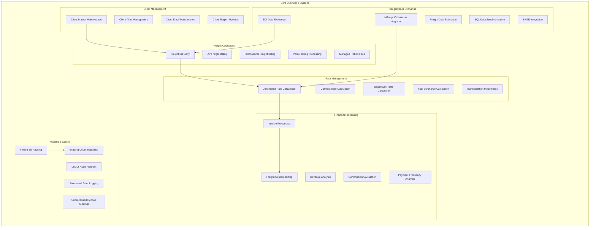
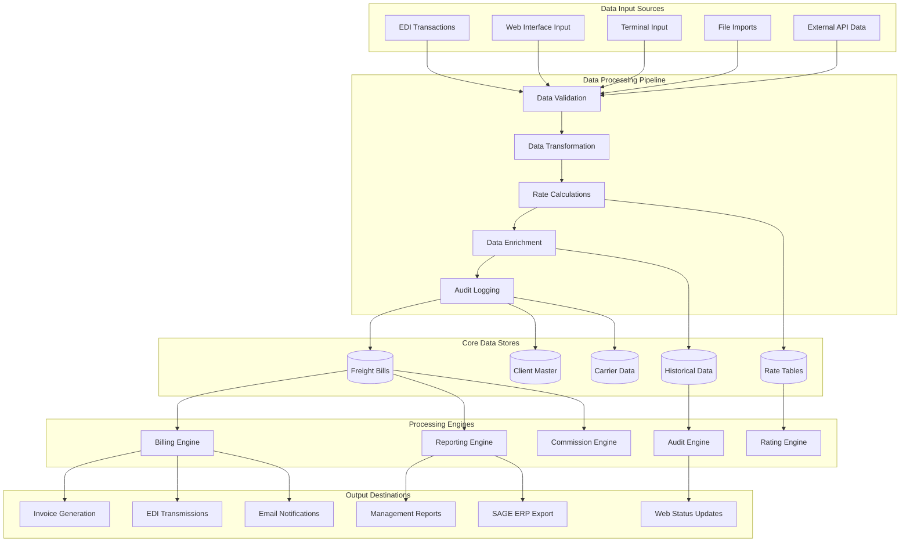
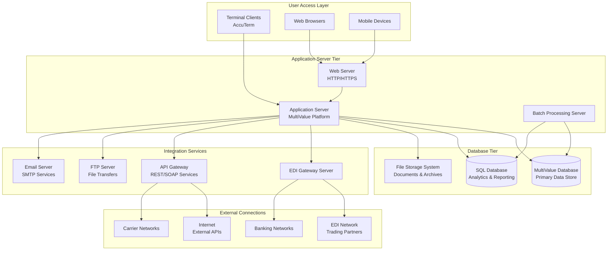
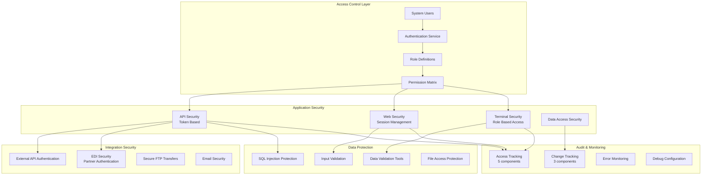

# AFS Freight Billing & Logistics Management System
## Architecture Views and Diagrams

### System Overview

The AFS Freight Billing and Logistics Management System is a comprehensive enterprise platform with **1,779,447 lines of code** across **2,333 files**. It implements end-to-end freight billing and logistics operations management with the following key characteristics:

- **Architecture**: Multi-layered enterprise system built on MultiValue Database Platform
- **Interface**: Terminal-based interface with web integration capabilities
- **Integration**: Extensive EDI, REST, and external service integrations
- **Scale**: Supports multiple shipment types (LTL, Truckload, Air Freight)

---

## 1. High-Level Architecture View

```mermaid
graph TB
    subgraph "External Systems"
        EDI[EDI Partners]
        PC[PC Miler]
        RW[RateWareXL]
        CC[Carrier Connect]
        SAGE[SAGE ERP]
        TEMPO[TEMPO Web Service]
        UPS[UPS Tracking]
        FX[FedEx Tracking]
    end
    
    subgraph "AFS Freight System"
        subgraph "Presentation Layer (104 files)"
            UI[Terminal Interface]
            WEB[Web Interface]
            RPT[Reporting Engine]
        end
        
        subgraph "Application Layer (1,176 files)"
            BL[Business Logic - 304 files]
            MAINT[Maintenance - 129 files]
            REPORT[Reporting - 155 files]
        end
        
        subgraph "Integration Layer (918 files)"
            WI[Web Integration - 9 files]
            DP[Data Processing - 85 files]
            ES[External Services - 122 files]
            FP[File Processing - 243 files]
        end
        
        subgraph "Data Layer (874 files)"
            VAL[Validation - 2 files]
            RET[Retrieval - 43 files]
            MAINT_DATA[Maintenance - 331 files]
            MIG[Migration - 61 files]
        end
        
        subgraph "Cross-Cutting Concerns (42 files)"
            SEC[Security & Auth]
            AUDIT[Auditing]
            PERF[Performance]
            DIAG[Diagnostics]
        end
    end
    
    subgraph "Data Storage"
        MV[(MultiValue Database)]
        SQL[(SQL Database)]
        FILES[File System]
    end
    
    %% External connections
    EDI --> ES
    PC --> ES
    RW --> ES
    CC --> ES
    SAGE --> ES
    TEMPO --> ES
    UPS --> ES
    FX --> ES
    
    %% Internal flow
    UI --> BL
    WEB --> BL
    BL --> DP
    BL --> ES
    DP --> RET
    DP --> MAINT_DATA
    ES --> MV
    ES --> SQL
    FP --> FILES
    
    %% Reporting
    REPORT --> RET
    RPT --> REPORT
    
    %% Cross-cutting
    SEC -.-> BL
    AUDIT -.-> DP
    PERF -.-> ES
    DIAG -.-> FP
```

---

## 2. Functional Architecture View

---

## 3. Data Flow Architecture

---

## 4. Integration Architecture

```mermaid
graph TB
    subgraph "AFS Core System"
        CORE[Freight Billing Core]
        RATING[Rating Engine]
        BILLING[Billing Engine]
    end
    
    subgraph "External Rate Services"
        RATEXL[RateWareXL<br/>Rate Calculation]
        PCMILER[PC Miler<br/>Mileage Calculation]
        TEMPO_SVC[TEMPO Web Service<br/>Cost Estimation]
        SMC3[SMC3 Integration<br/>LTL Rates]
        OLA[OLA Integration<br/>Rate Lookup]
    end
    
    subgraph "Carrier Integrations"
        UPS_API[UPS Tracking API]
        FEDEX_API[FedEx Tracking API]
        CARRIER_CONN[Carrier Connect<br/>Transit Times]
        EDI_CARRIERS[EDI Carrier Partners]
    end
    
    subgraph "Financial Systems"
        SAGE_ERP[SAGE ERP System]
        BANK_EDI[Banking EDI]
        AP_SYSTEM[Accounts Payable]
    end
    
    subgraph "Communication Services"
        EMAIL_SVC[Email Services]
        SMS_SVC[SMS Notifications]
        FTP_SVC[FTP File Transfer]
        WEB_API[Web API Services]
    end
    
    subgraph "Document Processing"
        OCR_SVC[OCR Processing]
        PDF_GEN[PDF Generation]
        DOC_MGMT[Document Management]
    end
    
    %% Integration patterns
    CORE <==> RATEXL
    CORE <==> PCMILER
    CORE <==> TEMPO_SVC
    CORE <==> SMC3
    CORE <==> OLA
    
    CORE <==> UPS_API
    CORE <==> FEDEX_API
    CORE <==> CARRIER_CONN
    CORE <==> EDI_CARRIERS
    
    BILLING <==> SAGE_ERP
    BILLING <==> BANK_EDI
    BILLING <==> AP_SYSTEM
    
    CORE --> EMAIL_SVC
    CORE --> SMS_SVC
    CORE <==> FTP_SVC
    CORE <==> WEB_API
    
    CORE <==> OCR_SVC
    BILLING --> PDF_GEN
    CORE <==> DOC_MGMT
```

---

## 5. Technology Stack Architecture

```mermaid
graph TB
    subgraph "Presentation Technologies"
        TERM[Terminal Interface<br/>AccuTerm Integration]
        WEB_UI[Web Interface<br/>HTML/JavaScript]
        SCREEN[Screen Output With CRT]
    end
    
    subgraph "Application Technologies"
        MV_LANG[MultiValue Programming]
        MOD_ARCH[Modular Program Architecture]
        BATCH[Batch Processing Support]
        GEN_IN[GEN IN Input Handling]
    end
    
    subgraph "Integration Technologies"
        EDI_PROC[EDI Processes<br/>X12/EDIFACT]
        REST_API[REST API Integration]
        REST_CLIENT[REST Client Integration]
        SOAP_CLIENT[SOAP Client Services]
        XML_PROC[XML Data Exchange]
        FTP_INT[FTP Integration]
    end
    
    subgraph "Data Technologies"
        MV_DB[MultiValue Database Platform]
        SQL_INT[SQL Database Integration]
        DATA_VAL[Data Validation Tools]
        SOUNDEX[Soundex Search Capability]
        HIST_AUDIT[Historical Data Auditing]
    end
    
    subgraph "Infrastructure Technologies"
        AUTO_FILE[Automated File Creation]
        AUTO_MIGRATE[Automated Data Migration]
        ERROR_LOG[Automated Error Logging]
        EMAIL_AUTO[Automated Email Notifications]
        ROLE_SEC[Role Based Access]
    end
    
    subgraph "External Service Technologies"
        PCMILER_INT[PC Miler Integration]
        RATEXL_INT[RateWareXL Integration]
        CARRIER_INT[Carrier Connect Integration]
        TEMPO_INT[TEMPO Web Service]
        SAGE_INT[SAGE Integration]
        OCR_INT[OCR Integration]
        GMAPS_INT[Google Maps API Integration]
    end
    
    %% Technology relationships
    TERM --> MOD_ARCH
    WEB_UI --> REST_API
    MOD_ARCH --> MV_DB
    EDI_PROC --> XML_PROC
    REST_CLIENT --> PCMILER_INT
    SQL_INT --> HIST_AUDIT
    AUTO_FILE --> DATA_VAL
```

---

## 6. Physical Deployment View

---

## 7. Security Architecture

---

## Architecture Summary

### Key Metrics
- **Total Files**: 2,333 files across all tiers
- **Code Volume**: 1,779,447 lines of code
- **Architecture Layers**: 6 primary layers with 42 cross-cutting components
- **Business Functions**: 50 documented business function subjects
- **Technology Integrations**: 40+ documented technology subjects

### Architectural Strengths
1. **Modular Design**: Clear separation of concerns across layers
2. **Extensive Integration**: 918 integration layer files supporting external services
3. **Comprehensive Auditing**: Robust audit and tracking capabilities
4. **Scalable Data Layer**: 874 files supporting complex data operations
5. **Rich Business Logic**: 1,176 application layer files implementing core functionality

### Technology Ecosystem
- **Core Platform**: MultiValue Database with SQL integration
- **Interface**: Terminal-based with web capabilities
- **Integration**: EDI, REST, SOAP, FTP, and specialized logistics APIs
- **External Services**: Rating engines, mileage calculation, carrier tracking
- **Security**: Role-based access with comprehensive auditing

This architecture supports a comprehensive freight billing and logistics management platform capable of handling complex enterprise-scale operations with extensive external system integrations.
