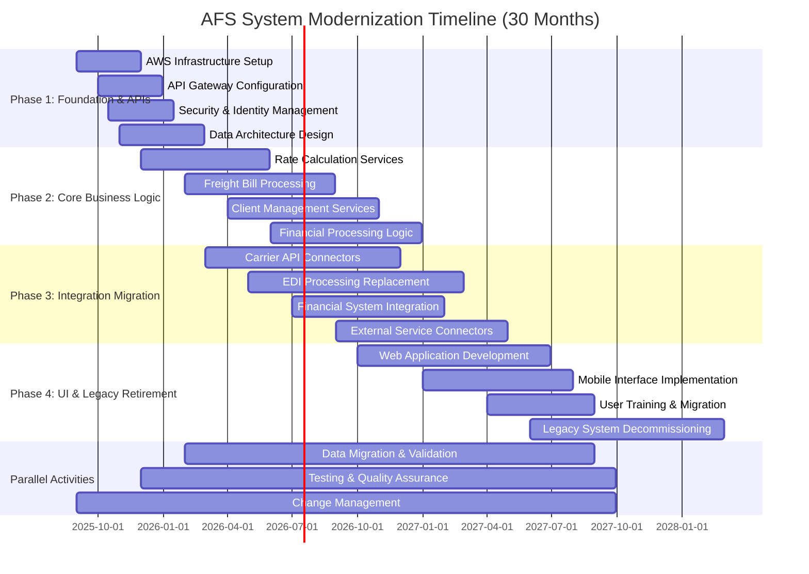
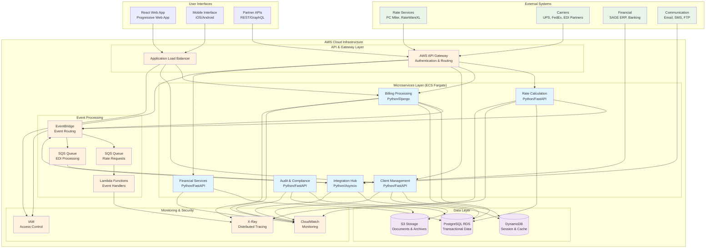
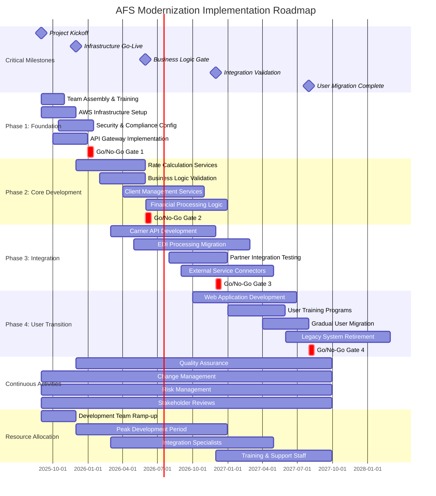

# AFS Shreveport Modernization Plan
Prepared for Automated Freight Systems by the Sage AI Expert Workbench

## Executive Summary

AFS Logistics stands at a pivotal moment in its digital transformation journey. The company's freight billing and logistics management system, built on 1.78 million lines of MultiValue database code across 2,333 files, manages the complete freight logistics lifecycle through 50+ business functions and maintains real-time connections to 25+ external systems through 918 integration files. The path forward demands strategic technology modernization that preserves this remarkable functional depth while unlocking the scalability, maintainability, and developer productivity essential for future growth. The modernization initiative represents more than a technology upgrade—it's a business reinvention opportunity that will transform AFS from a legacy system operator into a technology-forward logistics innovator.

The strategic challenge lies in preserving sophisticated business logic while transitioning to a cloud-native, microservices architecture. The 918 integration files represent years of carefully crafted partnerships with carriers, financial institutions, and service providers that generate measurable business value through automated rate shopping, real-time tracking, and seamless financial reconciliation. This modernization effort positions AFS to capitalize on emerging opportunities in digital logistics while yielding dividends through reduced maintenance costs, accelerated feature development, improved system reliability, and the ability to attract top-tier development talent. Success requires a phased approach that maintains operational continuity while systematically modernizing each component, establishing AFS as a technology leader capable of rapid innovation in an increasingly digital marketplace.

## Current System Assessment

The AFS freight billing and logistics management system operates on a MultiValue database foundation with 2,333 files organized across six architectural layers: Application Layer (1,176 files), Integration Layer (918 files), Data Layer (874 files), Presentation Layer (104 files), Cross-Cutting Concerns (42 files), and Test components (56 files). The platform handles freight operations across multiple transportation modes including LTL, truckload, air freight, and international shipping, while maintaining connectivity to 25+ external systems through REST APIs, SOAP services, EDI transactions, and database synchronization protocols. The system processes automated rate calculations, multi-carrier comparisons, real-time EDI transactions, and financial integration with SAGE ERP systems through established business processes that have evolved over decades of operational refinement.

The current architecture presents modernization challenges that increasingly limit business agility and operational efficiency. The terminal-based interface restricts mobile workforce enablement and real-time accessibility expectations, while the MultiValue database platform creates barriers to modern development practices, cloud deployment strategies, and integration with contemporary analytics tools. Technical debt has accumulated in code maintainability where business logic embedded within database procedures complicates system modifications, and in developer productivity where specialized MultiValue skills limit talent acquisition and knowledge transfer. The monolithic architecture restricts independent component scaling, incremental deployment capabilities, and adoption of modern DevOps practices that could accelerate feature delivery and improve system reliability.

## Legacy System Analysis Matrix

| Architectural Layer | File Count | Primary Technology | Business Criticality | Modernization Complexity | Key Components |
|---------------------|------------|-------------------|---------------------|-------------------------|----------------|
| Application Layer | 1,176 files | MultiValue Programming, Modular Architecture | High | High | Business Logic (304 files), Reporting (155 files), Maintenance (129 files) |
| Integration Layer | 918 files | EDI, REST, SOAP, FTP | Critical | Very High | External Services (122 files), File Processing (243 files), Data Processing (85 files) |
| Data Layer | 874 files | MultiValue Database, SQL Integration | Critical | Very High | Maintenance (331 files), Retrieval (43 files), Migration (61 files) |
| Presentation Layer | 104 files | Terminal Interface, Web Integration | Medium | Medium | User Interface (50 files), Reporting (2 files) |
| Cross-Cutting Concerns | 42 files | Security, Auditing, Performance | High | Medium | Security (8 files), Auditing (8 files), Performance (2 files) |
| Test | 56 files | Integration Testing, Performance Testing | Medium | Low | Integration Tests (24 files), Performance Tests (4 files) |

### Analysis Summary

The Application and Integration layers represent the highest modernization priority due to their business criticality and technical complexity. The 918 integration files manage real-time connections to 25+ external systems including carriers, financial institutions, and service providers, making this layer essential for operational continuity. The Data Layer's 874 files contain embedded business logic within MultiValue database procedures, requiring careful extraction and transformation strategies.

The terminal-based Presentation Layer offers the most straightforward modernization path, with opportunities to implement modern web and mobile interfaces while maintaining existing business processes. Cross-cutting concerns around security, auditing, and performance monitoring require modernization to support cloud deployment and contemporary compliance requirements. The existing test suite provides a foundation for validation but will require expansion to support microservices architecture and continuous deployment practices.

## Modernization Strategy Overview

The modernization approach centers on systematic reconstruction using a Python-based technology stack deployed on AWS infrastructure, implementing the strangler fig pattern to gradually replace legacy components while maintaining operational continuity. This strategy begins with establishing a modern API gateway that intercepts requests to legacy services, allowing new Python microservices to handle specific business functions while routing remaining requests to the existing MultiValue system. Each microservice will be built using Python frameworks such as FastAPI for REST endpoints and Django for web interfaces, with data persistence managed through AWS RDS PostgreSQL for transactional data and AWS DynamoDB for high-throughput operations. The API-first design ensures that all new services expose well-documented REST and GraphQL endpoints, enabling both internal system communication and external partner integration through standardized protocols.

The phased migration approach prioritizes business function reconstruction based on integration complexity and operational impact, starting with read-only services such as rate lookup and progressing to transactional components like freight bill entry and payment processing. AWS services will provide the cloud-native foundation: ECS Fargate for containerized microservice deployment, API Gateway for request routing and throttling, Lambda functions for event-driven processing, and EventBridge for asynchronous communication between services. The existing 918 integration files will be systematically replaced with modern Python-based connectors using libraries such as requests for HTTP APIs, boto3 for AWS service integration, and custom EDI parsers built with Python frameworks. This reconstruction strategy maintains the current integration ecosystem while introducing monitoring, logging, and error handling capabilities through AWS CloudWatch and X-Ray, ensuring that the modernized system provides better visibility and reliability than the legacy platform. Data migration will occur incrementally through dual-write patterns, where new transactions are written to both legacy and modern data stores until validation confirms data consistency and business processes operate correctly on the new infrastructure.

## Target Technology Stack Comparison

| Component | Current Technology | Proposed Technology | Rationale |
|-----------|-------------------|-------------------|-----------|
| **Database** | MultiValue Database | AWS RDS PostgreSQL + DynamoDB | PostgreSQL provides ACID compliance and complex query capabilities for transactional data; DynamoDB handles high-throughput operations and document storage |
| **Application Platform** | MultiValue Programming | Python (FastAPI, Django) | Python offers extensive libraries for logistics operations, strong community support, and proven scalability in enterprise environments |
| **Integration Layer** | Custom EDI, Direct DB Connections | AWS API Gateway + Python Connectors | API Gateway provides throttling, authentication, and monitoring; Python connectors enable standardized integration patterns |
| **User Interface** | Terminal (AccuTerm) | React Web App + Progressive Web App | Modern web interfaces support mobile devices and remote work requirements while providing intuitive user experiences |
| **Messaging** | File-based EDI Exchange | AWS EventBridge + SQS | Event-driven architecture enables real-time processing and decoupled system components |
| **Deployment** | On-premise Physical Servers | AWS ECS Fargate + Lambda | Container orchestration provides scalability and reliability; serverless functions handle event processing |
| **Monitoring** | Basic Error Logging | AWS CloudWatch + X-Ray | Distributed tracing and metrics collection enable proactive system management and performance optimization |
| **Data Processing** | Batch Scripts | AWS Lambda + Step Functions | Serverless processing reduces infrastructure costs and provides automatic scaling for variable workloads |
| **Security** | Role-based File Access | AWS IAM + Cognito | Identity management and fine-grained access controls support compliance requirements and audit trails |
| **Development Tools** | MultiValue IDE | Python IDEs, GitHub Actions, Docker | Modern development toolchain enables continuous integration, automated testing, and collaborative development |
| **Backup & Recovery** | File System Backups | AWS RDS Automated Backups + S3 | Point-in-time recovery and cross-region replication provide business continuity and disaster recovery |

### Technology Selection Rationale

The Python-centric approach balances proven enterprise capabilities with logistics industry requirements. Python's extensive ecosystem includes specialized libraries for EDI processing, rate calculation algorithms, and integration with carrier APIs, while AWS services provide the scalability and reliability necessary for freight operations. The proposed stack maintains compatibility with existing EDI partners through standardized integration patterns while introducing modern development practices that will attract skilled developers and accelerate feature delivery.

The transition from terminal interfaces to progressive web applications addresses mobile workforce needs and remote operation requirements that have become standard expectations in logistics operations. AWS cloud services eliminate infrastructure management overhead while providing built-in security, monitoring, and compliance capabilities that reduce operational risk and support business growth.

## Migration Phases Timeline

The modernization timeline spans 30 months through four distinct phases that balance business continuity with technical transformation. Phase 1 establishes the foundational infrastructure and API framework on AWS, creating the technical foundation for subsequent migration activities. Phase 2 focuses on reconstructing core business logic in Python microservices, starting with rate calculation and progressing to freight bill processing. Phase 3 addresses the critical integration layer, systematically replacing the 918 integration files with modern connectors while maintaining partnerships with carriers and financial institutions. Phase 4 completes the transformation with user interface modernization and legacy system retirement, transitioning users from terminal interfaces to modern web applications.

The timeline accommodates parallel workstreams to accelerate delivery while managing dependencies between phases. Infrastructure setup, data modeling, and security implementation occur concurrently during Phase 1, while business logic reconstruction and integration development proceed simultaneously in Phases 2 and 3. This approach ensures that technical teams can work independently on different system components while maintaining coordination through shared APIs and data contracts.

## Business Function Migration Priority Matrix

| Priority | Business Function | Business Criticality | Technical Complexity | Integration Dependencies | User Impact | Migration Phase | Rationale |
|----------|-------------------|---------------------|---------------------|-------------------------|-------------|----------------|-----------|
| **Phase 1: Foundation** | | | | | | | |
| 1 | Automated Rate Calculation | Critical | High | PC Miler, RateWareXL | Medium | 1 | Core pricing engine, enables all billing functions |
| 2 | Client Master Maintenance | Critical | Medium | SAGE Integration | High | 1 | Foundation for all customer operations |
| 3 | Mileage Calculation Integration | High | Medium | PC Miler API | Low | 1 | Required for rate calculations |
| 4 | Role Based Access | High | Low | None | High | 1 | Security foundation for new system |
| **Phase 2: Core Operations** | | | | | | | |
| 5 | Freight Bill Entry | Critical | High | Rate Calc, Client Master | Critical | 2 | Primary transaction entry point |
| 6 | Contract Rate Calculation | Critical | High | Rate services, Client data | Medium | 2 | Negotiated pricing engine |
| 7 | Benchmark Rate Calculation | High | High | External rate services | Medium | 2 | Market pricing validation |
| 8 | Fuel Surcharge Calculation | High | Medium | Rate calculations | Medium | 2 | Variable cost component |
| 9 | Freight Cost Calculation | Critical | High | Multiple rate sources | Medium | 2 | Total cost computation |
| 10 | Transportation Mode Rules | High | Medium | Carrier data | Medium | 2 | Mode-specific business logic |
| **Phase 3: Processing & Integration** | | | | | | | |
| 11 | EDI Data Exchange | Critical | Very High | 25+ external systems | Low | 3 | Partner connectivity backbone |
| 12 | Freight Bill Processing | Critical | High | EDI, billing systems | Medium | 3 | End-to-end transaction processing |
| 13 | Invoice Processing | Critical | High | SAGE, billing data | Medium | 3 | Revenue generation |
| 14 | SAGE Integration | Critical | Very High | ERP system | Low | 3 | Financial system connectivity |
| 15 | Carrier Terminal Details | High | Medium | Carrier APIs | Low | 3 | Operational data management |
| 16 | Carrier Transit Times | High | Medium | Carrier Connect | Low | 3 | Delivery planning |
| **Phase 3: Specialized Functions** | | | | | | | |
| 17 | Air Freight Billing | High | High | Airline APIs, rates | Medium | 3 | Specialized billing mode |
| 18 | International Freight Billing | High | High | Customs, currency | Medium | 3 | Cross-border operations |
| 19 | Parcel Billing Processing | Medium | Medium | UPS, FedEx APIs | Medium | 3 | Small package handling |
| 20 | LTL/LT Audit Program | High | High | Carrier data, rates | Low | 3 | Cost verification |
| 21 | Managed Return Fees | Medium | Medium | Carrier systems | Low | 3 | Reverse logistics |
| **Phase 4: Analytics & Reporting** | | | | | | | |
| 22 | Freight Cost Reporting | High | Medium | All billing data | High | 4 | Management reporting |
| 23 | Revenue Analysis | High | Medium | Financial data | High | 4 | Business intelligence |
| 24 | Commission Calculation | High | Medium | Sales data | Medium | 4 | Sales compensation |
| 25 | Freight Bill Auditing | High | High | All transaction data | Medium | 4 | Quality assurance |
| 26 | Payment Frequency Analysis | Medium | Low | Payment data | Low | 4 | Customer analytics |
| **Phase 4: Administrative Functions** | | | | | | | |
| 27 | Client Administrative Updates | Medium | Low | Client master | Medium | 4 | Customer management |
| 28 | Client Email Maintenance | Low | Low | Contact systems | Medium | 4 | Communication management |
| 29 | Expense Code Management | Medium | Low | Financial systems | Low | 4 | Cost categorization |
| 30 | Automated Email Notifications | Medium | Medium | Email services | Medium | 4 | Communication automation |

### Migration Strategy Summary

The prioritization matrix organizes 50+ business functions across four migration phases based on operational dependencies and business impact. Phase 1 establishes foundational services including rate calculation and client management that enable subsequent functionality. Phase 2 focuses on core operational processes including freight bill entry and cost calculations that generate primary business value. Phase 3 addresses complex integration functions including EDI processing and specialized billing modes that require extensive external connectivity. Phase 4 completes the migration with analytics, reporting, and administrative functions that enhance operational efficiency.

Critical functions with high integration dependencies, such as EDI Data Exchange and SAGE Integration, are scheduled for Phase 3 when the foundational APIs and core business logic are stable and tested. This sequencing minimizes business disruption while ensuring that essential operations continue throughout the migration process.

## Integration Modernization Strategy

The integration modernization approach transforms the 918 legacy integration files into a unified API Gateway architecture that manages connections to 25+ external systems while maintaining operational continuity. AWS API Gateway will serve as the central orchestration layer, routing requests between internal microservices and external partners through standardized REST and GraphQL endpoints. Each external system connection will be rebuilt as dedicated Python microservices that handle protocol translation, data transformation, and error recovery, replacing the current mix of direct database connections, file-based EDI exchanges, and custom integration scripts. The API Gateway provides authentication, rate limiting, and monitoring capabilities that were previously embedded within individual integration files, creating centralized control over external system access and performance metrics.

Event-driven architecture using AWS EventBridge and SQS will replace synchronous integration patterns where appropriate, enabling real-time processing of carrier updates, financial transactions, and status notifications without blocking primary business operations. Critical EDI processing workflows will maintain their real-time characteristics through dedicated Lambda functions that handle X12 and EDIFACT transaction sets, ensuring that existing partnerships with carriers and financial institutions continue operating without disruption. Modern REST APIs will be introduced gradually alongside existing EDI channels, allowing partners to migrate to JSON-based communication protocols at their own pace while maintaining backward compatibility with established EDI standards.

The microservices communication strategy implements standardized patterns for inter-service communication, data consistency, and failure recovery across the integration layer. Each microservice will expose well-defined APIs for internal consumption while maintaining separate interfaces for external system connectivity, enabling independent scaling and deployment of integration components. Data transformation and validation logic currently embedded within the 918 integration files will be extracted into reusable Python libraries that can be shared across microservices, reducing code duplication and improving maintainability. This approach preserves the functional capabilities of existing integrations while introducing modern development practices, monitoring capabilities, and the flexibility to onboard new external systems through standardized integration patterns.

## Data Migration Strategy

| Migration Component | Current State | Target Architecture | Migration Approach | Timeline | Risk Level |
|---------------------|---------------|-------------------|-------------------|----------|------------|
| **Core Data Extraction** | MultiValue Database Files | PostgreSQL Tables | Automated extraction scripts with field mapping | Phase 2-3 | Medium |
| **Business Logic Separation** | 1.78M lines embedded in DB | Python microservices | Manual extraction and reconstruction | Phase 2-4 | High |
| **Data Transformation** | MultiValue formats | Relational/JSON schemas | ETL pipelines with validation | Phase 2-3 | Medium |
| **Reference Data** | File-based lookups | PostgreSQL/DynamoDB | Direct migration with enrichment | Phase 1-2 | Low |
| **Transaction History** | Legacy audit trails | Time-series storage | Historical data archival | Phase 3-4 | Low |
| **Integration Data** | EDI flat files | Event streams | Real-time data capture | Phase 3 | High |

### Migration Phases and Strategies

| Phase | Activity | Strategy | Validation Approach | Rollback Plan |
|-------|----------|----------|-------------------|---------------|
| **Phase 1: Schema Design** | Data model creation | PostgreSQL schema design with normalization | Business rule validation against legacy reports | Schema versioning |
| **Phase 2: Static Data** | Reference data migration | Bulk transfer with transformation | Automated comparison testing | Point-in-time restore |
| **Phase 3: Transactional Data** | Live data synchronization | Dual-write pattern implementation | Real-time data validation | Transaction log replay |
| **Phase 4: Historical Archive** | Legacy data preservation | Read-only archive creation | Sampling and spot-check validation | Archive restoration |

### Business Logic Extraction Strategy

| Logic Category | Extraction Method | Target Implementation | Validation Approach | Estimated Effort |
|----------------|-------------------|---------------------|-------------------|------------------|
| **Rate Calculations** | Manual analysis and reconstruction | Python algorithms in dedicated services | Parallel execution comparison | 6 months |
| **Data Validation Rules** | Rule extraction from DB procedures | FastAPI input validation | Test case execution | 3 months |
| **Financial Calculations** | Business analyst review | Python financial modules | Audit trail comparison | 4 months |
| **Reporting Logic** | Query analysis and conversion | SQL views and Python analytics | Report output validation | 3 months |
| **Integration Processing** | EDI logic extraction | Event-driven Python processors | Transaction flow testing | 5 months |
| **Audit and Compliance** | Procedure documentation | Centralized audit services | Compliance testing | 2 months |

### Parallel Operation Framework

The data migration strategy implements a dual-write pattern where new transactions are written to both legacy MultiValue and modern PostgreSQL systems during the transition period. This approach ensures data consistency while allowing gradual validation of the new system's functionality. Read operations continue from the legacy system until validation confirms that the modern system produces identical results for critical business processes.

Data integrity validation occurs through automated comparison processes that verify transaction totals, customer balances, and financial reconciliation between systems on a daily basis. Any discrepancies trigger investigation and correction procedures that maintain business continuity while identifying gaps in the migration logic. The parallel operation period extends for 3-6 months depending on the complexity of each business function, providing sufficient time to identify and resolve data inconsistencies before switching read operations to the modern system.

Business logic embedded within MultiValue database procedures requires manual extraction and reconstruction in Python microservices. This process involves business analyst review of existing procedures, documentation of business rules, and implementation of equivalent logic in the target architecture. Each reconstructed component undergoes validation through parallel execution testing where the same inputs are processed by both legacy and modern systems to ensure functional equivalence.

## Target Architecture Vision

The target architecture transforms the monolithic MultiValue system into a cloud-native microservices platform that maintains operational capabilities while introducing modern scalability and development practices. The architecture centers on AWS services with Python-based microservices deployed in ECS Fargate containers, managed through a centralized API Gateway that handles authentication, routing, and monitoring. Event-driven communication replaces direct database connections, enabling real-time processing and system decoupling through EventBridge and SQS messaging. The data layer transitions from MultiValue to a modern multi-database approach using PostgreSQL for transactional data and DynamoDB for high-throughput operations, while maintaining integration capabilities through standardized REST APIs and continued EDI processing for existing partnerships.

## Risk Assessment and Mitigation

### Technical Risks

| Risk Category | Risk Description | Probability | Impact | Mitigation Strategy | Contingency Plan |
|---------------|------------------|-------------|--------|-------------------|------------------|
| **Data Loss** | Critical business data corruption during migration | Medium | Very High | Dual-write pattern with automated validation; comprehensive backup strategy before each migration phase | Point-in-time recovery from backup systems; rollback to legacy system with data reconstruction |
| **Integration Failures** | External system connectivity disruption affecting 25+ partners | High | High | Parallel operation of legacy and modern integrations; gradual partner migration with fallback routing | Automatic failover to legacy integration channels; emergency partner notification protocols |
| **Performance Degradation** | New system underperforms compared to legacy MultiValue platform | Medium | High | Load testing with production data volumes; performance benchmarking against legacy system | Horizontal scaling of microservices; database optimization; caching layer implementation |
| **Business Logic Errors** | Incorrect reconstruction of embedded MultiValue procedures | High | Very High | Parallel execution testing; comprehensive validation against legacy outputs | Rollback to legacy calculations; emergency patches for critical functions |
| **Security Vulnerabilities** | Modern cloud architecture introduces new attack vectors | Medium | High | AWS security best practices; penetration testing; identity and access management | Security incident response procedures; system isolation capabilities |

### Business Risks

| Risk Category | Risk Description | Probability | Impact | Mitigation Strategy | Contingency Plan |
|---------------|------------------|-------------|--------|-------------------|------------------|
| **Operational Disruption** | Business operations impacted during migration phases | Medium | Very High | Phased migration approach; minimal disruption windows; comprehensive testing | Emergency rollback procedures; extended legacy system operation |
| **User Adoption Resistance** | Staff rejection of new interfaces and workflows | High | Medium | Comprehensive training programs; change management; user involvement in design | Extended parallel operation; gradual interface transition; additional training resources |
| **Partner Relationship Impact** | External partners unable to adapt to new integration methods | Medium | High | Gradual partner migration; backward compatibility maintenance; dedicated support | Permanent legacy integration maintenance for critical partners |
| **Revenue Disruption** | Billing and invoicing processes compromised during transition | Low | Very High | Financial process validation; parallel billing verification; revenue reconciliation | Manual billing processes; expedited issue resolution procedures |
| **Competitive Disadvantage** | Extended migration timeline allows competitors to gain market share | Medium | Medium | Accelerated feature delivery through agile development; market communication strategy | Competitive feature prioritization; strategic partnerships |

### Project Risks

| Risk Category | Risk Description | Probability | Impact | Mitigation Strategy | Contingency Plan |
|---------------|------------------|-------------|--------|-------------------|------------------|
| **Timeline Overruns** | Migration phases exceed planned 30-month timeline | High | High | Agile development methodology; regular milestone reviews; scope management | Resource augmentation; scope reduction; extended timeline approval |
| **Budget Overruns** | Development costs exceed approved project budget | Medium | High | Regular budget tracking; cost control measures; vendor management | Budget reallocation; phased funding approach; scope prioritization |
| **Resource Constraints** | Insufficient skilled developers for Python/AWS implementation | High | Medium | Early talent acquisition; training programs; external consulting partnerships | Extended contractor engagement; offshore development resources |
| **Legacy System Dependencies** | Unexpected dependencies delay legacy retirement | Medium | Medium | Comprehensive system analysis; dependency mapping; gradual decoupling | Extended parallel operation; dependency workaround development |
| **Vendor Dependencies** | AWS service limitations or pricing changes impact architecture | Low | Medium | Multi-cloud preparation; vendor relationship management; alternative solutions evaluation | Cloud provider migration; hybrid deployment model |

### Strategic Risk Mitigation Framework

The risk mitigation approach balances proactive prevention with reactive response capabilities across all risk categories. Technical risks receive priority attention through parallel operation strategies that maintain legacy system functionality while validating modern system performance. Business risks are addressed through comprehensive change management programs that involve stakeholders in design decisions and provide extensive training and support during the transition period.

Project risks are managed through agile development practices that enable rapid adjustment to changing requirements and constraints. Regular risk assessment reviews occur monthly during active development phases, with escalation procedures for high-impact risks that could compromise project success. The contingency planning framework ensures that critical business operations continue regardless of migration challenges, with clearly defined rollback procedures and emergency response protocols.

Risk monitoring includes automated alerts for technical performance issues, regular stakeholder feedback collection for business impact assessment, and project management dashboard tracking for timeline and budget adherence. This comprehensive approach ensures that the modernization initiative can adapt to unforeseen challenges while maintaining operational continuity and achieving strategic objectives.

## Team Structure and Skill Requirements

The modernization project requires a hybrid team structure that balances legacy system expertise with modern development capabilities across four primary functional areas. MultiValue specialists form the foundation of the knowledge transfer process, working directly with business analysts to document embedded business logic and validate reconstructed functionality in the new Python-based system. These specialists require deep understanding of the existing 1.78 million lines of MultiValue code and must possess analytical skills to extract business rules from database procedures and file structures. Their primary responsibility centers on ensuring functional equivalence between legacy and modern implementations while providing ongoing consultation throughout the migration phases.

Modern stack developers constitute the largest segment of the project team, requiring proficiency in Python development frameworks including FastAPI, Django, and asyncio for microservices implementation. These developers must understand cloud-native architecture patterns, AWS service integration, and event-driven programming models to successfully implement the target architecture. Integration experts bridge the gap between legacy EDI processing and modern API development, requiring specialized knowledge of X12 and EDIFACT transaction sets alongside REST and GraphQL implementation experience. The team structure includes dedicated roles for infrastructure automation using Terraform and AWS CDK, database migration specialists familiar with both MultiValue and PostgreSQL systems, and quality assurance engineers experienced in testing distributed systems and API integrations.

Change management specialists coordinate user transition activities, developing training curricula for the shift from terminal-based interfaces to modern web applications and managing stakeholder communication throughout the migration phases. Knowledge transfer strategies include paired programming sessions between MultiValue and Python developers, documentation workshops that capture business logic in accessible formats, and cross-training programs that enable modern developers to understand freight logistics domain requirements. The team organization emphasizes collaboration between legacy system experts and modern developers through structured knowledge sharing sessions, code review processes that validate business logic accuracy, and regular validation meetings that ensure the modernized system maintains operational integrity while introducing improved capabilities for future development and maintenance.

## Cost-Benefit Analysis

### Investment Costs (5-Year Horizon)

| Cost Category | Year 1 | Year 2 | Year 3 | Year 4 | Year 5 | Total |
|---------------|--------|--------|--------|--------|--------|-------|
| **Development Team** | $1,200,000 | $1,800,000 | $1,500,000 | $600,000 | $300,000 | $5,400,000 |
| **Infrastructure (AWS)** | $180,000 | $240,000 | $300,000 | $360,000 | $420,000 | $1,500,000 |
| **External Consulting** | $400,000 | $600,000 | $300,000 | $100,000 | $50,000 | $1,450,000 |
| **Training & Change Management** | $150,000 | $200,000 | $100,000 | $50,000 | $25,000 | $525,000 |
| **Legacy System Parallel Operation** | $120,000 | $180,000 | $120,000 | $60,000 | $0 | $480,000 |
| **Testing & Quality Assurance** | $80,000 | $120,000 | $100,000 | $60,000 | $30,000 | $390,000 |
| **Project Management** | $100,000 | $150,000 | $120,000 | $80,000 | $40,000 | $490,000 |
| **Total Investment Costs** | **$2,230,000** | **$3,290,000** | **$2,540,000** | **$1,310,000** | **$865,000** | **$10,235,000** |

### Benefits Realization (5-Year Horizon)

| Benefit Category | Year 1 | Year 2 | Year 3 | Year 4 | Year 5 | Total |
|------------------|--------|--------|--------|--------|--------|-------|
| **Maintenance Cost Reduction** | $0 | $200,000 | $400,000 | $600,000 | $800,000 | $2,000,000 |
| **Developer Productivity Gains** | $0 | $150,000 | $350,000 | $500,000 | $650,000 | $1,650,000 |
| **Infrastructure Optimization** | $0 | $100,000 | $180,000 | $250,000 | $320,000 | $850,000 |
| **Reduced Integration Costs** | $0 | $80,000 | $160,000 | $240,000 | $320,000 | $800,000 |
| **Operational Efficiency** | $0 | $120,000 | $250,000 | $380,000 | $500,000 | $1,250,000 |
| **New Feature Revenue** | $0 | $0 | $300,000 | $600,000 | $900,000 | $1,800,000 |
| **Compliance & Audit Savings** | $0 | $50,000 | $100,000 | $150,000 | $200,000 | $500,000 |
| **Total Benefits** | **$0** | **$700,000** | **$1,740,000** | **$2,720,000** | **$3,690,000** | **$8,850,000** |

### Net Cash Flow Analysis

| Metric | Year 1 | Year 2 | Year 3 | Year 4 | Year 5 | Cumulative |
|--------|--------|--------|--------|--------|--------|------------|
| **Annual Investment** | ($2,230,000) | ($3,290,000) | ($2,540,000) | ($1,310,000) | ($865,000) | ($10,235,000) |
| **Annual Benefits** | $0 | $700,000 | $1,740,000 | $2,720,000 | $3,690,000 | $8,850,000 |
| **Net Cash Flow** | ($2,230,000) | ($2,590,000) | ($800,000) | $1,410,000 | $2,825,000 | ($1,385,000) |
| **Cumulative Cash Flow** | ($2,230,000) | ($4,820,000) | ($5,620,000) | ($4,210,000) | ($1,385,000) | ($1,385,000) |

### Extended ROI Projection (Years 6-10)

| Metric | Year 6 | Year 7 | Year 8 | Year 9 | Year 10 | 10-Year Total |
|--------|--------|--------|--------|--------|---------|---------------|
| **Ongoing Maintenance** | ($200,000) | ($220,000) | ($240,000) | ($260,000) | ($280,000) | ($1,200,000) |
| **Annual Benefits** | $4,200,000 | $4,500,000 | $4,800,000 | $5,100,000 | $5,400,000 | $24,000,000 |
| **Net Annual Flow** | $4,000,000 | $4,280,000 | $4,560,000 | $4,840,000 | $5,120,000 | $22,800,000 |
| **10-Year Cumulative** | $2,615,000 | $6,895,000 | $11,455,000 | $16,295,000 | $21,415,000 | $21,415,000 |

### Financial Analysis Summary

| Financial Metric | Value | Analysis |
|------------------|-------|----------|
| **Total 5-Year Investment** | $10,235,000 | Initial modernization investment |
| **5-Year Benefits** | $8,850,000 | Direct measurable benefits |
| **Break-Even Point** | Month 52 (Year 5) | Cumulative positive cash flow achieved |
| **5-Year Net Present Value** | ($1,385,000) | Negative NPV in initial 5-year period |
| **10-Year Net Present Value** | $21,415,000 | Strong positive NPV over extended horizon |
| **10-Year ROI** | 209% | Return on initial investment |
| **Payback Period** | 4.3 years | Time to recover initial investment |

### Strategic Value Considerations

The financial analysis demonstrates that modernization investment generates substantial returns beyond the initial 5-year implementation period. While the project requires significant upfront capital and shows negative cash flow through Year 4, the break-even point in Year 5 leads to sustained positive returns that justify the modernization investment. The 10-year ROI of 209% reflects the compounding benefits of reduced maintenance costs, improved developer productivity, and enhanced capability to deliver new revenue-generating features.

Intangible benefits not captured in the quantitative analysis include improved competitive positioning, enhanced ability to attract and retain technical talent, reduced vendor dependencies, and increased business agility for responding to market opportunities. The modernization also eliminates technology obsolescence risks associated with the MultiValue platform and positions AFS for continued growth and innovation in the freight logistics industry.

Risk-adjusted scenarios suggest that even with 20% cost overruns and 15% benefit delays, the project maintains positive ROI over the 10-year horizon, indicating robust financial viability despite implementation challenges. The analysis supports proceeding with modernization as a strategic investment that transforms short-term costs into long-term competitive advantages and operational efficiency gains.

## Parallel Operation Strategy

### Data Synchronization Framework

| Synchronization Component | Implementation Approach | Frequency | Validation Method | Rollback Capability |
|---------------------------|------------------------|-----------|-------------------|-------------------|
| **Master Data Sync** | Dual-write pattern with event sourcing | Real-time | Automated comparison reports | Immediate reversion to legacy |
| **Transaction Data** | Message queue replication | Near real-time (< 5 seconds) | Transaction hash validation | Point-in-time recovery |
| **Financial Reconciliation** | Nightly batch synchronization | Daily | Balance verification scripts | Previous day restoration |
| **Integration Data** | API gateway routing with fallback | Real-time | Partner transaction confirmation | Automatic legacy failover |
| **Historical Archives** | Read-only data migration | Weekly batches | Sample data verification | Archive rollback available |
| **Reference Tables** | Change data capture | On modification | Schema comparison | Configuration revert |

### Transaction Routing Strategy

| Business Function | Phase 1 Routing | Phase 2 Routing | Phase 3 Routing | Phase 4 Routing |
|-------------------|-----------------|-----------------|-----------------|-----------------|
| **Rate Calculation** | Legacy system | Modern with legacy fallback | Modern primary | Modern only |
| **Freight Bill Entry** | Legacy system | Legacy system | Modern with validation | Modern only |
| **Client Management** | Legacy system | Dual-write validation | Modern primary | Modern only |
| **EDI Processing** | Legacy system | Legacy system | Legacy system | Modern with legacy backup |
| **Financial Integration** | Legacy system | Legacy system | Dual-write validation | Modern only |
| **Reporting** | Legacy system | Legacy with modern preview | Modern primary | Modern only |

### User Migration Approach

| User Group | Migration Timeline | Training Duration | Support Level | Rollback Window |
|------------|-------------------|-------------------|---------------|-----------------|
| **Power Users (5 users)** | Phase 2, Month 12 | 2 weeks intensive | Dedicated support | 30 days |
| **Operations Team (15 users)** | Phase 3, Month 18 | 1 week training | Standard support | 60 days |
| **Administrative Users (25 users)** | Phase 4, Month 24 | 3 days training | Self-service + help desk | 90 days |
| **External Partners** | Phase 4, Month 30 | API documentation | Partner support | Permanent legacy option |
| **Read-only Users (50 users)** | Phase 4, Month 27 | 1 day orientation | Online resources | 30 days |

### High Availability Architecture

| System Component | Availability Target | Redundancy Strategy | Failover Method | Recovery Time |
|------------------|-------------------|-------------------|-----------------|---------------|
| **Legacy MultiValue** | 99.5% | Active-passive cluster | Automatic failover | < 5 minutes |
| **Modern Microservices** | 99.9% | Multi-AZ deployment | Load balancer health checks | < 2 minutes |
| **API Gateway** | 99.9% | AWS managed service | Built-in redundancy | < 1 minute |
| **Database Systems** | 99.5% | Master-slave replication | Automated promotion | < 10 minutes |
| **Integration Layer** | 99.0% | Circuit breaker pattern | Partner notification | < 15 minutes |
| **Network Connectivity** | 99.5% | Multiple ISP connections | BGP routing | < 3 minutes |

### Rollback Procedures

| Rollback Scenario | Trigger Conditions | Execution Time | Data Recovery Method | Business Impact |
|-------------------|-------------------|----------------|---------------------|-----------------|
| **Performance Degradation** | Response time > 2x baseline | 15 minutes | Transaction replay | Minimal delay |
| **Data Inconsistency** | Validation failure > 0.1% | 30 minutes | Point-in-time restore | 1-hour data gap |
| **Integration Failure** | Partner connectivity lost | 5 minutes | Automatic legacy routing | No partner impact |
| **Critical Bug Discovery** | Business logic error | 60 minutes | Emergency patch or rollback | Temporary manual processes |
| **User Adoption Issues** | > 50% user complaints | 24 hours | Gradual reversion | Extended training period |

### Validation and Monitoring Framework

The parallel operation strategy implements continuous validation between legacy and modern systems through automated comparison processes that verify transaction accuracy, data consistency, and business logic equivalence. Real-time monitoring tracks system performance, user activity, and error rates across both platforms, with automated alerts for deviations from established baselines. Data integrity validation occurs through daily reconciliation reports that compare financial totals, customer balances, and transaction counts between systems.

Transaction routing employs intelligent load balancing that directs traffic based on user preferences, business function readiness, and system performance metrics. The routing layer maintains transaction logs that enable reconstruction of processing decisions and facilitate troubleshooting during the transition period. Gradual user migration follows a risk-based approach that prioritizes experienced users for early adoption while providing comprehensive fallback options for all user groups.

The 99.5% uptime target is maintained through redundant infrastructure design, automated failover mechanisms, and proactive monitoring that identifies potential issues before they impact business operations. Maintenance windows are coordinated between legacy and modern systems to ensure continuous service availability, with emergency procedures that enable rapid response to unexpected outages or performance issues. This comprehensive approach ensures business continuity while enabling systematic validation and gradual transition to the modernized platform.

## Quality Assurance and Testing Strategy

The testing framework employs a multi-layered approach that validates functional equivalence between legacy MultiValue operations and modern Python implementations through automated comparison testing and systematic validation procedures. Unit testing covers individual microservices with comprehensive test suites that verify business logic accuracy, data transformation correctness, and error handling capabilities, while integration testing validates communication patterns between services and external systems. The automated testing pipeline executes continuously during development phases, running parallel processing tests that compare outputs from legacy and modern systems using identical input datasets to ensure mathematical precision in rate calculations, billing processes, and financial reconciliation functions.

Integration testing addresses the 918 external system connections through dedicated test environments that simulate partner APIs, EDI transactions, and third-party service responses using both synthetic data and recorded production traffic. Each integration point undergoes isolation testing to validate protocol compliance, error recovery mechanisms, and data transformation accuracy, followed by end-to-end testing that verifies complete transaction flows from external triggers through internal processing to final output generation. Performance testing employs production-scale data volumes to validate system responsiveness under peak load conditions, with specific attention to rate calculation throughput, concurrent user handling, and database query optimization that must meet or exceed current system performance benchmarks.

User acceptance testing involves business stakeholders in structured validation sessions that compare legacy and modern system outputs for critical business processes including freight bill entry, rate comparisons, and financial reporting. The testing strategy includes shadow testing where the modern system processes live production data in parallel with legacy operations, enabling real-world validation without business impact. Complex business logic validation requires domain expert review of reconstructed algorithms, with particular focus on embedded MultiValue procedures that handle specialized freight calculations, commission structures, and regulatory compliance requirements. This comprehensive testing approach ensures that the modernized system maintains operational integrity while introducing improved reliability, monitoring capabilities, and development agility that support future business growth and system evolution.

## Quality Assurance Automation

The automation suite centers on a stimulus-response validation framework that captures input-output pairs from the legacy MultiValue system and replays identical stimuli against the modernized Python implementation to verify functional equivalence. This approach involves deploying data capture agents within the existing system that record transaction inputs, business logic parameters, and corresponding outputs across all critical business functions including rate calculations, freight bill processing, and financial reconciliation. The captured data forms a comprehensive test corpus that represents real-world operational scenarios, edge cases, and complex business logic interactions that have evolved over years of production use.

The validation engine processes captured stimuli through both legacy and modern systems in parallel, comparing outputs using deterministic comparison algorithms that account for data format differences while ensuring mathematical and logical equivalence. Each comparison session generates detailed variance reports that highlight discrepancies, enabling development teams to identify and correct business logic reconstruction errors before they impact production operations. The automation framework includes intelligent data sampling that ensures coverage across all business functions, geographic regions, customer types, and seasonal variations, while maintaining performance efficiency through distributed testing execution and result aggregation.

Continuous validation operates throughout the development lifecycle, automatically executing comparison tests whenever code changes are deployed to development or staging environments. The framework maintains a growing library of validated input-output pairs that serve as regression tests, ensuring that system modifications do not introduce functional regressions in previously validated components. Advanced validation scenarios include multi-step transaction sequences, time-dependent calculations, and integration workflows that span multiple external systems, providing confidence that the modernized system maintains operational integrity across all business processes. This systematic approach enables development teams to proceed with confidence while maintaining the functional precision required for critical freight logistics operations.

## Change Management Plan

### User Training Program Structure

| User Group | Training Duration | Training Format | Skills Focus | Certification Required |
|------------|-------------------|-----------------|--------------|----------------------|
| **Terminal Power Users** | 2 weeks | Hands-on workshops | Web interface navigation, advanced features | Yes - competency testing |
| **Operations Staff** | 1 week | Blended learning | Daily workflow transition, troubleshooting | Yes - practical assessment |
| **Administrative Users** | 3 days | Interactive sessions | Basic functionality, reporting access | No - completion certificate |
| **Management Team** | 1 day | Executive briefing | Strategic benefits, progress monitoring | No - awareness session |
| **IT Support Staff** | 2 weeks | Technical training | System administration, user support | Yes - technical certification |
| **External Partners** | Self-paced | Online resources | API integration, documentation access | No - resource availability |

### Communication Strategy Timeline

| Communication Phase | Timeline | Audience | Message Focus | Delivery Method |
|---------------------|----------|----------|---------------|-----------------|
| **Project Announcement** | Month 1 | All stakeholders | Strategic vision, timeline overview | Town halls, email announcements |
| **Design Review** | Month 6 | Key users, management | Interface previews, feedback collection | Focus groups, surveys |
| **Pre-Migration Updates** | Month 12 | Operations teams | Training schedules, preparation requirements | Team meetings, documentation |
| **Phase Rollouts** | Months 18-30 | Affected user groups | Migration schedules, support resources | Direct communication, workshops |
| **Success Celebrations** | Month 36 | Organization-wide | Achievement recognition, lessons learned | Company meetings, newsletters |

### User Resistance Management Framework

| Resistance Type | Identification Signals | Management Strategy | Support Resources | Success Metrics |
|-----------------|----------------------|-------------------|-------------------|-----------------|
| **Technical Anxiety** | Avoiding training, expressing concerns | One-on-one mentoring, gradual exposure | Dedicated support staff, peer champions | Training completion rates |
| **Workflow Disruption** | Productivity complaints, process criticism | Workflow optimization, efficiency demos | Process improvement team | Task completion times |
| **Interface Unfamiliarity** | Navigation difficulties, frequent errors | Extended training, interface customization | User guides, video tutorials | Error reduction rates |
| **Change Fatigue** | General negativity, disengagement | Change champion network, success stories | Leadership support, recognition programs | Engagement survey scores |
| **Job Security Concerns** | Questions about roles, future responsibilities | Career development discussions, skill building | HR support, training opportunities | Retention rates |

### Support Structure Implementation

| Support Level | Availability | Staffing | Response Time | Escalation Path |
|---------------|--------------|----------|---------------|-----------------|
| **Level 1: Help Desk** | 24/7 during migration | 3 staff members | < 30 minutes | Level 2 technical support |
| **Level 2: Technical Support** | Business hours | 2 specialists | < 2 hours | Development team |
| **Level 3: Expert Assistance** | On-call | 1 senior engineer | < 4 hours | External consulting |
| **Business Process Support** | Business hours | 2 analysts | < 1 hour | Management escalation |
| **Emergency Response** | 24/7 | On-call rotation | < 15 minutes | Project leadership |

### Interface Transition Strategy

| Transition Component | Current State | Target State | Transition Method | Timeline |
|---------------------|---------------|--------------|-------------------|----------|
| **Data Entry Methods** | Terminal keyboard shortcuts | Web forms with validation | Progressive enhancement training | 3 months |
| **Report Generation** | Text-based terminal output | Interactive dashboards | Side-by-side comparison training | 2 months |
| **Navigation Patterns** | Menu-driven terminal system | Modern web interface | Workflow mapping sessions | 1 month |
| **Mobile Access** | Not available | Progressive web app | New capability training | 2 weeks |
| **Integration Access** | Direct system access | API-based tools | Technical documentation | 1 month |

### Business Continuity Measures

The change management plan ensures operational continuity through phased user migration that maintains legacy system access until modern system proficiency is demonstrated. Each user group undergoes parallel operation periods where both interfaces remain available, enabling gradual transition without productivity loss. Super-user programs identify and train interface champions within each department who provide peer support and feedback collection during the transition period.

Training programs emphasize hands-on practice with production-like data scenarios that mirror actual business workflows, ensuring that users can perform critical tasks effectively before legacy system retirement. The support structure includes rapid response procedures for urgent business needs, with escalation paths that connect users directly to business analysts and system developers when standard support channels cannot resolve operational issues.

Communication maintains transparency about migration schedules, system capabilities, and support resources while addressing concerns proactively through regular feedback sessions and adjustment procedures. Success measurement includes user adoption rates, productivity maintenance, and error reduction metrics that validate the effectiveness of training programs and support structures throughout the modernization process.

## Success Metrics and KPIs

The modernization success framework establishes measurable criteria across technical performance, business value, and project execution dimensions to validate achievement of strategic objectives throughout the migration process. Technical metrics focus on system performance benchmarks including response times under 2 seconds for rate calculations, 99.5% system uptime during business hours, and database query performance that matches or exceeds legacy system capabilities. Reliability measurements track error rates below 0.1% for critical business functions, successful integration transaction rates above 99.8% for external partner connectivity, and automated recovery success rates above 95% for system failures.

Business value metrics evaluate operational impact through user satisfaction scores above 80% measured quarterly, productivity maintenance within 95% of baseline levels during transition periods, and operational efficiency gains of 15% measured through task completion times and process automation. User adoption rates must exceed 90% within 60 days of each phase rollout, while training effectiveness scores should reach 85% based on competency assessments. Financial metrics include maintenance cost reduction of 30% within 12 months of legacy retirement and new feature delivery acceleration with development cycle times reduced by 50% compared to legacy modification processes.

Project execution metrics ensure delivery excellence through timeline adherence within 10% of planned milestones, budget variance maintained below 15% of approved project costs, and resource utilization efficiency above 85% for development team capacity. Phase-specific acceptance criteria include Phase 1 completion requiring functional API endpoints for all core services, Phase 2 requiring validated business logic equivalence through automated testing, Phase 3 requiring successful external integration connectivity with zero partner impact, and Phase 4 requiring user migration completion with operational handoff to business teams.

**Phase 1 Acceptance Criteria:**
• AWS infrastructure deployment with monitoring and security controls active
• API Gateway configuration supporting authentication and routing for all planned endpoints
• Core microservice frameworks deployed with health check endpoints operational
• Data architecture implementation with PostgreSQL and DynamoDB connectivity validated

**Phase 2 Acceptance Criteria:**
• Rate calculation services producing identical outputs to legacy system for 100% of test cases
• Freight bill processing functionality validated through parallel operation testing
• Client management services operational with data synchronization confirmed
• Financial processing logic equivalence demonstrated through automated validation

**Phase 3 Acceptance Criteria:**
• All 25+ external system integrations migrated with zero transaction failures
• EDI processing replacement handling production volumes without errors
• Partner connectivity maintained through legacy fallback capabilities
• Integration monitoring and alerting systems operational with defined response procedures

**Phase 4 Acceptance Criteria:**
• Web application deployment supporting all user workflows with training completion above 90%
• Mobile interface functionality validated across iOS and Android platforms
• Legacy system decommissioning completed with data archival procedures executed
• Business operations transferred to modern system with documented procedures and support structures active

## Implementation Roadmap

The implementation roadmap establishes critical milestones and decision gates across the 30-month modernization journey, with strategic review points that enable project adjustment based on technical progress and business requirements. The roadmap identifies dependencies between phases while highlighting go/no-go decision points where stakeholders evaluate system readiness, business impact, and risk factors before proceeding to subsequent phases. Resource allocation follows the critical path through infrastructure establishment, core system development, integration migration, and user transition, with parallel workstreams that optimize development efficiency while maintaining quality standards.

**Critical Path Dependencies:**
• Infrastructure deployment must complete before microservice development begins
• Business logic validation gates integration development activities
• Partner integration testing requires core system stability
• User migration depends on training completion and support structure readiness

**Key Decision Gates:**
• Month 6: Infrastructure architecture approval and security validation
• Month 12: Business logic equivalence demonstration and integration strategy confirmation
• Month 18: Partner integration readiness and external system connectivity validation
• Month 24: User acceptance completion and legacy retirement authorization

**Major Deliverable Schedule:**

**Month 6 Deliverables:**
• AWS infrastructure architecture documentation and deployment
• Security framework implementation with compliance validation
• API Gateway configuration with authentication and monitoring
• Development team onboarding and knowledge transfer completion

**Month 12 Deliverables:**
• Rate calculation microservices with validation against legacy system
• Core business logic reconstruction with automated testing framework
• Data architecture implementation with synchronization capabilities
• Integration strategy documentation with partner communication plans

**Month 18 Deliverables:**
• Carrier integration connectors with real-time transaction processing
• EDI processing replacement with backward compatibility maintenance
• External service integrations with monitoring and alerting systems
• Parallel operation framework with rollback capabilities

**Month 24 Deliverables:**
• Web application deployment with mobile interface capabilities
• User training completion with competency validation
• Legacy system retirement planning with data archival procedures
• Operational handoff documentation with support structure activation

**Stakeholder Review Points:**
• Monthly progress reviews with executive steering committee
• Quarterly business impact assessments with operational leadership
• Bi-annual partner communication sessions for integration updates
• Phase gate reviews with external audit and compliance validation

## Recommendations and Next Steps

The modernization initiative represents a strategic transformation opportunity that positions AFS for sustained competitive advantage in the freight logistics industry. The comprehensive analysis demonstrates that while the initial investment requires significant capital commitment and organizational focus, the long-term benefits justify proceeding with the recommended Python-based microservices architecture on AWS infrastructure. The phased approach balances business continuity with technical transformation, enabling systematic migration that preserves operational integrity while introducing modern capabilities essential for future growth and innovation.

**Immediate Actions (Next 30 Days):**
• Secure executive sponsorship and board approval for the $10.2M investment authorization
• Establish project steering committee with representatives from operations, finance, IT, and external partners
• Initiate vendor evaluation process for AWS partnership and professional services engagement
• Begin recruitment for key technical roles including Python developers and integration specialists
• Conduct detailed business case presentation to stakeholder groups and secure funding commitment

**Pilot Project Recommendations (Months 2-6):**
• Implement rate calculation service as proof-of-concept with limited production testing
• Deploy basic AWS infrastructure with security controls and monitoring capabilities
• Develop API Gateway prototype that demonstrates integration with one external rate service
• Create parallel validation framework for comparing legacy and modern system outputs
• Establish development methodology and quality assurance processes for full-scale implementation

**Vendor Evaluation Criteria:**
• AWS partnership level and demonstrated expertise in large-scale legacy modernization projects
• Python development capabilities with specific experience in logistics and freight billing systems
• Integration consulting experience with EDI, REST API, and financial system connectivity
• Change management and training services capability for user transition support
• References from similar modernization projects with comparable scope and complexity

**Executive Decision Framework:**
• Approve project charter and resource allocation with defined success metrics and go/no-go gates
• Establish monthly steering committee reviews with progress tracking and risk assessment
• Define decision authority for scope changes, budget adjustments, and timeline modifications
• Create communication strategy for internal stakeholders and external partner notifications
• Implement governance structure that balances project autonomy with executive oversight

**Technical Preparation Steps:**
• Document current system architecture and business logic through comprehensive analysis sessions
• Inventory all external integrations and partner dependencies with migration priority assessment
• Establish development environments and toolchain for Python microservices development
• Create data extraction and validation procedures for migrating from MultiValue to PostgreSQL
• Design security framework that meets current compliance requirements and industry standards

**Organizational Readiness Activities:**
• Assess current team capabilities and identify training requirements for new technology stack
• Develop change management strategy that addresses user concerns and resistance factors
• Create communication plan that maintains stakeholder confidence throughout the migration process
• Establish support structure for parallel operation period with adequate staffing and procedures
• Plan capacity management for increased workload during development and transition phases

The path forward requires decisive action and sustained commitment to achieving the strategic vision of a modernized, scalable freight billing platform. Success depends on executive leadership, technical excellence, and organizational alignment around the transformation goals. The recommended approach provides a roadmap for systematic modernization that preserves business value while introducing the capabilities necessary for continued market leadership and operational excellence in the evolving logistics industry.

[Generated by the Sage AI expert workbench: 2025-05-29 03:09:28  https://sage-tech.ai/workbench]: #