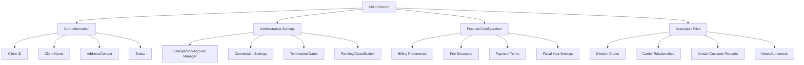
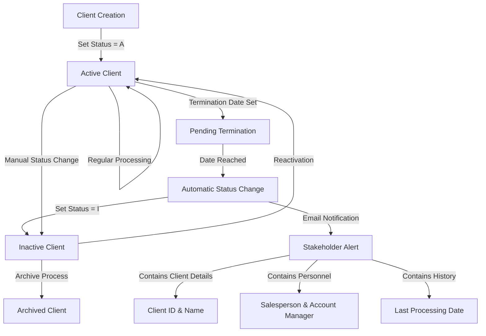
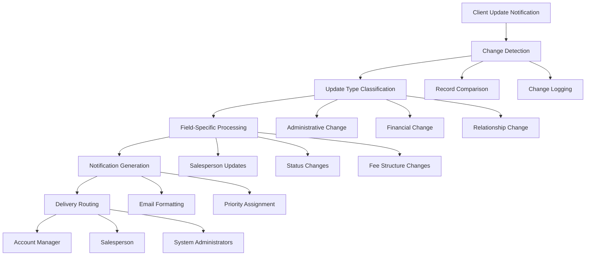
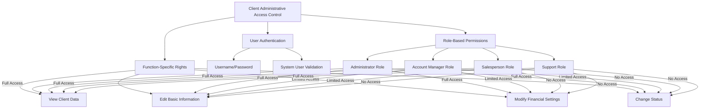

# Client Administrative Updates in AFS Shreveport

## Overview of Client Administrative Updates

Client administrative updates in AFS Shreveport are essential operations that maintain the accuracy and relevance of client configurations within the freight billing system. These updates encompass a wide range of activities, from modifying basic client information such as salesperson assignments and account managers to configuring complex settings like logistics parameters, carrier relationships, and billing preferences. The system's architecture supports both individual record updates and batch processing capabilities, allowing administrators to efficiently manage client data across the enterprise. Proper maintenance of these administrative settings ensures that billing operations, freight auditing, and client communications function correctly, ultimately supporting AFS Logistics' core business processes and client relationships.

## Client Record Structure and Key Fields

The client record in AFS Shreveport is a comprehensive data structure containing hundreds of fields that define how the system processes freight bills and interacts with clients. Core client data is stored in the CLIENTS file with client IDs typically formatted as five-digit numbers padded with leading zeros. Key administrative fields include client status (field 30), which controls whether a client is active or inactive; salesperson and account manager assignments (fields 114 and 264); billing preferences (fields in the 80-90 range); commission settings; and carrier relationship configurations. The system also maintains specialized fields for logistics operations, division codes, and client-specific processing rules. Many fields use single-character flags ('Y', 'N', 'A', etc.) to enable or disable specific features, while others contain numeric values for rates, percentages, or date values. The client record also includes multivalue fields that store arrays of related data, such as charge pages with effective dates, allowing for historical tracking of rate changes over time.

## Salesperson and Account Manager Updates

The AFS Shreveport system provides specialized functionality for updating salesperson and account manager assignments for client accounts. These updates are critical for proper commission tracking, client relationship management, and ensuring appropriate oversight of client accounts. The system maintains separate fields for different sales roles: field 114 stores the initiating salesperson (business development), field 115 stores the servicing salesperson, field 264 stores the account manager, and field 302 stores the account owner. Updates to these fields can be performed individually through programs like FB.1.1.ADMIN or in batch through utilities like UPD.CLIENTS.SALESPERSON, which processes tab-delimited spreadsheet files containing client IDs and salesperson codes. When salesperson assignments change, the system can automatically update related SQL databases through calls to UPD.SQL.CLIENT.SUB and UPD.SQL.QCLIENT.SUB, ensuring data consistency across platforms. The system also maintains audit trails of these changes by recording the previous values, the user who made the change, and the timestamp in the FB.ADJUST.CLIENT file. For commission-related updates, specialized programs like FB.6.7.1 allow configuration of commission rates based on sales codes, with the ability to set different rates for different date ranges and maintain proper relationships between agreement dates and effective dates.

## Client Status Management

Client status management in AFS Shreveport controls the lifecycle of client accounts from creation through termination. The primary status field (field 30) can be set to 'A' for active, 'I' for inactive, or other specialized codes. The system includes automated processes like CHK.CLIENT.TERM.DATE that identify clients whose termination dates (field 312) have passed and automatically changes their status to inactive. When status changes occur, the system can send email notifications to relevant stakeholders, including details about the client, assigned salespeople, and the last processing date. Special handling exists for clients with asterisks in their names, providing a grace period of seven days after the termination date before deactivation. The system also tracks the date of the last bill processing (field 82), which helps identify inactive clients that should be formally deactivated. Status changes are recorded in audit trails, and SQL databases are updated to maintain consistency across systems. Client status affects many system behaviors, including whether bills can be processed, whether the client appears in active client lists, and whether certain automated processes include or exclude the client.

## Division and Carrier Configuration

Division and carrier configuration in AFS Shreveport enables administrators to establish and maintain relationships between clients, their internal divisions, and the carriers they use for shipping. Division codes are stored in client-specific DIVISION.CODES files and can be updated through utilities like CHANGE.CUST.VEND, which modifies division codes in freight bills. The system supports both manual updates to individual division records and batch processes for updating multiple records simultaneously. Carrier configuration includes setting up verification requirements through FB.11.6, which enables or disables verification flags for specific client-carrier combinations, and establishing payment terms through FB.11.9, which sets the number of days until payment is due for each client-carrier relationship. FB.4.12.4 allows administrators to configure carrier rejection rules, specifying carriers whose bills should not be rejected during certain date ranges. FB.1.15 manages client/carrier startup dates, which determine when overcharge tracking begins for specific relationships. These configurations are critical for proper freight bill processing, as they control how the system handles bills from different carriers for each client, including validation rules, payment terms, and specialized processing requirements.

## Billing and Fee Structure Updates

AFS Shreveport provides comprehensive tools for managing client billing preferences and fee structures. Administrators can configure billing frequencies (weekly, monthly), payment terms (Net 15, Net 30, etc.), and specialized fee arrangements through programs like FB.1.1.SLC and FB.1.1.GVL. For parcel services, PPP.CLIENT.MAINT allows configuration of Pre-Paid Parcel Program enrollment, including carrier-specific fee structures (percentage-based or flat fee) for UPS and FedEx services, wire transfer fees, minimum fees, and late payment penalties. PCL.BILLING.MAINT enables updates to logistics billing transactions, including total savings, billing codes, descriptions, rates, and quantities. The system supports effective dating of fee changes through charge pages, allowing administrators to schedule future rate changes while preserving historical rates. Programs like CHANGE.POSTAGE facilitate batch updates to postage rates across multiple clients, automatically inserting new charge pages with updated rates effective from a specified date. The system also tracks commission caps through UPD.COMMISSION.CAP.SUB, which monitors year-to-date billing figures against predefined thresholds and can send alerts when caps are approached or exceeded.

## Batch Update Processes

Batch update processes in AFS Shreveport provide efficient mechanisms for modifying multiple client records simultaneously. These processes typically operate on predefined lists of client IDs or use selection criteria to identify records requiring updates. Utilities like UPD.CLIENTS.SALESPERSON read data from tab-delimited text files to update salesperson and account manager assignments across multiple clients. CHANGE.POSTAGE updates postage rates for multiple clients, automatically inserting new charge pages with effective dates. Programs like CHANGE.WEIGHT.01638 and UPDATE.BOL.01179 perform specialized updates to division codes or other fields for specific clients. The system also includes automated processes like CHK.CLIENT.TERM.DATE, which identifies and updates clients whose termination dates have passed. FB.YTD.CLEAR resets annual financial data for clients at the beginning of a new fiscal year, archiving previous data before clearing current records. UPD.FB.BILLS.YTD rebuilds year-to-date amounts per sales code by aggregating data from transaction records. These batch processes include safeguards such as validation checks, error handling for missing records, and often maintain audit trails of changes. Many include progress indicators that display counters during processing to track completion status, and some create detailed logs or reports of the changes made.

## Client Data Validation and Integrity

Client data validation and integrity in AFS Shreveport is maintained through a comprehensive set of mechanisms that ensure data consistency and accuracy. The system implements field-level validation rules that enforce data types, value ranges, and required fields. For example, FB.1.1.VERIFY.LOGISTICS ensures that logistics-related fields are properly configured, automatically updating related settings when logistics distribution is enabled. Programs like FB.1.1.SLC validate that required fields are completed before allowing record updates. The system also enforces business rules, such as requiring at least one carrier to be active in PPP.CLIENT.MAINT or ensuring that carrier startup dates cannot precede client start dates in FB.1.15. Cross-reference integrity is maintained through programs that update related files when client data changes, such as maintaining CC.XREF records when client codes are modified. The system creates audit trails by writing changes to files like FB.ADJUST.CLIENT with timestamps and user information. Many programs include special handling for edge cases, such as skipping clients with asterisks in their names when processing termination dates. Data consistency across platforms is ensured by updating SQL databases through calls to UPD.SQL.CLIENT.SUB and UPD.SQL.QCLIENT.SUB when client records are modified. The system also includes utilities for data correction, such as STATE.FIX which repairs incorrect state code values.

[Generated by the Sage AI expert workbench: 2025-05-28 08:06:15  https://sage-tech.ai/workbench]: #