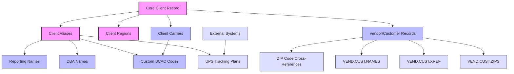
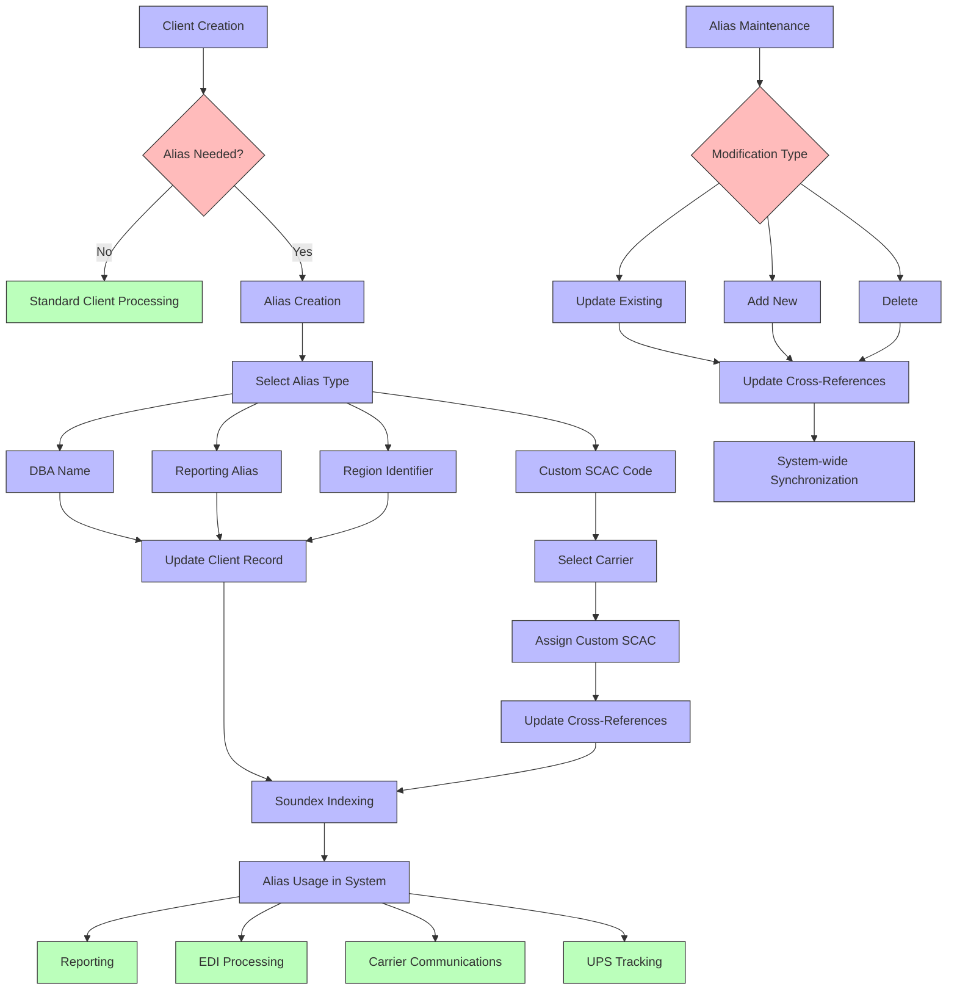
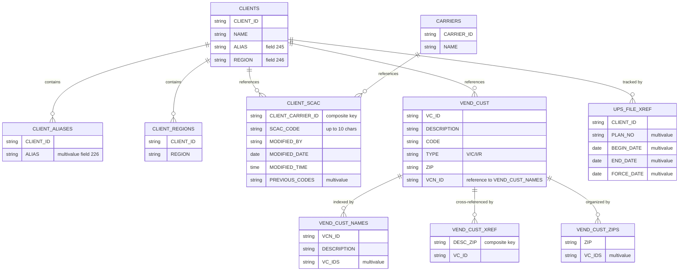

# Client Alias Management in AFS Shreveport

## Introduction to Client Alias Management

Client alias management in AFS Shreveport serves as a critical component for maintaining alternative identifiers for clients throughout the freight billing system. These aliases allow the system to recognize and process client information under various names and identifiers that may be used in different contexts. The primary purpose of alias management is to maintain consistency in reporting and identification across the platform, even when clients operate under multiple business names, have regional divisions, or require special identification codes for specific carriers. By centralizing alias management, AFS Shreveport ensures that all modules of the system can correctly identify and process client information regardless of which name or identifier is used in a particular transaction or report. This capability is especially important in logistics operations where clients may be known by different names to different carriers, vendors, or in different geographic regions.

## Client Alias Relationship Model

The diagram illustrates the complex relationships between client aliases and other entities in the AFS Shreveport system. At the center is the core client record, which connects to various types of aliases including reporting names, DBA (doing business as) names, and custom SCAC codes. The client record also links to region identifiers and carrier relationships, with the latter connecting to custom SCAC codes for carrier-specific identification. Vendor and customer records maintain their own alias structures with cross-references by ZIP code. The system also manages UPS tracking plan aliases that facilitate integration with external systems. This interconnected structure ensures consistent client identification across all modules and external interfaces.

## Types of Client Aliases

AFS Shreveport supports several distinct types of client aliases to address different business needs. DBA (doing business as) names are the most common type, allowing clients to operate under alternative business names while maintaining a single account in the system. These are particularly important for companies that have undergone mergers or acquisitions but continue to do business under their original names. Reporting aliases provide customized naming for reports and documents, ensuring that client-facing materials use the appropriate branding. Region identifiers serve as aliases that associate clients with specific geographic territories, which is crucial for regional reporting and logistics planning. Custom SCAC codes represent a specialized form of alias that creates client-specific carrier codes, enabling unique identification in carrier communications and EDI transactions. The system also maintains vendor and customer aliases that function as cross-references between client records and their various business partners. Each alias type serves a specific purpose in the overall client management framework, allowing for precise identification in different contexts while maintaining data integrity across the system.

## Alias Creation and Maintenance

The AFS Shreveport system provides dedicated maintenance screens and utilities for creating, updating, and managing client aliases. The primary maintenance programs include ALIAS, FB.1.1.ALIAS, and FB.1.1.ADDTL, which offer interfaces for updating region and alias fields in the CLIENTS file. These utilities allow users to search for clients by number or name using Soundex functionality for fuzzy matching, then view and modify the current alias values. The FB.1.1.ALIAS subroutine specifically handles customer alias (DBA) entries with a paginated interface that supports viewing, adding, editing, and deleting up to 108 aliases per client. For specialized carrier-related aliases, the FB.11.7 program enables the creation and management of custom SCAC codes that link clients with carriers for reporting purposes. This program includes security controls that restrict modification rights to specific users and maintains a history of all changes. The CREATE.ALIAS.DOWNLOAD utility extracts client alias information and generates tab-delimited Excel files for download, facilitating offline analysis and reporting. All alias maintenance functions include validation steps and confirmation prompts before writing changes to ensure data integrity.

## Alias Management Workflow

This flowchart depicts the complete lifecycle of client aliases from creation through maintenance to utilization in the AFS Shreveport system. The process begins with client creation, where a determination is made whether aliases are needed. If required, users select the appropriate alias type (DBA name, reporting alias, region identifier, or custom SCAC code) and enter the necessary information. For standard aliases, the client record is updated directly, while custom SCAC codes require carrier selection and specialized cross-reference updates. All aliases undergo Soundex indexing to facilitate future searches. Once established, aliases are utilized throughout the system for reporting, EDI processing, carrier communications, and UPS tracking. The maintenance workflow allows for updating existing aliases, adding new ones, or deleting obsolete entries, with all changes propagating through cross-references to ensure system-wide synchronization. This comprehensive workflow ensures consistent client identification across all system functions while maintaining the flexibility to accommodate various business requirements.

## Cross-Reference Management

The AFS Shreveport system implements a sophisticated cross-reference management approach to maintain consistent identification across modules. At its core, the system uses multiple interconnected files to establish relationships between client aliases, vendor/customer records, and carrier codes. The primary cross-reference mechanism relies on the VEND.CUST.XREF file, which maps vendor/customer descriptions to their respective IDs, with optional ZIP code qualifiers for location-specific references. This is complemented by the VEND.CUST.ZIPS file, which provides a reverse lookup capability from ZIP codes to associated vendors and customers. For carrier relationships, the CLIENT.SCAC file maintains cross-references between client IDs, carrier IDs, and custom SCAC codes, along with a history of changes. The UPS.FILE.XREF file serves a specialized purpose, connecting UPS shipping plans to AFS clients with date ranges for validity periods. The system also employs the VEND.CUST.NAMES file as a central repository for standardized names, with cross-references to multiple vendor/customer IDs that may use the same name. This layered approach ensures that regardless of which identifier is used in a transaction or report, the system can correctly resolve it to the appropriate client record, maintaining data integrity throughout the freight billing process.

## Vendor and Customer Alias Integration

Vendor and customer aliases in AFS Shreveport integrate seamlessly with client records through a sophisticated system of cross-references and lookups. The FB.2.1.CONSIGN and FB.2.1.VEND.CUST subroutines form the backbone of this integration, allowing users to enter, search, add, and update vendor/customer records with appropriate descriptions and codes. When creating new vendor/customer entries, the system automatically generates unique IDs through an incremental search algorithm that finds available numbers. ZIP code-based lookups are a key feature of this integration, with the VEND.CUST.ZIPS file maintaining associations between postal codes and vendor/customer records. This enables location-specific alias resolution, particularly valuable for clients with multiple facilities. The system also implements automatic code assignment for specific vendors based on name pattern matching, especially evident in client-specific customizations like those for Targus (client 01478) where vendor names like "Best Buy" or "Dell" automatically receive predefined codes. For clients with special requirements, such as Darling Store Fixtures (client 00850), the system enforces naming conventions that require specific prefixes. The integration also includes SQL synchronization capabilities to maintain consistency between the AFS system and external databases, ensuring that vendor and customer aliases remain current across all platforms.

## Alias Data Structure

This diagram illustrates the database structure for alias storage in the AFS Shreveport system. The CLIENTS file serves as the central repository, with client aliases stored in field 245 and region information in field 246. For clients with multiple aliases, the system uses a multivalue field (226) to store DBA names. The CLIENT_SCAC file maintains custom SCAC codes that link clients with carriers, including tracking of who made changes and when. Vendor and customer information is stored in the VEND_CUST file, with cross-references maintained through VEND_CUST_NAMES (for standardized naming), VEND_CUST_XREF (for description-to-ID mapping), and VEND_CUST_ZIPS (for ZIP code-based lookups). UPS tracking integration is handled through the UPS_FILE_XREF file, which stores plan numbers with date ranges for validity periods. This comprehensive data structure enables efficient storage and retrieval of alias information while maintaining the relationships necessary for consistent client identification across the system. The use of multivalue fields and composite keys allows for flexible representation of the many-to-many relationships that characterize alias management.

## Reporting and Data Export

AFS Shreveport provides comprehensive capabilities for utilizing client aliases in reporting and data export functions. The system's reporting framework is designed to recognize and properly display client aliases based on the context of the report, ensuring that the appropriate identifier appears in client-facing documents. The CREATE.ALIAS.DOWNLOAD utility exemplifies this functionality by extracting client alias information from the BCUST database and generating a tab-delimited Excel file for download. This file includes columns for client ID, name, status, and all associated aliases, facilitating offline analysis and reporting. For custom reporting needs, the system allows specific aliases to be designated as "reporting aliases" in the client record, ensuring consistent identification in generated reports. The export process handles the conversion of MultiValue marks to tab characters for Excel compatibility, making the exported data immediately usable in spreadsheet applications. Client-specific alias requirements are accommodated through customized formatting rules, such as those implemented for clients like Darling Store Fixtures (00850) that require specific name prefixes. The system also supports regional reporting by utilizing region identifiers stored alongside client aliases. For integration with external systems, the reporting framework can generate files with specialized formatting to meet the requirements of EDI partners, carriers, and other third-party services, ensuring that client aliases are correctly represented in all external communications.

## Soundex and Search Functionality

AFS Shreveport implements sophisticated fuzzy name matching using Soundex technology to find similar client names and aliases when exact matches aren't available. This functionality is critical in a system where clients may be known by multiple names or where users might not know the exact spelling of a client name. The SOUNDEX.DISPLAY and SOUNDEX.EDIT subroutines form the core of this capability, creating phonetic indexes of client names that allow for matches based on similar-sounding words rather than exact spelling. When searching for clients in programs like ALIAS, FB.1.1.ADDTL, and FB.2.1.VEND.CUST, users can enter partial names or phonetically similar terms, and the system will return potential matches. This is particularly valuable for customer service representatives who may only have a verbal reference to a client name. The Soundex functionality extends beyond client names to vendor and customer aliases through the SDX.VEND.CUST and SDX.VCN indexes, which maintain phonetic representations of these entities. The system also implements a tiered search approach, first attempting exact matches before falling back to Soundex-based fuzzy matching. For vendor and customer management, the GET.LIST.SDX function retrieves potential matches based on phonetic similarity, presenting them in a user-friendly list for selection. This comprehensive approach to fuzzy name matching ensures that users can locate the correct client or alias record even with incomplete or imprecise information, enhancing the system's usability and reducing the risk of duplicate entries.

## Security and Access Controls

AFS Shreveport implements robust role-based security controls for alias management to ensure data integrity and appropriate access. The system restricts modification rights for certain alias types to specific authorized users, particularly for sensitive areas like custom SCAC codes that affect carrier relationships. For example, the FB.11.7 program explicitly checks the user's identity against an approved list before allowing modifications to carrier SCAC codes. When unauthorized users attempt to make changes, the system not only blocks the modification but also triggers email notifications to system administrators, providing details about the attempted change including the client, carrier, and proposed SCAC code. This security approach creates an audit trail of both successful and attempted modifications. The UPS.FILE.XREF.UPD program similarly restricts access to specific named users for maintaining UPS tracking plan cross-references. Beyond user-level restrictions, the system implements validation rules that enforce client-specific requirements, such as naming conventions for vendors and customers. All alias maintenance functions include confirmation prompts before writing changes, adding an additional layer of protection against accidental modifications. The system also maintains detailed modification history, tracking previous values, the users who made changes, and timestamps, which supports both security auditing and regulatory compliance. This comprehensive security framework ensures that alias data remains accurate and that changes are properly authorized and documented.

## Integration with External Systems

Client aliases in AFS Shreveport play a crucial role in facilitating integration with external systems, serving as the bridge between internal client identifiers and the various codes and names used by partners and service providers. The UPS tracking integration exemplifies this functionality through the UPS.FILE.XREF file, which maintains cross-references between AFS client IDs and UPS shipping plans. This allows the system to correctly associate incoming UPS tracking data with the appropriate client accounts, even when the identifiers used by UPS differ from internal client numbers. The UPS.FILE.XREF.UPD program provides a maintenance interface for these cross-references, including date ranges to control when specific plans are active. For EDI partners, custom SCAC codes created through the FB.11.7 program enable client-specific carrier identification in electronic transactions, ensuring that EDI messages contain the expected identifiers for both sending and receiving systems. The vendor and customer alias system supports integration with external billing and shipping systems by maintaining cross-references between internal codes and partner-specific identifiers. The system also includes SQL synchronization capabilities to maintain consistency between AFS databases and external systems, with the UPD.SQL.VC.SUB subroutine updating SQL data tables when vendor/customer information changes. For third-party services like real-time cost and mileage estimation, client aliases ensure that requests and responses are correctly associated with the appropriate accounts. This comprehensive approach to external system integration through aliases enables seamless data exchange while maintaining the integrity of client identification across all platforms.

[Generated by the Sage AI expert workbench: 2025-05-28 08:06:18  https://sage-tech.ai/workbench]: #