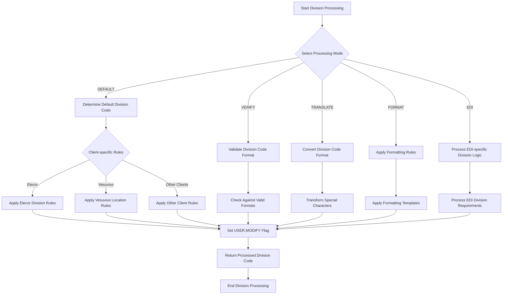
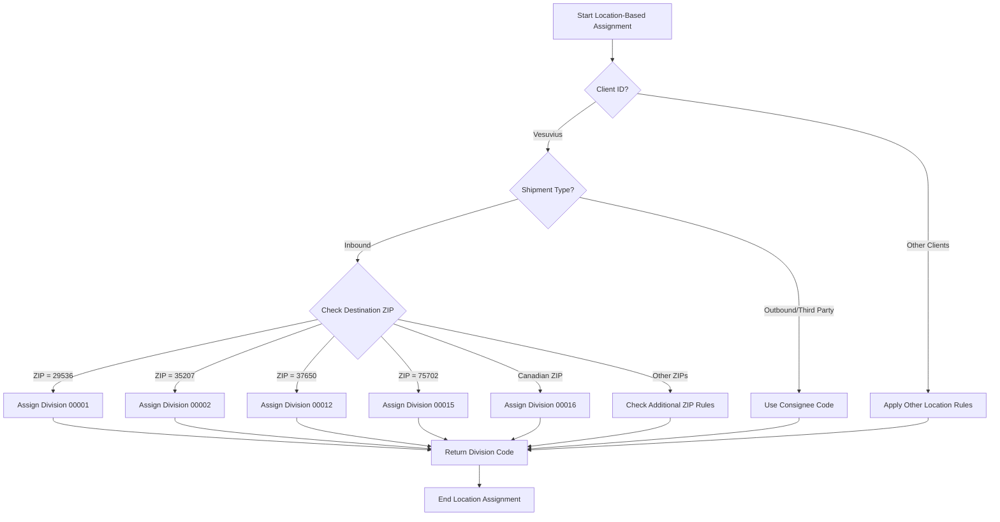
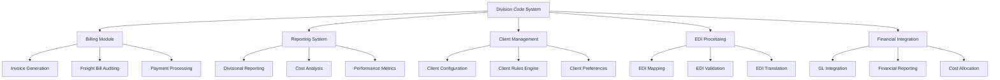

# Client Division Maintenance in AFS Shreveport

## Client Division Maintenance Overview

Client division maintenance is a critical component of the AFS Shreveport system, serving as the backbone for organizing client data across different business units or departments. In freight management operations, division codes provide a structured way to categorize shipments, allocate costs, and generate targeted reports based on organizational hierarchies. The division maintenance functionality enables AFS to support complex client organizational structures where freight billing needs to be segmented by business unit, cost center, department, or geographic region.

The system implements a sophisticated approach to division code handling through the `GET.DIVISION` subroutine, which processes division codes differently based on client-specific requirements. This flexibility allows AFS Shreveport to accommodate diverse client organizational structures while maintaining standardized freight management processes. Division codes serve as a key data point throughout the system, influencing billing workflows, reporting structures, and integration with client ERP systems.

## Division Code Structure and Formatting

Division codes in AFS Shreveport follow specific formatting standards designed to maintain consistency while accommodating client-specific requirements. Typically, division codes are alphanumeric identifiers that represent distinct business units or cost centers within a client's organization. The standard format often consists of 5-digit numeric codes (e.g., "00001"), though the system supports various formats based on client needs.

The structure of division codes is determined by several factors:

1. **Client-specific formats**: Some clients require custom division code structures that align with their internal accounting or organizational systems. For example, Vesuvius uses a "00XXX" format where the numeric portion identifies specific plant locations.

2. **Hierarchical representation**: Division codes may reflect organizational hierarchies, with certain digit positions representing higher-level organizational units and others representing sub-units.

3. **Special characters**: The system handles special character transformations, such as converting "+" to "-" during translation mode, to ensure compatibility across different systems and interfaces.

4. **Formatting rules**: The `FORMAT` mode in the division processing workflow applies client-specific formatting rules to ensure consistency, such as padding with leading zeros or enforcing specific character patterns.

The division code structure directly impacts downstream processes including billing allocation, reporting, and integration with client financial systems, making standardization and proper maintenance essential.

## Division Code Processing Workflow



The division code processing workflow in AFS Shreveport follows a sophisticated pattern designed to handle various scenarios and client requirements. The `GET.DIVISION` subroutine implements multiple processing modes that determine how division codes are handled:

1. **DEFAULT mode**: Automatically assigns appropriate division codes based on shipment characteristics. For example, for Elecor, third-party shipments are assigned division "00001", while for Vesuvius, inbound shipments are assigned divisions based on destination ZIP codes.

2. **VERIFY mode**: Validates that division codes conform to client-specific formatting rules and exist in the client's approved division list.

3. **TRANSLATE mode**: Converts division codes between different formats, such as transforming special characters (e.g., changing "+" to "-") to ensure system compatibility.

4. **FORMAT mode**: Applies standardized formatting to division codes, such as adding leading zeros or enforcing specific patterns.

5. **EDI mode**: Handles special processing for division codes received through Electronic Data Interchange, often applying additional validation or transformation rules.

This multi-mode approach allows the system to maintain division code integrity throughout the freight management lifecycle, from initial data entry to final billing and reporting.

## Client-Specific Division Rules

The AFS Shreveport system implements highly customized division code rules tailored to each client's organizational structure and business requirements. These client-specific rules determine how division codes are assigned, validated, and processed throughout the freight management workflow.

For example, Elecor (client ID 01220) has a simple division assignment rule where third-party shipments are automatically assigned division code "00001". This streamlined approach reflects Elecor's organizational structure where third-party shipments are handled by a specific business unit.

In contrast, Vesuvius (client ID 01292) implements a more complex location-based division assignment system. For inbound shipments, division codes are determined by the destination ZIP code, with over 40 different ZIP code mappings to specific division codes. For instance:
- Shipments to ZIP code 29536 are assigned division "00001"
- Shipments to ZIP code 35207 are assigned division "00002"
- Canadian destinations (ZIP codes starting with letters) are assigned division "00016"

For outbound or third-party shipments, Vesuvius uses the consignee code as the division code, reflecting their business process where the receiving entity determines the appropriate business unit for billing.

Betts Springs (client ID 01567) demonstrates yet another approach, with highly specific rules that combine multiple criteria. Their division assignment considers inbound/outbound status, destination ZIP code, and consignee code simultaneously. Only when all three criteria match (inbound shipment to ZIP 94577 with consignee code "97-9730") is division code "00097" assigned.

These examples illustrate how the system accommodates diverse organizational structures and business processes through flexible, client-specific division code rules.

## Location-Based Division Assignment



Location-based division assignment is a sophisticated feature in AFS Shreveport that uses geographic data to determine the appropriate division code for freight shipments. This approach is particularly valuable for clients with decentralized operations across multiple facilities or regions.

The system implements location-based division assignment through a comprehensive mapping of geographic identifiers (primarily ZIP codes) to specific division codes. This mapping reflects the client's organizational structure and cost allocation requirements, ensuring that shipments are properly categorized for billing and reporting purposes.

Vesuvius provides an excellent example of this functionality, with over 40 destination ZIP codes mapped to specific division codes. The system checks the destination ZIP code of inbound shipments and assigns the corresponding division code based on this mapping. For instance:

- Shipments to manufacturing facilities in the Northeast (ZIP codes 14218, 14733, etc.) are assigned specific division codes (00008, 00013, etc.)
- Canadian locations are uniformly assigned division code 00016, reflecting Vesuvius's organizational structure for international operations
- Texas locations (ZIP codes 75702, 76645, 78521, 78523) are all assigned division code 00015, indicating regional management of these facilities

This location-based approach enables accurate cost allocation and reporting by business unit, even when shipments are being processed by a centralized freight management system. The geographic mapping can be as granular or broad as needed, supporting both facility-specific divisions and regional groupings.

For clients with complex geographic operations, the system can incorporate additional factors beyond simple ZIP code matching, such as state/province codes, country codes, or custom-defined geographic regions. This flexibility allows AFS Shreveport to accommodate diverse organizational structures while maintaining consistent freight management processes.

## Division Code Verification and Validation

Division code verification and validation in AFS Shreveport ensures that division codes meet client-specific requirements before being used in freight billing processes. This validation is critical for maintaining data integrity and ensuring accurate cost allocation across client business units.

The verification process is implemented through the `VERIFY` mode in the `GET.DIVISION` subroutine, which applies client-specific validation rules to division codes. These rules may include:

1. **Format validation**: Ensuring the division code follows the required format (e.g., 5-digit numeric codes for Vesuvius)

2. **Existence validation**: Verifying that the division code exists in the client's approved list of division codes

3. **Context-specific validation**: Checking that the division code is appropriate for the specific shipment characteristics (e.g., origin/destination, carrier, transportation mode)

4. **Cross-reference validation**: For some clients, validating division codes against external reference data such as customer/vendor codes or accounting system identifiers

When a division code fails validation, the system can either reject it outright or flag it for manual review, depending on client requirements. The `ERROR.MESSAGE` variable in the `GET.DIVISION` subroutine allows for specific error messages to be returned to the user, providing guidance on how to correct invalid division codes.

For EDI transactions, validation is particularly important as division codes may come from external systems with different formatting standards. The system applies additional validation rules in EDI mode to ensure compatibility with AFS Shreveport's division code requirements.

The validation process also considers client-specific exceptions and special cases. For example, some clients may have legacy division codes that don't follow current formatting standards but need to be accepted for historical continuity. The validation logic accommodates these exceptions while maintaining overall data integrity.

## User Modification Controls

User modification controls in AFS Shreveport govern whether users can manually change division codes during freight bill processing. This functionality is critical for balancing data integrity with operational flexibility, ensuring that division codes adhere to client requirements while allowing for necessary exceptions.

The system implements user modification controls through the `USER.MODIFY` flag, which is set during division code processing. When `USER.MODIFY` is set to 1, users are permitted to modify the division code; when set to 0, the division code is locked and cannot be changed through the user interface.

Several factors influence the `USER.MODIFY` setting:

1. **Client-specific rules**: Some clients require strict control over division codes and do not allow user modifications, while others permit changes to accommodate exceptional cases.

2. **Division code source**: Division codes derived from automated rules (e.g., ZIP code mapping) may be locked to prevent manual override, while user-entered division codes might remain modifiable.

3. **User permissions**: The system may consider user roles and permissions when determining whether division code modification is allowed, restricting changes to authorized personnel.

4. **Processing stage**: Division codes might be modifiable during initial data entry but become locked during later stages of the billing workflow to prevent unauthorized changes.

The `NOT.ASK` flag provides additional control over user interaction with division codes. When set to 1, the system bypasses user prompts for division code entry, using the default or system-determined value instead. This is useful for fully automated processing scenarios or for clients with standardized division assignment rules.

These user modification controls ensure that division codes remain accurate and consistent with client requirements while providing the flexibility needed for operational efficiency.

## Division Code Integration Points



Division codes in AFS Shreveport serve as a critical data point that integrates with numerous system components, creating a cohesive framework for freight management across different business units. These integration points ensure that division information flows seamlessly throughout the application, supporting various business processes.

Key division code integration points include:

1. **Billing Module**: Division codes determine how freight charges are allocated and billed to specific client business units. They influence invoice formatting, billing cycles, and payment terms based on division-specific requirements.

2. **Reporting System**: Division codes enable segmented reporting that allows clients to analyze freight costs by business unit, supporting cost allocation and performance analysis at the divisional level.

3. **Client Management**: Division codes are linked to client configuration settings, allowing for division-specific rules, preferences, and service levels within the same client account.

4. **EDI Processing**: For electronic data interchange, division codes must be properly mapped between client systems and AFS Shreveport, ensuring accurate data exchange and processing.

5. **Financial Integration**: Division codes support integration with client financial systems, enabling proper cost allocation and accounting at the business unit level.

6. **Audit Management**: Division information influences audit rules and verification processes, with different divisions potentially requiring different levels of scrutiny.

7. **Document Management**: Division codes may determine document routing, storage, and retention policies, ensuring that freight documentation is accessible to the appropriate business units.

8. **Rate Management**: Some clients maintain division-specific rate agreements with carriers, requiring division codes to access the correct rate tables.

9. **User Access Control**: Division codes can influence user permissions, restricting access to freight data based on divisional responsibilities.

10. **Analytics and Business Intelligence**: Division codes provide a key dimension for data analysis, supporting drill-down capabilities in dashboards and reports.

These integration points highlight the central role of division codes in the AFS Shreveport system, serving as a unifying element that connects various functional areas while supporting client-specific organizational structures.

## Division Code Defaulting Logic

Division code defaulting logic in AFS Shreveport provides a sophisticated mechanism for automatically assigning appropriate division codes based on shipment characteristics. This functionality streamlines data entry and ensures consistent division assignment across similar shipments, reducing manual effort and potential errors.

The defaulting logic is implemented through the `DEFAULT` mode in the `GET.DIVISION` subroutine, which applies a hierarchical set of rules to determine the appropriate division code. These rules consider multiple factors:

1. **Shipment direction**: Inbound, outbound, and third-party shipments often have different division assignment rules. For example, Elecor automatically assigns division "00001" to third-party shipments, while Vesuvius uses different logic for inbound versus outbound shipments.

2. **Geographic information**: As seen with Vesuvius, destination ZIP codes often determine division assignments for inbound shipments, reflecting the organizational responsibility for receiving locations.

3. **Trading partner information**: Consignee codes, vendor IDs, and customer relationships may influence division assignment, particularly for outbound shipments where the recipient may determine the appropriate business unit.

4. **Shipment characteristics**: Transportation mode, service level, and commodity type can influence division assignment for clients with mode-specific business units.

5. **Document references**: Bill of lading numbers, purchase order references, or invoice numbers may contain embedded division information that the system can extract and use.

The defaulting logic follows a client-specific priority sequence, attempting to assign divisions based on the most reliable indicators first, then falling back to secondary methods if needed. For example, the system might first check for explicit division codes in reference fields, then apply location-based rules, and finally use a general default if no specific rules apply.

This intelligent defaulting approach significantly reduces manual data entry while ensuring that division codes accurately reflect the organizational responsibility for each shipment.

## Division Management for EDI Processing

Division management for Electronic Data Interchange (EDI) processing in AFS Shreveport addresses the unique challenges of handling division codes in automated electronic transactions. EDI processing requires special consideration for division codes since the data originates from external systems that may use different formatting standards or division identification methods.

The system implements EDI-specific division handling through the `EDI` mode in the `GET.DIVISION` subroutine, which applies specialized processing rules for electronically transmitted freight data. Key aspects of division management for EDI include:

1. **Format translation**: EDI transactions often require translation between the sender's division code format and AFS Shreveport's internal format. The system automatically converts incoming division codes to the standardized format used within the application.

2. **Default assignment**: When EDI transactions lack explicit division codes, the system applies client-specific defaulting rules to assign appropriate divisions based on other transaction data such as shipping locations, document references, or trading partner information.

3. **Cross-reference mapping**: For clients with complex division structures, the system maintains cross-reference tables that map external division identifiers to internal division codes, ensuring accurate translation during EDI processing.

4. **Validation rules**: EDI division codes undergo specialized validation to ensure they meet system requirements before processing continues. Invalid division codes may trigger exceptions that require manual intervention.

5. **Trading partner profiles**: The system considers the specific EDI trading partner when processing division codes, as different partners may have different division coding conventions or requirements.

6. **Document type considerations**: Different EDI document types (e.g., 856 Ship Notice, 810 Invoice) may contain division information in different segments or elements, requiring document-specific extraction logic.

7. **Batch processing rules**: For batch EDI processing, division code handling includes additional validation and error management to ensure that processing can continue even if some transactions have division code issues.

This specialized approach to EDI division management ensures that electronically transmitted freight data is properly categorized by business unit, maintaining data integrity throughout the automated processing workflow.

## Division Code Maintenance Best Practices

Maintaining division codes effectively in AFS Shreveport requires a structured approach that balances system flexibility with data integrity. The following best practices provide guidelines for managing division codes to ensure optimal performance and accuracy:

1. **Standardize division code formats**: Establish consistent formatting standards for division codes across similar clients to simplify maintenance and reduce errors. For example, standardize on 5-digit numeric codes with leading zeros where appropriate.

2. **Document client-specific rules**: Maintain comprehensive documentation of division code rules for each client, including defaulting logic, validation requirements, and special cases. This documentation should be accessible to both developers and operational staff.

3. **Implement change control**: Establish a formal process for adding or modifying division code rules, including testing procedures and approval workflows. Changes should be thoroughly tested in a non-production environment before implementation.

4. **Regular validation**: Periodically audit division code assignments to ensure they continue to meet client requirements and business rules. This includes checking for obsolete divisions or rules that no longer apply.

5. **Maintain cross-reference tables**: For clients with complex organizational structures, maintain up-to-date cross-reference tables that map division codes to other business identifiers such as cost centers, departments, or accounting codes.

6. **Template-based implementation**: When adding new clients, use standardized templates for division code implementation, following the pattern established in the `GET.DIVISION` subroutine:

   ```
   CASE CLIENT.ID='NEW_ID'          ; * Client's Name
     BEGIN CASE
       CASE MODE = 'DEFAULT'        ; * Default assignment logic
       CASE MODE = 'TRANSLATE'      ; * Translation logic
       CASE MODE = 'FORMAT'         ; * Formatting rules
       CASE MODE = 'VERIFY'         ; * Verification criteria
     END CASE
   ```

7. **Performance optimization**: For clients with extensive division rules, optimize code execution by using efficient lookup methods and minimizing redundant operations.

8. **User training**: Ensure that operational staff understand division code requirements and the implications of division assignment for billing and reporting.

9. **Monitor exceptions**: Track division code exceptions and manual overrides to identify patterns that might indicate the need for rule adjustments or additional division codes.

10. **Periodic review with clients**: Regularly review division code structures with clients to ensure they continue to align with organizational changes and business requirements.

Following these best practices ensures that division codes remain accurate, consistent, and aligned with client organizational structures, supporting effective freight management and accurate cost allocation.

[Generated by the Sage AI expert workbench: 2025-05-28 08:06:21  https://sage-tech.ai/workbench]: #