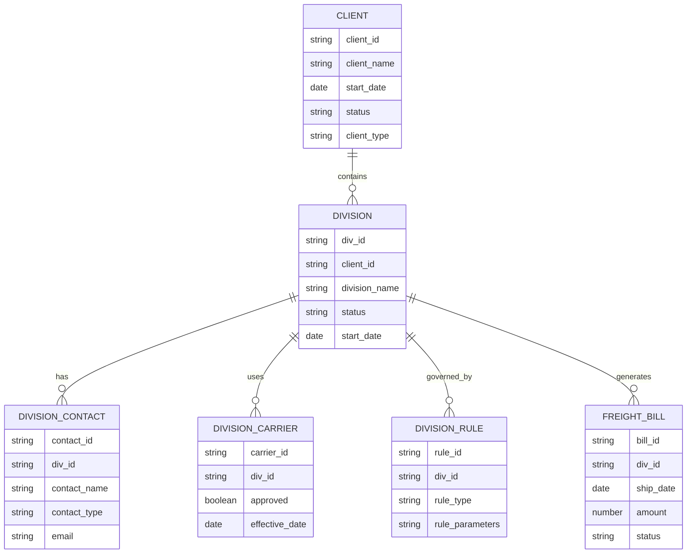
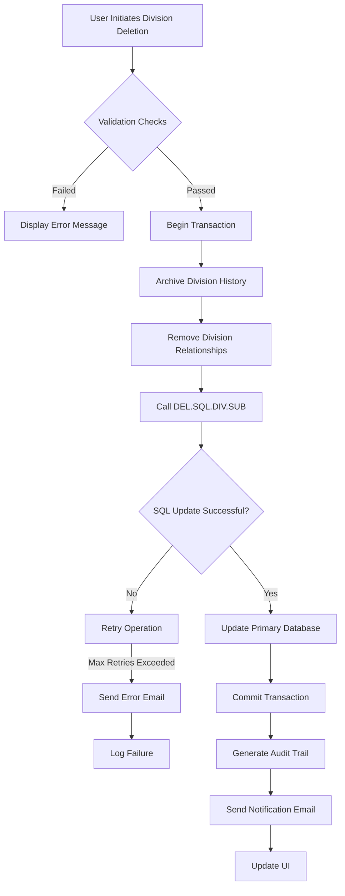
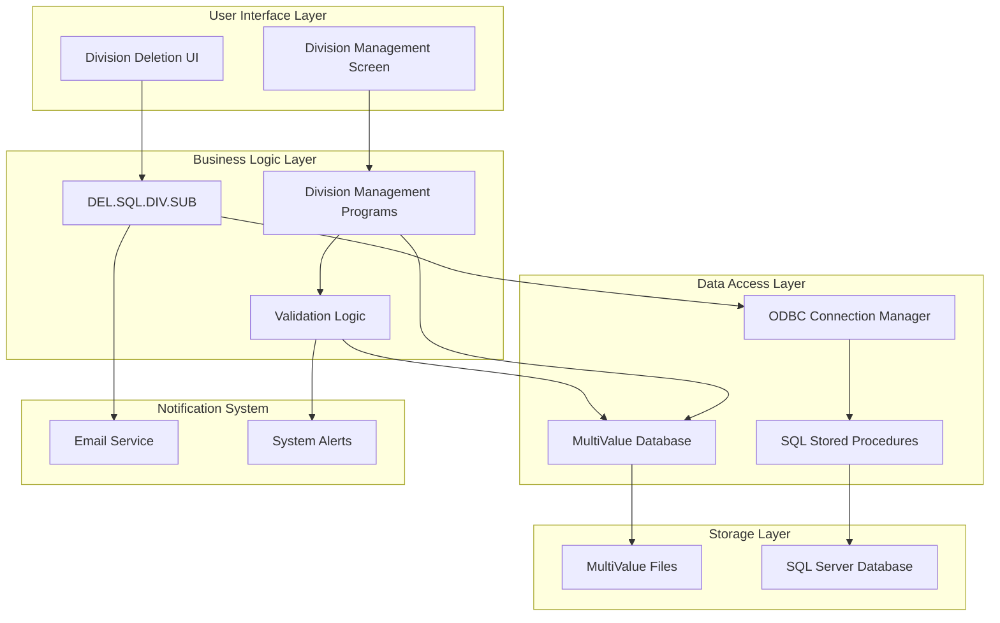
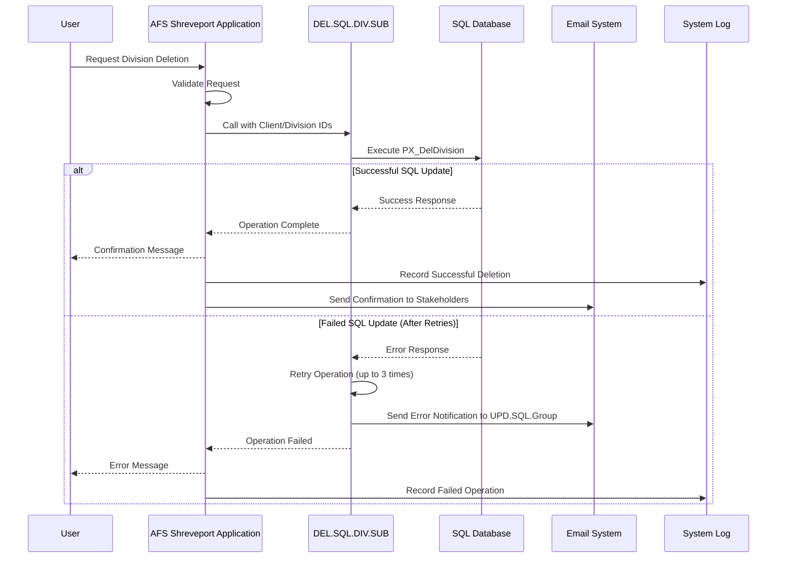

# Client Division Management in AFS Shreveport

## Client Division Management Overview

Client divisions are a fundamental organizational structure within the AFS Shreveport system, enabling the platform to support multi-entity client relationships. Divisions allow large clients to segment their operations by business unit, geographic region, or functional area while maintaining a unified relationship with AFS. This hierarchical structure facilitates targeted freight management, customized billing processes, and granular reporting capabilities. The division architecture enables clients to maintain separate shipping profiles, carrier relationships, and billing preferences under a single parent account, streamlining administration while preserving operational autonomy for each division. The system supports complex parent-child relationships where master account settings can cascade down to divisions, while still allowing division-specific overrides for specialized requirements.

## Client Division Data Structure

The diagram illustrates the central role of divisions in the AFS Shreveport data model. Each client can have multiple divisions, and divisions serve as the organizational nexus for contacts, carrier relationships, business rules, and freight bills. This structure enables the system to maintain division-specific configurations while preserving the parent-child relationship with the client entity. When divisions are created, modified, or deleted, these changes must be synchronized across both the primary application database and SQL databases to maintain data consistency throughout the system.

## Division Update Operations

Division update operations in AFS Shreveport encompass a comprehensive set of processes for managing the lifecycle of client divisions. These operations include creation, modification, deletion, and synchronization across system components. When creating a new division, the system validates the parent client's existence and status, generates a unique division identifier, and establishes default settings based on client-level configurations. Division modifications allow for updates to division attributes, contacts, carrier relationships, and business rules, with changes propagating to related entities through referential integrity constraints. The synchronization process ensures that division data remains consistent across the primary MultiValue database and SQL databases used for reporting and integration purposes. This synchronization leverages ODBC connections and stored procedures to maintain data consistency. The system implements a robust transaction management approach, with operations logged for audit purposes and notifications generated for significant changes. Division operations are subject to permission controls, with different user roles having varying levels of access to create, modify, or delete divisions.

## Division Deletion Process

The division deletion process in AFS Shreveport follows a carefully orchestrated workflow to ensure data integrity while removing division records from the system. When a user initiates a division deletion, the system first performs a series of validation checks to determine if the division can be safely removed. These checks include verifying that no active freight bills reference the division, ensuring that no pending operations are in progress, and confirming that the user has appropriate permissions. If these validations pass, the system begins a multi-stage deletion process that includes removing division-specific configurations, unlinking carrier relationships, and archiving historical data for reporting purposes.

The core deletion logic is implemented in the DEL.SQL.DIV.SUB subroutine, which handles the SQL database synchronization aspect of division removal. This subroutine establishes an ODBC connection to the SQL database and executes the PX_DelDivision stored procedure with the client and division IDs as parameters. The code implements a sophisticated retry mechanism that attempts the operation up to three times before sending an error notification, ensuring resilience against transient database connectivity issues. After successful deletion from the SQL database, the system updates the primary MultiValue database records and generates appropriate audit trail entries. Finally, notification emails are sent to relevant stakeholders informing them of the division removal.

## Division Deletion Workflow

This flowchart illustrates the comprehensive division deletion process in AFS Shreveport. The process begins with user initiation and validation checks, followed by a transaction-based approach to ensure atomicity. The DEL.SQL.DIV.SUB subroutine plays a critical role in synchronizing the deletion with the SQL database. The system incorporates multiple safeguards including retry logic, error notifications, and audit trail generation to maintain system integrity during division deletion operations. The process concludes with appropriate notifications and UI updates to reflect the completed deletion.

## SQL Database Integration

The AFS Shreveport system maintains division data synchronization between its primary MultiValue database and SQL databases through a sophisticated integration architecture. The DEL.SQL.DIV.SUB subroutine exemplifies this integration approach for division deletion operations. This subroutine leverages the ODBC (Open Database Connectivity) standard to establish connections with SQL Server databases, executing stored procedures that handle the complex logic of division removal while maintaining referential integrity.

The integration process begins by retrieving SQL server connection information from system configuration tables using the TFB.TABLES conversion utility. This approach allows connection parameters to be centrally managed and modified without changing code. The subroutine then establishes an ODBC environment and connection using SQLAllocEnv and SQLAllocConnect functions, followed by SQLConnect to establish the database session. The actual division deletion is performed through a parameterized call to the PX_DelDivision stored procedure, which encapsulates all necessary SQL operations to remove division records and update related tables. This stored procedure approach centralizes the SQL-specific logic in the database layer, allowing for optimized execution and simplified maintenance.

The integration architecture also incorporates comprehensive error handling and resource management. The code properly releases ODBC resources through a cleanup sequence that includes SQLFreeStmt, SQLDisconnect, SQLFreeConnect, and SQLFreeEnv calls, preventing memory leaks and connection pool exhaustion. This methodical approach to resource management is essential for maintaining system stability in a high-volume transaction environment.

## Error Handling and Resilience

The division management subsystem in AFS Shreveport implements a robust error handling and resilience strategy to ensure reliable operation even in the face of transient failures. The DEL.SQL.DIV.SUB subroutine exemplifies this approach with its sophisticated retry mechanism for SQL operations. When a database operation fails, the system captures detailed error information including SQL state codes, native error codes, and error text through the SQLERROR function. This comprehensive error data enables precise diagnosis of issues and appropriate recovery actions.

The retry logic implements an incremental approach, attempting failed operations up to three times before escalating to notification. This strategy effectively handles transient connectivity issues or temporary database locks without requiring manual intervention. For persistent failures, the system generates detailed email notifications to the UPD.SQL.Group@afs.net address, including contextual information such as the user performing the operation, client and division identifiers, timestamp, and the specific error messages encountered. This notification mechanism ensures that technical staff can quickly respond to systemic issues.

Error handling is implemented at multiple levels, with specific handlers for connection environment errors (CKCONENV) and statement environment errors (CKSTMTENV). These specialized handlers provide targeted error processing based on the context of the failure, improving diagnostic capabilities. The system also maintains an audit trail of operation attempts and failures, providing historical context for troubleshooting recurring issues. This comprehensive approach to error handling and resilience ensures that division management operations remain reliable even in challenging network or database conditions.

## System Integration Architecture

This diagram illustrates the system integration architecture for client division management in AFS Shreveport. The architecture follows a layered approach with clear separation of concerns between user interface, business logic, data access, and storage components. The DEL.SQL.DIV.SUB subroutine operates within the business logic layer but interacts directly with the ODBC Connection Manager to synchronize division deletions with the SQL database. 

The architecture supports bidirectional data flow, with division updates originating from the user interface propagating through the business logic layer to both the MultiValue and SQL databases. The notification system provides feedback on operation status, with email alerts generated for critical failures. This integration architecture ensures data consistency across disparate database systems while maintaining the performance characteristics required for a high-volume logistics operation.

## Division-Related Business Rules

Client divisions in AFS Shreveport are governed by a comprehensive set of business rules that ensure data integrity, operational consistency, and compliance with business requirements. At the foundational level, divisions must be associated with an active client, and the division identifier must be unique within the context of that client. The system enforces a hierarchical relationship where divisions inherit default settings from the parent client while allowing for division-specific overrides. This inheritance model simplifies administration while providing flexibility for specialized requirements.

Division operations are subject to strict validation rules. Divisions cannot be deleted if they have active freight bills, pending operations, or unresolved financial transactions. This constraint prevents data orphaning and ensures that historical reporting remains accurate. The system also enforces relationship constraints between divisions and other entities such as carriers, contacts, and business rules. When a division is deleted, these relationships must be properly resolved through archiving, reassignment, or deletion.

Access to division management functions is controlled through a permission-based security model. Different user roles have varying levels of access to create, modify, or delete divisions, with administrative functions typically restricted to authorized personnel. The system maintains a comprehensive audit trail of division operations, recording the user, timestamp, and specific changes made for compliance and troubleshooting purposes.

Business rules also govern the synchronization of division data across system components. Changes to division records must be propagated to both the primary MultiValue database and SQL databases in a consistent manner, with appropriate error handling for synchronization failures. The DEL.SQL.DIV.SUB subroutine implements these synchronization rules for division deletion, ensuring that data remains consistent across all system components.

## Security and Audit Considerations

Security and audit capabilities are deeply integrated into the division management functionality of AFS Shreveport, reflecting the system's commitment to data integrity and compliance. Access to division management functions is controlled through a granular permission system that restricts sensitive operations like division deletion to authorized personnel. These permissions are typically aligned with organizational roles, with administrative functions reserved for system administrators or client account managers.

The system maintains a comprehensive audit trail of all division-related operations, capturing essential metadata including the user performing the action, timestamp, nature of the change, and affected entities. This audit information is preserved even when divisions are deleted, ensuring a complete historical record for compliance and forensic purposes. The DEL.SQL.DIV.SUB subroutine contributes to this audit capability by logging both successful and failed SQL synchronization attempts, providing visibility into cross-database operations.

Data security is enhanced through the use of parameterized stored procedure calls in the SQL integration layer, which helps prevent SQL injection vulnerabilities. The system also implements proper resource management for database connections, reducing the risk of connection pool exhaustion or resource leaks that could impact system availability. Sensitive operations like division deletion incorporate validation checks to prevent unauthorized or accidental data removal, with confirmation workflows for irreversible actions.

The notification system plays a dual role in both operational monitoring and security alerting. Failed division operations trigger notifications to technical staff, enabling prompt investigation of potential security incidents or system issues. This multi-layered approach to security and auditing ensures that division management operations maintain appropriate controls while providing the necessary visibility for compliance and operational oversight.

## Performance Optimization

The division management subsystem in AFS Shreveport incorporates several performance optimization strategies to ensure efficient operation even under high load conditions. The DEL.SQL.DIV.SUB subroutine exemplifies these optimizations with its approach to database connectivity and resource management. Rather than establishing new database connections for each operation, the system retrieves connection parameters from centralized configuration tables, allowing for connection pooling and reuse where appropriate.

SQL operations are optimized through the use of stored procedures rather than dynamic SQL statements. The PX_DelDivision stored procedure encapsulates the complex logic of division deletion in the database layer, where it can be optimized by the database engine and benefit from execution plan caching. This approach reduces network traffic and processing overhead compared to sending multiple individual SQL statements from the application.

Resource management is carefully implemented to prevent performance degradation over time. The code includes a complete cleanup sequence that properly releases ODBC resources including statement handles, connection handles, and environment handles. This disciplined approach to resource cleanup prevents memory leaks and connection pool exhaustion that could otherwise impact system performance during extended operation.

The retry mechanism for failed operations is designed with performance considerations in mind. By attempting operations multiple times before escalating to notification, the system can recover from transient issues without manual intervention, improving overall throughput. However, the retry count is limited to prevent excessive resource consumption on persistently failing operations.

Database operations are structured to minimize lock contention and transaction duration. The division deletion process follows a carefully orchestrated sequence that maintains referential integrity while minimizing the impact on concurrent operations. These performance optimizations ensure that division management functions remain responsive and efficient even in a high-volume production environment.

## Division Update Notification System

The division update notification system in AFS Shreveport provides timely alerts and status updates for division management operations. As illustrated in the sequence diagram, the system implements different notification paths depending on the outcome of division operations. For successful operations, the system generates confirmation messages to both the user interface and relevant stakeholders via email. These notifications include details such as the division identifier, client name, and the specific action performed.

For failed operations, the notification system becomes particularly important. The DEL.SQL.DIV.SUB subroutine implements a graduated notification approach, attempting to resolve issues through retries before escalating to technical staff. When operations fail persistently, detailed error notifications are sent to the UPD.SQL.Group@afs.net address, containing comprehensive diagnostic information including error codes, timestamps, and contextual data. This information enables support staff to quickly diagnose and resolve issues without requiring end-user involvement in technical troubleshooting.

The notification system is integrated with the system's audit logging capabilities, ensuring that all notifications are recorded for historical reference. This integration provides a complete picture of system behavior and user interactions, supporting both operational monitoring and compliance requirements. The combination of user interface messages, email notifications, and system logs ensures that all stakeholders have appropriate visibility into division management operations based on their roles and responsibilities.

[Generated by the Sage AI expert workbench: 2025-05-28 08:06:21  https://sage-tech.ai/workbench]: #