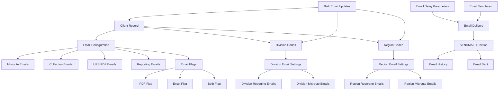
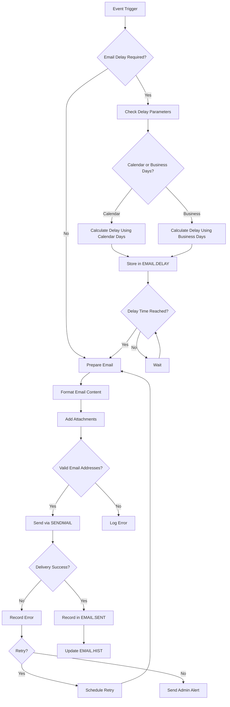
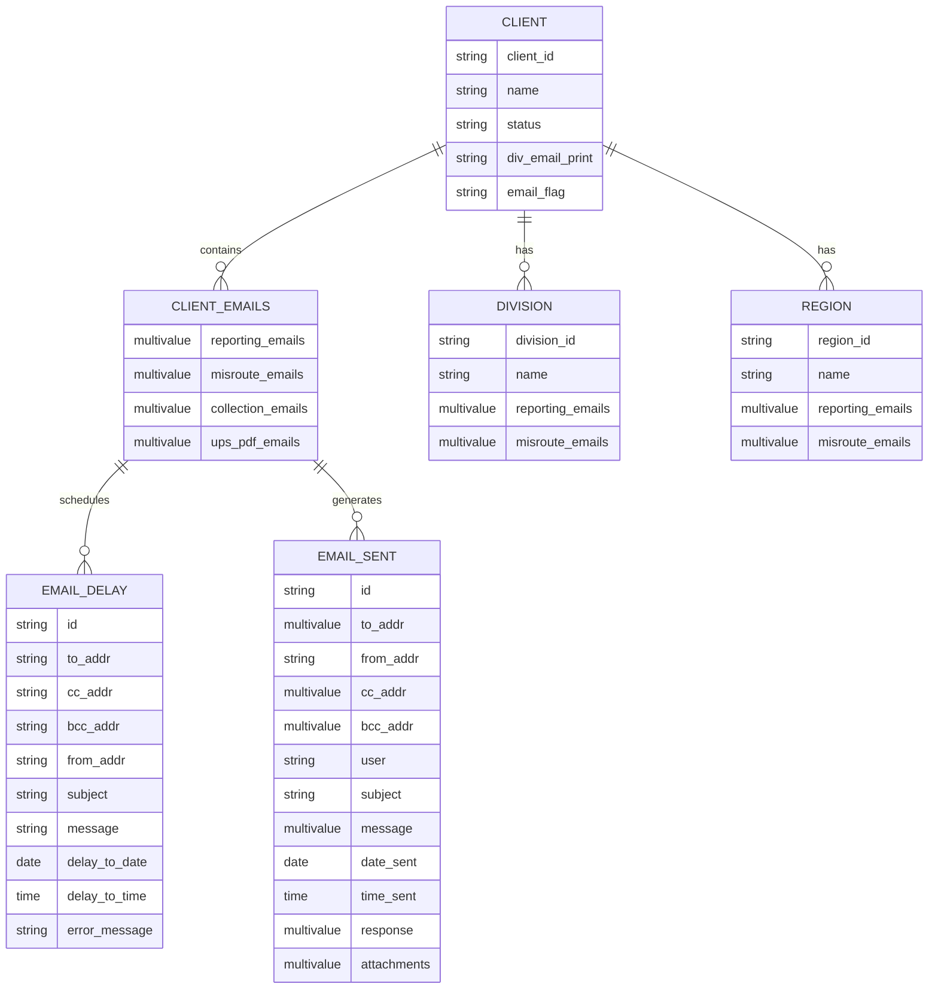

# Client Email Maintenance in AFS Shreveport

## Overview of Client Email Management

Client email management in AFS Shreveport is a critical component of the system's client communication infrastructure. The platform maintains various types of email addresses and configurations that enable automated notifications, document delivery, and client communications. Email addresses are stored across multiple database files including client records, division codes, and region codes. The system supports different categories of email notifications with specific configuration options for each type, allowing granular control over which contacts receive specific types of communications. Email addresses can be configured at the client level for company-wide communications, or at division and region levels for more targeted notifications. The system includes validation mechanisms to ensure email addresses are properly formatted and provides utilities for bulk updates when email addresses change.

## Types of Email Notifications

AFS Shreveport supports several distinct types of email notifications, each serving different business purposes:

1. **Misroute Alerts**: Notifications sent when freight is misrouted, allowing clients to take corrective action. These can include additional information like contact name, notification amount threshold, and direction codes (inbound/outbound/third-party).

2. **Collection Notices**: Email notifications related to accounts receivable and collection activities, helping clients stay informed about payment status and outstanding balances.

3. **UPS PDF Delivery**: Automated distribution of UPS e-billing documents to clients based on their preferences (PDF, Excel, or both formats).

4. **Reporting Emails**: Regular delivery of freight billing reports, analytics, and performance metrics to designated client contacts.

5. **Transportation Exception Management (TEM)**: Notifications about freight exceptions, including Most Savings Realized (MSR) and Least Cost Carrier (LCC) exceptions.

6. **Cutback Bills**: Notifications about bill adjustments and corrections sent to designated client contacts.

7. **Account Manager Communications**: Direct communications with client account managers for relationship management.

8. **Remittance Notifications**: Information about payments and remittances sent to financial contacts.

## Email Configuration Architecture

The email configuration architecture in AFS Shreveport follows a hierarchical structure where email settings can be defined at multiple levels. Client records serve as the primary container for email configuration, with specialized fields for different notification types. Division and region codes extend this functionality by allowing more granular control over notifications for specific organizational units. The system uses flags to control email behavior and maintains history records of sent emails for auditing and troubleshooting purposes.

## Email Address Management

Email addresses in AFS Shreveport are stored in multiple locations depending on their purpose and scope. The primary storage is within client records, where different attributes hold email addresses for specific notification types. For example, attributes 125-127 typically store reporting email addresses, attributes 153-155 store misroute notification addresses, and attributes 222-224 store collection notification addresses.

Email addresses can include additional metadata such as:
- Contact name associated with the email
- Title or department of the contact
- Notification amount threshold (for financial notifications)
- Direction codes (I=Inbound, O=Outbound, T=Third-party) to specify which shipment types trigger notifications

The system validates email addresses to ensure they contain the '@' symbol and performs domain auto-completion in some interfaces to save keystrokes by reusing domains from previously entered addresses. When updating email addresses, the system maintains audit trails by recording the previous values, the user who made the change, and the timestamp.

For clients with divisions or regions, email addresses can be configured at these more specific levels, allowing targeted communications for different parts of the client's organization. The system also includes a "DIV.EMAIL.PRINT" flag that controls whether division-specific email addresses are used.

## Division and Region Email Configuration

AFS Shreveport supports hierarchical email configuration through division and region settings, allowing for more targeted notifications based on organizational structure:

**Division Email Configuration:**
- Each client can have multiple divisions, each with its own set of email addresses
- Division email settings override client-level settings for division-specific notifications
- The DIV.UPS.EMAIL.MAINT utility manages UPS PDF email addresses for specific divisions
- Division email addresses are stored in the DIVISION.CODES file with client ID as part of the file name
- The system supports both reporting and misroute email types at the division level
- A "DIV.EMAIL.PRINT" flag in the client record controls whether division emails are used

**Region Email Configuration:**
- Regions represent another level of organizational hierarchy below divisions
- Region email settings are stored in the REGION.CODES file with client ID as part of the file name
- Like divisions, regions support both reporting and misroute email types
- Region email settings take precedence over both client and division settings for region-specific notifications
- Region email configuration follows the same pattern as division configuration

This multi-level approach allows clients to configure email notifications with high granularity, ensuring that the right contacts receive the right information based on their responsibilities within the organization.

## Email Notification Workflow

The email notification workflow in AFS Shreveport begins with an event trigger, such as a freight bill being processed or a misrouting detection. The system then determines if the email should be sent immediately or delayed based on configured parameters. For delayed emails, the system calculates the appropriate delay using either calendar days or business days as specified in the configuration.

Delayed emails are stored in the EMAIL.DELAY file until their scheduled delivery time. When the delivery time is reached, the system prepares the email by formatting the content, adding any required attachments, and validating the recipient email addresses.

The email is then sent using the SENDMAIL function, which handles the actual delivery through the SMTP server. The system records successful deliveries in the EMAIL.SENT file and updates the EMAIL.HIST file for historical tracking. If delivery fails, the system logs the error and may attempt to retry the delivery based on configuration settings. For persistent failures, the system sends alerts to administrators for investigation.

## Email Delay Parameters

AFS Shreveport provides sophisticated controls for delaying email notifications through the EMAIL.DELAY.PARMS utility. This functionality allows administrators to configure when emails are sent based on various business rules:

1. **Calendar Mode Selection**:
   - Business Days: Emails are delayed based on business days only (typically Monday through Friday)
   - Calendar Days: Emails are delayed based on all calendar days including weekends and holidays

2. **Delay Basis Options**:
   - Today: Delay is calculated from the current date
   - Check Date: Delay is calculated from the date on the check or document
   - Specific Day of Week: Emails are sent on a particular day of the week

3. **Delay Duration**:
   - Number of days to delay the email after the basis date
   - Can be configured differently for different notification types

4. **Time of Day Settings**:
   - Specific time when delayed emails should be sent
   - Helps control email delivery during business hours

These parameters are stored in the FB.TABLES file with identifiers that include the program mode and "ALL" suffix. The system includes safeguards to prevent conflicts with check printing processes and notifies stakeholders when parameters are changed.

The delay functionality is particularly useful for financial notifications, allowing them to be timed with payment processing or other financial events. When emails are delayed, they are stored in the EMAIL.DELAY file until their scheduled delivery time, at which point they are processed by the email delivery system.

## Bulk Email Address Updates

AFS Shreveport provides the FB.UPD.CLIENT.EMAILS utility for mass updating email addresses across client records and related entities. This powerful tool allows administrators to:

1. **Search for Specific Email Addresses**: Find all instances of a particular email address across the system.

2. **Replacement Options**:
   - Delete: Remove the email address entirely
   - Replace: Substitute with a new email address
   - Add: Keep the original email and add additional addresses

3. **Scope Control**:
   - Process all clients or limit to a specific client
   - Filter by AFS domain addresses only, non-AFS addresses only, or both
   - Include or exclude duplicate addresses

4. **Comprehensive Updates**: The utility processes email addresses in:
   - Client records (reporting, misroute, and collection emails)
   - Division codes
   - Region codes
   - Vendor/customer files

5. **Audit Trail**: All changes are logged for tracking purposes

This utility is particularly useful when staff members change email addresses or when client contacts are updated. It ensures consistency across all systems and prevents notification failures due to outdated email addresses. Access to this utility is restricted to authorized users to prevent accidental mass updates.

## Email Data Structure

The email data structure in AFS Shreveport is distributed across multiple files and attributes within those files. Client records serve as the primary container, with specific attributes dedicated to different types of email addresses:

1. **Client Records (CLIENTS file)**:
   - Attributes 125-127: Reporting email addresses
   - Attributes 153-160: Misroute email addresses and metadata
   - Attributes 222-224: Collection email addresses
   - Attribute 252: UPS PDF email addresses
   - Attribute 251: File flag for email preferences (P=PDF, E=Excel, B=Both)

2. **Division Records (DIVISION.CODES file)**:
   - Attributes 8-10: Division reporting email addresses
   - Attributes 27-29: Division misroute email addresses
   - Attribute 48: Division UPS PDF email addresses

3. **Region Records (REGION.CODES file)**:
   - Attributes 8-10: Region reporting email addresses
   - Attributes 27-29: Region misroute email addresses

4. **Email Delay Records (EMAIL.DELAY file)**:
   - Structured ID: Subsystem|Counter format
   - Contains recipient addresses, subject, message, attachments
   - Includes delay parameters and error tracking

5. **Email History (EMAIL.HIST and EMAIL.SENT files)**:
   - Track all sent emails for auditing and troubleshooting
   - Include full message details, timestamps, and delivery status

This distributed structure allows for flexible and granular email configuration while maintaining relationships between clients, divisions, regions, and their respective notification preferences.

## Email Error Handling and Reporting

AFS Shreveport implements comprehensive error handling and reporting for email communications to ensure reliability and provide visibility into delivery issues:

1. **Error Detection**:
   - The SENDMAIL function checks for various failure conditions including:
     - Missing recipient addresses
     - Invalid email format
     - SMTP server connection failures
     - File attachment issues
   - The EMAIL.DELAY system monitors for emails that fail to send at their scheduled time

2. **Error Logging**:
   - Failed emails are recorded with detailed error messages
   - The EMAIL.DELAY file includes an attribute specifically for error messages
   - The system maintains logs of all email attempts, successful or failed

3. **Administrative Notifications**:
   - When critical email failures occur, the system automatically notifies administrators
   - Notifications include details about the failed email and the specific error encountered
   - Different notification recipients based on the type of failure (IT staff vs. business users)

4. **Reporting Tools**:
   - The EMAIL.DELAY.DF utility allows exporting delayed email records to Excel
   - Reports can be filtered to show only emails with errors
   - Detailed information includes all email parameters and error messages

5. **Retry Mechanism**:
   - Some email failures trigger automatic retry attempts
   - The system implements progressive delays between retry attempts
   - After multiple failures, the system escalates to administrator intervention

This comprehensive approach to error handling ensures that communication failures are quickly identified and addressed, maintaining the reliability of the client notification system.

## Security and Access Control

AFS Shreveport implements a multi-layered security model for email configuration management to protect sensitive client information and prevent unauthorized changes:

1. **User Authorization**:
   - Access to email configuration utilities is restricted to specific authorized users
   - Different utilities have different authorization lists based on their sensitivity
   - Some utilities distinguish between view-only and change access levels
   - Unauthorized access attempts are logged and reported to administrators

2. **Super User Privileges**:
   - Certain functions require elevated "super user" privileges
   - Super users can override normal restrictions when necessary
   - Super user actions are logged for audit purposes

3. **Record Locking**:
   - The system implements record locking to prevent concurrent edits
   - Users are notified when a record is locked by another user
   - Lock information includes the username of the person holding the lock

4. **Change Validation**:
   - Email address changes require confirmation before being applied
   - Bulk updates require explicit confirmation with an "I-UNDERSTAND" prompt
   - The system validates email formats before accepting changes

5. **Audit Trails**:
   - All changes to email configurations are logged with:
     - Username of the person making the change
     - Timestamp of the change
     - Previous and new values
     - Program used to make the change
   - Audit records are stored in dedicated files like FB.ADJUST.CLIENT

This comprehensive security approach ensures that email configurations remain accurate and are only modified by authorized personnel, protecting both client communications and system integrity.

## Email Delivery Audit Trail

AFS Shreveport maintains detailed audit trails for email delivery to support compliance requirements and facilitate troubleshooting. The audit system tracks every stage of the email lifecycle from creation through delivery:

1. **Email Creation Records**:
   - When an email is generated, the system records:
     - The triggering event or process
     - The user or system component that initiated the email
     - All email parameters including recipients, subject, and content
     - Any attachments included with the email

2. **Delivery Attempt Tracking**:
   - Each delivery attempt is recorded with:
     - Timestamp of the attempt
     - Success or failure status
     - Detailed response from the email server
     - Error messages if delivery failed

3. **Historical Storage**:
   - Successfully sent emails are stored in the EMAIL.SENT file
   - All emails, successful or not, are archived in the EMAIL.HIST file
   - The system maintains these records for compliance and reference purposes

4. **Delayed Email Tracking**:
   - Emails scheduled for delayed delivery are tracked in the EMAIL.DELAY file
   - The system records when the delay was scheduled and when delivery was attempted
   - Any errors during the delayed delivery process are captured

5. **Reporting Capabilities**:
   - The EMAIL.DELAY.DF utility can export audit data to Excel for analysis
   - Reports can be filtered by various criteria including date ranges and error status
   - This facilitates both routine auditing and targeted investigation of issues

6. **Client-Specific Logging**:
   - Some email processes create client-specific log entries
   - These logs are associated with the client ID and include date-based identifiers
   - This allows for client-specific auditing and troubleshooting

This comprehensive audit trail ensures that all email communications can be tracked and verified, supporting both operational needs and compliance requirements.

[Generated by the Sage AI expert workbench: 2025-05-28 08:06:17  https://sage-tech.ai/workbench]: #