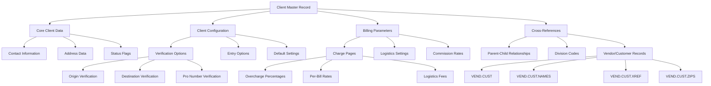
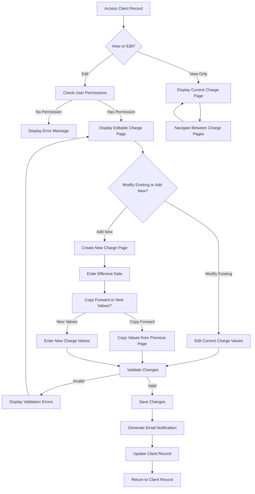
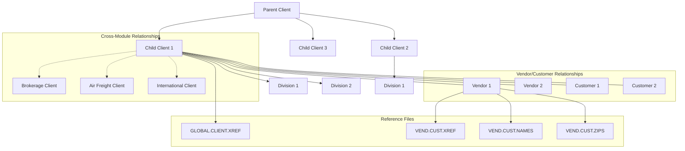
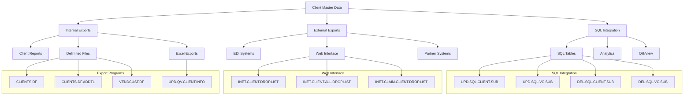

# Client Master Maintenance in AFS Shreveport

## Overview of Client Master Maintenance

Client master maintenance is a fundamental component of the AFS Shreveport system, serving as the backbone for managing comprehensive client records essential for freight billing operations. The system provides a robust framework for creating, modifying, and maintaining detailed client profiles that drive various operational processes. Client master maintenance encompasses everything from basic contact information and addresses to sophisticated billing configurations, verification rules, and cross-system relationships. These records serve as the foundation for freight bill processing, auditing, reporting, and integration with external systems, ensuring consistent and accurate handling of client data across the entire AFS Shreveport platform.

## Client Record Structure

The AFS Shreveport system maintains a sophisticated client record structure within its MultiValue database environment. At the core of this structure is the CLIENTS file (also referenced as BCUST in some modules), which stores comprehensive client information in a multi-attribute format. Each client record is identified by a unique 5-digit client ID and contains hundreds of attributes organized into logical sections. 

The primary client record includes:
- Basic identification (client ID, name, aliases/DBA names)
- Multiple address lines with separate physical and mailing addresses
- Contact information (phone, fax, email addresses for various purposes)
- Status indicators (active/inactive, logistics client, parcel audit)
- Financial parameters (fiscal year, payment terms, banking information)
- Administrative contacts (billing attention, invoice contact)
- Configuration flags for various processing options
- Relationship references (parent client ID, cross-references)
- Salesperson assignments (lead and servicing representatives)
- Effective-dated charge configurations for billing rates and fees

The system uses a combination of direct attributes and multi-valued fields to store related data elements, with some complex configurations (like charge pages) implemented as multi-valued lists with effective dates to maintain historical records of client settings.

## Client Master Data Architecture

## Client Creation and Modification

The client creation and modification process in AFS Shreveport is primarily handled through the FB.1.1 program, which provides a comprehensive interface for managing client master records. The process begins with user authentication, where access levels determine what operations can be performed. Users with appropriate permissions can create new clients by entering a unique client ID or allowing the system to generate one automatically.

When creating a new client, several fields are mandatory:
- Client name
- Address information (at least one address line)
- City, state, and ZIP code
- Status (defaulted to Active)
- Lead salesperson assignment

The system validates ZIP codes against the ZIPS.CODES database, automatically populating city and state information when possible. Phone and fax numbers are formatted according to standard patterns, and email addresses are validated for proper syntax.

For existing clients, the modification process includes similar validation rules but also maintains data integrity by checking for dependencies across related systems. The program implements different access levels that control what users can view or modify:
1. Display-only mode for basic users
2. Limited edit mode for operational staff
3. Full edit mode for administrators
4. Special access for charge page modifications

When critical fields are modified, particularly those affecting billing or logistics operations, the system can send automated email notifications to relevant stakeholders. The client modification process also includes options to manage related records such as divisions, vendor/customer entries, and cross-references to other systems.

## Billing Configuration

The AFS Shreveport system provides extensive capabilities for managing client-specific billing parameters through its charge configuration interface. Billing settings are organized into charge pages that contain effective-dated configurations, allowing for historical tracking of rate changes over time. Each charge page stores dozens of billing parameters including overcharge percentages, logistics fees, per-bill rates, and various service charges.

The primary billing configuration is managed through the FB.1.1.CHARGES.NEW subroutine, which presents a multi-page interface for viewing and editing client charge information. Key billing parameters include:

1. **Percentage-based charges:**
   - Overcharge percentages (separate for inbound/outbound/third-party)
   - Logistics percentages by transportation mode
   - Fuel surcharge calculations

2. **Flat fee structures:**
   - Per-bill processing fees
   - Weekly/monthly minimum charges
   - Service management fees
   - Parcel audit fees

3. **Logistics-specific settings:**
   - Contract dates and terms
   - Misroute automation parameters
   - Carrier-specific commission rates

The system enforces validation rules to ensure proper configuration, such as requiring per-bill fees when monthly minimums are set, or automatically configuring related settings when logistics client status changes. When charge pages are modified, the system can generate detailed email notifications to stakeholders, showing before and after values for each changed parameter.

Charge pages are effective-dated, allowing for scheduled rate changes. Users can add new charge pages with future dates, copy existing charges forward, or modify current charges as needed. The system maintains a history of all charge configurations, enabling accurate billing based on the rates in effect when services were provided.

## Client Charge Configuration Workflow

## Verification and Validation Options

AFS Shreveport provides comprehensive verification and validation options that can be configured at the client level to ensure data integrity during freight bill processing. These options determine which data elements require verification during the bill entry and auditing processes, allowing for client-specific validation rules.

The FB.1.1.VERIFY.OPTS.NEW subroutine manages key verification options, which include:

1. **Shipment Information Verification:**
   - In/Out codes (determining inbound/outbound status)
   - Division codes (for organizational units within client)
   - Expense codes (for cost allocation)
   - Origins and destinations (shipping locations)
   - Weights (package or shipment weights)

2. **Reference Number Verification:**
   - Bill of Lading numbers
   - Purchase Order numbers
   - Pro Numbers (carrier tracking numbers)
   - Pro Dates (shipment dates)

3. **Financial Verification:**
   - Due dates (payment terms)
   - Discounts (promotional or volume-based)
   - Distributions (cost allocations)

4. **Entity Verification:**
   - Vendor names
   - Customer names
   - Logistics distributions

5. **Specialized Verification:**
   - Class (freight classification)
   - Air pieces (for air freight)
   - OLA accessorials (origin line allowance charges)

Each verification option can be set to "Y" (required) or "N" (optional), with the exception of Pro Number verification which is mandatory and always set to "Y". These settings influence the data entry process by determining which fields must be completed and validated before a freight bill can be processed.

Additionally, the system provides entry options (managed by FB.1.1.ENTRY.OPTS.NEW) that control how data is captured and processed, including options for user-defined fields, EDI printing, OCR customer information, and specialized processing for different transportation modes.

## Client Relationships and Hierarchies

The AFS Shreveport system implements a sophisticated framework for managing relationships between clients across different modules and business units. This hierarchy structure is essential for organizations with complex corporate structures, allowing parent companies to oversee operations while maintaining separate billing for subsidiaries.

The primary relationship model is the parent-child structure, where a parent client can have multiple child clients associated with it. These relationships are maintained in the GLOBAL.CLIENT.XREF file, which stores cross-references between clients across four main systems:
- Freight Payment (FP)
- Air Freight (AF)
- International (INT)
- Brokerage (BR)

Each client record contains a parent ID reference (attribute 147), which points to its parent client. This enables hierarchical reporting and consolidated views across related entities. The FB.1.11.15 program provides an interface for maintaining these parent-child relationships, allowing administrators to:
- View existing relationships
- Add new child clients to a parent
- Remove child clients from a parent
- Update parent references across systems

Beyond the parent-child hierarchy, the system also maintains other types of relationships:
1. **Division relationships** - Clients can have multiple divisions with specific codes and settings
2. **Vendor/Customer relationships** - Each client has associated vendors and customers in VEND.CUST files
3. **Cross-module relationships** - Clients may have corresponding records in other AFS modules

The BUILD.GLOBAL.CUST.NOS subroutine ensures consistency by synchronizing customer numbers across modules, generating appropriate IDs, and maintaining cross-references. When client relationships change, the system updates all affected records and can rebuild cross-reference files to maintain data integrity.

## Client Relationship Structure

## Vendor and Customer Management

The AFS Shreveport system provides comprehensive tools for maintaining vendor and customer records associated with clients. These records are essential for freight bill processing, as they represent the shippers, consignees, and carriers involved in transportation transactions.

Vendor and customer records are stored in client-specific VEND.CUST files, with each record containing:
- Description (company name)
- Address information (multiple lines)
- City, state, and ZIP code
- Contact information
- Type code (vendor, customer, intercompany, or reject)
- Reference codes and expense codes

The FB.1.6 program serves as the primary interface for managing these records, allowing users to:
1. Search for existing records by ID or name (with soundex support for fuzzy matching)
2. Create new records with auto-generated IDs
3. Modify existing records
4. Delete records (with proper cross-reference maintenance)

To support efficient searching and data integrity, the system maintains several related files:
- VEND.CUST.NAMES - Stores unique vendor/customer descriptions with references to VEND.CUST records
- VEND.CUST.XREF - Cross-references descriptions with ZIP codes for lookup
- VEND.CUST.ZIPS - Organizes vendor/customer records by ZIP code
- SDX.VEND.CUST - Soundex index for phonetic name searching

The FB.2.1.CONSIGN.NEW subroutine handles vendor/customer entry during freight bill processing, allowing users to select existing records or create new ones on-the-fly. The system also includes utilities like VC.DUPLICATE.REMOVER to identify and eliminate duplicate records, and CHECK.VEND.CUST to validate data integrity.

For clients with large vendor/customer databases, the system provides import capabilities through programs like FIX.VEND.CUST.ATTR.42, which can load data from tab-delimited files. When vendor/customer records are modified, the system updates all related cross-references to maintain consistency across the database.

## Data Integrity and Maintenance

Maintaining data integrity across client master records is a critical function in the AFS Shreveport system. The platform includes numerous utilities and processes designed to ensure data quality, consistency, and reliability across all client-related files.

Key data integrity mechanisms include:

1. **Cross-Reference Maintenance:**
   - Programs like VEND.CUST.XREF.REBUILD and VEND.CUST.ZIPS.REBUILD ensure that lookup tables remain synchronized with primary data
   - BUILD.UPS.XREF creates and maintains cross-references between UPS plans and clients
   - FB.4.16 rebuilds client soundex files for accurate name-based searching

2. **Validation Utilities:**
   - CHECK.FOR.DUPS.IN.VCZ identifies duplicate pointers in vendor/customer ZIP records
   - VERIFY.VCX validates cross-references between VEND.CUST and VEND.CUST.XREF files
   - VERIFY.VCN ensures consistency between vendor/customer names across related files
   - VC.REPAIR.CLIENT fixes inconsistencies in vendor/customer records

3. **Data Cleanup Tools:**
   - VC.DUPLICATE.REMOVER identifies and removes duplicate vendor/customer entries
   - FIX.VEND.CUST allows standardization of vendor/customer descriptions
   - LOAD.VEND.CUST.NAMES populates name files with unique vendor/customer descriptions

4. **Integrity Checks:**
   - FB.1.1 performs extensive validation before saving client changes
   - FB.1.14 provides tools for combining duplicate vendor/customer records
   - Various CHECK.* utilities validate specific aspects of client data

The system also implements safeguards to prevent data corruption:
- Record locking during updates to prevent concurrent modifications
- Permission-based access control for sensitive operations
- Email notifications for critical changes to client settings
- Automated cross-reference updates when primary records change

Maintenance processes are both proactive and reactive, with scheduled rebuilds of index files and on-demand tools for addressing specific data issues. The system's MultiValue database structure allows for flexible data relationships while maintaining referential integrity through carefully managed cross-references.

## Client Data Export and Integration

The AFS Shreveport system provides robust capabilities for exporting client data to various formats and integrating with external systems. These functions are essential for reporting, data analysis, and maintaining consistency across the enterprise technology ecosystem.

Client data export is facilitated through several specialized programs:
1. **CLIENTS.DF and CLIENTS.DF.ADDTL** - Generate delimited files containing comprehensive client information for importing into PC applications
2. **VENDCUST.DF** - Exports vendor/customer information in a tab-delimited format
3. **TAB.CLIENT.NAME and TAB.CLIENTS.ADDRESS** - Create CSV files with client contact and address information
4. **UPD.QV.CLIENT.INFO** - Exports client data to QlikView for analytics and reporting

The system also maintains integration with SQL databases through specialized subroutines:
- **UPD.SQL.CLIENT.SUB** - Updates client information in SQL tables
- **UPD.SQL.VC.SUB** - Updates vendor/customer information in SQL tables
- **DEL.SQL.CLIENT.SUB** - Removes client records from SQL databases
- **DEL.SQL.VC.SUB** - Removes vendor/customer records from SQL databases

For web interface integration, several programs format client data for web access:
- **INET.CLIENT.DROP.LIST** - Formats client information for web display
- **INET.CLIENT.ALL.DROP.LIST** - Provides comprehensive client data for web interfaces
- **INET.CLAIM.CLIENT.DROP.LIST** - Exports claims client information for web access
- **INET.LOCATIONS** - Formats location data as XML for web display

The system supports various export formats including:
- Tab-delimited files for Excel import
- Comma-separated values (CSV) files
- XML structured data
- Direct SQL database updates

These integration capabilities ensure that client master data remains consistent across all systems and platforms, supporting both operational processes and analytical functions throughout the organization.

[Generated by the Sage AI expert workbench: 2025-05-28 08:06:13  https://sage-tech.ai/workbench]: #