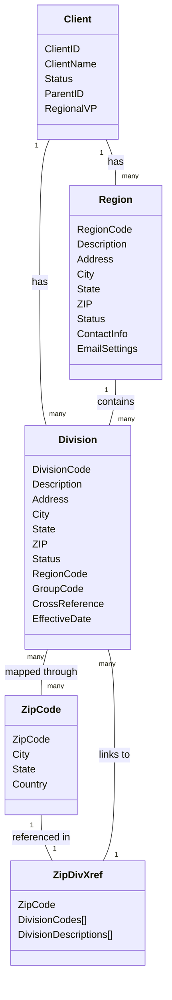
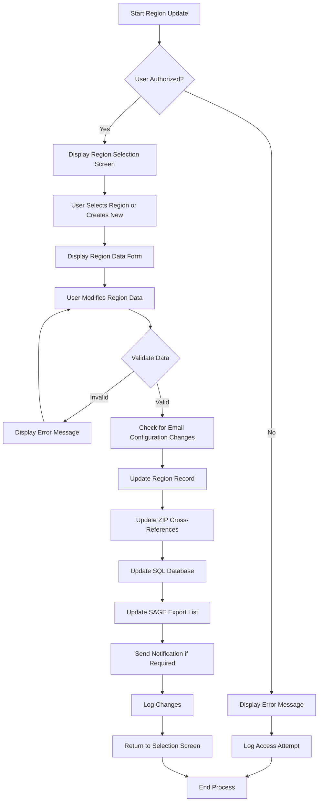
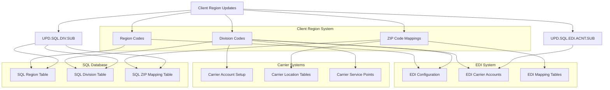
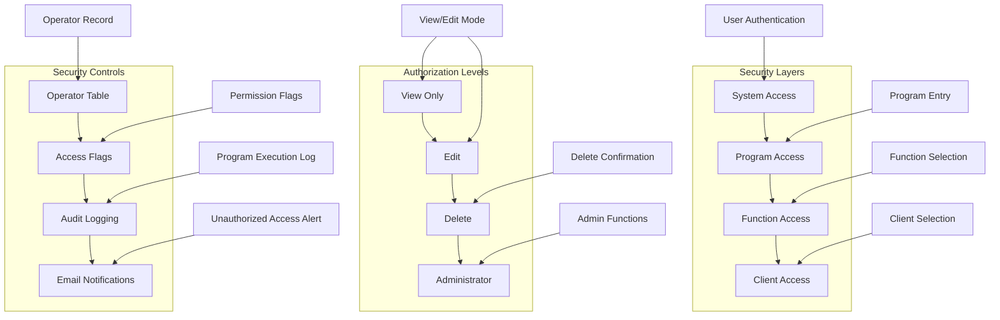

# Client Region Management in AFS Shreveport

## Overview of Client Region Management

The AFS Shreveport system implements a comprehensive client region management framework that enables the organization and administration of client operations across different geographic areas. This functionality is essential for supporting client-specific logistics operations, billing processes, and regional routing of freight. The region management system allows AFS to configure clients with specific regional settings that determine how shipments are processed, billed, and reported based on their geographic origin and destination.

The client region management functionality consists of several interconnected components, including region codes, division codes, ZIP code mappings, and country designations. These components work together to create a hierarchical structure that supports location-based business rules and operational workflows. Region codes represent broad geographic areas, while division codes typically represent more specific locations or organizational units within those regions. ZIP codes are mapped to divisions to enable automatic routing of shipments based on postal codes.

The system provides tools for creating, updating, and maintaining these regional configurations, with security controls that restrict access to authorized personnel. It also includes integration points with other system components such as EDI (Electronic Data Interchange), carrier accounts, and SQL databases to ensure consistent regional data across the platform.

## Client Region Data Structure

The diagram illustrates the hierarchical relationship between clients, regions, divisions, and ZIP codes in the AFS Shreveport system. Each client can have multiple regions, and each region can contain multiple divisions. Divisions are mapped to ZIP codes through a cross-reference table (ZIP.DIV.XREF) that enables the system to determine the appropriate division for a given postal code. This structure supports efficient routing of shipments and application of region-specific business rules.

The client region data structure is implemented through several key files in the system, including REGION.CODES, DIVISION.CODES, and ZIP.DIV.XREF, which are created dynamically for each client. This client-specific approach allows for customized regional configurations that meet the unique needs of different clients while maintaining a consistent overall structure.

## Regional Configuration Components

The AFS Shreveport system's regional configuration is built upon several core components that work together to define how client operations are organized geographically. These components include region codes, division codes, ZIP code mappings, and country designations.

Region codes serve as the highest level of geographic organization within the client structure. Each region represents a broad geographic area and contains metadata such as description, address information, contact details, and status flags. Regions can be designated as active or inactive, allowing for temporary suspension of operations in specific areas without losing configuration data.

Division codes represent more granular geographic or organizational units within regions. Divisions typically correspond to specific locations such as distribution centers, warehouses, or business units. Each division record contains detailed location information including address, city, state, ZIP code, and contact information. Divisions are linked to regions through a region code reference, creating a hierarchical relationship.

ZIP code mappings form a critical component of the regional configuration by associating postal codes with specific divisions. This mapping is implemented through ZIP.DIV.XREF files that are unique to each client. These cross-reference files enable the system to automatically route shipments to the appropriate division based on origin or destination ZIP codes. The system supports up to 10 division codes per ZIP code, allowing for complex routing scenarios.

Country designations provide international context for regional configurations. The system maintains country codes (US, CA, MX, etc.) associated with ZIP codes to support international shipping operations. This information is used for customs documentation, international rate calculations, and compliance with cross-border shipping regulations.

Together, these components create a flexible framework that can be customized to match each client's geographic footprint and organizational structure, enabling efficient management of logistics operations across diverse regions.

## Region and Division Maintenance

The AFS Shreveport system provides comprehensive tools for creating, updating, and managing client regions and divisions. These maintenance functions are primarily implemented through programs like FB.1.20.REG for regions and FB.1.4.DIV for divisions, which offer similar interfaces with appropriate field-specific variations.

For region maintenance, authorized users can create new region codes or modify existing ones through a form-based interface. The system captures essential information including region descriptions, addresses, contact details, and status flags. Regions can be marked as active or inactive, allowing for temporary suspension of operations in specific areas without losing configuration data. The region maintenance interface also supports the assignment of cross-reference codes and group codes that can be used for reporting and analysis.

Division maintenance follows a similar pattern but includes additional fields specific to divisions. The FB.1.4.DIV program allows users to create and modify division records with information such as division descriptions, addresses, contact details, and status flags. Divisions are linked to regions through a region code reference, creating a hierarchical relationship. The system also supports the configuration of substitute divisions that can be used when the primary division is unavailable or for load balancing purposes.

Both region and division maintenance interfaces include validation checks to ensure data integrity. For example, ZIP codes are validated against reference databases to confirm they are valid postal codes. The system also enforces security controls that restrict access to authorized personnel, with different permission levels for viewing versus editing capabilities.

Status management is a key aspect of region and division maintenance. By marking regions or divisions as inactive rather than deleting them, the system preserves historical data while preventing new shipments from being routed to discontinued locations. This approach supports accurate reporting and analysis of historical shipping patterns while maintaining operational efficiency.

Cross-reference capabilities allow regions and divisions to be linked to external identifiers, facilitating integration with client systems and supporting client-specific terminology for locations. This flexibility enables AFS to align their regional structure with client expectations and business processes.

## Region Update Workflow

The diagram illustrates the workflow for updating client region information in the AFS Shreveport system. The process begins with authentication and authorization checks to ensure that only authorized users can modify region data. Once authorized, the user can select an existing region to modify or create a new one.

The system displays a form with the current region data (or empty fields for a new region), allowing the user to make changes to fields such as description, address information, contact details, and status flags. As the user modifies the data, the system performs validation checks to ensure that all required fields are completed correctly and that data formats are valid.

After validation, the system processes the changes by updating the region record in the REGION.CODES file. If the region's ZIP code has changed, the system also updates the appropriate ZIP code cross-references to maintain accurate routing information. The system then synchronizes the changes with the SQL database through the UPD.SQL.DIV.SUB subroutine, ensuring consistency across different parts of the application.

For clients configured for SAGE integration, the system updates the SAGE export list to reflect the changes. If the region update involves changes to email notification settings, the system processes these changes to ensure that notifications are sent to the correct recipients.

Throughout the process, the system logs all changes for audit purposes, providing a record of who made changes and when they were made. This comprehensive workflow ensures that region updates are processed accurately and consistently while maintaining data integrity across the system.

## ZIP Code Management

The AFS Shreveport system implements a sophisticated ZIP code management framework that associates postal codes with specific regions and divisions for routing and processing purposes. This functionality is critical for determining how shipments are handled based on their origin and destination locations.

The core of ZIP code management is the creation and maintenance of ZIP-to-division cross-references. These cross-references are stored in client-specific ZIP.DIV.XREF files, which map ZIP codes to one or more division codes. The system supports up to 10 division codes per ZIP code, allowing for complex routing scenarios where a single postal code might be serviced by multiple divisions based on different criteria.

ZIP code management is primarily handled through programs like DIV.ZIPS, which provides a user interface for creating and modifying ZIP code to division mappings. When a user assigns a ZIP code to a division, the system first validates the ZIP code against reference databases (ZIPS.CODES, CAN.ZIP.CODES, MEX.ZIP.CODES) to ensure it is a valid postal code. The system also retrieves city and state information associated with the ZIP code to display in the interface, helping users confirm they have selected the correct postal code.

When divisions are updated, the system automatically maintains the ZIP.DIV.XREF records to ensure consistency. For example, if a division's ZIP code is changed, the system removes the division from the old ZIP code's cross-reference and adds it to the new one. Similarly, if a division is marked as inactive, it is removed from all ZIP code cross-references to prevent routing to an inactive location.

The system also supports special handling for international ZIP codes, with country codes (US, CA, MX, etc.) associated with each postal code. This information is used for customs documentation, international rate calculations, and compliance with cross-border shipping regulations.

ZIP code management integrates with other system components through utility functions like DIV.ZIPS, DIV.REG, and DIV.REC, which allow other parts of the application to retrieve division and region information based on ZIP codes. This integration ensures consistent handling of location-based business rules throughout the system.

## Email Notification System

The AFS Shreveport system incorporates a comprehensive email notification system for region-related events, ensuring that stakeholders are informed about important changes and activities within their assigned regions. This notification system is primarily configured at the region and division levels, with separate settings for different types of notifications.

The email notification system supports two main categories of notifications: reporting notifications and misrouting notifications. Reporting notifications are sent when reports related to a specific region are generated, providing stakeholders with timely information about regional performance, shipment volumes, and other metrics. Misrouting notifications alert relevant personnel when shipments are detected as being incorrectly routed based on regional configurations, enabling prompt corrective action.

For each region and division, the system maintains separate email distribution lists for these notification types. Each distribution list can include multiple recipients in the TO, CC, and BCC fields, allowing for flexible notification routing based on organizational roles and responsibilities. The FB.1.20.REG and FB.1.4.DIV programs provide interfaces for configuring these email settings, with separate screens for reporting and misrouting notification configurations.

When configuring email notifications, users can specify individual email addresses or use distribution lists for broader communication. The system validates email addresses to ensure they conform to standard email format requirements, reducing the risk of failed deliveries due to formatting errors.

The notification system integrates with the broader AFS email infrastructure through the FB.EMAIL subroutine, which handles the actual sending of notifications. This integration ensures consistent email formatting and delivery tracking across the application.

Email notifications include relevant context information such as the client name, region or division code, and specific details about the event that triggered the notification. For misrouting notifications, this typically includes information about the shipment, the expected routing, and the actual routing that was detected.

The system also includes functionality to update email addresses when personnel changes occur, ensuring that notifications continue to reach the appropriate recipients even as organizational structures evolve. This maintenance is typically performed through the region and division maintenance interfaces, with changes taking effect immediately for all future notifications.

## Regional Data Integration Points

The diagram illustrates how regional data in the AFS Shreveport system integrates with other key components, including EDI systems, SQL databases, and carrier accounts. This integration ensures consistent regional information across all aspects of freight management.

Regional data is central to the EDI (Electronic Data Interchange) system, which uses region and division codes to determine routing information for electronic transactions. When region or division information is updated, the EDI configuration is automatically updated to reflect these changes, ensuring that electronic shipments are processed according to the latest regional settings. The EDI system also maintains carrier account cross-references (EDI.CAR.ACNT.XREF) that link client divisions to specific carrier accounts, enabling accurate carrier selection based on regional information.

SQL database integration is handled through specialized subroutines like UPD.SQL.DIV.SUB, which synchronize changes to region and division data with corresponding SQL tables. This synchronization ensures that both the MultiValue database and SQL database contain consistent information, supporting reporting and integration with external systems that rely on SQL access. When region or division records are updated, these subroutines are automatically called to propagate the changes to the SQL environment.

Carrier account integration links division information to carrier-specific location identifiers and service points. This integration enables accurate carrier selection and rate calculation based on regional information. For example, when a division is updated with a new address or ZIP code, the system can automatically update the corresponding carrier account information to ensure that shipments are processed correctly by the carrier's systems.

The integration points are bidirectional, allowing changes in one system to be reflected in others. For example, when a division's address is updated, the change is propagated to both the SQL database and carrier account configurations. Similarly, when a ZIP code mapping is modified, the change affects routing decisions in both the AFS system and connected EDI processes.

This comprehensive integration ensures that regional data remains consistent across all aspects of the freight management process, from initial shipment creation through carrier selection, rating, and final delivery.

## Regional Reporting Capabilities

The AFS Shreveport system offers extensive reporting capabilities that leverage regional data to provide insights into client operations across different geographic areas. These reporting functions enable users to analyze performance, track shipment patterns, and identify opportunities for optimization based on regional factors.

Active/inactive region listings provide a comprehensive view of a client's geographic footprint, showing which regions are currently operational and which have been temporarily or permanently deactivated. These reports can be generated through the FB.1.20.REG program, which offers options to list all regions, only active regions, or only inactive regions. This functionality helps users understand the current scope of operations and identify regions that may need to be reactivated or permanently removed.

Division reports provide more detailed information about specific locations within regions. The FB.1.4.DIV program offers similar listing capabilities for divisions, allowing users to generate reports of all divisions, active divisions, or inactive divisions. These reports typically include information such as division codes, descriptions, addresses, and status flags, providing a comprehensive view of the client's operational locations.

Regional analysis reports combine shipment data with regional information to identify patterns and trends across different geographic areas. These reports can show metrics such as shipment volumes, costs, and service levels broken down by region, enabling users to compare performance across different parts of the client's network. This analysis can help identify regions that are performing well or those that may require additional attention or resources.

The system also supports custom reporting through integration with external reporting tools. Regional data is synchronized with SQL databases through the UPD.SQL.DIV.SUB subroutine, making it available for custom report development using SQL-based reporting tools. This flexibility allows users to create tailored reports that address specific business questions related to regional performance.

Email notifications for reports can be configured at the region level, ensuring that stakeholders receive relevant reports for their areas of responsibility. The email notification system allows for different distribution lists for different types of reports, enabling targeted communication of regional performance information.

Regional reporting capabilities are enhanced by the system's ability to maintain historical data even when regions or divisions are marked as inactive. This approach preserves the ability to analyze historical trends and compare current performance against past periods, providing valuable context for decision-making.

## Location Data Management

The AFS Shreveport system implements comprehensive location data management capabilities to maintain accurate and up-to-date geographic information within the regional framework. This functionality is essential for ensuring that shipments are correctly routed and that location-based business rules are applied consistently.

Location data is stored at multiple levels within the system, with increasing levels of specificity. At the highest level, country codes identify the nation where a location is situated, supporting international shipping operations. Within countries, state or province codes provide the next level of geographic organization. Cities and postal codes offer more precise location identification, with ZIP codes serving as the primary key for many location-based lookups.

The system maintains several reference databases for location validation, including ZIPS.CODES for U.S. postal codes, CAN.ZIP.CODES for Canadian postal codes, and MEX.ZIP.CODES for Mexican postal codes. These databases contain information such as city names, state codes, and country codes associated with each postal code, enabling validation and auto-completion of address information.

Address management is a key component of location data, with structured fields for address lines, city, state, ZIP code, and country. The system supports standardized formatting of addresses to ensure consistency and compatibility with carrier systems. This standardization is particularly important for international addresses, which may follow different formatting conventions.

Location validation is performed at multiple points in the system. When users enter ZIP codes in region or division maintenance screens, the system validates them against the appropriate reference database and automatically populates city and state information when possible. This validation helps prevent errors in address data that could lead to shipping problems or misrouting.

Location substitution capabilities allow the system to handle scenarios where the primary location is unavailable or inappropriate for a particular shipment. For example, a division record can specify a substitute division to be used when certain conditions are met, enabling flexible routing based on factors such as shipment characteristics or temporary facility closures.

Geographic identifiers such as region codes, division codes, and ZIP codes are used throughout the system to link shipments to specific locations. These identifiers enable the application of location-specific business rules, such as carrier selection, rate calculation, and service level determination.

Location data management also includes maintenance utilities such as ADD.COUNTRY.CODE.TO.ZIP and ZIP.FIX, which help ensure the completeness and accuracy of location reference data. These utilities can be used to add missing information or correct errors in the location databases, maintaining the integrity of the location data that underlies the regional framework.

## Client Region Security Model

The diagram illustrates the security model controlling access to region configuration functions in the AFS Shreveport system. This multi-layered approach ensures that only authorized users can view or modify sensitive client regional data.

At the foundation of the security model is the operator table (OPERATOR file), which stores user permissions for various system functions. Each user has specific flags set in their operator record that determine which programs they can access and what actions they can perform within those programs. For region configuration, key permission flags include access to view region data (flag 49) and permission to modify region data (flag 67).

The security model implements different authorization levels for regional configuration functions. The most basic level is view-only access, which allows users to see region and division data but not make changes. This level is appropriate for users who need to reference regional information but should not modify it. The next level is edit access, which allows users to create and modify region and division records. This level is typically granted to users responsible for maintaining client configurations. Delete access is more restricted, typically limited to administrators who may need to remove incorrect or outdated regional configurations. The highest level is administrator access, which includes all capabilities plus access to system-wide configuration settings.

When a user attempts to access a region configuration program like FB.1.20.NEW or FB.1.4.DIV, the system first checks their operator record to verify they have permission to use the program. If access is granted, the program then determines whether the user has view-only or edit privileges and configures the interface accordingly. For users with view-only access, edit functions are disabled, and the program displays a "View" indicator in the title bar.

The security model includes comprehensive audit logging through the UPD.PROGRAM.LOG function, which records each access to region configuration programs. This logging creates an audit trail showing who accessed regional data and when, supporting accountability and troubleshooting.

For particularly sensitive operations or unauthorized access attempts, the system can send email notifications to system administrators. For example, if an unauthorized user attempts to access the ZIP code maintenance program (FB.1.7), the system sends an email alert with details of the access attempt, including the user ID, date, and time.

This multi-layered security model ensures that client regional data is protected while remaining accessible to authorized users who need it for legitimate business purposes. The combination of operator permissions, authorization levels, audit logging, and alerting provides a comprehensive approach to securing this sensitive information.

[Generated by the Sage AI expert workbench: 2025-05-28 08:06:17  https://sage-tech.ai/workbench]: #