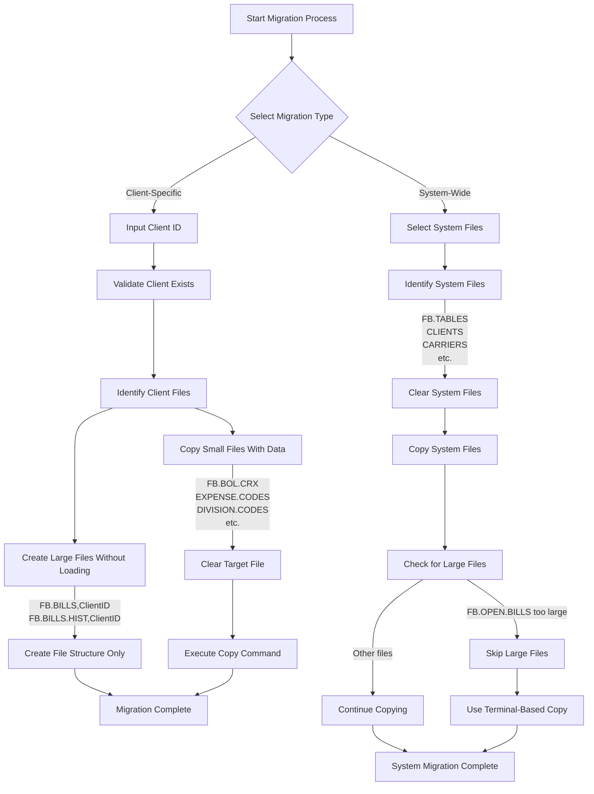
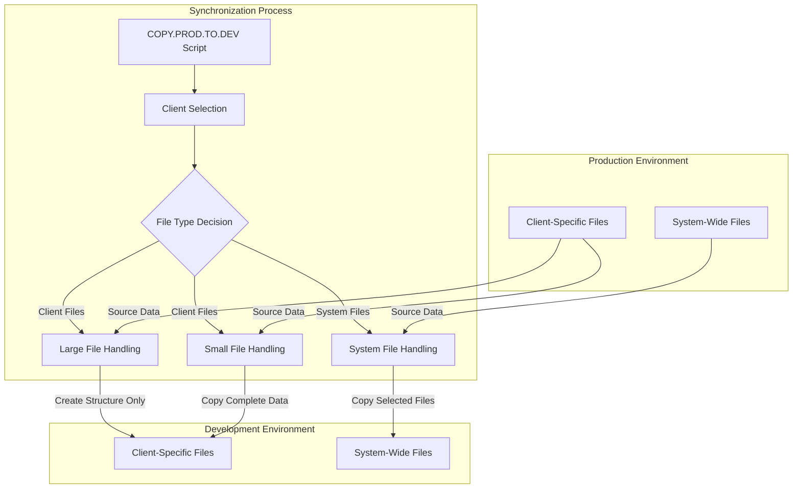

# Client Specific Data Files in AFS Shreveport

## Introduction to Client Specific Data Files

Client-specific data files form the backbone of the AFS Shreveport system's ability to handle customized freight billing operations for each client. These files store client-specific configurations, historical records, and operational data that enable the system to process freight bills according to each client's unique requirements. The architecture separates client data into dedicated files identified by client ID suffixes, allowing for isolated processing and customization without affecting other clients' operations. This approach enables AFS to maintain distinct billing rules, carrier relationships, expense codes, and division structures for each client while sharing common system functionality. Client-specific data files not only store transactional data like freight bills and bill of lading records but also maintain reference information critical for proper routing, auditing, and reporting. This separation provides scalability advantages as new clients can be onboarded without modifying core system files while ensuring data integrity and security through client-level isolation.

## Client Data File Architecture

```mermaid
graph TD
    subgraph "Client-Specific Data Files"
        FB_BILLS[FB.BILLS,{ClientID}]
        FB_BILLS_HIST[FB.BILLS.HIST,{ClientID}]
        FB_BOL_CRX[FB.BOL.CRX,{ClientID}]
        FB_OPEN_DATE[FB.OPEN.DATE.XREF,{ClientID}]
        FB_PROC_DATE[FB.PROC.DATE.XREF,{ClientID}]
        FB_AUDIT[FB.AUDIT,{ClientID}]
        FB_AUDIT_TABLES[FB.AUDIT.TABLES,{ClientID}]
        FB_AUDIT_ZIPS[FB.AUDIT.ZIPS,{ClientID}]
    end
    
    subgraph "Client Reference Tables"
        EXPENSE_CODES[EXPENSE.CODES,{ClientID}]
        DIVISION_CODES[DIVISION.CODES,{ClientID}]
        REGION_CODES[REGION.CODES,{ClientID}]
        ZIP_DIV_XREF[ZIP.DIV.XREF,{ClientID}]
        VARIANCE_CODES[VARIANCE.CODES,{ClientID}]
    end
    
    subgraph "Client-Carrier Relationships"
        VEND_CUST[VEND.CUST,{ClientID}]
        SDX_VEND_CUST[SDX.VEND.CUST,{ClientID}]
        VEND_CUST_EDI[VEND.CUST.EDI.XREF,{ClientID}]
    end
    
    subgraph "System-Wide Files"
        CLIENTS[CLIENTS]
        CARRIERS[CARRIERS]
        CLIENT_CARRIER_XREF[CLIENT.CARRIER.XREF]
        FB_TABLES[FB.TABLES]
    end
    
    CLIENTS --> FB_BILLS
    CLIENTS --> FB_BILLS_HIST
    CLIENT_CARRIER_XREF --> VEND_CUST
    FB_BILLS --> FB_BILLS_HIST
    FB_BILLS --> FB_OPEN_DATE
    FB_BILLS --> FB_PROC_DATE
    FB_BILLS --> FB_AUDIT
    FB_AUDIT --> FB_AUDIT_TABLES
    FB_AUDIT --> FB_AUDIT_ZIPS
    FB_BOL_CRX --> FB_BILLS
    EXPENSE_CODES --> FB_BILLS
    DIVISION_CODES --> FB_BILLS
    REGION_CODES --> FB_BILLS
    ZIP_DIV_XREF --> FB_BILLS
    VEND_CUST --> SDX_VEND_CUST
    VEND_CUST --> VEND_CUST_EDI
    CARRIERS --> VEND_CUST
```

The diagram illustrates the architecture of client-specific data files in AFS Shreveport. Each client has a dedicated set of files identified by the client ID suffix. The core transactional data resides in FB.BILLS and FB.BILLS.HIST, which store current and historical freight bill information respectively. These files interact with various reference tables like EXPENSE.CODES and DIVISION.CODES that define client-specific business rules. The client-carrier relationship is maintained through VEND.CUST files, which link to system-wide CARRIERS data. Cross-reference files like FB.BOL.CRX and ZIP.DIV.XREF facilitate efficient lookups and relationships between different data entities. This architecture enables isolated processing for each client while maintaining relationships with system-wide reference data, providing both customization and standardization where appropriate.

## Core Client Data Files

The core client data files in AFS Shreveport serve as the primary repositories for freight bill processing and historical record-keeping. FB.BILLS is the central file containing all active freight bills for a specific client, storing comprehensive shipment details including origin, destination, weight, charges, and status information. This file is constantly accessed during day-to-day operations for billing, auditing, and reporting purposes. FB.BILLS.HIST complements this by maintaining historical records of processed freight bills, enabling long-term analysis and retrieval of past shipping data. The system automatically transfers records from FB.BILLS to FB.BILLS.HIST once they complete their active lifecycle. FB.BOL.CRX serves as a cross-reference file linking bill of lading numbers to their corresponding freight bills, facilitating efficient lookups when clients reference shipments by BOL rather than freight bill numbers. Supporting these core files are FB.OPEN.DATE.XREF and FB.PROC.DATE.XREF, which provide date-based indexing for efficient retrieval of freight bills by open date and processing date respectively. FB.BILLS.ACCESS tracks user interactions with freight bills for security auditing purposes, while FB.UNPROCESS stores bills that have been temporarily removed from the normal processing workflow. Together, these files form a comprehensive ecosystem for managing the entire lifecycle of freight bills while maintaining historical records for compliance and analysis purposes.

## Client Reference Tables

Client reference tables in AFS Shreveport provide the customization framework that allows the system to adapt to each client's unique freight operations requirements. EXPENSE.CODES maintains client-specific charge categories and validation rules, enabling proper classification and allocation of freight charges according to the client's accounting structure. DIVISION.CODES stores organizational divisions or cost centers specific to each client, supporting internal charge allocation and divisional reporting. REGION.CODES defines geographic territories relevant to the client's operations, facilitating regional analysis and specialized processing rules based on shipping origins and destinations. ZIP.DIV.XREF maps ZIP codes to specific divisions, automating the assignment of freight bills to appropriate cost centers based on shipping locations. VARIANCE.CODES catalogs client-approved reasons for rate variances, supporting the audit process by defining acceptable deviations from expected rates. These reference tables work in conjunction with the core freight bill files to enforce client-specific business rules during processing. They enable customized validation, routing, and reporting without requiring modifications to the core application logic. The system's architecture allows these tables to be updated independently for each client, ensuring changes for one client don't affect others. This approach provides the flexibility needed to accommodate diverse client requirements while maintaining a standardized processing framework, striking an optimal balance between customization and operational efficiency.

## Client Data Migration Flow



The client data migration flow diagram illustrates the process of copying and migrating client-specific data between production and development environments in AFS Shreveport. The process begins with selecting either client-specific or system-wide migration. For client-specific migrations, the system validates the client ID and identifies all associated files. The migration process handles large files (like FB.BILLS and FB.BILLS.HIST) differently from smaller files due to performance considerations. Large files are created with their structure only, without copying data, while smaller files undergo a complete data transfer. For system-wide migrations, the process identifies core system files like FB.TABLES, CLIENTS, and CARRIERS, clears the target files, and executes the copy operation. Notably, extremely large files like FB.OPEN.BILLS are flagged for alternative migration methods using terminal-based copying. This differentiated approach to file migration optimizes performance by applying appropriate strategies based on file size and importance, ensuring efficient environment refreshes while maintaining data integrity.

## Client-Carrier Relationships

Client-carrier relationships in AFS Shreveport are maintained through a sophisticated network of files that enable client-specific carrier management while leveraging system-wide carrier information. The VEND.CUST file serves as the primary repository for these relationships, storing client-specific carrier identifiers, negotiated rates, and service parameters. This file maps the client's internal carrier codes to the standardized carrier identifiers used throughout the AFS system, enabling the application to translate between client terminology and system-recognized carrier entities. The SDX.VEND.CUST file provides a soundex-indexed version of the VEND.CUST data, facilitating fuzzy matching capabilities that help identify carriers despite variations in naming conventions or typographical errors. For clients utilizing electronic data interchange, the VEND.CUST.EDI.XREF file maintains mappings between EDI-specific carrier identifiers and the client's internal carrier codes, ensuring seamless integration with electronic shipping documents. These client-specific carrier files work in conjunction with the system-wide CLIENT.CARRIER.XREF file, which establishes relationships between clients and carriers at a global level. This architecture allows each client to maintain their unique carrier relationships, rates, and service parameters while still benefiting from centralized carrier management. The system can apply client-specific carrier rules during freight bill processing, ensuring that auditing, rating, and reporting functions accurately reflect the unique arrangements between each client and their carriers. This approach provides the flexibility needed to accommodate diverse client-carrier relationships while maintaining consistency in carrier identification and management across the system.

## Audit and Validation Files

Client-specific audit files in AFS Shreveport form a comprehensive framework for freight bill validation and compliance verification. The FB.AUDIT file serves as the primary repository for audit results, storing detailed records of validation checks performed on each freight bill, including identified discrepancies, applied corrections, and audit outcomes. This file enables tracking of the complete audit history for each shipment, supporting both automated and manual audit processes. FB.AUDIT.TABLES contains client-specific audit rules and validation parameters, defining the thresholds, tolerances, and conditions that determine when a freight bill requires further review. These rules can be customized for each client to reflect their unique business requirements and risk tolerance. FB.AUDIT.ZIPS stores ZIP code validation data specific to each client, supporting geographic validation of shipping points and identification of potential misroutes based on client-defined territories. Together with reference files like VARIANCE.CODES, these audit files enable the system to perform sophisticated validation checks tailored to each client's needs. The audit system can verify rate accuracy, identify service failures, validate accessorial charges, and detect routing inefficiencies based on client-specific parameters. This client-level customization of audit rules ensures that validation processes align with negotiated carrier agreements and client expectations. The audit files also support compliance requirements by maintaining detailed records of all validation checks and corrections, providing an audit trail that can be used for carrier negotiations, internal reviews, and regulatory compliance. This comprehensive audit framework enhances freight bill accuracy while providing the flexibility needed to accommodate varying client requirements for validation and compliance.

## Client Data Synchronization Process



The Client Data Synchronization Process diagram illustrates how AFS Shreveport maintains consistency between client-specific files and system-wide files across environments. The COPY.PROD.TO.DEV script serves as the central mechanism for this synchronization, allowing selective copying of either client-specific data or system-wide reference information. The process begins with client selection, where users specify either a client ID for targeted synchronization or select system files for broader updates. Based on this selection, the script implements different handling strategies for various file types. Large client files like FB.BILLS and FB.BILLS.HIST are handled by creating their structure in the development environment without copying data, avoiding performance issues with massive data transfers. Smaller client files undergo complete data copying, ensuring all reference information and cross-references are accurately synchronized. System files follow a separate path with selective copying of core files like FB.TABLES, CLIENTS, and CARRIERS. This differentiated approach optimizes the synchronization process by applying appropriate strategies based on file size and importance, ensuring efficient environment refreshes while maintaining data integrity and relationships between client-specific and system-wide information.

## Environment Management for Client Data

Environment management for client data in AFS Shreveport involves sophisticated strategies for maintaining data integrity and consistency across production, development, and testing environments. The system employs a selective copying approach that balances the need for realistic test data with performance and storage constraints. The COPY.PROD.TO.DEV utility exemplifies this approach, allowing administrators to refresh either client-specific files or system-wide files based on current development needs. For client-specific data, the utility intelligently handles different file types according to their characteristics and size. Large transactional files like FB.BILLS and FB.BILLS.HIST are created with their structure only, without copying data, to avoid overwhelming the development environment with production-scale data volumes. Smaller reference files such as EXPENSE.CODES, DIVISION.CODES, and REGION.CODES undergo complete data copying to ensure that development environments have accurate client configurations. This selective approach ensures that developers can work with realistic client configurations while avoiding performance issues associated with massive data volumes. For system-wide files, the utility provides options to refresh core reference data like FB.TABLES, CLIENTS, and CARRIERS, ensuring consistency in fundamental system parameters across environments. The environment management strategy also recognizes exceptional cases, such as FB.OPEN.BILLS, which are flagged as too large for standard copying methods and require alternative approaches like terminal-based copying. This nuanced approach to environment management enables effective development and testing while maintaining appropriate separation between environments, supporting both isolated client testing and system-wide enhancements.

## Client Data Performance Considerations

Managing performance for client-specific data files presents significant challenges in the AFS Shreveport system, particularly for high-volume clients with extensive historical records. The system architecture addresses these challenges through several strategic approaches evident in the COPY.PROD.TO.DEV utility. For exceptionally large files like FB.BILLS and FB.BILLS.HIST, which can contain millions of records for active clients, the system implements a structure-only creation approach during environment refreshes. This technique creates the file structure in the target environment without copying the actual data, avoiding resource-intensive data transfers that could overwhelm system resources or exceed practical time constraints. The utility explicitly notes that some files, such as FB.OPEN.BILLS, are "too large to copy this way" and require alternative terminal-based copying methods that can better manage memory and processing constraints. For smaller client-specific files, the system employs a complete data copying approach that balances comprehensive data availability with acceptable performance. The selective copying strategy extends to system-wide files as well, with the utility providing options to refresh only specific core files rather than attempting to synchronize all system data simultaneously. Beyond environment management, the client-specific file architecture itself contributes to performance optimization by isolating each client's data in dedicated files. This approach prevents performance degradation for one client from affecting others and allows for client-specific tuning and optimization. Additional performance strategies include the use of cross-reference files like FB.OPEN.DATE.XREF and FB.PROC.DATE.XREF to accelerate date-based queries without scanning entire freight bill files. These multifaceted approaches to performance management enable the system to handle large volumes of client-specific data while maintaining acceptable response times for both operational and analytical functions.

## Client Data Security and Access Control

Security measures for client-specific data in AFS Shreveport implement a comprehensive approach to access control, data isolation, and protection of sensitive information. The system's architecture inherently supports security through its client-specific file structure, where each client's data resides in dedicated files identified by client ID suffixes. This physical separation prevents unauthorized cross-client data access and ensures that security breaches affecting one client don't compromise others' data. Access controls are implemented at multiple levels, beginning with system-level authentication that verifies user identity before granting access to the application. Once authenticated, authorization controls determine which client data files a user can access based on their role and responsibilities. The FB.BILLS.ACCESS file tracks user interactions with freight bills, creating an audit trail of who accessed or modified client data and when these actions occurred. This tracking supports security auditing and compliance verification. For clients with heightened security requirements, additional isolation measures can be implemented, such as separate physical storage or enhanced encryption for their specific data files. The system's environment management utilities, like COPY.PROD.TO.DEV, incorporate security considerations by requiring explicit client identification before copying data between environments, preventing accidental data exposure. When transferring client data between environments, sensitive information can be masked or obfuscated to protect confidentiality while still providing realistic test data. The client-specific architecture also facilitates compliance with data protection regulations by enabling client-specific retention policies, access controls, and audit trails. This comprehensive security framework protects client data throughout its lifecycle while maintaining the flexibility needed to support legitimate business operations and system maintenance activities.

[Generated by the Sage AI expert workbench: 2025-05-28 08:06:22  https://sage-tech.ai/workbench]: #