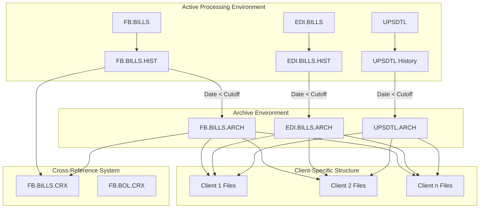
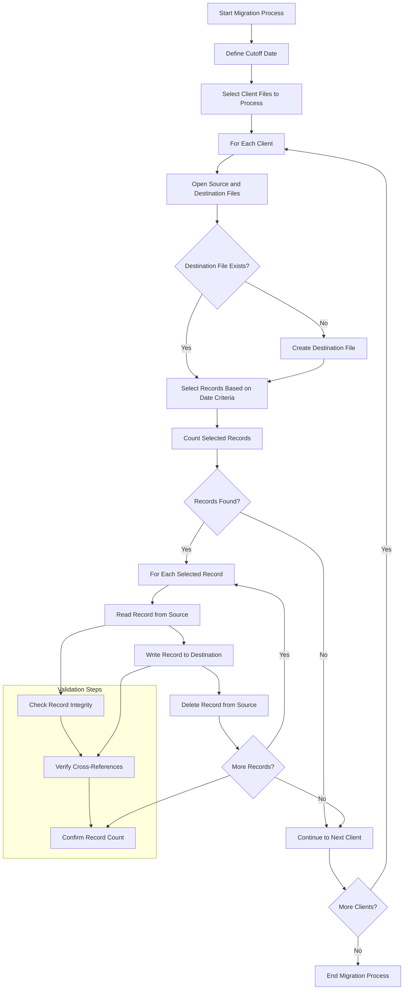
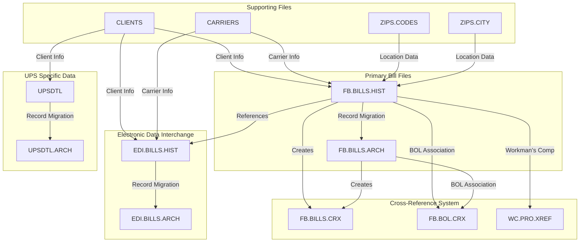

# Billing History Migration in AFS Shreveport

## Introduction to Billing History Migration

Billing history migration in AFS Shreveport is a critical data management process that involves the systematic transfer of freight billing records from active processing environments to historical archives based on predefined criteria. This process serves multiple purposes: it optimizes system performance by reducing the volume of data in active files, ensures compliance with data retention policies, preserves historical billing information for auditing and analysis, and maintains data integrity across the system. The migration process is particularly important for AFS Shreveport as a logistics management platform that handles large volumes of freight billing data across numerous clients, carriers, and shipping types. By implementing a structured approach to billing history migration, AFS Shreveport can maintain efficient operations while preserving the complete history of freight transactions for business intelligence, compliance, and customer service purposes.

## Archiving Strategy and Criteria

The AFS Shreveport system employs a sophisticated archiving strategy based primarily on date-driven criteria and processing status. Records are selected for archiving when they meet specific temporal thresholds—typically bills with processing dates older than a predetermined cutoff date (commonly 2-4 years old). The system enforces consistency by requiring archive operations to target complete annual periods, often specifying January 1st as the cutoff date for a given year. 

Beyond date criteria, the archiving process also considers the processing status of records. For instance, bills marked with rejection status ("R") are often excluded from archiving to ensure problematic records remain accessible in active systems. The strategy also incorporates special handling for different record types, with specific logic for standard freight bills (FB.BILLS.HIST), electronic data interchange bills (EDI.BILLS.HIST), and UPS detail records (UPSDTL).

The archiving approach is client-specific, allowing for customized retention policies based on individual client requirements while maintaining a consistent architectural framework. This granular control enables AFS to balance system performance optimization with client-specific data retention needs and regulatory compliance requirements.

## Billing History Migration Architecture



The architecture diagram illustrates the file structures and relationships in the AFS Shreveport billing history migration system. Records flow from active processing files (FB.BILLS, EDI.BILLS, UPSDTL) to their respective history files, and then to archive files based on date criteria. The system maintains a client-specific structure throughout, with separate file instances for each client ID. Cross-reference files (FB.BILLS.CRX, FB.BOL.CRX) maintain relationships between records across the active and archive environments, ensuring data integrity and traceability. This architecture supports efficient data access while allowing older records to be moved to archive storage, optimizing system performance while preserving historical data.

## File Structure and Organization

The AFS Shreveport system organizes billing records in a highly structured, client-centric file hierarchy. Each client is assigned a unique numeric identifier (typically a 5-digit code), which serves as the foundation for file organization. The system appends this client ID to standardized file names using a comma delimiter (e.g., `FB.BILLS.HIST,12345`), creating client-specific data silos while maintaining a consistent naming convention across the platform.

The primary file types in the billing history ecosystem include:

1. **FB.BILLS.HIST** - Contains the main freight bill history records with comprehensive shipment details
2. **FB.BILLS.ARCH** - Stores archived freight bill records that have aged beyond the active retention period
3. **EDI.BILLS.HIST** - Maintains electronic data interchange bill history
4. **EDI.BILLS.ARCH** - Archives older EDI bill records
5. **UPSDTL** - Stores UPS-specific shipment details
6. **UPSDTL.ARCH** - Archives older UPS shipment records

Within these files, records are identified by composite keys that typically include carrier ID, PRO number (tracking identifier), and version information, formatted as `CARRIER*PRO*VERSION`. This structure enables efficient retrieval of specific bills while maintaining the relationship between different versions of the same shipment.

The system also employs cross-reference files like FB.BILLS.CRX that maintain relationships between records across different file types, ensuring data integrity during the migration process. These cross-reference files contain subset of fields from the original records, optimized for quick lookups and relationship maintenance.

## Record Selection and Filtering

The AFS Shreveport system employs sophisticated record selection and filtering mechanisms to identify billing records suitable for migration. The primary selection criterion is date-based, with the system targeting records older than a specified cutoff date (typically defined as a constant like `COD = "01-01-19"`). This date filtering is applied to multiple date fields within the records, including processing date (`PROC.DT`), bill date, and other transaction timestamps.

Beyond simple date comparison, the system implements complex filtering logic combining multiple conditions. For instance, a typical selection statement might include:

```
SELECT FB.BILLS.HIST,CLIENT_ID WITH PROC.DT # "" AND WITH PROC.DT LT COD AND WITH 37 # "" AND WITH 39 # "R" AND WITH 37 LT COD
```

This statement selects records with non-empty processing dates that are earlier than the cutoff date, while also excluding records with rejection status ("R"). The system uses field position references (e.g., field 37 for date codes and field 39 for status codes) in addition to named fields.

For different file types, specialized filtering criteria are applied. UPS detail records might be selected based on `BILL.DATE` rather than processing date, while EDI bills might have additional electronic transaction criteria. The system also supports client-specific filtering, allowing different migration rules to be applied based on client requirements or data characteristics.

The filtering mechanisms are implemented through database query commands that create selection lists, which are then processed sequentially. This approach allows for efficient batch processing of large record sets while maintaining precise control over which records are migrated.

## Migration Process Flow



The migration process flow diagram illustrates the step-by-step procedure for selecting, transferring, and verifying records during the billing history migration. The process begins by defining a cutoff date and selecting client files to process. For each client, the system opens source and destination files, creating the destination file if it doesn't exist. Records are selected based on date criteria, and if records are found, they are processed individually - reading from the source, writing to the destination, and deleting from the source. The process includes validation steps to ensure data integrity throughout the migration. After processing all records for a client, the system moves to the next client until all clients are processed.

## Cross-Reference Management

Cross-reference management is a critical component of the AFS Shreveport billing history migration system, ensuring that relationships between records are preserved even as data moves between active and archive environments. The system employs dedicated cross-reference files, primarily FB.BILLS.CRX, which maintain essential linking information between freight bills and related records.

When records are migrated from active history files to archive files, the system updates or creates corresponding entries in the cross-reference files. These entries contain a subset of the original record fields, carefully selected to maintain relational integrity while minimizing storage requirements. Typical fields preserved in cross-reference records include:

1. Client ID (field 1)
2. Bill date (field 2)
3. Charges and amounts (fields 7, 8)
4. Payment information (fields 13, 14, 15)
5. Processing dates (field 37)
6. Status codes (field 39)
7. Reference numbers (field 30)

The cross-reference system employs consistent record identifiers across all environments, using the same composite key structure (typically `CARRIER*PRO*VERSION`) in both active and archive files. This ensures that records can be located regardless of their current storage location.

For specialized record types like Bills of Lading (BOL), additional cross-reference files such as FB.BOL.CRX maintain relationships between shipping documents and their associated freight bills. During migration, these cross-references are either updated to reflect the new location of migrated records or are themselves migrated to maintain system-wide data consistency.

The system includes utilities to rebuild cross-reference files when necessary, extracting relevant fields from primary records to ensure cross-reference integrity. This capability is particularly important after large-scale migrations or when addressing data inconsistencies.

## Data Validation and Integrity

The AFS Shreveport system implements comprehensive data validation and integrity measures throughout the billing history migration process to ensure accuracy and consistency of migrated data. These measures operate at multiple levels, from individual record validation to system-wide consistency checks.

At the record level, the system performs field-by-field validation before migration, ensuring that critical data elements such as dates, amounts, and identifiers conform to expected formats and value ranges. Special attention is given to composite keys and reference fields that maintain relationships between records across different files.

Before writing records to destination files, the system often creates backup copies of the original data in temporary files (such as GBBILLS and GBHIST), providing a recovery mechanism in case of migration issues. This approach allows for comparison between source and destination records to verify successful migration.

The system employs record locking mechanisms (using READU commands) during the read-modify-write cycle to prevent concurrent modifications that could compromise data integrity. This is particularly important in a multi-user environment where multiple processes might access the same records simultaneously.

For client-specific migrations, the system validates the existence of required files and folders before attempting to process records, reducing the risk of partial migrations or incomplete data transfers. When files don't exist, the system either creates them with appropriate parameters or logs the issue for administrator review.

Cross-reference integrity is maintained through dedicated validation processes that verify the existence of referenced records across file boundaries. When discrepancies are found, the system can either mark the affected records for review or automatically rebuild cross-references from primary data sources.

Post-migration validation includes record count verification to ensure that all selected records were successfully transferred, as well as sampling checks to confirm that migrated data maintains its original structure and content. These validation steps provide confidence in the integrity of the historical data even as it moves between active and archive environments.

## File Type Relationships



The diagram illustrates the complex relationships between different file types in the AFS Shreveport billing history migration process. The primary bill files (FB.BILLS.HIST and FB.BILLS.ARCH) form the core of the system, with records migrating from history to archive based on date criteria. These files interact with Electronic Data Interchange files (EDI.BILLS.HIST and EDI.BILLS.ARCH) and UPS-specific data files (UPSDTL and UPSDTL.ARCH). The cross-reference system maintains relationships between records across these file types, with FB.BILLS.CRX, FB.BOL.CRX, and WC.PRO.XREF providing different types of linkages. Supporting files like CLIENTS, CARRIERS, ZIPS.CODES, and ZIPS.CITY provide contextual information needed for proper record processing and migration. This interconnected structure ensures that all relevant data is preserved and properly linked throughout the migration process.

## Special Case Handling

The AFS Shreveport billing history migration system incorporates specialized handling for various edge cases and exceptional record types to ensure comprehensive data management. These special cases require custom logic beyond the standard migration process.

**Duplicate Records**: When migrating records, the system detects potential duplicates by examining key identifiers. For records with identical carrier and PRO numbers, the system employs a versioning mechanism using slash notation (e.g., "00041*123456/1") to maintain distinct records while preserving their relationship. This approach is particularly evident in import processes like LOAD.SUMITOMO.FP.DATA, which incrementally appends version numbers to handle duplicate shipments.

**Rejected Bills**: Records with rejection status (typically marked with "R" in field 39) receive special treatment during migration. These records are often excluded from standard archiving to ensure they remain accessible for resolution or analysis. The selection criteria explicitly filter out these records with conditions like `WITH 39 # "R"` to maintain them in active files.

**Client-Specific Processing**: The system accommodates client-specific requirements through conditional logic based on client identifiers. For example, the FIND.FCD.CLIENTS script contains specialized matching logic for financial cross-reference data that varies by client, while FIX.FB.CORE.CARRIER implements client-specific carrier flagging rules.

**UPS and Parcel Records**: UPS shipments, stored in UPSDTL files, require specialized handling due to their unique structure and identifier format. The UPS.PROC.DT subroutine demonstrates how the system extracts processing dates from UPS records by checking multiple record types (O, I, and T) using shipper numbers and file dates.

**BOL Associations**: Bills of Lading (BOL) records maintain special relationships with freight bills through the FB.BOL.CRX cross-reference file. During migration, these associations must be preserved or updated to reflect the new location of migrated records, as demonstrated in the BOL.TEMP2 and BOL.TEMP3 utilities.

**Record Restoration**: The system includes mechanisms to restore archived records when necessary, as shown in the UNARCH.FILES.BATCH script. This process selectively retrieves records from archive files based on date ranges or other criteria, copying them back to active history files while preserving their original identifiers.

**Cross-System Integration**: For records that interface with external systems (like accounting or ERP platforms), the migration process includes special handling to maintain integration points. The FIND.FCD.CLIENTS script exemplifies this by matching freight bill records with financial cross-reference data to ensure consistent client associations across systems.

## Performance Optimization

The AFS Shreveport system employs several strategies to optimize performance during the migration of large volumes of billing history data. These optimizations balance processing efficiency with system resource utilization to ensure reliable operation even when handling millions of records.

**Batch Processing**: Rather than attempting to migrate all records simultaneously, the system processes data in manageable batches, typically organized by client. This approach distributes the processing load and reduces memory requirements. Within each client batch, records are processed sequentially, with progress counters displayed at regular intervals (commonly every 1,000 records) to provide visibility into the migration progress.

**File Sizing Calculations**: When creating destination archive files, the system calculates appropriate file sizes based on the number of records being migrated. This dynamic sizing, evident in scripts like ARCH.FILES.BATCH, uses the PRIME command to determine optimal parameters and then applies these when creating new files with commands like:

```
EXECUTE "PRIME ":SEL.CNT CAPTURING STUFF RETURNING JUNK
NEW.SIZE = FIELD(STUFF,":",2)
NEW.SIZE = TRIM(FIELD(NEW.SIZE,".",1))+0
```

**Scheduled Execution**: Migration processes are often scheduled during off-peak hours to minimize impact on operational systems. Scripts like FIX.FB.CORE.CARRIER include SLEEP commands that delay execution until late night (e.g., 11:45 PM), ensuring that resource-intensive operations occur when system demand is lowest.

**Periodic Pausing**: For particularly large migrations, the system implements periodic pauses to prevent resource exhaustion. For example, DEL.SQL.FBHIST.PX includes logic to pause execution every 500 records:

```
IF MOD(BILL.CNT,500)=0 THEN
   CRT @(0,22):'Sleeping...zzz...zzz...'
   EXECUTE 'SLEEP 5'
END
```

**Efficient Selection Criteria**: The system uses optimized database queries to select only the records that need migration, reducing unnecessary processing. These queries combine multiple conditions to precisely target the appropriate records, as seen in the complex selection statements in ARCH.FILES.BATCH2.

**Dynamic File Handling**: The system opens and closes files as needed rather than keeping all files open simultaneously, reducing system resource consumption. This approach is particularly important when processing multiple client files sequentially.

**Progress Monitoring**: Visual progress indicators, including counters and progress bars, provide real-time feedback on migration status. This monitoring allows administrators to identify potential bottlenecks or issues early in the process.

**Record Locking**: The system employs record locking mechanisms (READU commands) to prevent concurrent modifications during migration, ensuring data integrity while optimizing for multi-user environments.

## Monitoring and Reporting

The AFS Shreveport system incorporates comprehensive monitoring and reporting capabilities to track the progress, status, and outcomes of billing history migration processes. These features provide administrators with visibility into migration operations and help identify and resolve issues that may arise during the process.

**Progress Tracking**: During migration, the system displays real-time progress information on the console, including counters that update at regular intervals (typically every 100, 1,000, or 10,000 records). This immediate feedback allows operators to monitor the pace of migration and estimate completion times. Many scripts implement dedicated progress bars using the PROG.BAR subroutine, providing visual representation of completion percentage.

**Record Counts**: The system maintains and displays various counters to track different aspects of the migration process, including:
- Total records processed
- Records successfully migrated
- Duplicate records encountered
- Records with special handling requirements
- Records with validation issues

These counts are typically displayed upon completion of the migration process, providing a summary of the operation's results.

**Error Logging**: When issues are encountered during migration, the system logs detailed information about the affected records and the nature of the problem. For critical errors, the ELINE subroutine is called to display prominent error messages that require operator attention.

**Email Notifications**: For significant issues or events, the system can generate email notifications to administrators. For example, the LOAD.SUMITOMO.FP.DATA script includes functionality to send email alerts when inactive carriers are detected in import data, allowing for prompt resolution of mapping issues.

**Program Tracking**: Many migration scripts incorporate calls to UPD.PROGRAM.LOG, which records execution information in system logs. This tracking creates an audit trail of migration activities, including start and end times, user information, and execution status.

**Validation Reporting**: Post-migration validation processes generate reports on data integrity, highlighting any discrepancies between source and destination records. These reports help ensure that the migration was completed successfully and that all data relationships are preserved.

**SQL Integration**: For systems with SQL database components, specialized reporting interfaces provide detailed information on migration status and outcomes. Scripts like DEL.SQL.FBHIST.PX include SQL integration to ensure consistency between MultiValue and SQL environments.

**File Statistics**: The system can generate detailed statistics on file sizes, record counts, and storage utilization before and after migration, helping administrators optimize system resources and plan for future migrations.

Through these monitoring and reporting capabilities, AFS Shreveport ensures that billing history migration processes are transparent, trackable, and manageable, even when dealing with large volumes of historical data across numerous client accounts.

[Generated by the Sage AI expert workbench: 2025-05-28 08:06:15  https://sage-tech.ai/workbench]: #