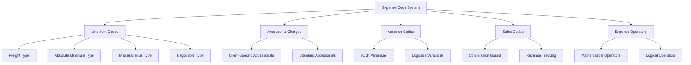
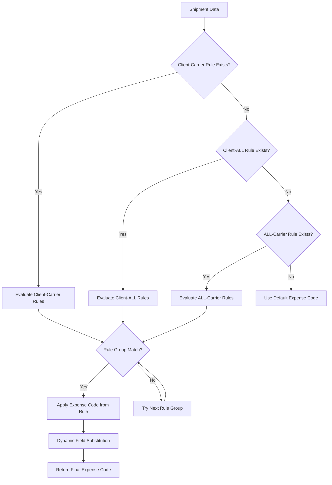
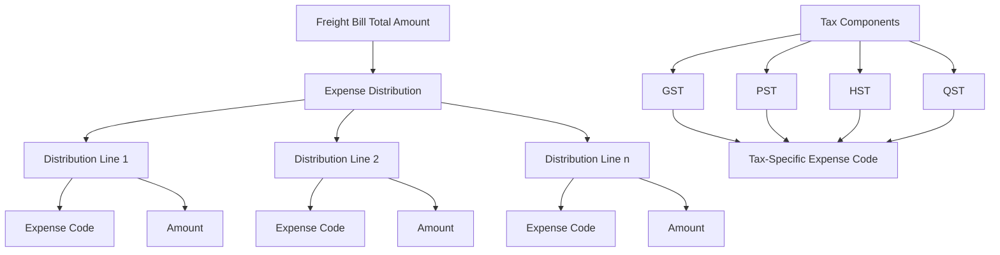
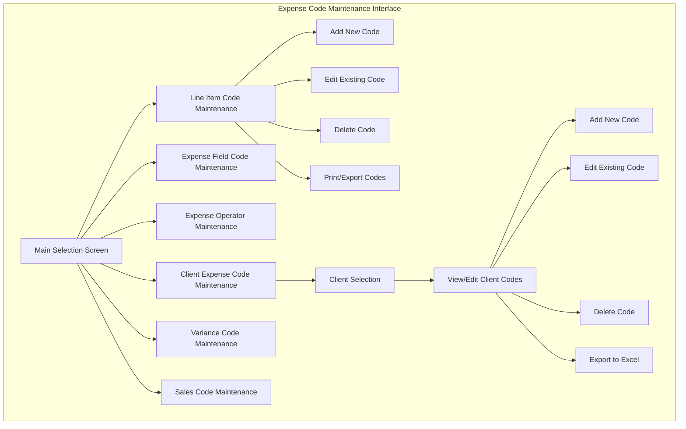
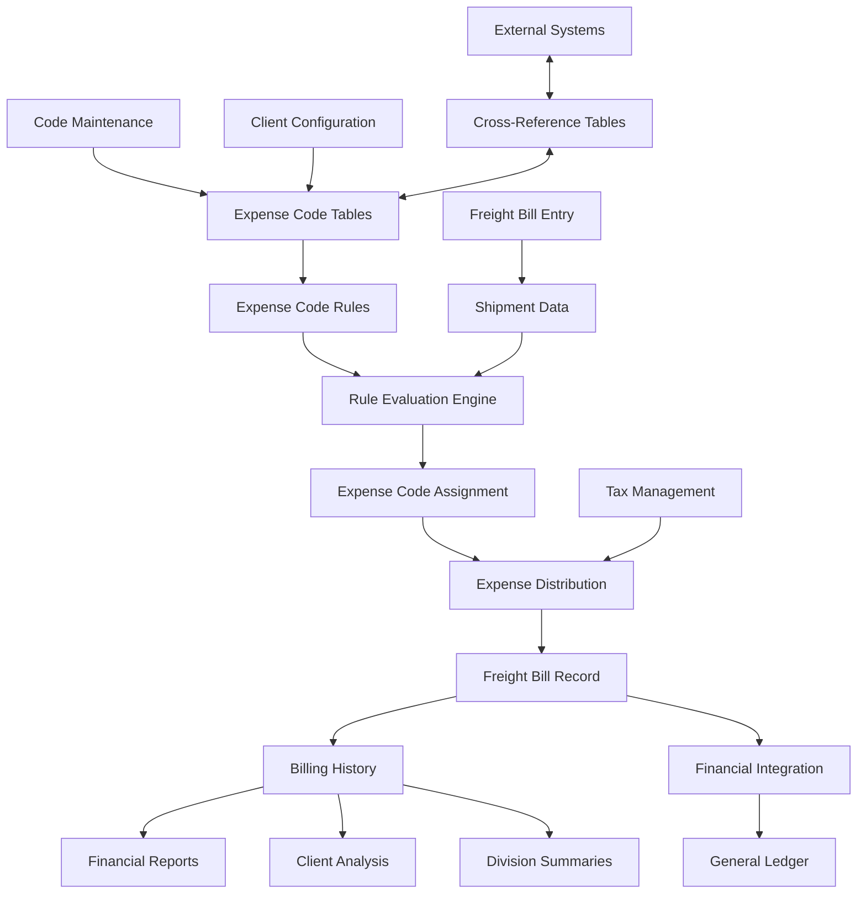

# Expense Code Management in AFS Shreveport

## Introduction to Expense Code Management

Expense code management in AFS Shreveport serves as a critical foundation for the freight billing system, providing a structured framework for categorizing, tracking, and allocating transportation costs. This system enables precise financial tracking and reporting by classifying charges into standardized categories that align with accounting requirements. Expense codes serve as the bridge between operational freight activities and financial systems, allowing organizations to properly allocate costs to appropriate general ledger accounts, departments, and cost centers. The expense code system supports both standard billing scenarios and specialized requirements, enabling clients to maintain consistent accounting practices while accommodating unique business rules.

The expense code management functionality in AFS Shreveport is designed with flexibility to handle diverse client needs, from simple expense categorization to complex multi-level allocation schemes with tax considerations. It supports various expense code types including line item codes for standard charges, accessorial charges for additional services, variance codes for discrepancies, and sales codes for revenue tracking. This comprehensive approach ensures that all financial aspects of freight operations can be properly categorized, tracked, and reported.

## Expense Code Structure and Types

The AFS Shreveport system implements a multi-layered expense code structure that accommodates different types of charges and financial allocations. The primary expense code types include:

1. **Line Item Codes**: These fundamental codes (like FRT for freight, SIT for storage-in-transit) represent standard charges in freight bills. Each code has attributes including a description, type designation (Freight, Absolute Minimum, Miscellaneous, or Negotiable), and SLC translation codes for cross-system compatibility.

2. **Accessorial Charges**: These codes represent additional services beyond basic transportation, such as residential delivery (RES), hazardous materials handling (HAZ), or inside delivery (ID). They're stored in specialized tables and can be client-specific.

3. **Variance Codes**: Used to track discrepancies between expected and actual charges, these codes help in auditing and reconciliation processes.

4. **Sales Codes**: These codes track revenue sources and commission calculations, supporting financial reporting and sales performance analysis.

5. **Expense Operators**: Special codes that define mathematical or logical operations to be performed on expense values, enabling complex calculations and allocations.

Each expense code type serves a specific purpose in the freight billing workflow, allowing for precise categorization and financial allocation of charges. The system maintains these codes in specialized database tables, with FB.TABLES serving as the primary repository for standard codes and client-specific tables for customized implementations.

## Client-Specific Expense Code Configuration

AFS Shreveport provides extensive customization capabilities for expense codes at the client level, allowing each client to maintain their own expense code structure tailored to their specific business requirements and accounting practices. This client-specific configuration is managed through dedicated data files like EXPENSE.CODES and EXPENSE.CODE.XREF that store client-specific expense code definitions.

The client configuration process includes:

1. **Custom Code Definition**: Clients can define their own expense codes with descriptions that align with their internal accounting systems. These codes can be completely unique or mapped to standard system codes.

2. **Year-to-Date Tracking**: The system maintains running totals for each expense code, categorized by transaction type (outbound, inbound, third-party), enabling trend analysis and historical reporting.

3. **Status Management**: Expense codes can be marked as active or inactive, allowing clients to phase out obsolete codes while maintaining historical data integrity.

4. **Cross-Reference Mapping**: For clients that need to translate between their internal expense codes and external systems, the EXPENSE.CODE.XREF file provides mapping capabilities that facilitate seamless integration.

5. **Client-Specific Rules**: Some clients have unique business rules that determine how expense codes are assigned based on shipment characteristics. These rules are configured in the FB.EXPENSE file with client-carrier combinations.

The system also accommodates special requirements for certain clients, such as extended expense code field lengths for clients like 05687, 05706, and 05812, which require 45-digit expense codes instead of the standard 35-digit format.

## Expense Code Rules and Logic

The AFS Shreveport system implements a sophisticated rule-based approach to expense code determination, allowing for dynamic assignment of expense codes based on various shipment attributes. This rule system is primarily managed through the FB.EXPENSE.SETUP program and executed by the NEW.GET.EXPENSE subroutine.

The rule structure follows a hierarchical organization:

1. **Rule Groups**: Collections of conditions that must all be satisfied (AND logic) for the rule to apply.
2. **Subgroups**: Alternative conditions within a group where any match (OR logic) will satisfy that part of the rule.
3. **Individual Rules**: Specific conditions that evaluate shipment attributes against configured values.

Each rule consists of several components:
- **Field**: The shipment attribute to evaluate (e.g., carrier, origin ZIP, destination state)
- **Operator**: The comparison method (equals, contains, starts with, etc.)
- **Value**: The target value for comparison
- **Expense Code**: The code to assign when the rule conditions are met

The system supports sophisticated pattern matching for text fields, including:
- Prefix matching with `[prefix]*`
- Suffix matching with `*[suffix]`
- Contains matching with `*[value]*`
- Exact matching without wildcards

The system also supports dynamic expense code generation with field substitution, where values from the shipment data can be inserted into the expense code using curly brace notation (e.g., `{DIVISION}-{CARRIER}`). This allows for highly customized expense codes that reflect specific shipment characteristics.

## Expense Distribution and Allocation

The AFS Shreveport system provides robust capabilities for distributing expenses across different categories and allocating them to appropriate general ledger accounts. This functionality is critical for accurate financial reporting and cost analysis.

The expense distribution process allows freight bills to be split across multiple expense codes, with each portion allocated to the appropriate accounting category. This is managed through the FB.2.1.DIST and FB.2.1.DIST.NEW subroutines, which provide a user interface for entering and editing expense distributions.

Key features of the expense distribution system include:

1. **Multiple Allocation Support**: A single freight bill can be distributed across multiple expense codes, with each allocation assigned a specific amount.

2. **Validation Controls**: The system ensures that the sum of all distributions equals the total charge amount, preventing accounting discrepancies.

3. **Default Distribution Logic**: For many clients, the system can automatically suggest appropriate expense distributions based on shipment characteristics, saving time and reducing errors.

4. **Client-Specific Distribution Rules**: Some clients have predefined distribution percentages or amounts that are automatically applied based on division, carrier, or other factors.

5. **Division-Based Allocation**: For multi-division organizations, expenses can be allocated to specific divisions based on configurable rules.

The DIST.EXPENSE subroutine handles specialized distribution scenarios, particularly for clients that require specific general ledger expense allocations with tax components. For example, client 01105/01898 implements a percentage-based allocation (39%, 22%, remainder) of freight charges.

The system also provides consolidation functionality that combines duplicate expense codes by summing their amounts, ensuring clean and concise expense reporting.

## Tax Management in Expense Codes

The AFS Shreveport system incorporates sophisticated tax handling capabilities within its expense code framework, particularly for Canadian taxes including GST (Goods and Services Tax), PST (Provincial Sales Tax), HST (Harmonized Sales Tax), and QST (Quebec Sales Tax). This functionality is essential for proper accounting and compliance with tax regulations.

The tax management system allows:

1. **Separate Tax Code Allocation**: Taxes can be allocated to specific expense codes distinct from the freight charges, enabling proper tax reporting and accounting.

2. **Tax-Inclusive Distribution**: For tax-inclusive billing scenarios, the system can distribute the total amount including taxes across appropriate expense categories.

3. **Client-Specific Tax Handling**: Different clients may have unique requirements for tax allocation based on their accounting practices and regulatory environment.

4. **Tax Code Customization**: The DIST.EXPENSE subroutine demonstrates how different tax components can be assigned to specific GL codes based on division and tax type.

For example, in client 01460's implementation, each division has specific expense codes for freight charges and different tax types:

- Division 07370:
  - Freight: 080.632017.00100.000.00000
  - GST: 080.110008.00000.000.00000
  - PST: 080.632017.00100.000.00000
  - QST: 080.207052.00000.000.00000

This granular approach ensures that taxes are properly accounted for in financial reporting and tax filings.

## Expense Code Maintenance Interface

The AFS Shreveport system provides a comprehensive set of maintenance interfaces for managing expense codes, allowing authorized users to create, modify, and delete various types of expense codes. These interfaces are designed to be intuitive while enforcing data integrity and validation rules.

Key features of the maintenance interfaces include:

1. **Pagination Controls**: For clients with large numbers of expense codes, the system provides navigation controls (Next, Back, Top, Last) to browse through pages of codes.

2. **Search Capabilities**: Users can search for clients by name using SOUNDEX matching when they don't know the exact client ID.

3. **Validation Rules**: The system enforces various validation rules, such as preventing duplicate codes, ensuring SIT codes are always type 'A', and validating format requirements.

4. **Access Control**: Maintenance functions are restricted to authorized users, with email notifications sent to administrators about unauthorized access attempts.

5. **Audit Logging**: Changes to expense codes are logged with before/after values, providing an audit trail of modifications.

6. **Export Capabilities**: Many maintenance programs offer the ability to export code data to Excel-compatible formats for reporting and analysis.

The interface design prioritizes efficiency for experienced users while providing clear help text and validation messages to prevent errors. The system also includes safeguards against deleting expense codes that have non-zero YTD amounts, protecting historical data integrity.

## Cross-Reference and Translation

The AFS Shreveport system implements a robust cross-reference and translation framework that enables expense codes to be mapped between different formats and systems. This capability is essential for integrating with external partners, clients' internal accounting systems, and other components of the freight management ecosystem.

Key aspects of the cross-reference and translation system include:

1. **Expense Code Cross-Reference Files**: The EXPENSE.CODE.XREF files store mappings between different code systems, allowing for seamless translation between client-specific codes and standard system codes.

2. **SLC Translation Codes**: The system maintains SLC (Standard Line Code) translation mappings that facilitate integration with external systems and standardized reporting.

3. **Import/Export Utilities**: Programs like FB.IMPORT.EXPENSE.CODE and EXPENSE.XREF.DF enable the import and export of expense code cross-references, facilitating data exchange with external systems.

4. **Translation Modes**: The GET.EXPENSE subroutine supports multiple operational modes including DEFAULT (initial code assignment), TRANSLATE (converting codes), FORMAT (validating format), and VERIFY (validation), providing flexible translation capabilities.

5. **Client-Specific Mappings**: For clients with unique expense code requirements, the system maintains specialized mappings that translate between their internal codes and the AFS Shreveport standard codes.

The translation process is particularly important for EDI (Electronic Data Interchange) operations, where expense codes may need to be converted between different formats to ensure proper communication with trading partners. The system's flexible mapping capabilities enable seamless integration while maintaining data integrity across different code systems.

## Reporting and Analysis

The AFS Shreveport system offers comprehensive reporting and analysis capabilities for expense codes, enabling clients to gain insights into their transportation costs, track spending patterns, and perform financial reconciliation. These reporting tools support both operational and strategic decision-making processes.

Key reporting and analysis features include:

1. **Division Expense Summaries**: Programs like FB.6.1 generate detailed reports of expense code charges by division, allowing organizations to understand cost distribution across their business units.

2. **Client Analysis Reports**: The system can produce client-specific expense analysis reports that highlight spending patterns, identify cost-saving opportunities, and support budget planning.

3. **Financial Reconciliation**: Expense code reports facilitate reconciliation between freight bills and financial systems, ensuring accounting accuracy.

4. **Excel Export Capabilities**: Many reporting tools include the ability to export data to Excel-compatible formats, enabling further analysis and integration with other business intelligence tools.

5. **Custom Report Generation**: The system supports the creation of custom reports based on specific expense code criteria, date ranges, and other parameters.

6. **Variance Analysis**: Reports can highlight variances between expected and actual expenses, supporting audit and cost control initiatives.

The reporting system leverages the structured expense code framework to provide meaningful aggregation and categorization of costs, enabling stakeholders to understand transportation expenses at various levels of detail—from high-level summaries to detailed transaction-level analysis.

## Expense Code Data Flow

The expense code data flows through multiple components of the AFS Shreveport system, from initial code setup through assignment to freight bills and ultimately to reporting and financial integration.

The data flow process includes several key stages:

1. **Code Definition**: Expense codes are created and maintained in the system's code tables, either as standard codes or client-specific implementations.

2. **Rule Configuration**: For automated expense code assignment, rules are configured based on client requirements and business logic.

3. **Code Assignment**: During freight bill processing, the appropriate expense codes are assigned based on shipment characteristics and configured rules.

4. **Expense Distribution**: Charges are distributed across expense codes according to business rules and user input.

5. **Data Storage**: The expense code assignments and distributions are stored with the freight bill records in the system's database.

6. **Reporting and Analysis**: The stored expense code data is used for various reports, analyses, and financial integrations.

7. **Cross-System Integration**: Through cross-reference mappings, expense code data can be exchanged with external systems while maintaining semantic consistency.

This comprehensive data flow ensures that expense code information remains consistent, accurate, and useful throughout the freight billing lifecycle, from initial transaction processing through financial reporting and analysis.

The AFS Shreveport expense code management system represents a sophisticated and flexible approach to categorizing, tracking, and analyzing transportation expenses. By providing a structured framework for expense classification while accommodating client-specific requirements, the system enables precise financial control and reporting for freight operations of all sizes and complexities.

[Generated by the Sage AI expert workbench: 2025-05-28 08:06:16  https://sage-tech.ai/workbench]: #