# Automated Data Migration in AFS Shreveport

## Introduction to Automated Data Migration

Automated data migration in AFS Shreveport serves as a critical infrastructure component that enables the seamless transfer, transformation, and maintenance of data integrity across the system's various components. The platform employs sophisticated migration utilities that handle everything from simple record transfers to complex data transformations with cross-reference building. These migration processes are essential for system evolution, allowing legacy data structures to be updated to newer formats while preserving business relationships and maintaining operational continuity. The migration framework supports both scheduled batch operations and on-demand migrations, with built-in validation mechanisms to ensure data consistency. By automating these processes, AFS Shreveport minimizes manual intervention, reduces the risk of human error, and enables efficient scaling of data operations across its freight billing and logistics management functions.

## Record Transfer and ID Transformation

The AFS Shreveport system employs sophisticated techniques for handling record transfer between files with ID transformation. This process is fundamental to maintaining data relationships while evolving the system's architecture. When migrating records, the system often needs to standardize or modify record identifiers to conform to new naming conventions or to establish proper relationships between different data stores. 

A key technique employed is prefix addition, where specific prefixes are systematically added to record IDs to indicate their type or origin. For example, in the CONVERT.AUDIT.NFSC script, fuel surcharge records receive either a "B*" or "C*" prefix depending on their original structure. This prefixing strategy creates a logical organization within the destination file while preserving the original identification information.

Format standardization is another critical aspect of ID transformation. The system parses complex IDs into their component parts, standardizes each component according to predefined rules (such as uppercase conversion or padding with leading zeros), and then reassembles them into a consistent format. This ensures that all record IDs follow a uniform pattern, facilitating easier lookups and maintaining referential integrity across the system.

The transformation logic also handles special cases, such as when IDs contain delimiters like asterisks or underscores, ensuring that the resulting IDs maintain their semantic meaning while conforming to the target system's requirements. These ID transformation capabilities are essential for maintaining data relationships during system evolution and integration with external systems.

## Data Migration Workflow

The data migration workflow in AFS Shreveport follows a comprehensive process that ensures data integrity and proper transformation. The process begins with source selection, where the system identifies which records need to be migrated, often using SELECT statements with specific criteria. Records are then extracted from the source system and prepared for transformation.

A critical decision point determines whether ID transformation is required. If so, the system applies standardization rules, adds prefixes, or otherwise modifies the IDs to match the destination system's requirements. Following ID transformation, data validation ensures that the records meet the necessary quality standards before proceeding.

The workflow then evaluates whether data enrichment is needed. In many cases, the migration process enhances records by looking up additional information from reference tables, such as adding city and state information based on ZIP codes. Format conversion follows, where data is restructured to match the destination system's schema.

Cross-reference building is a vital step that creates relationships between migrated records and other system components. The system tracks progress throughout the migration, providing visibility into completion percentage and estimated time remaining. Finally, records are written to their destination, and the process repeats until all records are processed.

After all records are migrated, a verification step confirms that the data was transferred correctly, checking record counts and sampling data for accuracy. This comprehensive workflow ensures that data migrations in AFS Shreveport maintain data integrity while efficiently transforming and transferring information across system components.

## Client-Specific Data Partitioning

AFS Shreveport implements a sophisticated client-specific data partitioning strategy that segregates data into dedicated subfiles based on client identifiers. This approach is fundamental to the system's architecture, enabling efficient data management while maintaining strict client data isolation. When migrating data, the system dynamically creates client-specific files as needed, ensuring that each client's information resides in its own dedicated storage space.

The partitioning process begins by extracting the client identifier from record IDs or metadata. For each unique client encountered during migration, the system checks whether a corresponding client-specific file exists. If not, it automatically creates the file with appropriate sizing parameters calculated based on expected record volumes. These parameters are carefully tuned to optimize storage efficiency and access performance, with modulo values often derived from record counts (e.g., `MOD=INT(TOT.ITEMS/5)`) to ensure balanced distribution.

The system employs naming conventions that incorporate client identifiers into file names (e.g., `FB.BILLS.HIST,01700`), making it easy to identify and manage client-specific data stores. This partitioning strategy offers several advantages: it improves query performance by reducing the dataset size for each operation, enhances security by physically separating client data, and enables client-specific customizations without affecting other clients.

During migration processes, the system maintains awareness of these partitions, directing records to appropriate client subfiles and ensuring that cross-references maintain proper relationships across the partitioned data structure. This client-centric approach to data organization is a cornerstone of the AFS Shreveport system's ability to efficiently manage multi-tenant operations while providing customized services to each client.

## Format Migration and Cross-Reference Building

Format migration in AFS Shreveport involves the complex process of converting data between different structural formats while preserving semantic meaning. The system handles various format transformations, such as converting from fixed-length to delimited formats, restructuring hierarchical data, and normalizing denormalized structures. These migrations often involve field mapping, where source fields are mapped to their corresponding destination fields, sometimes with transformations applied during the process.

A critical aspect of format migration is the handling of data type conversions. The system employs conversion codes (such as 'MCU' for uppercase conversion or 'MCT' for title case) to ensure data consistency during migration. Special attention is given to date formats, numeric representations, and text encoding to maintain data integrity across different system components.

Cross-reference building is an essential companion process to format migration. As data structures evolve, the system must maintain relationships between related records across different files. The cross-reference building process creates explicit linkage records that map identifiers between old and new systems, enabling seamless navigation across the data landscape.

These cross-reference records typically contain minimal information needed to establish relationships, such as client identifiers, record keys, and essential metadata. For example, when migrating freight billing records, the system creates entries in FB.BILLS.CRX that link client IDs with carrier information and financial data, enabling efficient lookups without duplicating all record content.

The cross-reference building process is particularly important during incremental migrations, where only portions of the system are updated at a time. By maintaining these cross-references, the system ensures that both legacy and modern components can interoperate effectively during transition periods, providing a consistent view of the data regardless of which subsystem is accessing it.

## ID Transformation Process

The ID transformation process in AFS Shreveport is a sophisticated workflow that converts record identifiers from one format to another during data migration. This process begins with parsing the original record ID to understand its structure. The system analyzes whether the ID contains delimiters such as asterisks, underscores, or periods, which often separate logical components of the identifier.

For IDs with delimiters, the system splits the identifier into its constituent components using functions like `FIELD()`. Each component is then processed individually according to business rules. For IDs without delimiters, the entire ID is treated as a single component for processing.

The system then evaluates whether standardization is required for each component. This might involve converting text to uppercase using `OCONV(ID2,'MCU')`, padding numeric values to a specific length, or replacing special characters. If standardization is needed, the system applies the appropriate format rules to ensure consistency.

Prefix addition is a common transformation technique, where the system prepends specific characters to indicate record type or origin. For example, in the CONVERT.AUDIT.NFSC script, records receive either a "B*" or "C*" prefix based on their characteristics. This prefixing strategy helps maintain logical organization within the destination file.

Finally, the components are reassembled into the new record ID format, often using concatenation with appropriate delimiters. The resulting ID conforms to the destination system's requirements while maintaining the semantic meaning of the original identifier.

This transformation process ensures that record identifiers are consistent and properly formatted across the system, facilitating accurate cross-referencing and efficient data retrieval operations.

## File Restructuring and Batch Processing

File restructuring in AFS Shreveport involves reorganizing data storage to improve efficiency, accommodate new requirements, or adapt to system evolution. This process often entails moving from monolithic files to client-partitioned structures, converting between different storage formats, or redistributing data based on access patterns. The system employs sophisticated techniques to handle these restructuring operations, including dynamic file creation with optimized sizing parameters, selective record migration, and maintenance of cross-references to preserve data relationships.

A key aspect of file restructuring is the calculation of appropriate file parameters. The system analyzes record counts and sizes to determine optimal modulo values, ensuring efficient storage utilization and access performance. For example, the CREATE.EDI.DATA.FILES program creates client-specific files with carefully calculated dimensions based on expected record volumes.

Batch processing is the backbone of large-scale data operations in AFS Shreveport. The system processes records in controlled batches to manage memory usage and provide predictable performance characteristics. Batch operations typically follow a select-process-write pattern, where records are first identified using selection criteria, then processed individually or in groups, and finally written to their destination.

Progress tracking is an essential component of batch processing, providing visibility into operation completion status and estimated remaining time. The system implements counters that increment as records are processed, with periodic status updates displayed to users. For example, many migration scripts display progress every 100 or 300,000 records, helping operators monitor long-running operations.

Error handling in batch processes is designed to be resilient, with the ability to log issues without terminating the entire operation. This allows the system to complete as much work as possible even when encountering problematic records, with detailed logging to facilitate later investigation and remediation of issues.

The combination of thoughtful file restructuring and robust batch processing capabilities enables AFS Shreveport to efficiently manage large volumes of data while maintaining system performance and data integrity during migration operations.

## Data Transformation and Enrichment

Data transformation and enrichment are core capabilities of the AFS Shreveport migration framework, enabling the system to not only move data but also improve its quality and completeness during the migration process. Transformation operations modify data structure or format to meet destination system requirements, while enrichment operations add value by incorporating additional information from reference sources.

The system employs various transformation techniques, including case normalization (using conversion codes like 'MCU' for uppercase and 'MCT' for title case), field concatenation or splitting, and format standardization. These transformations ensure that data conforms to expected patterns and validation rules in the destination system. For example, when migrating vendor and customer records, the system can standardize address formats and normalize company names to maintain consistency.

Data enrichment processes add valuable context by incorporating information from lookup tables and reference data. A common enrichment pattern involves using ZIP codes to add city and state information to address records. The system queries reference tables like ZIPS.CITY and ZIPS.CODES to retrieve the corresponding location data, making the migrated records more complete and useful. This enrichment is evident in scripts like FB.4.2 and FB.4.6, which enhance freight billing records with detailed location information during migration.

Field mapping is another crucial aspect of transformation, where source fields are mapped to their corresponding destination fields, sometimes with complex logic to handle differences in data models. The system supports both direct mappings and conditional transformations based on record characteristics or client-specific requirements.

Special handling for edge cases is built into the transformation logic. For example, the FIX.VEND.CUST.ATTR.42 script includes specific handling for Mexican addresses with 5-digit ZIP codes, recognizing that these could be confused with U.S. ZIP codes due to their similar format.

Through these transformation and enrichment capabilities, AFS Shreveport ensures that migrated data not only moves to its new location but arrives in an improved state, with standardized formats, additional context, and enhanced relationships that increase its business value.

## Client-Specific File Structure

The AFS Shreveport system employs a sophisticated client-specific file structure that organizes data into dedicated partitions for each client. This architecture provides clear data separation while maintaining consistent file types across clients. After migration, data is organized into a hierarchical structure where master system files branch into client-specific subfiles, each containing specialized data types.

Each client's data is stored in a set of files with standardized naming conventions that incorporate the client identifier. For example, billing history for client 01700 is stored in FB.BILLS.HIST,01700, while EDI records for the same client reside in EDI.BILLS.HIST,01700. This naming pattern extends across all client-specific data types, creating a predictable and manageable file organization.

The file structure includes several key file types that are replicated for each client:
- Billing history files (FB.BILLS.HIST,{client}) store detailed freight billing records
- EDI records (EDI.BILLS.HIST,{client}) contain electronic data interchange information
- Vendor/customer data (VEND.CUST,{client}) manages relationship information
- Cross-reference files (VEND.CUST.NAMES,{client}, VEND.CUST.XREF,{client}) maintain relationships between records

Cross-references between related records are maintained both within and across these files. For example, billing records may reference vendor information, while vendor records link to name standardization entries. These cross-references are crucial for maintaining data relationships despite the partitioned structure.

The client-specific file structure offers several advantages: it improves query performance by limiting searches to relevant client data, enhances security through physical data separation, and allows for client-specific customizations without affecting other clients. The system dynamically creates these client-specific files during migration processes when new clients are encountered, ensuring that the structure scales automatically as the client base grows.

This architecture represents a sophisticated approach to multi-tenant data management, balancing the benefits of standardized processing with the need for client-specific data isolation.

## Progress Tracking and Reporting

AFS Shreveport implements comprehensive progress tracking and reporting mechanisms to provide visibility into migration operations, which can often be lengthy processes involving large volumes of data. These mechanisms help operators monitor execution, estimate completion times, and identify potential issues early in the process.

The system employs multiple techniques for tracking progress. Record counters are a fundamental component, incrementing as each record is processed and providing a basic measure of work completed. These counters are often displayed at regular intervals (typically every 100 or 300,000 records) to provide ongoing feedback without overwhelming the display with constant updates.

Progress bars offer a more visual representation of completion status. The system calculates completion percentages based on the ratio of processed records to total records and displays this information graphically. For example, the FB.4.2 script uses the PROG.BAR subroutine to show a visual indicator of migration progress at line 22.

Time-based reporting adds another dimension to progress tracking. Many migration scripts capture start and end times, allowing for calculation of elapsed time and estimation of completion time for long-running operations. This information helps operators plan around migration activities and allocate resources appropriately.

Milestone reporting marks significant points in the migration process, such as the completion of specific phases or the processing of key record types. These milestones provide context beyond simple record counts, helping operators understand the qualitative progress of the migration.

Completion reporting provides a summary of the migration operation, including total records processed, any errors encountered, and verification statistics. This information serves as both documentation of the migration and a starting point for any necessary troubleshooting.

Through these varied tracking and reporting mechanisms, AFS Shreveport ensures that migration operations remain transparent and manageable, even when dealing with complex transformations and large data volumes.

## Migration Validation and Verification

Migration validation and verification in AFS Shreveport encompass a comprehensive set of techniques to ensure data integrity throughout the migration process. These approaches are critical for maintaining trust in the system and preventing data-related issues that could impact business operations.

Consistency checks form the foundation of validation efforts. The system verifies that migrated data adheres to expected patterns and business rules, checking for required fields, valid formats, and logical relationships between data elements. These checks can be performed during migration (inline validation) or as a separate post-migration step (batch validation).

Record counts serve as a basic but essential verification mechanism. The system compares the number of records in source and destination files to ensure that no records were missed during migration. This simple check can quickly identify gross errors in the migration process, such as incomplete transfers or duplicate records.

Data sampling provides a deeper level of verification by examining a representative subset of migrated records. The system compares key fields between source and destination records to confirm that data was transformed correctly. This approach balances thoroughness with efficiency, making it practical even for large datasets.

Cross-reference validation ensures that relationships between records are maintained after migration. The system verifies that cross-reference records correctly link related data across different files, preserving the semantic connections that are essential for business operations.

Error handling during validation is designed to be informative and actionable. When validation issues are detected, the system logs detailed information about the problematic records and the nature of the validation failure. This information helps operators diagnose and resolve issues efficiently.

Reconciliation reports summarize the validation results, highlighting any discrepancies that require attention. These reports typically include counts of successful migrations, validation failures, and records requiring manual review.

Through these validation and verification approaches, AFS Shreveport ensures that migrated data maintains its integrity and business value, providing a solid foundation for ongoing operations after migration is complete.

## Data Enrichment Process

```mermaid
flowchart TD
    A[Source Record] --> B[Field Extraction]
    B --> C{Enrichment Required?}
    C -->|Yes| D[Identify Lookup Keys]
    C -->|No| J[Continue Processing]
    D --> E[Query Reference Data]
    E --> F{Reference Found?}
    F -->|Yes| G[Apply Enrichment]
    F -->|No| H[Apply Default/Fallback]
    G --> I[Field Mapping]
    H --> I
    I --> J
    J --> K[Enriched Record]
    
    subgraph "Reference Sources"
    L1[ZIP Code Tables]
    L2[City/State Data]
    L3[Carrier Information]
    L4[Client Metadata]
    end
    
    E --- L1
    E --- L2
    E --- L3
    E --- L4
```

The data enrichment process in AFS Shreveport transforms basic records into more comprehensive and valuable data assets by incorporating additional information from reference sources. This process begins with field extraction, where the system identifies key fields from source records that will serve as lookup keys for enrichment.

The system then evaluates whether enrichment is required for the record. This decision may be based on record type, data completeness, or specific client requirements. If enrichment is needed, the system identifies appropriate lookup keys from the extracted fields. These keys might include ZIP codes, carrier identifiers, location codes, or other standardized identifiers.

Using these keys, the system queries reference data sources to retrieve enrichment information. AFS Shreveport maintains numerous reference tables that serve as enrichment sources, including:
- ZIP code tables (ZIPS.CODES) that map ZIP codes to geographic regions
- City/state data (ZIPS.CITY) that provides standardized location names
- Carrier information that contains details about transportation providers
- Client metadata that includes client-specific reference information

When reference data is found, the system applies the enrichment by incorporating the additional information into the record. For example, when processing a freight bill with only a ZIP code, the system might enrich it with city and state information from the ZIPS.CITY file. This enrichment is evident in scripts like FB.4.2 and FB.4.6, which enhance location data during migration.

If reference data cannot be found, the system applies default values or fallback logic to ensure the record remains usable even without the enrichment. This might involve using partial information or flagging the record for manual review.

Field mapping then determines where the enriched data should be placed in the destination record structure. This mapping considers the destination schema and ensures that enriched fields are properly positioned and formatted.

Through this sophisticated enrichment process, AFS Shreveport transforms basic transactional records into rich, contextual data assets that provide greater business value and support more advanced analytics and processing capabilities.

[Generated by the Sage AI expert workbench: 2025-05-28 08:06:29  https://sage-tech.ai/workbench]: #