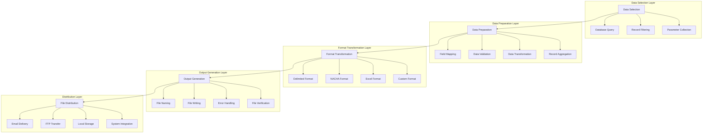
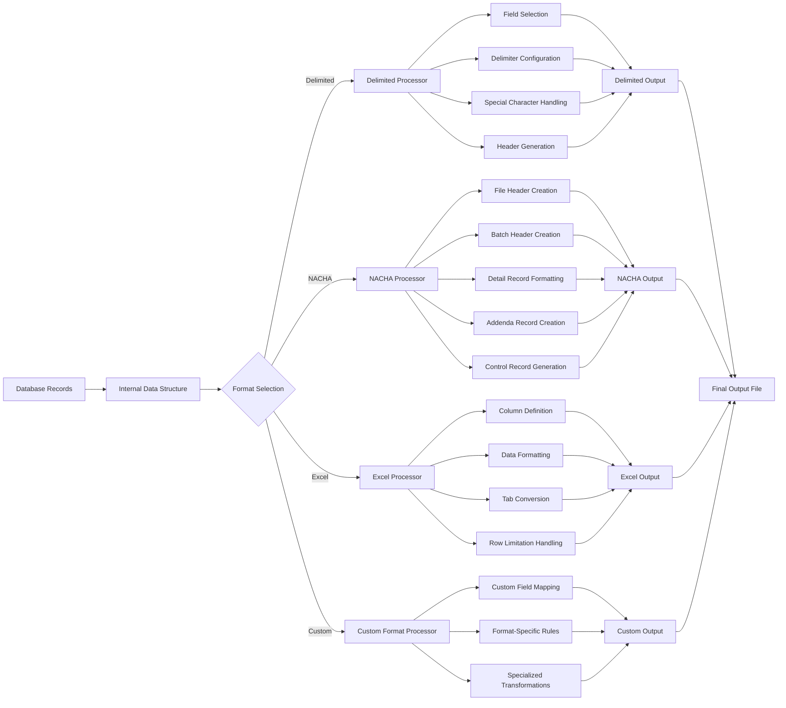
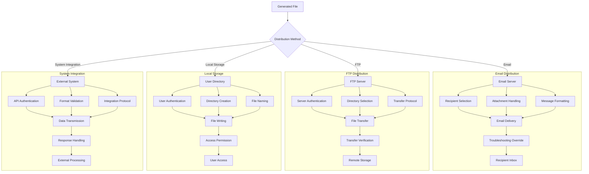

# Automated File Creation in AFS Shreveport

## Introduction to Automated File Creation

The AFS Shreveport system implements a comprehensive approach to automated file creation that supports its core freight billing operations, data management needs, and integration requirements. The system employs a multi-layered architecture for file generation that spans from low-level file system operations to high-level business logic implementations. File creation capabilities are embedded throughout the system to support various functions including client data exports, carrier information management, financial transactions, cross-reference maintenance, and integration with external systems like Sage ERP and banking platforms.

The automated file creation functionality is implemented across multiple architectural layers, with different components responsible for data preparation, format transformation, and output management. The system supports various file formats including delimited files (CSV, tab-delimited), specialized formats like NACHA for ACH transactions, Excel-compatible outputs, and structured data exports for third-party integration. These capabilities enable AFS Shreveport to efficiently manage the large volumes of data required for freight billing operations while maintaining compatibility with both internal systems and external partners.

## File Generation Architecture

The AFS Shreveport system employs a layered architecture for file creation that separates concerns between data selection, preparation, formatting, and output management. This architectural approach allows for flexibility in handling different file types while maintaining consistency in how files are generated across the system.

At the foundation level, the system uses a combination of PICK BASIC file operations and system-level commands (via EXECUTE statements) to handle the physical creation and manipulation of files. The middle layer consists of specialized utilities and subroutines that implement business rules for data transformation and formatting. The top layer includes application-specific modules that orchestrate the file creation process for particular business functions.

The architecture follows a modular design pattern where common file creation operations are encapsulated in reusable subroutines. For example, the system includes utilities for creating cross-reference files, generating export files, and building specialized formats like NACHA for ACH transactions. This modular approach allows for consistent implementation of file creation logic while accommodating the specific requirements of different business processes.

Error handling is integrated throughout the architecture, with retry mechanisms for file operations, validation of input data, and logging of file creation activities. The system also implements security controls that restrict file creation operations to authorized users, ensuring that sensitive data exports and financial file generation are properly controlled.

## Automated File Creation Process Flow

The automated file creation process in AFS Shreveport follows a structured workflow that begins with data selection and ends with file distribution. The process starts with selecting the appropriate data sources based on business requirements, which may include client records, carrier information, freight bills, or financial transactions. This selection is typically performed using database queries with filtering criteria to narrow down the relevant records.

Once the data is selected, it undergoes preparation where fields are mapped to the target format, validated for completeness and accuracy, and transformed as needed. This may involve currency formatting, date conversions, or aggregating multiple records. The system then applies format-specific transformations to convert the internal data representation into the required output format, whether that's a delimited file, NACHA ACH format, or Excel-compatible structure.

The output generation phase handles the actual file creation, including naming conventions (often incorporating timestamps or sequential numbering), writing the formatted data, implementing error handling with retry logic, and verifying the created file. Finally, the distribution phase manages how the generated file reaches its destination, whether through email delivery, FTP transfer, local storage, or direct integration with another system.

This modular approach allows AFS Shreveport to maintain consistency in file creation while accommodating the diverse requirements of different business processes and external integrations.

## Data Preparation Techniques

The AFS Shreveport system employs sophisticated data preparation techniques to ensure that the information included in generated files is accurate, complete, and properly formatted. The data preparation process begins with record selection, which is typically implemented using PICK BASIC's SELECT and SSELECT commands or through EXECUTE statements that run dynamic queries. These selection mechanisms allow the system to filter records based on complex criteria such as date ranges, client IDs, carrier codes, and transaction types.

Once records are selected, the system applies filtering logic to exclude irrelevant data. For example, in financial exports, the system may filter out offsetting transactions to prevent duplicate entries, or in carrier exports, it might exclude internal email domains. This filtering ensures that only appropriate data is included in the output files.

Data transformation is a critical aspect of the preparation process. The system converts internal data formats to standardized representations suitable for external consumption. This includes formatting dates (e.g., converting from internal date format to MM/DD/YYYY), standardizing phone numbers, handling special characters in text fields, and applying business rules for financial calculations. For instance, the FB.DOWNLOAD.ACH program implements specific transformations required by the NACHA format, including field truncation and padding.

The system also handles data enrichment, where additional information is added to records from related sources. This is evident in programs like CREATE.SAGE.CARRIER.EXPORT, which combines carrier details from multiple attributes to create comprehensive export records. Similarly, BUILD.DF.FM enriches freight bill data with related information such as client names, carrier details, and expense codes.

For complex file generation scenarios, the system implements specialized data preparation techniques such as calculating distribution weights from BOL files, determining freight accruals based on shipping parameters, and applying client-specific business rules to data transformation.

## Format Handling and Standardization

The AFS Shreveport system demonstrates sophisticated capabilities in handling and standardizing various output formats to meet both internal requirements and external integration needs. The system supports multiple standardized formats including delimited files (CSV, tab-delimited), fixed-width formats, NACHA for ACH transactions, and Excel-compatible outputs.

For delimited file formats, the system implements consistent approaches to field separation and handling of special characters. Programs like CLIENTS.DF.ADDTL and CLIENTS.DF.T use tab characters (CHAR(9)) as field separators for Excel compatibility, while others use pipe characters (|) to avoid issues with commas in text fields. The system also implements conditional quoting of fields containing delimiters, as seen in the APPEND.LINE subroutine in CLIENTS.QV, which adds quotes around fields containing commas to maintain CSV integrity.

The system handles specialized formats like NACHA with precision. The FB.DOWNLOAD.ACH program creates meticulously formatted NACHA files for ACH transactions, adhering to banking industry standards with exact field positioning, mandatory header and trailer records, and proper batch control records. This includes handling different record types (file header, batch header, detail records, addenda records) with appropriate type codes and ensuring all required fields are properly formatted.

Excel-compatible outputs are generated through tab-delimited files with .XLS extensions, as seen in CREATE.FB.DARLING.FRT.RPT and FB.5.4.XLS. The system handles Excel's row limitations by splitting large outputs into multiple files when exceeding 65,000 lines, as implemented in BUILD.DF.FM and BUILD.DF.VOUCHER.DIETRICH.

For integration with Sage ERP, the system creates standardized export files with specific formatting requirements, including pipe-delimited fields and proper handling of financial codes. CREATE.SAGE.FP.EXPORT.T demonstrates how the system applies client-specific sales code adjustments and formats transaction details according to Sage requirements.

The system also implements format conversion capabilities, transforming data between different representations as needed. This includes converting MultiValue attribute marks to tab characters or line feeds for PC compatibility, handling date format conversions, and normalizing text fields by removing special characters or applying case transformations.

## File Format Transformation Pipeline

The AFS Shreveport system employs a sophisticated pipeline for transforming internal database formats into standardized output formats. This pipeline consists of several stages that progressively convert data from its native MultiValue database representation to the required external format.

The transformation begins with retrieving records from the database using SELECT or SSELECT commands, which are then loaded into memory as internal data structures. These structures maintain the hierarchical nature of MultiValue data with attributes, values, and subvalues. The system then determines which format processor to use based on the output requirements.

For delimited formats, the pipeline selects relevant fields, configures the appropriate delimiter (tabs, commas, or pipes), handles special characters that could interfere with parsing (such as embedded delimiters), and optionally generates header rows. The CLIENTS.QV program demonstrates this process by building column headers and quoting fields with commas.

The NACHA format transformation is particularly complex, as seen in FB.DOWNLOAD.ACH. It creates multiple record types in sequence: file headers with routing information, batch headers with company data, detail records with payment information, addenda records for supplementary data, and control records with batch totals. Each record type follows strict formatting rules with precise field positioning.

For Excel outputs, the pipeline defines columns, formats data appropriately (including date and numeric formatting), converts MultiValue marks to tabs, and implements row limitation handling for large datasets. Programs like BUILD.DF.FM split outputs into multiple files when exceeding Excel's row limits.

Custom format processors handle specialized requirements, such as the voucher formats in BUILD.DF.VOUCHER.DIETRICH.CANADA, which creates precisely formatted records with specific field positions for EDI integration.

Throughout the pipeline, the system applies data transformations like date conversions, numeric formatting, and text normalization to ensure the output meets the requirements of the target format. The final stage writes the transformed data to the output file, often with appropriate naming conventions that include timestamps or sequential numbering to prevent overwrites.

## Cross-Reference File Management

The AFS Shreveport system implements a comprehensive approach to cross-reference file management, which is essential for maintaining relationships between different data entities and enabling efficient lookups. Cross-reference files serve as indexes that map one identifier to another, allowing the system to quickly locate related records without performing expensive searches across the entire database.

Several programs in the system are dedicated to creating and maintaining cross-reference files. For example, REBUILD.BOL.REFNO.XREF.SUB rebuilds the Bill of Lading reference number cross-reference file, which maps reference numbers to BOL IDs. This allows the system to quickly locate BOLs based on reference numbers provided by clients or carriers. The program normalizes reference numbers using the GET.ROOT.NUMBER utility to ensure consistent cross-referencing and supports rebuilding up to three different reference number types.

Similarly, REBUILD.SCAC.XREF creates cross-references between carrier IDs and their Standard Carrier Alpha Codes (SCAC), enabling the system to identify carriers based on industry-standard codes. CREATE.UPS.XREF builds a cross-reference file that organizes UPS shipping data by client number, facilitating client-specific queries on UPS shipments.

The system also implements more complex cross-reference structures. VEND.CUST.XREF.REBUILD creates cross-references that combine vendor descriptions with ZIP codes, allowing the system to identify vendors based on both name and location. VEND.CUST.ZIPS.REBUILD organizes vendor customer records by ZIP code, creating entries where each ZIP code record contains a list of associated vendor customer IDs.

Cross-reference files are typically created dynamically when they don't exist, with specific file sizing parameters to optimize performance. The system includes mechanisms to clear existing cross-references before rebuilding, ensuring that the data remains consistent and up-to-date. For example, FB.REBUILD.OPEN.DATE.XREF first clears existing cross-reference files using CLEAR-FILE commands before rebuilding them with current data.

The system also handles composite keys in cross-reference files, often using asterisks or underscores as delimiters to combine multiple identifiers into a single key. This approach is evident in UPD.FB.STATUS.UPDATE, which creates composite keys by concatenating client IDs and bill IDs with underscore separators.

## Automated Distribution Mechanisms

The AFS Shreveport system implements sophisticated automated distribution mechanisms to deliver generated files to their intended destinations. These mechanisms include email delivery, FTP transfers, and local storage options, each with appropriate routing and security controls.

Email distribution is a primary method for delivering generated files to clients and internal users. Programs like BUILD.DF.FM and FB.SMNAACRP include email functionality that automatically sends generated files to configured recipients. The system supports both standard and HTML-formatted emails, with options for including file attachments. Email distribution includes security features such as troubleshooting overrides that can redirect emails to technical staff for verification before sending to clients. The system also implements conditional email routing based on client status and user permissions, ensuring that sensitive information is only sent to authorized recipients.

FTP operations are used for transferring files to external systems and partners. The NIB.GL.EXPORT program demonstrates this capability by generating files specifically formatted for FTP transfer to NIBCO. The system includes security controls for FTP operations, such as the TESTING flag that prevents accidental transmission of files during development or troubleshooting.

Local storage is used for files that need to be accessed by users directly. Many programs write output files to user-specific directories, typically using the BILLDATA.{USERNAME} pattern to create personalized temporary workspaces. This approach is evident in programs like CREATE.ALIAS.DOWNLOAD, which writes the output file to the user's drive for immediate access.

The system also implements naming conventions for distributed files, often incorporating timestamps or sequential numbering to prevent overwriting existing files. For example, CREATE.SAGE.CLIENT.EXPORT creates unique sequential file names with timestamps for automated exports.

For specialized distribution needs, the system includes mechanisms to handle large files by splitting them into multiple parts when they exceed size limitations. BUILD.DF.VOUCHER.DIETRICH implements file size management by breaking exports into multiple files when exceeding 65,000 lines to accommodate Excel limitations.

Security controls are integrated throughout the distribution process, with access restrictions limiting who can generate and distribute files containing sensitive information. The system also includes logging of distribution activities for audit purposes.

## File Distribution Architecture

The AFS Shreveport system employs a comprehensive architecture for file distribution that ensures generated files reach their intended destinations securely and reliably. This architecture encompasses multiple distribution channels including email servers, FTP connections, local storage, and direct system integrations.

For email distribution, the system first determines the appropriate recipients based on client configuration, user roles, and distribution rules. It handles file attachments, properly formatting them for email transmission, and constructs appropriate message content. The email delivery component interfaces with SMTP servers to transmit the messages, with troubleshooting overrides that can redirect emails to technical staff for verification. Programs like FB.SMNAACRP and BUILD.DF.FM demonstrate this capability, with conditional routing based on troubleshooting flags and client status.

FTP distribution involves server authentication using stored credentials, selection of the appropriate remote directory, and implementation of the transfer protocol. The system performs file transfers with verification steps to confirm successful transmission. NIB.GL.EXPORT shows how the system prepares files specifically for FTP transfer, with conditional execution based on testing flags to prevent accidental transmission during development.

Local storage distribution authenticates users, creates appropriate directories if needed, and implements file naming conventions that often include timestamps or sequential numbering to prevent overwrites. The system writes files with appropriate access permissions, ensuring that only authorized users can access the generated content. Many programs use the BILLDATA.{USERNAME} pattern to create personalized workspaces for users.

System integration distribution involves API authentication for secure communication with external systems, validation of file formats to ensure compatibility, and implementation of the appropriate integration protocol. The system transmits data to external systems like Sage ERP, handles responses, and processes any feedback received. CREATE.SAGE.FP.EXPORT demonstrates this integration capability, formatting data specifically for Sage ERP consumption.

Throughout all distribution channels, the architecture implements security controls including authentication, authorization checks, and encryption where appropriate. It also includes logging and monitoring capabilities to track file distribution activities for audit and troubleshooting purposes.

## Error Handling and Validation

The AFS Shreveport system implements comprehensive error handling and validation processes during file creation to ensure data integrity and operational reliability. These mechanisms operate at multiple levels, from input validation to output verification, with appropriate recovery strategies for different types of failures.

Input validation is a critical first step in the file creation process. Programs like CREATE.SAGE.CLIENT.EXPORT validate user inputs such as client IDs against the CLIENTS file to ensure they exist before proceeding with file generation. Similarly, FB.REBUILD.BOL.REFNO.XREF checks if any BOL reference numbers are flagged for cross-referencing before attempting to rebuild the cross-reference file. This early validation prevents downstream errors by ensuring that the necessary data is available and properly formatted.

Data validation occurs during the processing phase, where the system checks for required fields, proper formatting, and business rule compliance. For example, BUILD.DF.REC validates carrier and client relationships before creating freight bill records, while FB.DOWNLOAD.ACH ensures that banking information meets NACHA format requirements. The system also implements specialized validation for different data types, such as date validation in FB.SMNAACRP and numeric validation in financial calculations.

Error detection mechanisms are embedded throughout the file creation process. The system checks for file access issues, data inconsistencies, and processing errors, with appropriate error messages and logging. Programs like WRITE.FILE in CLIENTS.QV include retry logic (up to 5 attempts) when file writing fails, improving reliability in case of temporary file system issues.

Recovery mechanisms allow the system to handle errors gracefully. For example, when CREATE-FILE commands fail, the system typically provides clear error messages and terminates the process rather than continuing with incomplete data. In more complex scenarios, like in FB.DOWNLOAD.ACH, the system implements error handling with email notifications to the helpdesk and user when critical errors occur.

Validation after file creation ensures that the generated files meet the required specifications. This includes checking file sizes, record counts, and financial totals. For example, FB.DOWNLOAD.ACH calculates and verifies batch totals to ensure that the NACHA file is balanced and compliant with banking standards.

The system also implements logging of file creation activities for audit and troubleshooting purposes. Programs like UPD.PROGRAM.LOG track program execution, while specialized error logging captures details about failures for later analysis. This comprehensive approach to error handling and validation ensures that the file creation process is robust and reliable, with appropriate safeguards against data corruption and operational failures.

## Integration with External Systems

The AFS Shreveport system's automated file creation capabilities play a crucial role in facilitating integration with external systems including Sage ERP, banking platforms, carrier systems, and client-specific applications. These integrations enable seamless data exchange, financial transactions, and operational coordination with partners and service providers.

Integration with Sage ERP is particularly well-developed, with multiple programs dedicated to creating properly formatted export files. CREATE.SAGE.FP.EXPORT generates financial transaction exports with client-specific sales code adjustments, carrier information, and payment details. CREATE.SAGE.CLIENT.EXPORT and CREATE.SAGE.CARRIER.EXPORT produce standardized exports of client and carrier information respectively. These integrations follow specific formatting requirements including pipe-delimited fields, proper code mappings, and standardized header structures to ensure compatibility with Sage's import processes.

Banking integration is implemented through programs like FB.DOWNLOAD.ACH, FB.DOWNLOAD.PENNY.ACH, and FB.DOWNLOAD.PRENOTE.ACH, which create NACHA-formatted files for electronic payment processing. These programs adhere to strict banking industry standards for ACH transactions, including proper file headers, batch controls, and detail record formatting. The system handles different payment types including direct deposits, credit card payments (American Express and Mastercard), and prenote verification transactions.

Carrier system integration is supported through various export formats and data transformations. Programs like CREATE.UPS.XREF build cross-reference files that facilitate data exchange with carrier systems, while FB.5.4.XLS generates reports of check runs that can be shared with carriers. The system also handles carrier-specific requirements for electronic data interchange, as seen in the specialized formatting in BUILD.DF.VOUCHER.DIETRICH.CANADA.

Client-specific integrations are implemented through customized export formats and specialized processing rules. NIB.GL.EXPORT demonstrates this capability by generating a formatted export file specifically for NIBCO, with custom field mappings and business logic. Similarly, FB.SMNAACRP creates specialized exports for Swedish Match with accrual calculations and specific formatting requirements.

The system also supports integration with general-purpose tools like Excel and email clients through standardized delimited formats. Programs like CLIENTS.DF.T and CLIENTS.QV generate tab-delimited or comma-separated files that can be imported into PC programs for further analysis and reporting.

Throughout these integrations, the system maintains appropriate security controls, data validation, and error handling to ensure reliable data exchange with external systems. It also implements logging and tracking mechanisms to monitor integration activities and troubleshoot issues when they arise.

## Security and Access Control

The AFS Shreveport system implements robust security controls and access restrictions for file creation operations to protect sensitive data and ensure that only authorized users can generate and distribute files. These security measures operate at multiple levels, from user authentication to file-level permissions, creating a comprehensive security framework.

User authentication and authorization form the foundation of the security model. Many file creation programs include explicit checks that restrict access to specific named users. For example, FB.DOWNLOAD.ACH, GET.CARRIER.EMAILS, and VEND.CUST.XREF.REBUILD all contain user verification code that limits execution to authorized personnel. This approach ensures that sensitive operations like generating ACH files or exporting client data can only be performed by appropriate staff members.

Role-based access control is implemented through these user verification checks, with different programs accessible to different sets of users based on their responsibilities. Financial file generation programs typically have the strictest access controls, limiting execution to finance team members and system administrators. This tiered approach to access control aligns with the principle of least privilege, ensuring that users only have access to the file creation capabilities required for their roles.

The system also implements data-level security by filtering sensitive information during file creation. For example, GET.CARRIER.EMAILS filters out internal domain addresses to protect internal contact information, while FB.DOWNLOAD.ACH includes only the necessary financial details required for payment processing. This selective inclusion of data minimizes the risk of exposing sensitive information through generated files.

File-level permissions are managed through the system's file creation and access mechanisms. When creating files in user-specific directories (BILLDATA.{USERNAME}), the system ensures that only the appropriate user can access the generated content. For shared files, the system applies appropriate permissions to control who can read, modify, or delete the files.

Audit logging is implemented through programs like UPD.PROGRAM.LOG, which track file creation activities for later review. This logging creates an audit trail that can be used to monitor file creation operations, identify unauthorized access attempts, and troubleshoot security issues.

The system also includes security features for file distribution, such as troubleshooting overrides that can redirect sensitive files to technical staff for verification before sending to external recipients. This additional layer of control helps prevent accidental disclosure of sensitive information through automated distribution channels.

For integrations with external systems, the system implements appropriate authentication mechanisms to ensure secure data exchange. This includes secure FTP credentials for file transfers and API authentication for direct system integrations.

Through this comprehensive approach to security and access control, the AFS Shreveport system ensures that file creation operations are performed securely, with appropriate protections for sensitive data and clear accountability for all file generation activities.

[Generated by the Sage AI expert workbench: 2025-05-28 08:06:26  https://sage-tech.ai/workbench]: #