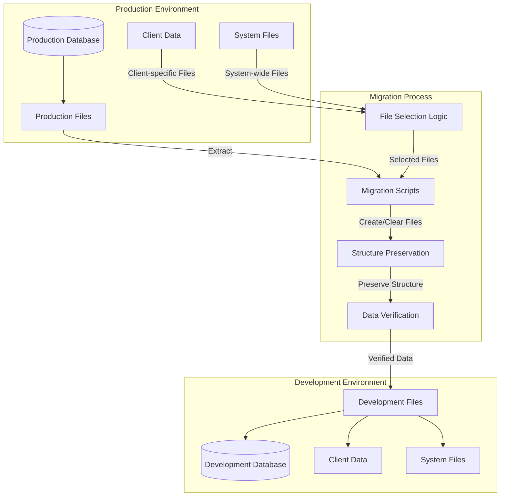
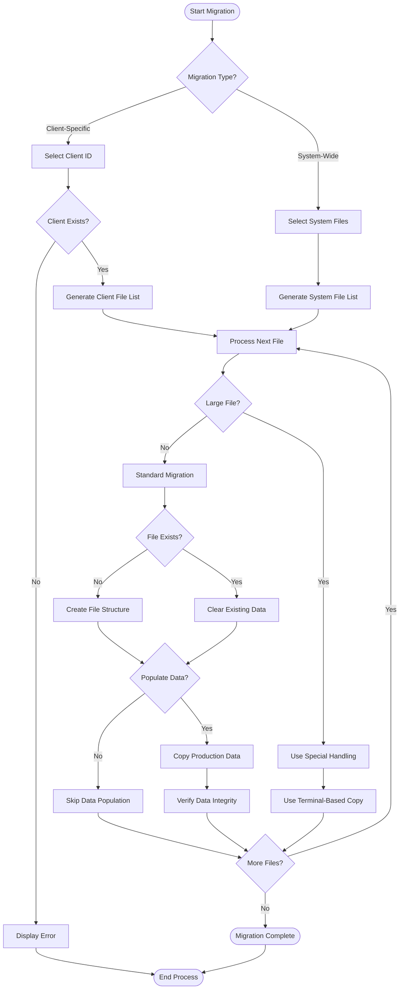
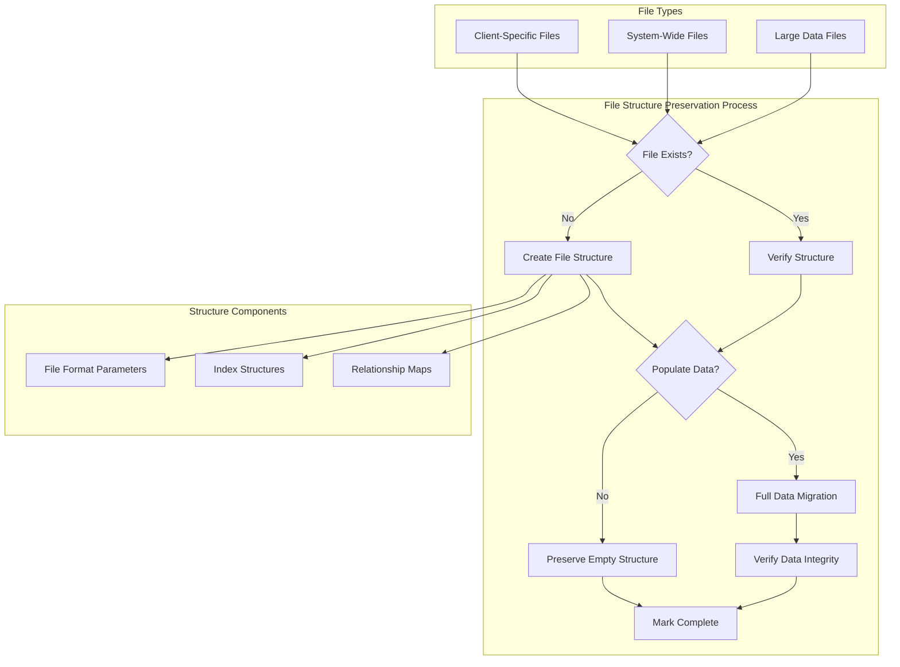

# Data Layer Migration in AFS Shreveport

## Overview of Data Migration in AFS Shreveport

Data migration is a critical process within the AFS Shreveport system, facilitating the transfer of data between production and development environments. This process is essential for maintaining consistent testing environments, supporting development activities, and ensuring system reliability. The migration framework handles both client-specific data (such as freight bills, vendor-customer relationships, and audit records) and system-wide configuration data (like carrier information and global settings). AFS Shreveport employs specialized scripts and utilities to manage these migrations, with careful consideration for data integrity, file structure preservation, and handling of large datasets. The migration process is designed to be selective, allowing administrators to choose specific clients or system files for transfer while maintaining referential integrity across the platform's complex data ecosystem.

## Data Migration Architecture

The diagram illustrates the AFS Shreveport data migration architecture, showing how data flows from the production environment to development. The process begins with the selection of files from the production database, either client-specific or system-wide. Migration scripts then handle the extraction, verification, and transfer of this data, ensuring that file structures are preserved during the process. For large files like FB.OPEN.BILLS, special handling is required due to size constraints. The architecture supports both full data migration and structure-only migration, where empty files are created in the development environment without transferring the actual data, which is particularly useful for testing scenarios that require only the schema.

## Client-Specific Data Migration

Client-specific data migration in AFS Shreveport involves transferring a comprehensive set of files that define each client's freight management operations. The process begins with the identification of client records in the CLIENTS file, followed by selective migration of associated data files. Key client files include FB.BILLS and FB.BILLS.HIST (containing current and historical freight bill information), FB.BOL.CRX (bill of lading cross-references), FB.OPEN.DATE.XREF and FB.PROC.DATE.XREF (date indexing for open and processed bills), and EXPENSE.CODES (defining client-specific expense categorizations). The migration also handles DIVISION.CODES for organizational structure, VEND.CUST and SDX.VEND.CUST for vendor-customer relationships (including Soundex indexing for fuzzy matching), VARIANCE.CODES for audit discrepancies, and REGION.CODES for geographic operations. Client-specific audit data (FB.AUDIT, FB.AUDIT.TABLES, FB.AUDIT.ZIPS) is migrated to maintain audit trail consistency. The system employs a selective approach, allowing administrators to either fully populate these files with production data or create empty file structures for testing purposes. This flexibility enables developers to work with realistic client data configurations while avoiding unnecessary data transfer for large files like FB.BILLS that may not be needed for specific development tasks.

## System-Wide Data Migration

System-wide data migration in AFS Shreveport encompasses the transfer of global configuration files and shared reference data that support the entire freight management platform. These files contain critical information used across all client operations and are essential for maintaining system consistency between environments. The migration process handles core system files such as FB.TABLES (containing system-wide configuration parameters), FP.PENDING (tracking pending freight payments), FB.BILLS.YTD (year-to-date billing summaries), and FB.LOGISTICS (logistics configuration settings). The CLIENTS and CARRIERS files, which define the master records for all clients and transportation providers, are migrated to ensure proper cross-referencing. Additional system files include CLIENT.CARRIER.XREF (mapping client-carrier relationships), CLIENT.SUM (client summary information), FB.STATUS.UPDATE (status tracking configuration), and specialized files for particular freight modes such as PCL.BILLING (parcel billing) and UPS.BM (UPS benchmark data). Financial integration files like AR.BRIDGE.LAST and FB.AR.SUMMARY ensure accounting system compatibility. The migration scripts handle these files with special attention to maintaining referential integrity, as changes to system-wide files can impact all client operations. For exceptionally large files like FB.OPEN.BILLS, the scripts include commented code with notes indicating alternative migration methods are required due to size constraints.

## File Selection and Migration Process

This flowchart illustrates the decision-making process for selecting and migrating files in AFS Shreveport. The process begins with determining whether to migrate client-specific or system-wide files. For client-specific migrations, the system validates the client ID before generating a list of associated files. For each file, the system evaluates its size to determine the appropriate migration method. Standard-sized files follow a process of checking existence, creating or clearing as needed, and then either populating with production data or leaving empty based on configuration. For exceptionally large files like FB.OPEN.BILLS, the system employs special handling methods, such as terminal-based copying, which are better suited for managing large data volumes. Throughout the process, data integrity verification ensures that migrated data remains consistent and usable in the target environment.

## Data Preparation and Verification

Data preparation and verification form critical components of the AFS Shreveport migration process, ensuring that transferred data maintains its integrity and usability across environments. Before migration begins, the system performs preliminary checks to validate source data structures and identify any potential issues that could impact the transfer. For client-specific migrations, this includes verifying that all required client records exist and that associated files maintain proper relationships. The migration scripts implement a multi-step verification approach that begins with file structure validation, ensuring that target files either exist or are created with appropriate parameters (using CREATE-FILE commands with specific dimensions like "1009,2" for consistent file organization). During data transfer, the scripts employ error checking routines that capture and evaluate command execution results, with dedicated error handling subroutines (like CK.FOR.ERROR) to address any issues that arise. Post-migration verification includes confirming successful completion of each file transfer through status messages and return code evaluation. For files containing cross-references or indexed relationships (such as SDX.VEND.CUST or FB.AUDIT.ZIPS), the system ensures that these relationships remain intact after migration. The scripts also implement selective data clearing (using CLEAR-FILE commands) before population to prevent data corruption from partial transfers or conflicting records. This comprehensive approach to data preparation and verification maintains the referential integrity essential for the complex interrelationships within the AFS Shreveport freight management system.

## Handling Large Data Sets

The AFS Shreveport system employs specialized strategies for managing large data files during migration processes, recognizing that standard migration methods may be insufficient for files exceeding certain size thresholds. The most notable example is the FB.OPEN.BILLS file, which contains comprehensive records of all open freight bills across the platform. As indicated by comments in the migration scripts ("TOO LARGE TO COPY THIS WAY. USE TERMINALS"), this file requires alternative handling approaches. Rather than using the standard COPY commands with IO redirection, the system recommends terminal-based copying methods that can better manage memory constraints and processing overhead. For other large files, the migration framework offers options to create empty file structures without transferring actual data (through the CREATE.WITHOUT.LOADING subroutine), which is particularly useful when only the schema is needed for development or testing purposes. The scripts also implement selective migration for large client-specific files like FB.BILLS and FB.BILLS.HIST, with commented code sections that can be uncommented when full data migration is necessary. Additionally, the system uses the HUSH ON command to suppress terminal output during large file operations, improving performance by reducing I/O overhead. When large files must be fully migrated, the scripts employ efficient system-level commands executed through the EXECUTE statement, which leverages the underlying operating system's optimized file handling capabilities. These combined strategies ensure that even the largest data sets can be effectively managed during migration while maintaining system performance and data integrity.

## Data Structure Preservation

This diagram illustrates how AFS Shreveport preserves data structures during migration between environments. The process begins with checking whether the target file exists in the development environment. If not, the system creates the file structure using specific format parameters (e.g., "1009,2" as seen in the CREATE-FILE commands). For existing files, the system verifies the structure to ensure compatibility. A key decision point determines whether to populate the file with actual data or maintain just the empty structure. The CREATE.WITHOUT.LOADING subroutine specifically supports creating empty file structures for testing scenarios, while the LOAD.FILE routine handles full data population. This approach is particularly valuable for large files like FB.BILLS where the structure may be needed for development, but the full data set would be impractical to migrate. The system preserves critical structural components including file formats, index structures, and relationship maps, ensuring that applications can interact with the migrated files regardless of whether they contain actual data.

## Migration Automation and Scripting

Migration automation and scripting in AFS Shreveport leverages sophisticated command execution and batch processing techniques to streamline the transfer of data between environments. The system employs two primary script utilities—COPY.PROD.TO.DEV and COPY.LIST.TO.DEV—that provide complementary approaches to migration automation. COPY.PROD.TO.DEV offers an interactive interface for selecting individual clients or system files for migration, while COPY.LIST.TO.DEV processes a pre-defined list of clients (retrieved via GET.LIST CLIENT.LIST), enabling batch migration of multiple client datasets. Both scripts utilize modular subroutines like UPDATE.CLIENT.FILES, LOAD.FILE, and CREATE.WITHOUT.LOADING to encapsulate specific migration functions, promoting code reusability and maintainability. The automation framework leverages system-level commands through the EXECUTE statement, which allows the scripts to invoke operating system utilities for file operations. For example, the scripts use EXECUTE to run commands like CREATE-FILE for structure creation, CLEAR-FILE for data clearing, and COPY for data transfer. Command execution results are captured using the CAPTURING and RETURNING clauses to enable error detection and handling. The scripts implement conditional logic to determine appropriate migration strategies based on file characteristics, with special handling for large files and options for structure-only migration. Progress tracking is provided through status messages that confirm the completion of each file transfer. The automation framework also includes error handling routines that detect and report issues during the migration process. This comprehensive approach to migration automation ensures consistent, reliable data transfers while minimizing manual intervention and reducing the potential for human error.

## Error Handling and Recovery

Error handling and recovery mechanisms in the AFS Shreveport data migration framework provide robust protection against data corruption and transfer failures. The system implements a multi-layered approach to error detection, reporting, and resolution throughout the migration process. At the file access level, the scripts use conditional OPEN statements with ELSE clauses to detect and handle missing files, automatically creating necessary file structures when required. During command execution, the scripts capture return codes and output messages using the CAPTURING and RETURNING clauses, enabling immediate detection of command failures. The dedicated CK.FOR.ERROR subroutine serves as a centralized error handling facility, processing error conditions and providing diagnostic information when file operations fail. For critical system files, the scripts implement verification steps that confirm successful data transfer before proceeding to subsequent operations. The migration framework also includes safeguards against partial transfers, using CLEAR-FILE commands to ensure clean target files before population begins. When errors occur during batch processing, the system continues with subsequent files rather than terminating the entire migration, maximizing the amount of successfully transferred data. For debugging purposes, the scripts include commented DEBUG statements that can be uncommented to provide additional diagnostic information during troubleshooting. Recovery procedures are built into the process flow, with alternative paths for handling special cases like exceptionally large files. The combination of proactive error detection, comprehensive reporting, and flexible recovery options ensures that migration processes can be completed successfully even when encountering unexpected conditions, maintaining data integrity across environments.

## Client Data Relationships

```mermaid
graph TD
    subgraph "Client Master Data"
        CLIENTS[CLIENTS File]
        CLIENT_SUM[CLIENT.SUM]
    end
    
    subgraph "Freight Bill Data"
        FB_BILLS["FB.BILLS (Client)"]
        FB_BILLS_HIST["FB.BILLS.HIST (Client)"]
        FB_OPEN_BILLS["FB.OPEN.BILLS (System)"]
        FB_AUDIT["FB.AUDIT (Client)"]
    end
    
    subgraph "Reference Data"
        EXPENSE_CODES["EXPENSE.CODES (Client)"]
        DIVISION_CODES["DIVISION.CODES (Client)"]
        REGION_CODES["REGION.CODES (Client)"]
        VARIANCE_CODES["VARIANCE.CODES (Client)"]
    end
    
    subgraph "Relationship Data"
        VEND_CUST["VEND.CUST (Client)"]
        SDX_VEND_CUST["SDX.VEND.CUST (Client)"]
        CLIENT_CARRIER_XREF["CLIENT.CARRIER.XREF (System)"]
        VEND_CUST_EDI_XREF["VEND.CUST.EDI.XREF (Client)"]
    end
    
    subgraph "Cross-Reference Data"
        FB_BOL_CRX["FB.BOL.CRX (Client)"]
        FB_OPEN_DATE_XREF["FB.OPEN.DATE.XREF (Client)"]
        FB_PROC_DATE_XREF["FB.PROC.DATE.XREF (Client)"]
    end
    
    CLIENTS --> |Client ID| FB_BILLS
    CLIENTS --> |Client ID| FB_BILLS_HIST
    CLIENTS --> |Client ID| FB_AUDIT
    CLIENTS --> |Client ID| EXPENSE_CODES
    CLIENTS --> |Client ID| DIVISION_CODES
    CLIENTS --> |Client ID| REGION_CODES
    CLIENTS --> |Client ID| VARIANCE_CODES
    CLIENTS --> |Client ID| VEND_CUST
    CLIENTS --> |Client ID| FB_BOL_CRX
    CLIENTS --> |Client ID| FB_OPEN_DATE_XREF
    CLIENTS --> |Client ID| FB_PROC_DATE_XREF
    
    VEND_CUST --> SDX_VEND_CUST
    VEND_CUST --> VEND_CUST_EDI_XREF
    
    FB_BILLS --> FB_BILLS_HIST
    FB_BILLS --> FB_OPEN_BILLS
    
    CLIENTS --> CLIENT_SUM
    CLIENTS --> CLIENT_CARRIER_XREF
    
    FB_BILLS --> FB_BOL_CRX
    FB_BILLS --> FB_OPEN_DATE_XREF
    FB_BILLS --> FB_PROC_DATE_XREF
    
    FB_AUDIT --> FB_BILLS
```

This diagram illustrates the complex relationships between client data files in the AFS Shreveport system that must be preserved during migration. At the core is the CLIENTS file, which serves as the master reference for all client-specific data. Each client has associated freight bill data (FB.BILLS, FB.BILLS.HIST, FB.AUDIT), reference data (EXPENSE.CODES, DIVISION.CODES, REGION.CODES, VARIANCE.CODES), relationship data (VEND.CUST, SDX.VEND.CUST, VEND.CUST.EDI.XREF), and cross-reference data (FB.BOL.CRX, FB.OPEN.DATE.XREF, FB.PROC.DATE.XREF). The diagram shows how these files interconnect, with relationships that must be maintained during migration to ensure system integrity. For example, the VEND.CUST file connects to both SDX.VEND.CUST (for Soundex indexing) and VEND.CUST.EDI.XREF (for EDI integration), while freight bills connect to multiple cross-reference files. The migration process must preserve these relationships by ensuring that all related files are either migrated together or have their structures properly maintained.

## Future Enhancements and Best Practices

Future enhancements to the AFS Shreveport data migration process should focus on increasing automation, improving performance, and enhancing data integrity verification. One recommended improvement is the implementation of a configuration-driven approach that replaces hard-coded file lists with externally defined migration profiles, allowing for more flexible and maintainable migration scenarios. Parallel processing capabilities would significantly improve performance for large-scale migrations, particularly for clients with extensive historical data. The current scripts could be enhanced with more sophisticated dependency mapping to automatically determine the optimal migration sequence based on file relationships, ensuring that referential integrity is maintained without manual intervention. For large files like FB.OPEN.BILLS that currently require special handling, implementing incremental migration strategies would allow for more efficient transfers by moving only changed records rather than entire files. Enhanced logging and reporting features would provide better visibility into the migration process, with detailed metrics on transfer times, record counts, and verification results. Security enhancements should include encryption for sensitive data during transfer and role-based access controls for migration operations. Best practices for ongoing migration management include establishing regular synchronization schedules between environments, implementing comprehensive pre- and post-migration testing protocols, and maintaining detailed documentation of environment differences. Additionally, developing a rollback capability would allow for quick recovery in case of migration failures. By adopting these enhancements and best practices, AFS Shreveport can further streamline its data migration processes while maintaining the high level of data integrity required for effective freight management operations.

[Generated by the Sage AI expert workbench: 2025-05-28 08:06:20  https://sage-tech.ai/workbench]: #