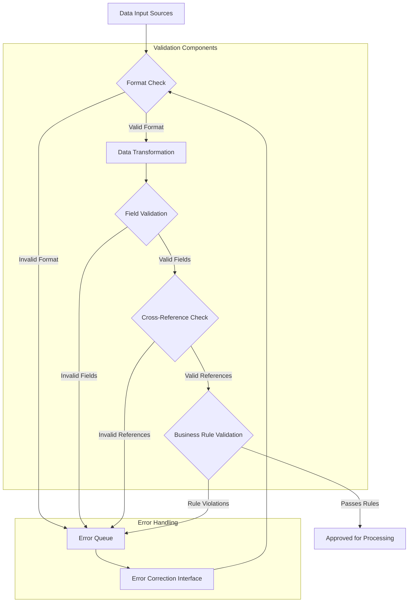
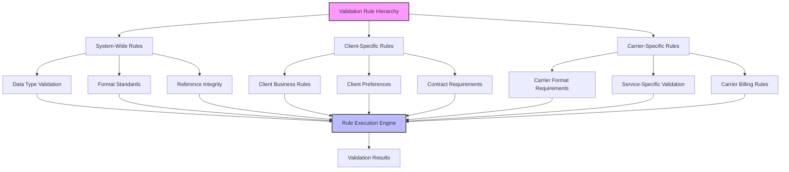
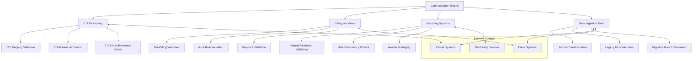
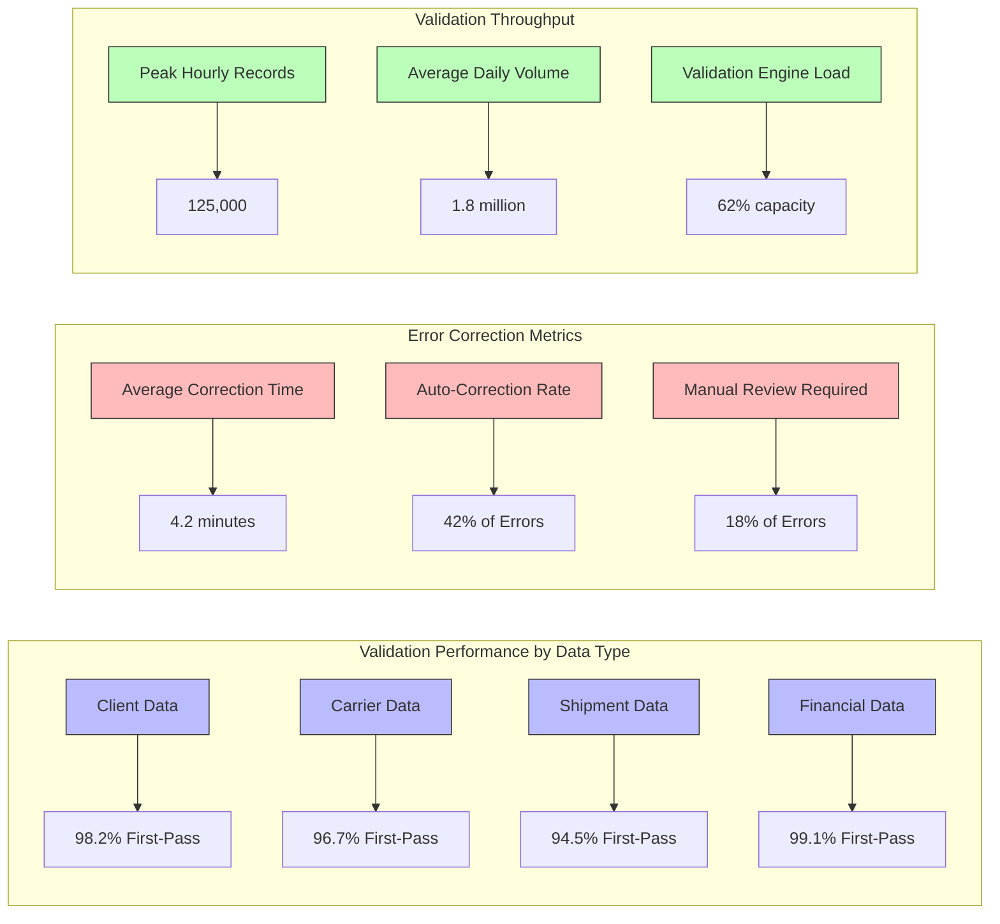

# Data Validation Tools in AFS Shreveport

## Overview of Data Validation Tools

The AFS Shreveport system incorporates comprehensive data validation tools that serve as the foundation for maintaining data integrity across all freight billing operations. These tools work in concert to ensure that information entering the system—whether through manual entry, EDI transactions, or file imports—adheres to standardized formats and business rules. The validation framework includes components for field-level validation, record verification, cross-reference checking, and format standardization. By implementing robust validation mechanisms, AFS Shreveport minimizes processing errors, reduces manual corrections, and ensures consistent data quality for downstream operations including billing, auditing, and reporting. The business value of these validation tools extends beyond error prevention to include improved operational efficiency, enhanced client trust, and more accurate financial reporting.

## Record Verification Processes

The AFS Shreveport system employs multi-layered record verification processes to validate freight records throughout their lifecycle. When data enters the system, it undergoes initial format verification to ensure basic structural integrity, followed by more sophisticated validation against established business rules. The PARSE.SPREADSHEET utility exemplifies this approach by extracting client, carrier, and PRO number fields from source files and subjecting them to standardized formatting rules. The system maintains verification logs that track validation exceptions and their resolutions, providing an audit trail for compliance purposes. Record verification extends to relationship validation, ensuring that client-carrier relationships are authorized and that billing parameters align with contractual agreements. By implementing these verification processes, AFS Shreveport maintains high data quality standards while accommodating the diverse data formats and requirements of multiple clients and carriers.

## Data Validation Workflow

The data validation workflow in AFS Shreveport follows a comprehensive path from initial input through final approval or rejection. As illustrated in the diagram, data enters the system from various sources including EDI transmissions, manual entry, and file imports like those processed by PARSE.SPREADSHEET. The first validation gate checks basic format compliance, rejecting malformed data to an error queue for correction.

Valid data then undergoes transformation to standardize formats, such as the client-carrier-PRO number standardization performed by PARSE.SPREADSHEET. Following transformation, individual fields are validated against type and range constraints. The system then performs cross-reference validation to verify relationships between entities (e.g., confirming that a carrier is authorized for a specific client). Finally, business rules are applied to validate complex conditions like rate consistency and contractual compliance.

Data failing any validation step is routed to an error correction interface where users can address issues and resubmit for processing. This structured workflow ensures that only fully validated data proceeds to operational processing, maintaining system-wide data integrity.

## Format Standardization and Transformation

AFS Shreveport implements comprehensive format standardization and transformation processes to ensure consistency across all data elements in the platform. The system applies specific formatting rules to critical identifiers such as client IDs, carrier codes, and PRO numbers, as demonstrated in the PARSE.SPREADSHEET utility. This script exemplifies the standardization approach by right-justifying client and carrier codes to five characters and zero-padding PRO numbers, creating a uniform identifier format (CLIENT*CARRIER*PRO_NUM) that facilitates accurate record matching and retrieval. Beyond identifier standardization, the system normalizes address formats, standardizes location codes against reference databases, and ensures consistent date formatting across international boundaries. These transformation processes occur at multiple entry points—during initial data capture, EDI processing, and batch imports—ensuring that regardless of source, all data conforms to system standards before processing. By maintaining consistent data formats, AFS Shreveport reduces processing errors, improves search efficiency, and enables reliable cross-reference validation throughout the freight billing lifecycle.

## Field-Level Validation Rules

AFS Shreveport implements a sophisticated framework of field-level validation rules that serve as the first line of defense against data integrity issues. These rules operate at varying levels of complexity, from basic type checking to context-aware validation logic. For critical shipping identifiers, the system enforces strict formatting requirements—ZIP codes must conform to country-specific patterns, PRO numbers must match carrier-defined formats, and weights must fall within logical ranges for the specified freight mode. The validation engine applies conditional logic that adapts to shipment context; for instance, international shipments trigger additional validation for customs documentation and country codes. For financial fields, the system implements threshold validation that flags charges exceeding expected ranges based on historical patterns and contractual agreements. The PARSE.SPREADSHEET utility demonstrates basic field validation by ensuring client and carrier codes meet standardized formatting requirements before record creation. These validation rules are continuously refined based on processing exceptions and client feedback, creating an evolving framework that balances strict validation against operational flexibility. By implementing comprehensive field-level validation, AFS Shreveport prevents downstream processing errors that could result in billing disputes, payment delays, or compliance issues.

## Validation Rule Hierarchy

The validation rule hierarchy in AFS Shreveport organizes validation logic in a structured framework that allows for both universal standards and specialized requirements. At the top level, system-wide rules establish fundamental validation standards that apply across all transactions, including data type validation, format standards (as seen in PARSE.SPREADSHEET's standardization of client-carrier-PRO formats), and reference integrity checks that ensure data consistency across related records.

Client-specific rules form the second tier, implementing validation logic tailored to individual client requirements. These include business rules that enforce client-specific processing workflows, preferences for data handling, and contract requirements that validate against negotiated terms and conditions.

Carrier-specific rules comprise the third tier, addressing the unique requirements of different transportation providers. These include carrier format requirements for shipment identifiers, service-specific validation for specialized shipping services, and carrier billing rules that ensure compliance with carrier invoicing requirements.

The rule execution engine applies these hierarchical rules in a defined sequence, typically starting with system-wide rules before applying increasingly specific validation logic. This approach ensures consistent baseline validation while accommodating the diverse requirements of multiple clients and carriers. When conflicts arise between rule levels, the system typically applies the most restrictive validation, though client-specific overrides can be configured for exceptional cases.

## Error Detection and Correction Mechanisms

AFS Shreveport implements sophisticated error detection and correction mechanisms that identify, categorize, and facilitate resolution of validation issues throughout the freight billing lifecycle. The system employs a multi-tiered approach to error detection, beginning with synchronous validation during data entry that provides immediate feedback on format and reference errors. Batch validation processes then apply more complex business rules, identifying contextual errors that require broader data analysis. Each detected error is assigned a severity level—critical errors block further processing, while warnings allow processing to continue with flagged exceptions. The system maintains detailed error logs that capture validation failure details, including the specific rule violated, affected data elements, and contextual information to aid resolution. For correction workflows, AFS Shreveport provides specialized interfaces that present validation errors alongside relevant reference data, enabling efficient resolution by appropriate personnel based on error type and severity. The PARSE.SPREADSHEET utility demonstrates basic error tracking by maintaining counts of processed, checked, and written records, providing a simple audit mechanism for data transformation operations. More sophisticated correction workflows include approval chains for specific error types and automated correction suggestions based on historical patterns. By implementing comprehensive error detection and streamlined correction processes, AFS Shreveport minimizes the operational impact of data quality issues while maintaining rigorous validation standards.

## Cross-Reference Validation

AFS Shreveport employs extensive cross-reference validation to ensure data consistency and relationship integrity across the system. This validation approach verifies that related data elements maintain logical consistency by checking values against reference tables and external sources. For carrier information, the system validates carrier codes against the master carrier database, ensuring that only recognized carriers are processed and that carrier-specific formatting rules are applied correctly. Geographic validation confirms that origin and destination locations exist in the system's location database and that distance calculations reflect accurate mileage between points. Rate consistency validation compares charged amounts against contracted rates, identifying potential billing errors or unauthorized rate changes. The PARSE.SPREADSHEET utility demonstrates basic cross-reference preparation by standardizing client-carrier-PRO combinations into a format that facilitates subsequent cross-reference validation. More complex cross-reference validation includes client-carrier relationship verification, ensuring that carriers are authorized for specific clients, and service validation that confirms service levels are appropriate for shipment characteristics. The system maintains cross-reference exception reports that highlight potential relationship inconsistencies for review, enabling proactive data quality management. By implementing comprehensive cross-reference validation, AFS Shreveport maintains data relationship integrity across millions of freight transactions, reducing processing errors and improving analytical accuracy.

## Data Validation Integration Points

The data validation framework in AFS Shreveport integrates with multiple system components, creating a comprehensive validation ecosystem that ensures data integrity across all operational areas. The core validation engine provides centralized validation services that are leveraged by various system components through well-defined integration points.

EDI processing represents a critical integration point, where the validation engine verifies EDI mapping accuracy, format compliance, and cross-references between EDI fields and internal data structures. This integration ensures that electronic transactions from carriers and clients meet system requirements before processing.

Billing workflows incorporate validation at multiple stages, including pre-billing validation that confirms all required data elements are present and valid, audit rule validation that applies client-specific business rules, and payment validation that verifies payment amounts against invoiced charges.

Reporting systems integrate with validation tools to ensure report parameter validity, data consistency across report components, and analytical integrity for business intelligence outputs. This integration prevents misleading or incorrect reporting based on invalid data combinations.

Data migration tools like PARSE.SPREADSHEET represent another key integration point, where validation services support format transformation, legacy data validation, and migration rule enforcement during data conversion and system transitions.

These integration points extend to external systems through APIs and file exchanges, enabling validation against carrier systems (for rate verification), client systems (for order validation), and third-party services (for geographic and regulatory compliance). By implementing these comprehensive integration points, AFS Shreveport ensures consistent validation across all data flows, regardless of source or destination.

## Validation Reporting and Monitoring

AFS Shreveport implements comprehensive validation reporting and monitoring capabilities that provide visibility into data quality metrics and validation exceptions across the platform. The system generates validation exception reports that categorize and summarize validation failures by type, severity, and frequency, enabling targeted quality improvement initiatives. Operational dashboards display real-time validation metrics including error rates by source, correction turnaround times, and validation throughput, allowing managers to identify bottlenecks and resource constraints. Trend analysis reports track validation metrics over time, highlighting emerging data quality issues before they impact operations. The system maintains detailed audit logs of validation activities, including who corrected validation errors and what changes were made, supporting compliance requirements and process improvement efforts. For critical validation failures, the system generates alerts through email notifications and dashboard indicators, ensuring timely intervention for high-priority issues. The PARSE.SPREADSHEET utility demonstrates basic validation reporting through its count tracking of processed, checked, and written records, providing a simple audit mechanism for transformation operations. More sophisticated monitoring includes predictive analytics that identify potential validation issues based on historical patterns and automated quality scoring that assesses overall data quality by client, carrier, or data source. By implementing comprehensive validation reporting and monitoring, AFS Shreveport enables data-driven quality management and continuous process improvement across freight billing operations.

## Data Cleanup and Migration Tools

AFS Shreveport incorporates specialized data cleanup and migration tools that maintain data integrity during system transitions and data transformations. The PARSE.SPREADSHEET utility exemplifies these tools, providing targeted functionality for extracting, standardizing, and reformatting freight billing records. This utility demonstrates key data cleanup capabilities by reading tab-delimited source data, extracting client, carrier, and PRO number fields, and applying standardized formatting rules to create consistent identifiers. The system includes more sophisticated migration tools that perform comprehensive data validation during transfers, including format verification, relationship validation, and business rule compliance. These tools support both bulk migrations during system upgrades and incremental data cleanup for ongoing quality improvement. For complex migrations, the system implements mapping templates that define transformation rules between source and target formats, ensuring consistent application of business logic during conversion. Data cleanup workflows include exception handling processes that flag records requiring manual review and provide specialized interfaces for efficient resolution. The system maintains detailed migration logs that track transformation statistics, exception counts, and processing metrics, providing audit trails for compliance and quality assurance. By implementing these specialized data cleanup and migration tools, AFS Shreveport maintains data integrity during system transitions while providing ongoing capabilities for data quality improvement and standardization.

## Validation Performance Metrics

The validation performance metrics in AFS Shreveport provide critical insights into data quality, processing efficiency, and system capacity across different data types and validation processes. These metrics help identify opportunities for optimization and measure the effectiveness of validation strategies.

First-pass validation rates vary by data type, with financial data achieving the highest success rate at 99.1%, reflecting the stringent controls applied to monetary information. Client data follows at 98.2%, benefiting from standardized formats and reference validation. Carrier data shows a slightly lower rate at 96.7%, often due to variations in carrier-specific formats and identifiers. Shipment data has the lowest first-pass rate at 94.5%, reflecting the complexity of validating diverse shipment characteristics across multiple transportation modes.

Error correction metrics reveal that the average time to correct a validation error is 4.2 minutes, though this varies significantly by error type and complexity. The system's auto-correction capabilities successfully resolve 42% of validation errors through pattern recognition and reference lookups, while 18% of errors require manual review by specialized personnel due to complex business rule violations or contextual issues.

Validation throughput metrics demonstrate the system's processing capacity, handling peak volumes of 125,000 records per hour and an average daily volume of 1.8 million records. The validation engine typically operates at 62% of capacity, providing headroom for volume spikes and additional validation rules without performance degradation.

These metrics guide ongoing optimization efforts, including refinement of validation rules to reduce false positives, enhancement of auto-correction algorithms, and targeted training for personnel handling specific error types. By continuously monitoring these performance indicators, AFS Shreveport maintains efficient validation processes while ensuring data quality across all freight billing operations.

[Generated by the Sage AI expert workbench: 2025-05-28 08:06:22  https://sage-tech.ai/workbench]: #