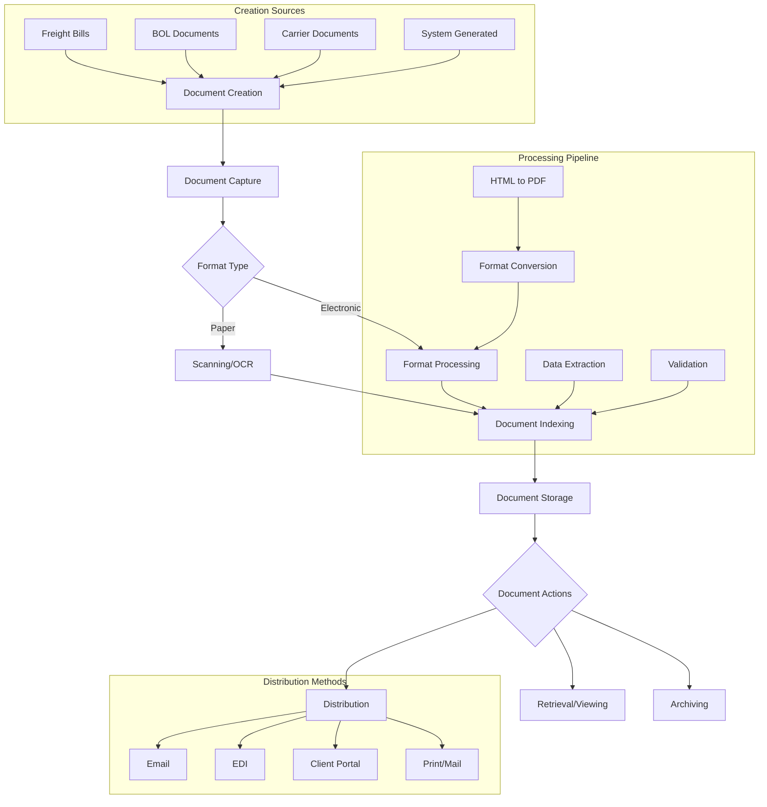
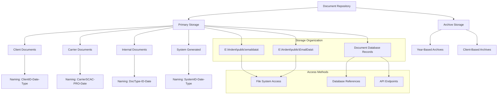
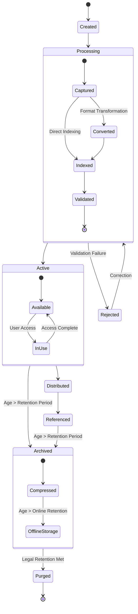

# Document Management in AFS Shreveport

## Document Management Overview

The AFS Shreveport system implements a comprehensive document management solution designed to handle the diverse documentation needs of freight logistics operations. The system provides end-to-end capabilities for creating, processing, storing, and retrieving freight-related documents, including bills of lading, freight bills, audit documentation, and various reports. Document management is deeply integrated with core business processes, enabling efficient digitization of paper documents, conversion between formats, and electronic distribution to stakeholders. The system supports various document formats and implements specialized processing for HTML, PDF, and image files, with features for OCR processing, document counting, and electronic archiving. Security controls and compliance features ensure that sensitive freight documentation is properly protected while remaining accessible to authorized users throughout the document lifecycle.

## Document Management Workflow

The document management workflow in AFS Shreveport follows a structured process from creation through archiving. Documents enter the system either as paper documents requiring scanning and OCR processing, or as electronic files in various formats. The system uses specialized utilities like wkhtmltopdf to convert between formats (as seen in the GREG.PDF script), ensuring consistent document representation. After capture, documents undergo indexing where they are categorized, tagged with metadata, and linked to relevant freight records. The indexed documents are then stored in a structured repository with defined naming conventions and organized file paths. From storage, documents can be retrieved for viewing, distributed to stakeholders through various channels including email and EDI, or archived according to retention policies. This workflow supports the full document lifecycle while maintaining integration with core freight processing functions.

## Document Conversion and Format Handling

AFS Shreveport implements sophisticated document format conversion capabilities to ensure consistent document representation across the system. A key component of this functionality is the HTML-to-PDF transformation process, exemplified by the GREG.PDF script. This script leverages the wkhtmltopdf utility, an open-source command-line tool that renders HTML pages into PDF documents using the WebKit rendering engine. The conversion process follows a structured approach where HTML documents (often generated from system data or received electronically) are transformed into standardized PDF format for consistent viewing, printing, and archiving.

The system maintains dedicated file paths for both source HTML documents and output PDF files, typically within the Ardent public directories. The conversion process is orchestrated through dynamically generated batch files containing the appropriate conversion commands, which are then executed via DOS commands. This approach allows for flexible handling of conversion parameters and efficient batch processing of multiple documents. The conversion utility supports various rendering options, including resolution settings and page formatting, ensuring that the resulting PDFs maintain fidelity to the original content while conforming to standardized document specifications required for freight documentation.

## Document Imaging and Processing

AFS Shreveport's document imaging capabilities form a critical component of its freight documentation management, enabling the digitization and processing of physical documents into electronic formats. The system implements OCR (Optical Character Recognition) technology to extract text and data from scanned freight bills, bills of lading, and other shipping documents. This OCR processing pipeline identifies key information such as PRO numbers, shipment details, charges, and carrier information, which is then validated against expected formats and business rules before being integrated with the corresponding freight records in the system.

The imaging process begins with document scanning, where physical documents are converted to digital image formats. These images undergo preprocessing to enhance quality and readability before being submitted to the OCR queue for text extraction. The system maintains specialized OCR configuration settings optimized for freight documentation, with recognition patterns for common document layouts from various carriers. After OCR processing, the extracted data undergoes validation checks to ensure accuracy, with exceptions flagged for human review. The system also supports image indexing, where documents are categorized and linked to relevant freight records, enabling efficient retrieval and association with the appropriate shipments or billing records. Throughout this process, the system maintains image counting and reporting capabilities to track document processing volumes and monitor system performance.

## Document Storage Architecture

The document storage architecture in AFS Shreveport employs a structured approach to organizing and managing freight documentation. As evidenced in the GREG.PDF script, the system utilizes specific file paths like "E:\Ardent\public\emaildata\" and "E:\Ardent\public\EmailData\" for storing documents in various stages of processing. The architecture separates documents into primary storage for active documents and archive storage for historical records.

Documents are organized hierarchically based on document type, client relationship, and operational purpose. The naming conventions follow standardized patterns that incorporate identifiers such as client IDs, carrier SCAC codes, PRO numbers, and timestamps to ensure unique identification and logical organization. For system-generated documents like converted PDFs, the naming includes specific identifiers (e.g., "GREGTEST.PDF") that link to the corresponding business processes.

The storage system maintains references between physical document files and database records, enabling efficient document retrieval through multiple access methods including direct file system access, database queries, and API endpoints. This architecture supports the system's document lifecycle management while providing the performance and reliability needed for high-volume freight documentation processing.

## Electronic Document Distribution

AFS Shreveport implements a comprehensive electronic document distribution system that enables automated delivery of freight documentation to clients, carriers, and internal users. The system supports multiple distribution channels, with email being the primary method for delivering documents such as freight bills, audit reports, and shipping notifications. As evidenced by the document conversion process in the GREG.PDF script, documents are prepared in standardized formats (particularly PDF) before distribution to ensure consistent rendering across different recipient systems.

The distribution process is highly configurable, allowing for client-specific preferences regarding document format, delivery schedule, and recipient lists. For clients requiring structured electronic data, the system leverages EDI (Electronic Data Interchange) capabilities to transmit standardized document information in formats like X12 or EDIFACT. Distribution rules can be tailored based on document type, client requirements, or operational triggers such as bill approval or audit completion.

Security measures are implemented throughout the distribution process, including encryption for sensitive documents and authentication mechanisms for recipient access. The system maintains comprehensive logging of all document distributions, recording delivery status, recipient information, and timestamps for audit and tracking purposes. For high-volume clients, the system supports batch processing of document distributions, optimizing performance while maintaining delivery reliability.

## Document Retrieval and Viewing

AFS Shreveport provides sophisticated document retrieval and viewing capabilities that enable users to efficiently locate and access freight documentation throughout the system. The retrieval functionality is built around a multi-faceted search system that allows users to find documents based on various criteria including client information, carrier details, PRO numbers, shipment dates, document types, and custom reference fields. This search functionality is integrated across the application's interfaces, providing consistent access to documentation from relevant operational contexts.

Document viewing is implemented with format-specific viewers that support the various document types managed by the system, including PDFs (as generated by the conversion process in GREG.PDF), images, and native application formats. The viewing interface includes tools for zooming, rotation, and page navigation to enhance usability. For multi-page documents, the system provides thumbnail navigation and document outline features.

Access controls are rigorously enforced during document retrieval and viewing, ensuring that users can only access documents appropriate to their role and permissions. The system implements client-specific security boundaries, preventing cross-client document access while allowing appropriate sharing of carrier documentation across related shipments. Document access is tracked through comprehensive logging, recording user information, access timestamps, and actions performed, supporting both security auditing and usage analytics.

## Document Lifecycle Management

The document lifecycle in AFS Shreveport follows a comprehensive path from creation through eventual purging, with clearly defined status transitions and retention policies. Documents begin in the Created state when they are initially generated or received by the system. They then enter Processing, where they undergo format conversion (as seen in the GREG.PDF script for HTML-to-PDF transformation), indexing, and validation.

Successfully processed documents become Active and are made available for operational use. During this phase, documents may be distributed to stakeholders via email, EDI, or other channels, and referenced during freight processing, auditing, and reporting activities. The system tracks document usage and maintains relationships between documents and related freight records.

As documents age, they transition to Archived status based on configurable retention policies that consider document type, client requirements, and regulatory mandates. Archived documents are typically compressed and eventually moved to offline storage while maintaining searchability through metadata. Finally, documents that have exceeded their legal retention requirements enter the Purged state and are permanently removed from the system.

Throughout this lifecycle, the system maintains comprehensive status tracking, enabling administrators to monitor document volumes at each stage and ensure compliance with retention policies. The lifecycle management process is automated where possible, with scheduled tasks handling routine transitions while providing alerts for exceptions requiring manual intervention.

## Integration with Freight Processing

Document management in AFS Shreveport is deeply integrated with core freight processing functions, creating a seamless flow of documentation throughout the freight lifecycle. This integration begins with the bill of lading (BOL) process, where shipping documentation is created, captured, and linked to shipment records. As freight moves through the transportation network, carrier documentation including freight bills and proof of delivery are associated with the corresponding shipment records, creating a comprehensive document trail for each movement.

The document management system supports the freight audit process by providing easy access to supporting documentation needed for rate verification, service validation, and charge reconciliation. When discrepancies are identified during auditing, the system facilitates the creation and management of adjustment documentation, including debit memos and carrier communications. For approved freight bills, the document management system generates and distributes payment documentation, including remittance advice and payment notifications.

Client billing processes leverage document management capabilities to compile supporting documentation for invoices, including original carrier bills, audit adjustments, and service verification. The system also supports regulatory compliance by maintaining required shipping documentation such as hazardous materials declarations, customs forms, and weight certificates. Throughout these processes, document management functions are exposed through consistent APIs and user interfaces, allowing freight processing applications to seamlessly create, retrieve, and update documentation without requiring users to switch contexts or manually transfer files between systems.

## Document Counting and Reporting

AFS Shreveport implements comprehensive document counting and reporting capabilities that provide visibility into document processing volumes, operational efficiency, and system utilization. The imaging reports functionality tracks document counts across various dimensions, including document types, processing stages, clients, carriers, and time periods. These reports help operations teams monitor workload distribution, identify processing bottlenecks, and allocate resources effectively.

The system maintains detailed metrics on document processing efficiency, including scanning rates, OCR accuracy, validation exceptions, and processing times. These metrics are used to evaluate system performance, identify opportunities for optimization, and validate service level agreements. For billing purposes, the system tracks document counts that drive variable charges, such as per-page scanning fees or document storage volumes.

Document counting is also leveraged for capacity planning and resource allocation, with trend analysis helping to predict future document volumes based on historical patterns and business growth. The reporting interface provides both standard reports for routine operational monitoring and configurable ad-hoc reporting capabilities for specialized analysis. Reports can be scheduled for automatic generation and distribution, ensuring stakeholders receive timely updates on document processing metrics. The document counting and reporting functionality integrates with broader system analytics, contributing to comprehensive operational dashboards that provide holistic visibility into the freight management process.

## Document Security and Compliance

AFS Shreveport implements robust security measures and compliance controls for document management, ensuring the protection of sensitive freight information while maintaining regulatory compliance. Access to documents is controlled through a comprehensive permissions framework that restricts document visibility based on user roles, client relationships, and document classification. This ensures that users can only access documents relevant to their job functions and authorized client accounts.

The system maintains detailed audit trails of all document-related activities, including creation, modification, viewing, and distribution events. These audit records capture user information, timestamps, and action details, providing accountability and supporting security investigations when needed. For sensitive documents containing financial or personally identifiable information, the system implements additional security measures such as encryption at rest and in transit.

Compliance features are built into the document management processes to support adherence to industry regulations and client requirements. These include configurable retention policies that ensure documents are maintained for required periods before archiving or purging, as well as legal hold capabilities that prevent document deletion during litigation or audit proceedings. The system also supports compliance with electronic document regulations by maintaining document integrity through checksums and version control, ensuring that documents remain tamper-evident throughout their lifecycle.

Regular security assessments and compliance reviews are conducted on the document management system, with findings addressed through continuous improvement processes. The security and compliance framework is designed to be adaptable to evolving regulatory requirements and emerging security threats, ensuring long-term protection of freight documentation.

## Document Integration Points

```mermaid
flowchart TD
    A[Document Management System] --- B[Core Freight Processing]
    A --- C[EDI System]
    A --- D[Client Portal]
    A --- E[Billing System]
    A --- F[Audit System]
    A --- G[Reporting Engine]
    A --- H[External Systems]
    
    B --> B1[BOL Processing]
    B --> B2[Freight Bill Entry]
    B --> B3[Shipment Tracking]
    
    C --> C1[EDI 210 - Freight Details]
    C --> C2[EDI 214 - Shipment Status]
    C --> C3[EDI 997 - Acknowledgments]
    
    D --> D1[Document Retrieval API]
    D --> D2[Document Upload Interface]
    
    E --> E1[Invoice Generation]
    E --> E2[Payment Processing]
    
    F --> F1[Audit Documentation]
    F --> F2[Adjustment Records]
    
    G --> G1[Document Volume Reports]
    G --> G2[Processing Metrics]
    
    H --> H1[Carrier Systems]
    H --> H2[Client ERP]
    H --> H3[Mobile Applications]
    
    subgraph "Format Conversion Services"
    I[HTML to PDF Conversion]
    J[Image Processing]
    K[OCR Services]
    end
    
    A --- I
    A --- J
    A --- K
```

The document management system in AFS Shreveport serves as a central integration hub, connecting with multiple components of the freight management platform and external systems. At the core of these integrations is the document conversion service (exemplified by the GREG.PDF script), which transforms documents between formats to ensure compatibility across different system components and external requirements.

The document management system integrates bidirectionally with the core freight processing modules, providing document creation services for BOL generation and freight bills while consuming carrier documentation for shipment tracking and verification. The EDI system leverages document management for translating between internal document formats and standardized EDI transactions, including freight details (210), shipment status updates (214), and acknowledgments (997).

Client-facing integrations include the document retrieval API that powers the client portal, allowing customers to access their freight documentation securely. The billing system integrates with document management for invoice generation and supporting documentation, while the audit system both consumes and produces documents during the freight auditing process.

Reporting engines connect to document management to generate volume metrics, processing statistics, and operational dashboards. External system integrations include connections to carrier systems for document exchange, client ERP systems for automated document flows, and mobile applications for on-the-go document access.

These integration points are implemented through standardized APIs and file-based interfaces, ensuring consistent document handling across the platform while supporting the specialized needs of each integrated component.

[Generated by the Sage AI expert workbench: 2025-05-28 08:06:24  https://sage-tech.ai/workbench]: #