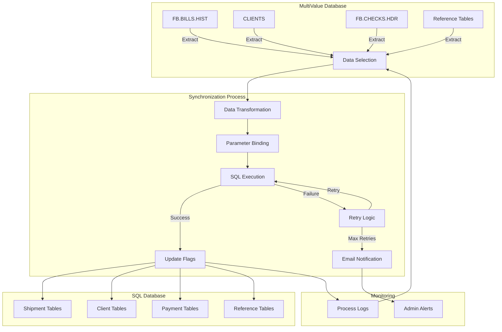
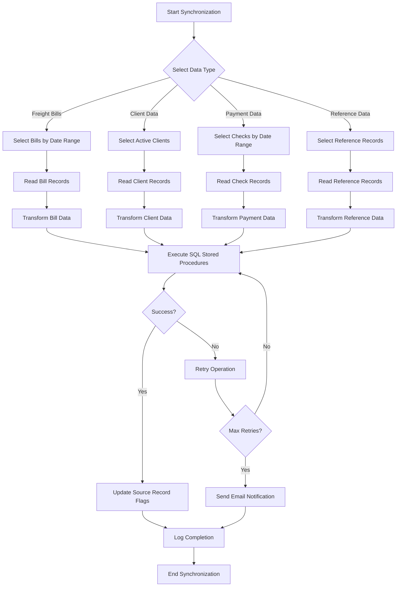
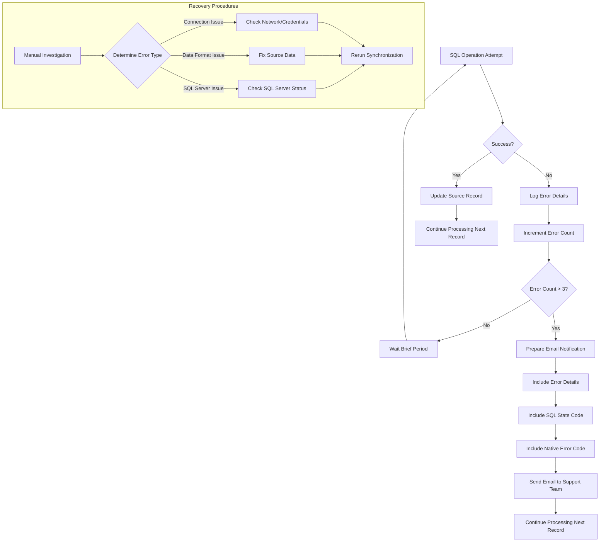
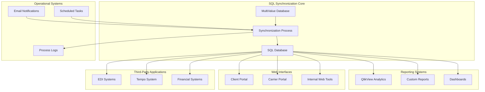

# SQL Data Synchronization in AFS Shreveport

## Overview of SQL Data Synchronization

The AFS Shreveport system implements a comprehensive SQL data synchronization framework that maintains data consistency between the primary MultiValue database and SQL databases used for reporting and analytics. This framework consists of various programs and subroutines that extract, transform, and load data from the MultiValue environment to SQL Server databases. The synchronization process handles various data entities including freight bills, client information, payment records, and reference data. The system supports both scheduled batch operations and on-demand synchronization, with mechanisms to prevent business hour impacts and ensure data integrity. The framework includes robust error handling, retry mechanisms, and notification systems to alert administrators of synchronization issues.

## SQL Synchronization Architecture



The architecture shows how data flows from the MultiValue database through the synchronization process to the SQL database. The process begins with data selection from various MultiValue files, followed by transformation to match SQL schema requirements. Parameters are bound to SQL statements for secure and efficient execution. Successful operations update flags in the source system, while failures trigger retry logic and eventually email notifications if persistent. The entire process is monitored through logs and administrative alerts.

## Core Synchronization Components

The SQL data synchronization framework in AFS Shreveport consists of several key components that work together to ensure reliable data transfer between systems:

1. **Update Processes**: Programs like `UPD.SQL.FBHIST.PX`, `UPD.SQL.CLIENT.PX`, and `UPD.SQL.FBPYMT.PX` handle the extraction and synchronization of specific data types (freight bills, client information, payments). These processes select relevant records from the MultiValue database and prepare them for SQL insertion.

2. **Stored Procedures**: The system uses SQL stored procedures like `PX_UpdShipment`, `PX_UpdClient`, and `PX_UpdPayment` to handle the actual data insertion and updates in the SQL database. This approach provides better performance, security, and maintainability compared to direct SQL statements.

3. **ODBC Connections**: The framework establishes connections to SQL databases using ODBC (Open Database Connectivity) through the `UNIVERSE.INCLUDE ODBC.H` library. This provides a standardized interface for database access, with connection management handled by functions like `SETUP.SQL`.

4. **Monitoring Systems**: Programs like `CK.SQL.UPD` verify that nightly SQL updates have completed successfully. The system also includes logging through `PROGTRACK` and email notifications via `SENDMAIL` when issues occur.

5. **Synchronization Control**: Files like `SQL.LOAD` and `CONTROL` store process state information and prevent duplicate execution of synchronization processes. The system also includes mechanisms to ensure updates run outside business hours.

The framework is designed with error handling at multiple levels, including retry logic for failed operations and email notifications to administrators when persistent failures occur. This ensures that data synchronization issues are promptly identified and addressed.

## Freight Bill History Synchronization

Freight bill history synchronization is a critical component of the AFS Shreveport system's data integration strategy. This process ensures that detailed freight bill information, including shipment details, carrier information, expense codes, and payment data, is accurately reflected in the SQL database for reporting and analysis.

The synchronization process begins with programs like `UPD.SQL.FBHIST.PX` selecting freight bills from the `FB.BILLS.HIST` file based on date ranges and client criteria. For each bill, the system retrieves associated records from related files such as `EDI.BILLS.HIST`, `VEND.CUST`, and `DIVISION.CODE` to gather complete information about the shipment.

The core processing occurs in subroutines like `UPD.SQL.FBHIST.SUB`, which transform the MultiValue data structure into SQL-compatible formats. This includes:

1. Creating a unique key for each record by concatenating client ID, carrier ID, PRO number, and process date
2. Extracting origin and destination address information based on shipment direction
3. Calculating freight charges, including estimated fuel surcharges for truckload shipments when not explicitly provided
4. Processing weight information with distribution algorithms to ensure consistency
5. Determining whether bills are electronic (EDI) or paper (PPR) for proper categorization

The system then uses stored procedures like `PX_UpdShipment`, `PX_UpdCarrierInvoice`, and `PX_UpdPayment` to update the SQL database tables. Special handling exists for different transportation modes (LTL, Truckload, Parcel) and carrier types.

The framework includes validation checks to ensure data integrity, such as weight validation that ensures line item weights sum to match the bill's total weight within a 2% tolerance. It also handles international shipments by analyzing ZIP codes and applying appropriate formatting.

## Data Flow Process



The flowchart illustrates the step-by-step process of data synchronization from MultiValue to SQL databases. The process begins by selecting the data type to synchronize, then retrieving relevant records based on criteria like date ranges. Each record is read from its source file, transformed to match SQL requirements, and sent to SQL stored procedures for insertion or update. Successful operations update flags in the source system, while failures trigger retries and eventually notifications. The process concludes with logging completion status.

## Client and Reference Data Synchronization

Client and reference data synchronization ensures that essential business information is consistently available in both the MultiValue and SQL database systems. This synchronization covers client records, division codes, vendor/customer relationships, and various reference tables used throughout the AFS Shreveport system.

The client data synchronization process is primarily handled by `UPD.SQL.CLIENT.PX` and its associated subroutines. This process:

1. Selects client records from the `CLIENTS` file, focusing on active clients (those with status "A")
2. Extracts client details including identification, contact information, billing preferences, and service flags
3. Updates SQL tables through the `PX_UpdClient` stored procedure with up to 62 parameters covering various client attributes
4. Processes division codes for each client, maintaining the hierarchical relationship between clients and their divisions
5. Updates vendor/customer relationships to maintain proper cross-references between clients and their business partners

Division code synchronization is handled by `UPD.SQL.DIV.SUB`, which:
1. Retrieves division records from client-specific `DIVISION.CODES` files
2. Extracts division details including name, address, and status information
3. Determines division status based on client status and division requirements
4. Updates SQL tables through the `PX_UpdDivision` stored procedure

Reference data synchronization includes:
1. Sales representative information through `UPD.SQL.SLSREP.PX`
2. Tariff information through `UPD.SQL.TARIFF.PX`
3. ZIP code data through `UPD.SQL.ZIPS.PX`
4. Mileage information through `UPD.SQL.MILEAGE.PX`

The system maintains data integrity by ensuring that reference relationships are preserved during synchronization. For example, client division records maintain references to their parent clients, and vendor/customer records maintain proper cross-references to the clients they serve.

## Payment and Financial Data Processing

The AFS Shreveport system implements comprehensive synchronization of payment and financial data between the MultiValue database and SQL systems. This ensures accurate financial reporting, payment tracking, and audit capabilities across platforms.

Payment synchronization primarily revolves around check processing, handled by programs like `UPD.SQL.CHECKS` and `UPD.SQL.FBPYMT.PX`. These programs:

1. Select check records from `FB.CHECKS.HDR` based on date ranges and bank type criteria
2. Process check details from `FB.CHECKS.DTL` to identify associated freight bills
3. Retrieve bill information from `FB.BILLS.HIST` to gather complete payment context
4. Extract payment details including check numbers, amounts, dates, and commission values
5. Update SQL database tables through stored procedures like `PX_UpdPayment`

Financial data processing includes several specialized components:

1. **Commission Calculation**: The system processes various commission types including discount commission, overcharge commission, and consulting commission, calculating values based on client agreements and service types.

2. **Variance Tracking**: Variances between expected and actual payments are calculated and synchronized to SQL for analysis and reporting.

3. **Accounts Receivable Updates**: Programs like `INET.AR` and `INET.AR.INITIAL` prepare accounts receivable transaction data for SQL integration, handling parent-child relationships between transactions.

4. **Non-Shipment Fees**: The system synchronizes non-shipment fees such as processing fees, postage, logistics fees, and service fees through programs like `UPD.SQL.FBPROC.PX`.

The payment synchronization process includes validation checks to ensure data integrity and special handling for different payment scenarios. For example, the system can process both regular check payments and electronic payments, with appropriate categorization in the SQL database.

When payments are deleted from the MultiValue system, corresponding SQL records are removed through programs like `UPD.SQL.CHECK.DELETE.PX`, which calls stored procedures like `PX_DelPayment` to maintain consistency between systems.

## Error Handling and Recovery



The error handling and recovery system in AFS Shreveport's SQL synchronization framework is designed to be robust and self-healing for transient issues while alerting administrators to persistent problems. The system implements a multi-layered approach to error management:

1. **Error Detection**: Each SQL operation is checked for success using status codes returned by the ODBC interface. Functions like `CKCONENV` and `CKSTMTENV` validate connection and statement execution results.

2. **Detailed Error Logging**: When errors occur, the system captures comprehensive information including SQL state codes, native error codes, and descriptive messages. This information is stored in error arrays for analysis.

3. **Retry Mechanism**: Most synchronization routines implement a retry logic that attempts failed operations up to three times before considering them permanently failed. This handles transient network or database issues.

4. **Notification System**: After multiple failed attempts, the system sends email notifications to the support team (typically to `UPD.SQL.Group@afs.net`) with detailed error information to facilitate troubleshooting.

5. **Recovery Procedures**: The framework includes mechanisms for manual recovery, such as the ability to rerun synchronization for specific date ranges or clients using programs like `UPD.SQL.DAILY.RERUN` and `PUSH.SQL`.

The error handling system also includes validation checks before SQL operations, such as verifying that required fields like process dates are present and properly formatted. This prevents invalid data from being sent to SQL and causing errors.

For critical synchronization processes, programs like `CK.SQL.UPD` verify that nightly updates have completed successfully and send notifications if they haven't, allowing for prompt investigation and resolution.

## Scheduled Operations and Monitoring

The AFS Shreveport system implements a sophisticated scheduling and monitoring framework for SQL data synchronization to ensure operations run efficiently without impacting business operations. This framework manages the timing of synchronization jobs, monitors their execution, and maintains data integrity throughout the process.

**Scheduled Synchronization Jobs:**

The primary scheduling mechanism is implemented through programs like `LOAD.SQL` and `UPD.SQL.DAILY`, which:

1. Determine appropriate business days for processing, using functions like `NEXT.BUSINESS.DAY` to handle weekends and holidays
2. Check if the current time falls within business hours (typically 5:00 AM to 7:15 PM)
3. Sleep until after business hours if necessary to prevent impact on operational systems
4. Execute a sequence of synchronization tasks for the specified date range
5. Record completion status in control files like `SQL.LOAD` and `CONTROL`

**Process Monitoring:**

The system includes several monitoring components:

1. **Execution Tracking**: The `PROGTRACK` utility records the start and end of synchronization processes, capturing user information, program name, and timestamps.

2. **Completion Verification**: Programs like `CK.SQL.UPD` verify that nightly SQL updates have completed successfully by checking the `UPD.SQL` record in the `CONTROL` file.

3. **Progress Indicators**: Interactive synchronization processes display progress bars and percentage completion indicators to help operators monitor long-running operations.

4. **Email Notifications**: The system sends email notifications upon completion of scheduled jobs and when issues are detected, allowing administrators to take prompt action.

**Data Integrity Controls:**

To ensure data integrity during synchronization:

1. **Process Locking**: The system prevents duplicate execution of synchronization processes by tracking process state in files like `SQL.LOAD` and `SQL_PROCESS`.

2. **Transaction Management**: SQL operations use stored procedures that implement proper transaction handling to ensure atomic updates.

3. **Update Flags**: After successful synchronization, records in the source system are marked with flags or timestamps to prevent redundant processing.

4. **Validation Checks**: The system performs validation on data before synchronization, such as weight validation for freight bills and format validation for addresses and identification codes.

The monitoring framework allows administrators to quickly identify and resolve synchronization issues, ensuring that reporting and analytics systems have access to current and accurate data.

## Security and Access Controls

The SQL data synchronization framework in AFS Shreveport implements multiple layers of security and access controls to protect sensitive data and ensure that only authorized operations are performed. These controls span user authorization, parameter validation, and secure connection management.

**User Authorization:**

Most synchronization programs include explicit user authorization checks that restrict execution to specific users or roles:

```
BEGIN CASE
   CASE USER='DAVID'
   CASE USER = "GBINO"
   CASE USER = "NMEDDAUGH"
   CASE USER='SV.UVAUTO'
   CASE USER='UVTASKS'
   CASE 1
      CRT "YOU ARE NOT AUTHORIZED TO USE THIS PROGRAM"
      STOP
END CASE
```

This ensures that only designated administrators and system processes can initiate data synchronization operations, preventing unauthorized data transfers or modifications.

**Parameter Validation:**

The framework implements thorough validation of input parameters before executing SQL operations:

1. Date parameters are validated and converted to appropriate formats
2. Client IDs and other identifiers are checked for validity
3. Required fields are verified to be present and properly formatted
4. Data values are checked against expected ranges or formats

This validation prevents SQL injection attacks and ensures that only valid data is processed.

**Secure Connection Management:**

Database connections are managed securely through several mechanisms:

1. **Connection Pooling**: The system establishes and reuses database connections efficiently, minimizing the security risks associated with frequent connection creation.

2. **Parameterized Queries**: All SQL operations use parameter markers and stored procedures rather than direct SQL statements, preventing SQL injection vulnerabilities.

3. **Credential Management**: Database credentials are stored securely and accessed only by authorized processes.

4. **Environment Separation**: The system maintains separate connections for production and development environments, preventing cross-environment data access.

**Access Logging:**

The framework includes comprehensive logging of synchronization activities:

1. The `PROGTRACK` utility records who initiated each synchronization process and when
2. SQL operations are logged with timestamps and user information
3. Failed access attempts are recorded and can trigger notifications

These security measures ensure that data synchronization operations maintain the confidentiality, integrity, and availability of business information across systems while providing appropriate audit trails for compliance purposes.

## System Integration Points



The SQL synchronization framework in AFS Shreveport serves as a critical integration point between the core MultiValue database and numerous other systems and applications. This integration enables seamless data flow across the enterprise while maintaining data consistency and integrity.

**Reporting Tools Integration:**

The SQL database populated by the synchronization process serves as the primary data source for various reporting tools:

1. **QlikView Analytics**: Programs like `QlikView Export` extract data from SQL tables for business intelligence dashboards and reports.

2. **Custom Reports**: SQL-based reporting tools access synchronized data for operational and financial reporting.

3. **Dashboards**: Executive and operational dashboards pull real-time data from the SQL database for performance monitoring.

**Web Interface Integration:**

The SQL database supports various web-based interfaces:

1. **Client Portal**: Web applications access SQL data to provide clients with shipment tracking, invoice viewing, and reporting capabilities.

2. **Carrier Portal**: Carriers access shipment and payment information through web interfaces that query the SQL database.

3. **Internal Web Tools**: Staff use web-based applications that leverage SQL data for operational tasks and customer service.

**Third-Party Application Integration:**

The synchronization framework facilitates data exchange with external systems:

1. **EDI Systems**: Electronic Data Interchange systems access synchronized data for trading partner communications.

2. **Tempo System**: Programs like `CREATE.TEMPO.IMPORT` generate import files for the Tempo system from synchronized data.

3. **Financial Systems**: Accounting and financial applications integrate with the SQL database for invoice and payment processing.

**Operational Systems Integration:**

The framework integrates with operational systems to ensure smooth functioning:

1. **Email Notifications**: The system sends automated emails about synchronization status and issues through the `SENDMAIL` subroutine.

2. **Scheduled Tasks**: System schedulers trigger synchronization processes at appropriate times based on business rules.

3. **Process Logs**: Logging systems record synchronization activities for audit and troubleshooting purposes.

This comprehensive integration architecture ensures that data flows efficiently between systems while maintaining consistency and security, supporting the end-to-end management of freight billing and logistics operations.

[Generated by the Sage AI expert workbench: 2025-05-28 08:06:14  https://sage-tech.ai/workbench]: #