# Batch Processing Support in AFS Shreveport

## Introduction to Batch Processing in AFS Shreveport

Batch processing forms a critical foundation of the AFS Shreveport system, enabling the platform to efficiently handle large volumes of freight billing operations without constant user interaction. This architectural approach allows the system to process thousands of freight bills, carrier files, and financial transactions during off-peak hours, optimizing system resources and ensuring timely data processing. Batch operations in AFS Shreveport span multiple domains including file imports from carriers like UPS and FedEx, data transformation for standardization, financial integration with Sage accounting, record management for system performance, and scheduled reporting. The system implements sophisticated scheduling mechanisms, error handling protocols, and notification systems to ensure batch processes complete successfully while maintaining data integrity. By leveraging batch processing, AFS Shreveport can scale to handle the complex end-to-end management of freight billing operations across multiple clients, carriers, and transportation modes while providing timely information for business decisions.

## Batch Processing Architecture

The AFS Shreveport batch processing architecture illustrates the sophisticated flow of data through the system. At its core, the architecture features a process scheduler that manages job timing and dependencies, ensuring processes run in the correct sequence and during appropriate time windows. The system ingests data from multiple sources including carrier files (UPS, FedEx), EDI transactions, Sage financial data, and user uploads.

The processing engines form the heart of the batch architecture, with specialized components for file import, data transformation, rate calculation, and financial processing. Each engine implements specific business logic for its domain, such as the conversion of carrier-specific formats to AFS internal formats or the calculation of freight rates and fuel surcharges.

Error handling and notification systems provide robustness to the architecture, capturing exceptions, logging issues, and alerting administrators when processes fail or require attention. The notification system can send targeted emails based on the type of issue and its severity.

The architecture maintains a clear separation between processing logic and data storage, with system files like FB.BILLS, FB.BILLS.HIST, and FB.CHECKS serving as the persistent data layer. These files store freight bills, historical records, payment information, and reference data that batch processes operate on.

Output channels complete the architecture, providing mechanisms to deliver processed data through reports, email notifications, export files, and SQL database synchronization. This ensures that stakeholders receive timely information in appropriate formats for decision-making and operational needs.

## File Import and Conversion Mechanisms

The AFS Shreveport system implements sophisticated file import and conversion mechanisms to handle the diverse formats of carrier data, particularly from major carriers like UPS and FedEx. These mechanisms form the entry point for external data into the system, transforming carrier-specific formats into standardized internal structures that can be processed by downstream components.

At the core of this functionality are conversion utilities like `CONVERT.UPS.EBILL` that process electronic billing files from carriers. These utilities implement multi-pass processing strategies: first validating file completeness and format integrity, then extracting key data elements like tracking numbers and charges, and finally transforming this data into AFS's internal format. The system handles various file formats including CSV, tab-delimited text, and proprietary carrier formats.

For UPS specifically, the conversion process includes sophisticated shipper number validation against the EDI.CAR.ACNT.XREF file to identify the correct client. It processes both regular shipments and hundredweight shipments (consolidated packages), with special handling for each type. The system extracts tracking numbers, service types, weights, zones, and charges, mapping them to internal fields while applying client-specific business rules.

The import mechanisms include intelligence to detect duplicate files, preventing the same carrier data from being processed multiple times. They also implement file archiving functionality, preserving original carrier files with date-stamped names for audit and troubleshooting purposes.

A key aspect of the file import process is the application of client-specific expense codes. The system contains extensive conditional logic to determine appropriate expense codes based on client ID, division, shipping direction (inbound/outbound/third-party), and reference fields. This ensures that imported data is properly categorized for financial reporting and allocation.

Error handling is robust, with validation checks throughout the process and detailed error logging. The system can detect and report issues like missing shipper information, invalid service codes, or data format problems. Email notifications alert administrators to processing errors, providing details needed for resolution.

The file import and conversion mechanisms demonstrate the system's ability to bridge external carrier systems with internal processing requirements, ensuring data integrity while applying complex business rules during the transformation process.

## Data Transformation and Standardization

Data transformation and standardization in AFS Shreveport represents a critical batch processing function that ensures consistency across diverse data sources. The system implements sophisticated transformation logic to normalize carrier-specific formats, apply client-specific business rules, and prepare data for downstream processing.

At the heart of this functionality are batch processes that standardize data elements such as carrier codes, pro numbers, tracking numbers, and expense codes. For carrier codes, the system maintains cross-reference tables that map external carrier identifiers to internal standardized codes. Pro numbers undergo formatting transformations to ensure consistency, with carrier-specific rules applied (such as adding check digits for certain carriers or standardizing length and format).

Expense code standardization is particularly complex, with multiple layers of business rules. The system determines appropriate expense codes based on client configurations, carrier type, shipment direction (inbound/outbound/third-party), and transportation mode. For example, the `CALL.GET.EXPENSE` function implements client-specific logic to assign expense codes, with extensive conditional processing for clients like Rexel that have region-based expense coding requirements.

Address standardization is another key transformation, with ZIP code validation and city/state lookups. The system can handle both US and Canadian postal codes, applying appropriate formatting and validation rules. For international shipments, the system implements country code standardization and special handling for cross-border documentation.

Date standardization ensures consistent formatting across the system, with conversion between various date formats (MM/DD/YY, YYYYMMDD, internal date codes) as needed. The system also handles time zone differences when processing carrier data from different regions.

Weight and dimension standardization normalizes units of measure and applies rounding rules based on client and carrier requirements. For hundredweight shipments, the system aggregates package weights and dimensions according to carrier-specific rules.

The transformation processes include validation at multiple stages, with error handling for data that cannot be properly standardized. When validation fails, the system can flag records for manual review, send notifications, or apply default values based on configuration settings.

Through these comprehensive transformation and standardization processes, AFS Shreveport ensures that data from diverse sources is normalized into a consistent format that supports accurate billing, reporting, and analysis across the freight management lifecycle.

## Batch Data Flow Process

The batch data flow process in AFS Shreveport illustrates the comprehensive journey of freight billing data through the system. This multi-layered approach ensures data integrity, proper transformation, and accurate storage while maintaining efficient processing of large data volumes.

In the ingestion layer, incoming data undergoes initial validation to verify file completeness and format integrity. For carrier files like UPS e-bills, the system checks for proper headers, field counts, and expected data patterns. Data extraction then parses the raw files to identify key elements such as tracking numbers, service types, and charges. Format detection determines the specific structure of the incoming data, enabling appropriate processing strategies.

The transformation layer applies business intelligence to the raw data. Client and carrier mapping associates shipments with the correct accounts using cross-reference tables and shipper number lookups. Expense code assignment implements complex client-specific rules to categorize charges appropriately. Data normalization standardizes formats for addresses, dates, and monetary values, while rate calculation determines appropriate freight charges, fuel surcharges, and accessorial fees.

In the validation layer, business rules verify that transformed data meets system requirements and client expectations. Cross-reference verification ensures consistency across related records, while duplicate detection prevents the same shipment from being processed multiple times.

The storage layer distributes processed data across multiple system files. Primary storage in FB.BILLS contains active freight bills, while historical storage in FB.BILLS.HIST maintains completed transactions. Cross-reference storage in FB.BILLS.CRX enables efficient lookups by various identifiers, and financial storage in AR-BRIDGE prepares data for accounting integration.

Finally, the output layer delivers processed information to stakeholders through various channels. Client reports provide customized views of billing data, email notifications alert users to important events or exceptions, SQL synchronization updates relational databases for web access, and export files enable integration with external systems.

This structured flow enables AFS Shreveport to process thousands of freight bills daily while maintaining data quality and system performance across the entire freight billing lifecycle.

## Financial Integration and Processing

Financial integration and processing represent core batch capabilities in the AFS Shreveport system, enabling seamless coordination between freight billing operations and accounting systems, particularly Sage. These batch processes handle payment scheduling, check processing, and financial reconciliation, ensuring accurate financial records while maintaining audit trails.

The system implements sophisticated payment scheduling through batch processes like `FB.5.1`, which selects open freight bills for payment based on client, carrier, and date criteria. This process calculates payment dates according to configured schedules, taking into account business days, holidays, and carrier-specific requirements. For ACH carriers, the system automatically adds additional processing days to the remittance schedule. The batch process also updates UPS scheduling records for payment tracking and maintains client payment history.

Check processing is handled by `FB.5.4.LASER`, which generates checks and remittance advices for selected payments. This batch process supports multiple payment types including regular checks, ACH transactions, and credit card payments. It formats check stubs with payment details, handles special cases like overflow stubs, and updates multiple database files including FB.CHECKS.HDR, FB.CHECKS.DTL, and FB.CHECK.DATE.XREF. The process also generates email remittance notifications with configurable delay options, allowing electronic delivery of payment information to carriers.

Integration with Sage accounting is implemented through several batch processes including `CREATE.SAGE.FB.EXPORT` and `CREATE.SAGE.FP.EXPORT`. These processes generate pipe-delimited export files containing freight billing transactions formatted for Sage import. They handle various sales codes based on client type (SCT, UNI, UFM, LGI, TBS) and payment methods (EDI vs PPR), calculating appropriate distribution amounts. The processes also update FB.OPEN.BILLS and FB.OPEN.DATE.XREF to maintain data integrity after export.

Bank reconciliation is managed by batch processes like `SAGE.CHECK.CLEAR.VOID` and `IMPORT.ML`, which process cleared check information from bank statements. These processes match check numbers against system records, update check records with clearing dates and amounts, and handle discrepancies between cleared amounts and original check amounts. They also process voided checks and maintain audit trails of all changes.

Pre-paid parcel processing is handled by the `PPP` batch processes, which manage funding operations for pre-paid shipments. These processes send notifications about pre-paid bills, adjust payment due dates, and update payment status when funds are received.

Financial batch processes implement comprehensive error handling and notification systems. When discrepancies are detected, such as checks appearing in multiple systems or amount mismatches, the system sends targeted email notifications to accounting personnel. The processes also maintain detailed audit logs of all financial operations, ensuring traceability for compliance purposes.

Through these integrated batch processes, AFS Shreveport maintains accurate financial records while automating the complex workflows required for freight payment operations, from initial bill selection through payment generation and reconciliation.

## Batch Scheduling and Dependencies

```mermaid
gantt
    title AFS Shreveport Batch Process Schedule
    dateFormat  HH:mm
    axisFormat %H:%M
    
    section Carrier Import
    UPS E-Bill Import      :crit, ups_import, 01:00, 1h
    FedEx E-Bill Import    :crit, fedex_import, after ups_import, 1h
    Other Carrier Import   :other_import, after fedex_import, 1h
    
    section Processing
    Bill Validation        :depends on ups_import fedex_import other_import, 03:30, 1h
    Rate Calculation       :crit, rate_calc, after Bill Validation, 2h
    Commission Calculation :after rate_calc, 1h
    
    section Financial
    AR Bridge Updates      :crit, ar_update, 06:30, 1h
    Sage Export            :depends on ar_update, 07:30, 1h
    Payment Selection      :after Sage Export, 1h
    Check Processing       :after Payment Selection, 1h
    
    section Reporting
    Client Reports         :crit, client_reports, 22:00, 2h
    Analytics Extracts     :after client_reports, 1h
    Email Distribution     :after client_reports, 1h
    
    section Maintenance
    Record Archiving       :archive, 02:00, 2h
    SQL Synchronization    :crit, sql_sync, 23:00, 2h
    File Cleanup           :after sql_sync, 1h
```

The batch scheduling and dependencies diagram illustrates how AFS Shreveport orchestrates its batch processes to optimize system performance and ensure data integrity. The system implements a carefully designed schedule that balances processing requirements, system resources, and business needs.

Carrier import processes run during early morning hours (1:00 AM - 3:00 AM) when system load is minimal. UPS e-bill imports are prioritized as critical processes, followed by FedEx and other carriers. These processes have strict dependencies - each carrier import must complete successfully before the next begins to prevent resource contention and ensure proper file handling.

Bill processing operations follow carrier imports, with validation processes checking the imported data before rate calculation begins. Rate calculation is marked as a critical process due to its resource-intensive nature and importance to downstream processes. Commission calculation follows rate calculation, using the calculated rates to determine appropriate commission amounts.

Financial processes run during early business hours (6:30 AM - 10:30 AM) to ensure financial data is ready for the accounting team's workday. AR Bridge updates are critical as they prepare data for Sage integration. Sage exports depend on completed AR updates, while payment selection and check processing follow in sequence to maintain financial integrity.

Client reporting processes are scheduled for evening hours (10:00 PM - midnight) to avoid impacting system performance during business hours. These processes generate client-specific reports, analytics extracts, and prepare email distributions for the following day.

Maintenance processes are distributed throughout non-peak hours. Record archiving runs in early morning hours when system activity is low, while SQL synchronization is scheduled for late evening as a critical process to ensure web systems have current data. File cleanup processes run after SQL synchronization to maintain system performance.

The schedule includes buffer times between dependent processes to accommodate variations in processing time and handle potential delays. Critical processes (marked in red) receive priority for system resources and trigger notifications if they fail or exceed their allocated time windows.

This carefully orchestrated scheduling system ensures that batch processes complete within their designated windows while maintaining proper data flow and dependencies, supporting the end-to-end management of freight billing operations in AFS Shreveport.

## Record Management and Archiving

Record management and archiving in AFS Shreveport represents a critical batch processing function that maintains system performance while preserving historical data for compliance and reference purposes. The system implements sophisticated archiving strategies that balance accessibility, storage efficiency, and regulatory requirements.

The core of the record management functionality is implemented through batch utilities like `FB.4.11`, which archives resolved freight bills to tape storage or archive files. This process allows users to select bills before a specified date (typically at least 13 months old) and move them from active files to archive storage. The system maintains the original structure of the data while reducing the size of active files, improving query performance for day-to-day operations.

Archive batch processes implement careful validation to ensure data integrity during transfers. For example, `ARCH.FILES.BATCH` selects records with processing dates older than specified thresholds (like January 1, 2019), creates archive files with appropriate sizing if they don't exist, transfers the records while preserving their structure, and then removes them from source files after successful transfer. The system includes progress tracking and error handling to manage the potentially lengthy archiving operations.

The archiving strategy is multi-tiered, with different retention periods for different data types. For example, email activity records might be retained for 60 days (`CLEAN.FBACT`), while freight bills are typically archived after 13 months but retained indefinitely in archive storage. This tiered approach optimizes system performance while ensuring compliance with data retention requirements.

Specialized cleanup utilities maintain system performance by removing temporary files and outdated records. For instance, `CLEAN.MAIL` purges email records older than 60 days from EMAIL.HIST, EMAIL.SENT, EMAILDATA, and EMAIL.HOLD files. Similarly, `CLEANUP.FBWORK` removes temporary files used for email communication when they are no longer needed.

The system also implements index rebuilding utilities like `FB.REBUILD.CHECK.DATE.XREF` and `FB.REBUILD.PROC.DATE.XREF` that maintain efficient access to archived data. These utilities ensure that cross-reference files correctly point to archived records, enabling quick retrieval when historical data is needed.

For audit purposes, the system maintains comprehensive logs of archiving activities, tracking which records were archived, when the archiving occurred, and who initiated the process. This audit trail ensures traceability and compliance with record-keeping requirements.

The record management and archiving capabilities of AFS Shreveport demonstrate the system's ability to balance performance needs with data retention requirements, ensuring efficient day-to-day operations while maintaining access to historical data for reporting, analysis, and compliance purposes.

## Error Handling and Notification Systems

Error handling and notification systems form a critical component of AFS Shreveport's batch processing infrastructure, ensuring that issues are promptly detected, logged, and communicated to appropriate stakeholders. These systems implement multiple layers of validation, error capture, and notification to maintain data integrity and process reliability.

At the foundation of error handling is a comprehensive validation framework that checks data at multiple stages of processing. For file imports, the system validates file completeness by comparing field counts between first and last lines, ensuring that files are fully transferred before processing begins. Data-level validation checks for required fields, proper formats, and logical consistency. For example, carrier files undergo validation for proper tracking numbers, service codes, and charge amounts before being accepted into the system.

When errors are detected, the system implements a tiered response based on severity. Critical errors that prevent processing (such as missing required data or format issues) trigger immediate notifications and halt the process. Non-critical errors (like missing optional fields) are logged and processing continues with default values or partial data. The system maintains detailed error logs with timestamps, error types, and contextual information to aid in troubleshooting.

The notification system uses targeted email alerts to inform appropriate personnel about process status and errors. Different notification types are sent to different recipients based on the nature of the issue. For example, technical errors might be routed to IT staff, while business-related issues go to operations teams. The `EMAIL.DELAY.BATCH` process manages email notifications that were delayed during processing, ensuring they are delivered when appropriate.

For financial processes, the system implements additional validation layers with specialized notifications. When discrepancies are detected in payment processing (such as amount mismatches between cleared checks and original amounts), detailed notifications are sent to accounting personnel with reconciliation information. Similarly, when bills are unprocessed after AR posting, the system requires documentation of the reason and sends notifications to accounting.

The system also maintains a centralized error tracking mechanism through program logging. The `UPD.PROGRAM.LOG` function records program execution details including start time, end time, user information, and status. This creates an audit trail of batch process execution that can be used for troubleshooting and performance analysis.

Recovery mechanisms are built into many batch processes, allowing them to resume from failure points rather than restarting completely. For example, file import processes can detect and skip previously processed records, continuing from where they left off if interrupted.

Through these comprehensive error handling and notification systems, AFS Shreveport maintains reliable batch operations while providing timely information about issues that require attention, supporting the overall integrity of the freight billing process.

## Batch Process Monitoring Dashboard

The Batch Process Monitoring Dashboard provides administrators with a comprehensive real-time view of the AFS Shreveport batch processing environment. This conceptual dashboard integrates multiple monitoring aspects to enable effective oversight of system operations, resource utilization, and process status.

The System Status section displays high-level health indicators, showing the overall system state (NORMAL, WARNING, or CRITICAL), the number of currently active processes, jobs waiting in the queue, and key resource metrics including CPU, memory, and disk utilization. This gives administrators an immediate sense of system load and capacity.

The Process Status section categorizes batch processes by their current state, highlighting critical processes that require special attention, scheduled processes awaiting execution, successfully completed processes, and any failed processes that need investigation. The dashboard prominently displays the count of failed processes (1 in this example) to draw attention to issues requiring resolution.

Active Processes provides detailed information about currently running batch jobs, including UPD.SQL.DAILY, FB.5.4.LASER, and CONVERT.UPS.EBILL. For each process, the dashboard shows execution time and progress indicators. Administrators can drill down into specific processes to view more detailed information such as start time, expected completion time, percentage complete, and records processed.

The Recent Failures section details processes that have encountered errors, showing the process name, failure time, and error description. This example shows IMPORT.ML.ACH failed due to a connection timeout to the bank server. The dashboard confirms that notifications were sent to appropriate personnel (operations and technical teams).

Resource Utilization graphs display historical trends of CPU usage, memory consumption, and disk I/O activity, allowing administrators to identify patterns, peak usage periods, and potential resource constraints that might affect batch processing performance.

The Process Schedule section shows upcoming batch processes for the next few hours, helping administrators anticipate system load and prepare for critical operations. This timeline view assists in planning maintenance activities and resource allocation.

This comprehensive monitoring dashboard enables administrators to effectively oversee the complex batch processing environment of AFS Shreveport, quickly identify and respond to issues, and ensure the timely completion of critical freight billing operations.

## Rate Calculation and Re-rating Capabilities

Rate calculation and re-rating capabilities represent sophisticated batch processing functions within AFS Shreveport that determine freight costs, benchmark comparisons, and potential savings opportunities. These capabilities are implemented through multiple batch processes that handle different rating scenarios and transportation modes.

The core rating functionality is provided by batch processes like `FB.7.2`, which applies base rate data to client records. This process selects bills from the FB.BILL.HIST file, sends them to rating engines like MWB (Motor Carrier Weighing Bureau) or RateWare, and updates the bills with returned base rate information. It supports both domestic and Canadian shipments, handles FAK (Freight All Kinds) and tiered rating structures, and processes various charge types including minimum charges and deficit weights.

For truckload shipments, specialized batch processes like `FB.2.1.AUDIT.TL` calculate rates based on mileage, equipment types, and accessorial charges. These processes validate origin and destination points against routing guides, apply contract and benchmark per-mile rates to calculated mileage, and enforce minimum charges when applicable.

Re-rating capabilities are implemented through batch utilities like `RERATE.SS.LCC.SEQ` and `RERATE.FB.DARLING.FRT.DATA`, which allow "what-if" analysis of alternative carrier scenarios. These processes take shipment characteristics (origin/destination, weight, class) and calculate what the shipment would have cost using different carriers or service levels. This enables logistics analysts to identify potential savings opportunities and optimize carrier selection.

Fuel surcharge calculations are handled by specialized functions like `CALC.FSC`, which determines appropriate fuel surcharges based on shipment date, weight, carrier, and client-specific rules. The system supports multiple calculation methods including percentage-based and contract-specific calculations, with carrier-specific logic for major carriers.

Accessorial charge calculations are implemented through the `ACC.CALCS` subroutine, which handles different charge types (percentage, per hundredweight, flat rate) with specific rules for each. This function applies minimum/maximum thresholds and determines whether fuel surcharges should be included in calculations.

The system also supports batch re-rating of historical data through processes like `RECALC.FEDEX.BM`, which recalculates benchmark consulting fees for historical freight bills. This process retrieves shipment details from EDI records, applies benchmark calculations, and determines appropriate consulting fees based on discount amounts, transportation charges, and fuel surcharges.

For specialized client needs, custom batch rating processes like `UNITRANS.FSC.CALC` recalculate fuel surcharge percentages and amounts based on supplied spreadsheets. These processes handle various carrier name formats, validate weights and dates, and apply client-specific rating rules.

The rate calculation and re-rating capabilities demonstrate AFS Shreveport's sophisticated approach to freight cost analysis, enabling accurate billing, benchmark comparisons, and optimization opportunities through comprehensive batch processing of shipment data.

## Reporting and Data Export Functions

Reporting and data export functions in AFS Shreveport leverage batch processing to generate comprehensive insights and deliver data to stakeholders in various formats. These capabilities transform raw freight billing data into actionable information for clients, carriers, and internal teams.

The foundation of reporting functionality is implemented through batch processes like `BUILD.DF.SUB`, which generates delimited files containing freight bill data for analysis in Excel. This process selects bills based on multiple filtering criteria including client, carrier, date range, and transportation mode. It supports different output formats (Excel, CSV, HTML) and can automatically email reports to specified recipients. The process handles complex data aggregation with subtotals and grand totals, and includes specialized handling for UPS, FedEx, and other carriers.

Weekly client reporting is managed by processes like `FB.3.1.NEW`, which generates multiple report types including Weekly Freight Bill Reports, Rejected Bills Reports, Never Pay Bills Reports, and Summary of Charges. This batch process calculates logistics fees, programming fees, and managed return fees, formatting the data into client-specific reports that can be printed or emailed. It handles both standard and divisional reporting, with special processing for different bill types (outbound, inbound, third-party) and formats (EDI, paper).

For financial reporting, batch processes like `CREATE.SAGE.FB.EXPORT` and `CREATE.SAGE.FP.EXPORT` generate formatted export files for Sage accounting integration. These processes extract client, carrier, invoice, and payment details from freight billing records, apply appropriate sales codes based on client type, and create pipe-delimited files suitable for Sage import.

Analytics data extraction is handled by processes like `BUILD.CM.EXTRACT.SQL`, which extracts freight billing data for AFS Analytics. This batch process selects bills within specified date ranges, calculates carrier charges, commissions, and variances, and formats the data for analytics systems. It handles both regular bills and electronic bills, with special processing for tracking numbers and invoice information.

Carrier-specific reporting is implemented through processes like `FB.7.ALL`, which automates the execution of multiple freight billing traffic survey reports in sequence. This batch process runs predefined reports including carrier freight cost analysis, state and city traffic analysis, freight class statistics, and state & city traffic analysis with carriers.

Export capabilities extend to specialized formats like Lotus spreadsheets through processes like `FB.4.9.4`, which exports freight bill data specifically for creating misroute reports. This process allows users to select companies, date ranges, and output destinations, formatting the data appropriately for Lotus import.

The system also supports ad-hoc reporting through processes like `CARRIERS.DF`, which builds delimited files of carrier information for PC import. This process allows users to filter by active/inactive status or specific carrier lists, with options for including column headers and quoting fields containing commas.

Through these comprehensive reporting and data export functions, AFS Shreveport transforms raw freight billing data into valuable insights that support decision-making and operational efficiency across the freight management lifecycle.

## Batch Process Security Model

The Batch Process Security Model in AFS Shreveport implements a comprehensive approach to securing batch operations across multiple layers, ensuring data integrity, confidentiality, and compliance with security requirements.

At the foundation is the Authentication and Authorization layer, which verifies user identity and determines access rights. User Authentication validates credentials before allowing access to batch functions. Role-Based Authorization assigns users to specific roles (administrator, operator, auditor) with predefined permissions. Function-Level Permissions control access to specific batch processes based on job requirements and security clearance.

The Process Controls layer manages how batch processes execute within the system. Process Access Restriction limits which users can run specific batch processes, often using explicit whitelists as seen in programs like FB.5.16. Parameter Validation ensures that inputs to batch processes are properly validated before execution, preventing both accidental errors and potential security exploits. Resource Limits control how much system resources (CPU, memory, disk) batch processes can consume, preventing denial of service scenarios.

Data Security mechanisms protect sensitive information during batch processing. Client Data Segregation ensures that batch processes only access data for authorized clients, using client-specific file paths like FB.BILLS.HIST,{clientID}. Sensitive Data Handling implements special protections for confidential information such as financial data and personally identifiable information. Data Masking obscures sensitive fields in reports and exports based on user authorization level.

The Audit and Compliance layer maintains records of batch process execution for security monitoring and regulatory requirements. Execution Logging tracks who ran which processes when, using functions like UPD.PROGRAM.LOG to record user, program name, and timestamps. Change Tracking maintains before/after snapshots of data modified by batch processes, especially for financial records. Compliance Reporting generates audit trails suitable for regulatory review and security assessments.

Implementation examples throughout the system demonstrate these security principles in action. Programs like FB.5.16 restrict access to specific users through explicit whitelists. RERATE.SS.NKM validates user authorization against the OPERATOR file before allowing execution. FB.5.18.6 implements rigorous parameter validation, preventing future dates and requiring confirmation for dates more than 7 days in the past. The UPD.PROGRAM.LOG function creates comprehensive execution logs, while client-specific file paths enforce data segregation at the storage level.

This multi-layered security model ensures that batch processes in AFS Shreveport operate with appropriate controls, protecting sensitive freight billing data while maintaining operational efficiency and regulatory compliance.

[Generated by the Sage AI expert workbench: 2025-05-28 08:06:25  https://sage-tech.ai/workbench]: #