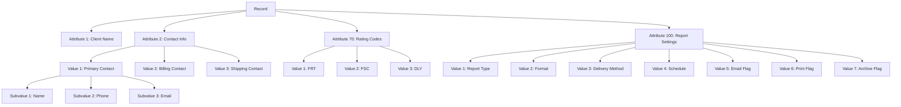
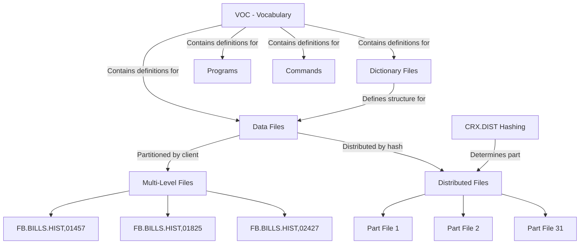
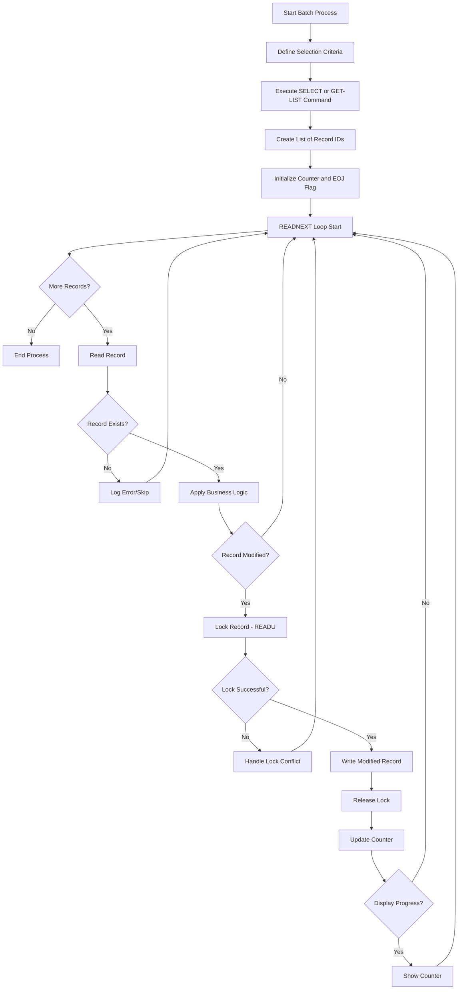
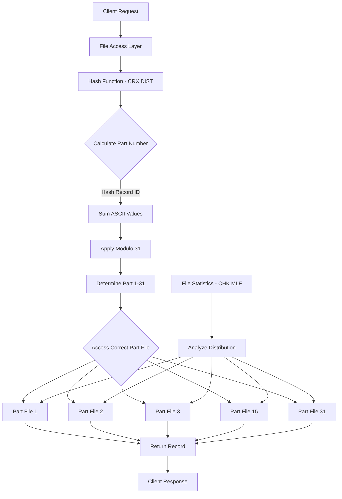

# MultiValue Database Platform in AFS Shreveport

## Introduction to MultiValue Database Platform

The MultiValue database architecture, used extensively in the AFS Shreveport system, represents a specialized approach to data management that diverges from traditional relational database models. Originating in the 1960s with Pick Systems (created by Dick Pick), MultiValue databases were designed to efficiently store and retrieve complex hierarchical data structures. Unlike relational databases that normalize data across multiple tables, MultiValue databases store related data together in a single record, making them particularly well-suited for business applications like freight logistics where complex relationships between entities need to be maintained.

The MultiValue architecture used in AFS Shreveport combines aspects of both hierarchical and network database models. It's characterized by its variable-length fields, multi-dimensional data structures, and built-in dictionary-driven data access methods. This architecture allows for efficient storage of sparse data (common in logistics operations where many fields may be empty for certain types of shipments) and provides powerful query capabilities through its integrated data manipulation language.

In the AFS Shreveport system, the MultiValue platform serves as the foundation for managing complex freight billing operations, supporting everything from client record management to sophisticated rate calculations and cross-reference maintenance. Its ability to handle hierarchical data structures makes it particularly effective for representing the nested relationships between clients, carriers, shipments, and billing entities that are central to freight logistics operations.

## Core Data Structure and Organization

The MultiValue database platform used in AFS Shreveport organizes data in a hierarchical structure that differs fundamentally from traditional relational databases. At its core, MultiValue employs a three-level hierarchy consisting of attributes, values, and subvalues, allowing for complex data representation within a single record.

Each record in a MultiValue database is identified by a unique ID and contains multiple attributes (similar to columns in relational databases, but more flexible). Each attribute can contain multiple values, and each value can contain multiple subvalues, creating a three-dimensional data structure. This hierarchical organization is particularly valuable for freight billing operations where complex, nested data relationships are common.

For example, in the AFS Shreveport system, a single client record might contain:
- Attribute 1: Client name (single value)
- Attribute 2: Contact information (multiple values for different contacts)
- Attribute 3: Shipping locations (multiple values, each with multiple subvalues for address components)
- Attribute 70: Rating codes (multiple values for different shipment types)
- Attribute 100: Report settings (multiple values for different report configurations)

This structure allows related data to be stored together in a single record, reducing the need for joins and improving retrieval performance. The code in `ANALYZE.FILE` demonstrates how the system analyzes these multi-dimensional structures by examining field lengths and occurrence counts across attributes, values, and subvalues.

Delimiters play a crucial role in separating these hierarchical levels:
- Attribute marks (CHAR(254)) separate attributes
- Value marks (CHAR(253)) separate values within an attribute
- Subvalue marks (CHAR(252)) separate subvalues within a value

This hierarchical structure provides exceptional flexibility for representing complex business data and allows the AFS Shreveport system to efficiently store and retrieve the multifaceted information required for freight billing operations.

## MultiValue Data Structure Hierarchy



The diagram above illustrates the hierarchical data structure used in the MultiValue database platform of AFS Shreveport. This three-level hierarchy allows for complex data relationships to be represented within a single record, which is particularly valuable for freight billing operations.

At the top level, we have the record itself, identified by a unique ID (such as a client ID or bill ID). Within the record, multiple attributes store different categories of information. For example, attribute 70 might store rating codes while attribute 100 might store report settings.

Each attribute can contain multiple values, separated by value marks (CHAR(253)). For instance, the contact information attribute might contain separate values for primary, billing, and shipping contacts. Similarly, the rating codes attribute might contain different codes like FRT (freight), FSC (fuel surcharge), and DLY (delivery).

At the deepest level, each value can contain multiple subvalues, separated by subvalue marks (CHAR(252)). For example, each contact value might include subvalues for name, phone number, and email address.

This structure is evident in code examples like `ANALYZE.FILE`, which processes records by examining each attribute, then each value within attributes, and potentially subvalues within values. The nested loops in this code (lines 33-45) directly reflect the hierarchical nature of the data structure:

```
FOR X = 1 TO DCOUNT(DFILE,CHAR(254))
   LINE = DFILE<X>
   FOR Y = 1 TO DCOUNT(LINE<1>,CHAR(253))
      DTA = LINE<1,Y>
      ...
   NEXT Y
NEXT X
```

This hierarchical approach provides exceptional flexibility for representing complex business data and allows the AFS Shreveport system to efficiently store and retrieve the multifaceted information required for freight logistics operations.

## File System Architecture

The MultiValue platform in AFS Shreveport implements a sophisticated file system architecture that differs significantly from traditional file systems. At its core are three key components: data files, dictionary files, and the VOC (vocabulary) system.

Data files store the actual records containing business information. Each data file consists of records identified by unique IDs, with each record containing multiple attributes organized in the hierarchical structure described earlier. In AFS Shreveport, these files store critical information like client records (`CLIENTS`), carrier information (`CARRIERS`), freight bills (`FB.BILLS`), and cross-references (`FB.BILLS.CRX`).

Dictionary files define the structure and access methods for their corresponding data files. Each dictionary file contains metadata records that describe attributes in the data file, including:
- Attribute names and descriptions
- Data types and conversion codes
- Display formats
- Calculation formulas
- Validation rules

The VOC (vocabulary) serves as the central repository and master directory for the entire system. It contains entries for all files, programs, and system commands. For data files, the VOC entry includes:
- File type (data, dictionary, etc.)
- Physical location information
- For multi-level files, pointers to client-specific segments

The VOC is critical for system operation, as evidenced by maintenance scripts like `CLEAN.VOC` and `CLEAN.VOC2` that carefully manage VOC entries to maintain system integrity.

A distinctive feature of the MultiValue architecture is its support for multi-level files, which partition data by client. For example, `FB.BILLS.HIST,01457` refers to the historical freight bills for client 01457. This approach provides natural data segregation and improves performance by reducing the size of individual file segments.

The system also supports distributed files through mechanisms like the `CRX.DIST` subroutine, which implements a hashing algorithm to distribute records across multiple part files for improved performance and scalability.

Access to data is mediated through the dictionary definitions, which provide a layer of abstraction between programs and the physical data structure. This dictionary-driven approach allows for changes to the physical data structure without necessarily requiring changes to application code.

## MultiValue File System Organization



The diagram illustrates the organization of the MultiValue file system used in AFS Shreveport. At the center is the VOC (Vocabulary), which serves as the master directory for the entire system, containing definitions for all files, programs, and commands.

Dictionary files define the structure and access methods for data files, acting as metadata repositories that describe how data should be interpreted, displayed, and validated. Each data file typically has a corresponding dictionary file that defines its attributes.

Data files in the system are organized in two primary ways:

1. **Multi-Level Files**: These files are partitioned by client ID, creating separate segments for each client. For example, `FB.BILLS.HIST` is split into client-specific segments like `FB.BILLS.HIST,01457`, `FB.BILLS.HIST,01825`, and `FB.BILLS.HIST,02427`. This approach provides natural data segregation and improves performance by limiting the size of individual file segments.

2. **Distributed Files**: For large files that aren't naturally segmented by client, the system uses distributed storage with hashing algorithms. The `CRX.DIST` subroutine implements a character-by-character hashing algorithm that determines which part file (1 through 31) a record should be stored in. This distribution helps balance storage and access across multiple physical files.

The VOC maintains references to these file structures, allowing the system to locate the correct file segment when a program needs to access data. Scripts like `CLEAN.VOC` and `FIX.VOC` maintain these references to ensure system integrity.

This architecture provides several advantages for the freight logistics operations of AFS Shreveport:
- Natural partitioning of data by client
- Improved performance through smaller file segments
- Balanced storage distribution for large files
- Centralized directory system for file location

The file system architecture forms the foundation for efficient data storage and retrieval in the AFS Shreveport system, supporting the complex operations required for freight billing and logistics management.

## Query and Data Manipulation

The MultiValue database platform in AFS Shreveport provides a powerful and flexible query language that enables efficient data retrieval and manipulation. This query language combines elements of SQL with MultiValue-specific constructs designed to work with its hierarchical data structure.

At the core of the query system is the SELECT statement, which identifies records meeting specified criteria. The syntax is straightforward yet powerful:

```
SELECT filename WITH field = value AND WITH field2 # value2
```

Variations include SSELECT (for sorted output) and QSELECT (for quick selection without sorting). These commands create a "select list" of record IDs that can be processed sequentially using READNEXT loops:

```
EXECUTE "SELECT CLIENTS WITH 30 = 'A'"
LOOP
   READNEXT ID ELSE EOJ = 1
UNTIL EOJ DO
   READ CLIENT.REC FROM F.CLIENTS, ID THEN
      ...process record...
   END
REPEAT
```

This pattern appears consistently throughout the AFS Shreveport codebase, as seen in scripts like `CLEAN.CLIENT` and `UPD.CARRIER`.

For more complex queries, the system supports pattern matching with operators like MATCHES (for regular expressions) and LIKE (for wildcard matching). The code also frequently uses the LOCATE function to find values within multi-valued fields:

```
LOCATE(ID,VDAT<7>,1;QQ;'AR') THEN
   ...value found at position QQ...
END
```

The 'AR' option specifies an ascending right-justified search, which is particularly useful for numeric IDs.

Data manipulation is handled through a variety of commands:
- READ/WRITE for basic record operations
- MATREAD/MATWRITE for working with dimensioned arrays
- READV/WRITEV for accessing specific attributes
- DELETE for removing records
- INSERT/DELETE for modifying multi-valued fields

The system also supports T-conversions for efficient lookups without reading entire records:

```
RESULT=OCONV(BILL.ID,'T':FILENAME:';X;;0')
```

For bulk operations, the platform provides commands like CLEARFILE for emptying files and CREATE-FILE for creating new files with specific parameters.

The query and data manipulation capabilities of the MultiValue platform enable AFS Shreveport to efficiently process large volumes of freight billing data, perform complex lookups across multiple files, and maintain the intricate relationships between clients, carriers, and shipments that are essential to its operations.

## Record Processing and Batch Operations

The AFS Shreveport system relies heavily on batch processing to efficiently handle large volumes of freight billing data. These batch operations typically follow a consistent pattern: selecting records based on specific criteria, processing each record sequentially, and writing modified data back to the database.

Batch operations in the MultiValue environment begin with record selection, typically using SELECT, SSELECT, or GET-LIST commands to create a list of record IDs for processing:

```
EXECUTE "GET-LIST CHECK.FOLDER"
```

or

```
EXECUTE "SELECT CLIENTS"
```

Once a list is created, the system processes records sequentially using READNEXT loops:

```
LOOP
   READNEXT ID ELSE EOJ = 1
UNTIL EOJ DO
   READ RECORD FROM FILE, ID THEN
      ... process record ...
      WRITE RECORD ON FILE, ID
   END
REPEAT
```

This pattern appears consistently across the codebase in scripts like `CLEAN.CLIENT`, `UPD.CARRIER`, and `REMOVE.DUPS.FROM.VCZ`.

For data integrity during batch updates, the system employs record locking with READU to prevent concurrent modifications:

```
READU VDAT FROM FILE.VOC,'FB.BILLS.HIST' ELSE VDAT = ''
... modify record ...
WRITE VDAT ON FILE.VOC,'FB.BILLS.HIST'
```

The system also implements progress tracking for long-running batch operations, typically displaying counters at regular intervals:

```
CNT = CNT + 1
IF NOT(REM(CNT,100)) THEN
   CRT @(10,10):CNT
END
```

Specialized batch operations include:

1. **Data Migration**: Scripts like `MOVE.UPSDTL` transfer records between databases while preserving their structure.

2. **Record Cleanup**: Programs like `CLEAN.QUEUE` and `CLEAN.CLIENT` remove obsolete or duplicate data.

3. **Cross-Reference Maintenance**: Utilities like `UPD.FB.BILLS.CRX` update cross-reference files to maintain data relationships.

4. **Index Rebuilding**: Scripts like `BUILD.UPS.INDX` recreate index files for improved lookup performance.

5. **Field Updates**: Programs like `UPD.CARRIER` modify specific fields across multiple records.

The batch processing capabilities of the MultiValue platform enable AFS Shreveport to efficiently handle the large volumes of data involved in freight logistics operations, from updating carrier information to processing freight bills and maintaining cross-references between related entities.

## Batch Processing Workflow



The diagram illustrates the typical workflow for batch processing operations in the AFS Shreveport MultiValue database system. This pattern is consistently implemented across numerous maintenance and update scripts in the system.

The process begins by defining selection criteria and executing a SELECT or GET-LIST command to create a list of record IDs for processing. The system then initializes a counter and end-of-job (EOJ) flag before entering the main processing loop.

The READNEXT loop forms the core of the batch process, retrieving each record ID sequentially until the list is exhausted. For each ID, the system reads the corresponding record and verifies its existence. If the record exists, business logic is applied to determine what modifications are needed.

When a record requires modification, the system implements a lock-modify-write pattern:
1. Lock the record using READU to prevent concurrent modifications
2. Apply the necessary changes to the record
3. Write the modified record back to the database
4. Release the lock to allow other processes to access the record

Throughout the process, the system maintains a counter that tracks how many records have been processed. At regular intervals (typically every 100 records), the system displays progress information to provide feedback during long-running operations.

Error handling is integrated at multiple points in the workflow:
- For missing records, the system may log errors or simply skip to the next record
- For lock conflicts, the system may retry, notify the user of which process holds the lock, or skip the record
- For business logic failures, appropriate error handling is implemented based on the specific requirements

This batch processing workflow enables AFS Shreveport to efficiently handle large volumes of freight billing data, from updating carrier information to processing freight bills and maintaining cross-references between related entities. The consistent implementation of this pattern across the codebase provides reliability and predictability for system maintenance operations.

## Cross-Reference Management

Cross-reference management is a critical aspect of the AFS Shreveport system, enabling efficient navigation between related entities across the freight billing ecosystem. The MultiValue database platform implements sophisticated cross-reference mechanisms to maintain relationships between clients, carriers, bills, and various identifiers.

The system employs several types of cross-reference files:

1. **Bill Cross-References**: The `FB.BILLS.CRX` file maintains references to freight bills, allowing quick access to key billing information without loading complete bill records. The `UPD.FB.BILLS.CRX` subroutine demonstrates how these cross-references are maintained, with different formats for new records ('CN') versus overwrite records ('CO').

2. **Vendor/Customer Cross-References**: Files like `VEND.CUST.ZIPS` and `VEND.CUST.EDI.XREF` maintain relationships between vendors, customers, and their associated ZIP codes and EDI information. The `REMOVE.DUPS.FROM.VCZ` script shows how these cross-references are cleaned and maintained.

3. **PRO/BOL Cross-References**: The `PRO.BOL.XREF` file links PRO numbers (carrier tracking numbers) to BOL (Bill of Lading) numbers, as demonstrated in the `FIND.PRO.MATCH.PAY` subroutine.

4. **Client Cross-References**: The `GLOBAL.CLIENT.XREF` file maintains parent-child relationships between clients across different systems (Freight Payment, Truckload/Brokerage, Air Freight, and International).

5. **Carrier Cross-References**: The `CARRIER.NDX` file provides lookups from carrier names to IDs, as built by the `BUILD.CARRIER.XREF` script.

Cross-reference lookups are typically implemented using one of two approaches:

1. **Direct File Access**: Reading records directly from cross-reference files:
   ```
   READ PBX.REC FROM F.PBX, PBX.ID THEN
      ... process cross-reference ...
   END
   ```

2. **T-Conversions**: Using OCONV with T-conversions for efficient lookups without loading entire records:
   ```
   RESULT=OCONV(VC.ID,'T':VC.FNAME:';X;;':ATTR)
   ```

The system also implements specialized subroutines for cross-reference lookups, such as `FB.DIV.REG` for division/region lookups and `CLIENT.NAME.SUB` for client name retrieval.

Maintenance of cross-references is critical to system integrity. Scripts like `FIX.CHECK.PRO.XREF` repair broken cross-references, while `CLEAN.VOC` and `FIX.VOC` maintain the VOC entries that define cross-reference files.

The sophisticated cross-reference management in AFS Shreveport enables efficient navigation between related entities, supporting the complex relationships between clients, carriers, and shipments that are essential to freight logistics operations.

## Distributed Storage and Hashing

The AFS Shreveport system implements a sophisticated distributed storage architecture to handle large volumes of data efficiently. This approach partitions data across multiple physical files using hashing algorithms, improving both storage efficiency and access performance.

At the core of this distributed storage system is the hashing mechanism exemplified by the `CRX.DIST` subroutine. This critical component determines which part file (from 1 to 31) a record should be stored in based on its ID. The subroutine implements a character-by-character hashing algorithm:

1. It converts each character of the record ID to its ASCII value using the SEQ function
2. It sums these values to create a hash code
3. It applies a modulo operation with the fixed number of parts (31)
4. It returns the resulting part number (1-31)

```
FOR KK = 1 TO NEW.LEN
    K.CHAR = NEW.STR[KK,1]
    CNTY += SEQ(K.CHAR)
NEXT KK

PART.NO = MOD(CNTY,N.PARTS)
PART.NO = INT(PART.NO)
PART.NO += 1
```

This hashing approach ensures a relatively even distribution of records across part files, preventing any single file from becoming disproportionately large. The code contains strong warnings about not modifying the distribution algorithm or the number of parts, as doing so could orphan records or entire part files.

The distributed storage architecture is particularly important for large cross-reference files like `FB.BILLS.CRX.DF`, which contains references to all freight bills in the system. By distributing these records across 31 part files, the system improves both storage efficiency and access performance.

The `CHK.MLF` utility provides insights into how the system analyzes and maintains these distributed files. It examines file structure, size, and record information, collecting metrics such as record counts, byte sizes, and group statistics for both dictionary and data sections.

The MultiValue platform's support for distributed storage enables AFS Shreveport to efficiently manage the large volumes of data involved in freight logistics operations, providing scalability and performance for critical system components.

## Distributed Storage Architecture



The diagram illustrates the distributed storage architecture implemented in the AFS Shreveport MultiValue database system. This architecture distributes records across multiple part files using a hashing algorithm, improving both storage efficiency and access performance.

When a client application requests a record, the file access layer determines which part file contains the record by using the `CRX.DIST` hashing function. This function:

1. Takes the record ID as input
2. Converts each character to its ASCII value using the SEQ function
3. Sums these values to create a hash code
4. Applies a modulo operation with the fixed number of parts (31)
5. Returns the resulting part number (1-31)

```
FOR KK = 1 TO NEW.LEN
    K.CHAR = NEW.STR[KK,1]
    CNTY += SEQ(K.CHAR)
NEXT KK

PART.NO = MOD(CNTY,N.PARTS)
PART.NO = INT(PART.NO)
PART.NO += 1
```

Once the part number is determined, the system accesses the correct part file to retrieve or store the record. This approach ensures a relatively even distribution of records across the 31 part files, preventing any single file from becoming disproportionately large.

The system includes utilities like `CHK.MLF` to analyze the distribution and performance of these part files. This utility examines file structure, size, and record information, collecting metrics such as:
- Record counts per part file
- Byte sizes and storage utilization
- Average/minimum/maximum bytes per record
- Group statistics and inode information

The distributed storage architecture is particularly important for large cross-reference files like `FB.BILLS.CRX.DF`, which contains references to all freight bills in the system. By distributing these records across 31 part files, the system improves both storage efficiency and access performance.

This architecture enables AFS Shreveport to efficiently manage the large volumes of data involved in freight logistics operations, providing scalability and performance for critical system components. The consistent hashing algorithm ensures that records are always found in the same part file, while the distribution across multiple files prevents any single file from becoming a performance bottleneck.

## Integration with External Systems

The MultiValue database platform in AFS Shreveport implements robust integration mechanisms to connect with external systems, enabling data exchange with clients, carriers, and third-party services. These integration capabilities are essential for the system's role in coordinating freight logistics operations across multiple stakeholders.

Several key integration approaches are evident in the codebase:

1. **EDI (Electronic Data Interchange)**: The system processes EDI transactions through files like `EDI.BILLS`, `EDI.BILLS.HIST`, and `EDI.REMITTANCE`. Scripts like `CHECK.FEDEX.GROUND` query these files to validate EDI data. The `VEND.CUST.EDI.XREF` file maintains cross-references between vendors/customers and their EDI information.

2. **API Integration**: The system connects with external APIs for real-time data exchange. The `UPS.PROC.DT` subroutine demonstrates integration with UPS systems to retrieve processing dates for shipments. Other integrations include RateWare and TEMPO for rating calculations, as referenced in the `RATER.V2` programs.

3. **File Exports and Imports**: The system generates and processes various file formats for data exchange:
   - CSV files for tabular data exchange
   - XML for structured data interchange
   - JSON for web service integration
   - Delimited files for batch processing

4. **Web Services**: The system implements both SOAP and REST integration patterns. The `INET.CLIENT.LIST` program demonstrates how data is formatted for web interfaces, with metadata specifications and structured output formats.

5. **Database Connectivity**: ODBC integration enables connections with SQL databases and other systems. Scripts reference SQL procedures, updates, and synchronization operations.

6. **Financial System Integration**: The system processes ACH files and implements bank integration for payment processing, as indicated by references to NACHA format and payment reconciliation.

7. **Carrier-Specific Integration**: Specialized integrations exist for major carriers:
   - UPS integration for tracking and rating
   - FedEx Ground for shipment processing
   - Various LTL carriers through rating engines

8. **ERP Integration**: The system connects with enterprise resource planning systems for comprehensive business process integration.

The integration architecture employs several techniques to ensure reliable data exchange:

1. **Data Transformation**: Converting between internal MultiValue formats and external formats
2. **Error Handling**: Detecting and managing integration failures
3. **Logging**: Tracking integration activities for auditing and troubleshooting
4. **Security**: Managing credentials and access control for external systems

These integration capabilities enable AFS Shreveport to function as a central hub for freight logistics operations, coordinating data exchange between clients, carriers, and financial systems while maintaining the integrity of its internal data structures.

## Performance Optimization and Maintenance

The MultiValue database platform in AFS Shreveport implements comprehensive performance optimization and maintenance routines to ensure system reliability and efficiency. These routines address various aspects of database health, from index management to file structure optimization.

Index management is a critical aspect of performance optimization. The system maintains various indexes to accelerate data retrieval:
- `BUILD.CARRIER.XREF` creates an index for carrier lookups by name
- `BUILD.UPS.INDX` builds an index for the UPSDATA file
- `INDEX.REBUILD` routines restore indexes after data modifications

File analysis utilities provide insights into database structure and performance:
- `ANALYZE.FILE` examines field lengths and occurrence counts across records
- `CHK.MLF` generates detailed statistics about file structure, size, and record information
- `FB.SPEC.GB` and `FB.SPEC.GB.MAIN` collect comprehensive file statistics

The system implements several maintenance routines to ensure data integrity:
- `CLEAN.CLIENT` removes client records from processing tables
- `CLEAN.QUEUE` processes records in the CLEAN.UP file
- `CLEAN.VOC` and `CLEAN.VOC2` maintain the integrity of the VOC file
- `REMOVE.DUPS.FROM.VCZ` eliminates duplicate vendor/customer pointers

File resizing and rebuilding operations optimize storage utilization:
- `FILE.REBUILD` recreates file structures with optimal parameters
- `FILE.RESIZING` adjusts file sizes based on usage patterns
- Distributed storage management through `CRX.DIST` ensures balanced record distribution

Cross-reference maintenance ensures efficient navigation between related entities:
- `FIX.CHECK.PRO.XREF` repairs broken cross-references
- `UPD.FB.BILLS.CRX` maintains bill cross-references
- `FIX.VOC` adds missing folder IDs to VOC entries

Database repair utilities address various issues:
- `FIX.CLIENT` handles client record issues
- `ZIP.FIX` corrects missing country codes in ZIP records
- `ADD.COUNTRY.CODE.TO.ZIP` updates Mexican zip codes

Performance monitoring tools track system health:
- Response time measurement for critical operations
- Database metrics collection for trend analysis
- Storage analysis to identify growth patterns

These performance optimization and maintenance routines are essential for ensuring the reliability and efficiency of the AFS Shreveport system, enabling it to handle the complex data processing requirements of freight logistics operations while maintaining responsive performance for users.

[Generated by the Sage AI expert workbench: 2025-05-28 08:06:26  https://sage-tech.ai/workbench]: #