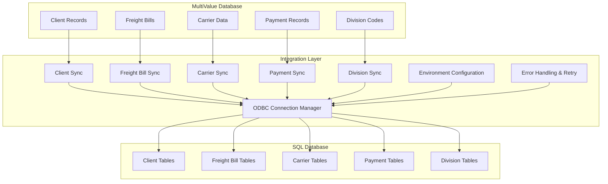
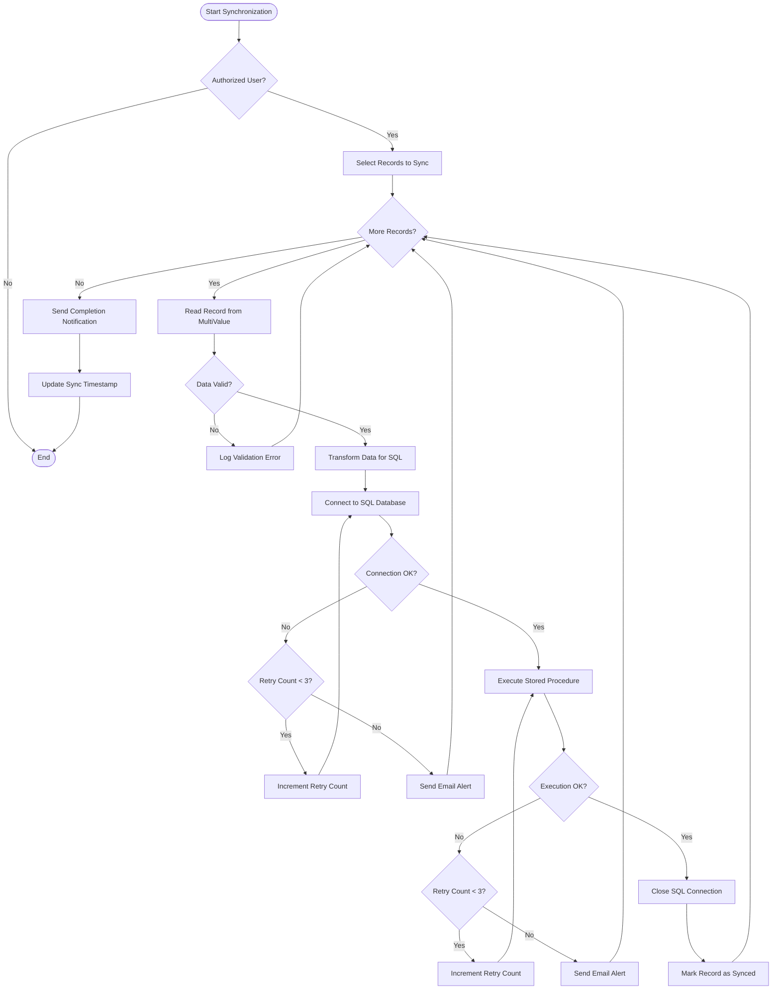
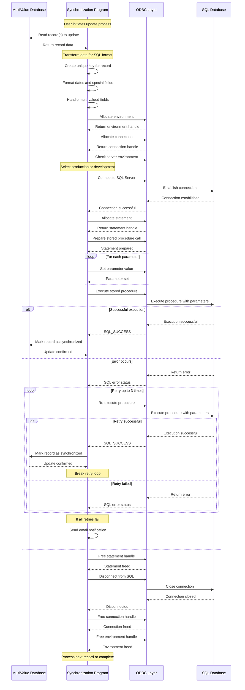

# SQL Database Integration in AFS Shreveport

## Overview of SQL Database Integration in AFS Shreveport

The AFS Shreveport system employs a sophisticated integration architecture that connects its core MultiValue database with SQL databases to support reporting, analytics, and external system integration. This integration serves multiple critical purposes within the overall architecture: it enables modern reporting tools like QlikView to access freight billing data, facilitates integration with third-party systems including ERP platforms like SAGE, provides a standardized interface for web applications, and supports data warehousing for business intelligence.

The integration layer consists of a collection of specialized programs and subroutines that handle data synchronization between the MultiValue environment and SQL databases. These components manage the extraction, transformation, and loading of data, handling the complex mapping between MultiValue's hierarchical data structures and SQL's relational model. The system supports both real-time updates for critical operational data and batch processing for historical information.

Key aspects of this integration include ODBC connection management with environment-specific configurations, stored procedure execution for data operations, comprehensive error handling with retry logic, and specialized synchronization routines for different data entities (clients, divisions, freight bills, payments, etc.). The architecture demonstrates a pragmatic approach to system integration, leveraging the strengths of both database paradigms while maintaining data consistency across platforms.

## SQL Integration Architecture



The architecture diagram illustrates the three-tier structure of the SQL integration system in AFS Shreveport. At the foundation is the MultiValue database containing the core operational data including client records, freight bills, carrier information, payment records, and division codes. This data serves as the authoritative source for the system.

The middle tier consists of the integration layer, which is responsible for synchronizing data between the MultiValue and SQL environments. This layer includes specialized components for each data domain (clients, freight bills, etc.), an ODBC connection manager that handles database connectivity, an error handling system with retry logic, and environment configuration that determines whether to connect to production or development SQL servers.

The top tier is the SQL database environment, which provides a relational representation of the freight billing data. This environment supports reporting tools, web interfaces, and integration with external systems that require SQL access. The SQL database is organized into domain-specific tables that mirror the structure of the MultiValue data but in a relational format.

Data typically flows from the MultiValue database through the integration layer to the SQL database, with the integration layer handling the complex transformation between the hierarchical MultiValue data model and the relational SQL model. The system employs stored procedures in the SQL database to ensure consistent data manipulation and to optimize performance for complex operations.

## ODBC Connection Management

The AFS Shreveport system implements a sophisticated ODBC connection management framework to establish and maintain reliable connections between the MultiValue environment and SQL databases. This framework is critical for ensuring efficient data synchronization while managing system resources appropriately.

Connection establishment follows a consistent pattern across the system. The code typically includes the ODBC.H header file which provides necessary definitions for ODBC functions. A dedicated SETUP.SQL subroutine allocates ODBC environments, connection handles, and statement handles. The system uses SQLAllocEnv, SQLAllocConnect, and SQLAllocStmt functions in sequence to properly initialize the ODBC infrastructure.

Connection pooling is implicitly managed through careful resource allocation and deallocation. Each synchronization routine establishes connections when needed and explicitly releases them when operations complete, preventing connection leaks. The system does not implement explicit connection pooling at the application level, instead relying on the ODBC driver's built-in pooling capabilities.

Environment setup is handled through a server detection mechanism that determines whether to connect to production or development SQL servers. This logic typically examines the server name (checking if it matches "AFS") and selects the appropriate connection string and credentials. For production environments, the system connects to "PRODODS" or "PRODQV" data sources, while development environments use "DEVODS" or "DEVQV" sources.

Server selection logic is consistently implemented across synchronization routines. For example, in UPD.SQL.FBHIST.SUB:

```
IF SERVER.NAME = 'AFS' THEN
   SQL.SERVER = 'PRODODS'
   SQL.UID = 'afsuser'
   SQL.PWD = 'afsuser'
ELSE
   SQL.SERVER = 'DEVODS'
   SQL.UID = 'afsuser'
   SQL.PWD = 'afsuser'
END
```

This approach ensures that data is synchronized to the appropriate environment without requiring code changes when moving between development and production.

The system also implements connection validation through error checking routines like CKCONENV and CKSTMTENV, which verify successful connection establishment and statement preparation. These routines capture detailed error information when connections fail, enabling effective troubleshooting.

Overall, the ODBC connection management in AFS Shreveport demonstrates a well-structured approach that balances reliability, security, and performance considerations while supporting the system's complex data synchronization requirements.

## Stored Procedure Implementation

AFS Shreveport employs a comprehensive stored procedure strategy for SQL database operations, providing a secure and efficient interface between the MultiValue environment and SQL databases. Rather than constructing and executing dynamic SQL statements directly, the system consistently uses stored procedures for all data operations including insertions, updates, deletions, and complex queries.

The system implements stored procedure calls through a consistent pattern across different synchronization routines. First, it prepares SQL statements using SQLPrepare with parameter markers for input values. For example, in UPD.SQL.CLIENT.SUB:

```
SQL.STMT = "{ call PX_UpdClient(?,?,?,?,?,?,?,?,?,?,?,?,?,?,?,?,?,?,?,?,?,?,?,?,?,?,?,?,?,?,?,?,?,?,?,?,?,?,?,?,?,?,?,?,?,?,?,?,?,?,?,?,?,?,?,?,?,?,?,?,?,?,?) }"
SQLPREPARE(CLIENTENV, SQL.STMT)
```

Parameter binding is handled through SQLSetParam calls, which map MultiValue data to SQL parameters with appropriate data type conversions. The system handles various data types including strings, numbers, and dates, ensuring proper formatting for SQL compatibility. For example:

```
SQLSETPARAM(CLIENTENV, 1, SQL_PARAM_INPUT, SQL_VARCHAR, 5, 0, SQL.CLIENTNO, SQL.NULL.IND)
SQLSETPARAM(CLIENTENV, 2, SQL_PARAM_INPUT, SQL_VARCHAR, 40, 0, SQL.NAME, SQL.NULL.IND)
```

For complex data structures, the system often constructs composite keys by concatenating multiple fields to ensure unique identification across systems. For instance, freight bill records use a unique key combining client ID, carrier ID, PRO number, and process date:

```
SQL.UNIQUEKEY = CLIENT.ID : "*" : CARRIER.ID : "*" : PRO.NUM : "*" : OCONV(PROC.DATE, "D4/")
```

Execution patterns follow a consistent approach across the codebase. After preparing statements and binding parameters, the system executes stored procedures using SQLExecute and handles any resulting errors through dedicated error checking routines. Most stored procedures are designed to be idempotent, allowing safe re-execution if errors occur.

The stored procedures themselves follow naming conventions that indicate their purpose, such as:
- PX_UpdClient - Updates client information
- PX_UpdDivision - Updates division records
- PX_UpdShipment - Updates shipment details
- PX_DelClient - Deletes client records
- PX_UpdPayment - Updates payment information

This stored procedure implementation provides several advantages, including:
1. Improved security by preventing SQL injection vulnerabilities
2. Better performance through precompiled execution plans
3. Reduced network traffic by minimizing data transfer
4. Consistent data manipulation logic across different integration points
5. Simplified maintenance as database schema changes can be isolated to stored procedures

The system demonstrates a mature approach to database integration that leverages SQL Server's strengths while maintaining the integrity and performance of the overall application architecture.

## Data Synchronization Flow



The data synchronization flow between the MultiValue database and SQL databases in AFS Shreveport follows a well-defined process with multiple validation steps and error handling mechanisms.

The process begins with an authorization check that restricts synchronization operations to specific authorized users. This security measure prevents unauthorized data modifications and ensures that only appropriate personnel can trigger synchronization processes. Once authorization is confirmed, the system selects records for synchronization based on various criteria such as date ranges, client IDs, or specific record identifiers.

For each record to be synchronized, the system reads the complete record from the MultiValue database, including any related records needed for the synchronization (such as client records for freight bills). The data then undergoes validation to ensure it meets the requirements for SQL insertion. This validation includes checking for required fields, proper data formats, and business rule compliance.

If the data passes validation, it undergoes transformation to map from the MultiValue hierarchical structure to the relational SQL format. This transformation includes:

1. Field mapping between MultiValue attributes and SQL columns
2. Data type conversions (e.g., MultiValue dates to SQL datetime format)
3. Creation of composite keys for unique record identification
4. Special handling for multi-valued fields that must be normalized for SQL

After transformation, the system establishes an ODBC connection to the appropriate SQL server (production or development) based on the current environment. If the connection fails, the system implements retry logic, attempting to reconnect up to three times before sending an email alert to the support team.

With a successful connection established, the system executes the appropriate stored procedure with the transformed data as parameters. Again, if execution fails, retry logic is applied with up to three attempts before alerting support personnel.

Upon successful execution, the system closes the SQL connection to free resources and marks the record as synchronized in the MultiValue database, typically by updating a timestamp field or setting a flag. This marking prevents unnecessary re-synchronization of unchanged records in future runs.

The process continues until all selected records have been processed. Upon completion, the system sends a notification email to relevant stakeholders and updates a global synchronization timestamp in the CONTROL file to track when the last successful synchronization occurred.

This comprehensive flow ensures data consistency between systems while providing robust error handling and audit capabilities for troubleshooting and monitoring.

## Error Handling and Retry Logic

AFS Shreveport's SQL integration layer implements a sophisticated error handling and retry mechanism to ensure robust data synchronization between the MultiValue and SQL databases. This system is designed to handle various failure scenarios gracefully, from temporary network issues to more serious database errors.

The error handling architecture is built around dedicated error checking subroutines, primarily CKCONENV and CKSTMTENV, which examine the status of ODBC operations and capture detailed error information when failures occur. These routines extract SQL state codes, native error codes, and error messages, providing comprehensive diagnostic information for troubleshooting.

Retry logic is consistently implemented across synchronization routines with a standard pattern:

1. Initialize an error counter (typically named ERR.CNT) to zero
2. Attempt the SQL operation (connection, statement execution, etc.)
3. If an error occurs, increment the counter and check if it has reached a threshold (typically 3)
4. If below threshold, retry the operation
5. If threshold reached, send an email notification and log the error

This pattern is evident in code like:

```
ERR.CNT = 0
LOOP
   ERR.CNT += 1
   * Attempt SQL operation
   IF SQL.STATUS = SQL_SUCCESS OR SQL.STATUS = SQL_SUCCESS_WITH_INFO THEN EXIT
   IF ERR.CNT >= 3 THEN
      * Send email notification
      EXIT
   END
REPEAT
```

SQL state code processing is handled through the error checking routines, which capture the SQLSTATE value returned by ODBC functions. These codes follow the ANSI SQL standard and provide categorized error information. The system logs these codes along with native error codes specific to SQL Server, enabling precise identification of error conditions.

The notification system is email-based, sending alerts to a dedicated address (typically UPD.SQL.Group@afs.net) when persistent errors occur. These notifications include:
- The program or subroutine where the error occurred
- The SQL operation being attempted
- SQL state and native error codes
- Error messages from the database
- The data being processed when the error occurred

For example:

```
MVIN = ''
MVIN<1> = 'UPD.SQL.Group@afs.net'
MVIN<4> = 'AFS'
MVIN<5> = 'SQL ERROR in ' : PROGRAM : ' for ' : CLIENT.ID
MVIN<6> = 'SQL STATE: ' : SQL.STATE : ' NATIVE: ' : SQL.NATIVE : CHAR(13) : CHAR(10) : 'ERROR: ' : SQL.ERROR
MVIN<7> = 1
CALL SENDMAIL(MVIN, MVOUT)
```

This comprehensive error handling approach ensures that synchronization issues are promptly identified and addressed while allowing the system to recover automatically from transient errors. The combination of retry logic, detailed error information, and proactive notifications contributes significantly to the reliability of the SQL integration layer in AFS Shreveport.

## Environment-Specific Configuration

The AFS Shreveport system employs a sophisticated environment-specific configuration approach for SQL database connections, ensuring that data synchronization processes correctly target either production or development databases based on the execution context. This configuration strategy is critical for maintaining separation between environments while using the same codebase.

The primary mechanism for environment detection is server name checking. Throughout the codebase, synchronization routines determine the current server name and use it to select the appropriate connection parameters:

```
SERVER.NAME = SYSTEM(1017)
IF SERVER.NAME = 'AFS' THEN
   SQL.SERVER = 'PRODODS'
   SQL.UID = 'afsuser'
   SQL.PWD = 'afsuser'
ELSE
   SQL.SERVER = 'DEVODS'
   SQL.UID = 'afsuser'
   SQL.PWD = 'afsuser'
END
```

This pattern appears consistently across different synchronization modules, with 'AFS' identified as the production server name. When running on this server, connections target production SQL databases; otherwise, they default to development environments.

The system uses different data source names (DSNs) for different purposes:
- PRODODS/DEVODS - For operational data synchronization
- PRODQV/DEVQV - For QlikView reporting data

These DSNs are configured in the ODBC settings on the respective servers and point to the appropriate SQL Server instances. The use of DSNs abstracts the actual connection details, allowing for changes to the underlying database configuration without modifying code.

Connection credentials are typically hardcoded in the synchronization routines rather than stored in a central configuration repository. While this approach has simplicity advantages, it does create maintenance challenges when credentials need to be updated. Most routines use a standard set of credentials ('afsuser'/'afsuser'), suggesting a service account approach rather than individual user authentication.

Some synchronization modules include additional environment-specific logic beyond just connection targeting. For example, certain processes may have different behavior in development environments, such as more verbose logging or relaxed validation rules to facilitate testing.

The system also includes specialized development-only synchronization routines (like UPD.DEVSQL.FBHIST.SUB) that are designed specifically for development environment synchronization, allowing for targeted testing of SQL integration without affecting production data.

This environment-specific configuration approach ensures that data synchronization processes maintain proper separation between production and development environments while sharing a common codebase, supporting both operational reliability and efficient development workflows.

## SQL Update Process



The SQL update process in AFS Shreveport follows a detailed sequence of steps to ensure reliable data synchronization between the MultiValue database and SQL Server. This sequence diagram illustrates the complete flow from initial record selection to successful update or error handling.

The process begins when a user or scheduled task initiates a synchronization program. The program first reads the relevant records from the MultiValue database, which could be client information, freight bills, payment data, or other entities depending on the specific synchronization task.

Once the data is retrieved, the synchronization program performs necessary transformations to prepare it for SQL insertion:
1. Creating unique keys by concatenating multiple fields (e.g., client ID, carrier ID, PRO number, and date)
2. Converting dates from MultiValue format to SQL-compatible format
3. Handling multi-valued fields through normalization or concatenation
4. Applying business rules and data validations

The program then initiates the ODBC connection process by allocating an environment handle, connection handle, and determining the appropriate SQL server (production or development) based on the current environment. It establishes a connection to the selected SQL server using predefined credentials.

With the connection established, the program allocates a statement handle and prepares a stored procedure call with parameter markers. For each parameter in the stored procedure, it sets the appropriate value from the transformed data, handling data type conversions as needed.

The program then executes the stored procedure. If execution is successful, it marks the record as synchronized in the MultiValue database, typically by updating a timestamp or flag field. This marking prevents unnecessary re-synchronization of unchanged records in future runs.

If an error occurs during execution, the program implements retry logic, attempting to re-execute the stored procedure up to three times. If all retries fail, it sends an email notification to the support team with detailed error information.

After completing the update process (whether successful or failed), the program properly releases all allocated resources by freeing the statement handle, disconnecting from the SQL server, and freeing the connection and environment handles. This resource management is crucial for preventing memory leaks and connection pool exhaustion.

The process then continues with the next record if more are available for synchronization, or completes the synchronization task and potentially sends a completion notification.

This structured approach to SQL updates ensures data integrity, provides robust error handling, and maintains efficient resource utilization throughout the synchronization process.

## Data Transformation Techniques

AFS Shreveport employs sophisticated data transformation techniques to bridge the gap between the hierarchical MultiValue data model and the relational SQL database structure. These techniques address the fundamental differences between these database paradigms while preserving data integrity and semantic meaning.

Field mapping is the foundation of the transformation process. Each synchronization routine contains explicit mappings between MultiValue record attributes and SQL table columns. For example, in client record synchronization:

```
SQL.CLIENTNO = CLIENT.ID
SQL.NAME = CLIENT.REC<2>
SQL.ADDR1 = CLIENT.REC<3>
SQL.ADDR2 = CLIENT.REC<4>
SQL.CITY = CLIENT.REC<5>
```

These mappings are maintained consistently across the codebase, ensuring that data is correctly placed in the SQL schema.

Data type conversion is handled systematically throughout the synchronization routines. The system converts:

1. **Dates**: MultiValue dates (stored as integers) are converted to SQL-compatible formats using OCONV functions:
   ```
   SQL.PROC.DATE = OCONV(BILL.REC<37>, "D4/")
   ```

2. **Numeric values**: Ensuring proper decimal handling and NULL representation:
   ```
   IF NUM.VAL = "" THEN
      SQL.NUM.VAL = "0"
   END ELSE
      SQL.NUM.VAL = NUM.VAL
   END
   ```

3. **Boolean flags**: Converting MultiValue flags (often "Y"/"N" or "1"/"0") to SQL bit values:
   ```
   IF FLAG = "Y" THEN
      SQL.FLAG = "1"
   END ELSE
      SQL.FLAG = "0"
   END
   ```

4. **Text fields**: Handling character escaping and length limitations:
   ```
   SQL.NOTES = FIELD(NOTES, @VM, 1)[1,255]
   ```

MultiValue's multi-valued fields present a particular challenge for SQL integration. The system employs several strategies to handle these:

1. **Normalization**: Creating separate related records in child tables:
   ```
   FOR I = 1 TO DCOUNT(EXPENSE.CODES, @VM)
      SQL.EXPENSE.CODE = EXPENSE.CODES<1,I>
      * Create separate SQL record for each expense code
   NEXT I
   ```

2. **Concatenation**: Combining values with delimiters for storage in a single SQL field:
   ```
   SQL.EXPENSE.CODES = CHANGE(EXPENSE.CODES, @VM, "|")
   ```

3. **Selective extraction**: Taking only specific values from multi-valued fields:
   ```
   SQL.PRIMARY.CONTACT = CONTACT.NAMES<1,1>
   ```

The system also handles complex hierarchical relationships through composite keys and foreign key references. For freight bills, a unique key is constructed from multiple components:

```
SQL.UNIQUEKEY = CLIENT.ID : "*" : CARRIER.ID : "*" : PRO.NUM : "*" : OCONV(PROC.DATE, "D4/")
```

This key serves as a reliable identifier across systems and maintains referential integrity between related tables.

Special transformation logic is implemented for specific business requirements. For example, the system calculates estimated fuel surcharges for truckload shipments when not explicitly provided:

```
IF BILL.REC<3> = "TL" AND FSC.AMT = "" THEN
   FSC.PCT = 0.15  * Default percentage
   FSC.AMT = ROUND(LH.CHARGE * FSC.PCT, 2)
END
```

These comprehensive transformation techniques ensure that data maintains its semantic integrity while moving between the MultiValue and SQL environments, supporting both operational and analytical requirements of the AFS Shreveport system.

## Batch Processing and Performance Optimization

AFS Shreveport implements sophisticated batch processing and performance optimization strategies to efficiently synchronize large volumes of data between MultiValue and SQL databases. These strategies balance system resource utilization with synchronization throughput, ensuring reliable data transfer without overwhelming either system.

Progress tracking is implemented across batch synchronization routines using multiple techniques:

1. **Visual progress bars** that display completion percentages:
   ```
   CALL PROG.BAR(7, CURRENT.COUNT, TOTAL.COUNT, 1)
   ```

2. **Numerical indicators** showing processed records and percentages:
   ```
   CRT BILL.CNT'R#4':' - ':BILL.PCT'R26#6':'% ':TIMEDATE():' ':BILL.ID
   ```

3. **Timestamped logging** that records start and completion times:
   ```
   CRT TIMEDATE():' started.'
   * Processing logic
   CRT TIMEDATE():' completed.'
   ```

These tracking mechanisms provide operators with visibility into synchronization progress, especially important for long-running processes.

Throttling mechanisms prevent system overload during intensive batch operations. The most common approach is periodic sleep intervals inserted into processing loops:

```
IF MOD(BILL.CNT, 500) = 0 THEN
   CRT @(0,22):'Sleeping...zzz...zzz...'
   EXECUTE 'SLEEP 15'
   CRT @(0,22):@(-3):
END
```

These pauses allow other system processes to access resources, preventing the synchronization from monopolizing CPU, memory, or database connections.

Resource management is carefully implemented through proper allocation and deallocation of ODBC resources. Each synchronization routine follows a consistent pattern:

1. Allocate environment, connection, and statement handles
2. Perform database operations
3. Free statement handles
4. Disconnect from database
5. Free connection and environment handles

This disciplined approach prevents resource leaks that could degrade system performance over time.

Batch size optimization is evident in several synchronization routines. Rather than processing all records in a single transaction, the system typically:

1. Selects a manageable subset of records (often based on date ranges or client IDs)
2. Processes each record individually with its own connection cycle
3. Commits changes after each record or small group of records

This approach trades some connection overhead for improved reliability and reduced lock contention.

Performance monitoring is supported through the PROGTRACK utility, which records execution statistics for batch processes:

```
CALL PROGTRACK("START", PROGRAM, "")
* Processing logic
CALL PROGTRACK("END", PROGRAM, "")
```

These statistics help identify performance trends and optimization opportunities.

The system also implements selective synchronization through flags that control which aspects of data are updated:

```
UPD.SHIP = 1   * Update shipment details
UPD.CINV = 1   * Update carrier invoice
UPD.CIDTL = 1  * Update carrier invoice details
UPD.EXPC = 1   * Update expense codes
UPD.STOP = 1   * Update stops
UPD.PYMT = 1   * Update payment information
```

This selective approach allows for targeted updates that minimize unnecessary database operations.

Together, these batch processing and performance optimization strategies enable AFS Shreveport to efficiently synchronize large volumes of freight billing data while maintaining system responsiveness and resource availability.

## SQL Integration Components

```mermaid
graph TB
    subgraph "Core Components"
        ODBC_H["ODBC.H (Header File)"]
        SETUP_SQL["SETUP.SQL (Connection Setup)"]
        ERROR_CHECK["Error Checking Routines"]
    end
    
    subgraph "Client Data Synchronization"
        UPD_SQL_CLIENT["UPD.SQL.CLIENT.SUB"]
        UPD_SQL_DIV["UPD.SQL.DIV.SUB"]
        UPD_SQL_VC["UPD.SQL.VC.SUB"]
        UPD_SQL_CLIENT_PX["UPD.SQL.CLIENT.PX"]
    end
    
    subgraph "Freight Bill Synchronization"
        UPD_SQL_FBHIST["UPD.SQL.FBHIST.SUB"]
        UPD_SQL_FBHIST_PX["UPD.SQL.FBHIST.PX"]
        UPD_SQL_FBDTL["UPD.SQL.FBDTL.SUB"]
        UPD_SQL_FBSTATUS["UPD.SQL.FBSTATUS.SUB"]
    end
    
    subgraph "Payment Synchronization"
        UPD_SQL_FBPYMT["UPD.SQL.FBPYMT.SUB"]
        UPD_SQL_CHECK_DELETE["UPD.SQL.CHECK.DELETE"]
        UPD_SQL_CHECKS["UPD.SQL.CHECKS"]
    end
    
    subgraph "Carrier & Reference Data"
        UPD_SQL_TARIFF["UPD.SQL.TARIFF.SUB"]
        UPD_SQL_FUEL["UPD.SQL.FUEL.SUB"]
        UPD_SQL_MILEAGE["UPD.SQL.MILEAGE.SUB"]
        UPD_SQL_SLSREP["UPD.SQL.SLSREP.SUB"]
    end
    
    subgraph "Special Purpose Synchronization"
        UPD_SQL_EBILL["UPD.SQL.EBILL.SUB"]
        UPD_SQL_UPSHIST["UPD.SQL.UPSHIST.SUB"]
        UPD_SQL_FEDEX["UPD.SQL.FEDEX.EDI.SUB"]
        UPD_SQL_EDI_ACNT["UPD.SQL.EDI.ACNT.SUB"]
    end
    
    subgraph "Deletion Components"
        DEL_SQL_CLIENT["DEL.SQL.CLIENT.SUB"]
        DEL_SQL_DIV["DEL.SQL.DIV.SUB"]
        DEL_SQL_FBHIST["DEL.SQL.FBHIST.SUB"]
        DEL_SQL_VC["DEL.SQL.VC.SUB"]
    end
    
    ODBC_H --> UPD_SQL_CLIENT
    ODBC_H --> UPD_SQL_FBHIST
    ODBC_H --> UPD_SQL_FBPYMT
    ODBC_H --> DEL_SQL_CLIENT
    
    SETUP_SQL --> UPD_SQL_CLIENT
    SETUP_SQL --> UPD_SQL_FBHIST
    SETUP_SQL --> UPD_SQL_FBPYMT
    SETUP_SQL --> DEL_SQL_CLIENT
    
    ERROR_CHECK --> UPD_SQL_CLIENT
    ERROR_CHECK --> UPD_SQL_FBHIST
    ERROR_CHECK --> UPD_SQL_FBPYMT
    ERROR_CHECK --> DEL_SQL_CLIENT
    
    UPD_SQL_CLIENT_PX --> UPD_SQL_CLIENT
    UPD_SQL_CLIENT_PX --> UPD_SQL_DIV
    UPD_SQL_CLIENT_PX --> UPD_SQL_VC
    
    UPD_SQL_FBHIST_PX --> UPD_SQL_FBHIST
```



The SQL integration architecture in AFS Shreveport consists of a well-organized set of components that work together to synchronize data between the MultiValue and SQL database environments. These components can be categorized into several functional groups, each addressing specific synchronization needs.

The **Core Components** provide foundational functionality used across the integration layer:

- **ODBC.H**: A header file containing ODBC function definitions and constants
- **SETUP.SQL**: A utility routine that establishes database connections and allocates ODBC resources
- **Error Checking Routines**: CKCONENV and CKSTMTENV, which validate ODBC operations and capture error information

The **Client Data Synchronization** components manage client-related information:

- **UPD.SQL.CLIENT.SUB**: Updates client master records in SQL
- **UPD.SQL.DIV.SUB**: Synchronizes client division information
- **UPD.SQL.VC.SUB**: Updates vendor/customer relationships
- **UPD.SQL.CLIENT.PX**: Orchestrates client data synchronization across multiple entities

The **Freight Bill Synchronization** components handle the core freight billing data:

- **UPD.SQL.FBHIST.SUB**: Synchronizes freight bill history records
- **UPD.SQL.FBHIST.PX**: Manages the selection and processing of freight bills
- **UPD.SQL.FBDTL.SUB**: Updates freight bill detail records including accessorial charges
- **UPD.SQL.FBSTATUS.SUB**: Synchronizes freight bill status information

The **Payment Synchronization** components manage financial transactions:

- **UPD.SQL.FBPYMT.SUB**: Updates payment information for freight bills
- **UPD.SQL.CHECK.DELETE**: Removes payment records when checks are deleted
- **UPD.SQL.CHECKS**: Processes check records and updates payment information

The **Carrier & Reference Data** components handle supporting information:

- **UPD.SQL.TARIFF.SUB**: Synchronizes carrier tariff information
- **UPD.SQL.FUEL.SUB**: Updates fuel surcharge data
- **UPD.SQL.MILEAGE.SUB**: Synchronizes mileage information between locations
- **UPD.SQL.SLSREP.SUB**: Updates sales representative data

The **Special Purpose Synchronization** components address specific business needs:

- **UPD.SQL.EBILL.SUB**: Handles electronic bill synchronization
- **UPD.SQL.UPSHIST.SUB**: Updates UPS shipping history
- **UPD.SQL.FEDEX.EDI.SUB**: Processes FedEx EDI data
- **UPD.SQL.EDI.ACNT.SUB**: Synchronizes EDI account mappings

The **Deletion Components** manage the removal of records from SQL databases:

- **DEL.SQL.CLIENT.SUB**: Deletes client records
- **DEL.SQL.DIV.SUB**: Removes division records
- **DEL.SQL.FBHIST.SUB**: Deletes freight bill history
- **DEL.SQL.VC.SUB**: Removes vendor/customer relationships

These components interact through a consistent pattern where driver programs (typically with .PX extension) select records to be processed and call specialized subroutines (with .SUB extension) to perform the actual SQL operations. All components rely on the core ODBC infrastructure and error handling mechanisms, ensuring consistent behavior across the integration layer.

The modular design of these components allows for targeted updates to specific data domains while maintaining overall system integrity. Each component focuses on a specific data entity or business process, following consistent patterns for database connectivity, error handling, and data transformation.

## Security and Access Control

AFS Shreveport implements a multi-layered security and access control approach for SQL database operations, ensuring that data integrity is maintained and access is properly restricted. This approach encompasses user authorization, credential management, and secure data handling practices.

User authorization is implemented at the application level through explicit checks that restrict SQL synchronization operations to specific authorized users. These checks appear consistently across synchronization routines:

```
CALL GET.USER(USER)
BEGIN CASE
   CASE USER = 'MKERBOW'
   CASE USER = 'DAVID'
   CASE USER = 'GBINO'
   CASE USER = 'PBASS'
   CASE 1
      CRT "YOU ARE NOT AUTHORIZED TO USE THIS PROGRAM"
      STOP
END CASE
```

This pattern ensures that only designated personnel can initiate data synchronization processes, preventing unauthorized data modifications. Different programs may have different authorized user lists based on the sensitivity and impact of the operations they perform.

Credential management for SQL database access follows a consistent pattern across the codebase. Connection credentials are typically hardcoded in the synchronization routines:

```
IF SERVER.NAME = 'AFS' THEN
   SQL.SERVER = 'PRODODS'
   SQL.UID = 'afsuser'
   SQL.PWD = 'afsuser'
ELSE
   SQL.SERVER = 'DEVODS'
   SQL.UID = 'afsuser'
   SQL.PWD = 'afsuser'
END
```

While this approach has simplicity advantages, it does present security challenges as credentials are embedded in source code rather than stored in a secure credential store. The system appears to use service accounts with limited permissions rather than individual user credentials, following the principle of least privilege.

Database connection security is managed through ODBC data sources that are configured on the server, abstracting the actual connection details and allowing for changes to the underlying database configuration without modifying code. The system consistently uses SQLConnect with DSN, username, and password rather than direct connection strings, leveraging the security features of the ODBC infrastructure.

Data protection during transmission is handled implicitly through the ODBC driver and network configuration. The code does not implement explicit encryption for data in transit, relying instead on network-level security measures and the ODBC driver's capabilities.

Parameter binding for SQL operations provides protection against SQL injection attacks. The system consistently uses prepared statements with parameter markers rather than constructing dynamic SQL strings:

```
SQL.STMT = "{ call PX_UpdClient(?,?,?,?,?,?,?,?,?,?,?,?,?,?,?,?,?,?,?,?,?,?,?,?,?,?,?,?,?,?,?,?,?,?,?,?,?,?,?,?,?,?,?,?,?,?,?,?,?,?,?,?,?,?,?,?,?,?,?,?,?,?,?) }"
SQLPREPARE(CLIENTENV, SQL.STMT)
```

This approach ensures that user input and variable data cannot be interpreted as SQL commands, preventing a common attack vector.

Audit trails for SQL operations are maintained through several mechanisms:
1. Email notifications for failed operations that include the user, program, and error details
2. Timestamp fields in MultiValue records that track when SQL synchronization occurred
3. The PROGTRACK utility that logs program execution with user information

These audit capabilities help identify unauthorized access attempts and track changes to the database for compliance purposes.

Overall, the security and access control mechanisms in AFS Shreveport's SQL integration layer demonstrate a practical approach to protecting data while enabling necessary business operations. While some aspects of the implementation (such as hardcoded credentials) could be enhanced with more modern security practices, the fundamental principles of authorization, least privilege, and secure data handling are well represented.

[Generated by the Sage AI expert workbench: 2025-05-28 08:06:26  https://sage-tech.ai/workbench]: #