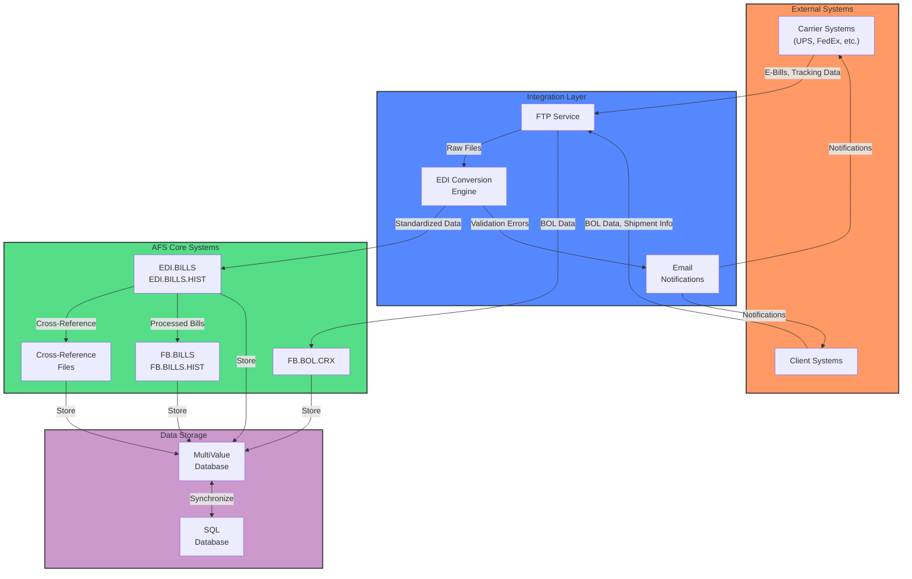
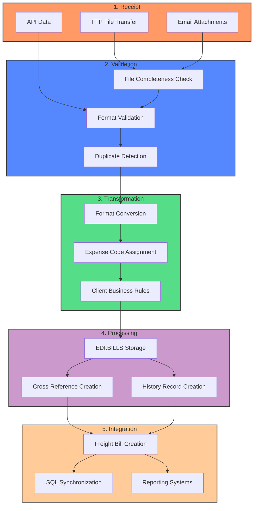
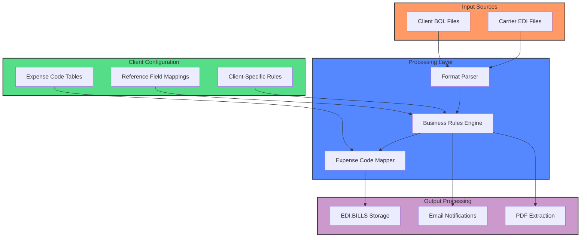
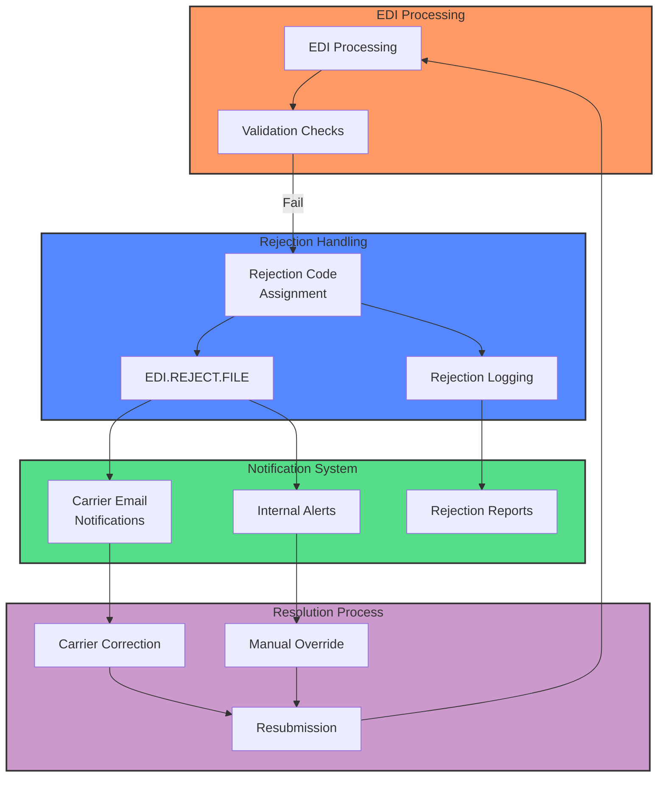
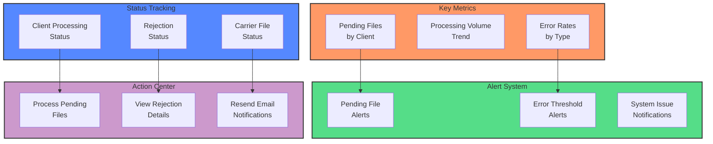

# EDI Data Exchange in AFS Shreveport

## EDI Data Exchange Overview

Electronic Data Interchange (EDI) forms the backbone of AFS Shreveport's freight billing operations, enabling automated exchange of critical business documents between AFS, its clients, and carriers. The system processes various EDI transaction types including freight bills, bills of lading (BOL), payment information, and carrier tracking data.

AFS Shreveport's EDI infrastructure handles multiple data formats, from traditional X12 EDI standards to CSV and XML files received via FTP. The system converts these diverse formats into standardized internal structures, applies client-specific business rules, and maintains comprehensive audit trails throughout the process.

The EDI exchange functionality spans several key areas:
- Carrier integration for electronic billing (particularly UPS, FedEx)
- Client-specific BOL imports via FTP
- Expense code mapping based on client business rules
- Cross-referencing between carrier accounts and client identifiers
- Validation and error handling with notification systems
- SQL database synchronization for cross-system consistency

This robust EDI framework enables AFS to process high volumes of freight billing data efficiently while maintaining data integrity and providing clients with customized processing based on their specific requirements.

## EDI System Architecture

The AFS Shreveport EDI architecture illustrates how electronic data flows between external systems and internal processing components. The system employs a multi-layered approach with specialized components handling different aspects of the EDI workflow.

At the integration layer, the FTP service manages file transfers from carriers and clients, while the EDI Conversion Engine transforms diverse file formats into standardized internal structures. Email notifications provide real-time alerts about processing status and errors.

The core systems include specialized databases for EDI bills, bills of lading, and cross-reference information. These components work together to process incoming data, apply business rules, and maintain relationships between different identifiers.

The underlying data storage uses both MultiValue and SQL databases, with synchronization mechanisms ensuring consistency across systems. This hybrid approach leverages the strengths of each database type while providing flexibility for different access patterns and reporting needs.

## Carrier Integration and Account Management

AFS Shreveport's EDI system maintains sophisticated carrier integration capabilities, particularly for major carriers like UPS and FedEx. The system manages carrier relationships through a comprehensive cross-reference system that links carrier account numbers with client identifiers, enabling accurate routing and processing of electronic bills.

For UPS integration, the system handles multiple account types including Ground, Supply Chain, and Mail Innovations services. Each carrier account is associated with specific client IDs and division codes, allowing for precise expense allocation and reporting. The EDI.CAR.ACNT.XREF file serves as the central repository for these relationships, storing not only the basic account linkages but also location details, EDI plan numbers, and carrier-specific configuration parameters.

FedEx integration includes specialized processing for different service levels and the ability to handle complex remittance data with error codes. The system maintains carrier-specific validation rules for tracking numbers and implements custom parsing logic for each carrier's unique data format.

The carrier account management system supports:

1. Multiple carrier accounts per client for different shipping locations
2. Division-specific expense coding based on shipping origin/destination
3. Carrier-specific data format handling (CSV, XML, EDI X12)
4. Automatic PDF extraction and distribution from carrier billing files
5. Cross-referencing between carrier tracking numbers and internal identifiers

This robust carrier integration framework enables AFS to process electronic bills efficiently while maintaining the flexibility to handle carrier-specific requirements and client-specific business rules.

## EDI Data Flow Process

The EDI data flow in AFS Shreveport follows a structured process from initial receipt through final integration into the freight billing system. Each stage includes specialized components that ensure data quality, proper transformation, and accurate processing.

1. **Receipt Phase**: EDI data enters the system through multiple channels including FTP file transfers (the most common method), email attachments, and API connections. Each carrier may use different delivery mechanisms, with UPS and FedEx typically using scheduled FTP transfers.

2. **Validation Phase**: Upon receipt, files undergo rigorous validation to ensure they're complete and properly formatted. The system checks for file integrity by comparing field counts between first and last lines, detects duplicate submissions by checking against historical records, and validates format-specific elements like check digits and required fields.

3. **Transformation Phase**: Valid files are then transformed into AFS's standardized internal format. This includes converting carrier-specific formats (CSV, XML, EDI X12) to the system's internal structure, applying client-specific expense coding based on complex business rules, and handling special cases like hundredweight shipments or accessorial charges.

4. **Processing Phase**: Transformed data is stored in the EDI.BILLS and EDI.BILLS.HIST databases with appropriate client and carrier identifiers. The system creates cross-references between different identifiers (tracking numbers, PRO numbers, BOL numbers) and maintains comprehensive history records for auditing and reporting.

5. **Integration Phase**: Finally, the processed EDI data is integrated into the broader freight billing system. This includes creating freight bills in FB.BILLS, synchronizing data with SQL databases for reporting, and making the information available to other system components.

Throughout this flow, the system maintains detailed logging and sends notifications about processing status, errors, and exceptions to relevant stakeholders.

## E-Bill Conversion and Processing

AFS Shreveport's e-bill conversion and processing system represents a sophisticated workflow that transforms carrier electronic billing data into standardized formats for the freight billing system. This process is particularly well-developed for major carriers like UPS and FedEx, with specialized handling for different service types and client requirements.

The e-bill conversion begins when carrier files are received via FTP or email, typically in CSV or XML format. The system first validates these files for completeness and proper structure, checking for expected field counts and format-specific markers. For UPS files, the system specifically looks for invoice headers and validates tracking numbers against expected patterns.

Once validated, the conversion process applies a series of transformations:

1. **Format Standardization**: Carrier-specific formats are converted to AFS's internal structure, with fields mapped to standardized positions. This includes extracting key information like tracking numbers, service types, shipment dates, and charge amounts.

2. **Client Identification**: The system identifies the appropriate client by matching shipper numbers or account numbers against the EDI.CAR.ACNT.XREF database. This cross-reference system is crucial for routing bills to the correct client accounts.

3. **Expense Coding**: One of the most complex aspects of the conversion is expense code assignment. The system applies sophisticated client-specific rules based on division IDs, shipping directions (inbound/outbound), and reference fields. For example, Rexel (client 01706) has region-based expense coding that determines different codes based on the geographic location of divisions.

4. **Special Case Handling**: The system includes specialized logic for various scenarios:
   - Hundredweight shipments are identified and consolidated
   - Accessorial charges are properly categorized
   - Returns and third-party billing have specific handling rules
   - Import bills receive additional processing

5. **PDF Extraction**: For clients requiring documentation, the system can automatically extract PDF invoices from carrier files and distribute them via email.

After conversion, the e-bills are stored in the EDI.BILLS and client-specific EDI.BILLS.HIST databases, where they become available for further processing in the freight billing system. The system maintains detailed statistics about processed bills and sends notifications about successful conversions or errors.

This comprehensive e-bill conversion process enables AFS to efficiently handle large volumes of electronic billing data while applying client-specific business rules and maintaining data integrity throughout the workflow.

## Bill of Lading (BOL) Import Process

The Bill of Lading (BOL) import process in AFS Shreveport provides a streamlined mechanism for clients to electronically submit shipment information via FTP and EDI channels. This process automates the capture of critical shipping details including origin/destination addresses, weights, classes, reference numbers, and expense codes.

The BOL import workflow begins when clients place files in designated FTP directories. The system monitors these directories and processes new files based on client-specific configurations stored in the AFS.FTP.INI file. Each client may have unique file formats, including tab-delimited text, fixed-width text, CSV, or XML structures.

When a new file is detected, the system performs several key steps:

1. **File Validation**: The system checks file integrity by comparing field counts between first and last lines to ensure complete transfer. For XML files, structure validation is performed against expected schemas.

2. **Data Extraction**: The system parses the file according to client-specific format definitions, extracting shipping information including:
   - Shipment numbers and BOL identifiers
   - Origin and destination addresses
   - Item details (weight, class, quantity)
   - Reference numbers and expense codes
   - Hazardous materials information when applicable

3. **Record Management**: The extracted data is written to the FB.BOL.CRX database with client-specific identifiers. The system handles different record actions (add, change, delete) and maintains cross-references between BOL numbers, PRO numbers, and other identifiers.

4. **Special Processing**: The system includes specialized handling for specific clients:
   - For client 01458 (Horizon Industries), the system processes both inbound and outbound shipments with different field mappings
   - For client 01344 (Swedish Match), XML parsing extracts detailed shipment information
   - For the AFS_BOL interface, the system processes data from multiple clients in a single file

5. **Notification and Reporting**: After processing, the system sends email notifications with detailed results, including counts of processed records, any errors encountered, and statistics about data matches and conflicts.

The BOL import process includes robust error handling, with detailed logging and notification systems to alert stakeholders about processing issues. The system maintains a comprehensive audit trail of all imports, including timestamps, user information, and processing statistics.

This automated BOL import capability significantly reduces manual data entry, improves data accuracy, and accelerates the freight billing process by ensuring shipment information is available in the system before carrier bills arrive.

## Client-Specific EDI Processing

AFS Shreveport's EDI system excels in providing highly customized processing for each client, accommodating their unique business requirements and integration needs. This client-specific approach is evident throughout the EDI processing workflow, from data receipt to final output generation.

The system maintains detailed client configurations that drive processing behavior:

1. **Format Handling**: Each client may have unique file formats and field mappings. For example:
   - Swedish Match (01344) uses XML files with specific element structures
   - Ideal Chemical (01053) uses tab-delimited text with inbound/outbound indicators
   - Horizon Industries (01458) has different field mappings for different file types

2. **Expense Coding Logic**: Perhaps the most sophisticated aspect of client customization is expense code assignment:
   - Rexel (01706) uses region-based expense codes determined by division locations
   - Airgas clients have SAP-specific requirements including plant numbers and posting keys
   - NIBCO (30028) has GL coding based on shipping parameters
   - Many clients have different expense codes for inbound vs. outbound shipments

3. **Reference Field Processing**: The system handles client-specific reference fields:
   - Some clients require PO numbers in specific reference positions
   - Others need department codes or project identifiers captured
   - Reference field validation varies by client requirements

4. **Output Customization**: Output processing is tailored to client needs:
   - PDF extraction and email distribution for clients requiring documentation
   - Custom email notifications with client-specific content
   - Specialized report formats for different client requirements

5. **Business Rules**: Each client may have unique business rules:
   - Validation thresholds for weight or charges
   - Special handling for specific carriers or service types
   - Custom processing for returns or third-party shipments

This client-specific approach is implemented through a combination of configuration files, client-specific code sections, and a flexible rules engine. The system uses client identifiers to determine which rules apply during processing, ensuring that each client's data is handled according to their specific requirements.

The architecture allows AFS to onboard new clients with unique requirements while maintaining a consistent core processing framework, providing both standardization and customization as needed.

## EDI Validation and Error Handling

AFS Shreveport's EDI system implements comprehensive validation and error handling mechanisms to ensure data integrity throughout the electronic data interchange process. These mechanisms operate at multiple levels, from initial file receipt through final processing, providing robust protection against data errors and processing failures.

The validation process begins with basic file integrity checks. When files are received via FTP or other channels, the system verifies that the transfer was complete by comparing field counts between first and last lines or checking file size against expected parameters. For XML files, structure validation ensures the document conforms to expected schemas.

Once basic integrity is confirmed, the system performs detailed data validation:

1. **Format Validation**: Checks that data fields conform to expected formats, including:
   - Date formats (converting between various representations)
   - Numeric fields (ensuring proper decimal handling)
   - Code values (validating against allowed lists)
   - Required fields (ensuring critical data is present)

2. **Cross-Reference Validation**: Verifies that identifiers match expected patterns and exist in reference tables:
   - Carrier account numbers are checked against EDI.CAR.ACNT.XREF
   - Client IDs are validated against the CLIENTS database
   - ZIP codes are verified against ZIPS.CODES for geographic accuracy

3. **Business Rule Validation**: Applies client-specific business rules:
   - Charge thresholds (flagging unusually high or low amounts)
   - Weight validation (checking against expected ranges)
   - Service type validation (ensuring appropriate services for shipment types)

When validation failures occur, the system implements a tiered error handling approach:

1. **Rejection Processing**: Records that fail critical validations are moved to the EDI.REJECT.FILE with appropriate rejection codes and explanations.

2. **Notification System**: Email alerts are sent to relevant stakeholders based on error type and severity:
   - Technical errors go to system administrators
   - Client-specific issues go to account managers
   - Carrier-related problems trigger carrier notifications

3. **Error Logging**: Detailed error information is recorded for troubleshooting and analysis:
   - Error codes identify specific validation failures
   - Timestamps track when issues occurred
   - User information shows who was involved in processing

4. **Recovery Mechanisms**: The system includes tools for correcting and reprocessing rejected items:
   - Manual correction interfaces for data fixes
   - Resubmission workflows for corrected records
   - Override capabilities for authorized users

This multi-layered validation and error handling framework ensures that only clean, accurate data enters the freight billing system, while providing clear paths for resolving any issues that arise during processing.

## EDI Rejection Workflow

The EDI rejection workflow in AFS Shreveport provides a structured approach to handling validation failures and data issues in the electronic data interchange process. This workflow ensures that problematic records are properly identified, documented, and resolved without disrupting the overall processing flow.

When an EDI record fails validation during processing, it enters the rejection workflow:

1. **Rejection Identification**: The system identifies the specific validation failure and assigns appropriate rejection codes. These codes categorize the issue by type (format error, missing data, business rule violation) and severity.

2. **Rejection Storage**: Failed records are written to the EDI.REJECT.FILE database with detailed information about the rejection:
   - Original record data and identifiers
   - Specific rejection codes and descriptions
   - Timestamp and processing context
   - Related carrier and client information

3. **Notification Generation**: The system automatically generates notifications based on rejection type:
   - Carrier notifications for issues requiring carrier correction
   - Internal alerts for problems that need AFS staff intervention
   - Client notifications for client-specific data issues

4. **Carrier Communication**: For carrier-related rejections, the EDI.REJECT.NOTIFY program generates formatted reports containing:
   - Client information
   - Carrier data
   - PRO numbers
   - Bill dates
   - Detailed rejection reasons

5. **Resolution Paths**: The workflow supports multiple resolution approaches:
   - Carrier correction and resubmission for carrier-related issues
   - Manual override by authorized AFS staff for certain validation failures
   - Data correction through specialized interfaces
   - Reprocessing of corrected records

6. **Tracking and Reporting**: Throughout the process, the system maintains comprehensive tracking:
   - Aging reports show pending rejections by client and duration
   - Resolution statistics track rejection patterns and resolution times
   - Carrier performance metrics identify recurring issues

This structured rejection workflow ensures that data quality issues are promptly addressed while maintaining a clear audit trail of all exceptions and their resolutions. The system's ability to automatically notify appropriate stakeholders and provide detailed rejection information facilitates quick resolution and continuous improvement of the EDI process.

## SQL Synchronization and Cross-System Integration

AFS Shreveport maintains a sophisticated cross-system integration architecture that synchronizes EDI data between its MultiValue database and SQL systems. This synchronization ensures data consistency across platforms while leveraging the strengths of each database technology for different operational needs.

The core of this integration is a set of specialized synchronization routines that transfer data between systems:

1. **EDI Account Mapping Synchronization**: The UPD.SQL.EDI.ACNT.SUB routine transfers carrier account cross-reference data from the MultiValue EDI.CAR.ACNT.XREF file to SQL tables. This ensures that carrier-client relationships are consistently maintained across systems.

2. **EDI Bill Synchronization**: When EDI bills are processed in the MultiValue database, corresponding records are created or updated in SQL through specialized routines. This synchronization includes all relevant bill details, client information, and processing status.

3. **Carrier-Specific Synchronization**: Special routines like UPD.SQL.FEDEX.EDI.PX handle carrier-specific data requirements, ensuring that unique carrier data elements are properly represented in both systems.

The synchronization process employs several technical approaches to ensure reliability:

1. **ODBC Connectivity**: The system uses ODBC connections to communicate between MultiValue and SQL databases, with proper connection management to handle potential network issues.

2. **Parameterized Queries**: SQL operations use parameterized queries and stored procedures (like PX_UpdAccountMapping) to ensure data integrity and security during transfers.

3. **Error Handling**: Comprehensive error handling includes retry mechanisms for transient failures and notification systems for persistent issues.

4. **Environment Awareness**: The synchronization routines are environment-aware, automatically selecting the appropriate SQL server (production or development) based on the current environment.

This cross-system integration provides several benefits:

1. **Reporting Flexibility**: SQL data can be easily accessed by reporting tools like QlikView for advanced analytics.

2. **Performance Optimization**: Each database technology can be used for its strengths - MultiValue for transaction processing and SQL for reporting and integration.

3. **System Interoperability**: The synchronized data enables integration with other systems and platforms that require SQL access.

4. **Data Consistency**: Ensuring that both systems contain the same information prevents discrepancies in reporting and operations.

The synchronization framework is designed to be resilient, with monitoring systems that track successful operations and alert administrators to any synchronization failures that require attention.

## Reporting and Analytics

AFS Shreveport's EDI system includes comprehensive reporting and analytics capabilities that provide insights into EDI operations, performance metrics, and processing statistics. These reporting tools help stakeholders monitor system health, track processing volumes, and identify trends or issues requiring attention.

The EDI reporting framework includes several key components:

1. **EDI Aging Reports**: The EDI.AGING program generates reports showing pending EDI bills by client, helping identify processing backlogs or items requiring attention. These reports track the age of pending items and highlight those exceeding normal processing timeframes.

2. **EDI Statistics Tracking**: The system maintains detailed statistics about EDI processing volumes, success rates, and error patterns. These statistics are stored in the EDI.STAT file and can be analyzed to identify trends or anomalies in processing patterns.

3. **Carrier-Specific Reports**: Specialized reports track carrier-specific metrics:
   - UPS tracking and billing reconciliation
   - FedEx remittance error analysis
   - Carrier performance comparisons

4. **Error Analysis**: The system generates detailed error reports that categorize and quantify different types of validation failures and processing issues. These reports help identify recurring problems that may require process improvements or carrier communication.

5. **Client Activity Reports**: Reports tracking client EDI activity help account managers monitor usage patterns and identify opportunities for process optimization.

6. **Cross-Reference Validation**: Reporting tools verify the integrity of cross-reference data between different identifiers (tracking numbers, PRO numbers, BOL numbers), ensuring that relationships are properly maintained.

7. **SQL-Based Analytics**: Through SQL synchronization, EDI data becomes available for advanced analytics using tools like QlikView, enabling complex queries and visualizations beyond basic operational reporting.

The reporting system supports multiple output formats:

1. **Excel Integration**: Many reports generate Excel-compatible output for further analysis and distribution.

2. **Email Distribution**: Reports can be automatically emailed to relevant stakeholders based on content and urgency.

3. **On-Demand Queries**: Interactive query tools allow users to investigate specific aspects of EDI processing as needed.

4. **Scheduled Reports**: Key reports are generated on regular schedules (daily, weekly, monthly) to provide consistent operational visibility.

These reporting and analytics capabilities ensure that AFS has comprehensive visibility into its EDI operations, enabling proactive management, continuous improvement, and effective communication with clients and carriers about processing status and performance.

## EDI Monitoring Dashboard

The EDI Monitoring Dashboard in AFS Shreveport provides operational visibility into the EDI processing environment, enabling staff to track file status, monitor system health, and take action on pending items. This dashboard serves as a central control point for managing the EDI workflow and ensuring timely processing of electronic data.

The dashboard presents several key components that give users a comprehensive view of EDI operations:

1. **Pending File Monitoring**: The dashboard displays counts of pending files by client and file type, with aging information to highlight items requiring immediate attention. The BOL.IMPORT.STATUS program provides a real-time view of pending BOL imports across multiple clients, showing:
   - Last processing date and time
   - User who last processed files
   - Count of pending files awaiting processing
   - Client-specific processing status

2. **Processing Volume Metrics**: Historical processing volumes are displayed with trend analysis, helping identify unusual patterns or volume spikes that might require resource adjustments. These metrics include:
   - Daily processing counts
   - Week-over-week comparisons
   - Client-specific volume trends

3. **Error Rate Tracking**: The dashboard shows error rates by type and client, with threshold indicators that highlight when rates exceed normal parameters. This includes:
   - Validation failure rates
   - Rejection percentages
   - Carrier-specific error patterns

4. **Client Processing Status**: A client-centric view shows the current processing status for each client, including:
   - Latest file receipt timestamps
   - Processing completion status
   - Pending actions required

5. **Carrier File Status**: The dashboard tracks carrier file receipts and processing status:
   - Expected vs. received files
   - Processing completion status
   - File integrity metrics

6. **Action Center**: The dashboard includes action capabilities that allow users to:
   - Process pending files directly from the interface
   - View detailed rejection information
   - Resend email notifications for specific items
   - Override validation failures when appropriate

7. **Alert System**: Visual alerts highlight conditions requiring attention:
   - Files pending beyond threshold timeframes
   - Error rates exceeding normal parameters
   - System issues affecting processing

This comprehensive monitoring dashboard ensures that AFS staff have complete visibility into the EDI environment, enabling proactive management of the process and timely resolution of any issues that arise. The ability to track status across multiple clients and carriers in a single interface streamlines operations and improves response times for exception handling.

[Generated by the Sage AI expert workbench: 2025-05-28 08:06:14  https://sage-tech.ai/workbench]: #