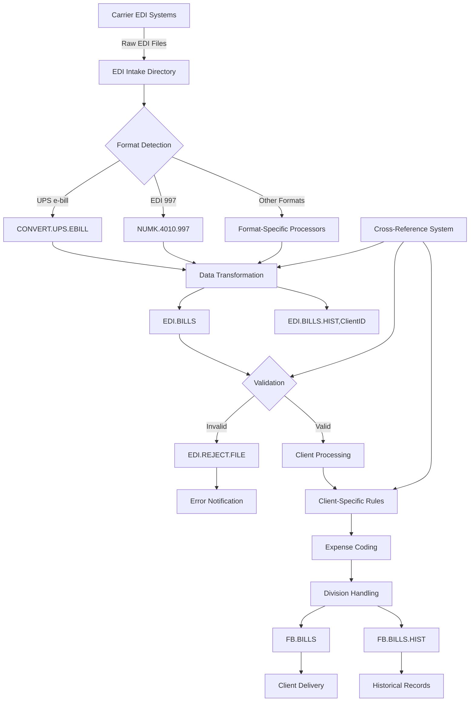
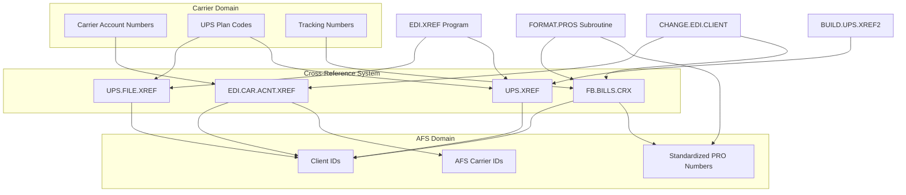
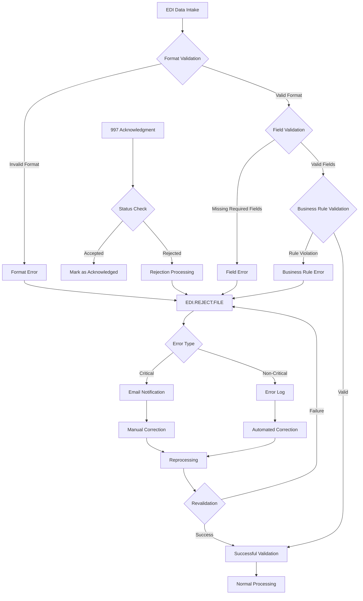
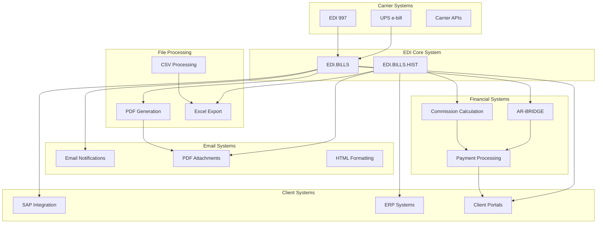

# EDI Processes in AFS Shreveport

## EDI System Overview

Electronic Data Interchange (EDI) is a core component of the AFS Shreveport system, serving as the automated mechanism for exchanging freight billing data between carriers, clients, and AFS. The EDI system handles the receipt, transformation, validation, and delivery of electronic freight billing information, eliminating manual data entry and reducing errors. Within AFS Shreveport, the EDI system processes various transaction types including carrier invoices, functional acknowledgments (997s), and client-specific formats.

The system is built on a MultiValue database architecture, with specialized file structures like EDI.BILLS and EDI.BILLS.HIST storing the transactional data. It supports complex cross-referencing between carrier accounts, client IDs, and tracking numbers, enabling accurate routing and processing of bills. The EDI system includes specialized processing for different carriers (particularly UPS), client-specific expense coding rules, and validation mechanisms to ensure data integrity. Email notifications, PDF generation, and file transformation capabilities are integrated to provide a complete end-to-end solution for electronic freight billing exchange.

## EDI Data Flow Architecture

The EDI data flow in AFS Shreveport follows a comprehensive path from carrier systems to client delivery. Incoming EDI files are received in carrier-specific formats and placed in intake directories. The system detects the format and routes the file to the appropriate processor - UPS e-bills are handled by CONVERT.UPS.EBILL, EDI 997 acknowledgments by NUMK.4010.997, and other formats by their respective processors.

During transformation, the data is converted from carrier-specific formats to AFS's standardized structure. This involves field mapping, data normalization, and application of business rules. The cross-reference system plays a crucial role here, linking carrier accounts, client IDs, and tracking numbers to ensure proper routing.

Transformed data is stored in EDI.BILLS (active records) and EDI.BILLS.HIST,ClientID (historical client-specific records). The validation process checks for data integrity, proper formatting, and business rule compliance. Invalid records are moved to EDI.REJECT.FILE and trigger error notifications.

Valid records proceed to client-specific processing, where expense codes are assigned, divisions are handled, and special client requirements (like Airgas SAP integration) are applied. The processed records are then written to FB.BILLS and FB.BILLS.HIST for operational use and historical reference.

Finally, the data is delivered to clients through various channels, including email notifications with PDF attachments, direct file transfers, or integration with client systems.

## EDI File Structure and Record Formats

The AFS Shreveport EDI system relies on several key file structures to manage electronic data interchange. The primary files are EDI.BILLS and EDI.BILLS.HIST, which store active and historical EDI transactions respectively.

EDI.BILLS is a central repository for all active EDI transactions across clients. Records in this file use a composite key structure of `CLIENT_ID*CARRIER_ID*PRO_ID*VERSION`, where:
- CLIENT_ID identifies the AFS client
- CARRIER_ID identifies the freight carrier
- PRO_ID is the tracking/pro number
- VERSION is typically "0" for original transactions

The EDI.BILLS.HIST file is actually a collection of client-specific files named EDI.BILLS.HIST,{CLIENT_ID}. This structure allows for efficient client-specific queries and processing while maintaining historical records.

Key fields in these records include:
- Field 1-5: Basic transaction identifiers and dates
- Field 25, 34: Shipment details and service types
- Field 67: Carrier information
- Field 88: Cross-reference link to freight bills
- Field 106-107: Client and carrier codes
- Field 115-121: Client-specific processing data
- Field 149-152: Change history with timestamps and user information

The system also maintains several cross-reference files:
- EDI.CAR.ACNT.XREF: Links carrier accounts to clients
- UPS.FILE.XREF: Maps UPS plan codes to client IDs
- UPS.XREF: Provides reverse lookups from plan codes to clients
- FB.BILLS.CRX: Cross-references between freight bills and EDI records

These structures support the complex relationships between carriers, clients, and shipments, enabling accurate routing and processing of EDI transactions. The system's MultiValue database architecture allows for flexible attribute structures and efficient handling of hierarchical data relationships.

## EDI Data Transformation and Mapping

The EDI data transformation and mapping process in AFS Shreveport is a sophisticated operation that converts carrier-specific formats into standardized AFS formats for consistent processing. This transformation is critical to the system's ability to handle diverse carrier inputs while maintaining a unified internal structure.

For UPS e-bills, which represent a significant portion of EDI traffic, the CONVERT.UPS.EBILL program performs this transformation. The program reads CSV files from UPS, parses their contents line by line, and maps fields to the AFS EDI structure. This includes extracting shipper information, tracking numbers, service descriptions, charges, and reference data. The mapping process handles various UPS-specific codes and translates them to AFS standard codes using functions like GET.TCODE, GET.BCODE, and GET.SCODE.

The transformation process also normalizes data formats. Dates are converted to internal date representations, monetary amounts are standardized to a consistent decimal format, and text fields are cleaned and formatted according to AFS requirements. Special handling is implemented for complex scenarios like hundredweight shipments, where multiple package-level entries must be aggregated into a single billing entry.

Client-specific requirements are addressed during transformation. For example, Airgas shipments require additional SAP integration fields including plant numbers and posting keys. Rexel shipments need special expense code mapping based on zip codes and shipping direction. The system applies these rules during the transformation process to ensure the resulting records meet client expectations.

The transformation also includes validation checks to ensure data integrity. This includes verifying that required fields are present, amounts balance correctly, and reference numbers follow expected patterns. Any issues detected during transformation are logged and may trigger error notifications or special handling.

Once transformation is complete, the standardized records are written to EDI.BILLS and EDI.BILLS.HIST,ClientID for further processing in the AFS system. This standardized format enables consistent application of business rules, reporting, and client delivery regardless of the original carrier format.

## EDI Cross-Reference System

The EDI Cross-Reference System in AFS Shreveport is a critical component that connects carrier-specific identifiers with AFS internal identifiers, enabling accurate routing and processing of EDI transactions. This system bridges the gap between carrier domains (where accounts, plan codes, and tracking numbers originate) and the AFS domain (which uses standardized client IDs, carrier IDs, and PRO numbers).

The cross-reference system consists of several key files:

1. **EDI.CAR.ACNT.XREF**: Maps carrier account numbers to AFS client IDs and carrier IDs. This file is essential for determining which client should receive a particular carrier's bills.

2. **UPS.FILE.XREF**: Specifically for UPS, this file maps UPS plan codes to client IDs, allowing the system to route UPS e-bills to the correct client.

3. **UPS.XREF**: Provides reverse lookups from UPS plan codes to client IDs, supporting validation and verification processes.

4. **FB.BILLS.CRX**: Cross-references between freight bills and EDI records, linking tracking numbers to standardized PRO numbers and client IDs.

Several programs maintain and utilize this cross-reference system:

- **EDI.XREF**: Rebuilds the UPS.FILE.XREF file by selecting active client records from EDI.CAR.ACNT.XREF.
- **FORMAT.PROS**: Formats carrier-specific tracking numbers into standardized PRO numbers according to carrier formatting rules.
- **CHANGE.EDI.CLIENT**: Updates cross-references when EDI bills are transferred between clients.
- **BUILD.UPS.XREF2**: Builds cross-references between UPS plan codes and client IDs.

The cross-reference system enables the AFS Shreveport system to handle the complex relationships between carriers, clients, and shipments, ensuring that EDI transactions are properly routed and processed according to client-specific requirements. It also supports validation processes by providing reference data for verifying the accuracy of incoming EDI transactions.

## Client-Specific EDI Processing

AFS Shreveport implements sophisticated client-specific EDI processing to meet the unique requirements of different clients. This customization layer ensures that each client's EDI data is handled according to their business rules, expense coding requirements, and organizational structure.

Expense coding is a critical aspect of client-specific processing. The system determines appropriate expense codes based on multiple factors including client division IDs, shipping direction (inbound, outbound, third-party), geographic regions, and service types. For example, the CONVERT.UPS.EBILL program contains extensive logic for assigning expense codes to Rexel shipments based on zip codes and regions, while Airgas has its own set of rules based on division identifiers and shipping parameters.

Division handling varies significantly between clients. Some clients require shipments to be categorized by business unit, plant, or department. The system supports this through division ID mapping, often using reference fields or zip code-based assignments. For Airgas, the system extracts division information from reference fields and maps it to SAP plant numbers and posting keys. For other clients, the system may use shipper or consignee zip codes to determine the appropriate division.

Special processing for specific clients is embedded throughout the system:

- **Airgas (client 0261CP)**: Requires SAP integration fields including plant numbers, posting keys, and special reference handling. The system also splits files by shipper number for this client.

- **Rexel (client 01706)**: Has complex expense code determination based on zip codes and regions, with different rules for inbound versus outbound shipments.

- **Cavenders (client 01825)**: Requires commission calculations and updates to UPS e-bills before processing.

- **Elliott Electric (client 01640)**: Needs special handling for commission amounts and fee allocations across different shipment types.

The system also handles client-specific requirements for PDF distribution, email notifications, and file formatting. Some clients receive PDF copies of original carrier invoices, while others get customized reports or data extracts.

This client-specific processing layer ensures that AFS Shreveport can adapt to the diverse requirements of its client base while maintaining a consistent core EDI processing framework.

## EDI Validation and Error Handling

The EDI validation and error handling system in AFS Shreveport employs a multi-layered approach to ensure data integrity and proper processing of electronic transactions. The validation process begins with format validation, checking that incoming files adhere to expected structures and can be parsed correctly. For UPS e-bills, this includes verifying CSV formatting and field counts; for EDI 997 acknowledgments, it involves checking segment structures and syntax.

Field validation examines individual data elements to ensure they contain appropriate values. This includes checking for required fields, validating date formats, verifying numeric values, and ensuring reference numbers follow expected patterns. Programs like NUMK.4010.997 implement extensive field validation for EDI segments, while CONVERT.UPS.EBILL validates UPS-specific fields.

Business rule validation applies client-specific and carrier-specific rules to the data. This includes verifying that expense codes are valid, amounts balance correctly, and client-specific requirements are met. For example, the system checks that Airgas shipments include valid plant numbers and posting keys.

When validation fails, the system routes records to EDI.REJECT.FILE with appropriate error codes and descriptions. The FIX.ID program helps manage these rejected records by reformatting their IDs for easier processing. Critical errors trigger email notifications to operations staff, while non-critical errors are logged for later review.

Error correction can be manual or automated depending on the error type. Manual corrections are performed by operations staff using specialized tools, while automated corrections may be applied through batch processes. After correction, records are reprocessed and revalidated to ensure they now meet all requirements.

The system also processes EDI 997 functional acknowledgments, which provide feedback on whether trading partners have successfully received and processed EDI transactions. The NUMK.4010.997 program handles these acknowledgments, updating transaction status based on the response.

This comprehensive validation and error handling system ensures that only valid, properly formatted EDI transactions proceed through the AFS Shreveport system, maintaining data integrity and reliability throughout the EDI process.

## EDI Functional Acknowledgments (997)

EDI Functional Acknowledgments (997) play a critical role in the AFS Shreveport system by providing confirmation of receipt and validation status for EDI transactions between trading partners. The 997 document serves as a formal response to indicate whether a received transaction passed initial syntax validation, allowing trading partners to verify successful transmission and identify potential issues.

The NUMK.4010.997 program is the primary component responsible for processing these acknowledgments. It parses incoming 997 documents, which contain segments like ISA (Interchange Control Header), GS (Functional Group Header), ST (Transaction Set Header), AK1-AK9 (Acknowledgment segments), and SE (Transaction Set Trailer). Each segment provides specific information about the acknowledged transaction and its validation status.

The program extracts key information from these segments, including:
- Transaction identifiers from ST segments
- Group status codes from AK9 segments (accepted, accepted with errors, or rejected)
- Detailed error information from AK3-AK4 segments when present

When processing 997 acknowledgments, the system validates the structure and syntax of the document itself, ensuring it follows EDI standards. It then correlates the acknowledgment with the original transaction using control numbers and identifiers. Based on the acknowledgment status, the system updates the status of the original transaction in the EDI.BILLS and EDI.BILLS.HIST files.

For accepted transactions, the system marks them as successfully acknowledged, allowing them to proceed through normal processing. For transactions with errors or rejections, the system flags them for review and may trigger notifications to operations staff. The BUILD.EDI.997 program extracts data from the EDI.997 file and formats it into an Excel spreadsheet for analysis, helping staff identify patterns in acknowledgment responses and address recurring issues.

The system also generates its own 997 acknowledgments in response to incoming transactions from trading partners, providing the same level of confirmation back to the sender. This bidirectional acknowledgment process ensures that both parties have visibility into the status of transmitted transactions, supporting reliable EDI communication.

By effectively processing and generating 997 acknowledgments, AFS Shreveport maintains a robust audit trail of EDI communications and ensures that transaction status is accurately tracked throughout the system.

## EDI Record Maintenance and Cleanup

EDI record maintenance and cleanup are essential operations in the AFS Shreveport system to ensure data integrity, optimize performance, and manage storage efficiently. The system includes several specialized programs and processes for maintaining EDI records throughout their lifecycle.

The CHANGE.EDI.CLIENT.SUB subroutine handles the transfer of EDI billing records from one client to another. This process involves reading records from the source client's EDI.BILLS and EDI.BILLS.HIST files, updating client information, maintaining change history with timestamps and user information, and writing the records to the destination client's files while deleting them from the source. The subroutine includes validation checks to prevent duplicate transfers and maintains an audit trail of changes in fields 149-152, recording the date, time, user, and change details.

The REMOVE.EDI.LINK program identifies and removes EDI links (attribute 88) in freight billing records when their corresponding EDI.BILLS.HIST records have been deleted. This cleanup process prevents orphaned references and ensures data consistency. The program selects clients from the CLIENTS file, processes FB.BILLS.HIST records with EDI links, and clears the link attribute when the referenced EDI record no longer exists.

Historical data management is handled through various processes. The EDI.BILLS file contains active records, while EDI.BILLS.HIST,ClientID files store historical records for each client. The system includes mechanisms for transferring records between these files based on age and status. The BUILD.EDI.STATS program processes EDI statistics information, reading from CSV files and writing to the EDI.STAT file to maintain historical usage metrics.

Link removal and cross-reference cleanup are critical for maintaining referential integrity. The CHANGE.EDI.LINK program updates links between EDI records and other system components when records are moved or modified. The EDI.XREF program manages cross-reference data between EDI carrier accounts and clients, clearing and rebuilding the UPS.FILE.XREF file to ensure accurate relationships.

Record transfers between clients are carefully managed to maintain data integrity. When transferring records, the system updates all relevant cross-references, clears client-specific processing fields (115-121), and maintains a comprehensive audit trail. This ensures that historical information is preserved while allowing records to be properly processed under their new client assignment.

These maintenance and cleanup processes ensure that the EDI system remains efficient, accurate, and reliable over time, even as data volumes grow and client relationships evolve.

## EDI Integration Points

The EDI system in AFS Shreveport features numerous integration points with other system components, creating a comprehensive ecosystem for freight billing management. These integration points enable seamless data flow between EDI processing and other critical functions.

Email integration is a key connection point, with programs like CONVERT.UPS.EBILL generating notifications for successful conversions, errors, and client delivery. The system formats HTML emails, attaches PDF documents, and routes messages to appropriate recipients based on client preferences and event types. This integration ensures timely communication about EDI processing status and results.

PDF generation and management is another significant integration area. The system extracts PDF attachments from carrier files, processes them for client delivery, and generates new PDF documents for reporting and documentation. These capabilities support client requirements for original invoice copies and formatted reports.

Financial system integration connects EDI data with accounting and payment processes. Programs like UPS.UPDATE.01640 and UPS.UPDATE.01825 update UPS electronic billing files with AFS commission amounts, integrating with AR-BRIDGE for non-shipment fee calculations. This integration ensures accurate financial reporting and commission tracking.

Client-specific system integration varies by client. For Airgas, the system integrates with SAP by formatting data with appropriate plant numbers and posting keys. For other clients, integration may involve specific file formats, data structures, or communication protocols to connect with their ERP systems or internal processes.

Excel and CSV integration enables data export and reporting. The BUILD.EDI.997 program formats EDI acknowledgment data for Excel analysis, while other utilities generate CSV files for client delivery or internal processing. These capabilities support both operational reporting and client data requirements.

Cross-reference management integrates EDI data with other system components through shared identifiers and lookup tables. Programs like EDI.XREF and BUILD.UPS.XREF2 maintain these connections, ensuring accurate routing and processing across the system.

These diverse integration points make the EDI system a central hub in the AFS Shreveport architecture, connecting carrier data with client systems, financial processes, and operational workflows in a cohesive and efficient manner.

## EDI Statistical Analysis and Reporting

The AFS Shreveport system includes robust capabilities for EDI statistical analysis and reporting, enabling operations teams to monitor transaction volumes, success rates, and other key metrics. These analytical tools provide insights into EDI processing performance, identify trends, and support operational decision-making.

The BUILD.EDI.STATS program is a core component of the statistical analysis system. It processes EDI statistics information from CSV files, parsing client information, carrier details, and carrier counts, then writes this information to the EDI.STAT file using a composite key format of 'CLIENT*CARRIER'. This structured approach allows for efficient querying and analysis of EDI transaction volumes by client and carrier combinations.

For EDI 997 acknowledgments, the BUILD.EDI.997 program extracts data from the EDI.997 file and formats it into an Excel spreadsheet for detailed analysis. This report includes critical information such as control numbers, dates, versions, and acknowledgment segments (AK1-AK9). By analyzing this data, operations staff can identify patterns in acknowledgment responses, track success rates, and address recurring issues with specific trading partners or transaction types.

Transaction volume tracking is implemented across the EDI system, with counters and statistics maintained for various processing stages. Programs like CONVERT.UPS.EBILL track the number of files processed, records converted, and errors encountered during each run. These metrics are used to monitor system performance and identify potential bottlenecks or issues.

Success rate analysis is supported through error tracking and categorization. The system maintains detailed information about validation failures, rejection reasons, and correction actions. This data helps operations teams understand common error patterns and implement preventive measures to improve overall success rates.

Client-specific reporting is available through various utilities that extract and format EDI data according to client requirements. These reports may include transaction volumes, charge summaries, service type distributions, or other metrics relevant to specific clients.

Operational monitoring is enhanced through progress tracking and status reporting. Many EDI processing programs include progress bars and status updates to provide real-time visibility into processing status. This information helps operations staff monitor long-running processes and identify potential issues before they impact service levels.

By maintaining comprehensive statistical data and providing flexible reporting tools, the AFS Shreveport EDI system enables effective monitoring, analysis, and optimization of EDI operations across the organization.

## Security and Compliance in EDI Processing

Security and compliance are fundamental aspects of the EDI processing system in AFS Shreveport, ensuring data protection, regulatory adherence, and appropriate access controls. The system implements multiple layers of security measures to protect sensitive freight billing information while maintaining compliance with industry standards and client requirements.

Access control is implemented throughout the EDI system, with programs like CHANGE.EDI.CLIENT enforcing user permission checks before allowing sensitive operations. The system distinguishes between regular users and superusers, with certain functions restricted to authorized personnel. For example, client reassignments in CHANGE.EDI.CLIENT are limited to members of the same client family for regular users, while superusers have broader capabilities.

Audit logging is comprehensive, tracking all significant actions within the EDI system. Programs maintain detailed logs of user activities, including who performed actions, when they occurred, and what changes were made. The CHANGE.EDI.CLIENT.SUB subroutine exemplifies this approach by recording date, time, user, and change details in fields 149-152 whenever EDI records are modified or transferred between clients.

Data protection measures include secure file handling, controlled access to sensitive client information, and proper management of carrier credentials. The system ensures that client data is segregated appropriately, with client-specific files like EDI.BILLS.HIST,ClientID preventing unauthorized cross-client access.

Compliance with EDI standards is maintained through rigorous validation of incoming and outgoing transactions. Programs like NUMK.4010.997 implement standard-compliant parsing and generation of EDI documents, ensuring interoperability with trading partners and adherence to industry formats.

Client-specific compliance requirements are addressed through customized processing rules and data handling procedures. The system supports various client-mandated security protocols, data retention policies, and reporting requirements, ensuring that each client's unique compliance needs are met.

System integrity is protected through validation checks that prevent duplicate processing, detect data corruption, and ensure referential integrity across the system. Programs like REMOVE.EDI.LINK maintain data consistency by cleaning up orphaned references and ensuring that cross-references remain valid.

These security and compliance measures work together to create a robust framework for EDI processing that protects sensitive data, maintains regulatory compliance, and ensures appropriate access controls throughout the system. This comprehensive approach supports AFS Shreveport's commitment to secure, reliable, and compliant freight billing operations.

[Generated by the Sage AI expert workbench: 2025-05-28 08:06:28  https://sage-tech.ai/workbench]: #