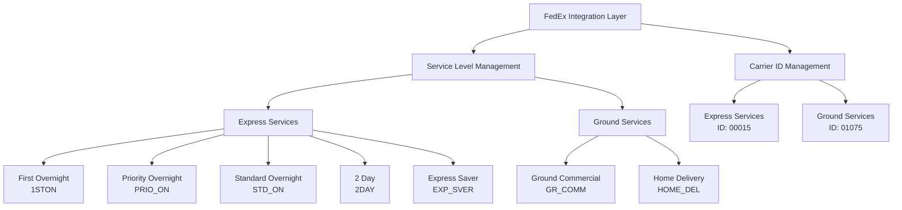
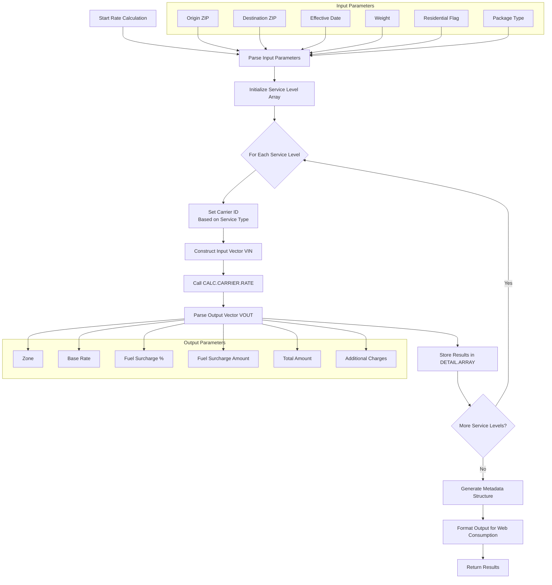
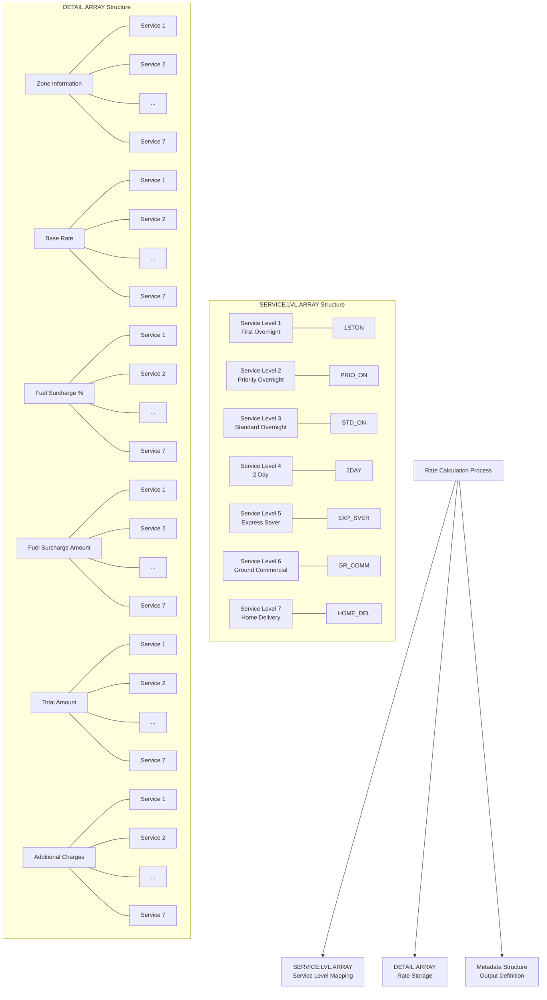

# FedEx Integration in AFS Shreveport

## FedEx Integration Overview

The FedEx integration layer in AFS Shreveport serves as a critical component for calculating accurate shipping rates across multiple FedEx service levels. This integration enables the system to retrieve real-time rate information from FedEx's rating engine and present it in a standardized format for consumption by other parts of the application. The integration is designed with a clear separation of concerns, where the test routine (`FEDEX.RATER.TEST`) interfaces with the core calculation engine (`CALC.CARRIER.RATE`) through a well-defined parameter structure. This architecture allows for consistent rate calculations while abstracting the complexities of FedEx's service-specific pricing models, carrier IDs, and surcharge calculations. The integration supports both FedEx Express services (overnight and 2-day options) and FedEx Ground services (commercial and residential delivery), handling their distinct pricing structures and carrier identifications within a unified framework.

## Service Level Management

The FedEx integration layer manages seven distinct service levels, each with human-readable descriptions mapped to internal service codes. This mapping is crucial as it translates between user-friendly service names displayed in the interface and the technical codes required by the FedEx rating engine. The system maintains this mapping in a multi-dimensional array (`SERVICE.LVL.ARRAY`), where the first dimension represents the service level index (1-7), and the second dimension stores either the human-readable description (position 1) or the internal code (position 2). The seven service levels are:

1. First Overnight (1STON) - Premium next-day morning delivery
2. Priority Overnight (PRIO_ON) - Next-day morning delivery
3. Standard Overnight (STD_ON) - Next-day afternoon delivery
4. 2 Day (2DAY) - Second business day delivery
5. Express Saver (EXP_SVER) - Three business day delivery
6. Ground Commercial (GR_COMM) - Business delivery with standard ground service
7. Home Delivery (HOME_DEL) - Residential delivery with standard ground service

This structured approach allows the system to iterate through all service levels efficiently when calculating rates, while maintaining clear service identification throughout the process.

## FedEx Service Level Architecture



The architecture diagram illustrates how the FedEx integration organizes service levels into two primary categories: Express Services and Ground Services. Each service level has a specific internal code used for rate calculations. The system maintains separate carrier IDs for Express (00015) and Ground (01075) services, which is critical for proper rate retrieval. This hierarchical organization allows the system to handle the different pricing structures and business rules that apply to each service level while presenting a unified interface to other components of the AFS Shreveport system.

## Rate Calculation Process

The core of the FedEx integration is the rate calculation process, which leverages the `CALC.CARRIER.RATE` subroutine to retrieve accurate shipping rates. This process follows a standardized approach:

1. The system accepts input parameters including origin/destination ZIP codes, effective date, weight, residential flag, and package type.
2. For each of the seven FedEx service levels, the system:
   - Sets the appropriate carrier ID (00015 for Express services or 01075 for Ground services)
   - Constructs an input vector (VIN) containing all necessary parameters
   - Calls the `CALC.CARRIER.RATE` subroutine to perform the actual rate calculation
   - Parses the output vector (VOUT) to extract zone, base rate, fuel surcharge percentage, fuel surcharge amount, total amount, and additional charges
   - Stores the results in a multi-dimensional array (DETAIL.ARRAY) for further processing

The rate calculation process is designed to handle all FedEx service levels consistently while accounting for their unique pricing characteristics. The system also captures origin and destination city/state information returned from the rating engine, which enhances the data available for display and reporting purposes. A debugging flag can be enabled to trace the input/output parameters during the calculation process, facilitating troubleshooting and verification of rate calculations.

## FedEx Rate Calculation Flow



This flowchart illustrates the complete process flow for FedEx rate calculations, from input parameter parsing to the final formatted output. The system processes each service level sequentially, applying the appropriate carrier ID and collecting the results. The metadata-driven output structure ensures consistent formatting for web consumption, with clearly defined fields for each service level's rates and charges.

## Carrier ID Handling

The FedEx integration implements specialized handling for carrier IDs based on the service level being processed. This distinction is crucial because FedEx operates with different carrier entities for Express and Ground services, each with its own rate structures and business rules. The system uses carrier ID "00015" (Federal Express Corporation) for Express services (First Overnight, Priority Overnight, Standard Overnight, 2 Day, and Express Saver) and carrier ID "01075" for Ground services (Ground Commercial and Home Delivery).

This carrier ID differentiation is implemented through a conditional statement that checks the service level code before making the rate calculation call:

```
IF SERVICE.LVL = "GR_COMM" OR SERVICE.LVL = "HOME_DEL" THEN
   ID.CARRIER = "01075"
ELSE
   ID.CARRIER = "00015"  ;* Federal Express Corporation
END
```

This approach ensures that rate requests are directed to the appropriate FedEx entity, maintaining accuracy in the rate calculations while presenting a unified interface to the rest of the system. The carrier ID is passed as part of the input vector to the `CALC.CARRIER.RATE` subroutine, which uses it to retrieve the correct rates from FedEx's rating engine.

## Data Structure and Formatting

The FedEx integration employs a sophisticated multi-dimensional array structure to store and process shipping rate information. The primary data structure is `DETAIL.ARRAY`, which organizes calculation results by service level and rate component. The array is structured as follows:

- First dimension (rows):
  1. Zone information
  2. Base rate amount
  3. Fuel surcharge percentage
  4. Fuel surcharge amount
  5. Total amount (base rate + fuel surcharge)
  6. Additional charges

- Second dimension (columns): Each column represents one of the seven FedEx service levels

This structure allows for efficient storage and retrieval of rate information across all service levels. The system formats monetary values consistently using the `OCONV` function with the "MR2," mask, ensuring that all amounts are displayed with two decimal places and appropriate thousand separators. Percentages are formatted with the "MR2" mask (two decimal places without separators).

For data exchange with external systems, the integration converts the standard MultiValue attribute marks (@AM) to character code 30, ensuring proper data formatting and compatibility with web interfaces and other external systems.

## FedEx Data Structure



This diagram visualizes the multi-dimensional arrays used to store and process FedEx shipping rate information. The `SERVICE.LVL.ARRAY` maps human-readable service names to internal codes, while the `DETAIL.ARRAY` stores the calculation results for each service level across multiple rate components. The metadata structure (not shown in detail) defines the output format for web consumption, ensuring consistent data presentation.

## Metadata-Driven Output

The FedEx integration implements a metadata-driven approach to define the structure of output for web consumption and external systems. This approach provides a clear contract for data exchange and ensures consistency in the output format regardless of the underlying calculation complexities. The metadata structure is defined as a multi-dimensional array (`METADATA`) with three columns:

1. Data type (e.g., "VARCHAR")
2. Field name (e.g., "SrvcLvl1Desc", "SrvcLvl1Tot")
3. Additional attributes (set to 0 in this implementation)

The metadata defines fields for general shipment information (origin/destination ZIP codes, cities, states, zone, residential flag, and package type) followed by detailed rate information for each of the seven service levels. For each service level, the metadata defines six fields:
- Service level description
- Total amount
- Base rate amount
- Fuel surcharge percentage
- Fuel surcharge amount
- Additional charges

This structured approach allows consuming systems to understand the data format without requiring knowledge of the underlying calculation logic. The final output is formatted by converting the attribute marks (@AM) to character code 30, making it suitable for web consumption.

## Testing and Validation

The FedEx integration includes robust testing and validation capabilities to ensure accurate rate calculations. The system supports a debugging mode that can be enabled by setting `DEBUG.FLAG = 1`, which outputs detailed information about the input parameters sent to and output parameters received from the `CALC.CARRIER.RATE` subroutine. This facilitates troubleshooting and verification of rate calculations.

For development and testing purposes, the system includes hardcoded test values that can be used when the program is run by specific users (e.g., "NPRATT"). These test values provide a consistent baseline for validating rate calculations across different service levels.

The system also logs input parameters to a file ("FEDEX.RATER.INPUT" in the VOC file) for audit and debugging purposes. Each log entry includes:
- Origin and destination ZIP codes
- Effective date
- Weight (both input and normalized)
- Residential flag
- Package type
- Timestamp of the calculation

Error handling is implemented throughout the process, with any errors returned from the `CALC.CARRIER.RATE` subroutine captured and included in the output. This ensures that consuming systems are aware of any issues that occurred during the rate calculation process.

## Integration with External Systems

The FedEx integration is designed to seamlessly connect with other components of the AFS Shreveport system and external platforms. The primary integration point is the standardized input/output interface of the `CALC.CARRIER.RATE` subroutine, which abstracts the complexities of communicating with FedEx's rating engine.

The output is structured for web consumption, with a clear metadata definition that describes the format of the returned data. This metadata-driven approach ensures that consuming systems can interpret the results correctly without requiring knowledge of the underlying calculation logic.

The integration supports both synchronous and asynchronous processing patterns. For synchronous operations, the system returns formatted results immediately after calculation. For asynchronous or batch operations, the system can log inputs and outputs to persistent storage for later retrieval or analysis.

The system also captures and returns additional information from the rating engine, such as origin and destination city/state information, which enhances the data available for display and reporting purposes. This comprehensive approach to data integration ensures that all relevant shipping information is available to other components of the AFS Shreveport system and external platforms.

[Generated by the Sage AI expert workbench: 2025-05-28 08:06:31  https://sage-tech.ai/workbench]: #