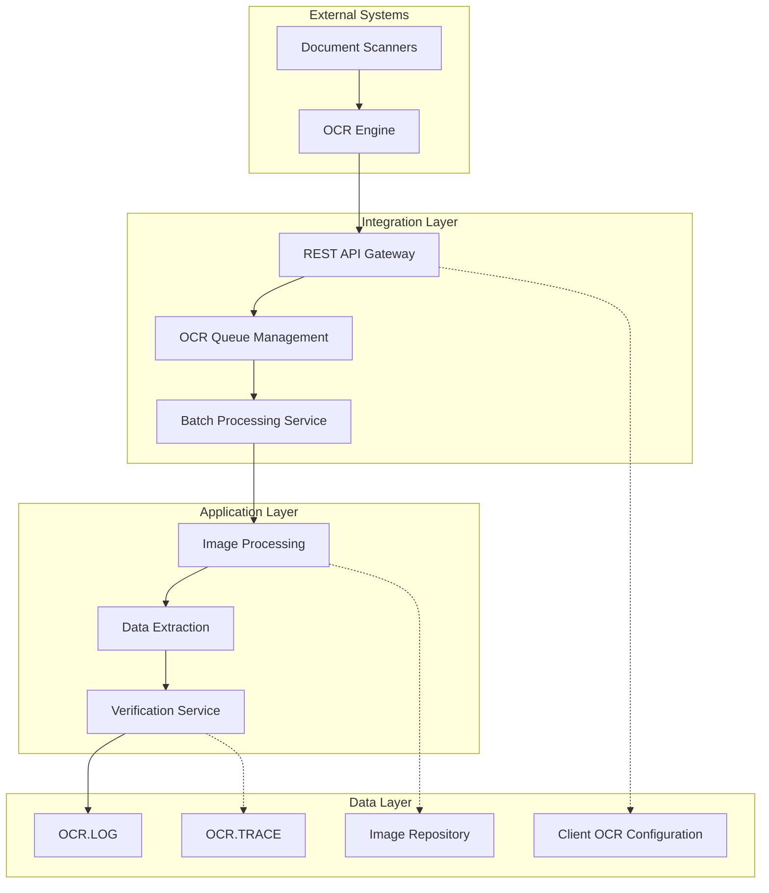
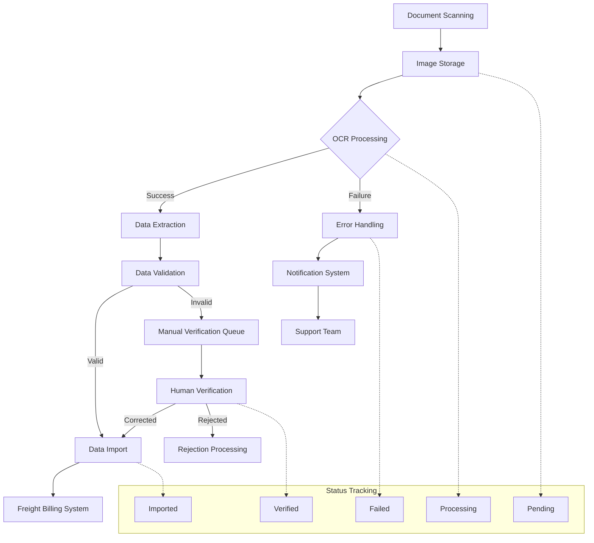
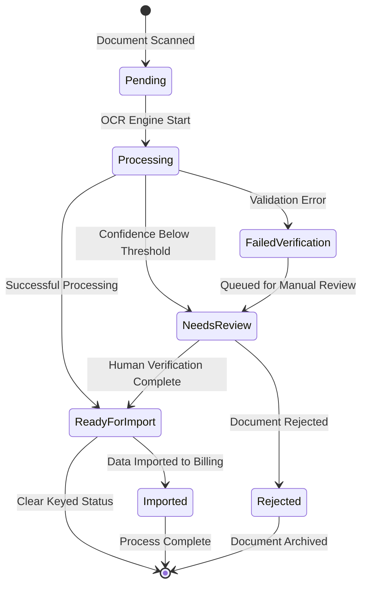
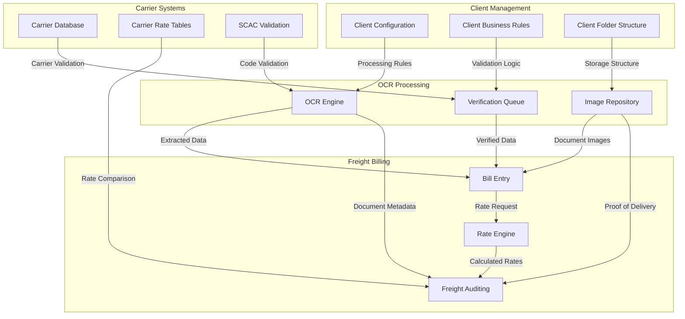

# OCR Integration in AFS Shreveport

## OCR Integration Overview

The Optical Character Recognition (OCR) integration within AFS Shreveport's external systems layer serves as a critical bridge between physical documents and digital freight billing workflows. This integration enables the automated extraction of shipping information, carrier details, and billing data from various document formats, significantly reducing manual data entry requirements. The OCR system connects to the core AFS platform through a sophisticated web services architecture, allowing for real-time document processing, verification, and integration with client-specific business rules. By leveraging modern REST APIs and secure communication protocols, the OCR integration provides a scalable solution for handling high volumes of freight documentation across multiple carriers and clients, while maintaining data accuracy and processing efficiency throughout the freight billing lifecycle.

## OCR Integration Architecture

The architecture diagram illustrates the comprehensive OCR integration within AFS Shreveport. The system begins with document scanning, feeding into the OCR engine for initial recognition. The REST API gateway serves as the primary interface between external OCR services and internal processing components. The integration layer manages queuing and batch processing, while the application layer handles image processing, data extraction, and verification. The data layer stores OCR logs, traces for debugging, client-specific configurations, and the image repository. This multi-layered approach ensures robust document processing with appropriate separation of concerns between scanning, recognition, verification, and integration with freight billing systems.

## Image Processing Workflow

The OCR image processing workflow in AFS Shreveport follows a well-defined path from document acquisition to integration with freight billing systems. Initially, physical documents are scanned and digitized, creating high-quality image files that are stored in client-specific folders. These images are then processed by the OCR engine, which performs layout analysis to identify document structure and extracts key data fields such as PRO numbers, carrier information, and billing details. The extracted data undergoes preliminary validation against expected formats and patterns before being queued for human verification when confidence thresholds aren't met. The OCR.CLEAR.KEYED.DT program plays a crucial role in this workflow by managing the status of processed images, allowing operations staff to search for images by client and date range, and clearing the "keyed" status when necessary. Once verified, the extracted data is transformed into the appropriate format for the freight billing system and linked to the corresponding client record. Throughout this process, comprehensive logging captures processing metrics, exceptions, and audit trails to ensure traceability and support continuous improvement of recognition accuracy.

## REST API Integration

The AFS Shreveport system implements a sophisticated REST API integration for OCR processing that serves as the communication backbone between the imaging services and the core freight billing platform. The integration utilizes TLS 1.2 encryption for secure data transmission and supports standard HTTP methods with JSON as the primary data interchange format. As evidenced in the OCR.CLEAR.KEYED.DT program, the system dynamically selects between production and QA endpoints based on the server environment, ensuring appropriate separation between testing and production workflows. API authentication is handled through secure token management, with credentials stored in the CONTROL file under "CLIENT.OCR" records. The REST integration implements comprehensive error handling with detailed logging and notification capabilities, including email alerts for critical failures. Request timeouts are configurable, with default settings of 30 seconds to accommodate varying network conditions. The system leverages Universe Database Objects (UDO) for efficient JSON parsing of API responses, extracting relevant metadata such as image keys, client folders, and verification status. This API-centric approach enables loose coupling between the OCR processing services and the core AFS platform, facilitating independent scaling and maintenance of each component.

## OCR Data Flow

This flowchart illustrates the comprehensive data flow through the OCR pipeline in AFS Shreveport. Documents begin their journey through scanning and image storage before entering OCR processing. The system handles both successful and failed recognition paths, with data extraction and validation for successful cases and error handling for failures. Valid data moves directly to import into the freight billing system, while invalid data enters a manual verification queue for human review. The verification process allows for correction or rejection of documents. Throughout this process, the system maintains detailed status tracking, with documents moving through pending, processing, verified, imported, or failed states. The OCR.CLEAR.KEYED.DT program plays a critical role in managing these statuses, particularly in clearing the "keyed" status for reprocessing when necessary.

## Batch Processing Capabilities

The AFS Shreveport OCR integration implements robust batch processing capabilities that enable efficient handling of large document volumes. The system organizes documents into logical batches based on client folders, scan dates, and document types, allowing for parallel processing and optimized resource utilization. As seen in the OCR.CLEAR.KEYED.DT program, batch numbers are extracted from image paths using string manipulation (line 132), providing a consistent identifier for tracking documents through the processing pipeline. The batch processing subsystem supports prioritization based on client SLAs, document types, and processing urgency, ensuring critical documents receive expedited handling. Each batch maintains comprehensive metadata including creation timestamp, processing status, document count, and completion metrics. The system implements sophisticated retry logic for failed documents within a batch, with configurable thresholds for automatic versus manual intervention. Batch status tracking provides real-time visibility into processing progress, with detailed logging of processing times, success rates, and exception conditions. Administrative interfaces allow operations staff to manage batch priorities, reassign documents between batches, and handle special processing requirements for exception cases.

## JSON Processing and Data Extraction

The AFS Shreveport OCR integration employs sophisticated JSON processing techniques to handle the structured data exchanged with OCR services. The system leverages Universe Database Objects (UDO) for efficient JSON parsing, as demonstrated in the OCR.CLEAR.KEYED.DT program (line 129). This approach provides a robust framework for traversing complex JSON structures and extracting relevant data fields. The JSON processing pipeline begins with the receipt of OCR results, which typically include document metadata, extracted field values, and confidence scores. The system methodically extracts key information such as image keys, client folders, carrier information (SCAC codes), PRO numbers, and verification status flags. Boolean values in the JSON responses are appropriately converted to numeric flags for database storage, with proper handling of null values to ensure data integrity. The extraction process includes validation of critical fields against expected formats and patterns, flagging discrepancies for human verification. The system maintains the relationship between extracted data and source images through consistent key references, enabling bidirectional traceability. This comprehensive approach to JSON processing ensures reliable extraction of business-critical information from OCR results, forming the foundation for subsequent freight billing operations.

## OCR Status Management

The state diagram illustrates the comprehensive status management system for OCR-processed documents within AFS Shreveport. Documents begin in a Pending state after scanning, transitioning to Processing when the OCR engine begins extraction. Based on confidence scores and validation results, documents may move to NeedsReview (when confidence is below threshold), FailedVerification (when validation errors occur), or ReadyForImport (when processing is successful). Documents requiring review can be either approved (moving to ReadyForImport) or rejected. The OCR.CLEAR.KEYED.DT program plays a critical role in this workflow by allowing operations staff to clear the "keyed" status of documents, effectively resetting them in the workflow when necessary. This sophisticated status management ensures complete visibility into document processing status and supports efficient exception handling.

## Client-Specific OCR Configuration

The AFS Shreveport OCR integration implements a highly configurable client-specific approach to document processing. Each client's unique requirements are stored in the CONTROL file under "CLIENT.OCR" records, containing essential parameters such as API endpoints, server environments, logging preferences, and notification recipients. This configuration-driven approach enables tailored OCR processing workflows without requiring code modifications. Client folders follow standardized naming conventions with client identifiers and region codes (e.g., "CLIENTR%5"), facilitating proper routing and processing of documents. The system supports client-specific field mappings, allowing the same physical document position to map to different business fields based on client preferences. Verification thresholds can be adjusted per client, with stricter requirements for clients with complex documents or higher accuracy demands. Document retention policies, processing priorities, and notification preferences are all configurable at the client level. The OCR.CLEAR.KEYED.DT program demonstrates this client-centric approach by allowing operations staff to search for and manage OCR-processed images by client identifier and date range, ensuring proper segregation of client data throughout the processing lifecycle.

## Security and Authentication

The AFS Shreveport OCR integration implements comprehensive security measures to protect sensitive freight documentation and ensure secure communication with external services. As evidenced in the OCR.CLEAR.KEYED.DT program (line 171), the system enforces TLS 1.2 encryption for all API communications, creating a secure context for data transmission. Authentication credentials for OCR services are securely stored in the CONTROL file under "CLIENT.OCR" records, with access restricted to authorized system processes. The integration implements proper HTTP header management, including content-type specifications and authentication tokens, ensuring secure and properly formatted API requests. User access to OCR management functions is controlled through the AFS permission system, with role-based access control determining who can view, process, or modify OCR-related data. All OCR operations are logged with user identifiers, timestamps, and action details, creating a comprehensive audit trail for security monitoring and compliance purposes. The system implements proper error handling for authentication failures, with notifications to security personnel for potential unauthorized access attempts. This multi-layered security approach ensures the confidentiality, integrity, and availability of OCR-processed freight documentation throughout its lifecycle.

## Error Handling and Notifications

The AFS Shreveport OCR integration implements a sophisticated error handling and notification system to ensure operational reliability and timely resolution of processing exceptions. The OCR.CLEAR.KEYED.DT program demonstrates this approach with dedicated error handling routines that capture both system-level and business-level exceptions. When JSON parsing errors occur, the system captures detailed error codes and messages through the UDOGetLastError function, providing specific diagnostic information for troubleshooting. The integration distinguishes between internal errors (handled by REPORT.INTERNAL.ERROR) and fatal errors (handled by REPORT.FATAL.ERROR), with appropriate escalation paths for each severity level. Email notifications are automatically generated for critical failures, with configurable recipient lists that can include both technical support staff and business stakeholders. Notification messages include comprehensive contextual information such as the API URL, client identifier, and specific error details, facilitating rapid diagnosis and resolution. All errors are logged to the OCR.TRACE file, creating a persistent record for trend analysis and system improvement. The system implements appropriate retry logic for transient failures, with configurable thresholds to prevent endless retry loops. This comprehensive approach to error handling ensures operational visibility into OCR processing exceptions and supports rapid resolution of issues that could impact freight billing operations.

## OCR Integration Points

This diagram illustrates the comprehensive integration points between OCR processing and other critical components of the AFS Shreveport system. The OCR engine connects directly to the bill entry process, providing extracted data that populates freight bills automatically. The image repository supplies document images to both bill entry and auditing functions, supporting visual verification and proof of delivery requirements. Client management components provide essential configuration data to the OCR process, including processing rules, validation logic, and folder structures. Carrier systems integrate with OCR processing through validation of carrier data, SCAC codes, and rate information. The verification queue serves as a critical integration point between OCR processing and bill entry, ensuring only validated data enters the freight billing workflow. This interconnected architecture demonstrates how OCR processing is deeply embedded within the broader AFS Shreveport ecosystem, supporting automated data extraction while maintaining integration with client-specific and carrier-specific business rules.

[Generated by the Sage AI expert workbench: 2025-05-28 08:06:31  https://sage-tech.ai/workbench]: #