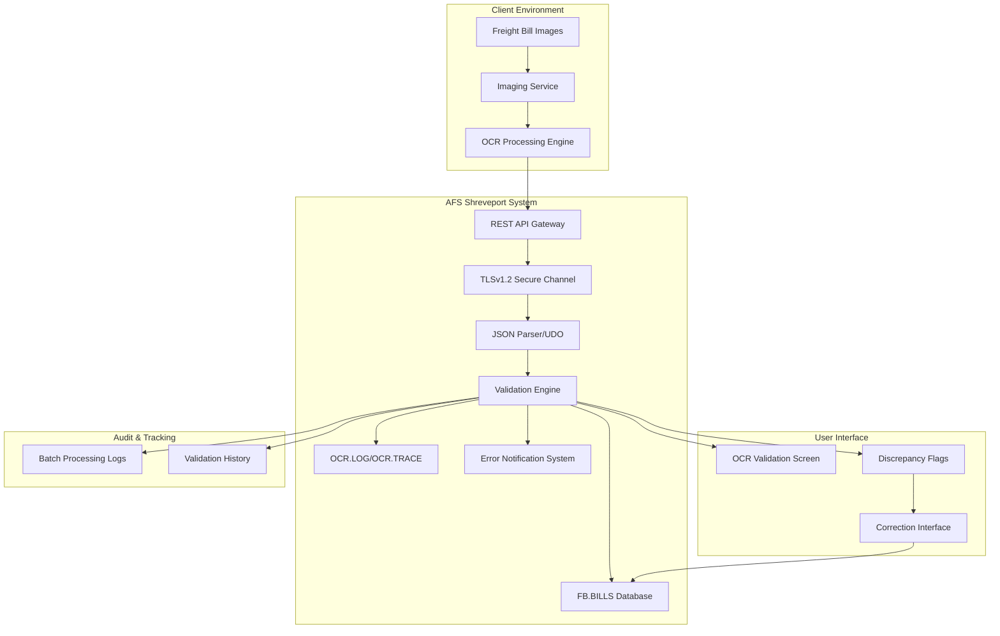
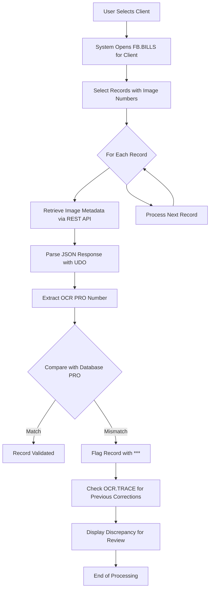
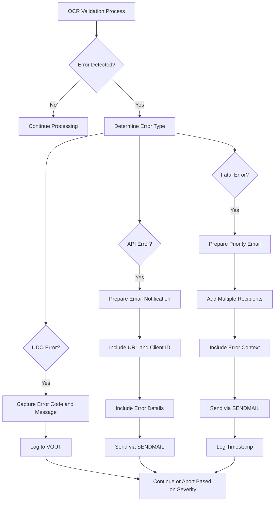

# OCR Integration in AFS Shreveport

## OCR Integration Overview

The AFS Shreveport system incorporates sophisticated optical character recognition (OCR) capabilities to streamline the processing of freight bill images. This integration enables the automated extraction of critical data elements, such as PRO numbers, carrier information, and other metadata from scanned freight documents. The OCR subsystem connects with the core billing platform through a secure REST API architecture, allowing for real-time validation of extracted data against existing records in the FB.BILLS database. This integration significantly reduces manual data entry requirements while implementing robust validation mechanisms to ensure data accuracy. The system employs Universal Data Objects (UDO) for parsing JSON responses from the imaging service, enabling structured access to OCR-extracted data fields. When discrepancies are detected between OCR-extracted PRO numbers and database records, the system flags these inconsistencies for human review and can trigger notification workflows to alert appropriate personnel.

## OCR Integration Architecture

The architecture diagram illustrates the OCR integration flow within AFS Shreveport. The process begins with freight bill images being processed by the imaging service and OCR engine. The system then uses a secure REST API gateway with TLSv1.2 encryption to retrieve the OCR-extracted data. The JSON responses are parsed using Universal Data Objects (UDO) and passed to the validation engine, which compares the extracted PRO numbers against the FB.BILLS database. Discrepancies are flagged in the user interface and can trigger notifications. The system maintains comprehensive audit trails through OCR.LOG and OCR.TRACE files, while also tracking batch processing information extracted from image paths.

## REST API Integration for Image Metadata

The OCR integration in AFS Shreveport implements a secure REST API architecture to retrieve image metadata from the imaging web service. The system utilizes TLSv1.2 protocol to establish a secure connection, ensuring that all data transmitted between the AFS platform and the imaging service remains encrypted. The REST API calls are structured as GET requests to endpoints such as `https://imagingws.afs.net/images/list`, with query parameters specifying the client folder and image key identifiers. The implementation includes sophisticated HTTP header management, setting content types to "application/json;charset=utf-8" to ensure proper character encoding and data interpretation. The system employs configurable timeout settings (default 30 seconds) to handle potential network latency issues while maintaining robust error handling for failed API calls. This integration allows the AFS platform to retrieve critical OCR-extracted data without direct access to the underlying imaging database, maintaining proper separation of concerns while ensuring data security.

## JSON Processing with Universal Data Objects

The AFS Shreveport system implements a sophisticated approach to JSON processing through Universal Data Objects (UDO) for handling OCR-extracted data. The UDO framework provides an abstraction layer that enables structured access to the hierarchical JSON responses received from the imaging service. The implementation uses a series of UDO functions including `UDORead`, `UDOArrayGetSize`, `UDOArrayGetItem`, and `UDOGetProperty` to navigate and extract specific data elements from the JSON structure. This approach allows the system to handle complex nested JSON objects while maintaining type safety through the `UDOTYPE` parameter, which identifies whether values are strings, numbers, booleans, or null. The system implements comprehensive error handling for JSON parsing operations, capturing error codes and messages through the `UDOGetLastError` function. This robust implementation enables the extraction of critical OCR data elements including PRO numbers (`field2`), carrier information, batch numbers, and timestamp data, while gracefully handling null values or missing fields in the JSON response.

## OCR Validation Workflow

The OCR validation workflow diagram illustrates the systematic process used to verify OCR-extracted PRO numbers against the corresponding database records. The process begins with user selection of a client, followed by opening the relevant FB.BILLS file. The system then selects records with associated image numbers and processes each one individually. For each record, the system retrieves image metadata via REST API, parses the JSON response using UDO functions, and extracts the OCR-recognized PRO number. This extracted value is compared against the PRO number stored in the database. When matches are found, the record is considered validated. For mismatches, the system flags the record with asterisks (***) and checks the OCR.TRACE file for any previous corrections made to that PRO number. All discrepancies are displayed in the user interface for review and potential correction, creating a comprehensive validation process that ensures data integrity while highlighting potential OCR errors.

## Batch Processing and Tracking

The AFS Shreveport OCR integration implements a sophisticated batch processing and tracking mechanism to organize and monitor OCR-processed documents. The system extracts batch numbers from image paths using strategic string manipulation techniques, specifically targeting the ninth segment of the path delimited by backslashes and further refining it by extracting the portion before the underscore character. This approach allows the system to associate individual freight bill images with their corresponding processing batches, enabling efficient grouping and tracking of related documents. The batch information is critical for operational workflows, allowing for batch-level reporting, error analysis, and processing status monitoring. By maintaining this batch context throughout the validation process, the system facilitates more efficient troubleshooting when discrepancies are found, as administrators can quickly identify and review all documents from a problematic batch. This batch tracking capability also supports audit requirements by maintaining clear lineage between source documents, OCR processing events, and resulting data validations.

## Data Format Conversion

The OCR integration system implements sophisticated date format conversion mechanisms to ensure consistency between the JSON ISO format dates returned by the imaging service and the internal date representation used within the AFS Shreveport platform. When processing the "importedIntoPick" timestamp from the JSON response, the system performs a structured transformation, extracting the year, month, and day components and rearranging them into the format expected by the internal date conversion function. The code specifically handles the conversion using the pattern `UPDT.DT = UPDT.DT[6,2]:"-":UPDT.DT[9,2]:"-":UPDT.DT[1,4]` to reformat the date string before passing it to the `ICONV` function with the 'D' conversion code. This ensures that date comparisons, filtering, and reporting operate correctly across the platform. The system also includes null-checking logic to gracefully handle missing date values in the OCR data, preventing conversion errors that could otherwise disrupt the validation process. This careful attention to date format normalization is essential for maintaining data integrity across the distributed components of the OCR integration.

## Error Handling and Notification System

The error handling and notification system in the OCR integration provides comprehensive detection, logging, and communication of various error conditions. The system implements three primary error handling paths based on error type: UDO parsing errors, API communication errors, and fatal system errors. For UDO errors, the system captures specific error codes and messages using the UDOGetLastError function, providing detailed context about JSON parsing failures. API errors trigger email notifications that include the request URL, client ID, and specific error details, enabling technical staff to quickly diagnose integration issues. Fatal errors initiate priority notifications to multiple recipients including development and operations teams. All notifications are delivered through the SENDMAIL function, with timestamps recorded for audit purposes. This multi-tiered approach ensures that appropriate personnel are promptly informed of issues based on severity, while maintaining detailed logs for troubleshooting and system improvement.

## Record Flagging and Correction

The AFS Shreveport OCR integration implements a sophisticated record flagging and correction system to identify and manage discrepancies between OCR-extracted PRO numbers and database records. When the system detects a mismatch between the PRO number stored in the FB.BILLS database and the OCR-extracted PRO number, it immediately flags the record with a visual indicator ("***") in the user interface. This visual flagging draws the operator's attention to potential data quality issues requiring human intervention. The system also performs an additional verification step by checking the OCR.TRACE file for any previous corrections made to the same PRO number, providing historical context for the discrepancy. This approach creates a comprehensive audit trail of corrections while preventing redundant review of previously addressed issues. The display combines both the database PRO number and the OCR-extracted PRO number side-by-side, along with additional contextual information such as image numbers, batch numbers, and timestamps, giving operators all necessary information to make informed correction decisions. This integrated approach to record flagging and correction ensures data integrity while optimizing the human review process for maximum efficiency.

## Security and Authentication

The OCR integration in AFS Shreveport implements robust security measures to protect sensitive freight billing data during the OCR validation process. The system utilizes TLSv1.2 protocol for all REST API communications with the imaging service, ensuring that data in transit is encrypted to industry standards. This is implemented through the `CREATESECURITYCONTEXT` function with explicit specification of the TLS version, preventing fallback to less secure protocols. The integration creates secure HTTP requests using the `CREATESECUREREQUEST` function, which leverages the established security context for all API communications. The system also implements proper HTTP header management, setting content types and other metadata to ensure secure and consistent data exchange. While the code excerpt doesn't show explicit authentication mechanisms, the architecture suggests the use of secure contexts that would typically incorporate authentication tokens or credentials for API access. The system's design separates the imaging service from the core billing database, creating security boundaries that limit potential exposure in case of compromise. This comprehensive security approach protects both the OCR-extracted data and the validation process while maintaining compliance with data protection requirements.

## Logging and Audit Trail

The AFS Shreveport OCR integration implements a comprehensive logging and audit trail system to track all OCR processing activities, validation results, and error conditions. The system utilizes multiple specialized log files including OCR.LOG for general processing activities and OCR.TRACE for tracking specific corrections and validation history. The implementation includes configurable logging levels controlled through the LOGGING parameter in the CLIENT.OCR control record, allowing administrators to adjust verbosity based on operational needs. When detailed logging is enabled, the system uses the PROTOCOLLOGGING function to capture comprehensive transaction details with a configurable retention period (default 10 days). For validation discrepancies, the system maintains detailed records of both the original OCR-extracted values and the corrected values, creating a complete audit trail of all data modifications. Error conditions trigger additional logging with timestamps, error codes, and contextual information to support troubleshooting. This multi-layered logging approach ensures complete traceability of all OCR-related activities, supporting both operational troubleshooting and compliance requirements by maintaining a verifiable record of all data transformations from initial OCR extraction through validation and correction.

[Generated by the Sage AI expert workbench: 2025-05-28 08:06:30  https://sage-tech.ai/workbench]: #