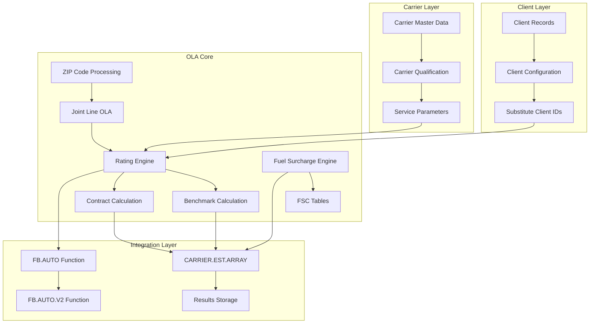
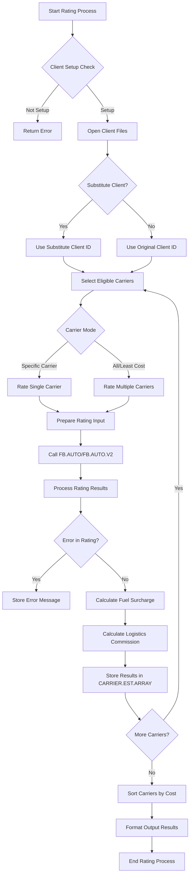
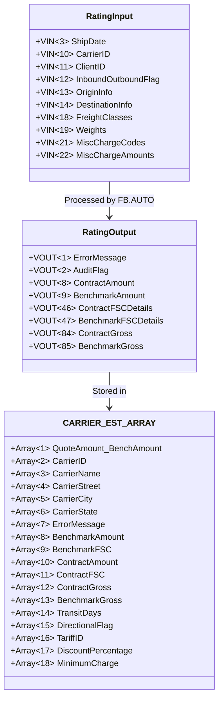
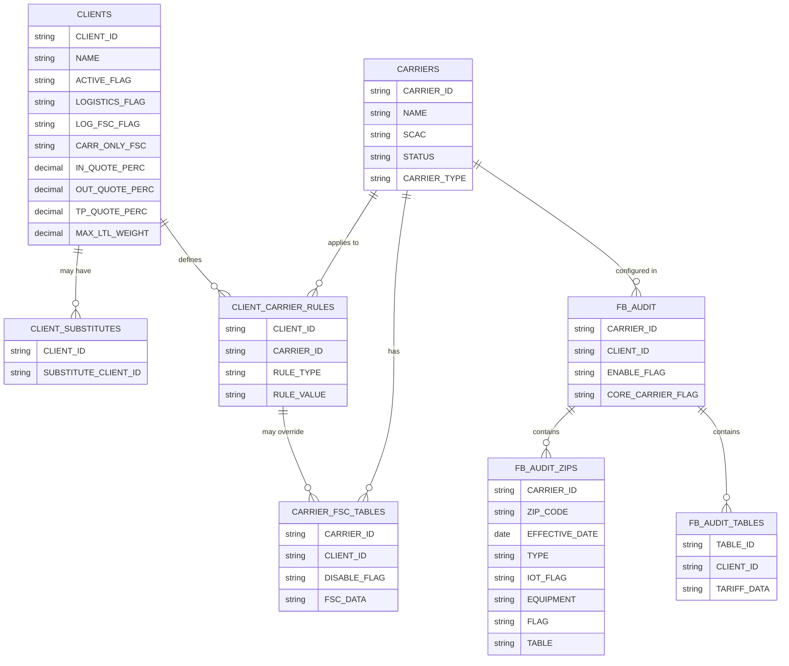

# OLA Integration in AFS Shreveport

## Introduction to OLA Integration

The Online Audit (OLA) system serves as a critical component within AFS Shreveport's freight rating and logistics operations. This sophisticated rating engine enables the platform to perform real-time calculations of freight costs across multiple carriers, applying complex business rules and client-specific configurations. OLA functions as the computational backbone for freight rating, allowing AFS to compare benchmark (gross) rates against negotiated contract rates, calculate appropriate fuel surcharges, and determine optimal carrier selection based on cost and service parameters.

The system's integration capabilities extend beyond simple rate calculations, enabling AFS Shreveport to maintain client-specific rating configurations, carrier qualification rules, and specialized tariff applications. By centralizing these rating functions, OLA provides consistency across the platform while still allowing for the flexibility required by different clients with unique shipping needs. The integration architecture connects client data, carrier information, rating engines, and output generation systems to deliver comprehensive freight cost analysis and optimization.

## OLA Integration Architecture



The OLA Integration Architecture diagram illustrates how the Online Audit system connects with other components in the AFS Shreveport platform. The architecture consists of four main layers:

1. **Client Layer**: Manages client-specific configurations, including substitute client IDs for specialized rating scenarios. This layer ensures that each client's unique rating requirements are properly applied.

2. **Carrier Layer**: Handles carrier master data, qualification rules, and service parameters. This layer determines which carriers are eligible for rating based on client requirements and carrier capabilities.

3. **OLA Core**: Contains the rating engines that perform benchmark and contract calculations, fuel surcharge processing, and ZIP code handling including joint line OLA functionality.

4. **Integration Layer**: Provides the interface functions (FB.AUTO, FB.AUTO.V2) that other system components use to access OLA functionality, and manages the storage of rating results in the CARRIER.EST.ARRAY structure.

The architecture enables seamless integration between client requirements, carrier capabilities, and sophisticated rating algorithms to deliver accurate and optimized freight costs.

## Client Configuration and Substitution

The OLA system employs a sophisticated client configuration mechanism that allows for highly customized rating scenarios. At the core of this functionality is the client substitution feature, which enables the system to use alternative client setups for rating purposes while maintaining the original client association for business processes.

When a client requires specialized rating parameters that differ from their standard configuration, the system can be configured with a substitute client ID. This is implemented through the `FB.AUDIT` file, where a `SUBSTITUTE` record can contain an alternative client ID. For example, in the `JOINT.LINE.REPORT` program, the system checks for substituted OLAs by reading from this record:

```
READ DAUDIT FROM F.AUDIT,'SUBSTITUTE' THEN
   SUBSTITUTE.LIST<-1>=CLIENT.ID:' has been substituted with OLA ':DAUDIT<1>
END
```

This substitution mechanism allows AFS to maintain separate rating configurations for the same client under different scenarios. For instance, a client might have different rating requirements for domestic versus international shipments, or for specific product lines. Rather than duplicating all client settings, the substitution approach provides a more maintainable solution.

The client configuration also includes parameters that control how rates are calculated, such as:
- Logistics commission percentages
- Fuel surcharge calculation methods
- Maximum LTL weight thresholds
- Quote percentages for inbound, outbound, and third-party shipments
- Benchmark minimum flags
- Carrier-specific fuel surcharge overrides

These configurations ensure that the OLA system applies the correct business rules when calculating rates for each client, whether using their primary configuration or a substituted one.

## Carrier Selection and Qualification

The carrier selection and qualification process within the OLA system is a sophisticated mechanism that determines which carriers are eligible for rating based on multiple parameters. This process ensures that only appropriate carriers are considered for each shipment, based on client requirements, carrier capabilities, and routing parameters.

The selection process begins with a SQL-like query that filters carriers based on specific criteria. For example, in the `RERATE.SUB` code:

```
STMT= 'SELECT FB.AUDIT,':AUDIT.CLIENT.ID
STMT:=' WITH 1 = "LTLALL"'
IF CARRIER.ID # 'ALL' THEN
   STMT:=" AND WITH CARRIER# '":CARRIER.ID:"'"
END ELSE
   STMT:=' AND WITH 11 = "ENABLE"'
   STMT:=' AND WITH 13 = "Y"'      ; * Core Carrier Flag = "Y"
END
```

This query selects carriers that are configured for LTL (Less Than Truckload) shipments, are enabled in the system, and are designated as "core carriers" for the client. The core carrier designation is particularly important as it indicates carriers with whom the client has negotiated contracts.

After the initial selection, carriers undergo further qualification checks:

1. **Carrier Status Verification**: The system checks if the carrier is active:
   ```
   CHECK.CARRIER.STATUS = CHECK.CARRIER.REC<89>
   IF CHECK.CARRIER.STATUS = "I" THEN
      ERROR = "CARRIER IS NOT ACTIVE - CARRIER# ":CHECK.CARRIER.ID
      RETURN
   END
   ```

2. **OLA Setup Validation**: The system verifies that the carrier is properly configured for online auditing:
   ```
   READ D.AUDIT FROM F.AUDIT, CHECK.CARRIER.ID ELSE
      ERROR = "CARRIER NOT SETUP FOR AUTO AUDIT - CARRIER#":CHECK.CARRIER.ID
      RETURN
   END
   IF D.AUDIT<11>#'ENABLE' THEN
      ERROR='Not Considered in On-Line Audit - Carrier Disabled'
      RETURN
   END
   ```

3. **Route Qualification**: For each shipment, the system determines if the carrier services the specific origin-destination pair:
   ```
   IF AUDIT # "Y" AND CARRIER.ID="ALL" THEN GO GET.NEXT.CARRIER
   IF AUDIT = "MA" THEN ERROR = "Not an approved carrier for this shipment!"
   ```

4. **Weight Threshold Validation**: The system checks if the shipment weight falls within the carrier's acceptable range:
   ```
   MAX.LTL=15000
   IF DCLIENTS<150>#'' THEN MAX.LTL=DCLIENTS<150>
   A.VIN<46>=MAX.LTL
   ```

This multi-layered qualification process ensures that only carriers that meet all the necessary criteria are considered for rating, resulting in accurate and appropriate carrier selection for each shipment.

## Rating Process Flow



The Rating Process Flow diagram illustrates the step-by-step process of how shipments are rated through the OLA system. The process begins with validating client setup and determining whether to use a substitute client ID. After opening the necessary client files, the system selects eligible carriers based on the specified mode (specific carrier or least cost).

For each carrier, the system prepares the rating input parameters, calls the FB.AUTO or FB.AUTO.V2 function to perform the actual rating calculations, and processes the results. If no errors occur, the system calculates fuel surcharges and logistics commissions, then stores the results in the CARRIER.EST.ARRAY structure.

After processing all carriers, the system sorts them by cost to identify the least expensive option, formats the output results, and completes the rating process. This comprehensive flow ensures accurate and optimized freight rating for each shipment.

## Benchmark vs. Contract Rate Calculation

The OLA system employs a sophisticated dual-rating approach that calculates both benchmark (gross) rates and contract rates for each shipment. This methodology is fundamental to AFS Shreveport's value proposition, as it enables the quantification of savings achieved through negotiated carrier contracts.

**Benchmark Rate Calculation:**
The benchmark rate represents the standard or "list" price that would be charged without any negotiated discounts. It serves as a baseline for measuring savings. The calculation process involves:

1. Selecting the appropriate tariff based on the carrier, shipment characteristics, and effective date:
   ```
   READ DTARIFF.DATE.XREF FROM F.TABLES,'TARIFF.DATE.XREF' ELSE DTARIFF.DATE.XREF=''
   READ DTARIFFS FROM F.TABLES,'TARIFFS' ELSE DTARIFFS=''
   ```

2. Applying the base rate from the tariff based on origin-destination pair, freight class, and weight:
   ```
   BENCH.AMT = A.VOUT<9>
   BENCH.GRS = A.VOUT<85>
   ```

3. Adding applicable fuel surcharges to the benchmark rate:
   ```
   BEGIN CASE
      CASE A.VIN<49>='Y'
         BENCH.FSC.AMT=A.VOUT<47,7>
      CASE A.VIN<49>='C'
         BENCH.FSC.AMT=A.VOUT<47,7>
      CASE A.VIN<49>='O'
         BENCH.FSC.AMT=A.VOUT<83,7>
      CASE 1
         BENCH.FSC.AMT=A.VOUT<48,7>
   END CASE
   ```

**Contract Rate Calculation:**
The contract rate reflects the negotiated pricing that applies to the client. The calculation includes:

1. Applying client-specific discounts to the base rate:
   ```
   CONTR.AMT = A.VOUT<8>
   CONTR.GRS = A.VOUT<84>
   ```

2. Adding contract-specific fuel surcharges:
   ```
   CONTR.FSC.AMT=A.VOUT<46,7>
   ```

3. Incorporating any negotiated accessorial charges or special pricing arrangements.

The system maintains separate fuel surcharge tables for benchmark and contract calculations, allowing for different surcharge rates to be applied:
```
READ BENCH.DFSC FROM F.NFSC,CHECK.CARRIER.ID ELSE BENCH.DFSC=''
IF BENCH.DFSC<30>='DISABLE' THEN
   BENCH.DFSC=''                   ; ** No Effect
   CONTR.DFSC=''
END ELSE
   READ CONTR.DFSC FROM F.NFSC,CHECK.CARRIER.ID:"*":AUDIT.CLIENT.ID ELSE CONTR.DFSC=BENCH.DFSC
   IF CONTR.DFSC<30>='DISABLE' THEN CONTR.DFSC=''
END
```

The difference between benchmark and contract rates represents the savings achieved through negotiated contracts. This savings amount is often used to calculate logistics commissions:
```
IF LOGISTICS THEN
   LOCATE RATE.DATE IN DCLIENTS<84> BY 'AR' SETTING POS ELSE
      POS=POS-1
   END
   COMM.PERC = DCLIENTS<85,POS>
   SAVINGS = BENCH.AMT-CONTR.AMT
   LOG.COMM = SAVINGS*COMM.PERC/100
   CL.SAVINGS = SAVINGS - LOG.COMM
   SAVINGS.QUOTE.AMT = CL.SAVINGS*(1-SAVINGS.QUOTE.PERC/10000)
   QUOTE.AMT=OCONV(CONTR.AMT + LOG.COMM + SAVINGS.QUOTE.AMT,'MR0')
END ELSE
   QUOTE.AMT=CONTR.AMT
END
```

This dual-rating approach provides transparency into the value delivered by AFS Shreveport's freight management services and forms the basis for performance metrics and client reporting.

## Fuel Surcharge Handling

Fuel surcharge handling in the OLA system represents one of the most complex aspects of the rating process, with multiple calculation methods and client-specific configurations. The system accommodates various fuel surcharge scenarios based on client preferences, carrier-specific rules, and market conditions.

The fuel surcharge calculation begins with determining which calculation method to use. The system supports multiple approaches:

1. **Client-controlled fuel surcharge calculation**: When clients have specific fuel surcharge requirements that override carrier defaults:
   ```
   CL.LOG.FSC=DCLIENTS<111>
   A.VIN<35>=CL.LOG.FSC='N'           ; * Flag to NOT Calculate Log FSC
   ```

2. **Carrier-only fuel surcharge calculation**: When the client configuration specifies to use only carrier fuel surcharges:
   ```
   CARR.ONLY.FSC=DCLIENTS<189>
   A.VIN<49>=CARR.ONLY.FSC
   ```

3. **Hybrid approach**: Different calculation methods for benchmark vs. contract rates:
   ```
   BEGIN CASE
      CASE A.VIN<49>='Y'
         BENCH.FSC.AMT=A.VOUT<47,7>
      CASE A.VIN<49>='C'
         BENCH.FSC.AMT=A.VOUT<47,7>
      CASE A.VIN<49>='O'
         BENCH.FSC.AMT=A.VOUT<83,7>
      CASE 1
         BENCH.FSC.AMT=A.VOUT<48,7>
   END CASE
   ```

The system also supports carrier-specific overrides for particular clients, allowing for highly customized fuel surcharge handling:
```
IF AUDIT.CLIENT.ID='01505' THEN
   CARR.ONLY.FSC=DCLIENTS<189>
   IF CARR.ONLY.FSC='Y' OR CARR.ONLY.FSC='C' THEN
      BEGIN CASE
         CASE CHECK.CARRIER.ID='00124'
            CARR.ONLY.FSC='N'
         CASE CHECK.CARRIER.ID='01786'
            CARR.ONLY.FSC='N'
         CASE CHECK.CARRIER.ID='05156'
            CARR.ONLY.FSC='N'
         CASE CHECK.CARRIER.ID='08924'
            CARR.ONLY.FSC='N'
      END CASE
   END
   A.VIN<49>=CARR.ONLY.FSC
END
```

The fuel surcharge tables themselves are stored in the FB.NFSC file, with separate tables for benchmark and contract calculations:
```
READ BENCH.DFSC FROM F.NFSC,CHECK.CARRIER.ID ELSE BENCH.DFSC=''
IF BENCH.DFSC<30>='DISABLE' THEN
   BENCH.DFSC=''                   ; ** No Effect
   CONTR.DFSC=''
END ELSE
   READ CONTR.DFSC FROM F.NFSC,CHECK.CARRIER.ID:"*":AUDIT.CLIENT.ID ELSE CONTR.DFSC=BENCH.DFSC
   IF CONTR.DFSC<30>='DISABLE' THEN CONTR.DFSC=''
END
```

The system also handles special cases where the fuel surcharge calculation method depends on the effective date of the shipment, allowing for historical accuracy in rerating scenarios:
```
IF CARR.ONLY.FSC # "Y" THEN
   BENCH.DFSC=CONTR.DFSC
END
```

This sophisticated fuel surcharge handling ensures that the OLA system can accurately calculate fuel surcharges according to the specific requirements of each client-carrier relationship, providing flexibility while maintaining consistency in the rating process.

## Data Structure for Rating Results



The CARRIER.EST.ARRAY is a sophisticated multi-dimensional data structure that serves as the central repository for storing and organizing rating results in the OLA system. This array enables efficient comparison of rates across multiple carriers and provides a comprehensive view of all rating components.

The structure uses MultiValue database capabilities to store multiple attributes for each carrier in a hierarchical format. The first dimension (rows) represents individual carriers, while the second dimension (columns) contains specific data points for each carrier.

Key elements of the CARRIER.EST.ARRAY structure include:

1. **Quote and Benchmark Amounts**: The first attribute combines quote amount and benchmark amount, separated by an underscore. This format allows for easy sorting by cost while maintaining the relationship between quote and benchmark values.

2. **Carrier Identification**: Attributes 2-6 store carrier identification information, including carrier ID, name, and address details.

3. **Error Handling**: Attribute 7 stores any error messages encountered during the rating process for the specific carrier.

4. **Rate Components**: Attributes 8-13 store detailed rate components, including benchmark amount, benchmark fuel surcharge, contract amount, contract fuel surcharge, and gross amounts.

5. **Service Information**: Attributes 14-15 store transit days and directional flags, providing insight into service levels.

6. **Tariff Details**: Attributes 16-18 store information about the tariff used, including tariff ID, discount percentage, and minimum charge.

The array is populated during the rating process and is typically sorted by quote amount to identify the least-cost carrier:

```
LOCATE (QUOTE.AMT:'_':BENCH.AMT) IN CARRIER.EST.ARRAY<1> BY 'AR' SETTING POS ELSE NULL
INS (QUOTE.AMT:'_':BENCH.AMT) BEFORE CARRIER.EST.ARRAY<1,POS>
INS CHECK.CARRIER.ID BEFORE CARRIER.EST.ARRAY<2,POS>
INS CHECK.CARRIER.NAME BEFORE CARRIER.EST.ARRAY<3,POS>
INS CHECK.CARRIER.STREET BEFORE CARRIER.EST.ARRAY<4,POS>
INS CHECK.CARRIER.CITY BEFORE CARRIER.EST.ARRAY<5,POS>
INS CHECK.CARRIER.STATE BEFORE CARRIER.EST.ARRAY<6,POS>
INS OLA.ERROR BEFORE CARRIER.EST.ARRAY<7,POS>
INS BENCH.AMT BEFORE CARRIER.EST.ARRAY<8,POS>
INS BENCH.FSC.AMT BEFORE CARRIER.EST.ARRAY<9,POS>
INS CONTR.AMT BEFORE CARRIER.EST.ARRAY<10,POS>
INS CONTR.FSC.AMT BEFORE CARRIER.EST.ARRAY<11,POS>
INS CONTR.GRS BEFORE CARRIER.EST.ARRAY<12,POS>
INS BENCH.GRS BEFORE CARRIER.EST.ARRAY<13,POS>
```

This structured approach to storing rating results enables efficient comparison of carriers, comprehensive reporting, and seamless integration with other system components that need access to rating information.

## Joint Line OLA Processing

Joint Line OLA (Origin Line Allowance) processing represents a specialized aspect of the OLA system that handles complex routing scenarios where multiple carriers collaborate to service a single shipment. This functionality is particularly important for shipments that traverse regions where a single carrier may not have complete coverage.

The Joint Line OLA process involves analyzing and applying specific allowances or adjustments to rates when shipments require transfers between carriers at junction points. The system maintains detailed records of these joint line arrangements in the FB.AUDIT.ZIPS files, which store carrier-specific OLA information for particular ZIP codes.

As seen in the JOINT.LINE.REPORT program, the system processes joint line OLA information by examining audit records for each client:

```
OPEN '','FB.AUDIT.ZIPS,':CLIENT.ID TO F.AUDIT.ZIP ELSE
   GOTO SKIP.CLIENT
END
STMT = 'SSELECT FB.AUDIT.ZIPS,':CLIENT.ID
EXECUTE STMT RTNLIST FB.AUD.ZIP CAPTURING OUTPUT
IF @SELECTED < 1 THEN
   GOTO SKIP.CLIENT
END
```

For each ZIP code record, the system extracts detailed information about the joint line arrangement:

```
CARRIER.ID=FIELD(FB.AUDIT.ZIP.ID,'*',1)
READV CARRIER.NAME FROM F.CARRIERS,CARRIER.ID,1 ELSE CARRIE.NAME='Unknown'
ZIP=FIELD(FB.AUDIT.ZIP.ID,'*',2)
EFF.DATE=FIELD(FB.AUDIT.ZIP.ID,'*',3)
TYPE=FIELD(FB.AUDIT.ZIP.ID,'*',4)
IOT=FIELD(FB.AUDIT.ZIP.ID,'*',5)
EQUIPMENT=FIELD(FB.AUDIT.ZIP.ID,'*',6)
```

The system also looks for special "ZZZ" markers in the audit data that indicate flag and table information relevant to the joint line processing:

```
LOCATE "ZZZ" IN DAUDIT.ZIP<3> SETTING POS THEN
   FLAG=DAUDIT.ZIP<4,POS>
   TABLE=DAUDIT.ZIP<5,POS>
END ELSE
   FLAG=''
   TABLE=''
END
```

This information is then used during the rating process to apply appropriate adjustments to the freight rates. When a shipment involves a joint line scenario, the system may need to:

1. Apply special discounts or surcharges based on the junction point
2. Use different rating tables for portions of the route
3. Consider equipment type restrictions at transfer points
4. Apply carrier-specific rules for joint line operations

The Joint Line OLA processing ensures that rates accurately reflect the complexities of multi-carrier routing while maintaining the integrity of client-specific pricing agreements. This specialized handling is crucial for clients with operations in areas where carrier coverage may be limited or where specific routing requirements necessitate the use of multiple carriers.

## Logistics Commission Calculation

The logistics commission calculation is a critical component of the OLA system that determines the compensation for AFS Shreveport's services based on the savings achieved between benchmark and contract rates. This calculation reflects the value-added aspect of AFS's freight management services and is typically configured on a client-specific basis.

The commission calculation process begins by determining if the client is configured for logistics commissions:

```
LOGISTICS=DCLIENTS<93>='Y'
```

If logistics commissions are enabled, the system retrieves the appropriate commission percentage based on the shipment date:

```
IF LOGISTICS THEN
   LOCATE RATE.DATE IN DCLIENTS<84> BY 'AR' SETTING POS ELSE
      POS=POS-1
   END
   COMM.PERC = DCLIENTS<85,POS>
```

This approach allows for commission percentages to change over time, with the system automatically applying the correct percentage based on when the shipment occurred.

The actual commission calculation is based on the savings between benchmark and contract rates:

```
SAVINGS = BENCH.AMT-CONTR.AMT
LOG.COMM = SAVINGS*COMM.PERC/100
```

The system also calculates client savings after the commission is applied:

```
CL.SAVINGS = SAVINGS - LOG.COMM
```

In some cases, the system applies an additional calculation to determine a "quote amount" that includes both the contract rate and the logistics commission:

```
SAVINGS.QUOTE.AMT = CL.SAVINGS*(1-SAVINGS.QUOTE.PERC/10000)
QUOTE.AMT=OCONV(CONTR.AMT + LOG.COMM + SAVINGS.QUOTE.AMT,'MR0')
```

The SAVINGS.QUOTE.PERC variable is determined based on the shipment type (inbound, outbound, or third-party):

```
BEGIN CASE
   CASE IOT = "I"
      IOT.DESC = "Inbound"
      SAVINGS.QUOTE.PERC=IN.QUOTE.PERC
   CASE IOT = "O"
      IOT.DESC = "Outbound"
      SAVINGS.QUOTE.PERC=OUT.QUOTE.PERC
   CASE IOT = "T"
      IOT.DESC = "Third Party"
      SAVINGS.QUOTE.PERC=TP.QUOTE.PERC
END CASE
```

This approach allows for different commission structures based on the direction of the freight movement.

The logistics commission calculation is a fundamental aspect of AFS Shreveport's business model, providing a transparent mechanism for quantifying the value delivered through their freight management services. By tying commissions directly to the savings achieved, the system aligns AFS's compensation with the benefits provided to clients.

## Client-Carrier Relationship Model



The Client-Carrier Relationship Model diagram illustrates the complex interconnections between clients, carriers, and OLA configurations in the AFS Shreveport system. This entity relationship diagram shows how the system manages the many-to-many relationships between clients and carriers, with various configuration tables that define the specific rules and parameters for each relationship.

The model includes several key entities:

1. **CLIENTS**: Contains basic client information including identification, name, and various flags that control logistics and fuel surcharge behavior.

2. **CLIENT_SUBSTITUTES**: Manages the substitution relationships between clients, allowing one client's OLA setup to be used for another client.

3. **CARRIERS**: Stores carrier master data including identification, name, SCAC code, and status.

4. **FB_AUDIT**: The core configuration table that defines which carriers are enabled for which clients and whether they are designated as core carriers.

5. **FB_AUDIT_ZIPS**: Contains ZIP code-specific OLA information for each carrier, including effective dates, equipment types, and special flags.

6. **FB_AUDIT_TABLES**: Stores tariff data and other tabular information used in the rating process.

7. **CLIENT_CARRIER_RULES**: Defines specific rules that apply to particular client-carrier combinations.

8. **CARRIER_FSC_TABLES**: Contains fuel surcharge tables for carriers, with possible client-specific overrides.

This comprehensive data model supports the flexible and highly configurable nature of the OLA system, allowing for precise control over how rates are calculated for each unique client-carrier relationship.

## Output Generation and Reporting

The OLA system's output generation and reporting capabilities transform complex rating calculations into structured, actionable information for clients and internal stakeholders. The system produces various output formats, with Excel spreadsheets being the most common due to their flexibility and widespread use.

The output generation process begins with collecting and organizing the rating results stored in the CARRIER.EST.ARRAY structure. This array contains comprehensive information about each carrier's rates, including benchmark amounts, contract amounts, fuel surcharges, and other relevant details.

For Excel output, the system typically builds a header structure that defines the columns to be included in the report:

```
XHEAD1 = ""
XHEAD1      = "Inactive/Active"
XHEAD1<1,2> = "Client #"
XHEAD1<1,3> = "Client Name"
XHEAD1<1,4> = "Carrier #"
XHEAD1<1,5> = "Carrier Name"
XHEAD1<1,6> = "Zip Code"
XHEAD1<1,7> = "Effective Date"
XHEAD1<1,8> = "Type"
XHEAD1<1,9> = "I/O"
XHEAD1<1,10> = "Equipment"
XHEAD1<1,11> = "Flag"
XHEAD1<1,12> = "Table"
XLS.REC = XHEAD1
```

The system then populates the data rows based on the rating results:

```
XLINE=CL.ACTIVE
XLINE<1,2>=CLIENT.ID
XLINE<1,3>=CL.NAME
XLINE<1,4>=CARRIER.ID
XLINE<1,5>=CARRIER.NAME
XLINE<1,6>=ZIP
XLINE<1,7>=OCONV(EFF.DATE,'D2/')
XLINE<1,8>=TYPE
XLINE<1,9>=IOT
XLINE<1,10>=EQUIPMENT
XLINE<1,11>=FLAG
XLINE<1,12>=TABLE
XLS.REC<-1>=XLINE
```

For Excel compatibility, the system converts MultiValue delimiters to tab characters:

```
CONVERT @VM TO CHAR(9) IN XLS.REC
```

The system also includes retry logic for file writing operations to ensure reliable output generation:

```
TRY.CNT = 1
TRY.WRITE:
   WRITE XLS.REC ON F.BILLDATA, ID.XLS ELSE
      IF TRY.CNT LE 3 THEN
         GOTO TRY.WRITE
      END ELSE
         CALL ELINE("Unable to save file ":ID.XLS:" to your U: drive")
      END
   END
```

For more complex reports, the system can generate Excel formulas directly in the output to enable automatic calculation of totals and other derived values:

```
XLS.REC<ROW,COL>='"=SUM(R[-':NROWS:']C:R[-1]C)"'
```

The output formats are designed to be both comprehensive and user-friendly, providing detailed information about rates, carriers, and potential savings. Reports typically include:

1. Benchmark and contract rates for comparison
2. Fuel surcharge breakdowns
3. Logistics commission calculations
4. Carrier service information (transit times, directional flags)
5. Tariff identifiers and discount percentages
6. Error messages for failed rating attempts

These reports serve multiple purposes, including carrier selection, cost analysis, audit verification, and performance tracking. The flexible output generation capabilities of the OLA system ensure that stakeholders have access to the information they need in a format that supports effective decision-making.

[Generated by the Sage AI expert workbench: 2025-05-28 08:06:29  https://sage-tech.ai/workbench]: #