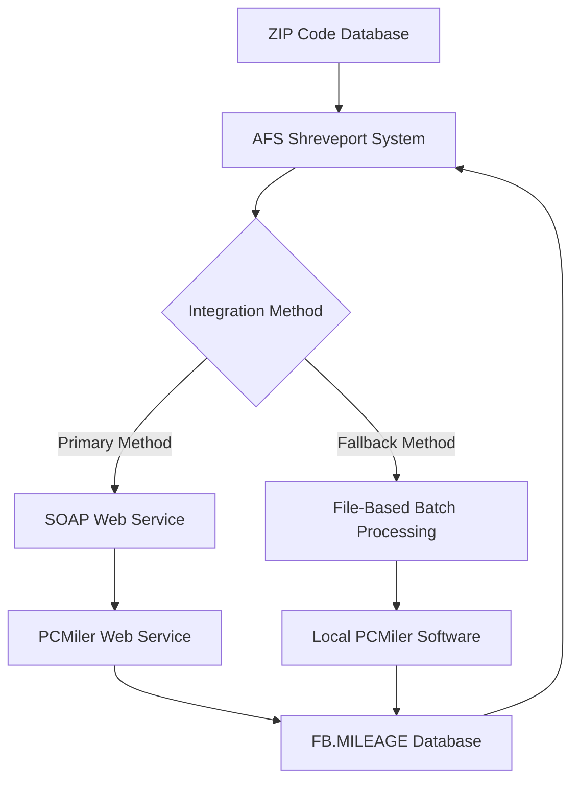
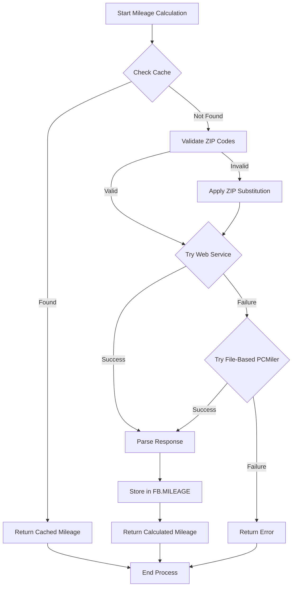
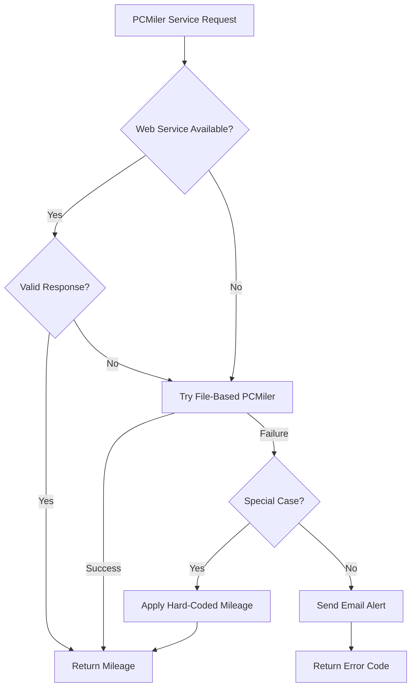

# PCMiler Integration in AFS Shreveport

## Overview of PCMiler Integration

PCMiler integration in AFS Shreveport serves as a critical component for calculating distances between locations throughout the freight billing operations. The system leverages ALK Technologies' PCMiler software to provide accurate mileage calculations, which are essential for determining freight rates, fuel surcharges, and other distance-based billing components. This integration enables the AFS Shreveport system to obtain reliable distance data without manual intervention, ensuring consistency and accuracy in freight billing calculations.

## Integration Architecture

The PCMiler integration in AFS Shreveport is implemented through a hybrid architecture that combines both file-based batch processing and modern web service calls. The system has evolved over time from an older file-based approach (using PCMiler versions 9, 10, 16, and 27) to a more modern SOAP web service implementation. The architecture maintains backward compatibility by supporting both methods, with the web service approach being the primary method and the file-based approach serving as a fallback mechanism when the web service is unavailable. This dual-approach ensures high availability of mileage calculation services while leveraging the benefits of modern web service technology.

The integration architecture shows how AFS Shreveport connects with PCMiler through different methods. The system first attempts to use the SOAP web service for real-time mileage calculations. If that fails, it falls back to the file-based batch processing method using locally installed PCMiler software. Both methods store results in the FB.MILEAGE database for future reference, creating a caching layer that improves performance by avoiding redundant calculations.

## ZIP Code Handling and Validation

The system implements sophisticated ZIP code handling and validation processes to ensure accurate mileage calculations. It supports both US ZIP codes (5-digit format) and Canadian postal codes (in the format 1A1N1A1N1A1N), with special handling for the Canadian format to ensure compatibility with PCMiler. The system maintains a comprehensive ZIP code database (ZIPS.CODES) that stores city, state, and county information for each ZIP code, which is used for validation and display purposes.

For problematic ZIP codes that PCMiler doesn't recognize, the system implements a substitution mechanism. Originally, this was handled through hard-coded substitutions in the code, but it evolved to a table-driven approach that allows business users to maintain their own substitution list. When a ZIP code isn't found in PCMiler's database, the system attempts to substitute it with a nearby valid ZIP code to ensure mileage calculations can still be performed.

## Mileage Calculation Process

The mileage calculation process in AFS Shreveport follows a systematic workflow that begins with input validation and ends with storing calculated distances for future use. The process is designed to be efficient by checking for existing mileage data before making external calls to PCMiler services.

The workflow illustrates how the system first checks if the requested mileage calculation already exists in the FB.MILEAGE database. If found, it returns the cached value immediately. Otherwise, it validates the ZIP codes and attempts to calculate the mileage using the PCMiler web service. If the web service fails, it falls back to the file-based PCMiler approach. Once calculated, the mileage is stored in the database for future reference and returned to the calling program.

## Caching and Database Storage

The AFS Shreveport system implements an efficient caching mechanism by storing mileage data in the FB.MILEAGE database. This approach significantly reduces the number of external calls to PCMiler services, improving system performance and reducing dependency on external services. When a mileage calculation is requested, the system first checks if the origin-destination pair already exists in the database. If found, it returns the stored value without making an external call.

The caching system stores not only the calculated mileage but also additional information such as city and state data for both origin and destination locations. This comprehensive approach allows the system to provide detailed location information along with mileage data in a single database lookup. The FB.MILEAGE database is structured to support fast lookups using origin-destination pairs as keys, ensuring efficient retrieval of cached data.

## Error Handling and Fallback Mechanisms

The PCMiler integration includes robust error handling and fallback mechanisms to ensure continuity of operations even when PCMiler services encounter issues. The system implements a multi-layered approach to handle various failure scenarios, from temporary service unavailability to permanent errors with specific ZIP codes.

The fallback strategy flowchart demonstrates how the system handles PCMiler service failures. When the web service is unavailable, the system automatically falls back to the file-based PCMiler approach. If both methods fail, it checks for special cases (such as specific client-carrier combinations with predefined mileages) and applies hard-coded values when applicable. For unresolvable errors, the system sends email alerts to administrators and returns appropriate error codes to the calling program.

## SOAP Web Service Implementation

The modern PCMiler integration leverages SOAP web service technology to communicate with PCMiler's online services. The implementation uses Universe's built-in SOAP functions to create requests, submit them to the PCMiler web service, and parse the responses. The SOAP implementation includes proper XML namespace handling, request formatting according to PCMiler's specifications, and response parsing to extract mileage data.

The web service implementation offers several advantages over the file-based approach, including:

1. Real-time mileage calculations without the need for local PCMiler software installation
2. Support for the latest PCMiler versions and features
3. Reduced dependency on local file system operations
4. Improved error handling with detailed SOAP fault information
5. Better scalability for high-volume mileage calculation needs

The SOAP implementation includes retry logic with configurable timeout settings to handle temporary service disruptions, and it supports secure connections when required. The system also includes detailed logging capabilities for troubleshooting and performance monitoring.

## Business Applications and Impact

PCMiler integration affects multiple aspects of freight billing, rate calculations, and route planning in the AFS Shreveport system. The accurate mileage data provided by PCMiler is used throughout the system for various business functions:

1. **Freight Rate Calculations**: Distance is a fundamental component in determining freight rates, especially for truckload shipments where rates are often calculated per mile.

2. **Fuel Surcharge Calculations**: The CALC.TL.FSC subroutine uses PCMiler to calculate accurate distances for determining fuel surcharges when miles aren't provided in the input data.

3. **Route Planning and Optimization**: The FB.2.1.TL.ROUTE program uses PCMiler to calculate total route mileage for multi-stop shipments, helping optimize delivery routes.

4. **Variance Detection**: The system compares PCMiler-calculated mileage with carrier-billed mileage to identify potential overcharges or billing errors.

5. **Benchmark Analysis**: PCMiler mileage serves as a standard reference point for comparing carrier performance and identifying cost-saving opportunities.

The integration's reliability and accuracy directly impact the financial aspects of freight billing operations, making it a critical component of the AFS Shreveport system. By providing consistent and trustworthy mileage data, the PCMiler integration helps ensure fair billing practices and supports data-driven decision-making throughout the freight management process.

[Generated by the Sage AI expert workbench: 2025-05-28 08:06:28  https://sage-tech.ai/workbench]: #