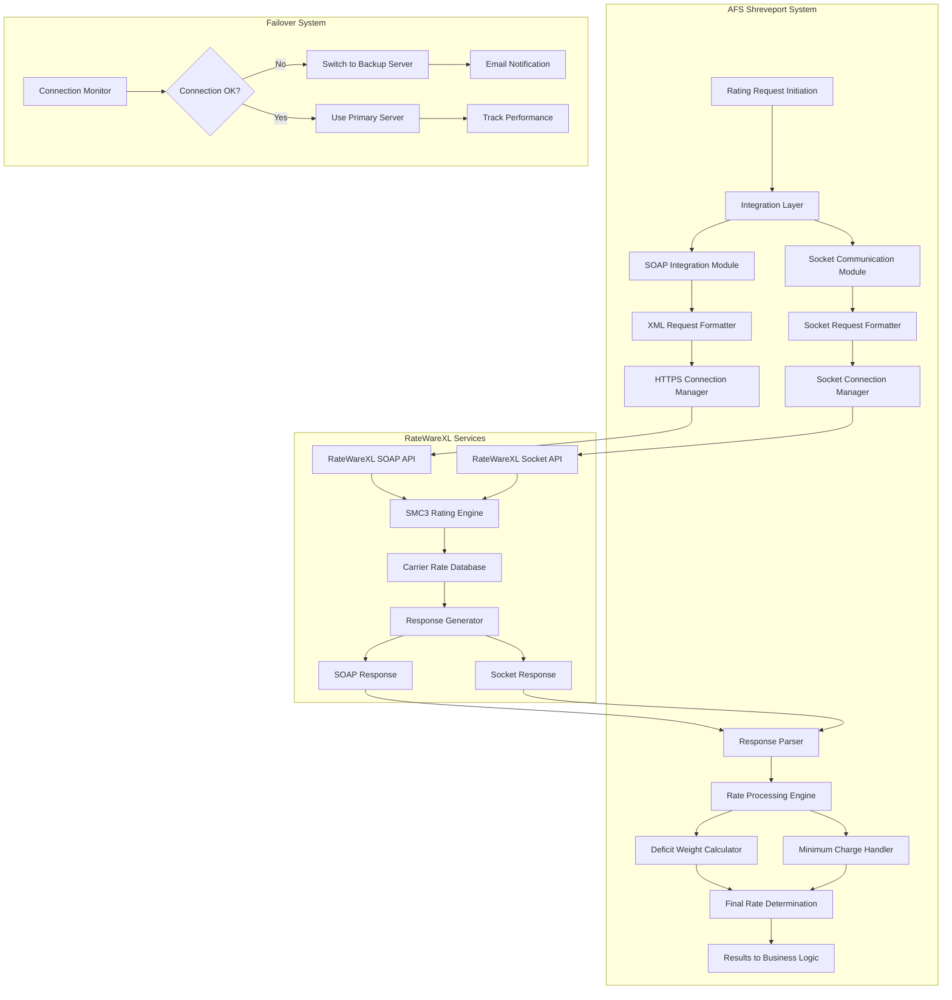
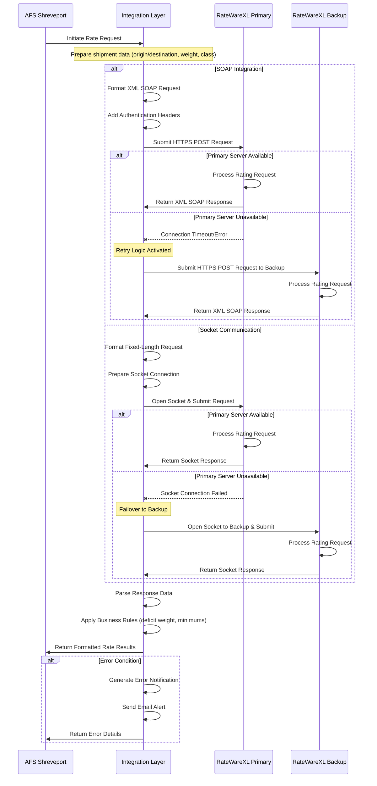
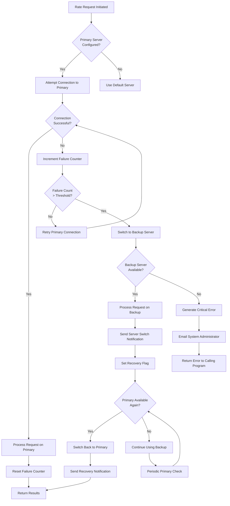
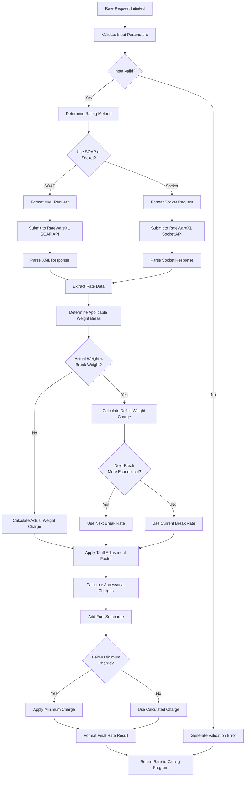

# RateWareXL Integration in AFS Shreveport

## RateWareXL Integration Overview

RateWareXL is SMC3's enterprise-grade freight rating engine that provides accurate and reliable freight rates for Less-Than-Truckload (LTL) and other shipping operations. Within the AFS Shreveport system, RateWareXL serves as a critical integration point for obtaining carrier-specific rates, transit times, and service information. The integration enables AFS Shreveport to perform real-time rate calculations, deficit weight adjustments, and minimum charge determinations based on origin/destination pairs, weight, freight class, and applicable tariffs. This integration is fundamental to the system's ability to provide accurate freight billing, audit capabilities, and comparative rate analysis for clients. RateWareXL's comprehensive carrier database and rating algorithms allow AFS Shreveport to handle complex rating scenarios including specialized tariffs, discounts, and surcharges, ensuring that freight costs are calculated with precision across multiple carriers and service types.

## RateWareXL Integration Architecture

The architecture diagram illustrates how AFS Shreveport integrates with RateWareXL through two distinct communication methods: SOAP web services and direct socket connections. The system maintains a sophisticated failover mechanism that monitors connection status and automatically switches between primary and backup servers when issues arise. 

The integration layer handles request formatting, authentication, and connection management, while the response parser extracts relevant rate information from RateWareXL's responses. The rate processing engine applies business rules including deficit weight calculations and minimum charge determinations before passing the final rates to the business logic layer of the AFS Shreveport system. This dual-protocol approach provides flexibility and resilience, ensuring continuous availability of rating services even when one communication method experiences issues.

## Integration Methods: SOAP vs Socket Communication

AFS Shreveport implements two distinct methods for integrating with RateWareXL: SOAP web services and direct socket communication. Each approach offers specific advantages and is used in different contexts within the system.

The SOAP integration (implemented in files like GVL.RERATE.RWXL and RWXL.V2) leverages standard web service protocols over HTTPS. This method provides a structured, XML-based approach with built-in security through TLS 1.2. The SOAP implementation constructs detailed XML requests containing shipment information, carrier details, and tariff specifications. It benefits from standard web service features like automatic retries, connection pooling, and comprehensive error reporting. The SOAP approach is particularly valuable for complex rating scenarios that require detailed responses and is more resilient to network interruptions due to the stateless nature of HTTP.

In contrast, the socket communication method (implemented in files like RWS, RWS.GBT, and RWS.SVC) establishes direct TCP/IP connections to the RateWareXL server. This approach uses a more compact, fixed-length field format for requests and responses, resulting in potentially faster performance for high-volume rating operations. The socket implementation includes custom-built connection management, with timeout handling and server failover capabilities. While requiring more manual error handling and connection management, the socket approach offers lower overhead for simple rating requests and can be more efficient for batch processing scenarios.

Both integration methods share common functionality for ZIP code validation, substitution for problematic postal codes, and rate calculation logic including deficit weight handling and minimum charge determination. The system selects the appropriate integration method based on the specific rating scenario, available server resources, and the level of detail required in the response.

## Authentication and Security

Authentication and security are critical components of the RateWareXL integration in AFS Shreveport. The system implements multiple security measures to ensure secure and authorized access to the RateWareXL services.

For authentication, the system uses a multi-factor approach that includes license keys, usernames, and passwords. The SOAP integration embeds these credentials directly in the XML request headers. For example, in GVL.RERATE.RWXL, the system uses variables like `SMC.WEB.LICENSE.KEY`, `SMC.WEB.USERNAME`, and `SMC.WEB.PASSWORD` to authenticate with the RateWareXL service. These credentials are validated by the SMC3 server before any rating operations are performed.

The SOAP integration leverages TLS 1.2 security for all HTTPS connections, ensuring that data transmitted between AFS Shreveport and RateWareXL is encrypted. This is explicitly configured in RWXL.V2 where the system sets up the security context for the web service connections. The implementation includes certificate validation and secure cipher suites to prevent man-in-the-middle attacks and data interception.

For the socket-based integration, security is handled through a combination of dedicated connection credentials and network-level security. The socket connections use specific authentication parameters that are verified by the RateWareXL server before establishing the session. While the socket protocol itself doesn't include encryption, the connections typically operate over private networks or VPNs to ensure data security.

The system also implements access controls within AFS Shreveport to restrict which users and processes can initiate rating requests. This multi-layered security approach ensures that only authorized users can access the rating functionality and that sensitive shipment and pricing data remains protected throughout the integration process.

## Request/Response Flow

The sequence diagram illustrates the complete flow of data from AFS Shreveport to RateWareXL and back. The process begins when the AFS system initiates a rate request with shipment details. The integration layer then prepares the data and determines whether to use SOAP or socket communication.

For SOAP requests, the system formats an XML document with authentication headers and shipment details, then submits it via HTTPS POST. The RateWareXL server processes the request and returns an XML response containing rates, charges, and service information. If the primary server is unavailable, the system's retry logic activates and redirects the request to a backup server.

For socket communication, the system formats a fixed-length request packet according to RateWareXL specifications, establishes a socket connection to the server, and submits the request. The response is returned through the same socket connection. Similar to the SOAP approach, failover logic switches to a backup server if the primary connection fails.

After receiving the response, the integration layer parses the data, applies business rules such as deficit weight calculations and minimum charge determinations, and returns the formatted results to the calling application. Throughout this process, comprehensive error handling ensures that issues are properly detected, logged, and reported through email notifications when necessary.

## XML and Data Formatting

The AFS Shreveport system employs sophisticated data formatting techniques to ensure proper communication with the RateWareXL service across both SOAP and socket integration methods.

For SOAP integration, the system constructs XML requests through string concatenation, building a compliant SOAP envelope with the required namespaces and structure. In GVL.RERATE.RWXL, the XML request is assembled piece by piece, incorporating authentication credentials, shipment details, and tariff information. The XML structure follows SMC3's specifications, with elements like `<RateRequest>`, `<Shipment>`, and `<Item>` organized hierarchically. While this string-based approach lacks the safety of DOM-based XML construction, it provides performance benefits in the PICK BASIC environment. The system includes careful handling of special characters and ensures proper XML formatting to prevent parsing errors.

For socket communication, the system uses a different approach based on fixed-length fields. In files like RWS.SVC and RWS.GBT, the code formats request packets with precise field positioning and lengths according to RateWareXL's socket protocol specifications. The RWS.PREFIX subroutine specifically handles the formatting of prefix segments for socket communication, ensuring that numeric fields are right-justified and text fields are left-justified with proper padding. This fixed-length approach requires meticulous attention to field boundaries but offers efficient processing for high-volume rating operations.

Response parsing is equally sophisticated. For SOAP responses, the system extracts data from the XML structure, navigating through elements to retrieve rates, charges, and service information. For socket responses, the code parses fixed-length fields at specific positions, extracting values based on known field definitions. Both approaches include validation to ensure that the parsed data meets expected formats and ranges before being used in subsequent calculations.

The system also handles data type conversions, ensuring that numeric values are properly formatted for calculations and that text values are appropriately processed for display or storage. This comprehensive approach to data formatting ensures reliable communication with RateWareXL regardless of the integration method used.

## Error Handling and Failover Mechanisms

The AFS Shreveport system implements robust error handling and failover mechanisms to ensure reliable integration with RateWareXL services. These mechanisms address various failure scenarios, from network connectivity issues to data validation problems.

The error handling strategy begins with comprehensive input validation before requests are sent to RateWareXL. The system validates ZIP codes, weight values, and other shipment details to prevent avoidable errors. When invalid data is detected, the system generates specific error messages that identify the problematic fields and, in some cases, suggests corrections.

For network-related issues, the system implements a sophisticated retry logic. In both SOAP and socket integration methods, the code attempts multiple reconnections with increasing delays between attempts. For example, in GVL.RERATE.RWXL, the system makes up to three attempts to connect to the web service before declaring a failure. Similarly, the socket-based integration in RWS includes timeout handling and connection retry logic.

The server failover mechanism is a key component of the error handling strategy. The system maintains configuration information for both primary and backup RateWareXL servers. When connection issues with the primary server persist beyond the retry threshold, the system automatically switches to the backup server. This failover process is implemented in files like RWS.T and RWS.SVC, where the code tracks connection failures and makes server switching decisions based on configurable thresholds.

The notification system ensures that appropriate personnel are alerted when serious issues occur. Email notifications are sent for various error conditions, including persistent connection failures, invalid ZIP codes, and rating errors. These notifications include detailed diagnostic information such as request parameters, error codes, and timestamps to facilitate troubleshooting.

The system also maintains error counters and status flags to prevent excessive notifications and to track the overall health of the RateWareXL integration. When a previously failing connection is restored, the system generates recovery notifications and resets the error counters.

## Failover Process

The flowchart illustrates the detailed decision process for switching between primary and backup RateWareXL servers when connection issues occur. When a rate request is initiated, the system first checks if a primary server is configured. If so, it attempts to connect to that server.

If the connection is successful, the request is processed on the primary server and the failure counter is reset. However, if the connection fails, the system increments a failure counter and compares it against a configured threshold. If the failure count remains below the threshold, the system retries the primary connection. Once the threshold is exceeded, the system switches to the backup server.

The system then checks if the backup server is available. If it is, the request is processed on the backup server, and a server switch notification is sent to administrators. If the backup server is also unavailable, a critical error is generated, and the system administrator is notified via email.

After successfully switching to the backup server, the system sets a recovery flag and periodically checks if the primary server becomes available again. When the primary server is restored, the system can switch back to it and send a recovery notification.

This sophisticated failover process ensures continuous availability of rating services while minimizing disruption to business operations. The email notifications keep administrators informed of server status changes, allowing them to address underlying issues while the system continues to function using the available servers.

## ZIP Code Handling and Substitution

ZIP code handling and substitution is a critical component of the RateWareXL integration in AFS Shreveport. The system implements sophisticated mechanisms to validate postal codes and handle problematic or unrecognized ZIP codes that might otherwise cause rating failures.

The process begins with basic validation to ensure that origin and destination ZIP codes are properly formatted. The system verifies that ZIP codes contain the correct number of digits and fall within valid ranges for the countries involved. For international shipments, the system includes country code determination logic to ensure proper formatting of postal codes according to each country's standards.

A key feature of the ZIP code handling system is the substitution mechanism for problematic codes. RateWareXL occasionally lacks rating data for certain ZIP codes, particularly for newly created postal areas or remote locations. To address this, AFS Shreveport maintains a ZIP code substitution table that maps problematic codes to nearby valid alternatives. This table-driven approach, implemented in files like RWS and RWS.GBT, allows the system to dynamically substitute ZIP codes without requiring code changes when new substitutions are needed.

The substitution process is transparent to end users but includes logging to maintain an audit trail of the substitutions made. When a ZIP code substitution occurs, the system records both the original and substituted codes, along with the timestamp and user information. This logging helps identify patterns of problematic ZIP codes that might require updates to the RateWareXL database.

For international shipments, the system includes additional logic to handle country-specific postal code formats and to ensure proper mapping between different postal code systems. This includes special handling for Canadian postal codes and other international formats that differ from the U.S. five-digit standard.

The system also implements email notifications for persistent ZIP code issues, alerting administrators when specific postal codes consistently cause rating problems. These notifications include details about the shipment and the specific ZIP codes involved, allowing for proactive resolution of systematic issues.

## Rate Calculation Logic

The rate calculation logic in the AFS Shreveport system's RateWareXL integration is sophisticated and comprehensive, handling various pricing scenarios and special cases to ensure accurate freight costs.

At its core, the rate calculation process begins with determining the applicable tariff based on carrier, shipment type, and effective date. The system supports multiple tariff types, including base rates, discounted rates, and contract-specific rates. Once the appropriate tariff is identified, the system retrieves the corresponding rate data from RateWareXL.

Deficit weight calculation is a critical component of the rate logic. When a shipment's actual weight falls below a carrier's minimum weight for a particular rate break, the system applies deficit rating. This involves calculating the charge based on the minimum weight for that rate break rather than the actual weight. The system compares charges at multiple weight breaks to determine the most cost-effective option, implementing the carrier's "greater than but not less than" rule that ensures the shipper pays the lower of the deficit weight charge or the charge at the next higher weight break.

Minimum charge handling ensures that no shipment is rated below the carrier's established minimum charge for a given lane or service level. The system compares the calculated freight charge against the applicable minimum charge and applies the higher value. This logic includes handling of absolute minimum charges that override all other calculations when applicable.

Tariff adjustment factors allow for percentage-based modifications to base rates. These adjustments can be applied at various levels, including carrier-wide, lane-specific, or client-specific factors. The system supports both upward and downward adjustments, enabling precise control over final rates.

For shipments exceeding maximum discount weights (typically around 10,000 pounds), the system implements special handling. It may split the rating calculation into multiple parts or apply ceiling limits to prevent excessive charges. This includes the implementation of a 99.99% discount on weights over specified thresholds, effectively capping the maximum charge.

The system also handles accessorial charges, fuel surcharges, and other additional fees based on shipment characteristics, origin/destination pairs, and carrier-specific rules. These charges are calculated separately and then combined with the base freight charge to determine the total shipment cost.

Throughout the calculation process, the system maintains detailed information about how each rate was determined, including the specific tariff used, weight breaks applied, and any adjustments made. This transparency supports subsequent auditing and verification processes.

## Rate Processing Workflow

This flowchart illustrates the complete process from initial rate request to final calculation in the RateWareXL integration. The workflow begins with input validation to ensure that all required parameters (origin/destination ZIP codes, weight, class, etc.) are present and properly formatted.

After validation, the system determines whether to use SOAP or socket communication based on configuration settings and the specific rating scenario. It then formats the appropriate request and submits it to the RateWareXL service using the selected method.

Once the response is received, the system parses it to extract the relevant rate data. For multi-weight shipments, the system determines the applicable weight break and checks if the actual weight is less than the break weight. If so, it calculates a deficit weight charge and compares it with the charge at the next higher weight break to determine the most economical option.

The system then applies any applicable tariff adjustment factors, calculates accessorial charges based on shipment characteristics and location, and adds the appropriate fuel surcharge. It compares the resulting total against the carrier's minimum charge for the lane and applies the minimum if necessary.

Finally, the system formats the rate result with all relevant details and returns it to the calling program. Throughout this process, comprehensive error handling ensures that any issues are properly detected and reported.

This sophisticated workflow ensures accurate and consistent rate calculations across all shipping scenarios, supporting the AFS Shreveport system's freight billing and audit capabilities.

## Performance Monitoring and Optimization

The AFS Shreveport system incorporates comprehensive performance monitoring and optimization strategies for its RateWareXL integration to ensure efficient and reliable operation. These strategies focus on tracking response times, optimizing request patterns, and maintaining high availability of rating services.

Performance monitoring begins with detailed timing metrics captured at various stages of the rating process. In files like GVL.RERATE.RWXL and RWS, the code includes timestamp tracking for key operations such as request formatting, connection establishment, data transmission, and response parsing. These timestamps allow the system to identify bottlenecks and track performance trends over time. The timing data is stored in log files and can be analyzed to detect performance degradation or unusual patterns that might indicate issues.

The system also tracks success and failure rates for rating requests, maintaining counters for various error types and connection issues. These metrics help identify recurring problems with specific carriers, lanes, or request types. When error rates exceed configured thresholds, the system generates alerts to notify administrators of potential issues.

For optimization, the system implements several strategies to improve performance. Connection pooling is used in the SOAP integration to reduce the overhead of establishing new connections for each request. The socket integration includes optimized request formatting to minimize data transmission and processing time.

Request batching is another optimization technique employed for high-volume rating scenarios. Rather than sending individual requests for each shipment, the system can combine multiple rating requests into a single batch, reducing network overhead and improving throughput. This is particularly valuable for operations like mass re-rating or comparative rate analysis.

The system also implements caching mechanisms for frequently used data such as ZIP code information, carrier service details, and common lanes. By reducing redundant lookups, these caches significantly improve performance for repetitive rating scenarios.

Resource utilization is carefully managed through configurable limits on concurrent connections and request rates. These limits prevent overloading the RateWareXL servers during peak periods and ensure fair resource allocation across different parts of the AFS Shreveport system.

The failover mechanism described earlier not only improves reliability but also contributes to performance optimization by redirecting traffic away from overloaded or slow-responding servers. This dynamic load balancing helps maintain consistent performance even during periods of high demand or server issues.

Through these comprehensive monitoring and optimization strategies, the AFS Shreveport system ensures that its RateWareXL integration delivers accurate freight rates with minimal latency, supporting the time-sensitive nature of freight billing and logistics operations.

[Generated by the Sage AI expert workbench: 2025-05-28 08:06:28  https://sage-tech.ai/workbench]: #