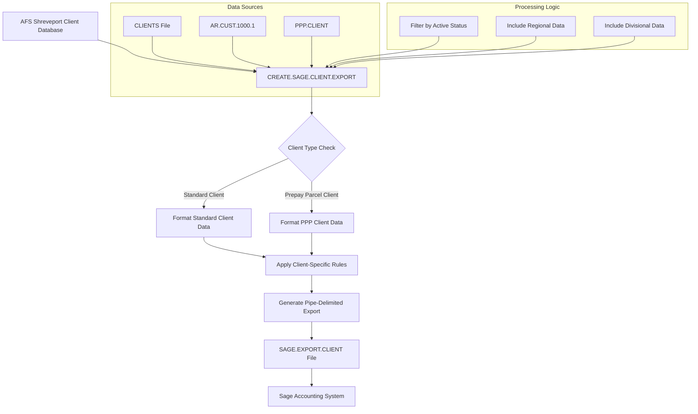
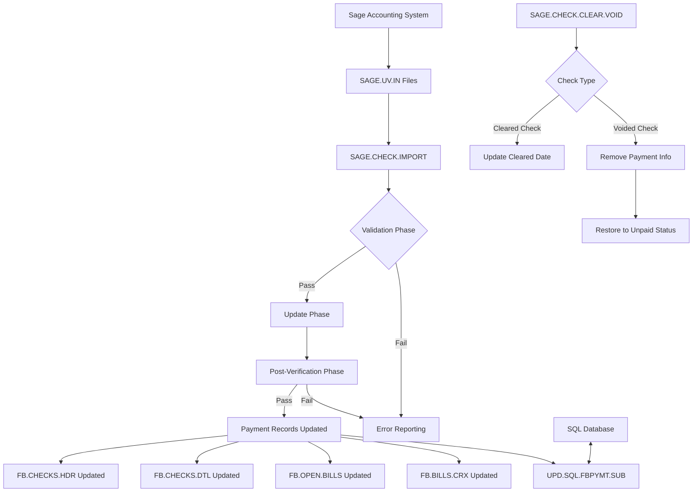
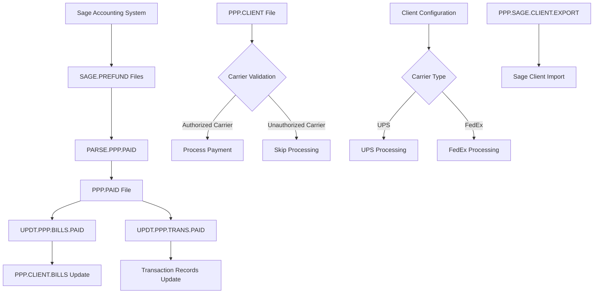
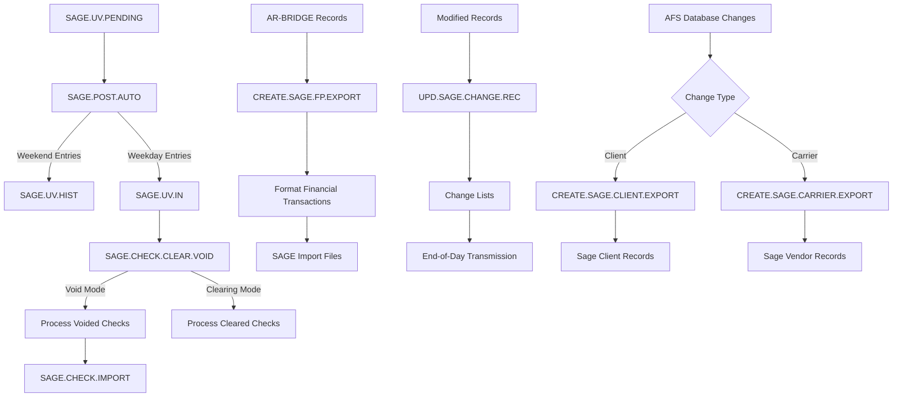

# SAGE Integration in AFS Shreveport

## Overview of SAGE Integration

AFS Shreveport integrates with Sage accounting software to facilitate seamless financial data exchange and streamline freight billing operations. This integration connects the operational aspects of freight management with financial accounting, enabling automated transfer of client information, carrier data, payment processing, and reconciliation. The system maintains data consistency between AFS Shreveport's freight billing platform and Sage accounting software through scheduled exports, imports, and validation processes, ensuring accurate financial reporting and efficient payment management.

## Client Data Export

Client information is exported from AFS Shreveport to Sage in a structured, pipe-delimited format that ensures compatibility with Sage's import requirements. The export process extracts comprehensive client details including contact information, payment terms, corporate names, addresses, and operational settings. Special handling is implemented for prepay parcel clients, who require additional financial tracking for reimbursement processes. The system formats phone numbers consistently, handles special characters in text fields, and properly quotes fields containing commas to maintain data integrity. Client status (active/inactive) can be filtered during export, and the system supports both individual client exports and batch processing through saved lists. Regional and divisional information can be optionally included based on configuration settings, allowing for flexible exports tailored to specific accounting needs.

## Carrier Data Export

The carrier data export process extracts comprehensive information from the AFS Shreveport CARRIERS file and formats it for Sage accounting system integration. This includes remittance details such as carrier names, addresses, phone numbers, and tax identification information. The export also captures banking information for ACH transactions, including routing numbers, account numbers, and account types, selecting the most current banking records based on effective dates. Correspondence addresses and contact information are included to facilitate communication regarding payments and discrepancies. The system handles carrier callback contacts with multiple email addresses for payment notifications, and includes carrier status indicators and SCAC codes for proper identification in Sage. The export file is formatted with pipe delimiters and can include column headers for easier import processing in Sage.

## Payment Processing and Reconciliation

Payment information from Sage is imported into AFS Shreveport through a multi-phase verification and processing workflow. The system first validates incoming payment data against existing freight bills, then updates payment records, and finally performs post-verification to ensure data integrity. When checks are processed, the system updates freight bill payment status, removes paid bills from open bills files, and maintains detailed payment history. For short-paid invoices (cutbacks), the system tracks the reduced amounts and generates notifications to carriers explaining the discrepancies. The reconciliation process includes updating client payment metrics like days-to-pay and maintaining cross-references between checks and freight bills. Special handling is implemented for voided checks, which requires removing payment information from freight bills and restoring them to unpaid status. The system synchronizes all payment information with SQL databases to maintain consistency across platforms.

## Cutback Management

AFS Shreveport's integration with Sage includes a sophisticated cutback management system that handles invoices paid for less than their billed amount. When Sage processes a payment for less than the full invoice amount, the SAGE.CHECK.CUTBACKS program identifies these transactions and generates detailed notifications to carriers. The system extracts information about each cutback including client name, auditor details, PRO number, original billed amount, reduced amount, payment amount, and reason for short payment. These notifications are formatted as Excel-compatible tab-delimited files and distributed to carriers via email. The system maintains records of which cutback notifications have been sent in the SAGE.CUTBACK.FBS file to prevent duplicate notifications. Special formatting is applied for different carrier types, ensuring the information is presented appropriately for each logistics company. This process helps maintain transparent communication with carriers about payment discrepancies and reduces follow-up inquiries about short payments.

## Pre-Paid Parcel Integration

The AFS Shreveport system includes specialized handling for pre-paid parcel clients through its integration with Sage. For these clients, AFS initially pays carriers for shipping services and later bills clients for reimbursement. The PPP.SAGE.CLIENT.EXPORT program identifies clients configured for pre-paid parcel processing by checking the PPP.CLIENT file and exports their information to Sage with appropriate flags. When payments are processed through Sage, the PARSE.PPP.PAID program extracts payment information including client IDs, carrier codes, PRO numbers, and payment dates, then writes this data to the PPP.PAID file. The UPDT.PPP.BILLS.PAID and UPDT.PPP.TRANS.PAID programs update the corresponding client transaction records with payment status information, marking bills as paid and updating payment dates. The system validates carrier eligibility based on client configuration, ensuring that only authorized carriers (UPS, FedEx) are processed for each client. This specialized workflow enables accurate tracking of prepayments and reimbursements, maintaining financial clarity for these complex transactions.

## Financial Data Synchronization

Financial data synchronization between AFS Shreveport and Sage accounting systems is maintained through a comprehensive set of processes that ensure data consistency and accuracy. The SAGE.POST.AUTO program manages the flow of data by transferring records from SAGE.UV.PENDING to SAGE.UV.IN for processing, while archiving processed records to SAGE.UV.HIST. This process includes intelligent handling of weekend entries, which are moved directly to history without processing. When files are successfully transferred, the system launches the appropriate processing programs as phantom jobs. The synchronization process includes multiple validation steps to verify data integrity before committing changes to either system. For client and carrier data, the CREATE.SAGE.CLIENT.EXPORT and CREATE.SAGE.CARRIER.EXPORT programs generate standardized export files that Sage can import. Financial transactions are synchronized through the CREATE.SAGE.FP.EXPORT program, which processes AR-BRIDGE records and freight bill history to create properly formatted transaction records for Sage. The UPD.SAGE.CHANGE.REC subroutine maintains lists of modified records that need to be transmitted to Sage, ensuring that all changes are properly synchronized.

## Error Handling and Validation

The Sage integration in AFS Shreveport implements robust error handling and validation processes to maintain data integrity during financial operations. The system employs a multi-level validation approach that begins with pre-verification of incoming data, proceeds with careful updates, and concludes with post-verification to confirm successful processing. Error levels range from 1 to 10, with higher numbers indicating more severe issues: levels 1-3 are informational, 4-5 are non-fatal warnings, 6-8 allow verification but prevent updates, and 9-10 are fatal errors that halt processing immediately. When errors occur, the system generates detailed reports tailored for different audiences—accounting staff receive business-focused error reports while IT staff receive technical details. File locking mechanisms with timeout notifications prevent concurrent access issues during critical operations, and the system implements retry logic for database operations. Data validation includes cross-checking payment information across multiple database files, verifying mathematical totals, and ensuring referential integrity. For critical errors, email notifications are automatically sent to appropriate staff members with detailed information about the issues encountered.

## Automated Scheduling and Processing

The AFS Shreveport system automates Sage integration processes through scheduled jobs and event-driven triggers. The SAGE.POST.AUTO program runs on a scheduled basis to process pending Sage transactions, intelligently handling weekend entries by moving them directly to history without processing. When files are successfully transferred, the system automatically launches subsequent processing programs as phantom jobs, creating an efficient processing pipeline. The automation includes sequential file naming with timestamps for multiple exports on the same day, preventing file overwrites and maintaining clear audit trails. For client and carrier exports, the system uses the UPD.SAGE.CHANGE.REC subroutine to track modified records that need to be transmitted to Sage during end-of-day processing. The automated workflow includes conditional logic that adapts processing based on data characteristics—for example, skipping weekend-dated entries or applying special handling for prepaid parcel clients. Error conditions are handled through automated notifications to appropriate staff members, ensuring timely intervention when needed. This comprehensive automation ensures consistent, timely data exchange between AFS Shreveport and Sage accounting systems with minimal manual intervention.

## Security and Audit Controls

Security and audit controls are integral to the Sage integration in AFS Shreveport, ensuring financial data integrity throughout the process. The system implements file locking mechanisms with retry logic and timeout notifications to prevent concurrent access issues during critical operations. User authentication is verified through the BCTRL file, with different access levels determining available functionality. All financial transactions are logged in the AUDIT.LOG.MULT file, creating a comprehensive audit trail of changes made to payment records, freight bills, and check information. The system maintains historical records of all Sage interactions by archiving processed files to history directories like SAGE.UV.IN.HIST and SAGE.PREFUND.HISTORY. For voided checks, special tracking is maintained in the SAGE.VOIDED.CHECKS file to prevent processing of already voided payments. The integration includes validation of bank codes, ensuring only authorized financial institutions are used in transactions. When errors occur, the system generates detailed reports with different severity levels, and critical issues trigger email notifications to appropriate staff members. This multi-layered approach to security and auditing ensures the integrity and traceability of all financial data exchanged between AFS Shreveport and Sage accounting systems.

[Generated by the Sage AI expert workbench: 2025-05-28 08:06:16  https://sage-tech.ai/workbench]: #