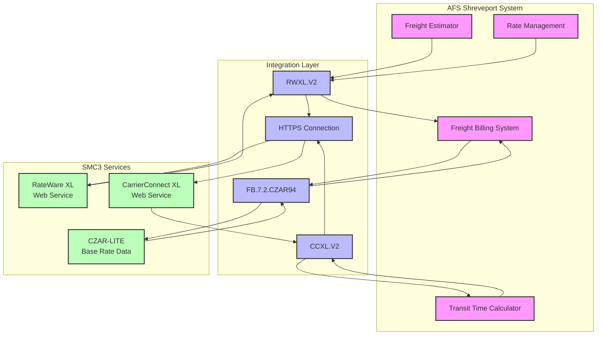
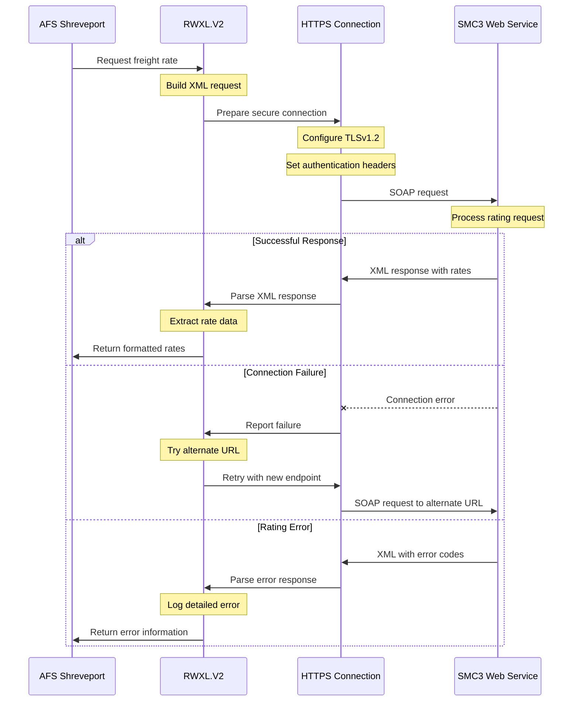
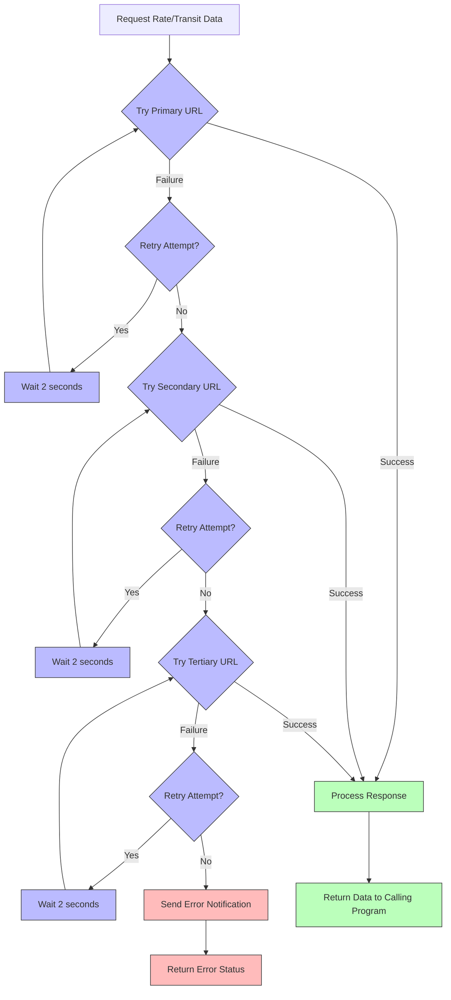
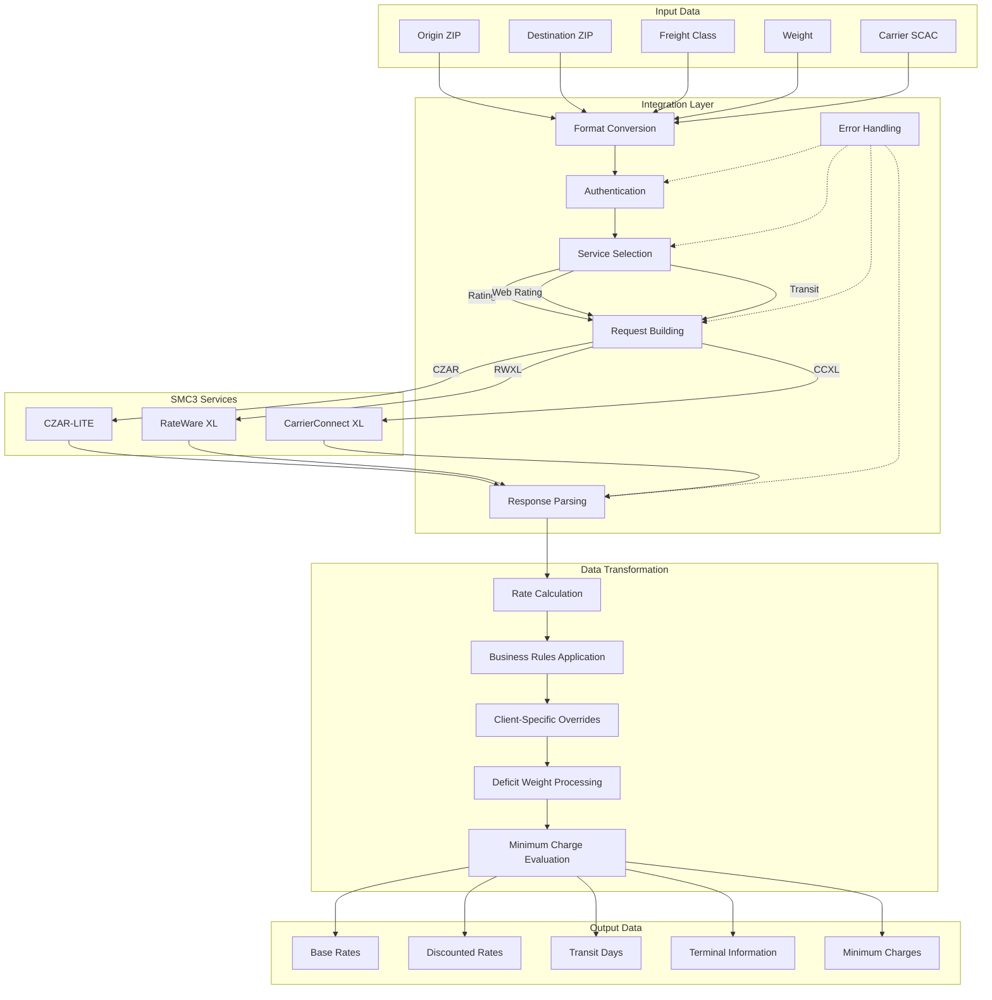

# SMC3 Integration in AFS Shreveport

## SMC3 Integration Overview

SMC3 plays a critical role in AFS Shreveport's freight management operations by providing essential services for accurate freight rating, transit time calculation, and carrier information retrieval. As a leading provider of LTL (Less Than Truckload) pricing and transit data, SMC3 offers multiple integration points that AFS leverages to automate complex freight calculations.

The integration encompasses three primary SMC3 products: CZAR-LITE for base rate retrieval, RateWare XL for comprehensive rating services via web service, and CarrierConnect XL for transit time and terminal information. These integrations enable AFS Shreveport to maintain accurate freight costs, optimize routing decisions, and provide clients with precise delivery timeframes.

The system architecture implements sophisticated failover mechanisms, secure authentication protocols, and robust error handling to ensure reliable operation even during service disruptions. Custom business rules are applied to the SMC3 data to accommodate client-specific requirements, making the integration both powerful and flexible.

## SMC3 Integration Architecture

The architecture diagram illustrates how AFS Shreveport's core systems connect to SMC3 services through specialized integration components. The FB.7.2.CZAR94 program processes freight bills through CZAR-LITE, while RWXL.V2 and CCXL.V2 handle web service communications with RateWare XL and CarrierConnect XL respectively. The HTTPS Connection module provides secure communication capabilities for the web service integrations. Data flows bidirectionally between AFS systems and SMC3 services, with the integration layer handling all necessary transformations, authentication, and error handling.

## CZAR-LITE Rating Integration

The FB.7.2.CZAR94 program serves as the primary integration point between AFS Shreveport and SMC3's CZAR-LITE rating system. This integration enables the retrieval of base rate data for freight bills, which is essential for accurate freight cost calculations and auditing.

The process begins by selecting freight bills entered between specified dates that require base rate data. For each selected bill, the program extracts key shipment information including origin/destination ZIP codes, freight class, and weight. It then constructs a CZAR-LITE formatted text file containing this data, which is transferred to the PC system where CZAR-LITE software is installed.

The program supports both direct file transfer and delegation to a separate process (Taskman) for CZAR processing. After the CZAR-LITE software processes the data file, adding base rate information, FB.7.2.CZAR94 retrieves the results and parses the returned data. The program then updates the FB.BILL.HIST file with the base rate data, including deficit charges and minimum charges when applicable.

A key feature of this integration is its support for FAK (Freight All Kinds) rating, which allows overriding actual freight classes with a standard class. The program also implements sophisticated logic to handle both US and Canadian bills, ensuring proper application of the appropriate rating data regardless of shipment geography.

Error handling is robust, with detailed logging of any issues encountered during processing. This ensures that rating discrepancies can be quickly identified and resolved, maintaining the integrity of the freight billing system.

## RateWare XL Web Service Integration

The RWXL.V2 subroutine provides a sophisticated interface to SMC3's RateWare XL web service, enabling AFS Shreveport to retrieve comprehensive freight rates through SOAP API calls. This integration represents a more modern approach compared to the file-based CZAR-LITE integration, offering real-time rating capabilities with enhanced features.

The subroutine handles the entire web service communication process, including building XML SOAP requests with proper authentication headers, managing secure connections using TLSv1.2, and parsing the complex XML responses. It constructs requests containing essential shipment details such as origin/destination ZIP codes, weight, freight class, and tariff information.

A key strength of this integration is its robust error handling and recovery mechanisms. The code implements multiple retry attempts for both connection and processing failures, and includes a URL failover system that automatically cycles through three different SMC3 endpoints when connection issues occur. This ensures high availability of rating services even during partial service disruptions.

The subroutine processes the XML responses using DOM parsing techniques to extract over 50 different data elements, including base rates, discounts, minimum charges, and deficit weight calculations. It then formats this data for seamless integration with AFS Shreveport's freight billing system.

Performance optimization is built into the design, with response time tracking and logging to identify potential bottlenecks. The integration also includes comprehensive error notifications via email when persistent issues are detected, allowing for prompt intervention by system administrators.

## SOAP Request/Response Flow

This diagram illustrates the SOAP request/response flow between AFS Shreveport and SMC3 web services. The process begins when AFS requests a freight rate, triggering RWXL.V2 to build an XML request. The HTTPS Connection module establishes a secure TLSv1.2 connection with authentication headers. The diagram shows three possible outcomes: successful response processing, connection failure handling with URL failover, and rating error handling. Each path demonstrates the robust error handling and recovery mechanisms implemented in the integration, ensuring reliable operation even when issues occur with the SMC3 services.

## CarrierConnect XL Integration

The CCXL.V2 subroutine provides AFS Shreveport with a robust interface to SMC3's CarrierConnect XL web service, enabling the retrieval of critical transit time information and terminal details for freight carriers. This integration is essential for providing accurate delivery estimates and optimizing routing decisions.

The subroutine implements two primary web service methods: TransitMethod for retrieving transit days between origin and destination points, and TerminalsByPostalCode for obtaining detailed terminal information. For each request, the code constructs a properly formatted SOAP XML envelope containing authentication credentials and shipment parameters such as origin/destination ZIP codes, carrier SCAC codes, and service types.

A sophisticated URL failover mechanism is implemented that automatically cycles through three different SMC3 endpoints when connection issues occur. This ensures high availability of the transit time service, which is critical for operational decision-making. The system maintains connection state tracking to prevent redundant error notifications, sending alerts only when persistent issues are detected.

The integration includes carrier-specific transit time overrides for certain client-carrier combinations, allowing AFS to apply custom business logic when SMC3's standard transit times don't align with actual carrier performance or special arrangements. When SMC3 data isn't available, the system can fall back to carrier service lookup from local reference files.

XML DOM parsing is used to extract complex nested data from SOAP responses, including transit days, service types, movement types, and terminal information. This data is then formatted and returned to the calling program for use in transit time calculations and routing decisions.

The integration also includes comprehensive logging capabilities for troubleshooting and performance monitoring, tracking response times and maintaining detailed records of any issues encountered during processing.

## SMC3 Failover Mechanism

The SMC3 failover mechanism is a critical component of AFS Shreveport's integration strategy, ensuring continuous operation even when connectivity issues occur with SMC3's web services. The flowchart illustrates how the system handles connection failures by implementing a sophisticated retry and URL rotation approach.

When a request is initiated, the system first attempts to connect to the primary SMC3 URL. If successful, the response is processed and returned to the calling program. However, if the connection fails, the system enters a retry loop, attempting the connection multiple times with short delays between attempts.

If all retry attempts to the primary URL fail, the system automatically switches to a secondary URL and begins the retry process again. Should the secondary URL also fail after multiple attempts, the system moves to a tertiary URL as a final fallback option.

This multi-layered approach provides exceptional resilience against temporary service disruptions or regional network issues. The system maintains state information about connection failures to prevent excessive retry attempts and to ensure that appropriate notifications are sent when persistent problems are detected.

The implementation includes configurable parameters for retry counts and delay intervals, allowing fine-tuning of the failover behavior based on operational requirements. This ensures that AFS Shreveport can maintain reliable access to SMC3's critical rating and transit time services even during challenging network conditions.

## Error Handling and Recovery

The SMC3 integrations in AFS Shreveport implement comprehensive error handling and recovery mechanisms to ensure reliable operation in a variety of failure scenarios. These mechanisms are critical for maintaining system availability and data integrity when interacting with external services.

For SOAP-based integrations (RateWare XL and CarrierConnect XL), the system implements a sophisticated retry logic that attempts multiple connections before declaring a failure. Each retry includes appropriate delays to prevent overwhelming the SMC3 services during recovery from temporary issues. Connection timeouts are carefully configured to balance between allowing sufficient time for responses while not hanging indefinitely on failed connections.

When persistent connection issues occur, the system automatically switches between multiple SMC3 endpoints through the URL failover mechanism. This approach provides resilience against regional network problems or service disruptions affecting specific SMC3 data centers.

Error notifications are intelligently managed to prevent alert fatigue. The system tracks connection state and only sends notifications for persistent issues, rather than for every transient failure. These notifications include detailed diagnostic information such as the specific endpoints attempted, error codes received, and the number of retry attempts made.

For the file-based CZAR-LITE integration, error handling includes verification of file transfers, validation of returned data, and checks for rating anomalies such as missing charges or unexpected values. When errors are detected, they are logged with sufficient context to facilitate troubleshooting.

All integrations maintain detailed logs of processing times, error conditions, and recovery attempts. These logs are invaluable for identifying patterns in service disruptions and for optimizing the integration parameters over time.

The error handling system also includes graceful degradation capabilities, allowing the freight billing system to continue operating with cached or alternative data sources when SMC3 services are unavailable for extended periods.

## Security and Authentication

Security and authentication are paramount in the SMC3 integrations within AFS Shreveport, ensuring that sensitive freight rating data and credentials are protected throughout the communication process. The system implements multiple layers of security to safeguard these critical connections.

All web service communications with SMC3's RateWare XL and CarrierConnect XL services utilize TLSv1.2 encryption, ensuring that data transmitted between AFS Shreveport and SMC3 is protected from interception or tampering. This secure channel is established through properly configured security contexts before any data exchange occurs.

Authentication with SMC3 services is handled through a comprehensive token-based approach. Each SOAP request includes authentication headers containing the license key, username, and password provided by SMC3. These credentials are managed securely within the application to prevent unauthorized access.

The integration code carefully handles authentication failures, implementing appropriate retry logic and notifications when credential issues are detected. This ensures that authentication problems are quickly identified and resolved before they impact operational capabilities.

Connection parameters and timeout settings are configured to prevent potential denial-of-service scenarios, while also ensuring that legitimate high-volume rating requests can be processed efficiently. The system includes protections against excessive retry attempts that could trigger rate limiting or blocking by SMC3's services.

For the file-based CZAR-LITE integration, secure file transfer mechanisms ensure that rating data is protected during the exchange between systems. Access to these files is restricted to authorized processes and users through appropriate file system permissions.

Regular security reviews and updates to the integration code ensure that it remains aligned with evolving security best practices and SMC3's authentication requirements. This proactive approach helps maintain the integrity and confidentiality of the freight rating process.

## Data Processing Pipeline

The data processing pipeline diagram illustrates the comprehensive flow of information through the SMC3 integration in AFS Shreveport. Starting with input data (origin/destination ZIPs, freight class, weight, and carrier information), the process moves through several key stages:

1. The integration layer handles format conversion, authentication with SMC3 services, service selection based on the request type, request building, and response parsing.

2. Data flows to the appropriate SMC3 service (CZAR-LITE, RateWare XL, or CarrierConnect XL) based on the specific rating or transit information needed.

3. After receiving responses, the data undergoes transformation through rate calculation, application of business rules, client-specific overrides, deficit weight processing, and minimum charge evaluation.

4. The final output includes base rates, discounted rates, transit days, terminal information, and minimum charges that are returned to the freight billing system.

Throughout this pipeline, error handling provides feedback loops to retry or adjust the process when issues occur. This comprehensive approach ensures that freight rating and transit data flows reliably through the system, maintaining accuracy and consistency even when dealing with complex rating scenarios or service disruptions.

## Custom Business Rules and Overrides

AFS Shreveport's SMC3 integration incorporates sophisticated custom business rules and override capabilities that transform standard SMC3 rating and transit data into client-specific solutions. This layer of customization is crucial for addressing the unique requirements of different clients and carriers within the freight billing system.

For rating operations, the system implements carrier-specific overrides that can modify standard SMC3 rates based on negotiated contracts or special pricing arrangements. These overrides can be applied at multiple levels, including client-carrier combinations, specific lanes (origin-destination pairs), or freight classifications. The system supports complex discount structures, including tiered discounts based on weight breaks, shipment volumes, or other factors.

FAK (Freight All Kinds) rating is a key customization that allows overriding actual freight classes with standardized classes for specific clients. This feature, implemented in FB.7.2.CZAR94, simplifies rating for clients with negotiated FAK arrangements, ensuring consistent pricing regardless of the actual freight classification.

Transit time calculations benefit from carrier-specific transit day overrides implemented in the CCXL.V2 subroutine. These overrides allow AFS to adjust standard SMC3 transit times based on actual carrier performance data or special service agreements. The system can apply different transit time rules based on factors such as origin/destination regions, service types, or specific client requirements.

The integration also supports custom business logic for handling special cases such as minimum charges, deficit weights, and surcharges. These rules ensure that the final rates reflect all applicable pricing components and adhere to carrier-specific rating practices.

All overrides and custom rules are managed through configuration tables rather than hard-coded values, allowing for flexible updates without code changes. This approach enables AFS to quickly adapt to changing client requirements or carrier pricing structures while maintaining the integrity of the core integration with SMC3 services.

## Performance Optimization and Monitoring

Performance optimization and monitoring are critical aspects of AFS Shreveport's SMC3 integration, ensuring efficient operation and rapid response times for freight rating and transit time calculations. The system implements multiple strategies to optimize performance while maintaining comprehensive monitoring capabilities.

Response time tracking is built into all SMC3 web service calls, with detailed logging of request initiation times, response receipt times, and total processing durations. This data is stored for analysis, allowing system administrators to identify performance trends and potential bottlenecks. The monitoring system includes thresholds for acceptable response times, with automated alerts when these thresholds are exceeded.

Caching mechanisms are implemented for frequently accessed data elements, reducing the need for redundant web service calls. This includes caching of transit times for common lanes, carrier terminal information, and base rate data that changes infrequently. Cache invalidation strategies ensure that data remains current while minimizing unnecessary service calls.

Connection pooling and reuse are employed for web service communications, reducing the overhead associated with establishing new connections for each request. This approach is particularly beneficial during high-volume processing periods, such as end-of-day rating runs or batch operations.

The system implements intelligent batching of requests when possible, combining multiple rating or transit time queries into consolidated service calls. This reduces the overall number of web service transactions and improves throughput, especially for bulk operations.

Resource utilization is carefully managed through configurable limits on concurrent connections and request rates. These limits prevent the system from overwhelming SMC3 services during peak periods while ensuring efficient use of available capacity.

Comprehensive logging captures not only performance metrics but also detailed information about request parameters and response data. This logging is invaluable for troubleshooting performance issues and validating the accuracy of rating and transit time calculations.

Regular performance reviews analyze the collected metrics to identify opportunities for optimization, such as adjusting timeout settings, refining caching strategies, or rebalancing workloads across different processing periods. This continuous improvement approach ensures that the SMC3 integration remains responsive and efficient as business volumes and requirements evolve.

[Generated by the Sage AI expert workbench: 2025-05-28 08:06:29  https://sage-tech.ai/workbench]: #