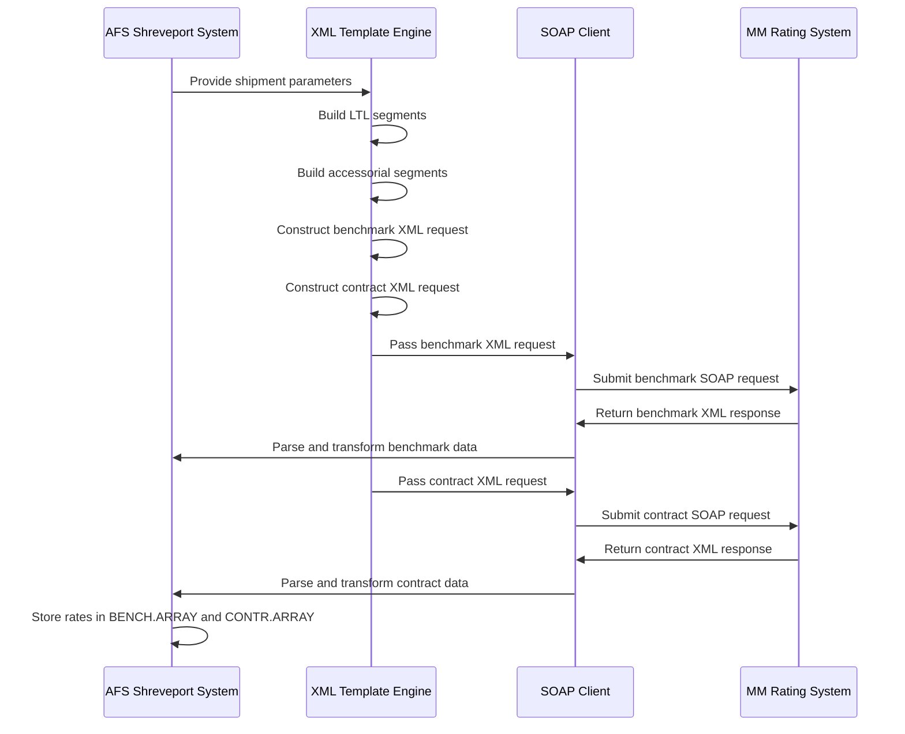
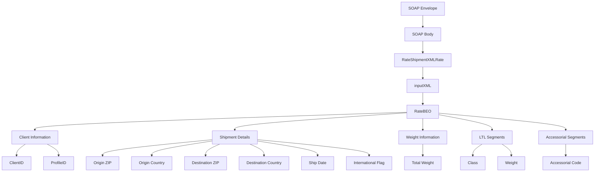

# SOAP Web Service Architecture in AFS Shreveport

The AFS Shreveport system implements SOAP web services as a critical integration mechanism for connecting with external rating systems, particularly the MM Rating System. This architecture follows a traditional SOAP approach, leveraging XML as the data format for both requests and responses. The system employs a template-based approach for constructing XML payloads, which are then transmitted via SOAP to external rating services. The integration layer handles the complexities of web service communication, including endpoint configuration, request construction, authentication, and response parsing.

The architecture is designed to support both benchmark and contract rate calculations through parallel request flows, with each flow following a similar pattern: template preparation, XML construction, SOAP request submission, response handling, and data transformation. The system leverages Universe's built-in SOAP capabilities through functions like `SoapCreateRequest`, `SoapSubmitRequest`, and XML processing functions such as `PrepareXML` and `ReadXMLData`. This approach allows the legacy MultiValue database system to communicate effectively with modern web services.

## SOAP Web Service Communication Flow

The diagram illustrates the complete flow of SOAP communication between AFS Shreveport and the MM Rating System. The process begins with the AFS system providing shipment parameters to the XML Template Engine, which constructs specialized XML segments for LTL shipments and accessorial charges. These segments are incorporated into complete benchmark and contract XML requests. The SOAP client submits these requests sequentially to the MM Rating System, which processes them and returns XML responses. These responses are then parsed and transformed into structured data arrays (BENCH.ARRAY and CONTR.ARRAY) that can be used by other components of the AFS Shreveport system for freight rating and auditing purposes.

## XML Template Construction for SOAP Requests

The AFS Shreveport system employs a sophisticated template-based approach for constructing XML requests for SOAP web services. Rather than dynamically generating XML using DOM or other XML creation libraries, the system uses predefined XML templates stored in the `&XML&` file with placeholders that are replaced at runtime. This approach leverages the `CHANGE` function in PICK BASIC to perform string replacements, substituting placeholders like `~CLIENT.ID~`, `~ORIG.ZIP~`, and `~SHIP.DATE~` with actual values from the input parameters.

The system builds XML requests in layers, first constructing specialized segments for LTL shipments and accessorial charges, then incorporating these segments into the main request template. This modular approach allows for flexibility in handling different shipment scenarios while maintaining consistent XML structure. The final XML is then wrapped in a SOAP envelope with appropriate namespaces and action headers before submission.

To ensure proper XML encoding, the system performs character conversions, replacing angle brackets with their XML entity equivalents (`&lt;` and `&gt;`) when needed, and reversing these conversions when processing responses. This careful handling of XML syntax ensures compatibility with the SOAP protocol and prevents parsing errors that could occur due to special characters in the data.

## SOAP Request Submission and Authentication

The AFS Shreveport system implements a comprehensive approach to SOAP request submission and authentication through Universe's built-in SOAP client capabilities. The process begins with the creation of a SOAP request object using `SoapCreateRequest()`, which establishes the connection to the web service endpoint defined in the URL variable. The system supports multiple environments through commented endpoint URLs, allowing for easy switching between development, testing, and production environments.

Request submission is handled through a two-step process: first, the XML content is attached to the request using `soapSetRequestContent()`, and then the request is submitted using `SoapSubmitRequest()` with a configurable timeout parameter (set to 30000 milliseconds). This timeout setting balances the need for response time with the reality that rating calculations may require significant processing time on the server side.

While the examined code doesn't implement complex authentication schemes like OAuth or WS-Security, it does include parameters for username and password (`USER.NAME` and `USER.PWD`) that could be incorporated into the request for services requiring basic authentication. The system is designed to handle authentication failures through error checking after the SOAP submission, with appropriate error messages captured and returned to the calling program.

The architecture also includes error handling for network-level issues, using `getSocketErrorMessage()` to retrieve detailed error information when a SOAP request fails, providing valuable diagnostic information for troubleshooting integration issues.

## XML Request Structure for Rating Services

The diagram illustrates the hierarchical structure of XML requests used for rating services in the AFS Shreveport system. At the root is the SOAP Envelope containing the SOAP Body, which encapsulates the `RateShipmentXMLRate` operation. The operation contains an `inputXML` element that wraps the `RateBEO` (Business Entity Object) - the core data structure for rating requests.

The `RateBEO` contains several key sections: Client Information (including ClientID and ProfileID which differentiate between benchmark and contract rates), Shipment Details (origin and destination information, ship date, and international shipping flag), Weight Information (total shipment weight), LTL Segments (containing freight class and weight for each line item), and Accessorial Segments (containing codes for additional services).

This structured approach allows the system to represent complex shipping scenarios with multiple freight classes and accessorial services in a standardized format that can be processed by the MM Rating System. The system maintains separate templates for benchmark rates (using profile IDs with "_B" suffix) and contract rates (using profile IDs with "_C" suffix), enabling parallel rate calculations for comparison and auditing purposes.

## XML Response Processing and Parsing

The AFS Shreveport system implements a comprehensive approach to processing XML responses from SOAP web services. After receiving the SOAP response, the system first performs necessary character conversions, replacing XML entities (`&lt;` and `&gt;`) with their corresponding characters (`<` and `>`). It then extracts the relevant portion of the response by identifying the `<RateBEO>` element and its closing tag, discarding the SOAP envelope and other wrapper elements.

The system leverages Universe's XML processing capabilities through a structured sequence of operations. First, it prepares the XML document for reading using `PrepareXML()`, which loads the XML file and creates a handle for subsequent operations. Next, it opens the XML data using `OpenXMLData()`, applying extraction rules defined in the `MMRESP.EXT` file to map XML elements to MultiValue data structures. Finally, it reads the XML data using `ReadXMLData()`, which populates the response arrays (`BENCH.ARRAY` and `CONTR.ARRAY`).

After parsing, the system performs additional data cleansing, trimming whitespace from all elements at every level of the multidimensional arrays. This ensures consistent data formatting for subsequent processing. The parsed data is then stored in the `MMRESP` file with identifiers that include the user ID, channel number, client ID, and rate type (benchmark or contract), allowing for retrieval and analysis later in the process.

The architecture includes robust error handling at each stage of XML processing, capturing specific error messages and returning appropriate status codes to the calling program. This ensures that parsing failures can be diagnosed and addressed effectively.

## Error Handling in SOAP Communications

The AFS Shreveport system implements a multi-layered approach to error handling in SOAP web service interactions, ensuring robust operation even when external services encounter issues. The error handling strategy encompasses several key areas: connection errors, SOAP protocol errors, XML parsing errors, and business logic errors.

For connection-related issues, the system checks the return value from `SoapCreateRequest()` and `SoapSubmitRequest()` functions, capturing detailed error messages using `getSocketErrorMessage()` when failures occur. This provides valuable diagnostic information for network-related problems such as unreachable endpoints, timeouts, or DNS resolution failures.

XML parsing errors are handled through status checks after each XML processing operation (`PrepareXML()`, `OpenXMLData()`, and `ReadXMLData()`). When errors occur, the system captures detailed error messages using `XMLERROR()` and returns them to the calling program. This helps identify malformed XML responses or extraction rule issues.

The system implements a consistent error reporting mechanism through the `RETURN.STATUS` and `RETURN.MESSAGE` variables, which provide clear indications of success or failure along with descriptive error messages. This standardized approach simplifies error handling in calling programs and ensures that problems are properly communicated to users or logged for later analysis.

Error recovery is primarily handled through graceful degradation - if benchmark rating fails, the system continues with contract rating, ensuring that partial results are still available. Additionally, the system preserves both request and response XML files, enabling post-mortem analysis of failed transactions for debugging purposes.

## Data Transformation Pipeline

The diagram illustrates the complete data transformation pipeline for SOAP web service communication in the AFS Shreveport system. The process begins with internal data structures containing shipment information, which flow through template selection where appropriate XML templates are chosen based on the operation type. These templates undergo placeholder replacement where dynamic values are inserted into the XML structure.

The assembled XML documents then pass through character encoding to ensure proper XML syntax, followed by SOAP envelope creation where the XML payload is wrapped in the necessary SOAP protocol elements. After transmission via the SOAP protocol and reception of the response, the data undergoes character decoding to convert XML entities back to their original form.

The relevant XML content is extracted from the SOAP envelope, then parsed according to predefined extraction rules that map XML elements to MultiValue data structures. The parsed data undergoes cleansing operations such as whitespace trimming and null value handling before being organized into MultiValue arrays with attributes, values, and subvalues representing the hierarchical structure of the original XML. Finally, these arrays are made available to the application as usable data structures for freight rating and auditing operations.

This bidirectional transformation pipeline ensures that data can flow seamlessly between the internal MultiValue database structures of AFS Shreveport and the XML-based web services of external rating systems, maintaining data integrity throughout the process.

## Environment Configuration for Web Services

The AFS Shreveport system implements a flexible approach to environment configuration for web services, allowing the system to connect to different endpoints based on the deployment environment. This is achieved through a combination of hardcoded URLs with commented alternatives and configuration management practices that enable environment-specific settings without code changes.

In the examined code, multiple endpoint URLs are defined as commented options, including development environments (`http://devweb.afslogistics.com/...`), testing environments (`http://beta.afs.net/...`), and production environments. This approach allows developers to quickly switch between environments during development and testing by simply uncommenting the appropriate URL.

The system also supports environment-specific timeout settings, with the default set to 30000 milliseconds (30 seconds) to accommodate the processing time needed for complex rating calculations. This timeout value can be adjusted based on the performance characteristics of different environments or the specific requirements of different rating operations.

While not explicitly shown in the code, the architecture supports the use of environment-specific authentication credentials through the `USER.NAME` and `USER.PWD` parameters, which can be populated from configuration files or environment variables depending on the deployment context.

The system also includes debugging capabilities that can be enabled based on the user context, with special handling for specific users (e.g., `IF USER='MKERBOW' THEN DEBUG`), allowing for detailed troubleshooting in production environments without affecting all users.

This flexible configuration approach ensures that the system can operate consistently across development, testing, and production environments while accommodating the specific requirements and constraints of each environment.

## Integration with MultiValue Database Systems

The SOAP web service functionality in AFS Shreveport demonstrates a sophisticated integration between modern web service protocols and the underlying MultiValue database architecture. This integration leverages Universe's built-in XML and SOAP capabilities while maintaining compatibility with traditional MultiValue data structures and programming paradigms.

At the database level, the system uses MultiValue files (`&XML&` and `MMRESP`) to store XML templates, request/response data, and parsed results. These files are accessed using standard PICK BASIC file operations (`OPEN`, `READ`, `WRITE`), providing a familiar interface for developers working with the MultiValue platform. The system also leverages MultiValue's hierarchical data structure, using attributes, values, and subvalues to represent the nested structure of XML data without requiring complex object-relational mapping.

The code demonstrates how MultiValue's string handling capabilities, particularly the `CHANGE` function, can be used effectively for XML template manipulation, avoiding the need for more complex XML generation libraries. Similarly, the system uses MultiValue's array processing capabilities to handle the multidimensional data structures that result from XML parsing.

The integration also showcases how Universe's XML processing functions (`PrepareXML`, `OpenXMLData`, `ReadXMLData`) can be used to bridge the gap between XML and MultiValue data structures, using extraction rules to map between these different representations. This approach allows the system to work with modern XML-based protocols while maintaining the advantages of the MultiValue database for business logic and data storage.

This integration strategy enables AFS Shreveport to leverage the strengths of both technologies: the flexibility and standardization of SOAP web services for external integration, and the efficiency and familiarity of MultiValue databases for internal processing.

## Performance Considerations in SOAP Web Services

The AFS Shreveport system incorporates several performance optimizations in its SOAP web service integration to ensure efficient operation despite the inherent overhead of XML-based protocols. These optimizations address key performance concerns including network latency, XML processing overhead, and resource utilization.

To mitigate network latency issues, the system implements a configurable timeout setting (30000 milliseconds) that balances the need for response time with the reality that external rating calculations may require significant processing. This prevents excessive waiting for responses while allowing sufficient time for complex calculations to complete.

The system optimizes XML processing by using template-based XML generation rather than building XML documents from scratch for each request. This approach reduces CPU usage and memory allocation compared to DOM-based XML generation. Additionally, the system extracts only the relevant portions of XML responses before parsing, reducing the amount of data that needs to be processed by the XML parser.

Resource utilization is optimized through careful file handling, with XML request and response files named using a combination of user ID, channel number, and client ID to prevent conflicts in multi-user scenarios. The system also implements proper cleanup of XML handles and data handles using `CloseXMLData()` and `ReleaseXML()` to prevent resource leaks.

The architecture supports parallel processing of benchmark and contract rates, allowing these calculations to be performed independently if needed. However, in the current implementation, they are processed sequentially to avoid overwhelming the external rating system with simultaneous requests.

Data transformation is optimized through targeted string replacements rather than full XML parsing when preparing requests, and through the use of extraction rules that map XML elements directly to MultiValue data structures when processing responses. This approach minimizes the overhead of converting between different data representations.

[Generated by the Sage AI expert workbench: 2025-05-28 08:06:31  https://sage-tech.ai/workbench]: #