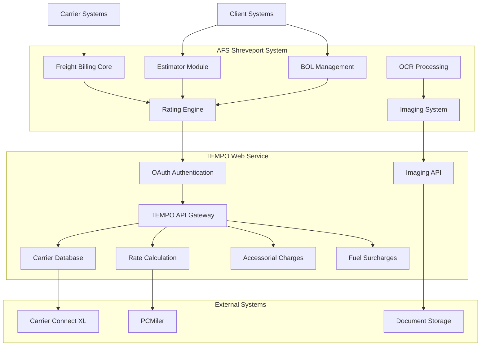
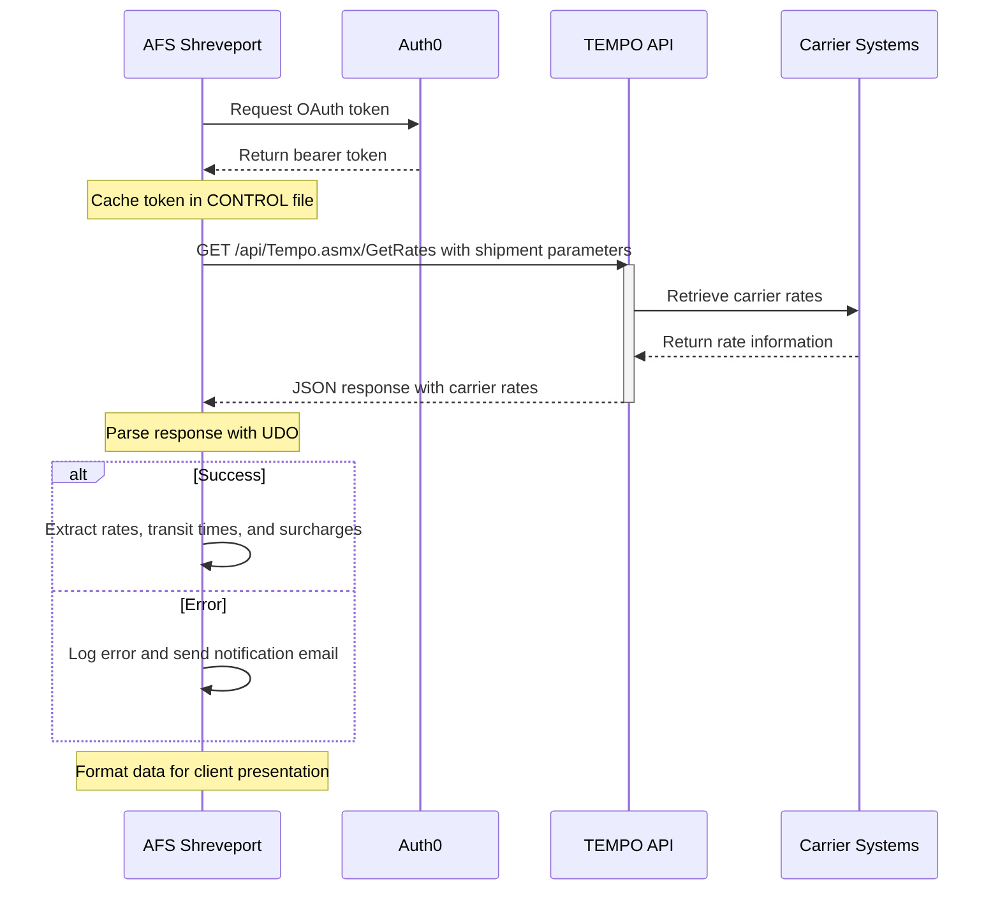
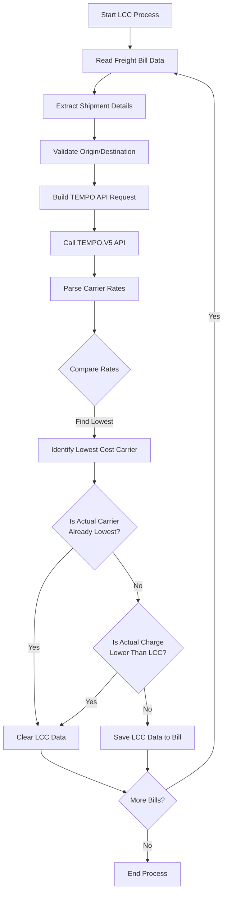
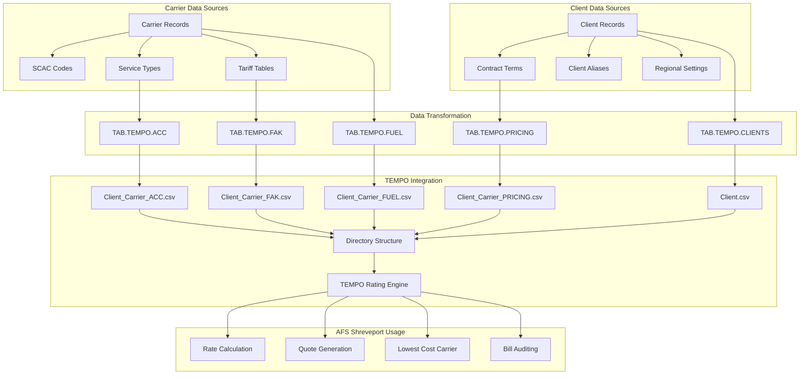

# TEMPO Web Service in AFS Shreveport

## TEMPO Web Service Overview

The TEMPO Web Service is a critical integration component within the AFS Shreveport system, serving as the primary engine for freight rate calculation, carrier selection, and data exchange between systems. This service provides real-time access to carrier rates, transit times, and service information through a secure API interface. TEMPO supports multiple shipping modes including LTL (Less Than Truckload), TL (Truckload), and Air Freight, enabling AFS to offer comprehensive freight management solutions to clients.

The service has evolved through multiple versions (V3 through V6), with each iteration adding enhanced capabilities such as improved authentication, expanded carrier coverage, and more detailed rate breakdowns. TEMPO integrates with client-specific contract rates, benchmark rates, and accessorial charges to provide accurate shipping cost estimates. It serves as the backbone for several key AFS Shreveport functions including rate shopping, lowest cost carrier identification, and freight bill auditing.

Core capabilities include secure OAuth 2.0 authentication, JSON/XML data exchange, support for multiple freight classes and weights per shipment, and detailed surcharge calculations including fuel adjustments. The service is designed to handle both standard rating scenarios and specialized client requirements through customizable business rules.

## TEMPO Web Service Architecture



The TEMPO Web Service architecture illustrates the integration between AFS Shreveport's core modules and the TEMPO service components. The architecture follows a service-oriented design where the TEMPO API Gateway serves as the central hub for all rating-related operations. 

Authentication is handled through OAuth 2.0, providing secure token-based access to the API. The system implements token caching to minimize authentication overhead while maintaining security. When a rating request is initiated from modules like the Estimator, BOL Management, or Freight Billing Core, it first passes through the Rating Engine which formats the request appropriately for the TEMPO API.

The TEMPO API Gateway routes requests to specialized components for rate calculation, carrier information, accessorial charges, and fuel surcharges. These components interact with external systems like PCMiler for distance calculations and Carrier Connect XL for transit times and service details. The Imaging API component handles document retrieval and OCR processing, connecting to a document storage system for freight bill images.

This architecture enables AFS Shreveport to provide comprehensive freight management services while maintaining separation of concerns between different functional areas.

## Authentication and Security

The TEMPO Web Service implements OAuth 2.0 authentication to ensure secure access to its API endpoints. This implementation follows the client credentials flow, where AFS Shreveport applications authenticate using client ID and secret to obtain bearer tokens for subsequent API calls. The authentication process is handled through Auth0, providing industry-standard security practices.

Token management is a critical aspect of the implementation. The system caches authentication tokens in the CONTROL file, storing both the token value and its expiration timestamp. Before making API calls, the code checks if the existing token is still valid; if expired, it automatically initiates a new authentication request. This approach minimizes authentication overhead while maintaining security.

```
READ TOKEN FROM F.CONTROL, "TEMPO.TOKEN" ELSE TOKEN = ""
READ TOKEN.EXP FROM F.CONTROL, "TEMPO.TOKEN.EXP" ELSE TOKEN.EXP = ""
IF TOKEN = "" OR TOKEN.EXP < TIME() THEN
    GOSUB GET.NEW.TOKEN
END
```

All API communication uses TLS 1.2 secure contexts to ensure encrypted data transmission. The system creates these contexts using Universe BASIC's security functions:

```
STAT = createSecurityContext(CTX, "TLSv1.2")
STAT = createSecureRequest(URL, METHOD, hndRequest, CTX)
```

For authentication requests, the system sets specific verification strength parameters to handle certificate validation appropriately:

```
STAT = setSecurityContextOptions(CTX, "VERIFICATION_STRENGTH", "GENEROUS")
```

The bearer token is included in the Authorization header for all API requests:

```
STAT = setRequestHeader(hndRequest, "Authorization", "Bearer " : TOKEN)
```

The system also implements error handling for authentication failures, with email notifications to system administrators when authentication issues occur. This comprehensive approach ensures that the TEMPO Web Service maintains secure communication while providing reliable API access for freight rating operations.

## Rating Engine Integration

The TEMPO rating engine is the computational core of the freight cost calculation system in AFS Shreveport. It processes complex shipment parameters to determine accurate freight costs based on carrier contracts, benchmark rates, and industry standards. The integration between AFS Shreveport and the TEMPO rating engine is primarily facilitated through the TEMPO.V5 and TEMPO.V6 subroutines, which handle the API communication and data transformation.

When a rating request is initiated, the system collects essential shipment parameters including:

1. Origin and destination ZIP/postal codes
2. Freight classes and corresponding weights (supporting multiple line items)
3. Shipment direction (inbound, outbound, or third-party)
4. Accessorial service requirements
5. Client-specific contract information
6. Shipment date

These parameters are formatted into a structured JSON request that conforms to the TEMPO API specifications. The request includes both the basic shipment details and any special handling requirements:

```json
{
  "clientId": "06916",
  "shipmentDate": "2023-04-15",
  "direction": "O",
  "originZip": "53115",
  "destinationZip": "47336",
  "lineItems": [
    {
      "freightClass": "55",
      "weight": 1200
    },
    {
      "freightClass": "70",
      "weight": 800
    }
  ],
  "accessorials": ["LIFTGATE", "RESIDENTIAL"]
}
```

The rating engine processes this information through several calculation steps:

1. **Base Rate Determination**: Identifies the appropriate rate basis using origin/destination pairs and distance calculations
2. **Class Rating**: Applies freight classification factors to determine the base shipping cost
3. **Weight Breaks**: Adjusts rates based on total shipment weight and applicable discount tiers
4. **Discount Application**: Applies client-specific contract discounts to the base rates
5. **Accessorial Charges**: Adds costs for special services like liftgate, residential delivery, etc.
6. **Fuel Surcharge Calculation**: Applies current fuel surcharge percentages based on carrier tables
7. **Minimum Charge Validation**: Ensures the total charge meets carrier minimum requirements

The response from the rating engine includes detailed breakdowns of all charges, allowing AFS Shreveport to provide transparent cost explanations to clients. The system also supports "WHY" calculations that show the step-by-step derivation of the final freight cost, which is particularly valuable for audit and verification purposes.

For specialized rating scenarios, the engine supports FAK (Freight All Kinds) rates that allow shippers to consolidate multiple freight classes under a single rating classification, potentially reducing overall shipping costs.

## API Request/Response Flow



The diagram illustrates the flow of data between AFS Shreveport and the TEMPO Web Service during a typical rating request. The process begins with authentication, followed by the actual rate request, and concludes with response processing.

When an AFS Shreveport module needs to retrieve freight rates, it first checks if a valid OAuth token exists in the CONTROL file. If the token is missing or expired, the system initiates an authentication request to Auth0 using client credentials. The returned bearer token is cached with its expiration time for future use.

With a valid token, the system constructs a request to the TEMPO API endpoint. For GET requests, parameters are encoded in the URL; for POST requests, they're formatted as JSON in the request body. The request includes shipment details such as origin/destination, weight, class, and accessorials.

The TEMPO API processes the request by consulting carrier rate databases and applying business rules. It then returns a structured JSON response containing detailed rate information from multiple carriers.

AFS Shreveport parses this response using Universe Data Objects (UDO), extracting carrier identifiers (SCAC codes), service types, base rates, discounted rates, transit times, and surcharges. This information is organized into a multi-dimensional array structure that can be easily processed by other system components.

Error handling is robust throughout this flow. Network timeouts, authentication failures, and invalid responses trigger specific error handling routines. For critical errors, the system sends email notifications to technical staff with detailed diagnostic information.

The parsed response data is then formatted according to the needs of the calling program - whether for display in the rating interface, storage in freight bill records, or use in lowest cost carrier calculations.

## Data Transformation and Export

The AFS Shreveport system implements a comprehensive data transformation and export process to prepare and format data for TEMPO integration. This process involves extracting client and carrier information from internal databases, transforming it into standardized formats, and organizing it into a structured directory hierarchy for TEMPO consumption.

The data export process is primarily handled by a series of specialized subroutines:

1. **TAB.TEMPO.CLIENTS**: Creates a control file of client information including client ID, name, effective date, SCAC code, currency, and directory location. This serves as the master reference for client-carrier relationships.

2. **TAB.TEMPO.PRICING**: Extracts pricing data from the CLEAN.ROUTE file, formatting it into CSV files with origin/destination information and various pricing tiers (L5C, M5C, M1M, etc.).

3. **TAB.TEMPO.FAK**: Processes Freight All Kinds (FAK) data, identifying unique FAK values and their associated freight classes, then determining minimum and maximum class values for each FAK.

4. **TAB.TEMPO.ACC**: Extracts accessorial charge information and formats it for TEMPO integration.

5. **TAB.TEMPO.FUEL**: Processes fuel surcharge data from FB.BC.FSC, calculating charge percentages and price breaks for export.

The system follows a consistent file naming convention for exported data:
```
CLIENT_ID_CARRIER_ID_FILETYPE.csv
```

For example: `06916_00979_PRICING.csv` or `01282_00345_FAK.csv`

These files are organized into a hierarchical directory structure based on client, carrier, and effective date:
```
CONTRACTS\CLIENT_ID\SCAC\YYYYMMDD\
```

For date handling, the system converts internal date formats to standardized YYYYMMDD format for consistency across platforms:
```
EFF.DT = OCONV(EFF.DT,"D4/")
EFF.DT = EFF.DT[7,4]:EFF.DT[1,2]:EFF.DT[4,2]
```

The CSV generation process includes proper formatting with headers and consistent delimiters. The system converts internal ASCII 254 (AM) characters to line feeds for proper CSV formatting:
```
CONVERT AM TO LF IN DATA1
```

For complex data structures like pricing tiers, the system builds comprehensive headers with 30+ fields to ensure all logistics data is properly represented. The export process handles directional routing with inbound/outbound logic for postal code ranges, ensuring that direction-specific pricing is correctly applied.

This systematic approach to data transformation and export ensures that TEMPO has access to accurate, up-to-date client and carrier information for freight rate calculations.

## JSON and XML Processing

The TEMPO Web Service integration in AFS Shreveport relies heavily on structured data formats for communication, with the system handling both JSON and XML depending on the specific API version and endpoint. The codebase demonstrates a transition from XML-based interfaces in earlier versions to JSON in more recent implementations, reflecting modern API design practices.

For JSON processing, AFS Shreveport utilizes Universe Data Objects (UDO), a powerful library that provides object-oriented access to JSON structures. The UDO approach allows for efficient parsing of complex nested JSON responses from the TEMPO API:

```
STATUS = UDORead(RESTDATA, UDOFORMAT_JSON, UDOHANDLE)
ST = UDOArrayGetSize(UDOHANDLE, ITEM_SIZE)
FOR RC = 1 TO ITEM_SIZE
   ST = UDOArrayGetItem(UDOHANDLE, RC, result_udo, UDOTYPE)
   ST = UDOGetProperty(result_udo, "Scac", SCAC, UDOTYPE)
   RESP<1,RC> = SCAC
   ST = UDOGetProperty(result_udo, "Mode", MODE, UDOTYPE)
   RESP<2,RC> = MODE
   ...
END
```

This approach allows the system to extract specific properties from JSON objects and handle arrays of carrier rate information efficiently. The code includes type checking to handle null values gracefully:

```
IF UDOTYPE = UDO_NULL THEN SCAC = "NV"
```

For XML processing, primarily used in earlier versions of the TEMPO API, the system employs XDOM functions to navigate and extract data from XML documents:

```
ST = XDOMOpen(RESTDATA, XML.FROM.STRING, MYDOM)
ST = XDOMLocate(MYDOM, "/", "", Main.Handle)
ST = XDOMLocateNode(Main.Handle, XDOM.CHILD, XDOM.FIRST.CHILD, XDOM.ELEMENT.NODE, ArrayOfTempoRaterRate.Handle)
```

The XML processing includes special handling for empty nodes to prevent parsing errors:

```
RESTDATA = CHANGE(RESTDATA, '<Type />', '<Type> </Type>')
RESTDATA = CHANGE(RESTDATA, '<Name />', '<Name> </Name>')
```

For complex nested structures like surcharges, the code implements nested loop structures to extract all relevant information:

```
idx = 6
LOOP
   idx += 1
   ST = XDOMLocateNode(TempoRaterRate.Handle, XDOM.CHILD, idx, XDOM.ELEMENT.NODE, Surcharges.Handle)
WHILE ST = XML.SUCCESS
   ...
REPEAT
```

Both JSON and XML processing implementations include robust error handling. For JSON, the system captures UDO errors with specific error codes and messages:

```
ERRCODE = "" ; ERRMSG = ""
S = UDOGetLastError(ERRCODE, ERRMSG)
ERROR = "UDO ERROR: (":ERRCODE:") ":ERRMSG
```

For XML, the system checks status codes and retrieves detailed error information when parsing fails:

```
IF ST = XML.SUCCESS THEN
   CRT 'Success'
ELSE
   EC = XMLGetError(errorCode, errorMessage)
   CRT STAT.VAL
   CRT "ERROR CODE   :":errorCode
   CRT "ERROR MESSAGE:":errorMessage
END
```

This comprehensive approach to structured data processing enables AFS Shreveport to reliably communicate with the TEMPO Web Service across multiple API versions and data formats.

## Lowest Cost Carrier Calculation



The Lowest Cost Carrier (LCC) calculation is a critical function within AFS Shreveport that identifies potential cost savings by comparing actual carrier charges with alternative carrier rates. This process is implemented through several specialized programs including BOL.LCC.6916 and POP.LCC.6916, which focus on Strategic Materials (client 06916).

The process begins by selecting freight bills that meet specific criteria - typically bills without existing LCC data, with valid origin/destination ZIP codes, and non-zero weights. For each qualifying bill, the system extracts key shipment details:

1. Origin and destination ZIP codes
2. Shipment date
3. Freight class and weight information
4. Direction (inbound, outbound, or third-party)
5. Actual carrier used and charges applied

With these details, the system constructs a request to the TEMPO.V5 API to retrieve rates from multiple carriers for the same shipment parameters. The API call returns a comprehensive set of carrier options with their respective rates:

```
VIN = ""
VIN<1> = CLIENT.ID
VIN<2> = SHIP.DATE
VIN<3> = ORIG.ZIP
VIN<4> = DEST.ZIP
VIN<5> = CLASS
VIN<6> = DIRECTION
VIN<7> = PALLETS
VIN<8> = WEIGHT
VIN<9> = MODE
CALL TEMPO.V5(VIN, VOUT)
```

The system then parses the API response to identify the lowest cost carrier option:

```
LCC.AMOUNT = 999999
FOR I = 1 TO DCOUNT(VOUT<1>, @VM)
    CARRIER.SCAC = VOUT<1, I>
    CARRIER.RATE = VOUT<5, I>
    IF CARRIER.RATE < LCC.AMOUNT THEN
        LCC.AMOUNT = CARRIER.RATE
        LCC.CARRIER = CARRIER.SCAC
    END
NEXT I
```

Once the lowest cost carrier is identified, the system applies business rules to determine if the LCC data should be stored:

1. If the actual carrier matches the lowest cost carrier, LCC data is cleared since no savings opportunity exists
2. If the actual charge is already lower than the LCC amount (which can happen due to special pricing or negotiated rates), LCC data is also cleared
3. Otherwise, the LCC information is stored in the freight bill record for reporting and analysis

The system also handles carrier lookup to translate SCAC codes to carrier IDs and names, with email notifications when unrecognized carriers are encountered. This ensures that all LCC data is properly associated with valid carriers in the system.

The LCC calculation process provides valuable insights for both AFS and its clients, identifying potential cost savings opportunities and supporting strategic carrier selection decisions.

## OCR and Imaging Integration

The TEMPO Web Service includes robust integration with OCR (Optical Character Recognition) and imaging systems to facilitate document retrieval, processing, and validation of freight bill information. This integration is critical for automating the capture of shipping data from physical documents and ensuring accuracy in the freight billing process.

The OCR integration operates through a REST API that allows AFS Shreveport to interact with the imaging service (typically accessed via imagingws.afs.net or imagingws.qa.afs.net depending on the environment). This service manages document images, extracts text through OCR, and provides metadata about the processed documents.

Key OCR integration functions include:

1. **Image Retrieval**: Programs like OCR.NEEDS.REVIEW.BILLS and OCR.MAN.RPT retrieve images that require manual review or have been manually updated. These programs construct REST API calls with parameters such as client ID, date ranges, and review status to fetch relevant images:

```
URL = "https://imagingws.afs.net/api/images/needsreview?beginDate=" : 
      B.DATE : "&endDate=" : E.DATE
```

2. **Queue Management**: OCR.SET.QUEUE.NEW.CLIENT allows users to select unprocessed client images for review. It retrieves images via the API and marks them as being processed by a specific keyer:

```
URL = "https://imagingws.afs.net/api/images/unprocessed?clientId=" : 
      CLIENT.ID : "&beginDate=" : B.DATE : "&endDate=" : E.DATE
```

3. **Validation**: CHECK.OCR compares PRO numbers in the FB.BILLS file against corresponding image data to identify mismatches. This ensures that the OCR-extracted data matches what's recorded in the billing system.

4. **Image Status Updates**: The system can update image status through API calls, marking images as processed, reviewed, or requiring additional attention:

```
URL = "https://imagingws.afs.net/api/images/update"
PROCDATA = '{"imageKey":"' : IMAGE.KEY : '","keyedBy":"' : USER : '"}'
```

The integration uses TLS 1.2 for secure communication and Universal Data Objects (UDO) to parse the JSON responses from the imaging service. The parsed data includes image keys, paths, client information, carrier details, PRO numbers, and review status.

Error handling is comprehensive, with email notifications sent to system administrators when API requests fail or return unexpected results. The system also includes fallback mechanisms to handle cases where scan dates or other metadata might be missing in the response.

This OCR and imaging integration streamlines the freight billing process by automating document capture, reducing manual data entry, and providing tools for quality control and exception handling. It represents a critical component of the overall TEMPO Web Service ecosystem, connecting document management with the core freight rating and billing functions.

## Error Handling and Notification

The TEMPO Web Service integration in AFS Shreveport implements a comprehensive error handling and notification system to ensure reliable operation and prompt resolution of issues. This multi-layered approach addresses various failure scenarios including API timeouts, authentication failures, data validation errors, and unexpected response formats.

At the network level, the system implements timeout handling for API requests, typically setting timeouts between 30-40 seconds to balance responsiveness with allowing sufficient time for complex rating operations:

```
STAT = submitRequest(hndRequest, 400000, "", HEADER, RESTDATA, httpstatus)
```

HTTP status codes are checked to identify API-level errors:

```
IF httpstatus <> "200" THEN
    GOSUB REPORT.FATAL.ERROR
    RETURN
END
```

For authentication errors, the system includes specialized handling to detect expired or invalid tokens, automatically triggering token renewal when needed:

```
IF httpstatus = "401" THEN
    TOKEN = ""
    GOSUB GET.NEW.TOKEN
    GOTO RETRY.REQUEST
END
```

Data validation is performed at multiple stages:
1. Before making API calls to ensure required parameters are present
2. After receiving responses to verify expected data structures
3. When processing carrier rates to check for reasonable values

When errors occur, the system employs a tiered notification approach:

1. **Logging**: All errors are recorded with contextual information including timestamps, request parameters, and error details.

2. **User Notifications**: For interactive processes, users receive immediate feedback about errors through screen messages.

3. **Email Alerts**: Critical errors trigger email notifications to technical staff with detailed diagnostic information:

```
EMAIL.OUT<1,-1> = 'gbino@afs.net'
EMAIL.OUT<1,-1> = 'dfriend@afs.net'
EMAIL.OUT<1,-1> = 'nmeddaugh@afs.net'
FATAL.ERROR.SUBJ = 'REST REQUEST ERROR'
EMAIL.OUT<5> = FATAL.ERROR.SUBJ
EMAIL.OUT<6,-1> = 'URL = ':URL
EMAIL.OUT<6,-1> = 'CLIENT = ':CLIENT.ID
EMAIL.OUT<6,-1> = 'ERROR = ':ERROR
```

The system includes specialized error handlers for different components:
- `ERR.HANDLER` for UDO parsing errors
- `REPORT.INTERNAL.ERROR` for non-critical issues
- `REPORT.FATAL.ERROR` for critical failures requiring immediate attention

For data validation errors, the system implements specific business rules. For example, when carrier SCAC codes aren't found in the reference database:

```
READV CAR.NAME FROM F.CAR, CARRIER.ID, 2 ELSE
    EMAIL.OUT<1> = "gbino@afs.net"
    EMAIL.OUT<5> = "CARRIER NOT FOUND"
    EMAIL.OUT<6> = "CARRIER SCAC " : LCC.CARRIER : " NOT FOUND"
    CALL SENDMAIL(EMAIL.OUT, "")
END
```

This comprehensive approach to error handling and notification ensures that issues with the TEMPO Web Service integration are quickly identified and addressed, minimizing disruption to freight billing operations and maintaining data integrity throughout the system.

## Client-Carrier Data Flow



The client-carrier data flow in AFS Shreveport's TEMPO integration represents a comprehensive process that transforms raw client and carrier information into structured data for freight rate calculations. This bidirectional flow ensures that accurate, up-to-date information is available for rating operations while maintaining data consistency across systems.

The process begins with client and carrier data sources in the AFS Shreveport system. Client records contain essential information including client ID, name, administrative contacts, and region-specific settings. Carrier records include SCAC codes, service types, and tariff tables that define base rates and discounts.

This source data undergoes transformation through specialized subroutines:

1. **TAB.TEMPO.CLIENTS** creates a master control file that defines client-carrier relationships, effective dates, and directory locations.

2. **TAB.TEMPO.PRICING** extracts pricing information from contract records, formatting it into standardized CSV files with origin/destination pairs and pricing tiers.

3. **TAB.TEMPO.FAK** processes Freight All Kinds data, identifying class ranges for each FAK value to enable proper classification during rating.

4. **TAB.TEMPO.FUEL** extracts fuel surcharge tables and formulas, converting them to a format that TEMPO can use for surcharge calculations.

5. **TAB.TEMPO.ACC** prepares accessorial charge information, defining costs for special services like liftgate, residential delivery, etc.

The transformed data is exported as CSV files following a consistent naming convention (Client_Carrier_Type.csv) and organized into a hierarchical directory structure based on client ID, carrier SCAC, and effective date. This structure ensures proper versioning of rate information as contracts change over time.

Once integrated into TEMPO, this data becomes available for various AFS Shreveport functions:

1. **Rate Calculation**: When shipment details are submitted, TEMPO uses the appropriate client-carrier data to calculate accurate freight costs.

2. **Quote Generation**: The system provides shipping quotes based on current rates and surcharges.

3. **Lowest Cost Carrier Analysis**: TEMPO compares rates across multiple carriers to identify the most cost-effective shipping option.

4. **Bill Auditing**: Actual carrier invoices are compared against TEMPO-calculated rates to identify discrepancies.

The data flow is bidirectional, with rating results flowing back into AFS Shreveport for storage in freight bill records, reporting, and client communication. This integrated approach ensures consistency between systems and provides a single source of truth for freight rating operations.

## Performance Considerations

Performance optimization is a critical aspect of the TEMPO Web Service integration in AFS Shreveport, ensuring responsive user experiences and efficient system operation. Several strategies are implemented to minimize response times and manage system resources effectively.

**Token Caching Strategy**

One of the most significant performance optimizations is the implementation of OAuth token caching. Instead of requesting a new authentication token for each API call, the system stores tokens in the CONTROL file along with their expiration timestamps:

```
READ TOKEN FROM F.CONTROL, "TEMPO.TOKEN" ELSE TOKEN = ""
READ TOKEN.EXP FROM F.CONTROL, "TEMPO.TOKEN.EXP" ELSE TOKEN.EXP = ""
IF TOKEN = "" OR TOKEN.EXP < TIME() THEN
    GOSUB GET.NEW.TOKEN
END
```

This approach dramatically reduces authentication overhead, particularly in batch processing scenarios where multiple API calls are made in sequence. The system only requests a new token when the existing one expires, typically after several hours.

**Request Optimization**

API requests are optimized to include only necessary parameters, reducing payload size and processing time. For shipments with multiple line items of the same freight class, the system consolidates these into a single line item to simplify requests:

```
IF DCOUNT(TEMP.CLASSES, @VM) > 20 THEN
    GOSUB CONSOLIDATE.CLASSES
END
```

**Connection Management**

The system implements proper connection handling to avoid resource leaks. HTTP connections are explicitly closed after use, and timeout values are carefully tuned based on expected response times:

```
STAT = submitRequest(hndRequest, 300000, "", HEADER, RESTDATA, httpstatus)
```

**Response Processing Efficiency**

JSON and XML parsing is optimized to extract only required information rather than processing entire response structures. For large responses with multiple carrier quotes, the system uses efficient array operations to process the data:

```
FOR RC = 1 TO ITEM_SIZE
    ST = UDOArrayGetItem(UDOHANDLE, RC, result_udo, UDOTYPE)
    ST = UDOGetProperty(result_udo, "Scac", SCAC, UDOTYPE)
    RESP<1,RC> = SCAC
    ...
NEXT RC
```

**Batch Processing**

For operations that require multiple freight bill updates, such as Lowest Cost Carrier calculations, the system implements batch processing approaches that minimize database operations:

```
EXECUTE "SELECT FB.BILLS WITH LCC.AMOUNT = ''"
```

**Performance Monitoring**

The system includes performance monitoring capabilities, with programs like RERATE.LCC.TIMETEST specifically designed to measure and record API response times:

```
START.TIME = TIME()
...
END.TIME = TIME()
DUR.TIME = END.TIME - START.TIME
TT.ID = "RRLCC":"*":DATE():"*":START.TIME
WRITEV DUR.TIME ON F.TT,TT.ID,1
```

These measurements help identify performance trends and potential bottlenecks.

**Error Recovery**

The system implements intelligent error recovery to maintain performance even when issues occur. For example, if an API call fails, the system can retry with exponential backoff rather than immediately failing the entire operation:

```
IF httpstatus <> "200" AND RETRY_COUNT < MAX_RETRIES THEN
    RETRY_COUNT += 1
    SLEEP RETRY_COUNT * 2
    GOTO RETRY_REQUEST
END
```

**Environment-Specific Optimization**

The code detects the current environment (production vs. QA) and connects to the appropriate endpoint, ensuring that development and testing activities don't impact production performance:

```
SERVER.NAME = SYSTEM(91)
IF INDEX(SERVER.NAME, "QA", 1) THEN
    URL = "https://imagingws.qa.afs.net/api/images/needsreview"
ELSE
    URL = "https://imagingws.afs.net/api/images/needsreview"
END
```

These comprehensive performance considerations ensure that the TEMPO Web Service integration operates efficiently, providing responsive freight rating capabilities while minimizing system resource usage.

[Generated by the Sage AI expert workbench: 2025-05-28 08:06:27  https://sage-tech.ai/workbench]: #