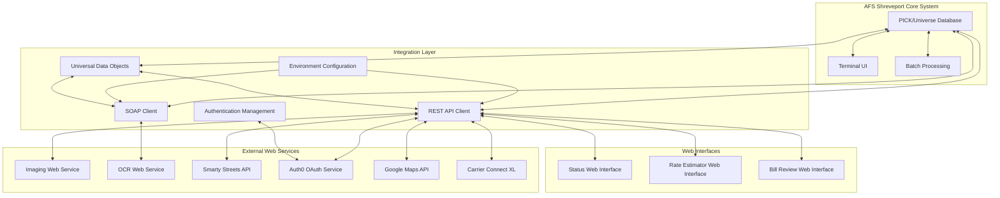
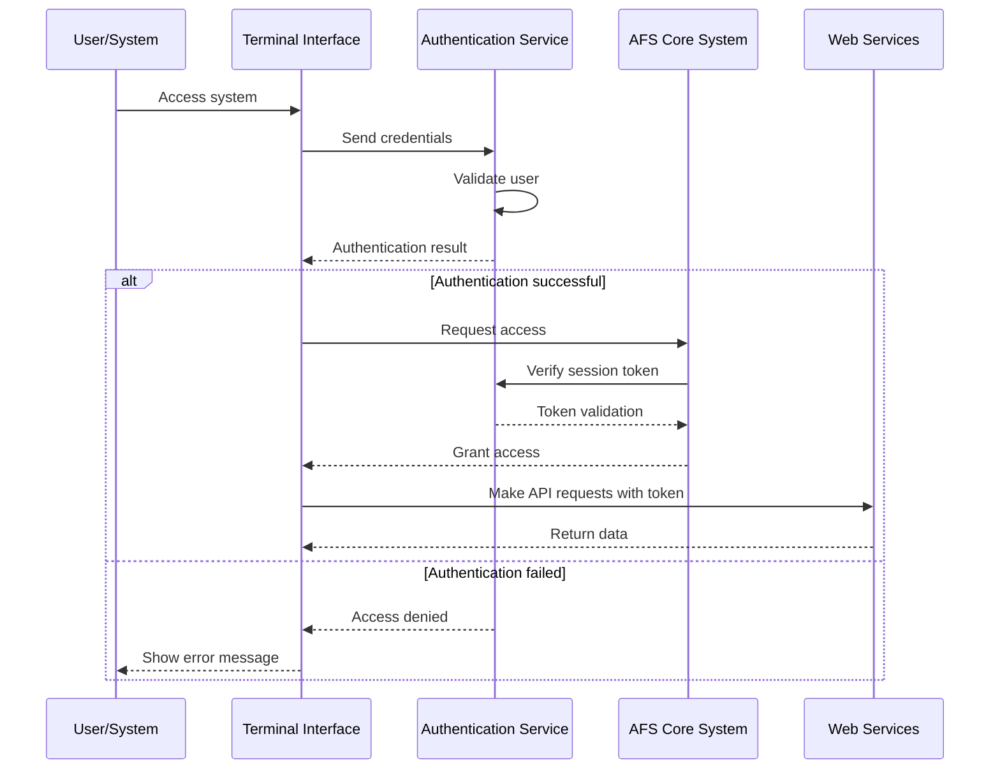
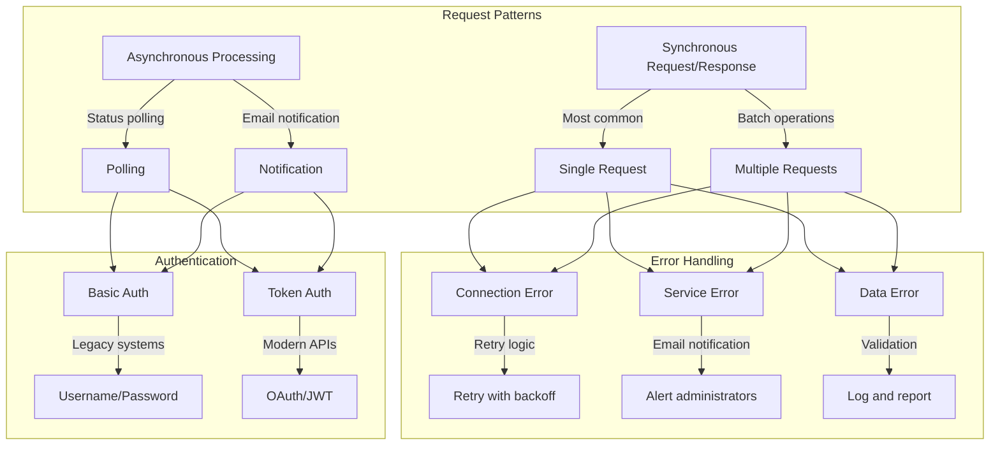
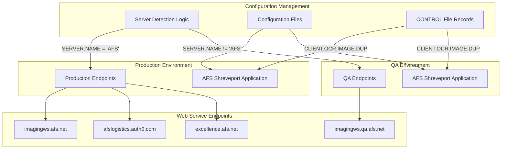

# Web Integration Architecture in AFS Shreveport

## Overview of Web Integration Architecture

AFS Shreveport implements a comprehensive web integration architecture that connects its core freight billing platform with external web services, APIs, and user interfaces. The system utilizes a combination of modern REST APIs and legacy SOAP web services to provide seamless communication between the terminal-based PICK/Universe system and web-based components. This integration enables critical business functions including document imaging, OCR processing, address validation, freight rate estimation, and status reporting. The architecture employs a layered approach with security contexts for TLS communication, standardized error handling, and environment-specific configurations that differentiate between production and QA systems. Data exchange primarily occurs through JSON and XML formats, with specialized parsers for handling structured responses from external services.

The diagram illustrates how AFS Shreveport's core system connects to external web services through the integration layer. The PICK/Universe database serves as the central data repository, while specialized clients handle REST and SOAP communications. Universal Data Objects (UDO) facilitate parsing of JSON and XML responses. The system supports multiple web interfaces for status reporting, rate estimation, and bill review, all connected through standardized API calls.

## REST API Implementation

AFS Shreveport implements REST API calls extensively throughout the system, particularly for imaging services, OCR processing, and data retrieval. The implementation follows a consistent pattern across various components, using Universe BASIC's HTTP client capabilities to make secure API calls.

The system's REST implementation is characterized by several key features:

1. **TLS Security Context**: Most REST calls establish a TLS 1.2 security context for secure communication, as seen in `SEND.CLIENT.REST` and `BATCH.IMG.UPDT` where `CREATESECURITYCONTEXT(CTX, "TLSv1.2")` is used before making API requests.

2. **Environment-Aware Endpoints**: The system dynamically selects between production and QA endpoints based on server environment detection. For example, in `SEND.IMG.DUPLICATE.REST`, the code checks `SERVER.NAME` to determine whether to use `imagingws.afs.net` or `imagingws.qa.afs.net`.

3. **Universal Data Objects (UDO)**: For JSON parsing, the system employs Universe's UDO framework, which provides object-oriented access to complex data structures. This is evident in `SEND.CLIENT.REST.BATCH` where `UDORead(RESTDATA, UDOFORMAT_JSON, UDOHANDLE)` parses the JSON response.

4. **Standardized Error Handling**: REST implementations include comprehensive error handling with email notifications for critical failures. For instance, `SEND.IMG.PROC.REST` includes detailed response parsing with multiple status conditions and error reporting functions.

5. **Logging Capabilities**: Many REST implementations include optional protocol logging for debugging purposes, controlled by configuration parameters stored in the CONTROL file.

The REST API implementation serves various business functions, including updating image statuses, retrieving client data, marking documents as duplicates, and obtaining scan dates. These functions are critical for the system's document management and OCR processing workflows.

## SOAP Web Service Integration

AFS Shreveport maintains SOAP web service integration for legacy communication, particularly with OCR webservices and image processing systems. The SOAP implementation demonstrates how the system bridges older XML-based protocols with the modern architecture.

The SOAP integration is characterized by several distinctive features:

1. **XML Request Construction**: Programs like `SEND.IMAGE.UPDT` build complex SOAP envelopes with namespace declarations and operation parameters. The requests are constructed using string concatenation with careful attention to XML formatting requirements.

2. **XDOM Parsing**: For processing XML responses, the system uses XDOM (XML Document Object Model) functions rather than string manipulation. This provides structured access to response elements, as seen in `SEND.CLIENT` where `XDOMLocate` and `XDOMLocateNode` extract values from the XML structure.

3. **Retry Logic**: SOAP implementations often include retry mechanisms for handling connection failures. For example, `SEND.IMAGE.UPDT` implements configurable retry attempts when connecting to web services.

4. **Namespace Handling**: The code handles XML namespaces explicitly, sometimes using string replacements to clean up namespace declarations that might interfere with parsing, as demonstrated in `SEND.IMAGE.UPDT`.

5. **HTTP Headers**: SOAP requests include specific HTTP headers like SOAPAction that identify the intended operation at the endpoint, ensuring proper routing of the request.

The SOAP web service integration primarily supports OCR processing workflows, allowing the system to update image PICK data with client ID, image ID, and carrier information. While newer components use REST APIs, these SOAP integrations remain critical for certain legacy operations where XML-based protocols are still required.

This sequence diagram illustrates the authentication flow for web users accessing the AFS Shreveport system. The process begins with user credentials being validated by the authentication service. Upon successful authentication, a session token is issued that allows the terminal interface to access the core system and make API requests to web services. The diagram shows how token validation occurs at multiple points to maintain security throughout the session.

## JSON and XML Data Processing

AFS Shreveport employs sophisticated handling of structured data formats for web communication, including Universal Data Objects (UDO) for JSON parsing and XML generation. This capability is essential for integrating the legacy PICK/Universe system with modern web services.

### JSON Processing

The system's JSON handling is primarily implemented through the UDO framework, which provides object-oriented access to JSON data structures:

1. **UDO API**: Programs like `SEND.CLIENT.REST` use `UDORead(RESTDATA, UDOFORMAT_JSON, UDOHANDLE)` to parse JSON responses into manipulable objects.

2. **Array Handling**: For JSON arrays, the code uses `UDOArrayGetSize` to determine array length and `UDOArrayGetItem` to access individual elements, as seen in `OCR.FIND.IMAGE`.

3. **Property Access**: Object properties are accessed with `UDOGetProperty`, which handles different data types including nulls, booleans, and nested objects.

4. **Type Checking**: The system implements type checking with constants like `UDO_NULL`, `UDO_TRUE`, and `UDO_FALSE` to handle different JSON data types appropriately.

### XML Processing

XML handling is implemented through both string manipulation and the XDOM API:

1. **XML Generation**: Programs like `GET.ALL.FSC` build XML documents through string concatenation, carefully handling special characters with entity references (e.g., replacing `&` with `&amp;`).

2. **XDOM Parsing**: For complex XML responses, particularly from SOAP services, the system uses XDOM functions to navigate the document structure and extract values.

3. **Namespace Management**: The code handles XML namespaces explicitly, sometimes using string replacements to clean up namespace declarations that might interfere with parsing.

4. **Character Encoding**: XML outputs specify encoding (typically ISO-8859-1) and handle attribute marks by converting them to appropriate characters.

The system's ability to process both JSON and XML formats allows it to integrate with both modern REST APIs and legacy SOAP services, providing flexibility in how it communicates with external systems.

This flowchart illustrates the different communication patterns used for web service integration in AFS Shreveport. The system employs both synchronous request/response patterns for immediate operations and asynchronous processing for longer-running tasks. Error handling includes retry logic for connection issues, email notifications for service errors, and logging for data validation problems. Authentication methods vary between basic authentication for legacy systems and token-based authentication for modern APIs.

## Freight Rate Estimation Web Services

AFS Shreveport's freight rate estimation functionality is implemented through a sophisticated web service architecture that provides carrier selection and pricing calculations. This system is one of the most complex web integrations in the platform, combining internal rate data with external carrier information.

The rate estimation web services are characterized by several key components:

1. **Multi-Carrier Rating**: Programs like `INET.FB.ESTIMATOR` query multiple carrier rates simultaneously, applying client-specific business rules to filter and rank carriers based on cost and service levels.

2. **External Service Integration**: The system integrates with Carrier Connect XL to retrieve transit times and terminal information, enhancing the rate quotes with service details.

3. **Client-Specific Pricing Rules**: The estimation engine applies sophisticated client-specific markup calculations that vary based on shipment weight ranges, percentage-based or flat fee options, and logistics commission structures.

4. **Hazardous Materials Handling**: For specialized shipments, the system implements carrier filtering based on hazardous materials classifications and zone restrictions.

5. **Canadian Shipment Support**: The rate estimation services handle cross-border shipments with special pricing rules and carrier selection criteria for Canadian destinations.

6. **Vendor Quote Limiting**: For certain user types, particularly vendors, the system implements quote limiting logic that restricts the number of carriers displayed or shows percentage differences rather than actual costs.

7. **Activity Logging**: All rate requests are logged in detail, capturing client information, shipment parameters, and carrier quotes for auditing and analysis.

The freight rate estimation web services demonstrate how AFS Shreveport integrates internal pricing data with external carrier information to provide comprehensive shipping cost estimates. This integration is critical for clients making shipping decisions based on cost and service level comparisons.

## Status Reporting and Tracking

AFS Shreveport provides comprehensive freight bill status information through web interfaces for clients, carriers, and internal users. The status reporting system integrates with the core billing database to deliver real-time updates on shipment processing, payment status, and document handling.

Key aspects of the status reporting and tracking system include:

1. **Multi-User Type Support**: Programs like `INET.FB.STATUS` provide different output formats based on user type (client, carrier, AFSCS, AFSQV), tailoring the information displayed to each audience's needs.

2. **Cross-Reference Lookups**: The system uses sophisticated cross-reference lookups to find bills under alternate carrier codes, handling various PRO number formats and variations including those with suffixes (AD/BD) and slash notations.

3. **Comprehensive Status Information**: Status reports include detailed information such as processing dates, payment details, check numbers, cutback amounts and reasons, and rejection information.

4. **Special Carrier Handling**: The code implements special handling for various carriers like UPS and SAIA, accommodating their unique tracking number formats and requirements.

5. **XML Response Formatting**: For web service integration, programs like `INET.FB.STATUS.WEB` format responses as XML documents with proper character encoding and element structure.

6. **Activity Logging**: All status inquiries are logged to an activity file for auditing purposes, tracking who accessed what information and when.

7. **Payment Estimation**: For bills awaiting payment, the system calculates estimated check dates using historical payment patterns, providing clients with anticipated payment timelines.

The status reporting and tracking functionality demonstrates how AFS Shreveport exposes internal processing information through web interfaces, allowing stakeholders to monitor shipment status throughout the freight billing lifecycle. This transparency is critical for client satisfaction and operational efficiency.

This diagram illustrates how AFS Shreveport handles different environments (production vs. QA) for web service endpoints. The system uses server detection logic to determine the appropriate environment, then selects the corresponding endpoints for services like imaging, authentication, and document viewing. Configuration is managed through both files and database records in the CONTROL file, providing a flexible approach to environment-specific settings.

## Security and Error Handling

AFS Shreveport implements robust security practices and error handling mechanisms in its web integration components, ensuring data protection and operational reliability. These systems are critical for maintaining the integrity of freight billing operations while providing appropriate access to external systems.

### Security Implementation

1. **TLS Encryption**: Most web service calls use TLS 1.2 security contexts, as seen in `BATCH.IMG.UPDT` and `SEND.CLIENT.REST` where `CREATESECURITYCONTEXT(CTX, "TLSv1.2")` establishes secure connections.

2. **Authentication Systems**: The platform implements user authentication through `INET.LOGIN`, which validates credentials against the INET.USER file and tracks login attempts for security monitoring.

3. **Failed Login Tracking**: Programs like `INET.LOGIN.TEST` record failed login attempts in the INET.ATTEMPTS file with timestamps for security analysis.

4. **OAuth Integration**: For modern API authentication, the system uses OAuth tokens from Auth0, as demonstrated in the `UDO.GEOTOADDR` program.

5. **User Authorization**: Access to sensitive operations is restricted based on user roles, as seen in `OCR.DELETE.BATCH` where only authorized users can delete image batches.

### Error Handling

1. **Email Notifications**: Critical errors trigger email notifications to administrators, as implemented in `SEND.IMG.DUPLICATE.REST` and other integration components.

2. **Detailed Logging**: Many programs implement optional protocol logging for debugging purposes, controlled by configuration parameters.

3. **Response Validation**: Web service responses are carefully validated with case-based logic to handle different status conditions, as seen in `SEND.IMG.PROC.REST`.

4. **Retry Logic**: Some components implement retry mechanisms for handling transient failures, particularly in SOAP web service calls.

5. **Activity Logging**: User actions and system operations are logged for audit purposes, providing accountability and troubleshooting information.

The combination of strong security practices and comprehensive error handling ensures that AFS Shreveport's web integration components operate reliably while protecting sensitive freight billing data from unauthorized access or corruption.

## Terminal Integration with Web Resources

AFS Shreveport uniquely bridges its terminal-based interfaces with web resources through sophisticated integration techniques, allowing users of the traditional terminal system to access modern web functionality. This integration enables seamless transitions between the character-based terminal environment and web-based resources.

Key aspects of terminal integration with web resources include:

1. **Browser Launching**: Programs like `SHOW.AFSBOL` and `SHOW.AFSOCR` use terminal escape sequences to launch external web browsers from within the terminal interface. For example, `SHOW.AFSBOL` uses `CRT ESC:STX:'P Call Shell("':URL:'",1)':CR` to open Bill of Lading documents in a browser.

2. **Terminal Type Detection**: The system detects terminal types using `SYSTEM(7)` and adapts its behavior accordingly. For WY50 or REGENT60 terminals, it uses specific escape sequences, while for other terminals it uses more generic commands.

3. **URL Construction**: URLs are dynamically constructed based on document identifiers and system parameters. For example, BOL numbers with 'SM' prefixes are directed to different web systems than standard BOL numbers.

4. **Control Character Handling**: The code defines and uses special control characters (STX, EOT, LF, CR, ESC) to communicate with terminal emulators and trigger external processes.

5. **Remote Command Execution**: Some integrations use ProComm's remote command capabilities to execute external processes from the terminal environment.

This terminal integration with web resources demonstrates how AFS Shreveport maintains backward compatibility with terminal-based workflows while leveraging modern web technologies. Users can seamlessly access web-based document viewers, imaging systems, and other resources without leaving the familiar terminal interface, creating a hybrid experience that combines the efficiency of terminal operations with the rich functionality of web applications.

[Generated by the Sage AI expert workbench: 2025-05-28 08:06:26  https://sage-tech.ai/workbench]: #