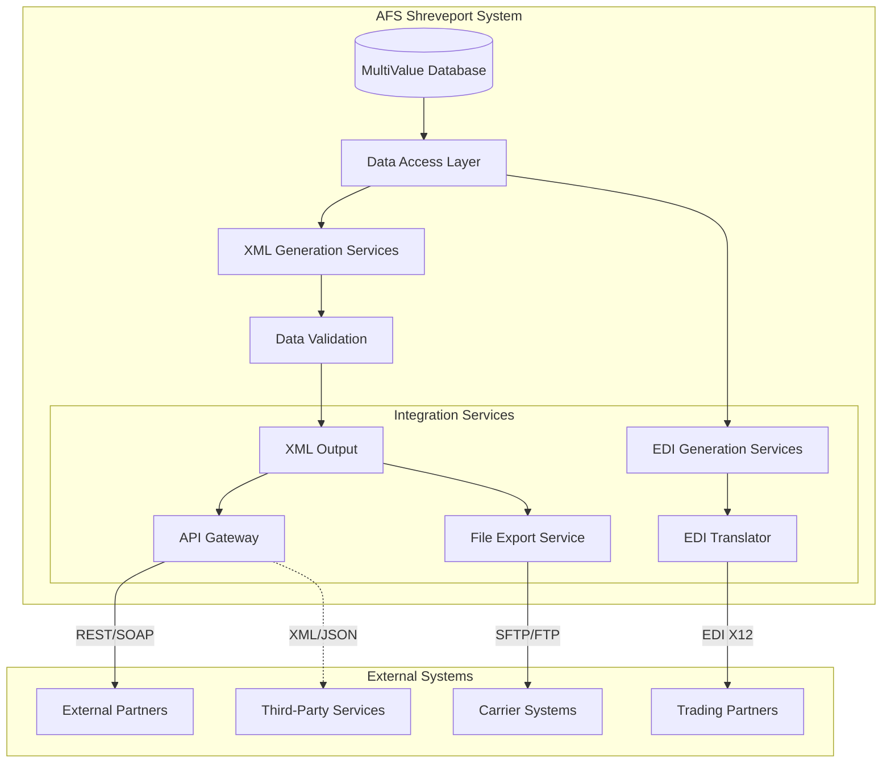
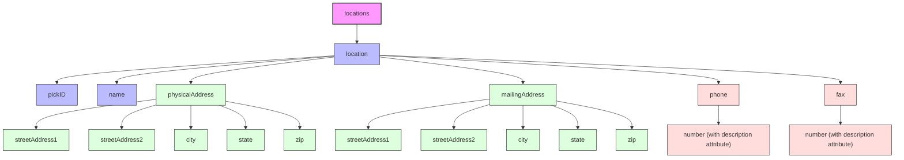
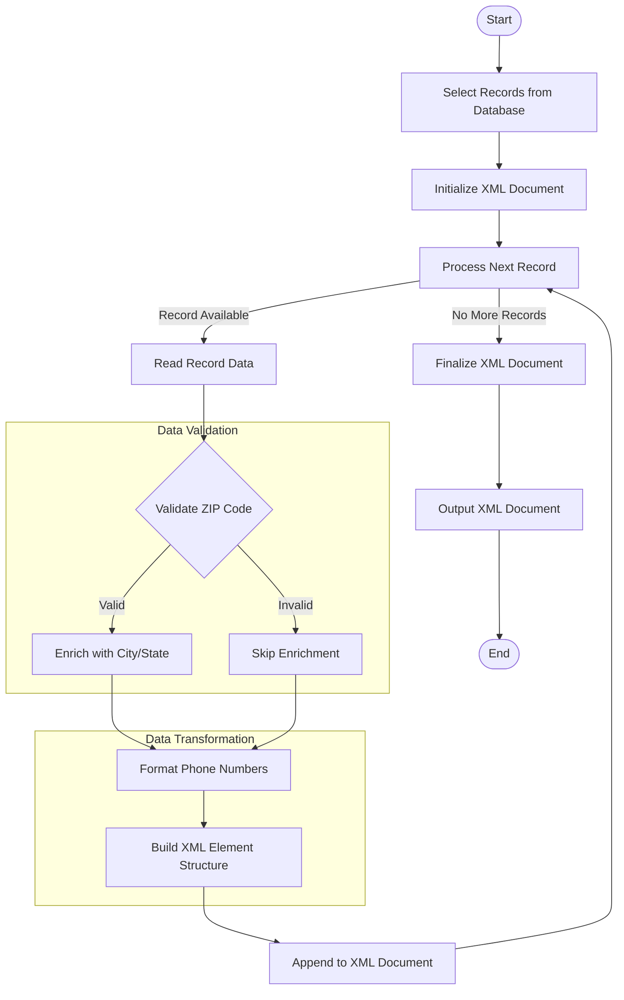

# XML Data Exchange in AFS Shreveport

## XML Data Exchange Overview

XML (eXtensible Markup Language) serves as a critical data exchange format within the AFS Shreveport system, providing a standardized method for structured data sharing between internal components and external partners. As a self-describing, platform-independent format, XML enables AFS Shreveport to encapsulate complex logistics data in a hierarchical structure that maintains relationships between data elements while ensuring compatibility across diverse systems. The system leverages XML for various integration scenarios, including location data sharing, carrier information exchange, and third-party service integration. By implementing XML-based data exchange, AFS Shreveport achieves loose coupling between system components, allowing for flexible integration patterns and simplified maintenance of interface contracts. This approach is particularly valuable in the logistics domain where data must flow seamlessly between disparate systems operated by clients, carriers, and service providers.

## XML Data Exchange Architecture

The architecture diagram illustrates how XML data flows through the AFS Shreveport system. At the core, the MultiValue database stores the primary data which is accessed through a data access layer. The system provides parallel paths for data exchange: XML generation for modern integrations and EDI for traditional logistics partners.

The XML generation process includes validation steps to ensure data integrity before producing the final XML output. This output is then routed through integration services - either via an API Gateway for real-time REST/SOAP interactions or through file export services for batch processing. The diagram shows how XML serves as a bridge between AFS Shreveport's internal data structures and various external systems, including carrier systems, trading partners, and third-party services. The bidirectional arrows indicate that XML is used for both outbound and inbound data exchange, creating a comprehensive integration ecosystem.

## Location Data XML Generation

The INET.LOCATIONS program exemplifies AFS Shreveport's approach to XML data generation, specifically focusing on transforming location records into a standardized XML format. This PICK BASIC program retrieves location data from the LOCATIONS database and structures it according to a well-defined XML schema. The program employs a systematic approach to data extraction, first opening the necessary database files (LOCATIONS, ZIPS.CODES, and CAN.ZIP.CODES), then processing each location record to extract essential information including name, physical address, mailing address, phone numbers, and fax numbers. A notable aspect of this implementation is the READ.ZIP subroutine, which performs ZIP code validation and enrichment by looking up city and state information for both US and Canadian addresses. The program constructs the XML document hierarchically, starting with the XML declaration and root element, then nesting location-specific elements with appropriate attributes. Phone number formatting is standardized using a pattern ('R###-###-####') to ensure consistency across all records. This transformation process effectively bridges the gap between AFS Shreveport's internal data representation and the standardized XML format required for external system integration, enabling seamless data exchange with partners and third-party services.

## XML Structure and Formatting Standards

The XML documents generated by AFS Shreveport adhere to a consistent structure and formatting standard that balances readability with efficient data representation. Documents begin with the standard XML declaration specifying version 1.0 and ISO-8859-1 encoding, ensuring compatibility with various XML parsers. The system employs a hierarchical element structure that mirrors the logical organization of logistics data, with clear parent-child relationships. For example, location data is encapsulated within a `<locations>` root element containing multiple `<location>` child elements, each with nested elements for addresses, contact information, and identifiers. Element naming follows a camelCase convention for multi-word concepts (e.g., `<streetAddress1>`, `<physicalAddress>`), promoting readability while avoiding spaces. Attributes are used judiciously to provide metadata about elements rather than to store primary data values, as seen in the phone number elements where `description` attributes qualify the type of phone number. Empty elements are handled consistently by either using self-closing tags or omitting the element entirely, depending on the context. The system avoids excessive whitespace within elements while maintaining proper indentation in the XML structure. Special characters are properly escaped according to XML specifications, and all elements are explicitly closed, maintaining well-formedness. These formatting standards ensure that XML documents produced by AFS Shreveport are both human-readable for troubleshooting and efficiently parseable by automated systems.

## XML Element Hierarchy for Location Data

The diagram illustrates the hierarchical structure of XML elements used to represent location data in AFS Shreveport. At the top level, the `locations` element serves as the container for all location records. Each individual location is represented by a `location` element that contains several child elements organizing the data logically.

The structure separates core identification (`pickID`, `name`), physical and mailing addresses (each with their own hierarchy of street, city, state, and ZIP elements), and contact information (phone and fax). This organization reflects the natural grouping of related data and facilitates processing by both humans and machines. The address components follow identical patterns for both physical and mailing addresses, promoting consistency and simplifying parsing logic.

Contact information uses a more complex structure where the `phone` and `fax` elements contain multiple `number` elements, each with a `description` attribute that qualifies the type of number (e.g., "Main", "Customer Service"). This approach allows for multiple contact points while maintaining the semantic meaning of each.

This well-structured hierarchy enables efficient data extraction, validation, and transformation while preserving the relationships between different pieces of location information.

## Data Validation and Transformation

The AFS Shreveport system implements comprehensive validation and transformation processes during XML generation to ensure data integrity and standardization. For location data, ZIP code validation represents a critical validation step, with the system handling both US 5-digit and Canadian 6-character postal codes through distinct validation paths. The READ.ZIP subroutine in INET.LOCATIONS demonstrates this dual approach, querying either the ZIPS.CODES or CAN.ZIP.CODES files based on the ZIP format, then enriching the data with city and state information. This validation not only verifies the existence of the ZIP code but also standardizes the associated geographical data. Phone number formatting represents another key transformation process, with the system applying a consistent 'R###-###-####' pattern to ensure uniformity across all contact numbers. The system handles empty or missing data fields gracefully by conditionally including XML elements only when corresponding data exists, preventing the generation of empty tags that could confuse consuming systems. Address components undergo structural validation to ensure proper formatting and completeness, with separate validation rules for physical and mailing addresses. The validation process also includes character encoding checks to ensure compatibility with the ISO-8859-1 encoding specified in the XML declaration. By implementing these validation and transformation processes, AFS Shreveport ensures that the XML data exchanged with external systems is consistent, accurate, and properly formatted according to established standards.

## Integration with External Systems

XML data exchange serves as the foundation for AFS Shreveport's integration with external systems, providing a flexible and standardized mechanism for data sharing across organizational boundaries. The system leverages XML's platform-independence to facilitate seamless integration with carrier systems, third-party logistics providers, and client applications regardless of their underlying technology stack. For carrier integrations, location data in XML format enables accurate shipment routing and delivery point identification, with the standardized structure ensuring consistent interpretation across diverse carrier systems. Third-party service integrations, such as address validation services and mileage calculation engines, consume AFS Shreveport's XML output and return enriched data in compatible formats, maintaining data integrity throughout the integration chain. Client systems benefit from the self-describing nature of XML, which simplifies the consumption and interpretation of logistics data without requiring extensive transformation logic. The system supports both synchronous integrations through web services (REST/SOAP) and asynchronous integrations through file-based exchanges, with XML serving as the common data format across both patterns. By implementing XML namespaces and versioning strategies, AFS Shreveport manages the evolution of integration interfaces while maintaining backward compatibility. This approach to external system integration through standardized XML exchanges has enabled AFS Shreveport to build a robust ecosystem of connected applications that collectively deliver comprehensive logistics management capabilities.

## XML Processing Workflow

The flowchart illustrates the end-to-end process of XML data generation, validation, and consumption within the AFS Shreveport ecosystem. The workflow begins with selecting relevant records from the database and initializing the XML document structure with appropriate headers and root elements.

The core processing occurs in a loop that processes each record individually. For each record, the system reads the data, validates critical elements like ZIP codes, and enriches the data with additional information such as city and state lookups. Data transformation steps include formatting phone numbers according to standardized patterns and structuring the data into the hierarchical XML format.

The validation phase ensures data integrity before it enters the XML document, while the transformation phase converts internal data representations into standardized XML formats. Each processed record is appended to the growing XML document until all records have been processed.

Once all records are processed, the XML document is finalized by adding closing tags and any required footer elements. The completed XML document is then output for consumption by downstream systems, whether through direct API responses, file exports, or other integration mechanisms.

This systematic workflow ensures that XML data generated by AFS Shreveport is consistent, validated, and properly structured for reliable consumption by both internal and external systems.

## EDI and XML Relationship

In the AFS Shreveport system, Electronic Data Interchange (EDI) and XML data exchange exist as complementary technologies, each serving distinct integration needs while occasionally overlapping in functionality. EDI, with its long history in logistics and transportation, provides standardized transaction sets (such as 204 Load Tenders, 214 Shipment Status, and 210 Freight Invoices) that follow strict formatting rules and are deeply embedded in industry practices. XML, by contrast, offers greater flexibility and readability, making it ideal for modern integration scenarios. AFS Shreveport leverages both technologies strategically: EDI for established carrier and trading partner integrations where industry standards dictate the exchange format, and XML for newer integrations, especially with web services and APIs. The system implements transformation capabilities that convert between EDI and XML formats, allowing data to flow seamlessly between these two exchange methods. For instance, location data might be maintained in XML format internally but transformed to EDI when communicating with carriers that require traditional EDI formats. This bidirectional transformation preserves semantic meaning while adapting to the technical requirements of each integration point. The system also employs hybrid approaches where XML is used for data enrichment and transformation before generating EDI output, leveraging XML's processing capabilities while maintaining EDI compatibility. By supporting both EDI and XML data exchange methods, AFS Shreveport achieves comprehensive integration coverage across both traditional and modern logistics ecosystems, ensuring compatibility with the full spectrum of trading partners.

## Performance Considerations

The XML generation process in AFS Shreveport incorporates several performance optimization techniques to ensure efficient handling of large datasets while maintaining system responsiveness. The INET.LOCATIONS program demonstrates these optimizations through its implementation of efficient database access patterns. Rather than loading all location records into memory at once, it uses the READNEXT loop pattern with a pre-selected list of records, processing each record individually and building the XML document incrementally. This approach minimizes memory consumption and allows the system to handle arbitrarily large datasets without exhausting available resources. The program also implements conditional XML element generation, only creating elements when corresponding data exists, which reduces the size of the generated XML and improves transmission efficiency. Database lookups for ZIP code validation are optimized through direct-key access rather than sequential searches, providing O(1) complexity for these frequent operations. The system avoids unnecessary string manipulations by building XML elements directly with the appropriate content, rather than creating intermediate string representations that would require additional processing. For very large datasets, the system can implement pagination strategies that generate XML in manageable chunks, allowing for streaming processing by consuming applications. Performance monitoring is built into the XML generation process, with timing metrics collected to identify bottlenecks and optimization opportunities. These performance considerations ensure that XML data exchange in AFS Shreveport remains efficient even as data volumes grow, maintaining system responsiveness while providing timely data integration capabilities.

## Future Enhancements and Standards Evolution

AFS Shreveport's XML data exchange capabilities are positioned for several strategic enhancements to adapt to evolving industry standards and integration requirements. A key planned improvement is the implementation of XML Schema Definition (XSD) validation to enforce stricter data typing and structural validation, ensuring even greater data integrity across system boundaries. The system is also being prepared to support JSON as an alternative serialization format alongside XML, recognizing the growing preference for JSON in modern web APIs while maintaining backward compatibility with existing XML integrations. To address increasing data volumes, future enhancements include implementing streaming XML processing capabilities that can handle arbitrarily large datasets without loading entire documents into memory. Security improvements are planned through the adoption of XML encryption and digital signatures for sensitive data exchanges, particularly for financial and personally identifiable information. The system will evolve to support emerging industry standards such as the National Motor Freight Classification (NMFC) XML schemas and GS1 XML for supply chain visibility. Integration with cloud-based APIs will be enhanced through support for OAuth 2.0 authentication and API gateway integration patterns. Performance optimizations will include implementing binary XML formats like EXI (Efficient XML Interchange) for bandwidth-constrained scenarios. As logistics industry standards continue to evolve, AFS Shreveport's XML capabilities will adapt through configurable transformation rules that can accommodate new field requirements and structural changes without requiring core system modifications. These planned enhancements ensure that AFS Shreveport's XML data exchange capabilities will remain robust, flexible, and aligned with industry best practices as integration requirements continue to evolve.

[Generated by the Sage AI expert workbench: 2025-05-28 08:06:31  https://sage-tech.ai/workbench]: #