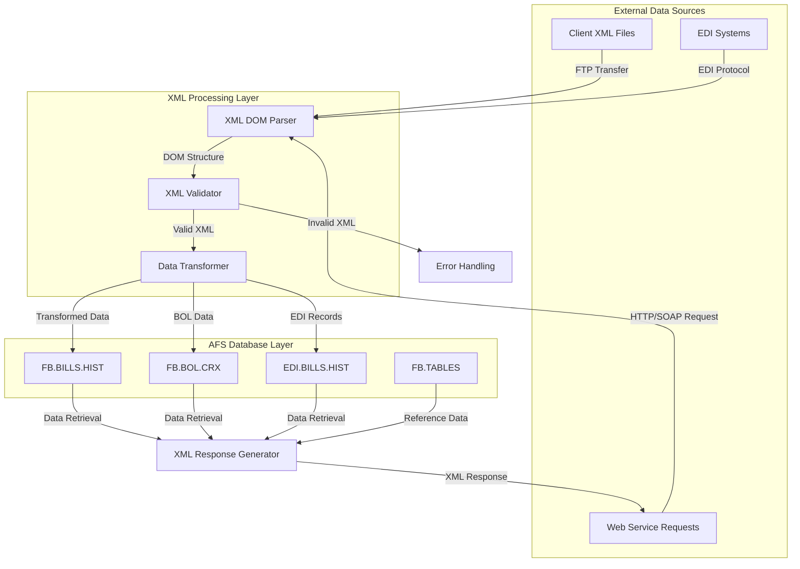
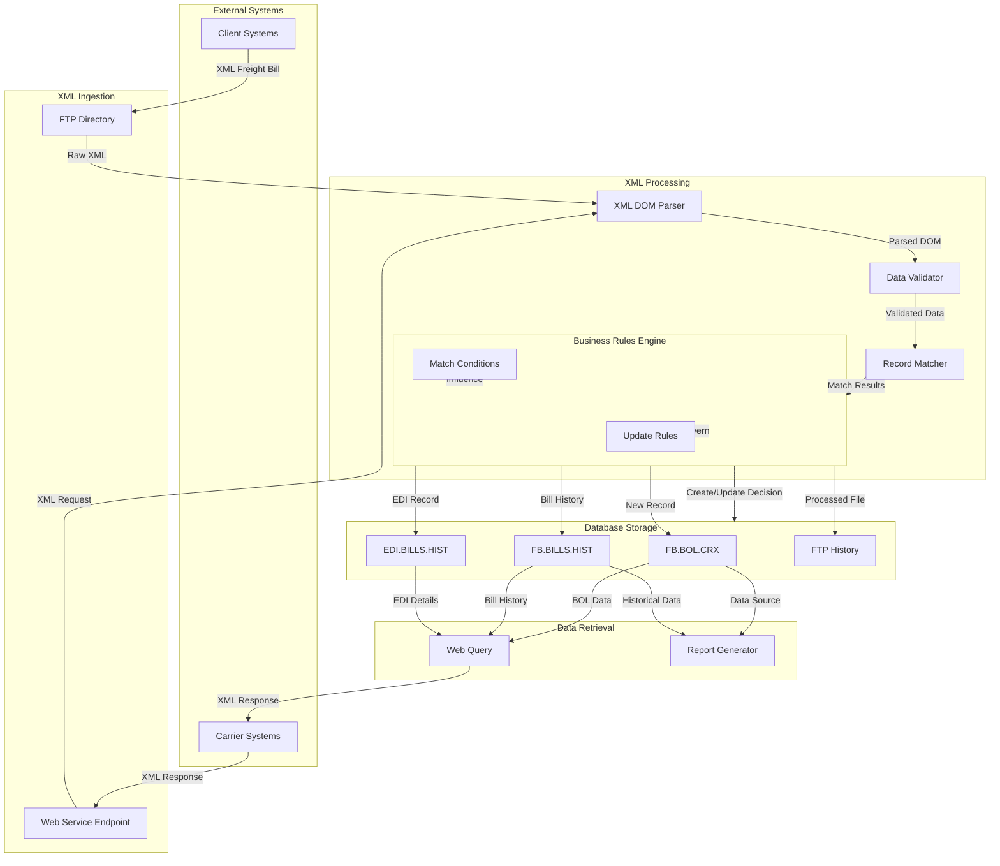

# XML Database Integration in AFS Shreveport

## Overview of XML Database Integration in AFS Shreveport

XML technology serves as a critical bridge between external systems and the AFS Shreveport database infrastructure. The integration architecture leverages XML as both a data exchange format and a transformation mechanism, enabling seamless communication between disparate systems. Within the AFS Shreveport system, XML processing is implemented through a multi-layered approach that handles parsing, validation, transformation, and storage of freight billing data. The system utilizes Universe's XML DOM API to process complex XML structures, providing a robust framework for handling client-specific data formats and requirements. This integration supports various business processes including freight bill processing, electronic data interchange (EDI), and web service responses, forming a comprehensive XML-based data pipeline that connects external partners with the core database systems.

## XML Processing Architecture

The diagram illustrates the XML processing architecture in AFS Shreveport, showing how data flows from external sources through the system. External XML data enters through various channels (FTP, EDI, web services) and is processed by the XML DOM parser. The parsed data undergoes validation and transformation before being stored in appropriate database files. For outbound processes, data is retrieved from these databases and formatted into XML responses for web services and other external systems. This architecture supports both synchronous and asynchronous processing patterns, with specialized handling for different client formats and requirements.

## XML DOM API Implementation

AFS Shreveport makes extensive use of Universe's XML DOM API to parse and manipulate complex XML structures from freight bill data. The implementation follows the Document Object Model (DOM) approach, where XML documents are loaded into memory as tree structures that can be traversed and manipulated programmatically. This is evident in the FB.IMPORT.SM.BOL program, which uses functions like `XDOMOpen`, `XDOMLocate`, and `XDOMGetNodeValue` to navigate through XML nodes and extract specific data elements. The DOM API provides a robust framework for handling deeply nested XML structures, enabling the system to process complex freight billing documents with multiple levels of hierarchy.

The implementation includes specialized error handling for XML parsing failures, with detailed error codes and messages captured for troubleshooting. The system maintains context during parsing operations through variables like `STAT.VAL`, which tracks the current node being processed. This contextual awareness is crucial for diagnosing parsing issues in production environments. Additionally, the DOM implementation supports both synchronous processing for immediate data needs and batch processing for larger XML files, with appropriate memory management techniques to handle large documents efficiently.

## Client-Specific XML Data Processing

AFS Shreveport implements a sophisticated approach to handling client-specific XML formats and requirements. The system recognizes that different clients may use varying XML schemas, tag naming conventions, and data structures to represent similar freight billing concepts. To accommodate this diversity, the platform employs client-specific XML processing rules that are configured and stored in the system's database. For example, the Swedish Match BOL import process (FB.IMPORT.SM.BOL) demonstrates how the system handles a client-specific XML format with dedicated parsing logic tailored to that client's data structure.

The client-specific processing includes custom field mappings between XML elements and database fields, with transformation rules that normalize client data into the system's standard format. These mappings are often complex, involving conditional logic that depends on the presence or absence of certain XML elements or attribute values. The system also implements client-specific validation rules that enforce business constraints beyond basic XML schema validation. For instance, the Swedish Match import process includes business logic to handle four different match conditions when comparing new BOL data against existing records, ensuring data integrity while accommodating client-specific business rules.

## XML Data Flow for Freight Bills

This diagram illustrates the comprehensive flow of XML freight bill data through the AFS Shreveport system. The process begins with XML data arriving from external client systems via FTP or web service endpoints. The XML is parsed using the DOM API and validated against business rules. A key component is the record matcher, which determines if incoming data matches existing records in the database. The business rules engine applies different logic based on match conditions (same order numbers/dates, different order numbers/dates, etc.) to determine whether to create new records or update existing ones.

After processing, the data is stored in appropriate database files including FB.BOL.CRX for bill of lading data, FB.BILLS.HIST for historical bill information, and EDI.BILLS.HIST for EDI-specific records. The original XML files are archived in FTP history directories for audit purposes. When data retrieval is needed, the system can access these database files to generate XML responses for web queries or produce reports. This comprehensive data flow ensures that freight bill information is properly captured, processed, and made available throughout the system while maintaining data integrity and historical records.

## XML Response Generation for Web Services

AFS Shreveport implements a sophisticated XML response generation system for its web services, exemplified by the INET.FB.DETAILS program. This program dynamically constructs XML responses containing detailed freight bill information based on client or carrier queries. The response generation process begins with database retrieval operations that gather data from multiple sources, including FB.BILLS.CRX, FB.BILLS.HIST, and EDI.BILLS.HIST. The system then assembles this data into a hierarchical XML structure that follows a predefined schema appropriate for the specific transportation mode (LTL, Parcel, or Truckload).

The XML response generation incorporates client-specific customizations through conditional logic that adapts the output format based on the requesting entity's profile. For instance, carrier users receive different XML structures than client users, with appropriate data visibility controls applied. The system also handles specialized formatting requirements, such as PRO number formatting overrides based on client/carrier combinations. The XML construction process is modular, with separate subroutines handling different sections of the response (carrier information, shipper details, consignee data, charge breakdowns, etc.), which enhances maintainability and allows for targeted customizations. This modular approach enables the system to generate consistent XML responses while accommodating the diverse requirements of different clients and transportation modes.

## XML Data Validation and Error Handling

AFS Shreveport implements a comprehensive validation and error handling framework for XML data processing. The validation process begins with structural validation, ensuring that incoming XML documents conform to expected schemas and contain required elements. For example, in the FB.IMPORT.SM.BOL program, the system checks for the presence of end tags to verify that XML files have been completely transferred before processing begins. This prevents partial processing of incomplete data that might arrive during FTP transfers.

Beyond structural validation, the system implements business rule validations that enforce data integrity constraints specific to freight billing operations. These include checks for matching order numbers and dates when comparing new BOL data against existing records. The validation framework categorizes different match conditions (same order numbers/same dates, same numbers/different dates, etc.) to determine appropriate processing actions.

When validation errors occur, the system employs a multi-faceted error handling approach. Technical errors during XML parsing are captured with detailed error codes and messages, which can be logged for troubleshooting. Business rule violations generate structured error messages that clearly explain the nature of the problem. These error messages are incorporated into email notifications sent to appropriate stakeholders, ensuring timely awareness of issues. The system maintains detailed audit trails of validation failures, recording both the problematic data and the specific validation rules that were violated. This comprehensive approach to validation and error handling ensures data integrity while providing clear feedback mechanisms for resolving issues.

## XML to Database Mapping

```mermaid
flowchart TD
    subgraph XMLDoc["XML Document Structure"]
        Root["int0129_d365fo_fbp_freightbills"]
        Value["value"]
        DataArea["dataAreaId"]
        BatchExec["BatchExecutionId"]
        ShipDate["ShipDate"]
        ShipNum["ShipmentNumber"]
        Carrier["Carrier"]
        FromZip["FromZip"]
        ToZip["ToZip"]
        Codes["SM_FreightBillsPayableCodes"]
        NMFCCode["NMFCCode"]
        Weight["Weight"]
    end
    
    subgraph DBStruct["Database Structure"]
        BOL_File["FB.BOL.CRX File"]
        BOL_Record["BOL Record"]
        Amount["<1> Amount"]
        Date["<2> Ship Date"]
        UpdateDate["<4> Update Date"]
        OrderNum["<8> Order Number"]
        Account["<9> Account"]
        ShipType["<10> Shipment Type"]
        CarrierCode["<11> Carrier Code"]
        Cases["<12> Cases"]
        Warehouse["<13> Warehouse"]
        OriginZip["<14> Origin ZIP"]
        OriginCity["<15> Origin City"]
        OriginState["<16> Origin State"]
        DestName["<17> Destination Name"]
        DestZip["<18> Destination ZIP"]
        DestCity["<19> Destination City"]
        DestState["<20> Destination State"]
        Class["<21> Class"]
        ItemWeight["<22> Weight"]
    end
    
    Root --> Value
    Value --> DataArea
    Value --> BatchExec
    Value --> ShipDate
    Value --> ShipNum
    Value --> Carrier
    Value --> FromZip
    Value --> ToZip
    Value --> Codes
    Codes --> NMFCCode
    Codes --> Weight
    
    ShipDate -->|Transform Date Format| Date
    ShipNum -->|Direct Mapping| OrderNum
    Carrier -->|Direct Mapping| CarrierCode
    FromZip -->|Direct Mapping| OriginZip
    ToZip -->|Direct Mapping| DestZip
    NMFCCode -->|Direct Mapping| Class
    Weight -->|Direct Mapping| ItemWeight
    
    Date --> BOL_Record
    UpdateDate --> BOL_Record
    OrderNum --> BOL_Record
    Account --> BOL_Record
    ShipType --> BOL_Record
    CarrierCode --> BOL_Record
    Cases --> BOL_Record
    Warehouse --> BOL_Record
    OriginZip --> BOL_Record
    OriginCity --> BOL_Record
    OriginState --> BOL_Record
    DestName --> BOL_Record
    DestZip --> BOL_Record
    DestCity --> BOL_Record
    DestState --> BOL_Record
    Class --> BOL_Record
    ItemWeight --> BOL_Record
    
    BOL_Record --> BOL_File
```

This diagram illustrates how XML elements from freight bill data are mapped to database fields in the AFS Shreveport system. The left side shows the hierarchical structure of an incoming XML document, focusing on the Swedish Match BOL format as an example. The right side represents the corresponding database structure in the FB.BOL.CRX file.

The mapping process involves both direct mappings and transformations. For example, the ShipDate element undergoes a date format transformation before being stored in the Date field (attribute 2) of the BOL record. Most other elements have direct mappings to specific database fields, such as ShipmentNumber to OrderNum (attribute 8) and Carrier to CarrierCode (attribute 11).

The system handles nested XML structures like SM_FreightBillsPayableCodes by extracting specific child elements (NMFCCode, Weight) and mapping them to appropriate database fields. This mapping process ensures that all relevant data from the XML document is correctly stored in the database while maintaining the relationships and semantics of the original data. The structured approach to XML-to-database mapping enables efficient data storage and retrieval while preserving the business context of the freight billing information.

## Integration with External Systems via XML

AFS Shreveport leverages XML as a primary integration mechanism for connecting with external partner systems, EDI processes, and third-party services. The system implements both inbound and outbound XML integration patterns to facilitate seamless data exchange. For inbound integration, the platform accepts XML files via FTP transfers from clients like Swedish Match, as demonstrated in the FB.IMPORT.SM.BOL program. These files follow client-specific XML schemas and are processed through the system's XML parsing infrastructure before being stored in the appropriate database files.

For outbound integration, AFS Shreveport generates XML responses to external queries, as shown in the INET.FB.DETAILS program. This program constructs detailed XML documents containing freight bill information in response to web service requests from carriers or clients. The XML responses are structured according to the specific needs of the requesting system, with different formats for LTL, Parcel, and Truckload transportation modes.

The system also integrates with EDI processes through XML, serving as an intermediary between traditional EDI formats and modern XML-based systems. This hybrid approach allows AFS Shreveport to maintain compatibility with legacy EDI partners while offering XML-based integration options for newer systems. The platform includes specialized handling for different EDI transaction types, mapping them to appropriate XML structures for internal processing and external communication. This comprehensive XML integration strategy enables AFS Shreveport to function as a central hub in a complex ecosystem of freight logistics systems, facilitating efficient data exchange across diverse technological platforms.

## XML-Based Audit and Reporting

XML plays a crucial role in AFS Shreveport's audit trail and reporting capabilities, providing a structured format for capturing, storing, and retrieving historical transaction data. The system implements a comprehensive audit logging mechanism that records XML processing activities, including file receipts, parsing operations, data transformations, and database updates. For example, the FB.IMPORT.SM.BOL program writes processed XML files to a history directory (FTP.CLIENT_ID.HISTORY) before deleting them from the active FTP directory, creating a permanent record of all processed files.

The audit trail captures detailed information about each transaction, including timestamps, user identifiers, processing outcomes, and match conditions for data comparisons. This information is structured in a way that facilitates both automated analysis and human review. The system generates detailed email reports summarizing XML processing results, including statistics on records processed, match conditions encountered, and any errors or exceptions that occurred during processing.

For reporting purposes, XML provides a flexible format for extracting and presenting data from the system. The INET.FB.DETAILS program demonstrates how the system can generate comprehensive XML reports containing detailed freight bill information, including invoice details, carrier information, shipper/consignee data, and itemized charges. These XML reports can be consumed by various reporting tools or transformed into other formats like HTML, PDF, or Excel for distribution to stakeholders. The structured nature of XML makes it particularly well-suited for reporting, as it preserves the hierarchical relationships between data elements while providing a format that can be easily transformed for different presentation needs.

## Future Directions for XML Integration

While the current XML integration in AFS Shreveport provides robust functionality, several modernization opportunities could enhance the system's capabilities and maintainability. A key area for improvement is the adoption of XML Schema Definition (XSD) for formal validation of incoming XML documents. Implementing XSD validation would provide stronger type checking, enforce structural constraints, and enable more precise error reporting than the current approach of manual validation through code.

Another promising direction is the integration of XML with JSON processing capabilities, creating a hybrid approach that leverages the strengths of both formats. JSON's lighter weight and native compatibility with web technologies make it attractive for modern web services, while maintaining XML support ensures compatibility with existing systems and partners. This could be implemented through a unified data processing layer that handles both formats transparently.

The system could also benefit from implementing XSLT (Extensible Stylesheet Language Transformations) for more declarative and maintainable XML transformations. Rather than embedding transformation logic in PICK BASIC code, XSLT stylesheets could define transformations in a more standardized and maintainable way. This approach would separate transformation rules from processing logic, making it easier to modify and extend transformations as client requirements evolve.

Additionally, implementing a more comprehensive XML caching strategy could improve performance for frequently accessed data. By caching parsed XML structures or pre-generated XML responses, the system could reduce processing overhead and improve response times for common queries. As the system evolves, these enhancements to XML processing would maintain compatibility with existing integrations while providing a path toward more modern, efficient, and maintainable data exchange mechanisms.

[Generated by the Sage AI expert workbench: 2025-05-28 08:06:30  https://sage-tech.ai/workbench]: #