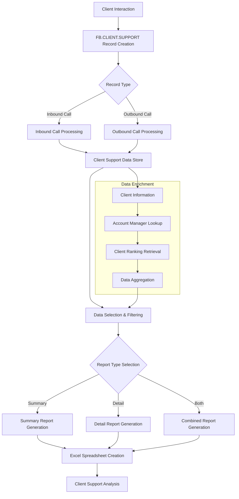
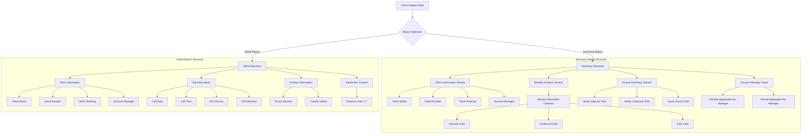
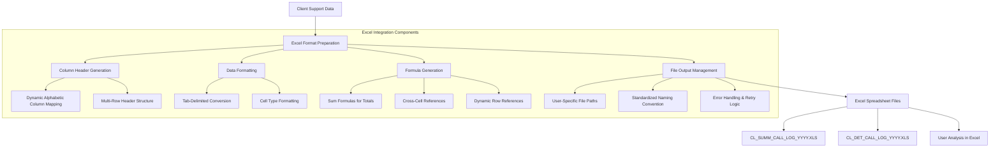
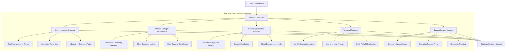

# Client Support Reporting in AFS Shreveport

## Overview of Client Support Reporting

Client support reporting in AFS Shreveport provides a comprehensive framework for tracking, analyzing, and evaluating client interactions and support activities. The system captures detailed information about both inbound and outbound communications with clients, allowing AFS Logistics to monitor support patterns, identify client needs, and optimize service delivery. This functionality enables management to assess the volume and nature of client interactions across different time periods, track performance by account managers, and prioritize client relationships based on ranking and interaction frequency. The reporting tools generate both summary-level analytics for executive oversight and detailed interaction logs for operational analysis, supporting data-driven decision making in client relationship management.

## Client Support Data Flow

The diagram illustrates how client support data flows through the AFS Shreveport system. Starting with client interactions, the system records these events in the FB.CLIENT.SUPPORT file, categorizing them as either inbound or outbound calls. The data is enriched with client information, account manager details, and client ranking from related systems. Users can filter this data based on criteria like date ranges, client IDs, and call direction. The system then processes the selected data to generate either summary reports, detailed reports, or both, which are formatted as Excel spreadsheets for analysis. This structured approach ensures comprehensive tracking of all client support activities while providing flexible reporting options.

## Support Interaction Tracking

The AFS Shreveport system implements a sophisticated mechanism for recording client support interactions, capturing both inbound and outbound communications. Each interaction is stored in the FB.CLIENT.SUPPORT file with a unique identifier that combines client ID, support user, call date, and call time. The system meticulously tracks call direction (inbound/outbound), phone numbers, contact names, and detailed reasons for each interaction. Support reasons are structured to accommodate up to seven distinct explanation lines, allowing for comprehensive documentation of complex client issues. The tracking system also preserves temporal information by recording not only the date but the exact time of each interaction, enabling precise chronological analysis. This detailed record-keeping facilitates thorough monitoring of client communication patterns and support needs, providing valuable insights for service improvement and relationship management.

## Account Manager Integration

The client support reporting system in AFS Shreveport features robust integration with account management functionality, creating a cohesive view of client relationships. Each client support record is associated with the client's assigned account manager, retrieved from the client record rather than the salesman file (following Project 80 modifications). This integration enables the system to aggregate and analyze client interactions by account manager, providing visibility into support patterns across different portfolios. The reporting tools generate specialized summaries that include account manager-specific totals, using a special identifier format (99999*X*[ACCT_MGR]) to track cumulative interactions. This approach allows management to evaluate account manager performance, workload distribution, and client engagement levels. The system also maintains account manager names alongside their IDs for clear identification in reports, ensuring that support activities can be properly attributed and managed within the organizational structure.

## Report Types and Structure

The AFS Shreveport client support reporting system offers two distinct report formats with complementary structures. The summary report provides an aggregated view of client interactions, organizing data by client and account manager with monthly and yearly breakdowns of inbound and outbound calls. It includes automatic formula calculations for totals and subtotals, enabling quick analysis of communication patterns. The detail report offers a comprehensive log of individual interactions, capturing specific information about each call including date, time, AFS representative, contact person, and detailed reason notes. Both report types maintain consistent client identification elements (client name, number, ranking, and account manager) to ensure coherent analysis across formats. This dual reporting approach allows users to toggle between high-level trends and granular interaction details as needed for different analytical purposes.

## Client Ranking and Prioritization

The AFS Shreveport client support reporting system incorporates client ranking as a key dimension for analyzing and prioritizing client interactions. Client ranking information is retrieved directly from the CLIENTS file (field 240) and integrated into both summary and detailed reports. This ranking serves as a critical sorting criterion, with reports organized hierarchically by account manager name, client ranking, and then client ID. This structure ensures that high-priority clients receive appropriate visibility in analytical reports. The system uses ranking data to help management understand the distribution of support resources across different client tiers, identifying whether premium clients are receiving proportionate attention. By including ranking in the reporting framework, AFS Shreveport enables strategic decision-making about resource allocation and service level management. The ranking field also serves as a filtering mechanism, allowing users to focus analysis on specific client segments when evaluating support patterns and needs.

## Temporal Analysis Capabilities

The AFS Shreveport client support reporting system offers sophisticated temporal analysis capabilities that enable users to examine support interactions across multiple time dimensions. The system organizes data both chronologically and by calendar periods, supporting analysis by specific dates, months, and years. Monthly aggregations are prominently featured in summary reports, with dedicated columns for each month (January through December) showing inbound, outbound, and total call counts. This monthly view allows for identification of seasonal patterns or trends in client communication. The system also provides annual totals that summarize the entire reporting period, facilitating year-over-year comparisons when historical data is available. For detailed analysis, the system preserves precise timestamps of interactions, recording both the date and time of each call. Users can define custom date ranges for reporting, with flexible start and end date parameters that can span any period within a year or cross year boundaries. This multi-layered temporal analysis framework supports both strategic planning based on long-term trends and tactical responses to recent support patterns.

## Excel Integration Architecture

The AFS Shreveport system employs a sophisticated architecture for generating Excel-compatible reports from client support data. The system dynamically creates column headers using an alphabetic sequence (A-Z, then AA-AZ) to accommodate extensive data fields. It implements a multi-tier header structure with main categories and subcategories, particularly for monthly breakdowns of inbound and outbound calls. The system automatically builds Excel formulas within the spreadsheet cells, creating sum calculations for row and column totals with proper cell references. Data is formatted with tab delimiters (CHAR(9)) for Excel compatibility, and the system generates user-specific output files by appending the username to the file path, ensuring data separation between users. The architecture includes robust error handling with retry logic for file writing operations, and implements standardized naming conventions for output files that incorporate the report type and year. This integration architecture enables seamless transition from system data to interactive Excel spreadsheets where users can perform further analysis and visualization.

## Performance Metrics and KPIs

The client support reporting system in AFS Shreveport tracks several key performance indicators (KPIs) to evaluate the effectiveness and efficiency of client interactions. Primary among these metrics are call volumes, which are meticulously counted by direction (inbound vs. outbound), providing insight into client-initiated versus proactive support activities. The system aggregates these volumes by month and year, enabling trend analysis across different time periods. Call distribution by account manager serves as another critical KPI, highlighting workload balance and client engagement levels across the support team. Client ranking correlation with support frequency helps identify whether high-priority clients receive proportionate attention. The system also captures interaction context through reason codes, allowing for categorization and analysis of common support issues. While the system doesn't explicitly track call duration, the timestamp data could be used to infer response times for inbound calls. These metrics collectively provide management with a comprehensive view of client support operations, facilitating data-driven decisions about resource allocation, training needs, and service improvement opportunities.

## Data Filtering and Selection

The AFS Shreveport client support reporting system provides comprehensive data filtering capabilities that allow users to generate precisely targeted reports. Users can filter support interaction data based on multiple criteria, including date ranges (with customizable start and end dates), specific client IDs (or "ALL" for system-wide analysis), and call direction (inbound, outbound, or both). The filtering mechanism uses SQL-like select statements to efficiently retrieve relevant records from the FB.CLIENT.SUPPORT file, with dynamic query construction based on user inputs. The system implements a hierarchical selection process, first filtering by date range as the primary criterion, then applying additional filters for client ID and call direction as needed. This approach ensures optimal query performance even with large datasets. The filtered data is then processed through the reporting engine, maintaining the selection criteria context throughout the report generation process. The system also preserves the filtering parameters in the report footer for documentation purposes, ensuring users can identify the exact data subset represented in each report. This flexible filtering framework enables users to focus their analysis on specific aspects of client support operations, from broad organizational patterns to targeted client-specific interactions.

## Client Support Analytics Dashboard

A conceptual Client Support Analytics Dashboard would transform the rich data captured by the AFS Shreveport system into actionable visual insights for executive oversight. The dashboard would feature an interaction overview panel displaying total call volumes with trend lines and inbound/outbound ratios, providing immediate visibility into support activity levels. Account manager performance metrics would highlight workload distribution, client coverage, and attention to high-ranking clients. Client segmentation analysis would visualize support distribution across different client rankings, helping identify whether resource allocation aligns with client prioritization. Temporal pattern visualization would reveal monthly and seasonal trends, peak periods, and year-over-year comparisons. Support reason analysis would categorize and track common issues, emerging problem areas, and resolution patterns. The dashboard would integrate these components into a cohesive view, enabling executives to monitor client support operations at a glance, identify areas for improvement, and make data-driven decisions about resource allocation and service strategy. While the current system focuses on data collection and spreadsheet generation, this dashboard concept represents a natural evolution toward more sophisticated visual analytics.

## Integration with Client Management

The client support reporting functionality in AFS Shreveport is deeply integrated with broader client management functions, creating a cohesive ecosystem for managing client relationships. The system draws critical client information from the CLIENTS file, including client names, rankings, and account manager assignments, ensuring that support interactions are analyzed within the context of the overall client relationship. This integration enables a comprehensive view of client engagement across different touchpoints. The client ranking system (stored in field 240 of the CLIENTS file) serves as a bridge between support activities and client prioritization strategies, allowing management to evaluate whether support resources align with client value. Account manager assignments (field 264) connect support interactions to the organizational structure, facilitating accountability and performance evaluation. The system also maintains client aliases and contact information, ensuring accurate identification and communication. By positioning client support reporting within this integrated framework, AFS Shreveport enables holistic client relationship management, where support interactions inform broader client strategies and vice versa. This integration supports a unified approach to client management, where insights from support interactions can influence account planning, resource allocation, and service delivery across the organization.

[Generated by the Sage AI expert workbench: 2025-05-28 08:06:20  https://sage-tech.ai/workbench]: #