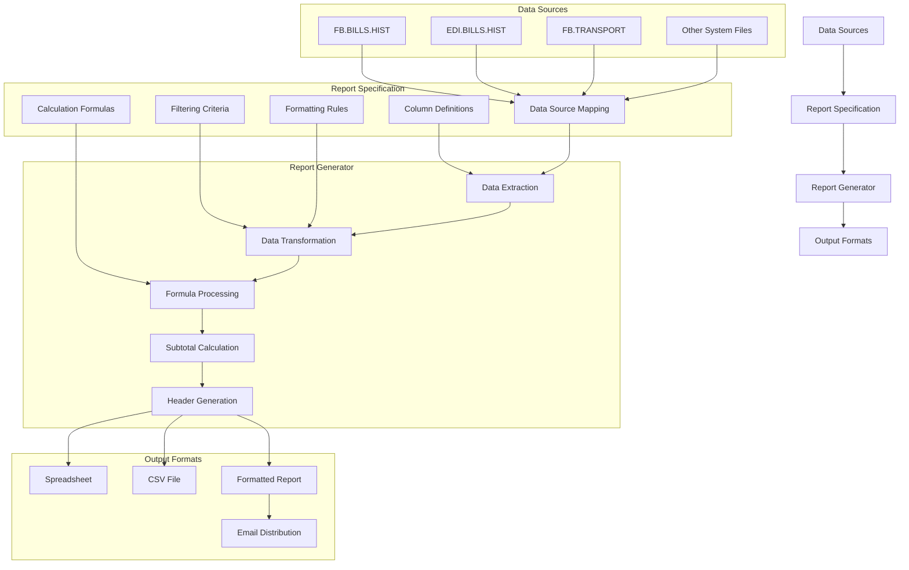
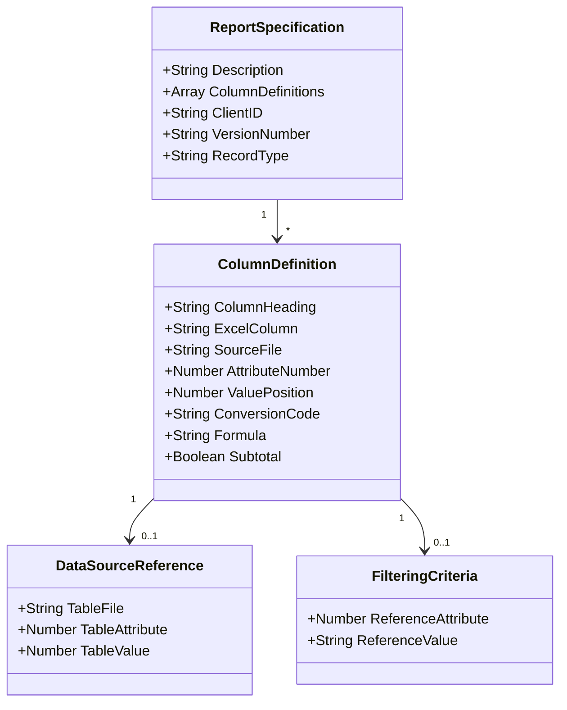
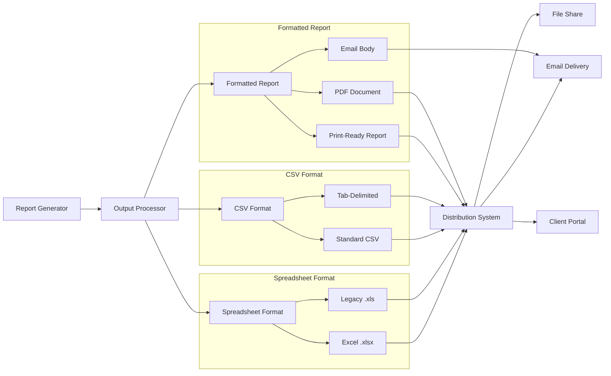

# Custom Report Generation in AFS Shreveport

## Overview of Custom Report Generation

The AFS Shreveport system provides robust custom reporting capabilities that serve as a critical component for freight billing analysis, client communication, and operational decision-making. This functionality allows users to create tailored reports that extract specific data points from the system's extensive freight billing and logistics databases. Custom reports enable stakeholders to analyze shipping patterns, monitor carrier performance, track financial metrics, and identify optimization opportunities. These reports can be configured to meet the unique needs of different clients, departments, and business scenarios, providing the flexibility required in the complex freight logistics industry. The reporting system supports both standard recurring reports and ad-hoc analysis, allowing users to respond quickly to emerging business questions while maintaining consistent reporting for regular operational reviews.

## Report Specification Framework

The AFS Shreveport system employs a sophisticated specification framework to define report formats, column layouts, data sources, and formatting rules for custom reports. At the core of this framework is the FB.BUILD.SPEC file, which stores detailed specification records that serve as templates for report generation. Each specification record is identified by a unique combination of prefix (such as "FMT" for standard reports or "MRS" for misroute email reports), client ID, and version number. The specification record contains comprehensive metadata including a descriptive title and a structured definition of each column in the report. For each column, the system stores information about the column heading, source file, attribute number, value position, conversion rules, lookup references, and subtotal requirements. This structured approach allows for consistent report generation while providing the flexibility to create highly customized outputs tailored to specific business needs.

## Report Generation Architecture

The report generation architecture in AFS Shreveport follows a structured flow from data sources through specification-driven processing to flexible output formats. The process begins with multiple data sources including FB.BILLS.HIST (freight bill history), EDI.BILLS.HIST (electronic data interchange bills), FB.TRANSPORT (transportation data), and other system files that contain relevant freight and logistics information. These sources feed into the report specification framework, which defines column layouts, data mappings, filtering criteria, calculation formulas, and formatting rules.

The report generator engine processes these specifications through several stages: data extraction pulls the required fields from source files; data transformation applies conversions and lookups; formula processing handles calculations between columns; subtotal calculation aggregates data according to specifications; and header generation adds standardized report identification. The system then produces output in various formats including spreadsheets for analysis, CSV files for data integration, formatted reports for presentation, and email distribution for automated delivery to stakeholders. This architecture provides both the structure needed for consistent reporting and the flexibility required for customized business intelligence.

## Data Source Integration

Custom reports in AFS Shreveport can pull data from multiple system files to create comprehensive views of freight billing and logistics operations. The primary data sources include FB.BILLS.HIST (containing detailed freight bill history records), EDI.BILLS.HIST (storing electronic data interchange billing information), and FB.TRANSPORT (housing transportation-related data). The report specification framework allows users to designate specific source files for each column in a report using file identifiers such as "FB" for freight bills, "EDI" for electronic data interchange, and "TR" for transport records. This flexibility enables the creation of reports that combine data across these systems, providing a holistic view of operations. Additionally, the system supports integration with reference files like CLIENTS, CARRIERS, LI.CODES (line item codes), and geographic data files, allowing reports to include descriptive information alongside transactional data. The data source integration capabilities extend to specialized files such as CHG.CODES (charge codes), INTL.CODES (international codes), and division-specific data, enabling reports to address specialized business requirements across different operational areas.

## Column Configuration and Formatting

The AFS Shreveport reporting system provides extensive capabilities for defining column headings, specifying data attributes, setting up data conversions, and creating formula-based columns for calculations. Each column in a report specification includes a heading that appears in the report output, a reference to the source file and attribute number from which to pull data, and optional value positions for multi-valued fields. Users can apply conversion codes to transform raw data into business-friendly formats, such as converting numeric codes to descriptive text or formatting dates and currency values. The system supports lookup functionality through table files (T.FILE), allowing reports to display descriptive information by referencing codes in master tables. For more complex requirements, users can define formula-based columns that perform calculations using values from other columns, identified by Excel-style column references (A, B, C... AA, AB). The column configuration also includes options for subtotaling numeric columns and applying special formatting for summary rows, ensuring that reports present data in a clear, professional manner that meets business needs.

## Report Specification Structure

The report specification structure in AFS Shreveport is organized as a hierarchical record that defines all aspects of a custom report. At the top level, each specification includes a description field that provides context about the report's purpose, along with client identification and version information. The core of the specification consists of an array of column definitions, each representing one column in the final report.

Each column definition contains multiple components: a column heading for display purposes; an Excel column reference (A, B, C, etc.) for positioning; source file information specifying which system file to query; attribute numbers and value positions that pinpoint the exact data field; conversion codes for formatting; and optional formula definitions for calculated fields. Columns can also include data source references that establish relationships with lookup tables, allowing the report to display descriptive information rather than codes.

Additionally, filtering criteria can be applied at the column level through reference attributes and values, enabling targeted data selection. The specification structure also supports subtotal flags to indicate which numeric columns should be aggregated in the report. This comprehensive structure provides the blueprint that guides the report generation process, ensuring consistent and accurate output while maintaining flexibility for diverse reporting needs.

## Data Filtering and Reference Attributes

The AFS Shreveport reporting system implements sophisticated data filtering through reference attributes and values, allowing for targeted reporting based on specific criteria. This filtering mechanism operates at the column level, where each column definition can include reference attribute numbers (R.ATTR) and reference values (R.VAL) that act as selection criteria for the data. When a report is generated, these reference parameters are used to filter records from the source files, including only those that match the specified conditions. The system supports two primary filtering modes: "L" (locate) for including records that match specific values and "E" (exclude) for omitting records that match certain criteria. The reference values can contain multiple values separated by delimiters, enabling complex filtering conditions. This approach allows users to create highly focused reports that address specific business questions without requiring custom programming. For example, reports can be filtered to show only specific carriers, service levels, geographic regions, or date ranges, ensuring that the output contains precisely the information needed for analysis and decision-making.

## Calculation and Formula Support

The AFS Shreveport custom reporting system offers robust formula capabilities that enable complex calculations, subtotals, and data summation within reports. Formulas are defined using Excel-style column references (such as A, B, C... AA, AB) that correspond to the columns in the report. This approach allows users to create calculated fields that perform operations on data from other columns, such as addition, subtraction, multiplication, and division. The formula support extends to more complex operations including conditional logic and multi-step calculations. When a column is defined as a formula column, the system stores the formula expression instead of source file and attribute references, and during report generation, the formula is evaluated using the values from the referenced columns. Additionally, the system supports subtotaling functionality through a dedicated flag in the column definition, allowing numeric columns to be automatically summed at appropriate break points in the report. For more sophisticated aggregation needs, the system includes a summation feature ("S") that can perform calculations across multiple records based on specified grouping criteria. These calculation capabilities transform raw data into meaningful business metrics without requiring custom programming for each new analytical need.

## Report Output Formats

The AFS Shreveport custom report generation system supports a variety of output formats to accommodate different business needs and distribution methods. The primary output formats include spreadsheets, CSV files, and formatted reports, each serving specific purposes in the freight billing and logistics workflow.

Spreadsheet outputs are generated in both modern Excel (.xlsx) and legacy Excel (.xls) formats, providing compatibility across different client environments. These spreadsheet outputs preserve column formatting, calculations, and subtotals defined in the report specifications, making them ideal for further analysis and data manipulation by end users.

CSV (Comma-Separated Values) and tab-delimited formats provide a more universal data exchange format that can be easily imported into various third-party systems and databases. These formats strip away formatting in favor of raw data portability, supporting integration with client systems and other business intelligence tools.

Formatted reports offer a more presentation-ready output with standardized headers, page numbers, and structured layouts. These can be generated as print-ready reports for physical distribution, PDF documents for electronic sharing, or as formatted email bodies for direct communication with clients and internal stakeholders.

The system's output flexibility extends to its distribution capabilities, with reports automatically routed through email delivery systems, saved to network file shares, or published to client portals based on configuration settings. This comprehensive approach to report output formats ensures that the right information reaches the right people in the most useful format for their specific needs.

## Report Headers and Standardization

The AFS Shreveport system implements standardized report headers with company information, report titles, and pagination for professional presentation. The AFS.PAGE.HEAD subroutine serves as the foundation for this standardization, generating consistent header formats across all reports. Each report header typically includes the AFS company name and logo positioned at the top center, with the report ID displayed in the upper left corner for reference purposes. The report title is prominently centered below the company information, clearly identifying the report's purpose. Date and time information is included to provide context about when the report was generated, while page numbers appear in the upper right corner to facilitate navigation in multi-page reports. The header generation process automatically calculates appropriate spacing to ensure proper centering and alignment of these elements based on the specified page width. This standardization extends to formatting codes that control line spacing and page breaks, ensuring consistent presentation regardless of the output device or format. By maintaining this consistency across all reports, the system creates a professional, branded appearance that enhances readability and reinforces corporate identity in client communications.

## User Access and Permission Controls

The AFS Shreveport system manages user access to report creation tools and specifications through a comprehensive permission control framework that ensures appropriate authorization for report generation. Access to report specification tools like ENTRY.BUILD.SPEC is restricted to authorized users, with explicit checks against user IDs to prevent unauthorized modifications to report templates. The system maintains a list of approved users who can create and modify report specifications, typically limiting these privileges to system administrators and designated power users. This controlled access helps maintain the integrity of report definitions while allowing flexibility for authorized personnel to create new reports as business needs evolve. Beyond the creation of report specifications, the system also controls who can execute reports and access the resulting data. These permissions can be configured at multiple levels, including user-specific permissions, role-based access controls, and client-specific restrictions that limit visibility to only relevant data. The permission framework extends to the distribution of reports, ensuring that sensitive financial and operational data is only shared with appropriate stakeholders. This multi-layered approach to user access and permission controls balances the need for flexible reporting capabilities with the requirements for data security and confidentiality in the freight billing environment.

## Export Capabilities and Integration

The AFS Shreveport custom reporting system offers extensive export capabilities that facilitate integration with external systems for further analysis and distribution. Reports can be exported to various formats including Excel spreadsheets, CSV files, and tab-delimited text files, providing flexibility for different integration scenarios. The system supports both manual exports initiated by users and automated exports scheduled as part of regular business processes. These exported reports can be automatically delivered to designated file locations, email recipients, or integrated directly with third-party systems through file transfer protocols. The integration capabilities extend to specialized formats required by specific client systems, with customizable delimiters and data transformations to ensure compatibility. For more sophisticated integration needs, the system can generate reports that conform to industry-standard EDI formats or custom XML structures. The export process includes options for data filtering and transformation, allowing only relevant information to be shared with external systems while maintaining appropriate data formats. Additionally, the system supports metadata inclusion with exports, providing context about the report's contents, generation time, and source systems. These comprehensive export and integration capabilities ensure that the valuable insights generated through custom reports can be effectively distributed and utilized throughout the organization and with external partners.

[Generated by the Sage AI expert workbench: 2025-05-28 08:06:19  https://sage-tech.ai/workbench]: #