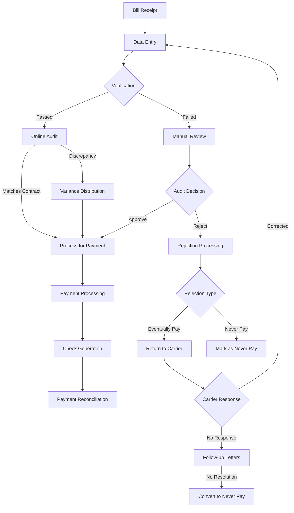
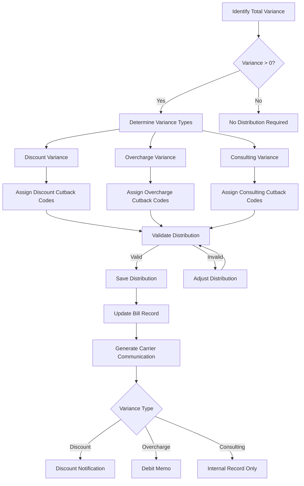
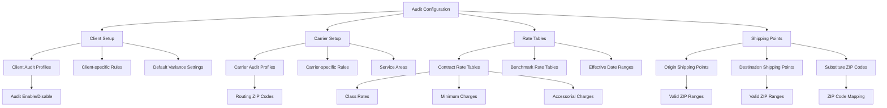
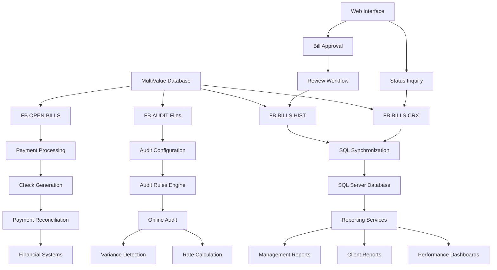

# Freight Bill Auditing in AFS Shreveport

## Overview of Freight Bill Auditing

Freight bill auditing is a critical process within the AFS Shreveport system that validates carrier charges, identifies discrepancies, and ensures accurate billing. The process serves as a financial control mechanism that examines freight bills to verify that carriers are charging according to negotiated contracts and that clients are paying the correct amounts. The system compares actual carrier charges against contract rates and benchmark rates to identify overcharges, apply appropriate discounts, and calculate potential savings. This comprehensive validation process includes checking origin/destination information, weight classifications, accessorial charges, and fuel surcharges to ensure all billing components are accurate and compliant with established agreements.

The AFS Shreveport system implements a sophisticated auditing workflow that begins when bills are received (either electronically or via paper documents), continues through data entry and verification stages, and concludes with either payment processing or rejection handling. Throughout this process, the system maintains detailed audit trails, tracks variances between expected and actual charges, and applies client-specific business rules to ensure consistent and accurate freight bill processing.

## Audit Workflow and Status Management

The AFS Shreveport system manages freight bills through a well-defined workflow with various status codes that track each bill's progression through the auditing process. Bills typically move through several key stages:

1. **Entry Stage**: Bills are initially entered into the system with status 'E' (entered). During this stage, basic information is captured, including client/carrier details, PRO numbers, dates, and charges.

2. **Verification Stage**: Bills move to status 'V' (verified) after key information has been validated by a second person, ensuring data accuracy and completeness.

3. **Processing Stage**: Verified bills are processed with status 'P' (processed), indicating they have been audited, approved for payment, and included in accounting systems.

4. **Rejection Stage**: Bills may be rejected with status 'R' if discrepancies are found. Rejected bills are further categorized as either "Eventually Pay" or "Never Pay" based on the severity of the issues identified.

The system also supports specialized status codes for bills requiring additional review ('A' for audit review), bills on hold, and bills awaiting client approval through web review services. Each status change is tracked with timestamps and user information, creating a comprehensive audit trail of the bill's lifecycle.

For bills requiring client approval, the system implements a web review workflow where bills are pushed to a review service with status code 970, then tracked through approval or rejection. This process is particularly important for clients like Wabtec who require additional verification steps before payment authorization.

## Freight Bill Audit Lifecycle

The diagram illustrates the complete lifecycle of a freight bill through the AFS Shreveport system, from initial receipt through payment or rejection. The process includes multiple decision points where bills may be routed for different handling based on verification results, audit findings, and carrier responses. The system maintains detailed tracking at each stage, ensuring visibility into the bill's current status and processing history.

## Rate Calculation and Comparison

The AFS Shreveport system employs sophisticated rate calculation mechanisms to determine the appropriate charges for freight shipments and identify potential overcharges. This process is central to the auditing function and involves several key components:

1. **Contract Rate Calculation**: The system calculates the expected charges based on negotiated carrier contracts. This involves retrieving the appropriate rate tables from FB.AUDIT.TABLES based on client-carrier combinations, effective dates, and shipping points. The calculation considers factors such as:
   - Origin and destination ZIP codes
   - Freight class and weight
   - Minimum charges and discounts
   - Fuel surcharges based on current rates
   - Accessorial charges for additional services

2. **Benchmark Rate Calculation**: In addition to contract rates, the system calculates benchmark rates that represent market standards or preferred carrier rates. These benchmark rates provide a comparison point to evaluate the competitiveness of contract rates and identify potential savings opportunities.

3. **Carrier Charge Validation**: The system compares the actual carrier charges against the calculated contract rates to identify discrepancies. This comparison considers various components including base freight charges, fuel surcharges, and accessorial fees.

4. **Misroute Detection**: The system identifies shipments that were not sent through approved carriers by comparing the actual carrier used against the client's routing guide. When misroutes are detected, the system calculates the excess cost by comparing the actual charge against what would have been charged by the approved carrier.

The rate calculation process is highly configurable through client-specific audit profiles that define which rate tables to use, what validation rules to apply, and how to handle special cases. The FB.2.1.AUDIT.OWEN.V2 subroutine implements much of this logic, interfacing with rating engines like RateWare and TEMPO to obtain accurate freight rates based on complex tariff rules.

## Variance Analysis and Distribution

When discrepancies are identified between expected and actual charges, the AFS Shreveport system performs detailed variance analysis and distribution. This process categorizes variances into specific types and assigns appropriate cutback codes to explain the reasons for the differences.

Variance analysis begins by calculating the total difference between the carrier's charge and the expected contract amount. This variance is then distributed across three primary categories:

1. **Discount Variance**: Represents differences due to incorrectly applied discount rates or discount-eligible charges that weren't properly discounted.

2. **Overcharge Variance**: Identifies charges that exceed contracted rates due to incorrect base rates, improper classification, or other rating errors.

3. **Consulting Variance**: Captures additional savings identified through logistics consulting services, often representing the difference between benchmark rates and contract rates.

Each variance category is associated with specific cutback codes that provide detailed explanations for the discrepancies. These codes are stored in the FB.CUT.BACKS file and can be client-specific, carrier-specific, or general. The system allows auditors to select appropriate cutback codes during the variance distribution process, ensuring that carriers and clients receive clear explanations for any adjustments.

The FB.2.1.VARIANCE and FB.2.1.VAR.DIST subroutines manage this process, providing interfaces for auditors to distribute variances and assign cutback codes. The system enforces validation rules to ensure that the sum of distributed variances equals the total variance amount and that appropriate cutback codes are selected for each variance type.

For bills with significant variances, the system may generate debit memos or rejection letters to carriers, explaining the discrepancies and requesting corrections. The system tracks these communications and maintains a history of variance distributions for reporting and analysis purposes.

## Variance Distribution Process

The diagram illustrates how variances are identified, categorized, and distributed within the AFS Shreveport system. When a variance is detected between carrier charges and contract rates, the system guides auditors through the process of distributing this variance across appropriate categories and assigning relevant cutback codes. The distribution must balance to the total variance amount before it can be saved. Once validated, the distribution information is stored with the bill record and may trigger carrier communications such as debit memos for overcharges or discount notifications.

## Misroute Detection and Management

The AFS Shreveport system implements sophisticated misroute detection capabilities to identify shipments that were not sent through approved carriers or routes. This functionality helps clients control freight costs by ensuring compliance with their routing guides and carrier selection policies.

Misroute detection begins during the audit process when the system evaluates shipment details against client-specific routing rules stored in FB.AUDIT files. The MISROUTE subroutine performs this analysis by:

1. **Routing Guide Validation**: Checking if the carrier used for the shipment is an approved carrier for the client's specific origin-destination pair.

2. **Shipping Point Verification**: Validating that both origin and destination locations are valid shipping points for the carrier based on the client's configuration.

3. **Effective Date Checking**: Ensuring that the shipment date falls within the effective date range of the client-carrier routing agreement.

4. **Zone and Mode Validation**: Verifying that the carrier is authorized to handle the specific shipping zones and transportation modes involved in the shipment.

When a misroute is detected, the system calculates the excess cost by comparing the actual charge against what would have been charged by the approved carrier. This information is stored with the freight bill record and can trigger several actions:

1. **Misroute Notification**: The system generates notifications to inform clients about misrouted shipments, including details about the excess charges incurred.

2. **Progressive Communication**: For recurring misroutes, the system implements a progressive notification system that escalates from initial letters to debit memos after multiple warnings.

3. **Least Cost Carrier (LCC) Analysis**: For some clients, the system performs least cost carrier analysis to identify the most cost-effective carrier options and quantify the savings opportunity missed due to misrouting.

The FB.SEND.MISROUTE.EMAILS and FB.SEND.TEM.EMAILS subroutines handle the communication aspects of misroute management, generating detailed HTML emails with tables showing shipment details, excess charges, approved carriers, and service day comparisons. The VIEW.MISROUTES subroutine provides an interface for managing misrouted shipments, allowing users to view details, confirm receipt of misroute letters, reprint letters, and (for authorized users) delete misroute records.

## Rejection Processing and Communication

When freight bills fail the auditing process due to significant discrepancies or errors, they enter the rejection processing workflow. The AFS Shreveport system provides comprehensive tools for managing rejected bills, communicating with carriers, and tracking resolution progress.

Rejection processing begins when an auditor determines that a bill cannot be processed as submitted. The FB.2.1.REJECT subroutine allows users to:

1. **Categorize Rejections**: Bills are classified as either "Eventually Pay" (can be paid after corrections) or "Never Pay" (fundamentally flawed and will not be paid).

2. **Assign Rejection Codes**: Specific rejection codes from the FB.TABLES file (REJECT.CODES) are assigned to explain the reasons for rejection. These codes are organized into groups based on the REJECT.CODE.GROUPS configuration.

3. **Add Custom Messages**: Auditors can include additional free-form text to provide detailed explanations beyond the standard rejection codes.

4. **Generate Rejection Letters**: The system creates formatted rejection letters to carriers explaining the issues and requesting corrections if applicable.

The rejection workflow includes several key components:

1. **Status Tracking**: Rejected bills are marked with status 'R' and tracked separately in reports like FB.8.1 (Outstanding Returned Bills Report) which shows details including client/carrier information, rejection dates, and rejection reasons.

2. **Follow-up Management**: For "Eventually Pay" bills, the system tracks the age of rejections and can automatically escalate bills with no activity after a specified period (typically one year) to "Never Pay" status through the FB.8.2 program.

3. **Carrier Communication**: Rejection letters are generated with appropriate formatting and content based on the rejection type and reasons. These communications maintain a professional tone while clearly explaining the issues that need to be addressed.

4. **Resolution Tracking**: When carriers respond to rejections with corrected information, the system allows for the creation of new bill versions that can proceed through the normal audit workflow.

The FB.8.1 and FB.8.2 programs provide reporting and management tools for rejected bills, allowing users to monitor outstanding rejections, track resolution progress, and ensure that appropriate follow-up actions are taken. The FB.2.11 program allows authorized users to change the payment status of rejected bills between "Never Pay" and "Eventually Pay" based on new information or resolution progress.

## Audit Configuration Components

The diagram illustrates the relationship between various components in the audit configuration of the AFS Shreveport system. The configuration begins with client and carrier setup, which define the basic parameters for audit processing. Rate tables contain the detailed pricing information used for contract and benchmark rate calculations, while shipping points define the valid service areas for carriers. These components work together to create a comprehensive audit framework that can be customized for each client-carrier relationship.

The FB.AUDIT.1, FB.LTL.SETUP.1, FB.LTL.SETUP.2, and FB.TL.SETUP programs provide interfaces for managing these configuration components, allowing administrators to set up and maintain the audit rules that drive the freight bill auditing process.

## Audit Trail and Access Tracking

The AFS Shreveport system maintains comprehensive audit trails of all interactions with freight bills, ensuring accountability and providing visibility into the bill lifecycle. This tracking functionality is critical for compliance, security, and operational efficiency.

The audit trail system captures detailed information about who accessed bills and what changes were made, including:

1. **Access Tracking**: The UPD.FB.BILLS.ACCESS subroutine records each instance of bill access, including the user ID, department, date, time, and reason for access. This information is stored in the FB.BILLS.ACCESS file and can be viewed through the FB.BILLS.ACCESSED subroutine.

2. **Change Tracking**: When bills are modified, the system captures both the original and updated values, creating a history of changes that can be reviewed to understand how a bill evolved through the processing workflow.

3. **Status Changes**: All status transitions (entered, verified, processed, rejected) are logged with timestamps and user information, providing a clear timeline of the bill's progression through the system.

4. **Rejection History**: For rejected bills, the system maintains detailed records of rejection reasons, communication with carriers, and resolution attempts.

5. **Payment Processing**: The system tracks payment details including check generation, clearing status, and reconciliation information.

The FB.BILL.INQUIRY program allows authorized users to view the access history of specific bills, showing who viewed or modified them and when. This capability is particularly valuable for investigating discrepancies or responding to inquiries about bill status.

The system also implements security controls to ensure that users can only access bills appropriate for their role:

1. **Role-based Access**: Different user types (auditors, processors, managers) have different levels of access to bill information and functions.

2. **Client-specific Security**: For client users accessing the system, visibility is restricted to only their own bills.

3. **Excessive Access Alerts**: The system can generate email notifications when a bill is accessed more than a specified number of times (typically five), potentially indicating unusual interest that warrants investigation.

This comprehensive audit trail and access tracking system ensures that all bill interactions are properly documented, supporting both operational needs and compliance requirements.

## Performance Metrics and Reporting

The AFS Shreveport system includes robust capabilities for analyzing auditor performance, processing timelines, and revenue metrics. These tools help management evaluate the effectiveness of the auditing process, identify opportunities for improvement, and track financial outcomes.

Key performance metrics and reporting capabilities include:

1. **Auditor Performance Analysis**: The FB.3.20.10 program generates detailed reports on bills processed by auditors, categorizing them by stack (processing category), substack (auditor involvement level), transportation mode, and auditor name. It calculates key metrics including:
   - Number of bills processed
   - Total paid amounts
   - Overcharge amounts identified
   - Logistics charges applied
   - Discount amounts
   - Various commission types

2. **Timeline Statistics**: The FB.UPD.TIMELINE.SUMMARY subroutine maintains statistical records tracking the lifecycle of freight bills through the system, measuring:
   - Days from mail room receipt to data entry
   - Days from data entry to processing
   - Overall processing efficiency

3. **Revenue Analysis**: The FB.3.20.5 program analyzes revenue percentages by auditor and breaks down bills by type (EDI, Online Audit, Regular), calculating:
   - Each auditor's contribution to total revenue
   - Bill percentages by type
   - Overcharge percentages
   - Logistics percentages

4. **Audit Status Analysis**: The FB.3.20.9 program analyzes audit status data for non-core carriers, categorizing bills by audit status codes (OLA OK, audit check class, charges didn't match, no OLA, no code) and calculating:
   - Revenue percentages
   - Bill counts
   - Overcharge amounts
   - Logistics markup
   - Balance due information

5. **Pre-Audit Approval Reporting**: The PRE.LTL.RPT program identifies LTL freight bills requiring manual review before processing, tracking:
   - Error conditions (missing zip codes, charge mismatches, invalid carriers)
   - Automatic versus manual processing statistics
   - Error rates by client and carrier

These reporting tools provide management with visibility into the efficiency and effectiveness of the auditing process, helping to identify trends, track performance over time, and make data-driven decisions about process improvements.

## Audit Data Integration Architecture

The diagram illustrates how freight bill audit data flows between the MultiValue database, SQL systems, and external interfaces in the AFS Shreveport system. The core data resides in MultiValue database files like FB.BILLS.HIST and FB.BILLS.CRX, which store detailed bill information and cross-references. This data is synchronized to SQL Server databases through programs like UPD.SQL.FBHIST.PX, enabling advanced reporting and analysis through SQL-based tools.

The audit configuration components in FB.AUDIT files drive the audit rules engine, which performs online auditing during bill entry and verification. Payment processing flows from FB.OPEN.BILLS to check generation and reconciliation systems. Web interfaces provide status inquiry capabilities through programs like INET.FB.STATUS and support bill approval workflows for client review.

This integrated architecture ensures that audit data is available across multiple systems for reporting, analysis, and operational processing, while maintaining data integrity and consistency throughout the freight bill lifecycle.

[Generated by the Sage AI expert workbench: 2025-05-28 08:06:13  https://sage-tech.ai/workbench]: #