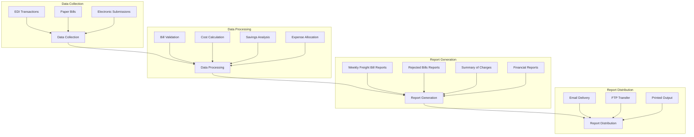
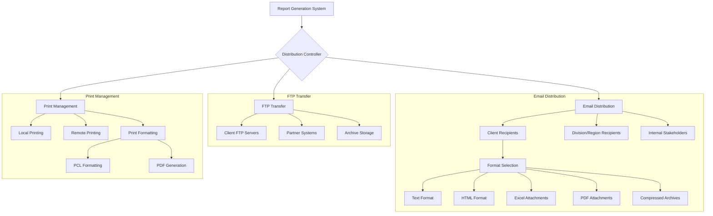
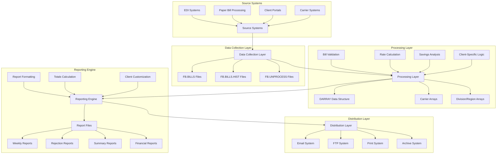

# Freight Bill Reporting

## Overview of Freight Bill Reporting

Freight bill reporting is a critical component of the AFS Shreveport system, serving as the primary mechanism for communicating billing information, cost analysis, and savings metrics to clients. This functionality bridges the operational aspects of freight management with the financial reporting needs of clients and internal stakeholders. The reporting system processes raw freight billing data from multiple sources (including EDI transactions, paper bills, and electronic submissions) and transforms it into structured, actionable information.

Key stakeholders include client financial departments who use these reports for accounting and budgeting purposes, logistics managers who analyze shipping patterns and costs, and AFS account managers who leverage the reports to demonstrate value and identify optimization opportunities. The business value is substantial: these reports provide transparency into freight spending, validate AFS's cost-saving services, enable accurate cost allocation across client divisions and expense codes, and serve as audit trails for freight payment activities.

The reporting system is designed to handle complex client requirements including divisional reporting, expense code tracking, regional analysis, and custom formatting needs. It supports both standard reporting cycles (typically weekly) and ad-hoc reporting requests, delivering outputs through multiple channels including email, FTP, and printed formats.

## Freight Bill Reporting Workflow

The freight bill reporting workflow is a comprehensive end-to-end process that begins with data collection from multiple sources and culminates in the distribution of formatted reports to clients and internal stakeholders. The system first collects freight billing data from EDI transactions, paper bills, and electronic submissions, consolidating them into a unified dataset. This data then undergoes processing that includes validation against business rules, cost calculation using contracted rates and benchmarks, savings analysis comparing actual costs to benchmarks, and expense allocation across client-defined categories.

The report generation phase transforms this processed data into various report types including Weekly Freight Bill Reports showing all processed bills, Rejected Bills Reports documenting exceptions, Summary of Charges reports for financial reconciliation, and specialized financial reports for accounting purposes. Finally, the distribution phase delivers these reports through email (with attachments in multiple formats), FTP transfers for automated system integration, and printed output for clients requiring physical documentation.

## Report Types and Formats

The AFS Shreveport system offers a comprehensive suite of report types to address different client needs and use cases:

1. **Weekly Freight Bill Reports**: These are the core reports showing all processed bills within a specified date range. They include detailed information on each shipment including carrier, PRO number, bill of lading, origin/destination, weight, and charges. The reports are available in Excel format for client analysis and HTML format for quick viewing. For clients with high volumes, a specialized "True Cost Report" variant focuses on the most critical cost metrics.

2. **Rejected Bills Reports**: These reports document bills that couldn't be processed due to various exceptions. They're categorized into several subtypes:
   - New Rejected Bills showing recent rejections
   - Old Rejected Bills tracking long-standing issues
   - Never Pay Bills identifying bills flagged for non-payment
   - Approved Rejected Bills showing exceptions that were manually approved

3. **Summary of Charges**: This financial summary report provides an aggregated view of all freight charges, logistics fees, and savings. It includes carrier breakdowns, total bill counts, and financial reconciliation information. The report is available in both text and HTML formats, with the latter providing enhanced formatting and navigation.

4. **Expense Distribution Reports**: These reports break down freight costs by client-defined expense codes, enabling accurate cost allocation and accounting. They're particularly valuable for clients who need to distribute shipping costs across different departments or cost centers.

5. **Divisional Reports**: For clients with multiple divisions or locations, these reports segment all freight activity by division, allowing for location-specific analysis and cost tracking.

6. **Mode Distribution Reports**: These specialized reports analyze shipping patterns by transportation mode (LTL, Truckload, Air, etc.), helping clients optimize their mode selection strategies.

7. **Financial Reports**: Including invoices and financial summaries, these reports support the accounting and payment processes with detailed breakdowns of logistics fees, carrier charges, and payment terms.

The system supports multiple output formats including Excel spreadsheets for data analysis, HTML for web viewing, plain text for system integration, and formatted PCL/PDF for professional printing. Each report type can be customized to match client-specific requirements for content, layout, and delivery method.

## Client-Specific Customization

The AFS Shreveport system implements a sophisticated framework for client-specific reporting customization, allowing the freight bill reporting functionality to adapt to diverse client requirements without requiring code changes. This customization capability is managed through several key mechanisms:

At the most fundamental level, client preferences are stored in the CLIENT.REC record, which contains flags for divisional reporting, expense code tracking, and email distribution preferences. The system uses these settings to determine which reports to generate and how to distribute them. For clients with divisional structures, the system supports the DIV.EMAIL.PRINT flag with four options (N, E, B, P) controlling whether divisional reports are printed, emailed, or both.

Expense code tracking is particularly important for clients who need to allocate shipping costs to different departments or projects. The system maintains client-specific expense code tables and maps each freight bill to the appropriate codes. Reports can then be generated showing costs by expense category, enabling accurate cost allocation and budgeting. Some clients require specialized expense code formats or need to track unique expense attributes, which the system accommodates through custom field mappings.

For divisional reporting, the system can generate separate reports for each division or consolidate them into a master report with divisional breakdowns. This flexibility is crucial for clients with complex organizational structures. The system also supports regional reporting for clients who organize their operations geographically rather than by division.

The reporting system accommodates client-specific formatting requirements including custom headers, logos, and layout preferences. Some clients require specialized data fields or calculations unique to their business processes. For example, client 05813 (ArcelorMittal) has a specialized condensed report format, while client 01706 (Rexel) requires a specific version (460) of reports for certain divisions.

The system also handles specialized reporting needs for specific industries or business models. For instance, it can generate BOL Spreadsheet Reports for restaurant clients, Carrier Reports for manufacturing clients, and Source Files for clients with complex ERP integration requirements. These specialized reports are triggered by client ID checks in the code and follow client-specific formatting and content rules.

## Report Distribution Architecture

The report distribution architecture in AFS Shreveport is designed to deliver freight bill reports through multiple channels based on client preferences and technical requirements. At its core is a Distribution Controller that determines the appropriate delivery method for each report based on client settings, report type, and recipient information.

The Email Distribution component handles the most common delivery method, sending reports to three categories of recipients: client contacts (typically accounting and logistics personnel), division or region-specific contacts (for organizations with distributed management), and internal AFS stakeholders (account managers and support staff). The system supports sophisticated format selection, allowing different recipients to receive the same report in their preferred format - plain text for simple viewing, HTML for enhanced formatting, Excel for data analysis, PDF for formal documentation, or compressed archives for large report sets.

For clients requiring system integration, the FTP Transfer component securely delivers reports to client FTP servers, partner systems (like ERP platforms), or long-term archive storage. This automated delivery enables straight-through processing without manual intervention.

The Print Management component handles physical report production, supporting both local printing at AFS facilities and remote printing at client locations. The system includes specialized formatting capabilities for printer control languages (PCL) and PDF generation to ensure consistent, professional output regardless of the printing environment.

The architecture includes error handling and notification systems that alert administrators to delivery failures, track successful distributions, and maintain delivery logs for audit purposes. For clients with complex security requirements, the system supports encrypted delivery methods and secure authentication for both email and FTP channels.

## Financial Reporting Components

The financial elements tracked in AFS Shreveport's freight bill reports form a comprehensive framework for analyzing transportation costs, logistics services, and realized savings. These components provide clients with a detailed understanding of their freight spending and the value delivered by AFS services.

At the foundation are carrier charges, which represent the actual amounts billed by transportation providers. These charges are broken down into several categories:

1. **Base Freight Charges**: The core transportation cost based on distance, weight, and service level
2. **Accessorial Charges**: Additional fees for special services like liftgate, residential delivery, or inside delivery
3. **Fuel Surcharges**: Variable fees that fluctuate with fuel prices
4. **Taxes and Duties**: Governmental fees, particularly important for cross-border shipments

The system tracks these charges at multiple levels - by individual bill, by carrier, by division/region, and by expense code - enabling multi-dimensional analysis.

Logistics fees represent AFS's service charges and are calculated through various models depending on client agreements:

1. **Percentage-Based Fees**: Calculated as a percentage of freight charges or savings
2. **Per-Bill Fees**: Fixed amounts charged for each processed bill
3. **Flat Weekly Fees**: Regular service charges independent of volume
4. **Special Service Fees**: Charges for additional services like analytics, consulting, or programming

The system includes specialized handling for unique fee structures, such as UPS Tracking Number Fees for certain clients or Analytics Fees for clients using advanced reporting services.

Savings calculations are a critical component that demonstrates AFS's value proposition:

1. **Discount Savings**: Reductions achieved through negotiated carrier discounts
2. **Overcharge Savings**: Recoveries from carrier billing errors identified during auditing
3. **Consulting Savings**: Cost reductions from optimization recommendations
4. **Lost Savings**: Potential savings missed due to routing decisions or other factors

For clients like Airgas, the system also tracks functional rebates that provide additional financial benefits based on volume commitments.

The financial reporting components include sophisticated validation mechanisms that cross-check totals between different calculation methods, ensuring accuracy and consistency across all reports. When discrepancies are detected, the system generates alerts for manual review. The system also maintains year-to-date totals for all financial metrics, enabling trend analysis and performance tracking over time.

## Regional and Divisional Reporting

AFS Shreveport's reporting system provides sophisticated capabilities for handling organizational hierarchies through its regional and divisional reporting features. This functionality is crucial for clients with complex organizational structures who need to allocate shipping costs across different business units, locations, or cost centers.

For clients with divisional structures, the system maintains a DIVISION.CODES file that defines each division's attributes including name, address, contact information, and email recipients for reports. When processing freight bills, the system assigns each shipment to the appropriate division based on client-defined rules, which may consider ship-to locations, account codes, or other shipment attributes. The reporting system can then generate division-specific reports showing only the relevant shipments for each division, or consolidated reports with divisional breakdowns.

Regional reporting follows a similar structure but is typically used for geographic organization rather than business unit segmentation. The system maintains REGION.CODES files that define regional boundaries and attributes. This is particularly valuable for clients with operations spread across multiple geographic areas who need to analyze shipping patterns and costs by region.

The system supports complex hierarchical relationships between regions and divisions. For example, client 01977 (Wabtec) uses a regional structure with divisions nested within regions, requiring specialized handling in the reporting logic. The FB.REG.DIV.XREF file maintains these cross-reference relationships to ensure accurate reporting at both levels.

Expense code tracking adds another dimension to organizational reporting. The system can categorize shipments by expense codes (like departments, projects, or product lines) and generate reports showing costs by expense category within each division or region. This multi-dimensional reporting enables sophisticated cost allocation and analysis.

The reporting system handles several challenging scenarios in regional and divisional reporting:

1. **Fee Allocation**: Weekly processing fees and postage charges can be allocated across divisions/regions based on shipment volume or other metrics
2. **Minimum Charges**: For clients with minimum fee guarantees, the system ensures these are correctly applied at the appropriate organizational level
3. **Address Management**: Division-specific addresses are maintained and used in report headers and email distribution
4. **Email Distribution**: Reports can be automatically distributed to division-specific contacts based on the DIV.EMAIL.PRINT setting

For clients with specialized requirements, the system includes custom handling. For example, client 05234 implements a "Pay by Division" model requiring special invoice generation, while client 01485 (Feintool CIN) has a custom regional setup with specific reporting requirements.

## Data Flow in Freight Bill Reporting

The data flow in AFS Shreveport's freight bill reporting system follows a comprehensive path from source systems through processing to final report distribution. The journey begins with diverse source systems including EDI platforms that handle electronic transactions, paper bill processing systems for physical documents, client portals for direct submissions, and carrier systems providing shipment data.

The Data Collection Layer consolidates this information into structured database files including FB.BILLS for current transactions, FB.BILLS.HIST for historical records, and FB.UNPROCESS files that track processing dates and status. This layer ensures all freight billing data is normalized into a consistent format regardless of source.

In the Processing Layer, the system applies multiple transformations to prepare the data for reporting. Bill validation ensures data integrity and completeness, rate calculation applies contracted rates and identifies variances, savings analysis compares actual costs to benchmarks, and client-specific logic handles unique business rules. The processed data is organized into specialized data structures including the DARRAY multi-dimensional array that tracks bills across carriers, divisions, and expense codes, as well as carrier arrays and division/region arrays for aggregated analysis.

The Reporting Engine transforms this processed data into formatted reports. Report formatting applies layout templates and styling, totals calculation aggregates metrics at multiple levels, and client customization applies client-specific presentation rules. The engine generates multiple report files including Weekly Reports showing all processed bills, Rejection Reports documenting exceptions, Summary Reports providing financial overviews, and specialized Financial Reports for accounting purposes.

Finally, the Distribution Layer delivers these reports through multiple channels. The Email System handles electronic delivery with attachments in various formats, the FTP System enables automated transfers to client systems, the Print System manages physical output production, and the Archive System maintains historical reports for compliance and reference.

Throughout this flow, the system maintains data integrity through validation checks and cross-references, ensuring that totals match across different calculation methods and report formats. The architecture supports both batch processing for regular reporting cycles and on-demand processing for ad-hoc requests, with comprehensive logging at each stage to support troubleshooting and audit requirements.

## Report Scheduling and Automation

The AFS Shreveport system implements a sophisticated approach to report scheduling and automation that balances regular reporting cycles with on-demand flexibility. The system operates in two primary modes: automatic (FROM.PROCESS) and manual, each serving different business needs.

In automatic mode, the reporting system is invoked directly from the bill processing program (FB.2.3.NW) with the command line parameter "STD-FROM.PROCESS". This integration ensures that reports are generated immediately after bills are processed, providing timely information to clients. The automatic mode uses predefined parameters stored in client configuration records, eliminating the need for manual input. This mode typically runs as part of overnight batch processing, handling the regular weekly reporting cycle for most clients.

The system supports several scheduling patterns:

1. **Weekly Processing**: The standard cycle for most clients, with reports covering the previous week's activity
2. **Daily Processing**: For high-volume clients requiring more frequent updates
3. **Monthly Processing**: For clients with lower volumes or specialized accounting needs
4. **Custom Cycles**: For clients with unique business calendars or reporting requirements

For batch processing, the system implements sophisticated queuing mechanisms to manage resource utilization. The AUTOLOGOUT command prevents session timeouts during extended processing runs, while performance optimizations like pre-selection lists improve efficiency when handling large data volumes. The batch system includes comprehensive error handling and notification capabilities, with alerts sent to system administrators when processing issues occur.

In manual mode, accessed through menu option 1-3-1, users can generate reports on demand with custom parameters. This flexibility is valuable for ad-hoc reporting needs, historical analysis, or troubleshooting. The manual mode presents an interactive interface where users can specify client, date range, report type, and output options.

The system includes several automation features that enhance efficiency:

1. **Email Automation**: Reports are automatically emailed to configured recipients based on client settings
2. **FTP Transfers**: For clients like Robroy (01349/01350), reports are automatically transferred to FTP servers
3. **Regional/Divisional Distribution**: Reports are automatically segmented and distributed to the appropriate regional or divisional contacts
4. **Format Conversion**: Reports are automatically generated in multiple formats (text, HTML, Excel) to suit different recipient needs

The automation system includes comprehensive logging capabilities that track processing steps, timing, and outcomes. The AFS.PROCESS.LOGFILE maintains detailed records of each reporting run, supporting performance monitoring and troubleshooting. For critical processes, the system integrates with the PROCESS.NOTIFY framework to provide status updates to operational teams.

The scheduling system also handles special cases like first-time processing for new clients, which triggers additional documentation like W9 forms and contact information to be included with the initial reports.

## Integration with Other Systems

The freight bill reporting functionality in AFS Shreveport is designed as a highly integrated component that connects with numerous other systems both within the application and with external platforms. This integration enables seamless data flow, consistent processing, and comprehensive reporting across the entire freight management lifecycle.

Within the AFS Shreveport system, the reporting module integrates closely with several core components:

1. **EDI Processing**: The reporting system receives processed EDI transactions and includes specialized handling for EDI bills, distinguishing them from paper bills in reports and analytics. For clients with high EDI volumes, the system generates EDI-specific reports and statistics.

2. **Accounting Systems**: Tight integration with AR-BRIDGE ensures financial consistency between freight reports and accounting records. The system validates that report totals match accounting entries and flags discrepancies for investigation. Integration with AR.CUST and AR.TRANS enables the reporting of unapplied credits and payment status.

3. **Client Configuration**: The reporting system pulls client-specific settings from the CLIENTS file, including reporting preferences, divisional structures, and contact information. This ensures reports are formatted and distributed according to client requirements.

4. **Carrier Management**: Integration with the CARRIERS file provides carrier names, service types, and other details used in reports. This connection ensures consistent carrier identification across all reporting outputs.

5. **Check Processing**: Connection to FB.CHECKS.HDR and FB.CHECKS.DTL enables reporting on payment status and check details, providing financial reconciliation information in summary reports.

External system integration is equally important, with the reporting module connecting to:

1. **Client Notification Systems**: The reporting system integrates with email platforms to deliver reports directly to client inboxes. It supports both plain text and HTML email formats with multiple attachment types.

2. **FTP Systems**: For clients requiring automated data transfers, the reporting module can deliver reports directly to client FTP servers. This integration supports clients like Robroy (01349/01350) who incorporate AFS data into their internal systems.

3. **PDF Generation**: Integration with PDF generation tools enables the creation of professional-quality documents for formal reporting and archiving.

4. **Analytics Platforms**: For clients using advanced analytics, the reporting system can generate data extracts in formats compatible with tools like QlikView, supporting deeper analysis and visualization.

The system implements several integration techniques to ensure reliable data exchange:

1. **File-Based Integration**: Using standardized file formats for data exchange with systems that don't support direct API integration
2. **Email Attachments**: Delivering reports as structured attachments that can be automatically processed by recipient systems
3. **Database Synchronization**: Ensuring consistency across different database components through validation checks and reconciliation processes

The integration architecture includes error handling mechanisms that detect and report integration failures, with alerts sent to system administrators when issues occur. The system also maintains comprehensive logs of integration activities, supporting troubleshooting and audit requirements.

## Performance and Optimization

The freight bill reporting system in AFS Shreveport incorporates numerous performance optimizations to handle large data volumes efficiently while maintaining responsiveness and reliability. These optimizations address the challenges of processing thousands of freight bills across multiple dimensions (carriers, divisions, expense codes) while generating complex reports in various formats.

Data volume management is a primary consideration, as the system must process historical freight bills spanning extensive date ranges. Several strategies are employed:

1. **Selective Data Loading**: Rather than loading all historical data, the system uses targeted SELECT statements with date range filters to retrieve only relevant records. For example, the code uses statements like `SELECT FB.BILLS.HIST WITH 37 GE "date" AND WITH 37 LE "date"` to limit data retrieval.

2. **Pre-selection Lists**: When processing large datasets, the system uses pre-selection lists to improve performance. The `SAVE-LIST` and `GET-LIST` commands with channel numbers create efficient processing queues without requiring multiple database scans.

3. **Temporary Work Files**: The system creates channel-specific work files (e.g., `FBWORK:CH.NUM`) to process data without modifying source records. This approach improves concurrency by avoiding locks on production data while processing reports.

4. **Array-Based Processing**: Rather than repeatedly querying the database, the system loads data into multi-dimensional arrays like DARRAY, CARRIER.ARRAY, and REG.DARRAY. These in-memory structures enable efficient aggregation and analysis without additional database access.

Report generation optimization includes:

1. **Incremental Report Building**: Reports are built incrementally, with content accumulated in variables like WEEKLY.REPORT, SOC.TXT, and INVOICE.HTML before final output. This approach minimizes I/O operations during report generation.

2. **Format Separation**: The system separates content generation from formatting, allowing efficient reuse of the same data for multiple output formats (text, HTML, Excel).

3. **Conditional Report Generation**: Reports are only generated when relevant data exists, avoiding empty report processing. For example, rejection reports are only created when rejected bills are present.

Memory management techniques include:

1. **Variable Clearing**: Large variables are explicitly cleared after use to free memory, particularly important when processing multiple clients or divisions sequentially.

2. **Selective Array Population**: Arrays are populated only with necessary data elements rather than entire records, reducing memory consumption.

3. **Batch Size Control**: For clients with extremely large volumes, the system can process data in batches to maintain manageable memory usage.

The system includes performance monitoring capabilities through the AFS.PROCESS.LOGFILE, which tracks processing times and resource usage. This data supports ongoing performance tuning and capacity planning.

For extremely large reports, the system offers compression options using 7Zip to reduce file sizes for email transmission. The code includes special handling for large client-specific reports, such as the Alcon Source Files (client 10356) which are split into multiple smaller files for more efficient processing and distribution.

The system also implements error recovery mechanisms that can continue processing despite individual record failures, ensuring that isolated data issues don't prevent overall report generation. This resilience is crucial for maintaining service levels in production environments with diverse data quality.

[Generated by the Sage AI expert workbench: 2025-05-28 08:06:19  https://sage-tech.ai/workbench]: #