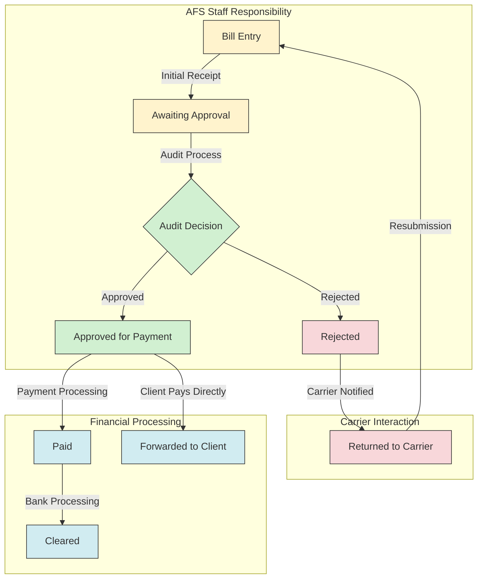
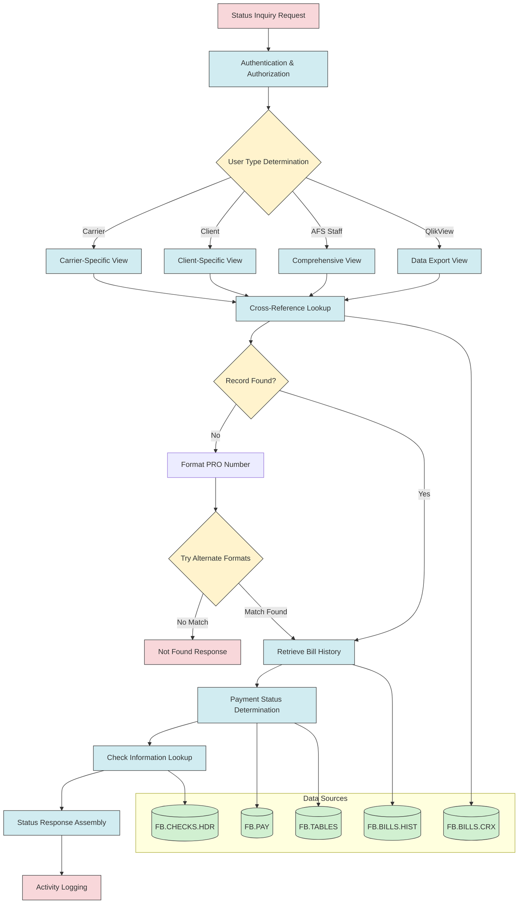
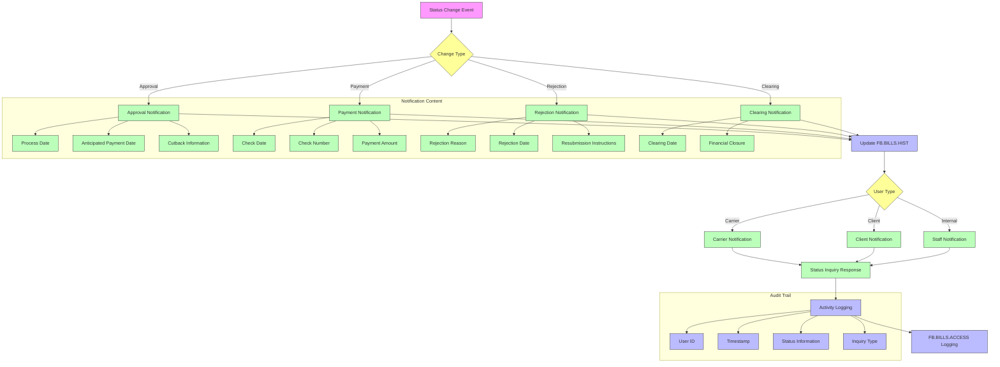

# Freight Bill Status System in AFS Shreveport

## Overview of Freight Bill Status System

The Freight Bill Status System is a critical component of the AFS Shreveport platform that provides real-time visibility into the lifecycle of freight bills. This system serves as a centralized information hub where carriers, clients, and AFS staff can track the current status of freight bills throughout the processing workflow. For carriers, it offers transparency on payment timelines and rejection reasons. Clients gain visibility into their freight expenses, processing status, and payment schedules. AFS staff utilize the system to monitor workflow efficiency, respond to inquiries, and ensure timely processing of freight bills.

The system integrates with multiple data sources including cross-reference files, history files, and payment records to provide comprehensive status information. It supports various user interfaces including web services, client portals, and internal systems, with tailored information displays based on user roles. The status tracking capabilities extend from initial bill entry through processing, approval, payment, and clearing, with specialized handling for rejections, cutbacks, and carrier-specific formatting requirements.

## Freight Bill Status Workflow

The diagram illustrates the complete lifecycle of a freight bill in the AFS Shreveport system. Bills enter the system through initial receipt and are placed in an "Awaiting Approval" status while they undergo audit review. The audit process results in either approval (moving to "Approved for Payment" status) or rejection. Approved bills proceed to payment processing, resulting in "Paid" status, and eventually "Cleared" status once the payment clears the banking system. For clients who handle their own payments, bills may be forwarded directly to them after approval. Rejected bills are returned to carriers with detailed rejection reasons, allowing for correction and resubmission. The workflow incorporates clear responsibility boundaries between AFS staff, financial processing systems, and carrier interactions.

## Status Types and Definitions

The AFS Shreveport system employs a comprehensive set of status designations to track freight bills through their lifecycle:

**Awaiting Approval**: Bills that have been entered into the system but have not yet completed the audit process. These bills are queued for review by auditors who verify charges, rates, and documentation. The system calculates and displays the scheduled processing date based on client-specific processing schedules.

**Approved for Payment**: Bills that have successfully passed the audit process and are authorized for payment. These bills include an anticipated payment date calculated based on the client's historical payment patterns and processing schedules. For clients with consistent payment cycles, the system provides an estimated check date.

**Paid**: Bills for which payment has been issued. The status includes detailed payment information such as check date, check number, payment amount, and total check amount. For voucher clients, this status indicates that the bill has been forwarded to the client for payment with appropriate remittance reference information.

**Cleared**: Paid bills where the payment has cleared the banking system. This status includes the bank clearing date and provides complete financial closure for the transaction. This status is particularly important for reconciliation purposes.

**Rejected**: Bills that failed the audit process and have been returned to the carrier. The system maintains detailed rejection information including rejection codes, free-form rejection reasons, rejection dates, and the auditor who made the rejection decision.

**Forwarded to Client for Payment**: A specialized status for clients who manage their own payment processes. These bills have been approved by AFS and forwarded to the client with all necessary information for the client to issue payment directly to the carrier.

Each status provides appropriate visibility to different user types, with carriers seeing payment and rejection information, clients seeing financial and processing details, and AFS staff having access to comprehensive status information including internal processing metrics.

## User Access and Permissions

The Freight Bill Status system implements a sophisticated access control model that tailors information visibility based on user type:

**Carrier Users**: Carriers can access status information only for their own bills. They can view basic status information (awaiting approval, approved, paid, rejected), payment details (check dates, check numbers, payment amounts), and rejection reasons when applicable. Carriers cannot see client-specific information beyond what's necessary for payment tracking. The system handles carrier-specific PRO number formats, including special handling for carriers like UPS and SAIA.

**Client Users**: Clients can view status information for all bills associated with their account, regardless of carrier. They see comprehensive status details including processing dates, payment information, and rejection reasons. Clients with voucher payment arrangements (bank codes 'V' or 'N') receive specialized status information indicating that bills have been forwarded to them for payment. The system validates client user credentials and ensures they can only access bills belonging to their organization.

**AFS Staff**: Internal users have complete visibility across all status information, including detailed audit trails, internal notes, cutback amounts, cutback reasons, and auditor information. Staff members can access bills across all clients and carriers, with specialized views for different operational needs. The system logs all staff inquiries for compliance and troubleshooting purposes.

**QlikView Data Export**: A specialized access type that extracts status data in a format optimized for analytics and reporting. This access type focuses on financial and operational metrics rather than detailed status information.

The system implements authentication through the `GET.USER.NEW` function and logs all status inquiries in the `INET.FBSTATUS.ACTIVITY` file, creating a comprehensive audit trail of who accessed what information and when. For non-demo clients, the system also records detailed access information in client-specific `FB.BILLS.ACCESS` files.

## Status Lookup Architecture

The Status Lookup Architecture diagram illustrates the technical components and data flow of the freight bill status inquiry system. The process begins with a status inquiry request that undergoes authentication and authorization. Based on the user type (carrier, client, AFS staff, or QlikView), the system determines the appropriate view format and information scope.

The core lookup process starts with the FB.BILLS.CRX cross-reference file to locate the bill record. If the record isn't found with the exact PRO number format, the system attempts various formatting transformations including handling carrier-specific formats (like UPS tracking numbers with -O, -I, -T suffixes) and checking for AD/BD suffixes and numeric suffixes.

Once the bill is located, the system retrieves detailed history from the client-specific FB.BILLS.HIST file. Payment status is determined by examining processing dates, check information, and rejection codes. For paid bills, the system retrieves check details from FB.CHECKS.HDR including clearing dates and ACH indicators. The FB.PAY file provides anticipated payment dates for approved bills.

The system assembles a comprehensive status response tailored to the user type, including appropriate financial details, processing dates, and rejection information. All inquiries are logged in the INET.FBSTATUS.ACTIVITY file, creating an audit trail of status requests. For non-demo clients, additional access logging occurs in client-specific FB.BILLS.ACCESS files.

The architecture includes sophisticated error handling for missing records, with the ability to create missing cross-reference records when history records exist but cross-references are missing, ensuring data integrity across the system.

## Payment Tracking and Verification

The AFS Shreveport system implements comprehensive payment tracking and verification capabilities to provide complete financial visibility throughout the freight bill lifecycle. The system captures and displays detailed payment information including:

**Check Dates**: The system records the date when payment was issued for each freight bill. This information is stored in the PRO.REC<15> field and displayed in a user-friendly format. For clients with voucher payment arrangements, the system indicates when bills were forwarded to the client for payment.

**Check Numbers**: Each payment is associated with a unique check number (stored in PRO.REC<14>), allowing for precise tracking and reconciliation. The system handles special formatting for different payment types, including removing suffixes like '*F' and '*V' for display purposes.

**Payment Amounts**: The system tracks both the billed amount and the actual payment amount, clearly displaying any differences due to cutbacks or adjustments. Payment amounts are formatted with appropriate currency symbols and decimal precision.

**Bank Clearing Dates**: For completed payments, the system captures when checks have cleared the banking system (stored in CHECK.REC<21>), providing complete financial closure information. This data is particularly valuable for reconciliation processes and cash flow management.

**ACH Transactions**: The system identifies payments made via ACH rather than paper checks (determined by CHECK.REC<26>), displaying appropriate payment method information to users.

**Voucher Processing**: For clients who manage their own payments (identified by bank codes 'V' or 'N'), the system tracks when bills were forwarded for payment and uses specialized terminology like "remittance reference #" instead of "check #" in status displays.

**Payment Verification**: The system correlates payment information across multiple data sources, including FB.BILLS.HIST, FB.CHECKS.HDR, and FB.PAY, ensuring data consistency and accuracy.

**Anticipated Payment Dates**: For approved bills awaiting payment, the system calculates and displays anticipated payment dates based on historical payment patterns, helping carriers plan their cash flow.

The payment tracking system accommodates various payment scenarios including full payments, partial payments with cutbacks, and specialized handling for Chapter 11 situations. All payment information is appropriately filtered based on user type, ensuring carriers and clients see only the information relevant to their role.

## Rejection Management

The AFS Shreveport system implements a sophisticated rejection management process that provides clear communication about rejected freight bills while maintaining appropriate information security. When a bill is rejected during the audit process, the system captures comprehensive rejection details:

**Rejection Codes**: The system maintains standardized rejection codes in the FB.TABLES file under the 'REJECT.CODES' record. These codes provide consistent categorization of rejection reasons, facilitating reporting and trend analysis.

**Rejection Dates**: Each rejection is timestamped (stored in REJECT.USER.DATE), allowing for chronological tracking of the rejection history. For bills with multiple rejections, the system maintains the complete timeline of rejection events.

**Auditor Information**: The system records which auditor made the rejection decision (stored in PRO.REC<89>), establishing accountability and providing a point of contact for follow-up questions.

**Detailed Rejection Reasons**: Beyond standardized codes, the system supports free-form rejection comments (stored in FREE.FORM.REJECT) that provide specific details about why a bill was rejected. This information helps carriers address issues precisely when resubmitting bills.

**Information Security**: The system implements special handling for sensitive rejection reasons. When a rejection reason begins with "REM" (for "remarks"), the system displays a generic message to carriers indicating they should contact AFS directly for more information, protecting potentially sensitive client information.

**Multiple Rejection Handling**: The system supports multiple rejections for a single bill, displaying each rejection with its corresponding date and reason, numbered sequentially for clarity.

**Communication Flow**: When a carrier inquires about a rejected bill, the system provides appropriate rejection information based on the user type. Carriers see rejection reasons that are relevant to their resubmission process, while AFS staff can view complete rejection details including internal notes.

**Rejection Activity Logging**: All rejection inquiries are logged in the activity tracking system, creating an audit trail of communication about rejected bills.

The rejection management system balances the need for clear communication with carriers against the requirement to protect sensitive client information, ensuring that carriers receive the information they need to correct and resubmit bills while maintaining appropriate information boundaries.

## Status Notification System

The Status Notification System flowchart illustrates how the AFS Shreveport platform manages and communicates status updates throughout the freight bill lifecycle. The process begins with a status change event, which can be an approval, payment, rejection, or clearing event. Each event type triggers specific notification content tailored to the nature of the status change.

When a bill is approved, the system captures the process date, anticipated payment date, and any cutback information. Payment notifications include check date, check number, and payment amount details. Rejection notifications contain rejection reasons, dates, and resubmission instructions. Clearing notifications confirm financial closure with bank clearing dates.

All status changes are recorded in the FB.BILLS.HIST file, creating a permanent record of the bill's progression through the workflow. When users inquire about bill status, the system determines the appropriate information to display based on user type:

- Carriers receive information relevant to their payment expectations and any actions they need to take
- Clients see comprehensive financial and processing information for their freight bills
- Internal staff access complete status details including internal notes and processing metrics

Every status inquiry is logged in the activity tracking system, capturing the user ID, timestamp, inquiry type, and status information provided. For non-demo clients, additional detailed access logging occurs in client-specific FB.BILLS.ACCESS files, creating a comprehensive audit trail of all status-related interactions.

The notification system ensures that all stakeholders receive timely, relevant information about freight bill status while maintaining appropriate information boundaries and creating a complete audit trail for compliance and troubleshooting purposes.

## Anticipated Payment Date Calculation

The AFS Shreveport system implements a sophisticated algorithm for calculating and displaying anticipated payment dates, providing carriers with valuable cash flow planning information. This feature analyzes historical payment patterns for each client and uses this data to project when approved bills are likely to be paid.

For bills that have been approved for payment but not yet paid, the system first checks the FB.PAY file for a pre-determined anticipated payment date. If found in field 134 of the client-specific payment record, this date is displayed as the definitive anticipated payment date.

If no pre-determined date exists, the system analyzes the client's historical payment patterns by examining the time intervals between processing dates and check dates for previous payments. The algorithm:

1. Retrieves up to eight recent payment records for the client
2. Calculates the difference in days between processing date and check date for each record
3. Computes the average payment interval, rounding up to the nearest whole day
4. Adds this average interval to the current bill's processing date to determine the anticipated payment date

For clients with consistent payment cycles, this provides a reliable estimate of when payment can be expected. The system includes special handling for certain clients, such as client '00932' which has a fixed 21-day payment cycle regardless of historical patterns.

To ensure realistic expectations, the system enforces a minimum anticipated payment date of at least seven days from the current date. For specific clients (01977, 01979, and 02459), the system suppresses the estimated payment date display due to special payment arrangements.

For clients using voucher payment methods (bank codes 'V' or 'N'), the system indicates that bills have been forwarded to the client for payment rather than providing an anticipated payment date, reflecting the different payment workflow.

This calculation provides carriers with valuable visibility into payment timelines while accounting for client-specific payment patterns and special cases, enhancing cash flow predictability throughout the freight payment ecosystem.

## Special Handling for Carrier-Specific Formats

The AFS Shreveport system implements sophisticated handling for carrier-specific PRO number formats, ensuring accurate status lookup despite variations in how tracking numbers are formatted and presented. This capability is particularly important for carriers with unique identification systems or multiple format variations.

**UPS Tracking Numbers**: The system includes specialized handling for UPS (carrier code 00041) tracking numbers that may appear with different suffixes. When a user queries a UPS tracking number ending with one suffix type (-O, -I, or -T), the system automatically checks for matching bills with the other suffix types. For example, if a user searches for a tracking number ending with "-O", the system also checks for the same base number with "-I" and "-T" suffixes. This ensures that users can find their bills regardless of which format variant they use.

**SAIA Bill Formats**: For SAIA (carrier code 00018), the system automatically adjusts trailing digits in the PRO number. Specifically, if a PRO number ends with "1", the system converts it to "0" before performing the lookup. This accommodates a known variation in how SAIA bills are numbered and presented.

**PRO Format Overrides**: The system supports client-specific PRO format overrides based on client/carrier combinations. These overrides are stored in the FB.PRO.FORMAT file with IDs in the format "CLIENT*CARRIER". When a client user performs a status lookup, the system checks for these overrides and applies the client-specific formatting rules to the carrier's PRO numbers.

**Format Transformation**: Beyond carrier-specific handling, the system implements a comprehensive approach to format normalization:
- Removing special characters (dashes, periods, commas, parentheses, etc.)
- Stripping leading zeros
- Checking for AD/BD suffixes (and multiple combinations like ADAD, ADADAD)
- Checking for numeric suffixes with slashes (e.g., /1, /2, /3)
- Combinations of these variations (e.g., /1AD, /2BDBD)

**Cross-Reference Carriers**: For carriers with multiple identification codes, the system checks alternative carrier codes stored in the XREF.CARRIERS field of the carrier record. This ensures that bills can be found even if they were entered under a different code for the same carrier.

**Missing Cross-Reference Recovery**: If a bill exists in the history file but is missing from the cross-reference file, the system can dynamically create the missing cross-reference record, ensuring data integrity and successful status lookup.

This comprehensive approach to handling carrier-specific formats ensures that users can successfully retrieve bill status information regardless of format variations, improving the user experience and reducing support inquiries related to "missing" bills.

## Activity Logging and Audit Trail

The AFS Shreveport system implements comprehensive activity logging and audit trail capabilities for freight bill status inquiries, creating a detailed record of all system interactions for compliance, troubleshooting, and security purposes. This multi-layered logging approach captures both user actions and system responses.

**Primary Activity Logging**: All status inquiries are recorded in the INET.FBSTATUS.ACTIVITY file with a unique identifier that combines user type, user ID, user name, password (encrypted), date, and time. Each activity record captures:
- The PRO numbers queried
- The carrier code used for the inquiry
- The complete status information returned to the user
- Timestamp of the inquiry

**Program Execution Logging**: The system uses the UPD.PROGRAM.LOG function to record program execution details, including:
- Program library (FBBP)
- Program name (INET.FB.STATUS)
- User identifier
- Channel number
- Execution timestamp

**Client-Specific Access Logging**: For non-demo clients (client IDs not starting with '99'), the system maintains detailed access logs in client-specific FB.BILLS.ACCESS files. These logs capture:
- Client ID
- PRO number accessed
- User who performed the lookup
- Access type (IN for inquiry)
- Date and time of access
- Access method (INET.FB.STATUS)
- Access purpose (FB INQUIRY)
- Business function (FREIGHT BILLING)
- Organization (AFS Logistics, LLC)
- Interface type (INQ_WEB)

**User Authentication Tracking**: The system records user authentication through the GET.USER.NEW function, maintaining a record of who accessed the system and when.

**Response Logging**: Beyond recording the inquiry itself, the system logs the complete response provided to the user, creating a record of what information was disclosed and when.

**Selective Logging**: The system implements selective logging based on user type, with different logging behaviors for regular users versus internal AFS staff and QlikView data export operations.

**Audit Trail Preservation**: All logs are preserved for historical reference, creating a permanent audit trail of status inquiries and responses that can be used for compliance verification, security auditing, and troubleshooting user issues.

This comprehensive logging system ensures complete visibility into who accessed what information and when, supporting compliance requirements while providing valuable data for system optimization and troubleshooting.

## Status Data Integration Points

```mermaid
graph TD
    A[Freight Bill Status System] --- B[Cross-Reference System]
    A --- C[Bill History System]
    A --- D[Payment Processing]
    A --- E[EDI System]
    A --- F[Client Communications]
    A --- G[Carrier Communications]
    A --- H[Analytics & Reporting]
    
    B --- B1[(FB.BILLS.CRX)]
    C --- C1[(FB.BILLS.HIST)]
    D --- D1[(FB.CHECKS.HDR)]
    D --- D2[(FB.PAY)]
    E --- E1[(EDI.BILLS.HIST)]
    F --- F1[Client Portals]
    F --- F2[Email Notifications]
    G --- G1[Carrier Portals]
    G --- G2[Rejection Communications]
    H --- H1[QlikView Export]
    H --- H2[Status Reports]
    
    A --- I[Lookup Services]
    I --- I1[PRO Format Service]
    I --- I2[Carrier Validation]
    I --- I3[Client Validation]
    
    A --- J[Audit Trail]
    J --- J1[(INET.FBSTATUS.ACTIVITY)]
    J --- J2[(FB.BILLS.ACCESS)]
    
    subgraph "Core Status Data"
    K[Bill Status]
    L[Payment Information]
    M[Processing Dates]
    N[Rejection Details]
    O[Cutback Information]
    end
    
    A --- K
    A --- L
    A --- M
    A --- N
    A --- O
    
    classDef core fill:#f9f,stroke:#333,stroke-width:1px
    classDef system fill:#bbf,stroke:#333,stroke-width:1px
    classDef datastore fill:#bfb,stroke:#333,stroke-width:1px
    classDef service fill:#ff9,stroke:#333,stroke-width:1px
    
    class A system
    class B,C,D,E,F,G,H,I,J system
    class B1,C1,D1,D2,E1,J1,J2 datastore
    class F1,F2,G1,G2,H1,H2 service
    class I1,I2,I3 service
    class K,L,M,N,O core
```

The Status Data Integration Points diagram illustrates how the Freight Bill Status system interfaces with other components of the AFS Shreveport platform to provide comprehensive status information. The system sits at the center of a complex data ecosystem, drawing information from multiple sources and providing status data to various consumers.

The core integration points include:

**Cross-Reference System**: The FB.BILLS.CRX file serves as the primary index for locating freight bills, providing a quick lookup mechanism that maps carrier and PRO number combinations to client IDs and bill records.

**Bill History System**: Client-specific FB.BILLS.HIST files contain the detailed bill information including processing dates, payment details, and rejection information that forms the foundation of status reporting.

**Payment Processing**: The FB.CHECKS.HDR file provides check information including clearing dates and ACH indicators, while the FB.PAY file contains anticipated payment dates and payment scheduling information.

**EDI System**: The EDI.BILLS.HIST files indicate whether bills were received electronically, affecting how status information is presented and processed.

**Client Communications**: The status system feeds information to client portals and email notifications, providing clients with visibility into their freight bill processing.

**Carrier Communications**: Carrier portals and rejection communications rely on status data to keep carriers informed about payment timelines and rejection reasons.

**Analytics & Reporting**: The QlikView export functionality extracts status data in a format optimized for analytics, while various status reports provide operational insights.

**Lookup Services**: The status system interfaces with PRO format services, carrier validation, and client validation to ensure accurate data retrieval and presentation.

**Audit Trail**: The INET.FBSTATUS.ACTIVITY and FB.BILLS.ACCESS files maintain comprehensive logs of all status inquiries and responses.

At the core of the system is the status data itself, including bill status, payment information, processing dates, rejection details, and cutback information. This data flows through the integration points to provide a complete view of freight bill status to all stakeholders in the freight payment ecosystem.

[Generated by the Sage AI expert workbench: 2025-05-28 08:06:20  https://sage-tech.ai/workbench]: #