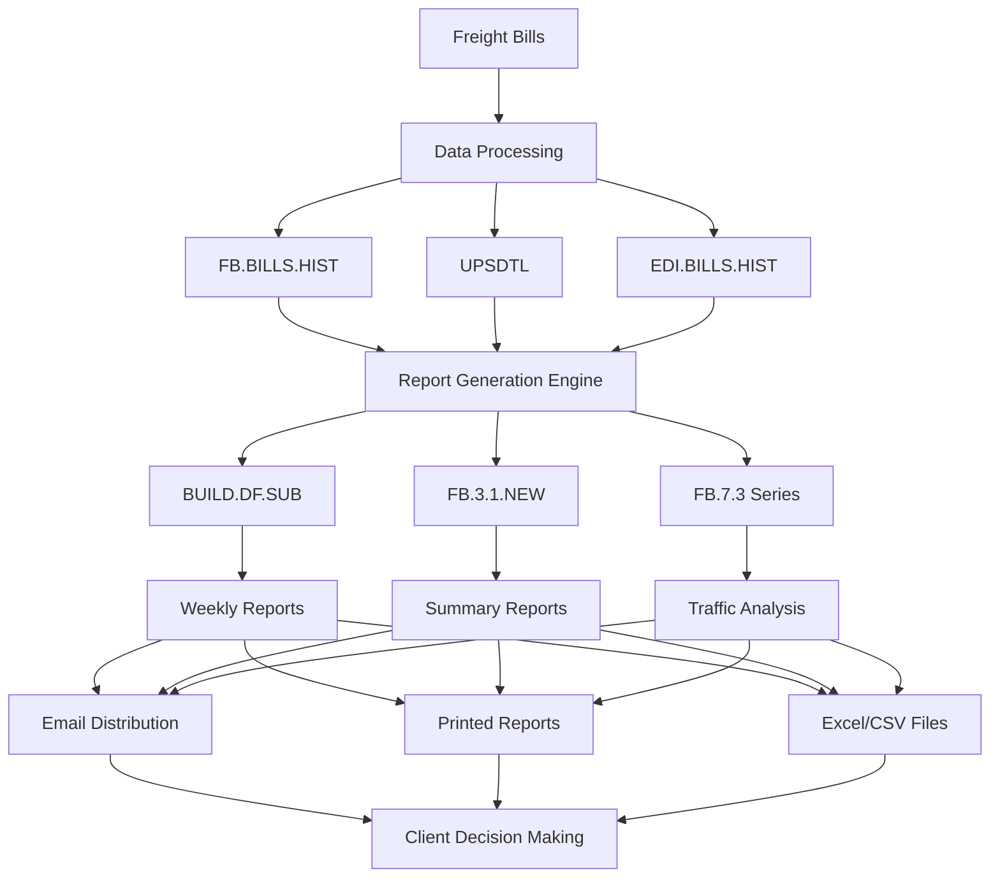
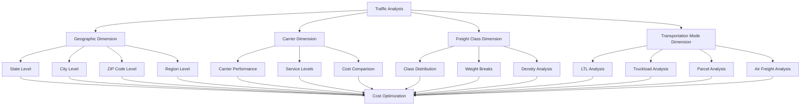
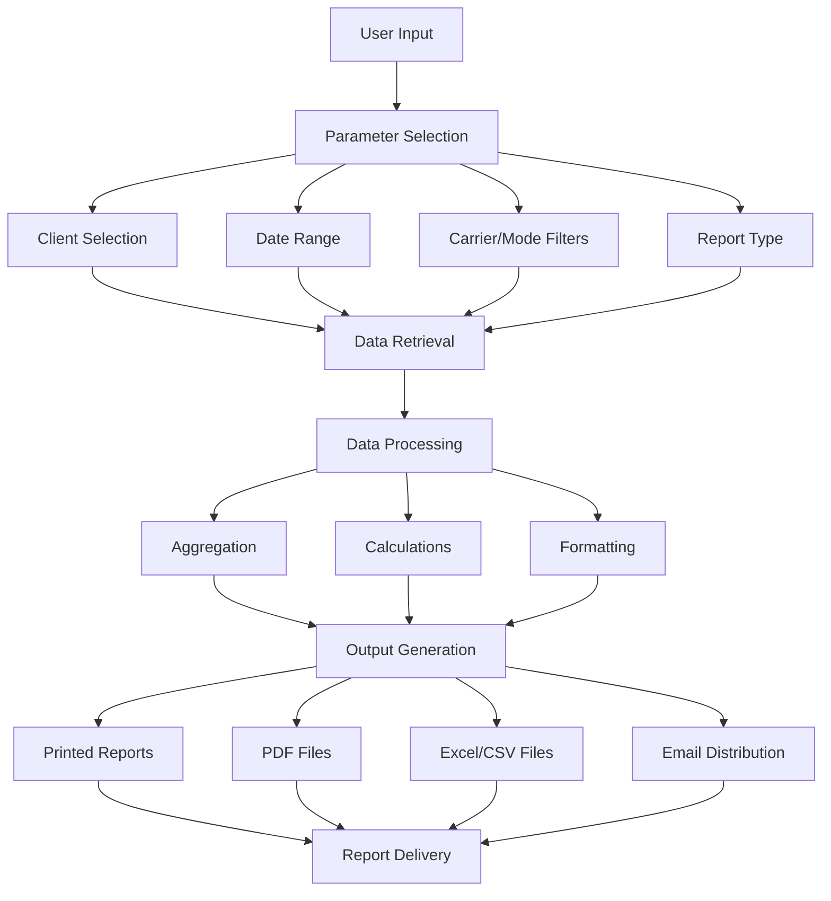
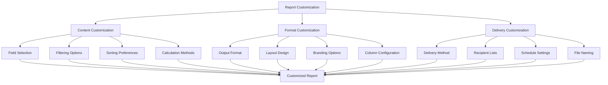

# Freight Cost Reporting in AFS Shreveport

## Introduction to Freight Cost Reporting

The AFS Shreveport System provides comprehensive freight cost reporting capabilities that serve as a critical component for client decision-making and cost management. These reporting features enable clients to analyze their freight spending across multiple dimensions, identify cost-saving opportunities, and make data-driven decisions about their logistics operations. The system's reporting framework processes vast amounts of freight billing data, transforming it into actionable insights through various report types tailored to different analytical needs. From weekly freight bill summaries to detailed traffic analysis reports, the system provides visibility into shipping patterns, carrier performance, and expense allocation, helping clients optimize their freight operations and control costs.

## Core Reporting Architecture

The AFS Shreveport System organizes and processes freight billing data through a sophisticated multi-layered architecture designed to generate various cost reports. At its foundation, the system stores detailed freight bill information in database files like FB.BILLS.HIST and specialized carrier-specific files such as UPSDTL for parcel shipments. This data includes shipment details, carrier information, charges, routes, and other relevant attributes.

The reporting architecture employs a modular approach with specialized components for different reporting functions. The BUILD.DF.SUB subroutine serves as a core engine for many reports, accepting numerous parameters to filter and format data. Various front-end programs like FB.3.1.NEW for weekly reports and FB.7.3 series for traffic analysis collect user input and pass parameters to these processing engines.

The system supports multiple dimensions for analysis including client hierarchies (parent-child relationships), divisions, regions, expense codes, and transportation modes. Data can be aggregated at different levels, allowing for both high-level summaries and detailed drill-downs. Reports can be generated for current data, historical periods, or specific processing batches, with flexible date range selection.

## Freight Cost Reporting Data Flow

The data flow begins with freight bills entering the system through various channels (EDI, manual entry, parcel imports). These bills undergo processing and validation before being stored in historical databases. When reports are requested, the appropriate reporting engine queries these databases based on user-specified parameters such as date range, client, carrier, and transportation mode. The system then processes this data, calculating metrics like totals, averages, and variances before formatting the output into the requested delivery format (printed reports, email attachments, or downloadable files). This processed information is then delivered to clients through their preferred channels, enabling informed decision-making about their freight operations and costs.

## Standard Freight Bill Reports

Weekly freight bill reports form the backbone of the AFS Shreveport System's reporting capabilities, providing clients with regular updates on their processed bills, charges, and savings from audits. These reports are typically generated through the FB.3.1.NEW program and its variants, which create comprehensive summaries of freight activity within specified date ranges.

The standard weekly reports include detailed listings of processed bills showing carrier information, PRO numbers, shipment dates, origins, destinations, weights, and charges. They highlight key metrics such as total carrier charges, actual charges paid, and savings achieved through various audit processes like duplicate detection, overcharge identification, and discount application.

For clients with complex organizational structures, the system supports divisional and regional reporting, allowing costs to be allocated and analyzed by business unit. Reports can be customized to show inbound, outbound, and third-party shipments separately or combined, giving clients flexibility in how they view their freight activity.

The system also generates specialized reports for rejected bills, never-pay bills, and bills approved for payment, providing complete visibility into the billing process. Summary of charges reports consolidate this information, showing totals by carrier, transportation mode, and other dimensions, making it easy for clients to understand their overall freight spending patterns and identify opportunities for optimization.

## Traffic Analysis Reports

Traffic analysis reports in the AFS Shreveport System provide detailed insights into shipment patterns by analyzing freight movements across geographic locations, carriers, transportation modes, and freight classes. These reports help clients understand their shipping patterns and identify opportunities for optimization and cost reduction.

The FB.7.3 series of programs generates these specialized reports, processing historical freight bill data to create comprehensive analyses. For example, FB.7.3.3 produces State & City Traffic Analysis reports that break down shipments by origin and destination, showing counts, weights, charges, and other metrics for each location. This helps clients identify high-volume lanes and potential consolidation opportunities.

The system can analyze shipments by direction (inbound, outbound, third-party), allowing clients to understand their freight flows from different perspectives. Reports can be filtered by US or Canadian shipments, providing insights into domestic and international shipping patterns.

These reports calculate important metrics including shipment counts, total weights, hazardous materials shipments, freight charges, minimum charges, non-freight charges, and average costs per shipment. They also track mileage information when available, enabling cost-per-mile analysis for transportation efficiency.

By understanding their traffic patterns in detail, clients can make informed decisions about carrier selection, consolidation opportunities, and network optimization to reduce costs and improve service levels.

## Traffic Analysis Dimensions

Traffic analysis in the AFS Shreveport System examines freight movements across multiple dimensions to provide comprehensive insights. The geographic dimension breaks shipments down by state, city, ZIP code, and region, allowing clients to understand their shipping patterns at different levels of granularity. The carrier dimension evaluates performance across different service providers, comparing costs, service levels, and reliability.

The freight class dimension analyzes shipments by their NMFC classification, helping clients understand how their product characteristics affect shipping costs. This dimension includes analysis of weight breaks, density, and other classification factors that impact rates.

The transportation mode dimension separates analysis by shipping method (LTL, truckload, parcel, air freight), enabling clients to evaluate the cost-effectiveness of different modes for their specific needs. Each mode has its own metrics and benchmarks for performance.

These dimensions can be combined in various ways to create multi-dimensional analyses. For example, clients can examine LTL shipments by state and carrier to identify the most cost-effective providers in specific lanes. By understanding how these dimensions interrelate, clients can make strategic decisions about routing, carrier selection, and mode choice to optimize their freight costs.

## Carrier Performance Analysis

The AFS Shreveport System provides robust carrier performance analysis capabilities that enable clients to evaluate their transportation providers objectively. These reports compare actual charges against benchmark rates and analyze various service metrics to help clients make informed decisions about carrier selection and negotiation.

Programs like FB.7.3 and FB.3.2 generate detailed carrier analysis reports that break down shipment data by carrier, showing metrics such as shipment counts, weights, charges, and average costs. These reports calculate key performance indicators including cost per shipment, cost per hundredweight (CWT), and cost per mile, allowing for standardized comparisons across different carriers.

The system can analyze carrier performance within specific lanes (origin-destination pairs) or regions, identifying which carriers provide the best value in different geographic areas. This lane-specific analysis helps clients optimize their routing guides and carrier assignments.

For clients with negotiated rates, the system compares actual charges against contract rates to ensure compliance and identify billing discrepancies. It also tracks service failures, on-time performance, and other quality metrics to provide a comprehensive view of carrier performance beyond just cost.

The least cost carrier (LCC) analysis identifies instances where shipments were tendered to carriers other than the lowest-cost approved option, quantifying the financial impact of these routing decisions. This helps clients enforce routing compliance and capture savings opportunities.

By providing detailed visibility into carrier performance across multiple dimensions, these reports enable clients to make data-driven decisions about their carrier strategy, negotiate better rates, and continuously optimize their transportation spend.

## Expense Distribution Reporting

Expense distribution reporting in the AFS Shreveport System provides detailed breakdowns of freight costs by expense codes, divisions, and regions, enabling precise cost allocation and analysis. These reports help clients understand how freight expenses are distributed across their organization and identify opportunities for cost control and optimization.

The system supports client-specific expense code structures, allowing freight charges to be categorized according to each client's accounting needs. Programs like FB.3.1.DIV.EXP and FB.3.1.REG.EXP generate reports that organize freight costs by these expense codes, showing totals and percentages for each category.

For clients with complex organizational structures, the system can distribute costs by division, department, cost center, or other organizational units. This enables accurate cost allocation and departmental accountability for freight expenses. Regional reporting provides geographic breakdowns, helping clients understand cost variations across different parts of their network.

The expense distribution reports can analyze costs by transportation mode (LTL, truckload, parcel, air), carrier type, and service level, providing insights into how different shipping methods contribute to overall freight expenses. They also support time-based analysis, showing how expense distributions change over time and identifying trends or anomalies.

These reports integrate with clients' financial systems through features like GL code mapping, ensuring that freight costs are properly allocated in their accounting systems. By providing detailed visibility into how freight costs are distributed across the organization, these reports enable clients to implement more effective cost control measures and make informed decisions about their logistics operations.

## Report Generation Process

The report generation process in the AFS Shreveport System follows a structured workflow that begins with parameter selection. Users specify key criteria including client identification, date ranges, carrier or transportation mode filters, and the desired report type. For specialized reports, additional parameters may include division codes, expense categories, or geographic filters.

Once parameters are defined, the system retrieves relevant data from historical databases like FB.BILLS.HIST or specialized files like UPSDTL for parcel shipments. This data retrieval phase employs optimized selection techniques to efficiently extract only the necessary records based on the specified criteria.

The data processing phase involves multiple steps including aggregation, calculation, and formatting. During aggregation, the system groups data according to the report's requirements, such as by carrier, geographic location, or expense code. Calculations are performed to derive metrics like totals, averages, percentages, and variances. The formatting step organizes this processed data into the appropriate structure for the selected output format.

Output generation converts the processed data into the requested delivery format, which may include printed reports, PDF files, Excel/CSV spreadsheets, or HTML email content. Each format requires specific handling to ensure proper presentation, such as page breaks for printed reports or column formatting for spreadsheets.

Finally, the report delivery phase distributes the generated output through the appropriate channels. This may involve printing physical copies, saving files to designated locations, or sending emails with attachments to specified recipients. The system supports automated scheduling of this process, allowing reports to be generated and delivered on a regular basis without manual intervention.

## Analytics Data Extraction

The AFS Shreveport System provides robust capabilities for extracting and formatting freight data for external analytics tools and client-specific reporting needs. This functionality allows clients to perform advanced analyses beyond the standard reports provided by the system, integrating freight data with their broader business intelligence initiatives.

At the core of this capability is the ANALYTICS.EXTRACT program and its supporting subroutines, which provide a flexible framework for data extraction. These programs allow users to specify detailed filtering criteria including client, carrier, date range, transportation mode, and various bill attributes like cutbacks, misroutes, and overcharges. The extracted data can be formatted in multiple ways including Excel-compatible spreadsheets, CSV files, and HTML reports.

For clients with specialized analytics needs, the system supports custom extracts with client-specific field selections and calculations. Programs like BUILD.CM.EXTRACT.SQL demonstrate how the system can create targeted extracts for specific analytical purposes, such as parcel carrier performance analysis.

The system supports both ad-hoc extracts initiated by users and scheduled extracts that run automatically at defined intervals. These scheduled extracts can be configured to deliver data to designated locations or email recipients, ensuring that analytics systems receive regular updates.

Integration with external analytics platforms is facilitated through standardized file formats and delivery mechanisms. The system can generate files compatible with tools like QlikView, providing a seamless flow of data from the freight billing system to advanced analytics environments.

By providing flexible, powerful data extraction capabilities, the AFS Shreveport System enables clients to leverage their freight data for deeper analysis and integration with their broader business intelligence ecosystem.

## Report Delivery and Distribution

The AFS Shreveport System offers comprehensive report delivery and distribution capabilities that ensure clients receive their freight cost information through their preferred channels. This multi-channel approach accommodates different client preferences and technical environments, making it easy for stakeholders to access and use the reports they need.

Email distribution is a primary delivery method, with programs like FB.3.1.NEW handling the automated sending of reports as attachments. The system supports both plain text and HTML email formats, with the latter providing enhanced visual presentation of data. Reports can be attached in various formats including Excel spreadsheets, CSV files, PDF documents, and HTML files, catering to different client needs and technical capabilities.

For clients requiring physical documentation, the system supports printing to various output devices, including local and network printers. Programs like FB.7.3 series include printer selection functionality with options for different paper sizes, orientations, and formatting. The system can also generate password-protected PDF files for secure distribution of sensitive financial information.

The distribution process can be configured at multiple levels of granularity. Client records contain email distribution lists that can be customized for different report types, allowing specific reports to be sent to the appropriate stakeholders. For clients with complex organizational structures, the system supports divisional and regional distribution, ensuring that each business unit receives only the reports relevant to their operations.

Automated scheduling capabilities allow reports to be generated and distributed on a regular basis without manual intervention. This ensures timely delivery of information to decision-makers and supports consistent reporting cycles aligned with clients' business processes.

By providing flexible, reliable report distribution options, the AFS Shreveport System ensures that freight cost information reaches the right people in the right format at the right time, supporting effective decision-making throughout the client organization.

## Report Customization Options

The AFS Shreveport System offers extensive report customization options that allow clients to tailor their freight cost reports to their specific needs. These customization capabilities span content, format, and delivery aspects, providing flexibility while maintaining consistency and accuracy.

Content customization begins with field selection, allowing clients to determine which data elements appear in their reports. Programs like FB.1.10 (Weekly Report Editor) enable clients to configure which columns appear in their reports, such as PRO numbers, BOL references, weights, charges, and other shipment details. Filtering options allow clients to focus on specific subsets of their data, such as particular carriers, transportation modes, or date ranges. Sorting preferences determine how data is organized within reports, while calculation methods can be adjusted to align with client-specific business rules.

Format customization includes options for output format (printed reports, Excel spreadsheets, CSV files, PDF documents, HTML), layout design (portrait or landscape orientation, page dimensions), and column configuration (width, alignment, totaling). The system supports different branding options, allowing reports to be customized with client logos and formatting preferences.

Delivery customization encompasses delivery method selection (email, print, file export), recipient list management, scheduling settings, and file naming conventions. Clients can specify different distribution lists for different report types, ensuring that each stakeholder receives only the information relevant to their role. Scheduling options allow reports to be generated and distributed on a regular basis aligned with client business cycles.

These customization options are typically stored in client configuration records and report templates, allowing consistent application across reporting cycles while maintaining the flexibility to adjust as client needs evolve. By providing this extensive customization capability, the AFS Shreveport System ensures that freight cost reports meet each client's specific information needs and integrate seamlessly with their business processes.

[Generated by the Sage AI expert workbench: 2025-05-28 08:06:13  https://sage-tech.ai/workbench]: #