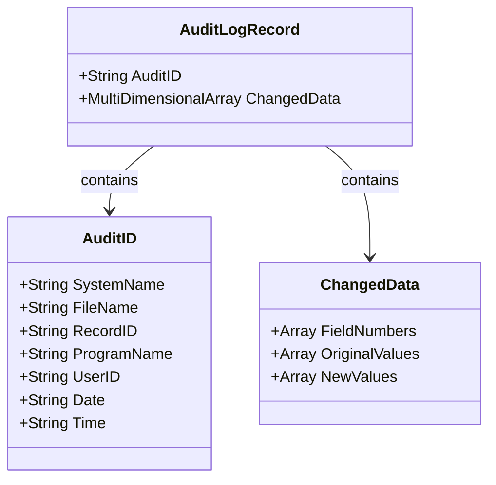
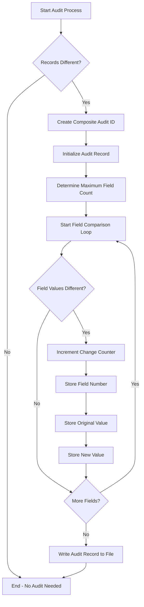
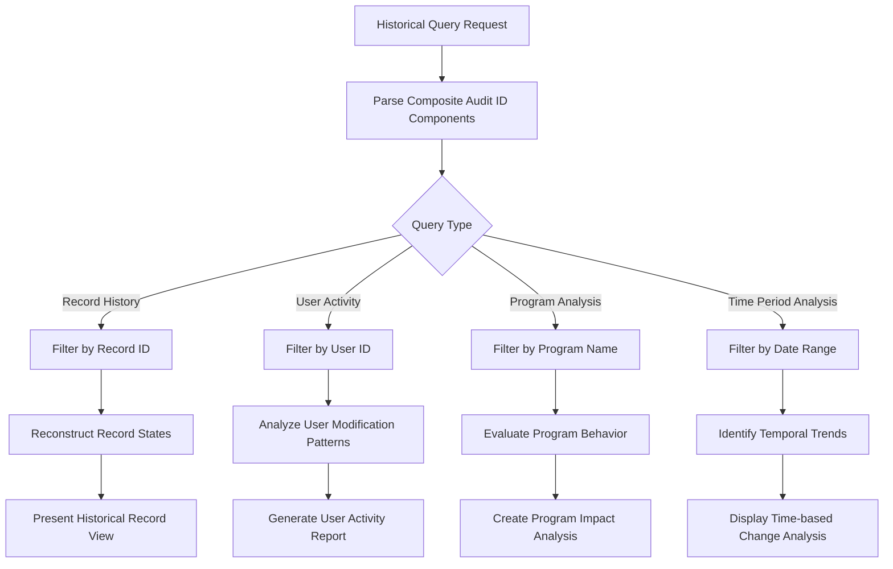

# Historical Data Auditing in AFS Shreveport

## Introduction to Historical Data Auditing

The historical data auditing system in AFS Shreveport serves as a critical component for maintaining data integrity and accountability across the platform. This comprehensive tracking mechanism captures and preserves a detailed record of all changes made to data throughout the system's operation. By maintaining an immutable audit trail of who changed what data, when, and through which program, the system provides essential capabilities for regulatory compliance, troubleshooting, and security monitoring. The audit logging functionality is implemented as a cross-cutting concern that operates independently of the core business logic, allowing it to capture changes across diverse modules without requiring modifications to each individual component. This separation of concerns ensures that audit logging remains consistent across the entire platform while minimizing the impact on the primary business functionality.

## Audit Trail Architecture

The audit logging system in AFS Shreveport is architected as a cross-cutting concern that operates orthogonally to the main business logic. This design approach allows the audit functionality to capture changes across multiple modules and business domains without tightly coupling to any specific component. The UPD.AUDIT.LOG subroutine serves as the central mechanism for this architecture, providing a standardized interface that can be called from any program that modifies data. By passing both the original and new record versions to this subroutine, along with contextual metadata about the operation, the system maintains complete separation between the audit logging functionality and the core business logic. This separation ensures that changes to either the business rules or the audit requirements can be implemented independently, reducing maintenance overhead and potential points of failure. The architecture also supports consistent audit behavior across the entire platform, ensuring that all data modifications are captured with the same level of detail regardless of which module or process initiated the change.

## Audit Log Record Structure

The audit log record structure in AFS Shreveport employs a sophisticated design that balances comprehensive change tracking with storage efficiency. Each audit record is uniquely identified by a composite key (AuditID) that combines system name, file name, record ID, program name, user ID, date, and time. This ensures that every change event can be precisely traced to its origin. The actual change data is stored in a multi-dimensional array structure with three dimensions: the first containing field numbers that were modified, the second storing the original values, and the third recording the new values. This structure allows the system to capture only the specific fields that changed rather than storing complete record snapshots, significantly reducing storage requirements while maintaining full auditability. The design also facilitates efficient querying for historical analysis, as changes can be filtered by any component of the composite key or by examining specific field modifications.

## Change Detection Mechanism

The change detection mechanism in AFS Shreveport's audit system employs a sophisticated field-by-field comparison approach to identify modifications with precision. The UPD.AUDIT.LOG subroutine first performs a high-level comparison between the original and new records to quickly determine if any changes exist at all. If differences are detected, the system proceeds with a detailed field-level analysis, iterating through each field position in both records. This granular comparison ensures that only actual modifications are captured in the audit trail, preventing unnecessary audit entries for records that were processed but not changed. The system also handles cases where the original and new records might have different structures or lengths by using the DCOUNT function to determine the maximum field count between both records, ensuring complete coverage of all potential changes. Each identified change is then recorded with its field position and both the original and new values, providing complete context for the modification. This precise change detection approach minimizes storage requirements while maintaining comprehensive audit capabilities.

## Comprehensive Record Identification

The AFS Shreveport audit system implements a remarkably thorough approach to record identification through its composite audit ID structure. This ID combines seven distinct elements: system name (identifying the specific application component), file name (indicating the database table), record ID (pinpointing the specific record), program name (identifying the code module that made the change), user ID (capturing who initiated the change), date, and time. This multi-faceted identifier creates a complete contextual fingerprint for each audit entry, enabling precise traceability across multiple dimensions. The system name component allows the audit mechanism to function across different subsystems within the AFS Shreveport platform, while the combination of date, time, and user information provides critical accountability data. The program name element is particularly valuable for troubleshooting and system analysis, as it reveals which specific code paths are generating changes. This comprehensive identification approach supports advanced audit queries that can filter by any combination of these elements, facilitating targeted investigations and compliance reporting without requiring exhaustive searches through the entire audit history.

## Audit Logging Process Flow

The audit logging process in AFS Shreveport follows a systematic workflow designed to efficiently capture meaningful changes while minimizing system overhead. The process begins with a preliminary comparison between original and new record versions to quickly determine if any changes exist. If the records are identical, the process terminates immediately, avoiding unnecessary processing and storage operations. When differences are detected, the system constructs a comprehensive composite audit ID that combines system name, file name, record ID, program name, user ID, date, and time to uniquely identify the change event. The process then determines the maximum field count between both records to ensure complete coverage, even when record structures differ. During the field-by-field comparison loop, each field is evaluated individually, and only those with differences are recorded in the audit log. For each changed field, the system stores the field number, original value, and new value in a multi-dimensional array structure. This selective approach ensures that the audit log contains only relevant change information, optimizing both processing efficiency and storage utilization. The completed audit record is then written to the audit log file, providing a permanent record of the change event.

## Variable-Length Record Handling

The historical data auditing system in AFS Shreveport demonstrates sophisticated handling of variable-length records through its implementation of the DCOUNT function. This approach addresses a fundamental challenge in MultiValue database environments where records can have different numbers of fields depending on their content and purpose. The system determines the field count of both the original and new records independently using DCOUNT with the field mark (@FM) as a delimiter, then selects the larger of these two counts to establish the upper bound for comparison. This ensures that the audit process captures changes in all fields, including cases where fields have been added to or removed from the record. Without this mechanism, the system might miss changes in trailing fields of longer records or fail to detect when fields have been appended to a record. The variable-length handling capability is particularly valuable in a logistics system like AFS Shreveport, where different record types may evolve over time with additional fields to support new business requirements, all while maintaining backward compatibility with existing data structures.

## Storage Efficiency in Audit Logging

The historical data auditing system in AFS Shreveport demonstrates remarkable storage efficiency through its selective field recording approach. Rather than storing complete snapshots of records before and after each change, the system identifies and records only the specific fields that have been modified. This design decision significantly reduces the storage footprint of the audit log, particularly for large records where changes might affect only a small subset of fields. The multi-dimensional array structure used to store these changes is particularly well-suited to the MultiValue database environment, allowing for compact representation of the modified fields and their values. Additionally, the system's initial comparison of complete records before proceeding with field-by-field analysis provides an early exit path when no changes are detected, preventing the creation of redundant audit entries. This combination of selective field recording and early termination for unchanged records ensures that the audit log remains focused on meaningful changes while minimizing database overhead. The storage efficiency becomes increasingly important over time as the audit log grows, allowing the system to maintain longer historical records without requiring excessive storage resources or impacting query performance.

## Historical Data Query Capabilities

The audit log structure in AFS Shreveport has been carefully designed to support sophisticated historical data queries, enabling powerful analysis and reconstruction capabilities. The composite audit ID, which combines system name, file name, record ID, program name, user ID, date, and time, serves as a multi-dimensional index that allows queries to be filtered along any of these dimensions. This enables administrators and auditors to reconstruct the complete state of a record at any point in time by retrieving all audit entries for a specific record ID and applying the changes sequentially up to the desired timestamp. The field-level change tracking provides granular visibility into exactly which attributes were modified in each transaction, supporting detailed analysis of data evolution over time. The system can also support queries focused on user activity (showing all changes made by a specific user across different records), program behavior (identifying all modifications made by a particular program), or time-based analysis (examining changes during specific operational periods). This query flexibility makes the audit log not just a compliance tool but also a valuable resource for troubleshooting, performance analysis, and business intelligence, allowing organizations to understand how their data changes over time and identify patterns that might indicate issues or opportunities.

## Integration with User Authentication

The historical data auditing system in AFS Shreveport demonstrates sophisticated integration with the platform's user authentication mechanisms, creating a seamless connection between identity management and change tracking. When a user initiates a data modification, their user ID is captured as a core component of the audit record's composite key, establishing clear accountability for every change. This integration ensures that even in complex multi-user environments, each modification can be traced to a specific authenticated user. The system preserves this user context regardless of whether changes are made through interactive sessions, batch processes, or automated workflows, maintaining consistent accountability across all operational modes. This user-centric approach to audit logging supports security investigations by enabling rapid identification of unusual or unauthorized data modifications based on user activity patterns. It also facilitates compliance with regulatory requirements that mandate user-level accountability for data changes in logistics and financial systems. The tight coupling between authentication and audit logging creates a comprehensive security fabric that not only tracks what changed and when, but also definitively answers the critical question of who initiated each change, completing the essential traceability chain required for both operational oversight and regulatory compliance.

## Compliance and Regulatory Support

The historical data auditing system in AFS Shreveport provides robust support for compliance and regulatory requirements that govern logistics operations and financial transactions. By maintaining a comprehensive, tamper-evident record of all data modifications, the system helps the organization meet obligations under various regulatory frameworks, including Sarbanes-Oxley for financial reporting integrity, GDPR for data protection, and industry-specific logistics regulations. The detailed capture of who made changes, when they occurred, and exactly what was modified creates an audit trail that can withstand scrutiny during regulatory examinations and audits. The system's ability to reconstruct historical states of records is particularly valuable for demonstrating compliance with rate agreements, contract terms, and service level commitments over time. This historical reconstruction capability allows AFS Shreveport to verify that freight billing calculations were performed correctly according to the rates and rules in effect at the specific time of service, rather than current configurations. Additionally, the audit system supports non-repudiation requirements by definitively linking each change to an authenticated user, creating accountability that helps prevent fraud and ensures proper segregation of duties. By implementing this sophisticated audit logging mechanism, AFS Shreveport transforms regulatory compliance from a burdensome obligation into an integrated aspect of its operational infrastructure, simultaneously meeting external requirements while providing valuable internal controls and business intelligence.

[Generated by the Sage AI expert workbench: 2025-05-28 08:06:31  https://sage-tech.ai/workbench]: #