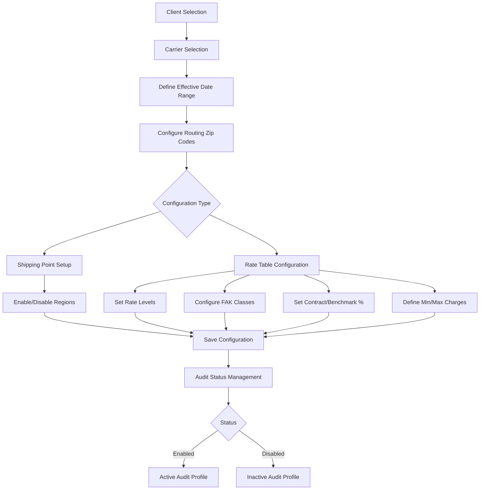
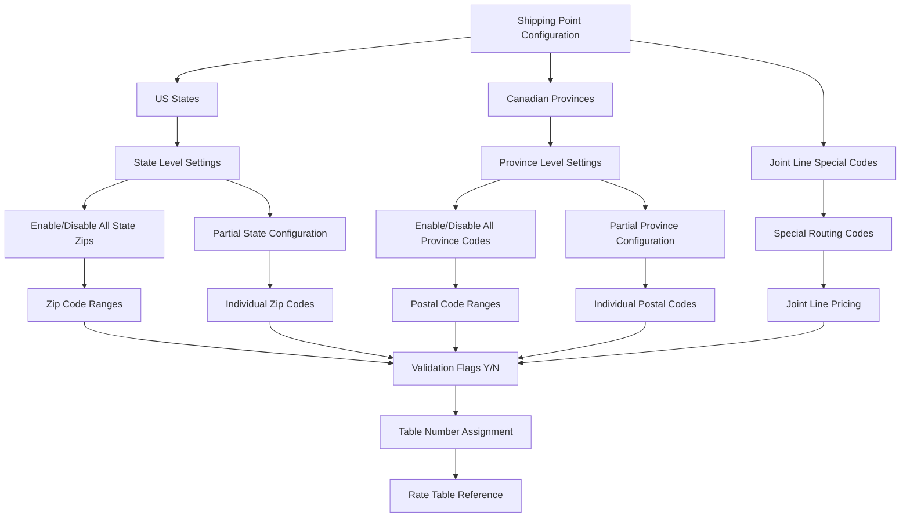
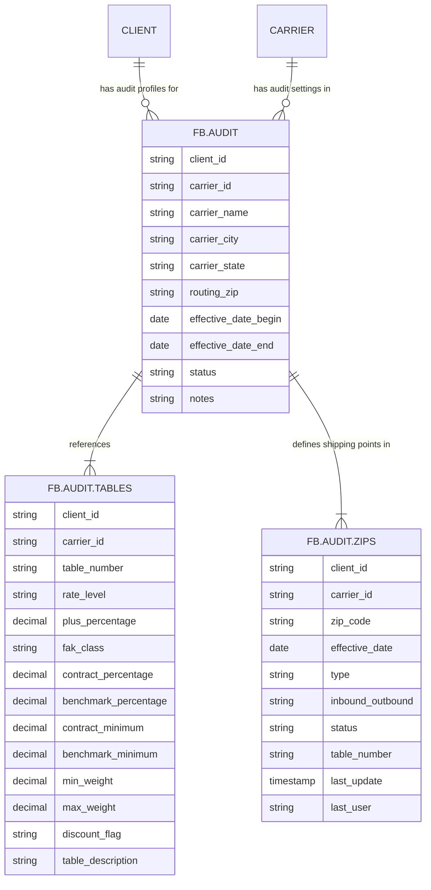

# LTL/LT Audit Program

## Overview of the LTL Audit Program

The LTL (Less Than Truckload) Audit Program within AFS Shreveport serves as an automated system for validating and optimizing freight bills for LTL shipments. This critical component enables logistics professionals to configure detailed audit profiles that determine how shipments should be priced, routed, and validated. The program automates the complex process of comparing actual freight charges against contracted rates, ensuring clients receive the correct pricing based on their negotiated carrier agreements. By implementing sophisticated validation rules and rate tables, the system identifies billing discrepancies, applies appropriate rate structures, and enforces regional shipping constraints, ultimately driving cost optimization through systematic freight bill auditing.

## Client-Carrier Relationship Configuration

The LTL Audit Program establishes structured relationships between clients and carriers through a hierarchical configuration system. Each client can have multiple carrier relationships, each with its own set of audit parameters. These relationships are defined with specific effective date ranges that control when particular audit rules apply, allowing for time-sensitive pricing adjustments and contract updates. The system supports both standard and specialized carrier relationships, including joint line pricing scenarios where multiple carriers collaborate on a shipment. Configuration options include enabling or disabling specific carriers for a client, setting up regional shipping validations through zip/postal code ranges, and defining rate tables that control pricing parameters. The program maintains detailed audit trails of all configuration changes, recording who made changes and when they occurred, ensuring accountability and providing historical context for audit decisions.

## LTL Audit Configuration Workflow

The LTL Audit configuration process follows a structured workflow that begins with selecting a client and carrier. Users then define effective date ranges to specify when the audit rules apply. Routing zip codes are configured to establish the geographical scope of the audit. The system supports two main configuration types: shipping point setup and rate table configuration. Shipping points determine valid origins and destinations, while rate tables control pricing parameters including rate levels, FAK classes, contract percentages, benchmark percentages, and minimum/maximum charges. Once configured, settings are saved to the appropriate files, and the audit profile's status is managed (enabled or disabled). This workflow ensures consistent application of audit rules across all freight bills processed through the system.

## Regional Shipping Point Validation

The LTL Audit Program implements comprehensive regional shipping point validation through a sophisticated zip/postal code management system. This functionality allows logistics administrators to define which geographic regions are valid shipping points for specific client-carrier combinations. The system supports both US zip codes and Canadian postal codes, with province-specific validation logic for Canadian shipments. Shipping points can be configured at various levels of granularity, from individual zip codes to entire states or provinces. Each shipping point can be individually enabled or disabled, allowing for precise control over routing options. The validation system supports partial configurations where only specific zip codes within a state are enabled, as well as complete state/province-level settings. When processing freight bills, the system automatically validates origin and destination points against these configured shipping points, flagging any shipments that violate the established routing rules. This validation ensures compliance with negotiated carrier agreements and helps prevent costly misrouting.

## Shipping Point Configuration Structure

The shipping point configuration structure in the LTL Audit Program organizes geographic validation data hierarchically. At the top level, shipping points are categorized into US states, Canadian provinces, and special routing codes like joint line pricing. Each state or province can be configured either completely (enabling/disabling all zip codes) or partially (configuring specific ranges or individual codes). The system maintains zip code ranges with corresponding validation flags (Y/N) that determine whether shipments to/from these locations are permitted. Each shipping point can be assigned a specific table number that references the appropriate rate table for pricing calculations. This structure allows for efficient storage and retrieval of shipping point data while providing the flexibility to handle complex routing scenarios. The configuration supports both inbound and outbound validations, enabling different rules for shipments entering versus leaving specific regions.

## Rate Tables and Pricing Configuration

The LTL Audit Program utilizes a sophisticated rate table structure to control pricing parameters for freight auditing. These tables define how shipments should be priced based on various factors including origin, destination, weight, and freight class. Each rate table contains multiple configuration elements: rate levels (such as AFS95 or CZAR94) that determine the base pricing structure, FAK (Freight All Kinds) classes that standardize freight classification, contract percentages that apply negotiated discounts, benchmark percentages for comparative pricing, and minimum charges that establish price floors. The system supports different rate configurations for interstate versus intrastate shipments, as well as separate tables for inbound and outbound traffic. Weight break parameters allow for tiered pricing based on shipment weight, with minimum and maximum weight thresholds. Additionally, the program supports discount flags that can trigger special pricing at predefined weight thresholds (typically 10,000 or 20,000 pounds). These rate tables work in conjunction with shipping point validations to ensure that the correct pricing is applied based on the geographic characteristics of each shipment.

## Data Migration and Copy Functionality

The LTL Audit Program includes robust tools for copying audit configurations between clients and carriers, facilitating efficient setup of similar audit profiles. These utilities allow administrators to copy entire audit configurations or specific components such as rate tables, shipping point validations, or effective date ranges. When copying between clients, the system preserves the integrity of the original data while creating appropriate references in the destination client's records. The copy functionality supports both one-to-one copying (single carrier to single carrier) and one-to-many scenarios (single carrier to multiple carriers or "ALL" carriers). Special handling is implemented for table descriptions, allowing users to customize descriptions when copying to destination clients. The system prevents accidental overwriting of existing configurations by validating destination records before copying. This migration capability significantly reduces setup time when onboarding new clients with similar requirements to existing ones or when updating multiple carriers with consistent pricing structures. The copy utilities maintain proper record relationships across the FB.AUDIT, FB.AUDIT.TABLES, and FB.AUDIT.ZIPS files, ensuring data integrity throughout the migration process.

## Audit Data Relationships

The LTL Audit Program's data structure revolves around three key files that store audit configuration data. The FB.AUDIT file serves as the primary record for client-carrier relationships, containing carrier information, routing zip codes, effective date ranges, and overall status indicators. Each audit record in FB.AUDIT can reference multiple rate tables stored in FB.AUDIT.TABLES, which contain detailed pricing parameters including rate levels, FAK classes, contract and benchmark percentages, minimum charges, and weight thresholds. The FB.AUDIT.ZIPS file stores shipping point validations, with each record representing a specific zip code or postal code range for a client-carrier combination. These records include status flags, table number references, and inbound/outbound indicators. The relationships between these files are maintained through composite keys that typically include client ID, carrier ID, and additional elements like zip codes or table numbers. This structure allows the system to efficiently retrieve and apply the appropriate audit rules when processing freight bills, while maintaining the flexibility to handle complex pricing scenarios and regional validations.

## Joint Line Pricing and Special Configurations

The LTL Audit Program supports specialized pricing scenarios including joint line pricing, which addresses situations where multiple carriers collaborate to complete a shipment. Joint line pricing requires special handling because the standard regional validation rules may not apply, and unique rate structures are often needed. The system implements this through special routing codes (typically "ZZZ" codes) that bypass standard geographic validation while applying appropriate joint line rates. Canadian shipping represents another specialized configuration, with the system supporting province-specific postal code validations and handling the complexities of cross-border shipments including different taxation rules. The program also accommodates special carrier relationships such as third-party carrier coverage (typically configured under client ID 99000), which requires distinct validation rules. For carriers with unique operating characteristics, the system allows for carrier-specific overrides that modify standard audit behavior. These specialized configurations ensure that the LTL Audit Program can handle the full spectrum of shipping scenarios encountered in complex logistics operations, from standard domestic shipments to intricate multi-carrier and international movements.

## Audit Status Management

The LTL Audit Program implements a comprehensive status management system that controls the activation state of audit configurations at multiple levels. At the highest level, entire client profiles can be enabled or disabled, affecting all carrier relationships for that client. Similarly, individual carrier relationships within a client can be independently enabled or disabled, allowing for selective auditing based on carrier performance or contract status. The system extends this granular control to the zip code level, where specific shipping points can be activated or deactivated without affecting other regions. Effective date ranges provide temporal control over audit configurations, automatically activating or deactivating rules based on date parameters. The status management system maintains detailed audit trails of status changes, recording who made changes, when they occurred, and the nature of the changes. Status indicators are clearly displayed in the user interface with visual cues (such as [ENABLED] or [DISABLED] tags) to provide immediate feedback on configuration states. This multi-level status management approach gives logistics administrators precise control over which audit rules are applied to which shipments, ensuring that the system enforces the correct business rules at all times.

## LTL Audit Program Integration Points

```mermaid
flowchart TD
    A[LTL Audit Program] --> B[Client Records System]
    A --> C[Carrier Management System]
    A --> D[Financial Processing]
    A --> E[Reporting System]
    A --> F[External Systems]
    
    B --> B1[Client Master Data]
    B --> B2[Client Aliases]
    B --> B3[Client Preferences]
    
    C --> C1[Carrier Master Data]
    C --> C2[Carrier Service Points]
    C --> C3[Carrier Rates]
    
    D --> D1[Invoice Processing]
    D --> D2[Payment Management]
    D --> D3[Accrual Processing]
    
    E --> E1[Audit Reports]
    E --> E2[Variance Analysis]
    E --> E3[Performance Metrics]
    
    F --> F1[EDI Systems]
    F --> F2[Mileage Calculation]
    F --> F3[Rate Shopping Tools]
    
    A --> G[Freight Bill Processing]
    G --> G1[Bill Entry]
    G --> G2[Audit Validation]
    G --> G3[Rate Calculation]
    G --> G4[Exception Handling]
```

The LTL Audit Program integrates with multiple components within the AFS Shreveport system, serving as a central hub for freight bill validation and pricing. It connects directly to the Client Records System to access client master data, aliases, and preferences that influence audit rules. Integration with the Carrier Management System provides carrier master data, service point information, and base rate structures. The program feeds validated freight bill data to the Financial Processing modules for invoice processing, payment management, and accrual handling. The Reporting System receives audit results for generating audit reports, variance analyses, and performance metrics. External integrations include EDI systems for electronic data exchange, mileage calculation tools for distance determination, and rate shopping tools for cost optimization. At the core of these integrations is the Freight Bill Processing workflow, where the LTL Audit Program validates bills, calculates correct rates, and identifies exceptions. This comprehensive integration ensures that audit rules are consistently applied across all system functions, from initial freight bill entry through payment processing and financial reporting.

[Generated by the Sage AI expert workbench: 2025-05-28 08:06:18  https://sage-tech.ai/workbench]: #