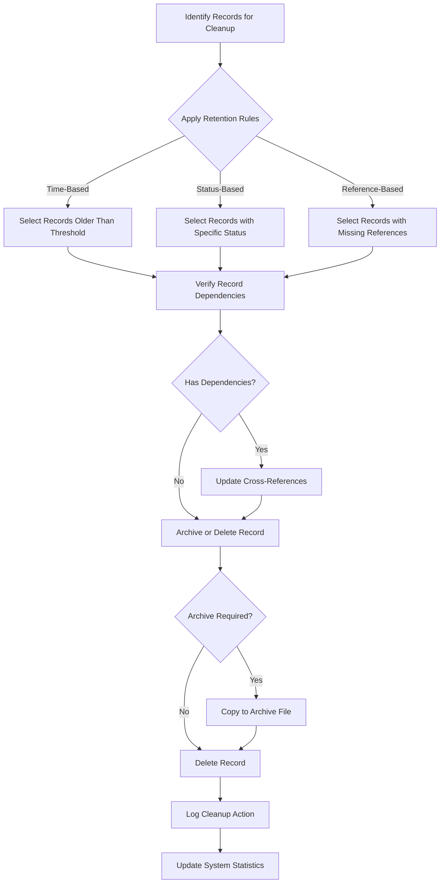
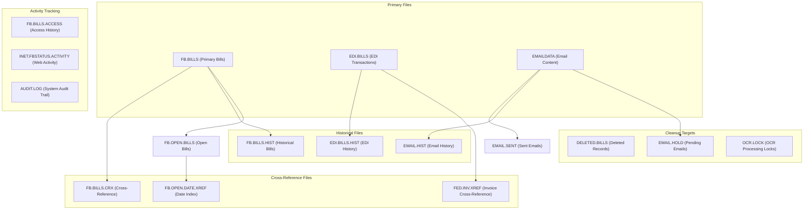

# Unprocessed Record Cleanup in AFS Shreveport

## Introduction to Unprocessed Record Cleanup

In the AFS Shreveport system, maintaining clean data is essential for optimal performance, accurate reporting, and efficient operations. Unprocessed record cleanup refers to the systematic identification and removal of outdated, duplicate, or unnecessary records that accumulate over time. These records can include freight bills that were never completed, EDI transactions that failed processing, email activity logs that are no longer relevant, and cross-reference entries that point to non-existent records. Without regular cleanup, these unprocessed records consume valuable storage space, slow down system queries, and potentially lead to data inconsistencies. The AFS Shreveport system implements various automated and manual cleanup processes to ensure data integrity while preserving necessary historical information for auditing and compliance purposes.

## Types of Records Requiring Cleanup

The AFS Shreveport system manages several types of records that require regular cleanup:

1. **Freight Bills** - Unprocessed or incomplete freight bills in FB.UNPROCESS, FB.BILLS, and FB.BILLS.HIST files that were abandoned during entry or failed validation.

2. **EDI Records** - Failed or duplicate Electronic Data Interchange (EDI) transactions in EDI.BILLS, EDI.BILLS.HIST, and EDI.FACK.HIST files that were not successfully processed.

3. **Email Activity Logs** - Email transmission records in INET.FBSTATUS.ACTIVITY, EMAIL.HIST, EMAIL.SENT, and EMAILDATA files that track system notifications and communications.

4. **Cross-Reference Files** - Orphaned entries in cross-reference files like FED.INV.XREF, FB.OPEN.DATE.XREF, and VEND.CUST.ZIPS that point to non-existent primary records.

5. **Audit Logs** - Historical audit trail entries in AUDIT.LOG that record user actions but are no longer needed for compliance.

6. **OCR Processing Data** - Optical Character Recognition temporary data and keyed image information that has been processed.

7. **Temporary Work Files** - Data in CLIENT.WORK, CLIENT.SLC, and other temporary files used during processing operations.

8. **Deleted Bill Records** - Information about deleted freight bills maintained in DELETED.BILLS for historical reference.

Each record type has specific cleanup requirements based on its business purpose, retention needs, and relationship to other system components.

## Record Cleanup Process Flow



The record cleanup process in AFS Shreveport follows a systematic workflow that begins with identifying records eligible for cleanup based on predefined criteria. The system applies retention rules that may be time-based (older than a specific date), status-based (records with particular flags), or reference-based (orphaned records). Before removing any record, the system verifies dependencies to maintain referential integrity. If dependencies exist, cross-references are updated accordingly. Records are then either archived to historical files for future reference or permanently deleted based on business requirements. Each cleanup action is logged for audit purposes, and system statistics are updated to reflect the changes.

## Time-Based Retention Policies

The AFS Shreveport system implements a sophisticated set of time-based retention policies that vary by record type, balancing operational efficiency with compliance requirements. These retention windows are carefully calibrated to ensure that data is kept long enough for business needs but removed when it becomes obsolete.

Email-related records have the shortest retention period, with INET.FBSTATUS.ACTIVITY and EMAIL.HIST files being purged after 60 days. This relatively short window reflects the transient nature of email notifications and their limited long-term value. The CLEAN.MAIL and CLEAN.FBACT utilities handle this cleanup process.

EDI acknowledgment history (EDI.FACK.HIST) and cross-reference files like FB.IEFA.XREF are maintained for 155-180 days, providing a longer window for troubleshooting EDI transmission issues while still preventing excessive accumulation. The CLEAN.EDI.FACK and CLEAN.INET.XREF utilities manage these cleanups.

Audit logs (AUDIT.LOG) are preserved for exactly 180 days, a timeframe that aligns with common compliance requirements for maintaining audit trails while preventing the logs from growing indefinitely. The AUDIT.LOG.CLEANUP utility enforces this retention policy.

UPS data in the UPSDATA file is retained for 90 days, balancing the need for tracking recent shipments with storage efficiency. The CLEAN.UPSDATA utility handles this cleanup.

For freight bills and related records, retention policies are more complex and often client-specific. The FB.2.8 program allows for selective deletion of unprocessed bills based on client and carrier criteria, while CLEAN.FB.UNPROCESS removes records with specific code patterns. Historical freight data in FB.BILLS.HIST may be archived rather than deleted, with the CLEAR.MULTI.LVL.FILE utility moving records older than specific dates (e.g., 01-01-16) to corresponding archive files.

These time-based retention policies are implemented through scheduled batch processes that run at regular intervals, ensuring consistent application of data management rules across the system.

## Client-Specific Cleanup Operations

The AFS Shreveport system implements specialized cleanup operations that respect the unique requirements of different client accounts. These client-specific cleanup processes ensure that data management practices align with contractual obligations, client preferences, and business relationships.

Traffic Survey clients, identified by client IDs starting with '99', receive special handling during cleanup operations. The FB.7.4.4 and FB.7.4.4.pb utilities are specifically designed for these clients, allowing authorized users to delete Traffic Survey bills based on spreadsheet input. These programs enforce strict validation to ensure that only Traffic Survey clients can utilize this functionality, preventing accidental deletion of regular client data.

For inactive clients, the system implements more aggressive cleanup strategies. The VOC.CLEAN.UP utility identifies and removes inactive clients (those with status 'I') from the VEND.CUST.EDI.XREF file, particularly focusing on clients with specific date ranges in field 82. This helps maintain system efficiency by removing references to clients that are no longer actively using the system.

The CLEAN.PPP.CLIENT script demonstrates another client-specific cleanup approach, targeting a particular client (01032) and clearing specific field data (CDAT<4>) from their PPP.CLIENT.BILLS records. This selective field clearing allows for targeted data maintenance without removing entire records.

The FIX.CLIENT utility provides a mechanism to remove client records from processing tables, particularly the FP_PROCESS item in the FB.TABLES file. This ensures that inactive or terminated clients are completely removed from ongoing processing operations.

Client-specific cleanup operations often require higher security privileges and additional confirmation steps compared to routine maintenance tasks. The FB.7.4.4 program, for example, requires users to explicitly type "I-UNDERSTAND" before proceeding with permanent deletion of bills, and it enforces that only authorized users can perform these operations on Traffic Survey clients.

These client-specific approaches allow AFS Shreveport to maintain appropriate data retention practices while respecting the varying needs of different client relationships.

## File Relationship Architecture



The AFS Shreveport system maintains a complex network of interrelated files that must be carefully managed during cleanup operations. At the core are primary files like FB.BILLS (freight bills), EDI.BILLS (EDI transactions), and EMAILDATA (email content), which store the main business data. These primary files are linked to historical repositories (FB.BILLS.HIST, EDI.BILLS.HIST, EMAIL.HIST) that maintain records after processing.

Cross-reference files create relationships between these primary files and other system components. FB.BILLS.CRX links freight bills to carriers and PRO numbers, FED.INV.XREF connects EDI transactions to invoices, and FB.OPEN.DATE.XREF indexes open bills by date. These cross-references are critical for system performance but require careful maintenance to prevent orphaned references.

Activity tracking files like FB.BILLS.ACCESS, INET.FBSTATUS.ACTIVITY, and AUDIT.LOG record user interactions and system events, creating temporal relationships between users and data records. These files grow continuously and require regular pruning based on retention policies.

Special-purpose files like DELETED.BILLS, EMAIL.HOLD, and OCR.LOCK serve specific operational functions and accumulate records that need periodic cleanup. The relationships between these files must be preserved during cleanup to maintain system integrity.

Understanding this architecture is essential for implementing effective cleanup strategies that maintain referential integrity across the system. When a record is removed from a primary file, all related entries in cross-reference and activity files must be appropriately handled to prevent orphaned references or incomplete audit trails.

## Cross-Reference Integrity Maintenance

Maintaining referential integrity across the AFS Shreveport system's interconnected files is a critical aspect of unprocessed record cleanup. When records are removed from primary files, their corresponding entries in cross-reference files must be appropriately handled to prevent orphaned references that could lead to system errors or data inconsistencies.

The system employs several strategies to maintain cross-reference integrity during cleanup operations. The FB.REBUILD.OPEN.DATE.XREF utility demonstrates a comprehensive approach by completely rebuilding cross-reference files from primary data. This utility first clears existing FB.OPEN.DATE.XREF files after warning users about potential disruptions, then systematically rebuilds these files by reading FB.OPEN.BILLS records, organizing them by client and processing date, and writing them to the appropriate cross-reference files. This rebuild approach ensures that all cross-references accurately reflect the current state of primary records.

For more targeted cleanup, utilities like CLEAN.FED.INV identify and remove orphaned records from the FED.INV.XREF file by checking if the referenced IDs exist in the FB.BILLS.CRX file. Records where no corresponding entries are found are deleted, maintaining the integrity of the cross-reference system. Similarly, the FIX.CHECK.PRO.XREF and FIX.WC.PRO.XREF scripts repair cross-references by correcting carrier and PRO number formats in cross-reference files.

The REMOVE.DUPS.FROM.VCZ utility demonstrates another aspect of cross-reference maintenance by identifying and eliminating duplicate vendor/customer pointers in VEND.CUST.ZIPS records. This prevents redundant references that could lead to processing inefficiencies or data inconsistencies.

When deleting records from primary files, the system often implements cascading deletions across related files. For example, the FB.2.8 program for deleting unprocessed bills removes records from multiple related files including FB.BILLS, FB.BILLS.HIST, FB.BILLS.CRX, and FB.OPEN.BILLS, and updates cross-reference files accordingly. This comprehensive approach ensures that no orphaned references remain after the primary record is removed.

The system also maintains audit trails of deleted records in the DELETED.BILLS file, preserving essential information about removed records for historical reference while still cleaning up the operational data stores. The CREATE.DELETED.BILLS.FILE and DELETE.BILL utilities manage this process, ensuring that deleted record information is properly preserved.

These cross-reference integrity maintenance strategies are essential for preventing data corruption and ensuring system reliability during cleanup operations.

## Archiving vs. Deletion Strategies

The AFS Shreveport system employs a nuanced approach to record cleanup, carefully balancing the need to remove obsolete data with requirements for historical record retention. The decision between archiving and permanent deletion is based on several factors including record type, age, business value, and compliance requirements.

For transient operational data with limited long-term value, the system typically implements direct deletion strategies. Email-related records in EMAIL.HIST, EMAIL.SENT, and EMAILDATA are completely removed after 60 days through the CLEAN.MAIL utility, as these records serve primarily as delivery confirmations rather than business-critical data. Similarly, OCR processing locks in OCR.LOCK are deleted when they become stale, as they have no historical significance once the processing is complete.

In contrast, business-critical records like freight bills undergo a more sophisticated lifecycle management process. The CLEAR.MULTI.LVL.FILE utility demonstrates an archiving approach where records older than a specified cutoff date (e.g., 01-01-16) are moved from active files like FB.BILLS.HIST to corresponding archive files with a .ARCH suffix before being deleted from the source. This preserves historical data in a separate storage location while keeping active files streamlined for optimal performance.

For audit and compliance purposes, the system maintains detailed records of deleted items. When freight bills are deleted through the FB.2.8 program, information about these deletions is logged to the DELETED.BILLS file, creating an audit trail that can be referenced if questions arise about removed records. The CREATE.DELETED.BILLS.FILE utility further enhances this process by organizing deleted bill records with standardized IDs based on carrier and PRO number information.

Some record types implement selective field clearing rather than complete record deletion. The CLEAN.PPP.CLIENT script demonstrates this approach by clearing specific fields (CDAT<4>) while preserving the overall record structure. This allows for targeted data cleanup while maintaining the record's existence in the system.

The system also employs different retention windows for different record types based on their business value and compliance requirements. Audit logs are retained for 180 days, EDI acknowledgments for 155-180 days, and email records for just 60 days, reflecting their varying importance for historical reference.

These nuanced archiving and deletion strategies ensure that the AFS Shreveport system maintains appropriate historical records for business and compliance purposes while still removing unnecessary data to optimize system performance.

## Cleanup Automation Timeline

```mermaid
gantt
    title Automated Cleanup Process Schedule
    dateFormat  HH:mm
    axisFormat %H:%M
    
    section Daily Processes
    Email Activity Cleanup (CLEAN.FBACT)      :daily1, 01:00, 30m
    Email Records Cleanup (CLEAN.MAIL)        :daily2, 01:30, 30m
    OCR Lock Cleanup (CLEAR.OCR.LOCK)         :daily3, 02:00, 30m
    
    section Weekly Processes
    EDI Acknowledgment Cleanup (CLEAN.EDI.FACK)    :weekly1, 00:00, 1h
    UPS Data Cleanup (CLEAN.UPSDATA)              :weekly2, after weekly1, 1h
    FB.UNPROCESS Cleanup                          :weekly3, after weekly2, 1h
    
    section Monthly Processes
    Audit Log Cleanup (AUDIT.LOG.CLEANUP)         :monthly1, 23:00, 2h
    Cross-Reference Rebuild (FB.REBUILD.OPEN.DATE.XREF) :monthly2, after monthly1, 3h
    
    section Quarterly Processes
    Historical Bill Archiving (CLEAR.MULTI.LVL.FILE) :quarterly1, 22:00, 4h
    Tag Block Cleanup (CLEAN.TAG.BLOCK)             :quarterly2, after quarterly1, 2h
    
    section Dependencies
    FB.BILLS.ACCESS Cleanup → Cross-Reference Rebuild : crit
    EDI Acknowledgment Cleanup → EDI Statistics Update : crit
    Historical Bill Archiving → System Backup : crit
```

The AFS Shreveport system implements a carefully orchestrated timeline of automated cleanup processes to maintain data integrity and system performance. These processes are scheduled at different frequencies based on the criticality and growth rate of the data they manage.

Daily cleanup processes focus on high-volume, transient data. The CLEAN.FBACT utility runs early each morning (1:00 AM) to remove email activity records older than 60 days from the INET.FBSTATUS.ACTIVITY file. This is followed by CLEAN.MAIL at 1:30 AM, which purges outdated records from EMAIL.HIST, EMAIL.SENT, and EMAILDATA files. The CLEAR.OCR.LOCK utility runs at 2:00 AM to identify and remove stale OCR processing locks, ensuring that hung processes don't block system operations the following day.

Weekly processes handle data that accumulates more slowly but still requires regular attention. EDI acknowledgment cleanup (CLEAN.EDI.FACK) runs at midnight on weekends, removing records older than 180 days from the EDI.FACK.HIST file. This is followed by UPS data cleanup (CLEAN.UPSDATA), which purges shipping records older than 90 days. The FB.UNPROCESS cleanup process runs afterward, removing unprocessed freight bills with specific code patterns.

Monthly maintenance addresses larger-scale system optimization. The AUDIT.LOG.CLEANUP utility runs at 11:00 PM on the first day of each month, removing audit records older than 180 days. This is followed by the FB.REBUILD.OPEN.DATE.XREF process, which rebuilds cross-reference files to ensure optimal system performance. These monthly processes are scheduled during off-hours to minimize impact on business operations.

Quarterly processes handle historical data archiving and specialized cleanup tasks. The CLEAR.MULTI.LVL.FILE utility archives and removes historical freight bills older than specified cutoff dates, while the CLEAN.TAG.BLOCK utility removes outdated entries from the FB.TAG.BLOCK database.

Critical dependencies exist between these processes. For example, FB.BILLS.ACCESS cleanup must complete before cross-reference rebuilding begins, and historical bill archiving must finish before system backups start to ensure that archived data is properly backed up. These dependencies are managed through scheduling and process monitoring to maintain system integrity throughout the cleanup cycle.

## Security and Access Controls

The AFS Shreveport system implements robust security measures to ensure that only authorized users can perform cleanup operations, protecting against accidental or malicious data loss. These security controls operate at multiple levels, from program access restrictions to validation checks and audit logging.

Program-level access control is the first line of defense. The FB.2.8 program for deleting unprocessed bills explicitly checks user credentials against the ACCESS.CONTROL record in the BCTRL file. Only users with specific permissions (ACCESS.CONTROL<11> or ACCESS.CONTROL<12>) can execute this program. If these permissions are not present, the system displays an error message: "You do not have access to this program. Please see data processing." This prevents unauthorized users from initiating deletion operations.

For specialized cleanup operations targeting specific client types, additional validation checks are implemented. The FB.7.4.4 program for deleting Traffic Survey bills verifies that the client ID starts with '99' (indicating a Traffic Survey client) before allowing deletion operations. If a user attempts to delete records for a non-Traffic Survey client, the system displays a clear error message: "NOT ALLOWED! This client is NOT A Traffic Survey client!" This prevents misapplication of specialized cleanup tools to standard client data.

The system also implements confirmation requirements for destructive operations. The FB.5.14 utility for deleting selected bills requires double confirmation with explicit "Are you sure?" and "Are you absolutely sure?" prompts before proceeding. Some utilities like FB.7.4.4 go further, requiring users to type a specific phrase ("I-UNDERSTAND") to confirm their intention to delete records permanently.

Environmental security checks prevent cleanup operations from running in inappropriate contexts. The CLEANUP.FBWORK utility verifies that it is running in the AFS account environment before proceeding, displaying an error message and notifying administrators if executed elsewhere: "THIS CAN ONLY BE RUN IN THE AFS ACCOUNT!"

For OCR-related cleanup operations, the FB.ZIP.LINE.ITEM.DELETE program checks the user's authorization flag (OP.FLG) in the OPERATOR file. Only users with the "Y" flag can access this functionality; others receive an "Access Denied!" message.

All cleanup operations are logged for audit purposes. Programs like FB.2.8 write detailed records to the DELETED.BILLS file, capturing information about what was deleted, when, and by whom. Many utilities also use the PROGTRACK function to log program execution start and end times, creating a comprehensive audit trail of cleanup activities.

These multilayered security controls ensure that cleanup operations are performed only by authorized users with appropriate permissions, protecting the integrity of the AFS Shreveport system's data.

## Performance Optimization Through Cleanup

Regular cleanup operations are essential for maintaining optimal performance in the AFS Shreveport system. As unprocessed records accumulate over time, they consume storage space, increase index sizes, and slow down database operations. Strategic cleanup processes address these issues, resulting in significant performance improvements across the system.

Database size reduction is a primary benefit of cleanup operations. The CLEAN.FB.BILLS.ACCESS utility, which removes records with access dates older than January 1, 2018, can significantly reduce the size of client-specific FB.BILLS.ACCESS files. Similarly, the CLEAN.INET.XREF utility removes outdated records from FB.IEFA.XREF, INET.FBESTIMATOR.ACTIVITY, and INET.FBSTATUS.ACTIVITY files, preventing unnecessary growth. By keeping these files streamlined, the system requires less storage space and can perform file operations more efficiently.

Query performance improves dramatically after cleanup operations. The FB.REBUILD.OPEN.DATE.XREF utility rebuilds cross-reference files used to track open freight bills by date, optimizing the structure for fast lookups. When these cross-references are properly maintained, queries that filter by date can use indexed lookups rather than full file scans, resulting in faster response times for users. Similarly, removing duplicate entries through utilities like REMOVE.DUPS.FROM.VCZ eliminates redundant processing during queries.

System startup and backup operations benefit from reduced file sizes. Smaller files require less time to load into memory during system initialization and less time to back up during maintenance windows. The CLEAN.TL.HIST utility, which removes historical truckload records older than a specified date, can significantly reduce the size of the TL.HIST file, making it faster to process during system operations.

Transaction processing throughput increases when temporary files are properly maintained. The CLEANUP.FBWORK utility removes unused port-specific files from the FBWORK directory, preventing accumulation of temporary data that could slow down email and notification processes. Similarly, the CLEAN.OCR.LOCK utility removes stale locks that might otherwise block OCR processing operations.

Memory utilization improves when unneeded records are removed from frequently accessed files. The CLEAN.TAG.BLOCK utility, which removes outdated entries from the FB.TAG.BLOCK database, reduces the memory footprint of this file during operations. This is particularly important for files that are frequently cached in memory for performance reasons.

The performance benefits of cleanup operations are often immediately noticeable to users, with reports of faster screen refreshes, quicker search results, and more responsive system behavior after maintenance. System administrators can monitor these improvements through tools like FB.SPEC.GB, which generates comprehensive statistics about file structures, record counts, and storage characteristics before and after cleanup operations.

## Audit Trail and Logging

The AFS Shreveport system maintains comprehensive audit trails of cleanup operations to ensure accountability, support troubleshooting, and meet compliance requirements. These audit mechanisms track what records were removed, when the removal occurred, who performed the action, and why the records were eligible for cleanup.

For freight bill deletions, the FB.2.8 program logs detailed information to the DELETED.BILLS file. Each deleted bill creates a record that includes the original bill ID, client information, carrier details, and deletion timestamp. This audit trail allows administrators to verify which bills were removed and when, providing essential information if questions arise about missing records. The CREATE.DELETED.BILLS.FILE utility enhances this logging by organizing deleted bill records with standardized IDs based on carrier and PRO number information, making the audit trail more searchable and useful.

Program execution tracking is implemented through the PROGTRACK subroutine, which many cleanup utilities call at the beginning and end of execution. For example, CLEAN.EDI.FACK, CLEAN.MAIL, and CLEAN.INET.XREF all use PROGTRACK to log when the program started, who ran it, which terminal was used, and when the process completed. This creates a timeline of cleanup activities that can be reviewed to understand system maintenance patterns and troubleshoot issues.

For specialized cleanup operations, additional logging captures the selection criteria used to identify records for removal. The CLEAN.FB.UNPROCESS script logs the specific code pattern ('[*2017]') used to identify records for deletion, while AUDIT.LOG.CLEANUP records the cutoff date (180 days before current date) used to determine which audit records to remove. This information is crucial for verifying that cleanup operations followed established retention policies.

The system also maintains counts of processed and deleted records as part of its audit trail. Most cleanup utilities display and log these counts upon completion, providing quantitative data about the scope of each cleanup operation. For example, CLEAN.MAIL reports separate counts for records deleted from EMAIL.HIST, EMAIL.SENT, EMAILDATA, and EMAIL.HOLD files, allowing administrators to track cleanup patterns over time.

For critical operations like rebuilding cross-reference files, the system implements progress logging during execution. The FB.REBUILD.OPEN.DATE.XREF utility displays detailed progress information including the current client being processed and the number of records handled, creating a real-time audit trail that can be monitored during execution.

These comprehensive audit mechanisms ensure that all cleanup operations are properly documented, supporting system governance, troubleshooting, and compliance requirements. The audit trails provide answers to key questions about what was removed, when, by whom, and why, maintaining accountability throughout the data lifecycle.

[Generated by the Sage AI expert workbench: 2025-05-28 08:06:15  https://sage-tech.ai/workbench]: #