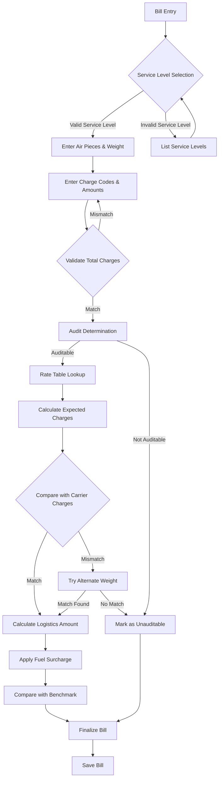
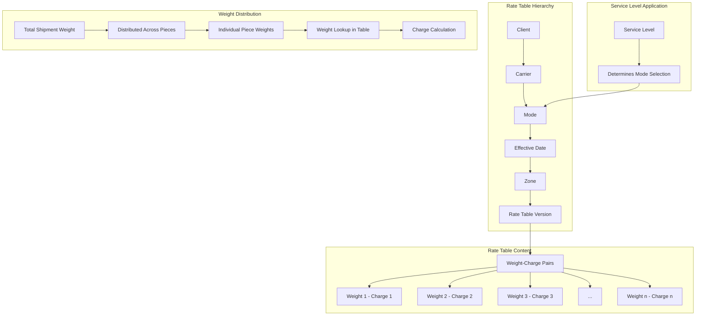
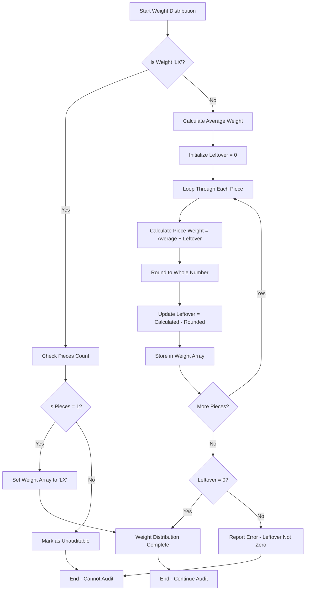
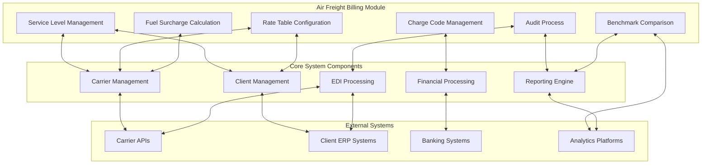

# Air Freight Billing in AFS Shreveport

## Introduction to Air Freight Billing

Air freight billing within AFS Shreveport serves as a specialized component of the freight management ecosystem, handling the unique requirements of air transportation logistics. Unlike other freight modes, air freight involves distinct service levels, specialized rate structures, and unique charge codes that must be carefully managed to ensure accurate billing and optimal cost management.

The air freight billing module supports critical business functions including carrier charge validation, logistics amount calculation for cost comparison, and fuel surcharge management. It enables clients to compare actual carrier charges against contracted rates, benchmark rates, and historical data. The system maintains detailed records of shipment characteristics including weight, dimensions, pieces, and service levels, which are essential for proper rate calculation and audit processes.

Air freight billing in AFS Shreveport is distinguished by its ability to handle the complex rate structures typical of air carriers, including dimensional weight calculations, minimum charges, and specialized accessorial charges. The module integrates with the broader freight management system to provide comprehensive reporting, financial processing, and electronic data interchange capabilities specific to air shipments.

## Service Level Management

The AFS Shreveport system implements a sophisticated approach to managing air service levels, which are critical identifiers that determine shipping speed, priority, and corresponding rate structures. Service level management consists of three interconnected components: base code maintenance, carrier-specific code cross-referencing, and service level selection during the billing process.

Base service level codes are maintained in a centralized table (`AIR.SERVLEV` in the FB.TABLES file) that defines standard service levels recognized by the system. These base codes serve as the foundation for all carrier-specific service level mappings. The system allows administrators to add, modify, and delete these base codes through the FB.20.3 program, ensuring that descriptions accurately reflect current service offerings.

Carrier-specific service level codes are managed through a cross-reference system (`AIR.SERVLEV*[CARRIER_ID]` records) that maps each carrier's proprietary service codes to the standardized base codes. This cross-referencing is critical because different carriers often use unique codes for similar services (e.g., "NDA" vs "1D" for next-day air). The FB.20.1 program provides an interface for maintaining these cross-references, allowing up to 72 service codes per carrier with corresponding descriptions and base code mappings.

During bill entry, the system presents carrier-specific service levels for selection, validating entries against the predefined codes. The selected service level directly impacts rate calculation by determining which rate table to use for the shipment. The system also supports service level overrides at the carrier profile level, allowing for client-specific service level defaults when needed.

This comprehensive service level management ensures consistency in billing practices while accommodating the diverse terminology used across different air carriers, facilitating accurate rate application and meaningful benchmark comparisons.

## Air Freight Billing Process Flow

The air freight billing process begins with bill entry, where users select the appropriate service level from carrier-specific codes. After entering shipment details including pieces and weight, the system captures charge codes (BASE, FUEL, MISC, etc.) and their corresponding amounts.

The system validates that total charges match the carrier's invoice amount before proceeding to audit. During audit, the bill date is verified against contract effective dates, and appropriate rate tables are selected based on service level, zone, and effective date.

For auditable bills, the system distributes weight across pieces and calculates expected charges using rate tables. If calculated charges match the carrier invoice, the bill passes audit; otherwise, the system may attempt alternate weight interpretations (actual vs. dimensional) before marking the bill as unauditable.

For auditable bills, the system calculates logistics amounts using benchmark carrier rates and applies appropriate fuel surcharges based on percentage rules and minimum charges. The final logistics amount represents the optimal cost for the shipment, which may be used for client billing depending on contractual arrangements.

Throughout this process, the system maintains detailed records of all calculations, validations, and decisions, providing a comprehensive audit trail for both internal and client-facing reporting.

## Rate Table Configuration

Air freight rate tables in AFS Shreveport are structured as hierarchical data sets that associate shipment weights with corresponding charges based on multiple parameters. These tables are created and maintained through the FB.AUDIT.2 program, which provides a specialized interface for defining the complex rate structures typical of air freight services.

Rate tables are organized according to several key parameters:
- Client ID: Identifies the specific client for whom the rates apply
- Carrier ID: Specifies the air carrier providing the service
- Mode: Defines the transportation mode (e.g., "AIR", "EXP", "STD")
- Date range: Establishes the effective period for the rates
- Zone: Designates geographic service areas or distance-based zones

Each rate table is stored in the FB.RATE.TABLES file using a composite key that combines these parameters (e.g., "CLIENT*CARRIER*MODE*DATE*ZONE*VERSION"). This structure allows the system to maintain multiple versions of rate tables for different time periods, accommodating rate changes over time.

Within each table, rates are organized as weight-charge pairs, where each weight value corresponds to a specific charge amount. The system supports both actual weight and dimensional weight calculations, with the ability to apply whichever yields the higher charge as per industry standards.

The rate table configuration process includes validation to ensure that all required weights are covered without gaps, preventing billing errors. Tables can be copied from existing ones to facilitate setup for similar carriers or when updating rates for new time periods.

For clients with benchmark carriers, the system maintains parallel rate tables for both the actual carrier and the benchmark carrier, enabling automatic comparison during the billing process. This dual-table approach supports sophisticated cost optimization strategies and variance reporting.

## Rate Table Structure

The rate table structure in AFS Shreveport follows a hierarchical organization that enables precise rate application based on multiple criteria. At the top level, tables are organized by client and carrier, allowing for client-specific negotiated rates. Within this framework, tables are further categorized by mode, effective date range, and zone.

Each rate table contains a series of weight-charge pairs arranged in ascending order by weight. During rate calculation, the system looks up the appropriate charge based on the shipment weight. For multi-piece shipments, the total weight is distributed across pieces, and charges are calculated for each piece individually before being summed.

The system supports both contract carrier rates and benchmark carrier rates, maintaining parallel table structures for each. This dual-table approach enables automatic comparison between actual carrier charges and benchmark rates, facilitating cost optimization decisions.

Rate tables include version control (typically indicated by a "1" suffix in the table name), allowing historical rates to be preserved while new rates are implemented. This versioning system supports historical billing accuracy and trend analysis.

The relationship between service levels and rate tables is managed through mode selection, where each service level corresponds to a specific mode used in rate table lookup. This connection ensures that the appropriate rates are applied based on the service level selected during bill entry.

The rate table structure is designed for flexibility, accommodating various pricing models including weight breaks, minimum charges, and dimensional factors common in air freight billing.

## Charge Code Management

Air freight charge codes in the AFS Shreveport system serve as standardized identifiers for different components of the total freight bill. These codes categorize charges by type, enabling consistent processing, reporting, and analysis across all air shipments. The system maintains these codes in the FB.TABLES file under the 'AIR.CODES' key, with each code having a corresponding description.

The primary charge codes include:

1. **BASE** - The fundamental transportation charge calculated from rate tables based on weight and service level. This code is mandatory for all air freight bills and typically represents the largest portion of the total charge. The system enforces validation to ensure BASE charges are never negative.

2. **FUEL** - Fuel surcharges applied as a percentage of the base charge, subject to minimum amounts. These are calculated automatically during the audit process based on date-specific fuel surcharge percentages maintained in carrier profiles.

3. **MISC** - Miscellaneous charges that don't fit other categories. When this code is used, the system requires additional documentation in the form of a reason description, ensuring proper justification for these charges.

4. **BYD** - Beyond charges for deliveries outside standard service areas, requiring special handling or additional transportation.

5. **DIM** - Dimensional weight charges applied when the dimensional weight exceeds actual weight, calculated using carrier-specific dimensional factors.

The system enforces several validation rules for charge codes:
- The BASE code must always have a value greater than or equal to zero
- The total of all charges must match the carrier's invoice amount
- When using the MISC code, a reason must be provided
- Certain codes may require corresponding accessorial codes in the carrier profile

During bill entry, the FB.2.1.AIR.FREIGHT subroutine manages these charge codes, allowing users to add, modify, or delete charge lines. The system automatically recalculates the BASE charge when accessorial charges are modified, ensuring the total matches the carrier invoice amount.

This structured approach to charge code management enables detailed cost analysis, accurate auditing, and consistent reporting across all air freight shipments.

## Audit Process

The air freight audit process in AFS Shreveport is a systematic validation of carrier charges against contracted rate tables to determine billing accuracy. This process begins during bill entry when the FB.2.1.AUDIT.AIRBRN subroutine is invoked to evaluate whether a bill can be properly audited.

First, the system validates the bill date against carrier contract effective dates to ensure that appropriate rate tables exist for the shipment period. If the bill date falls outside any valid contract period, the bill is immediately marked as unauditable.

For bills with valid dates, the system identifies the appropriate rate table based on client ID, carrier ID, mode (derived from service level), effective date, and zone. The audit process then distributes the total shipment weight across the number of pieces, creating a weight array that represents each piece's weight.

Using this weight array, the system performs rate table lookups to determine the expected charge for each piece. These individual charges are summed to calculate the total expected base charge. The system also calculates applicable fuel surcharges based on date-specific percentage rules and minimum charge thresholds stored in the carrier profile.

The calculated total (base charge + fuel surcharge + miscellaneous charges) is then compared against the carrier's invoiced amount. If they match, the bill passes audit and is marked auditable ('Y'). If they don't match, the system may attempt alternate weight interpretations (e.g., trying both actual weight and 'LX' letter express weight) before ultimately marking the bill as unauditable ('U') if no match is found.

For auditable bills, the system proceeds to calculate the logistics amount using benchmark carrier rates, applying the same process but with benchmark rate tables. This logistics amount represents the optimal cost for the shipment and may be used for client billing depending on contractual arrangements.

The audit process creates a comprehensive audit trail, recording all calculations, validations, and decisions made during the audit. This information supports both internal quality control and client-facing reporting on audit effectiveness and savings.

## Weight Distribution Algorithm

The weight distribution algorithm in AFS Shreveport is a critical component of the air freight billing process, ensuring that total shipment weight is appropriately allocated across multiple pieces for accurate rate calculation. This algorithm handles both standard weight distribution and special cases like letter express shipments.

When processing a shipment with multiple pieces, the system must determine how to distribute the total weight to calculate charges correctly. The algorithm begins by checking if the weight is designated as 'LX' (letter express), which is a special case. For LX shipments, the system verifies that only one piece is present, as multiple-piece LX shipments cannot be properly audited.

For standard weight shipments, the algorithm calculates the average weight per piece by dividing the total weight by the number of pieces. Since air freight rates typically require whole-number weights, the system must handle rounding appropriately while ensuring the sum of individual piece weights equals the total shipment weight.

The distribution process works as follows:
1. Calculate the average weight per piece (total weight ÷ number of pieces)
2. Initialize a "leftover" variable to track fractional weight
3. For each piece:
   - Add the current leftover to the average weight
   - Round to the nearest whole number for the piece weight
   - Calculate new leftover (difference between calculated and rounded weight)
   - Store the rounded weight in the weight array
4. Verify that the leftover is zero after processing all pieces

This approach ensures that weight is distributed as evenly as possible across all pieces while maintaining whole-number weights and preserving the total shipment weight. The algorithm includes validation to confirm that the leftover value is zero after processing all pieces, reporting an error if any weight remains unallocated.

The resulting weight array is then used for rate table lookups, with each piece's weight corresponding to a specific charge in the rate table. This piece-by-piece calculation approach accurately reflects how air carriers typically calculate charges for multi-piece shipments.

## Fuel Surcharge Calculation

Fuel surcharge calculation in the AFS Shreveport air freight billing system is a dynamic process that applies percentage-based surcharges to base transportation charges according to date-specific rules. This component of the billing process ensures that fluctuating fuel costs are accurately reflected in freight bills while adhering to carrier-specific surcharge policies.

The system maintains fuel surcharge data in carrier profiles, storing multiple date ranges with corresponding percentage values and minimum charge thresholds. During the audit process, the system identifies the appropriate fuel surcharge percentage by comparing the bill date against these date ranges. If the bill date falls outside any defined date range, no fuel surcharge is applied.

Once the applicable percentage is determined, the calculation proceeds as follows:

1. The base transportation charge is multiplied by the fuel surcharge percentage (stored as basis points, e.g., 1000 = 10.00%)
2. The result is divided by 10000 to convert to a dollar amount
3. This calculated amount is compared against the minimum fuel surcharge threshold
4. If the calculated amount is less than the minimum threshold, the minimum amount is used instead

For example, if a shipment has a base charge of $100, a fuel surcharge percentage of 1500 (15.00%), and a minimum threshold of $10:
- Calculated surcharge: $100 × 15.00% = $15.00
- Since $15.00 exceeds the $10 minimum, the $15.00 surcharge is applied

The system applies this calculation separately for both contract carrier charges and benchmark carrier charges, as fuel surcharge percentages and minimums may differ between carriers. This dual calculation ensures accurate comparison between actual and benchmark costs.

The fuel surcharge calculation is fully automated during the audit process, eliminating manual calculations and ensuring consistent application of surcharge rules. The system maintains a historical record of applied fuel surcharges, supporting analysis of fuel cost impacts over time and providing transparency in client billing.

## Benchmark Comparison

The benchmark comparison process in AFS Shreveport's air freight billing system is a sophisticated cost optimization mechanism that evaluates actual carrier charges against theoretical "best case" rates from designated benchmark carriers. This comparison enables clients to understand potential cost savings and supports strategic carrier selection decisions.

For each client-carrier relationship, the system maintains a benchmark carrier designation in the carrier profile. This benchmark carrier represents an alternative service provider whose rates serve as a cost baseline for comparison. The system maintains parallel rate tables for both the actual carrier and the benchmark carrier, enabling automated comparison during the billing process.

When a bill successfully passes audit, the system proceeds to calculate the logistics amount using the following process:

1. The system identifies the appropriate benchmark rate table based on client ID, benchmark carrier ID, mode, effective date, and zone
2. Using the same weight distribution as the actual bill, the system performs rate table lookups to determine the expected benchmark charge for each piece
3. These individual benchmark charges are summed to calculate the total benchmark base charge
4. Applicable fuel surcharges are calculated using the benchmark carrier's fuel surcharge percentages and minimums
5. The total benchmark amount (base charge + fuel surcharge + miscellaneous charges) is determined

Once both the actual carrier charge and benchmark logistics amount are calculated, the system applies the following logic to determine the final logistics amount:
- If the actual carrier charge is less than or equal to the benchmark amount, the actual carrier charge becomes the logistics amount
- If the benchmark amount is less than the actual carrier charge, the benchmark amount becomes the logistics amount

This approach ensures that clients always receive the benefit of the lower rate, whether it comes from their actual carrier or the theoretical benchmark. The logistics amount may be used for client billing depending on contractual arrangements, potentially generating savings when the benchmark amount is lower than the actual carrier charge.

The benchmark comparison process provides valuable data for analytics, enabling clients to evaluate carrier performance against market standards and identify opportunities for rate negotiation or carrier changes. The system maintains detailed records of both actual and benchmark calculations, supporting comprehensive reporting on potential and realized savings.

## System Integration Points

The air freight billing module in AFS Shreveport integrates with numerous other system components and external systems to provide comprehensive freight management capabilities. These integration points ensure seamless data flow, consistent processing, and comprehensive reporting across the entire platform.

**Core System Integration:**
- **Client Management**: Air freight billing draws client-specific configurations including contract terms, benchmark carriers, and billing preferences from the client management module. It also updates client records with billing history and performance metrics.
- **Carrier Management**: Service level codes, rate tables, and fuel surcharge percentages are maintained in carrier profiles, ensuring consistent application across all shipments for a given carrier.
- **EDI Processing**: The system supports electronic data interchange for air freight bills, allowing automated receipt of carrier invoices and transmission of payment information through standardized formats.
- **Financial Processing**: Completed air freight bills flow into the financial module for payment processing, accrual management, and general ledger integration, with appropriate coding for expense allocation.
- **Document Management**: Air waybills and supporting documentation are linked to freight bills through the imaging system, providing easy access to verification documents during audit and inquiry.

**External System Integration:**
- **Carrier APIs**: The system can connect to carrier systems for real-time rate quoting, tracking information, and electronic invoice receipt, reducing manual data entry.
- **Client ERP Systems**: Processed air freight data can be exported to client enterprise resource planning systems for cost allocation and financial reporting.
- **Analytics Platforms**: Detailed air freight billing data feeds into analytics tools like QlikView for performance reporting, trend analysis, and cost optimization.
- **Banking Systems**: Payment information for audited air freight bills integrates with banking platforms for electronic funds transfer and payment reconciliation.

**Data Exchange Mechanisms:**
- **File-based Integration**: The system supports scheduled import/export of CSV, XML, and fixed-width files for batch processing of air freight data.
- **API Connectivity**: Real-time integration with carrier systems and client platforms through RESTful APIs enables immediate data exchange.
- **Database Synchronization**: Direct database connections allow for efficient data transfer between AFS Shreveport and other systems in the logistics ecosystem.

These integration points ensure that air freight billing operates as part of a cohesive freight management solution, with data flowing seamlessly between modules and external systems to support end-to-end logistics operations.

## Future Enhancements

The air freight billing module in AFS Shreveport, while comprehensive in its current form, has several opportunities for enhancement to address evolving business requirements and technological advancements. Based on analysis of the current implementation, the following improvements could significantly enhance functionality and user experience:

**Advanced Rate Structure Support**
The current system handles basic weight-based rate tables effectively, but could be enhanced to support more complex rate structures including:
- Tiered dimensional factors that vary by weight range
- Automated handling of special rating areas beyond simple zones
- Dynamic minimum charges that adjust based on shipment characteristics
- Support for combination rates that blend weight breaks with flat fees

**Improved Audit Intelligence**
The audit process could be enhanced with machine learning capabilities to:
- Predict audit outcomes based on historical patterns
- Automatically suggest weight adjustments when audit fails
- Identify potential carrier billing errors through pattern recognition
- Implement self-learning algorithms that improve audit accuracy over time

**Enhanced Benchmark Analysis**
The benchmark comparison functionality could be expanded to:
- Compare against multiple benchmark carriers simultaneously
- Incorporate real-time market rate data for dynamic benchmarking
- Provide predictive analytics for optimal carrier selection
- Generate automated recommendations for carrier negotiations

**User Experience Improvements**
The interface could be modernized to:
- Implement a web-based interface for rate table maintenance
- Provide visual representations of rate comparisons and audit results
- Offer drag-and-drop functionality for rate table creation
- Include interactive dashboards for monitoring air freight performance

**Integration Enhancements**
System integration could be strengthened by:
- Developing direct API connections to major air carriers
- Implementing real-time tracking integration within the billing interface
- Creating mobile applications for on-the-go rate lookups and approvals
- Establishing blockchain-based verification for air freight transactions

**Sustainability Features**
As environmental concerns become increasingly important:
- Add carbon footprint calculation and reporting
- Implement optimization algorithms that consider both cost and environmental impact
- Provide options for carbon offset programs integrated with billing
- Generate sustainability reports for environmentally conscious clients

These enhancements would address current limitations while positioning the air freight billing module to meet future challenges in the rapidly evolving logistics industry. By focusing on advanced rate structures, intelligent auditing, enhanced benchmarking, improved user experience, stronger integration, and sustainability features, AFS Shreveport can maintain its competitive edge in freight management solutions.

[Generated by the Sage AI expert workbench: 2025-05-28 08:06:18  https://sage-tech.ai/workbench]: #