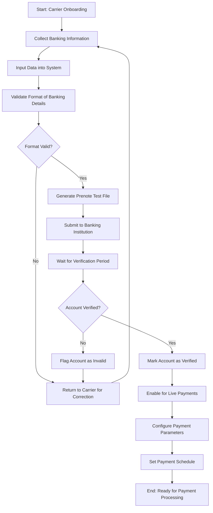
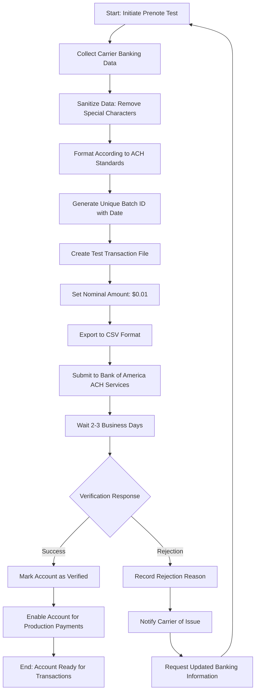
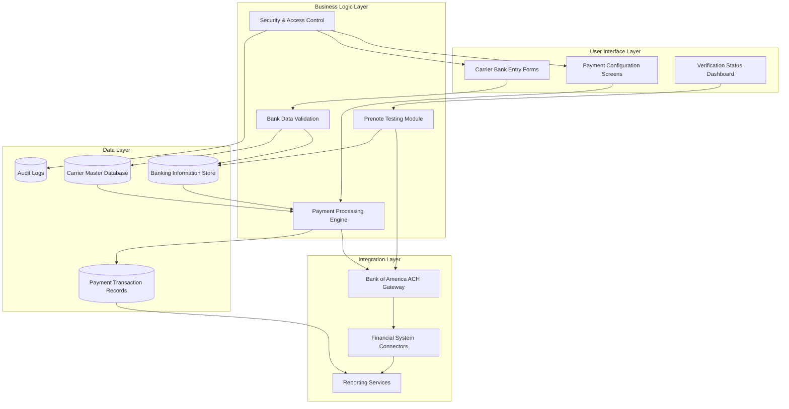

# Carrier Bank Configuration in AFS Shreveport

## Introduction to Carrier Bank Configuration

Carrier bank configuration in AFS Shreveport serves as the financial backbone for the freight logistics payment ecosystem. This critical component manages the setup, validation, and maintenance of banking information for carriers, enabling secure and accurate electronic fund transfers. The system acts as an intermediary between AFS's freight billing operations and financial institutions, ensuring that carriers receive timely payments while maintaining compliance with banking regulations. By centralizing carrier banking data, the platform facilitates streamlined payment processing, reduces manual intervention, and provides a secure framework for handling sensitive financial information. The configuration system supports various payment methods with a primary focus on Automated Clearing House (ACH) transactions, which require precise formatting and validation to ensure successful processing through the banking network.

## Bank Account Verification Process

The bank account verification process in AFS Shreveport employs prenote testing as a critical safeguard before initiating actual financial transactions. Prenote testing involves sending a zero-dollar or minimal-value test transaction through the ACH network to verify the validity of carrier banking information. The system begins by collecting essential carrier data including identification numbers, business names, routing numbers, and account numbers. This information undergoes rigorous validation checks to ensure accuracy and compliance with banking standards. The prenote file is then formatted according to ACH specifications and transmitted to the financial institution. During a holding period (typically 2-3 business days), the banking system attempts to process the test transaction, returning verification status or rejection notices for invalid accounts. Only after successful prenote verification is a carrier's banking information flagged as validated in the system, allowing actual payments to proceed. This methodical approach significantly reduces payment failures, returned transactions, and associated fees while establishing a secure foundation for the payment relationship between AFS and its carriers.

## Carrier Bank Configuration Workflow

The carrier bank configuration workflow illustrates the end-to-end process for establishing and validating carrier payment channels in AFS Shreveport. The process begins during carrier onboarding, where banking information is collected and entered into the system. The workflow incorporates multiple validation checkpoints to ensure data accuracy before any financial transactions occur. A critical component is the prenote testing phase, where test transactions verify the validity of routing and account numbers through the banking network. The system implements a waiting period for verification responses before enabling accounts for live payments. This structured approach minimizes payment failures while establishing a secure foundation for ongoing financial transactions with carriers. The workflow also accommodates the configuration of carrier-specific payment parameters, including payment schedules and methods, creating a comprehensive framework for managing the financial relationship between AFS and its transportation partners.

## ACH Processing and Standards

Automated Clearing House (ACH) processing in AFS Shreveport adheres to the National Automated Clearing House Association (NACHA) standards, providing a secure and standardized framework for electronic funds transfers between AFS and carriers. The system implements the ACH network's batch processing model, where payment instructions are collected, formatted according to strict specifications, and transmitted to financial institutions in scheduled intervals. Each ACH record contains mandatory fields including routing numbers, account numbers, transaction codes, and dollar amounts, all formatted according to NACHA's fixed-length record specifications. The platform supports both credit (payment) and debit (collection) transactions, though carrier payments primarily utilize the credit mechanism. The implementation includes support for various ACH Standard Entry Class (SEC) codes, particularly CCD (Corporate Credit or Debit) for business-to-business transactions. The system manages the required header and trailer records that encapsulate payment batches, ensuring proper batch balancing and transaction counting. Additionally, the platform handles ACH return codes, enabling automated responses to rejected transactions based on specific error conditions. By strictly adhering to these standards, AFS Shreveport ensures high acceptance rates for carrier payments while maintaining compliance with financial regulations governing electronic fund transfers.

## Data Validation and Security

Data validation and security for carrier banking information in AFS Shreveport employs a multi-layered approach to protect sensitive financial data while ensuring transaction accuracy. The system implements comprehensive validation routines that verify routing numbers against the Federal Reserve's ABA database, confirming both the format (nine digits) and the validity of the financial institution. Account number validation includes format checks specific to each banking institution's requirements, though full validation ultimately occurs through the prenote testing process. The platform enforces strict data sanitization protocols, removing special characters, spaces, and non-alphanumeric symbols that could interfere with transaction processing. Security measures include encryption of banking data both at rest and in transit, with database-level encryption protecting stored financial information. Access to banking details is strictly controlled through role-based permissions, limiting visibility to authorized personnel in finance and administration roles. The system maintains detailed audit logs of all access and modifications to banking information, creating an unalterable record of changes for compliance and security purposes. Additionally, the platform implements data masking for account numbers in reports and user interfaces, displaying only the last four digits in most contexts to prevent unauthorized exposure. These comprehensive measures work in concert to maintain the integrity and confidentiality of carrier banking information throughout the payment lifecycle.

## Prenote Testing Process

The prenote testing process diagram illustrates the systematic approach used by AFS Shreveport to verify carrier banking information before initiating actual financial transactions. The process begins with the collection and sanitization of carrier banking data, removing special characters and formatting issues that could cause transaction failures. The system then formats this information according to ACH standards and generates a unique batch identifier that includes date information to prevent file conflicts. A key characteristic of prenote testing is the use of a nominal amount ($0.01) that allows verification without significant financial impact. After the file is created in the required CSV format, it's submitted to Bank of America's ACH services for processing through the banking network. The system then enters a waiting period of 2-3 business days for verification responses from the financial institutions. Based on these responses, accounts are either marked as verified and enabled for production payments or flagged with specific rejection reasons. For rejected accounts, the process initiates a notification workflow to alert carriers and collect corrected information, creating a feedback loop until verification succeeds. This methodical approach ensures payment accuracy while minimizing the risk of transaction failures in the production environment.

## Role-Based Access Control

Role-based access control for carrier bank configuration in AFS Shreveport implements a stringent security framework that restricts access to sensitive financial information based on job responsibilities and organizational hierarchy. The system defines specific roles with carefully calibrated permissions, ensuring that users can only access the banking functions necessary for their job duties. Financial administrators receive the highest level of access, with capabilities to add, modify, and delete banking information, while accounting staff may have view-only access to support reconciliation processes. The platform enforces separation of duties by requiring different individuals to initiate and approve changes to banking details, preventing potential fraud through a dual-control mechanism. System administrators maintain the role definitions and user assignments but cannot directly access or modify banking information without proper authorization. The access control system integrates with the application's authentication framework, requiring additional verification steps (such as secondary passwords or approval workflows) for sensitive banking operations. User activity related to banking information is comprehensively logged, creating an audit trail that records all access attempts, successful modifications, and even view-only interactions. Regular access reviews ensure that permissions remain appropriate as staff roles change, with automatic revocation of access when employees change positions or leave the organization. This comprehensive approach to access control significantly reduces the risk of unauthorized access to sensitive carrier financial information while maintaining operational efficiency.

## Data Sanitization for Banking Systems

Data sanitization for banking systems in AFS Shreveport implements rigorous cleansing protocols to ensure carrier financial information meets the strict formatting requirements of ACH processing systems. The platform employs multiple sanitization layers that systematically remove or transform problematic characters that could cause transaction rejections. Special characters including commas, hyphens, slashes, and quotation marks are automatically stripped from carrier names and other text fields to prevent parsing errors in banking systems. The sanitization process enforces field length restrictions, truncating carrier names to the 22-character limit required by ACH specifications while preserving the most relevant identifying information. Numeric fields undergo format validation to ensure they contain only digits, with routing numbers verified against the nine-digit standard and account numbers checked for institution-specific patterns. The system implements whitespace normalization, removing leading, trailing, and excessive internal spaces that could affect field alignment in fixed-width banking formats. For international transactions, the platform handles character set conversions, ensuring that non-ASCII characters are properly transliterated or removed to maintain compatibility with banking systems that support limited character sets. These comprehensive sanitization procedures occur automatically during data entry and file generation processes, creating a consistent and reliable data stream that minimizes transaction failures due to formatting issues while maintaining the integrity of the carrier identification information.

## Carrier Payment System Architecture

The carrier payment system architecture diagram illustrates the comprehensive structure supporting bank configuration and payment processing in AFS Shreveport. The architecture employs a layered approach that separates user interface components from business logic, data storage, and integration services. In the user interface layer, specialized forms and dashboards provide controlled access to banking configuration and verification status. The business logic layer contains the core components that validate banking data, manage prenote testing, process payments, and enforce security policies. The data layer implements segregated storage for sensitive information, with the banking information store utilizing enhanced encryption compared to standard carrier data. The integration layer connects the system to external financial services, particularly the Bank of America ACH gateway that processes electronic payments. Data flows through defined pathways with appropriate validation and transformation at each step, ensuring information integrity throughout the payment lifecycle. Security controls span all layers, with particular emphasis on protecting the sensitive data stores and controlling access to configuration interfaces. This architecture supports both the initial configuration of carrier banking information and the ongoing payment operations, providing a secure and efficient framework for financial transactions between AFS and its transportation partners.

## Batch Processing and File Management

Batch processing and file management for carrier payments in AFS Shreveport implements a structured approach to handling financial transactions at scale. The system organizes payment transactions into logical batches based on configurable criteria including payment date, carrier groups, or payment thresholds. Each batch receives a unique identifier incorporating date elements and sequential numbering to prevent conflicts and facilitate tracking. The platform implements a comprehensive file naming convention that encodes critical metadata directly in filenames, such as the "PN_ACH" prefix for prenote files followed by date information and sequence numbers. This convention enables quick identification of file types and processing dates without examining file contents. The system manages file lifecycle stages from creation through transmission, acknowledgment, and archiving, with status tracking at each phase. For prenote testing specifically, the platform generates CSV-formatted files containing the minimal required fields for account verification, while production payment files include full transaction details according to ACH specifications. The file management system implements collision detection and prevention mechanisms, automatically incrementing sequence numbers when existing filenames are detected. After processing, files are systematically archived according to retention policies, with sensitive financial files subject to enhanced security measures and longer retention periods than standard operational files. This comprehensive approach to batch processing and file management ensures reliable, traceable financial transactions while maintaining the organization and security of payment information throughout its lifecycle.

## Integration with Financial Systems

Integration with financial systems in AFS Shreveport creates seamless connections between the carrier payment framework and external banking platforms, particularly Bank of America's ACH services. The integration architecture employs a combination of file-based exchanges and API connections, adapting to the capabilities of each financial partner. For Bank of America integration, the system generates ACH files in the required NACHA format and transmits them through secure channels including SFTP and dedicated financial networks. The platform implements comprehensive reconciliation processes that match outgoing payment instructions against bank-provided confirmation reports, automatically identifying and flagging discrepancies for investigation. Transaction status updates flow back into the system through automated import processes, updating payment records with confirmation numbers and settlement dates. The integration framework supports both batch processing for standard payment runs and real-time interfaces for urgent transactions and account verification services. Error handling protocols automatically process rejection notifications, updating payment statuses and triggering appropriate workflows for resolution. The system maintains configuration profiles for each financial institution, storing connection parameters, formatting requirements, and authentication credentials in a secure, centralized repository. This flexible integration approach allows AFS Shreveport to maintain consistent internal payment processes while adapting to the specific requirements of different financial partners, ensuring reliable funds transfer while minimizing manual intervention in the payment lifecycle.

## Audit and Compliance Considerations

Audit and compliance considerations for carrier bank configuration in AFS Shreveport establish a comprehensive framework for maintaining regulatory adherence and financial integrity. The system implements detailed audit trails that record all interactions with banking information, capturing the user, timestamp, action type, and specific data elements modified. These audit records are stored in tamper-evident logs separate from the operational database, ensuring their integrity for compliance verification. The platform enforces regulatory requirements including those from NACHA for ACH transactions, maintaining current rule implementations as regulations evolve. For payment security, the system adheres to PCI DSS guidelines even though carrier payments typically fall outside direct cardholder data environments, applying these rigorous security standards as best practices for all financial information. The compliance framework includes automated monitoring for suspicious patterns such as unusual changes to banking details or multiple failed verification attempts, triggering alerts for potential fraud investigation. Regular compliance reports document adherence to internal policies and external regulations, providing evidence for auditors and regulatory examinations. The system supports configurable retention policies for financial records, automatically archiving transaction data according to regulatory requirements while maintaining accessibility for audit purposes. Additionally, the platform implements separation of duties through workflow approvals for critical banking changes, creating verification checkpoints that satisfy internal control requirements. This comprehensive approach to audit and compliance ensures that carrier payment operations maintain regulatory adherence while providing the transparency necessary for effective financial governance.

[Generated by the Sage AI expert workbench: 2025-05-28 08:06:21  https://sage-tech.ai/workbench]: #