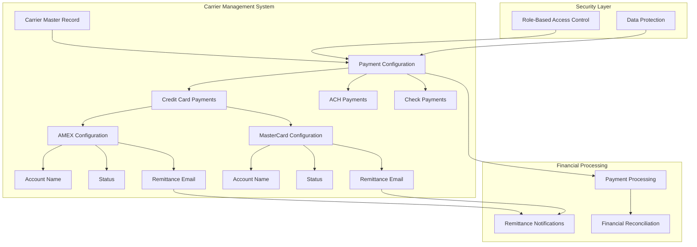
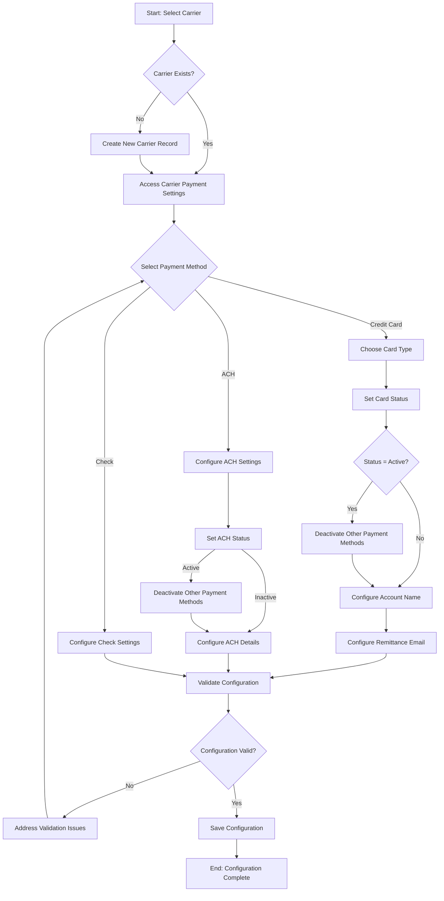
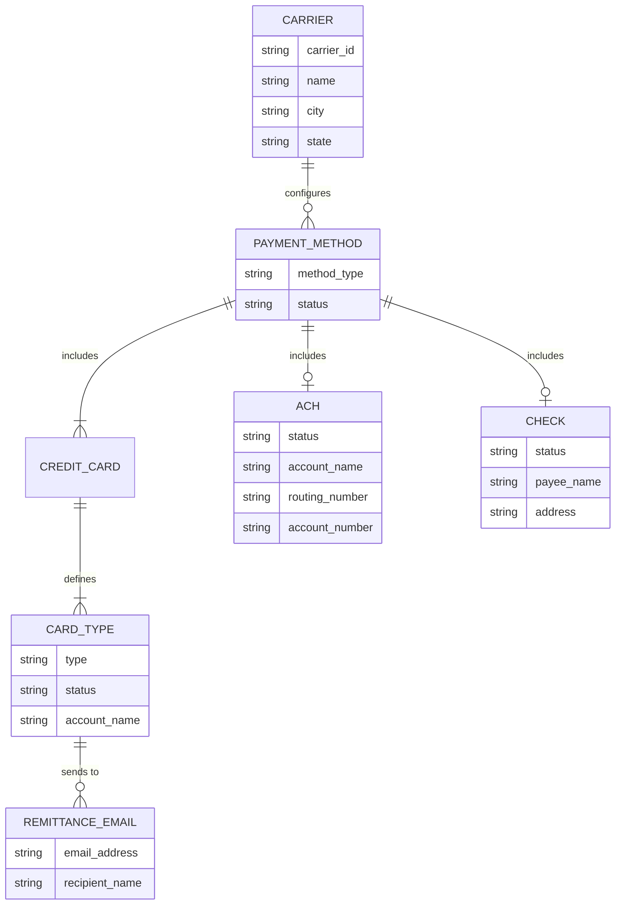

# Carrier Payment Configuration in AFS Shreveport

## Overview of Carrier Payment Configuration

The carrier payment configuration system in AFS Shreveport serves as a critical component for managing financial transactions between the logistics platform and its carrier partners. This system enables administrators to establish, maintain, and control various payment methods for carriers, ensuring proper financial transactions throughout the freight billing lifecycle. The configuration framework supports multiple payment types including credit cards (American Express and MasterCard), ACH transfers, and traditional checks, with built-in mechanisms to prevent conflicting payment setups. By centralizing carrier payment settings, the system provides a structured approach to financial operations, enhancing both security and efficiency in the payment processing workflow.

## Carrier Payment Configuration Architecture

The architecture diagram illustrates how carrier payment settings are structured within the AFS Shreveport system. The payment configuration module is directly linked to the carrier master record, allowing for carrier-specific payment setups. The system maintains separate configurations for different payment methods, with particular emphasis on credit card payments that include both American Express and MasterCard options. Each payment method stores essential information such as account names, status (active/inactive), and remittance email addresses. The payment configuration feeds into the financial processing subsystem, which handles payment processing, remittance notifications, and financial reconciliation. A security layer with role-based access control and data protection mechanisms safeguards the sensitive financial information throughout the system.

## Credit Card Payment Setup

The credit card payment setup in AFS Shreveport provides a structured approach to configuring carrier payments via American Express and MasterCard. The system maintains dedicated attribute fields (124-129) for storing credit card configuration data, ensuring this information remains protected during carrier synchronization processes. For each carrier, administrators can configure card-specific details including an active/inactive status flag, account name, and remittance email addresses. The account naming feature allows for proper identification of the payment account, which is particularly important when carriers maintain multiple credit card accounts. The implementation supports a clear separation between different card types, with American Express using attributes 124-126 and MasterCard using attributes 127-129, providing a consistent data structure while maintaining the flexibility to handle different card processing requirements.

## Payment Method Exclusivity

The AFS Shreveport system implements a robust payment method exclusivity mechanism to prevent conflicting payment configurations. When an administrator activates a specific payment method for a carrier, the system automatically deactivates alternative payment methods to ensure only one payment channel is active at any given time. This automatic deactivation process is particularly evident in the credit card configuration module, where activating either American Express or MasterCard automatically sets the other card type to inactive. Similarly, when activating a credit card payment method, any configured ACH payment method (stored in attribute 102) is automatically deactivated. This exclusivity enforcement prevents potential payment processing errors and financial inconsistencies that could arise from having multiple active payment methods, streamlining the payment workflow and reducing the risk of duplicate payments or processing conflicts.

## Payment Configuration Workflow

The payment configuration workflow in AFS Shreveport follows a structured process from carrier selection through configuration validation and implementation. The process begins with selecting or creating a carrier record, then accessing the payment settings interface. Administrators choose a payment method (credit card, ACH, or check), with credit card configuration requiring additional steps to select the card type (American Express or MasterCard). When setting a payment method to active status, the system automatically deactivates other payment methods to maintain exclusivity. For credit cards, administrators must configure the account name and remittance email addresses. The system validates all configurations before saving, checking for required fields and proper formatting, especially for email addresses. If validation issues are found, administrators must address them before proceeding. Once validated, the configuration is saved and becomes immediately effective for payment processing operations.

## Remittance Email Configuration

The remittance email configuration feature in AFS Shreveport enables administrators to specify where payment notifications and remittance information should be sent for each carrier's payment method. This functionality is particularly important for credit card payments, where remittance details need to reach the appropriate financial personnel at the carrier organization. The system supports multiple recipient email addresses, allowing carriers to distribute payment information to various stakeholders simultaneously. Email addresses are stored as value-marked lists within the carrier record, with semicolons used as separators in the user interface for improved readability. The implementation leverages the FB.EMAIL subroutine to handle complex email address entry, including validation of email format and support for multiple recipients. This approach ensures that payment notifications reach all necessary parties while maintaining proper email formatting standards and validation rules.

## Data Persistence and Synchronization

Carrier payment configuration data in AFS Shreveport is carefully managed to ensure persistence and protection during system synchronization processes. The system stores payment configuration attributes (102-129) in the carrier master record, with specific ranges designated to prevent data loss during carrier synchronization operations. The DN.SYNC.CARRIERS process, which handles synchronization between different system components, is specifically designed to preserve attributes 102-129, ensuring that payment configurations remain intact during updates. This protection mechanism is critical for maintaining payment settings consistency across the platform. When changes are made to payment configurations, the system implements proper locking mechanisms to prevent concurrent modifications, with clear user notifications when a record is being accessed by another user. This comprehensive approach to data persistence ensures that carrier payment settings remain reliable and consistent throughout system operations and updates.

## Access Control and Security

The carrier payment configuration system in AFS Shreveport implements robust security measures to protect sensitive financial information. Access to payment configuration functions is strictly controlled through role-based permissions, limiting configuration capabilities to authorized personnel only. The system explicitly defines user access lists, categorizing users into top-level administrators, IT personnel, and business users with specific responsibilities for payment management. This granular access control ensures that only appropriate staff can view or modify payment settings. When unauthorized users attempt to access the payment configuration module, they receive a clear "Restricted Access Application" message with access denied notification. Additionally, the system implements record locking during configuration updates to prevent concurrent modifications, displaying notifications that identify which user currently has the record locked. These security measures work together to maintain the integrity and confidentiality of carrier payment information throughout the system.

## Payment Method Relationships

This entity relationship diagram illustrates how different payment methods relate to carriers in the AFS Shreveport system. Each carrier can have multiple payment methods configured, though only one can be active at any time due to the exclusivity rule. The payment methods include credit cards (with support for multiple card types like American Express and MasterCard), ACH transfers, and traditional checks. Each credit card configuration includes a card type, status (active/inactive), account name, and associated remittance email addresses. The system maintains these relationships through attribute mappings in the carrier record, with specific attribute ranges dedicated to each payment method type. This structured approach ensures clear relationships between carriers and their payment configurations while maintaining data integrity across the system. The relationship model supports the business requirement of payment method exclusivity while providing flexibility to configure various payment options for different carriers.

## User Interface for Payment Configuration

The carrier payment configuration interface in AFS Shreveport provides a streamlined, function-focused design that guides users through the payment setup process. The main screen displays the carrier identification information at the top, followed by numbered configuration options for the selected payment method. For credit card configuration, the interface presents three key sections: status management (active/inactive), account name entry, and remittance email configuration. The status field uses single-character codes ('A' for active, 'I' for inactive) with descriptive text for clarity. Navigation is facilitated through numbered menu options and keyboard shortcuts, with consistent help text displayed at the bottom of the screen. The interface implements field-level validation with immediate feedback and uses clear visual indicators for required fields. For complex data entry like email addresses, the system launches specialized input screens that provide appropriate formatting and validation. This focused design approach ensures efficient configuration while minimizing user errors in payment setup.

## System Integration Points

The carrier payment configuration module integrates with multiple components of the AFS Shreveport system to enable seamless financial operations. Primary integration points include the freight billing system, which references payment configurations to determine how carrier payments should be processed; the carrier management system, which maintains the master carrier records containing payment attributes; and the financial processing modules that execute actual payments based on the configured methods. The system also integrates with email notification services for remittance communications and with synchronization processes that maintain data consistency across the platform. Integration with security and access control systems ensures that only authorized users can modify payment configurations. The payment configuration data is protected during synchronization operations through specific attribute range preservation (102-129) in the DN.SYNC.CARRIERS process. These integration points create a cohesive ecosystem where payment configurations drive financial transactions throughout the freight management lifecycle while maintaining data integrity and security.

[Generated by the Sage AI expert workbench: 2025-05-28 08:06:24  https://sage-tech.ai/workbench]: #