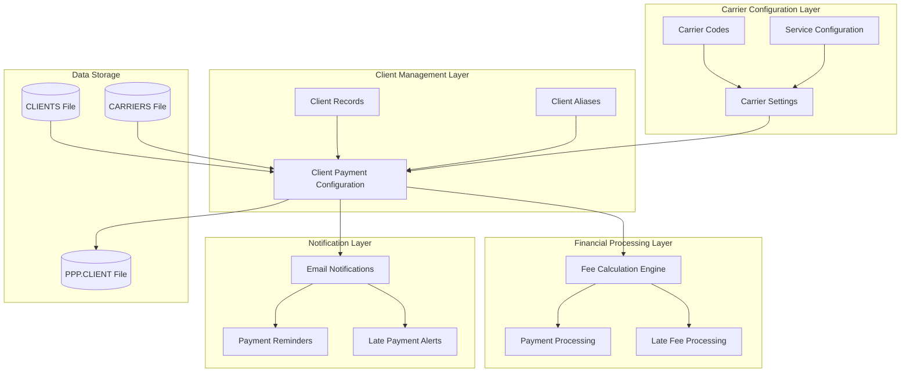
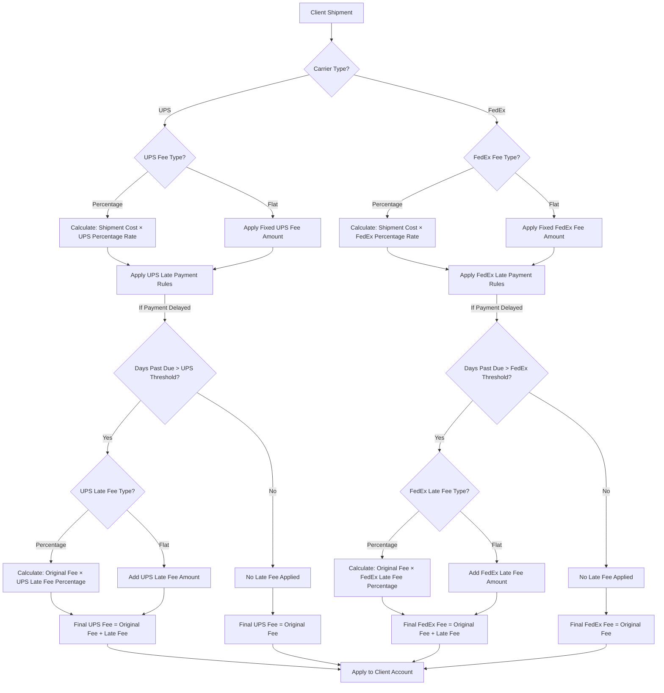
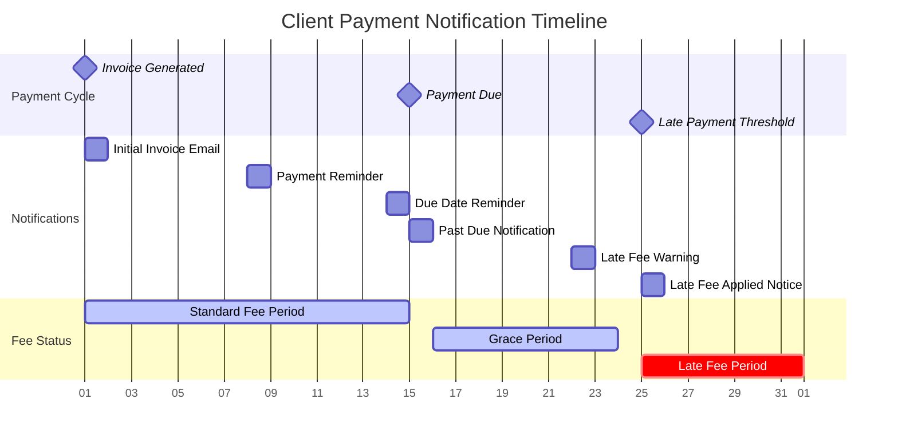

# Client Payment Configuration in AFS Shreveport

## Overview of Client Payment Configuration

The client payment configuration system in AFS Shreveport serves as the central mechanism for managing carrier-specific payment arrangements and fee structures. This system enables logistics administrators to define and maintain detailed payment parameters for clients enrolled in carrier programs, particularly the Pre-Paid Parcel Program (PPP). The configuration framework supports both UPS and FedEx carriers, allowing for customized fee structures, payment terms, and notification settings on a per-client basis. By centralizing these payment configurations, AFS Shreveport ensures consistent billing practices while accommodating client-specific requirements and carrier relationships. The system stores these configurations in the PPP.CLIENT file, which serves as the authoritative data source for payment processing, fee calculation, and notification workflows throughout the application.

## Client Payment Configuration Architecture

The architecture diagram illustrates how the client payment configuration integrates with other system components in AFS Shreveport. At its core, the payment configuration module connects client records with carrier settings to establish the foundation for financial processing. The system draws client information from the CLIENTS file and carrier details from the CARRIERS file to populate the configuration. Once established, these configurations drive fee calculations, payment processing, and automated notifications. The PPP.CLIENT file serves as the central data store for all payment configurations, maintaining the relationship between clients and their carrier-specific payment arrangements. This architecture enables the system to handle complex fee structures while providing the flexibility needed for client-specific payment terms and notification preferences.

## Pre-Paid Parcel Program Enrollment

The client enrollment process for the Pre-Paid Parcel Program begins with identifying eligible clients and establishing their carrier preferences. Administrators use the PPP.CLIENT.MAINT program to create new enrollment records, starting with the client identification and effective date configuration. The enrollment process requires selecting which carriers (UPS, FedEx, or both) the client will utilize within the program. For each selected carrier, the system captures the enrollment effective date, which determines when the configured payment arrangements become active.

The enrollment workflow is designed to be flexible, allowing administrators to configure carrier services independently. Clients may be enrolled in UPS services, FedEx services, or both simultaneously with different fee structures for each. The system validates client records against the master CLIENTS file to ensure only valid clients can be enrolled. Once the basic enrollment parameters are established, the system guides administrators through the configuration of fee structures, payment terms, and notification settings specific to each carrier relationship. This structured approach ensures all necessary parameters are captured before the enrollment is finalized and stored in the PPP.CLIENT file.

## Fee Structure Configuration

The AFS Shreveport system provides comprehensive options for configuring client fee structures across different carriers. For each carrier (UPS and FedEx), administrators can define whether fees should be calculated as a percentage of the shipment cost or as a flat fee amount. This flexibility accommodates various business models and client agreements.

For percentage-based fees, administrators enter the percentage value that will be applied to the shipment cost to calculate the service fee. This approach is typically used for clients with varying shipment values where the fee should scale proportionally with the cost. For flat fee structures, administrators specify a fixed monetary amount that will be charged regardless of the shipment value, providing predictability for clients with consistent shipping patterns.

The system supports carrier-specific configurations, allowing different fee structures for UPS and FedEx services within the same client account. For example, a client might be configured with a percentage-based fee for UPS shipments (e.g., 3.5% of shipment value) while using a flat fee structure for FedEx services (e.g., $5.00 per shipment). Additionally, the system allows for reminder fee configurations that can differ from the standard service fees, enabling escalating fee structures for payment reminders and late payments. All fee configurations are stored with precision up to three decimal places to accommodate detailed financial calculations.

## Fee Calculation Workflow

The fee calculation workflow in AFS Shreveport demonstrates how different fee types are calculated and applied to client shipments. When a shipment is processed, the system first identifies the carrier (UPS or FedEx) and retrieves the client's carrier-specific fee configuration. For percentage-based fees, the system multiplies the shipment cost by the configured percentage rate. For flat fees, the system simply applies the fixed amount regardless of shipment value.

The workflow also incorporates late payment handling. If a payment is delayed, the system checks whether the number of days past due exceeds the configured threshold for the specific carrier. When the threshold is exceeded, late fees are calculated according to the configured type (percentage or flat) and added to the original fee amount. This comprehensive approach ensures accurate fee calculation based on client-specific configurations while enforcing payment terms through automated late fee assessment. The final calculated fees are then applied to the client account for billing and reporting purposes.

## Payment Terms and Late Payment Settings

The payment terms and late payment settings in the AFS Shreveport system provide a robust framework for managing client payment expectations and consequences for delayed payments. For each carrier relationship, administrators can define specific payment terms that dictate when payments are due. For FedEx services, the system captures the number of days allowed for payment, creating a clear timeline for financial obligations.

Late payment settings are configured separately for each carrier, allowing for customized enforcement policies. Administrators define a grace period (number of days) after which late payment penalties are triggered. Once this threshold is exceeded, the system applies the configured late payment fee according to the specified type (percentage or flat) and amount. For percentage-based late fees, the system calculates a percentage of the original fee or shipment cost. For flat late fees, a fixed monetary amount is added regardless of the original transaction value.

The system supports different late payment configurations for UPS and FedEx within the same client account, accommodating varying carrier policies and client agreements. These settings are stored alongside the basic fee structure in the client's payment configuration record, ensuring consistent application of payment terms across all transactions. By providing this level of detail in payment term configuration, AFS Shreveport enables precise financial management while maintaining flexibility for client-specific arrangements.

## Notification and Communication Settings

The notification and communication settings in the AFS Shreveport client payment configuration system provide comprehensive control over how and when clients receive payment-related communications. Administrators can configure email notification frequencies to determine the cadence of payment reminders and alerts. These settings allow for customized communication strategies based on client preferences and payment behaviors.

The system captures client email addresses specifically for payment notifications, which may differ from general contact information. This separation ensures that financial communications reach the appropriate personnel within client organizations. Additionally, administrators can specify contact names associated with these email addresses, personalizing communications and ensuring they're directed to the right individuals.

Notification settings work in conjunction with payment terms and late payment configurations to create a coordinated communication strategy. For example, reminder notifications can be scheduled based on approaching due dates, while late payment alerts are triggered when payments exceed the configured thresholds. The system also supports reminder fee notifications, informing clients of additional charges that may be applied due to payment delays. These comprehensive notification settings ensure clients remain informed about their payment obligations while providing administrators with tools to manage communication effectively and consistently across all client relationships.

## Payment Notification Timeline

The Payment Notification Timeline illustrates the sequence and timing of communications triggered by the client payment configuration system. Starting with the invoice generation, the system follows a structured communication plan based on configured alert settings. The timeline shows how notifications are strategically timed around key milestones in the payment cycle.

After invoice generation, an initial notification is sent to the client's configured email address. As the payment due date approaches, the system sends reminder notifications based on the configured email frequency settings. Once the payment due date passes without payment, past due notifications are triggered. If payment remains outstanding and approaches the late payment threshold (configured separately for UPS and FedEx), the system sends late fee warnings to give clients a final opportunity to pay before penalties are applied.

When the late payment threshold is exceeded, the system automatically applies the configured late fees and sends notifications informing the client of these additional charges. This timeline demonstrates how the notification system works in concert with payment terms and fee configurations to create a comprehensive communication strategy that encourages timely payments while keeping clients informed throughout the process. The frequency and timing of these notifications are all driven by the client-specific settings stored in the PPP.CLIENT file.

## Client-Carrier Relationship Management

The AFS Shreveport system employs a sophisticated approach to managing and maintaining relationships between clients and their authorized carriers. The client payment configuration module serves as the central repository for these relationships, defining which carriers are authorized for each client and the specific payment arrangements associated with each carrier. This relationship management is critical for ensuring that shipments are processed according to established agreements and that fees are calculated correctly.

For each client, the system maintains separate configurations for UPS and FedEx services, allowing administrators to enable or disable specific carrier relationships as needed. When a carrier is enabled for a client, the system captures all relevant payment parameters, creating a comprehensive profile that governs how transactions with that carrier are handled. These configurations can be updated as relationships evolve, with effective dates ensuring that changes are applied at the appropriate time.

The system also supports the management of carrier-specific client account numbers through integration with the EDI.CAR.ACNT.XREF file, establishing cross-references between internal client identifiers and carrier-specific account numbers. This integration ensures accurate identification and billing across systems. By centralizing client-carrier relationship data, AFS Shreveport provides a single source of truth for payment processing, reporting, and auditing functions, while maintaining the flexibility to accommodate the unique requirements of each client-carrier relationship.

## Data Persistence and Record Management

The client payment configuration system in AFS Shreveport implements a robust approach to data persistence and record management centered around the PPP.CLIENT file. This file serves as the primary data store for all client payment configurations, with each record identified by the client's unique identifier. The system uses a structured array (CLIENT.PPP) to organize configuration data, with specific array elements mapped to different configuration parameters such as effective dates, fee types, fee amounts, and notification settings.

When administrators create or modify client payment configurations, the system performs validation checks to ensure data integrity before persisting changes. The MATWRITE command is used to write the entire configuration array to the PPP.CLIENT file in a single atomic operation, maintaining data consistency. For existing clients, the system first retrieves the current configuration using MATREAD, allowing administrators to modify specific parameters while preserving other settings.

The data structure supports up to 30 configuration elements per client, providing room for future expansion while maintaining backward compatibility. Key configuration elements include effective dates (element 1), carrier flags (elements 2 and 5), fee types (elements 3, 6, 12, 15, and 18), fee amounts (elements 4, 7, 13, 16, and 19), and communication settings (elements 9, 10, and 11). This structured approach to data persistence ensures that client payment configurations are stored consistently and can be efficiently retrieved for payment processing, reporting, and administrative functions.

## Security and Access Control

The implementation of security and access controls in the client payment configuration system ensures that only authorized personnel can create or modify payment arrangements. The system employs a multi-layered approach to security, starting with user authentication through the standard AFS Shreveport login process. Once authenticated, users attempting to access the payment configuration functionality undergo additional authorization checks based on their operator flags.

The system specifically checks the 43rd flag in the operator record (OP.FLG[1,1]) to determine if a user has permission to access the payment configuration module. Users without the appropriate flag are presented with a "Restricted Access Application" message and denied entry. This granular permission system allows administrators to precisely control which staff members can manage payment configurations, separating these sensitive financial functions from general system access.

For authorized users, the system provides different operational modes, including a lookup-only mode that allows viewing configurations without making changes. This capability supports audit and review processes without risking accidental modifications. All configuration changes are tracked through standard system logging, creating an audit trail of who made changes and when. By implementing these comprehensive security measures, AFS Shreveport ensures that client payment configurations—which directly impact financial transactions and client relationships—are protected from unauthorized access while remaining accessible to appropriate personnel for legitimate business purposes.

[Generated by the Sage AI expert workbench: 2025-05-28 08:06:19  https://sage-tech.ai/workbench]: #