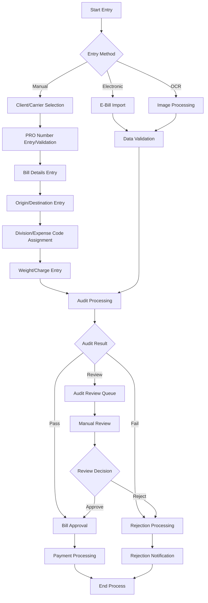
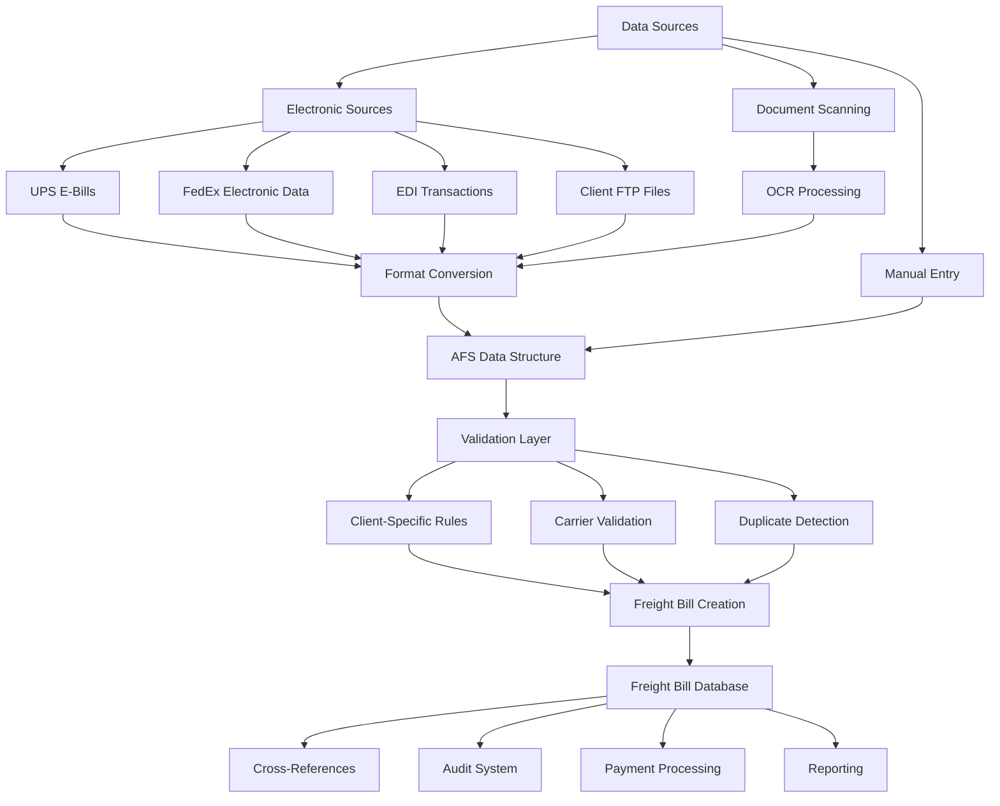
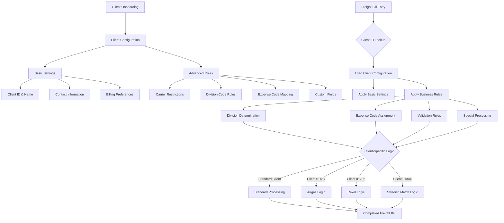

# Freight Bill Entry in AFS Shreveport

## Overview of Freight Bill Entry

The freight bill entry process in AFS Shreveport serves as the cornerstone of the platform's logistics management capabilities. This process enables the systematic creation, processing, and auditing of freight bills for both clients and carriers. The system captures essential shipping information including carrier details, PRO numbers, origin/destination data, weights, and charges, then applies sophisticated business rules to validate, calculate, and process these bills. AFS Shreveport's freight bill entry functionality supports multiple transportation modes (LTL, Truckload, Air Freight), integrates with electronic data sources, and implements client-specific customizations to meet diverse business requirements across industries.

## Core Freight Bill Entry Workflow

The freight bill entry process in AFS Shreveport follows a structured workflow that ensures accuracy, compliance, and efficiency. The process begins with client and carrier selection, where users identify the relevant parties for the shipment. Next, PRO number validation occurs, checking for proper formatting based on carrier-specific rules and preventing duplicate entries. The system then captures essential shipping details including bill dates, origin/destination information, and weights.

Once basic information is entered, the system applies client-specific business rules to determine appropriate division codes and expense allocations. The platform then calculates carrier charges, applies discounts, and identifies potential variances. A sophisticated audit process validates rates against contracts, identifies misroutes, and flags bills requiring additional review. Finally, the system assigns appropriate status codes (approved, rejected, pending) and routes bills for payment processing or exception handling.

Throughout this workflow, the system maintains comprehensive audit trails, cross-references between related documents (BOLs, invoices), and supports both manual and automated entry paths.

## Freight Bill Entry Process Flow

The diagram illustrates the comprehensive freight bill entry process in AFS Shreveport. The workflow begins with three possible entry methods: manual entry by operators, electronic import via EDI or e-bills, or OCR-assisted entry from scanned documents. Each path converges at the audit processing stage, where sophisticated business rules validate rates, identify misroutes, and determine if bills should be approved, rejected, or flagged for manual review. The system maintains detailed tracking throughout the process, ensuring proper handling based on client-specific requirements and carrier agreements.

## Electronic Data Import Capabilities

AFS Shreveport's electronic data import capabilities form a crucial component of its freight bill entry system, enabling the automated processing of carrier billing data from multiple sources. The platform supports sophisticated e-bill conversion processes for major carriers like UPS and FedEx, transforming their proprietary formats into standardized freight bill records. The CONVERT.UPS.EBILL program exemplifies this functionality, processing UPS electronic billing files by parsing CSV data, mapping fields to the AFS system, and applying client-specific business rules for expense coding.

The system implements EDI (Electronic Data Interchange) processing to handle standardized electronic transactions from various carriers and partners. For specialized carriers, custom import utilities like LOAD.LSO.FP.DATA and LOAD.KILL.FP.DATA transform carrier-specific formats into the AFS data structure. The platform also supports batch processing of multiple files, with sophisticated validation to prevent duplicate processing and ensure data integrity.

A key strength of the import system is its ability to handle client-specific requirements, including custom expense code assignments, division mapping, and special handling for different shipping scenarios (inbound, outbound, third-party). The system also maintains cross-references between carrier tracking numbers and internal bill identifiers, facilitating seamless tracking and reconciliation throughout the billing lifecycle.

## Bill of Lading Integration

The AFS Shreveport system implements comprehensive Bill of Lading (BOL) integration within its freight bill entry process, creating a seamless connection between shipping documentation and billing records. The FB.2.1.BOL.NEW subroutine enables users to enter, edit, and verify BOL numbers during freight bill creation, with client-specific validation rules ensuring data accuracy. When BOL data is available electronically, the FB.IMPORT.FTP.BOL program processes files received via FTP, extracting shipping details like origin/destination addresses, weights, and reference numbers.

The system maintains sophisticated cross-referencing between BOLs and freight bills through the FB.BOL.CRX and FB.BOL.REFNO.XREF files, enabling bidirectional lookups. This integration allows for automatic population of freight bill fields from BOL data, including division codes, expense allocations, and shipping details. For clients with specialized requirements, like Swedish Match or Robroy, custom import programs (FB.IMPORT.SM.BOL, FB.IMPORT.RR.BOL) handle unique file formats and business rules.

The BOL integration supports expense code distribution based on BOL data, with the ability to allocate costs across multiple divisions or departments. The system also validates shipping terms, detects discrepancies between BOL and carrier information, and flags potential issues for review. This comprehensive integration ensures consistency between shipping documentation and billing records, reducing errors and streamlining the freight payment process.

## Data Sources and Integration Points

The diagram illustrates the comprehensive data sources and integration points in the AFS Shreveport freight bill entry system. Data enters the system through three primary channels: electronic sources (including UPS e-bills, FedEx electronic data, EDI transactions, and client FTP files), manual entry by operators, and document scanning with OCR processing. All data undergoes format conversion to fit the standardized AFS data structure.

Once in the system, data passes through a validation layer that applies client-specific rules, performs carrier validation, and detects potential duplicates. Successfully validated data becomes freight bills in the database, which connects to cross-reference systems, audit processing, payment workflows, and reporting functions. This integrated approach ensures data consistency and accuracy throughout the freight bill lifecycle.

## Validation and Error Handling

AFS Shreveport implements a robust validation and error handling framework within its freight bill entry process to ensure data integrity and compliance with business rules. The system performs multi-layered validation starting with basic field checks for required information and proper formatting. Carrier validation verifies that the selected carrier is active and authorized for the client, while PRO number validation ensures proper formatting according to carrier-specific patterns and checks for duplicates across the system.

For electronic imports, the system validates file integrity and structure before processing, with programs like CONVERT.UPS.EBILL implementing checks to prevent processing incomplete or corrupted files. The platform detects potential duplicate bills through sophisticated matching algorithms that consider carrier, PRO number, bill date, and amount combinations.

Error handling includes both preventive measures and exception processing. When validation fails, the system provides specific error messages to guide users toward correction. For electronic imports, validation failures trigger email notifications to administrators with detailed error reports. The system also implements "soft" validation that flags potential issues without blocking processing, allowing for human review of edge cases.

Client-specific validation rules are a key strength of the system, with customized checks based on business requirements. These include carrier restrictions, division code validation, and expense code rules tailored to each client's needs. The validation framework also supports special handling for international shipments, including duty calculation and address validation for Canadian postal codes.

## Expense Code Management

Expense code management in AFS Shreveport represents a sophisticated component of the freight bill entry process, enabling precise allocation of shipping costs according to client-specific accounting requirements. The system determines appropriate expense codes through a multi-faceted approach that considers shipping direction (inbound/outbound/third-party), carrier type, division codes, and special handling requirements.

For electronic imports, programs like CONVERT.UPS.EBILL implement extensive client-specific logic to map carrier service codes and accessorial charges to appropriate expense codes. This mapping can be highly granular, with different rules based on division regions, shipping locations, and reference fields. The system supports both standard expense codes and client-specific custom codes, maintained in reference tables for consistent application.

The platform enables expense distribution across multiple cost centers or departments, with percentage-based allocation for shared expenses. For clients with specialized requirements, the system supports GL code mapping that translates AFS expense codes to client-specific general ledger accounts. The FB.2.1.LINE.ITEMS subroutine manages the entry and validation of line items with their associated expense codes, ensuring proper categorization of freight charges, fuel surcharges, accessorials, and other costs.

Expense code management also includes validation against client-authorized codes, preventing unauthorized charges from being processed. The system maintains audit trails of expense code assignments and modifications, supporting financial reconciliation and reporting requirements. This comprehensive approach to expense code management ensures accurate cost allocation and financial reporting while accommodating the diverse accounting needs of AFS clients.

## Client-Specific Customization Framework

The diagram illustrates AFS Shreveport's comprehensive client-specific customization framework for freight bill entry. The process begins with client onboarding, where both basic settings (client ID, contact information, billing preferences) and advanced rules (carrier restrictions, division codes, expense mapping, custom fields) are configured.

During freight bill entry, the system identifies the client and loads their specific configuration. This activates a set of business rules that determine how division codes are assigned, expense codes are mapped, validation is performed, and special processing is applied. The framework includes specialized logic paths for specific clients like Airgas (01457), Rexel (01706), and Swedish Match (01344), each with unique requirements and processing rules.

This flexible architecture allows AFS to maintain a single core application while accommodating diverse client needs through configuration rather than code changes, ensuring consistent processing with client-specific customizations.

## Audit and Rejection Processing

Audit and rejection processing form a critical component of the AFS Shreveport freight bill entry system, ensuring accuracy and compliance with contractual terms. The audit process begins during bill entry, where the system automatically calculates expected rates based on contracts and benchmarks, then compares them against carrier charges to identify variances. This real-time audit can detect misroutes, where shipments were sent through non-preferred carriers, and calculate potential savings.

When discrepancies are identified, the system routes bills through different paths based on severity and client preferences. Bills may be automatically approved if variances fall within acceptable thresholds, sent to an audit review queue for manual verification, or automatically rejected with appropriate reason codes. The FB.2.1.NW program implements this logic, determining the appropriate audit workflow based on client configuration, carrier type, and variance amounts.

Rejection processing includes comprehensive reason code assignment, with codes like "incorrect rate," "duplicate bill," or "unauthorized carrier." The system maintains detailed rejection history and supports eventual payment workflows for bills that were initially rejected but later approved with corrections. For client-specific scenarios, the CHANGE.CLIENT.REJECTIONS utility allows administrators to transfer rejected freight bills between clients when necessary.

The audit system also supports specialized validation for different transportation modes (LTL, Truckload, Air) and implements client-specific audit rules based on business requirements. Throughout the process, the system maintains detailed audit trails, tracking who reviewed bills, what changes were made, and the final disposition of each freight bill.

## Performance Metrics and Productivity

AFS Shreveport implements comprehensive performance metrics and productivity tracking for its freight bill entry operations, enabling continuous process improvement and resource optimization. The FB.4.12.7 program generates detailed Excel spreadsheets analyzing keyer performance, tracking metrics like characters keyed, bills processed, and hourly rates. This analysis distinguishes between different bill types (paper vs. EDI) and locations, providing management with actionable insights into operational efficiency.

The system captures granular productivity data through the EMP.HR.PERF file, recording timestamps, character counts, and bill counts for each user. The FB.4.12.9 program extends this analysis to hourly breakdowns, identifying peak productivity periods and potential bottlenecks. These metrics support both individual performance evaluation and team-level resource allocation decisions.

Productivity analysis includes quality metrics alongside quantity measures, tracking error rates, rejection percentages, and rework requirements. The system distinguishes between different processing activities (entry, verification, auditing) to provide a comprehensive view of the end-to-end process. Management reports include trend analysis over time, allowing for identification of improvement opportunities and measurement of process changes.

The performance tracking system also supports automation rate analysis, measuring the percentage of bills processed through electronic means versus manual entry. This helps prioritize automation initiatives for carriers or clients with high manual processing requirements. By maintaining detailed productivity metrics, AFS Shreveport can optimize staffing levels, identify training needs, and continuously improve the efficiency of its freight bill entry operations.

## Supporting Functions and Utilities

AFS Shreveport's freight bill entry system is enhanced by numerous supporting functions and utilities that streamline operations and ensure data accuracy. ZIP code validation is a fundamental component, with the FB.READ.ZIP subroutine retrieving city and state information for entered ZIP codes, supporting both US and Canadian postal formats. For problematic ZIP codes, the FB.1.11.18 utility enables administrators to define substitution relationships between "bad" and "good" ZIP codes, ensuring proper routing and rate calculations.

Location standardization is implemented through utilities like SET.CITY, which normalizes city and state names by removing common prefixes (North, South) and handling special cases like cross-border cities. This standardization ensures consistent location data for reporting and rate calculations. The FB.2.1.CSZ.NEW subroutine provides an interactive interface for entering and validating city, state, and ZIP information during bill entry.

Note management is supported through programs like FB.11.14 and FB.CC.NOTES, allowing users to attach, view, and manage notes associated with freight bills. These notes capture important context, special handling instructions, and communication history related to specific shipments. The system maintains user attribution and timestamps for all notes, creating an audit trail of communications.

Additional supporting utilities include BUILD.FB.REC for creating standardized freight bill records, UPD.FB.BILLS.CRX for maintaining cross-references between related records, and FORMAT.PROS for standardizing carrier PRO numbers according to carrier-specific formatting rules. These utilities work together to ensure data consistency, facilitate efficient processing, and support the complex workflows required for comprehensive freight bill management.

[Generated by the Sage AI expert workbench: 2025-05-28 08:06:13  https://sage-tech.ai/workbench]: #